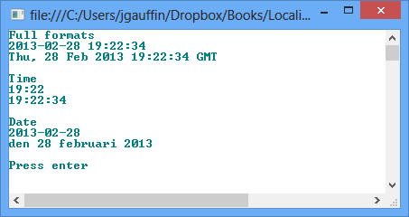
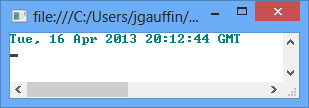
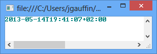
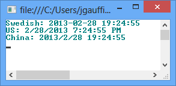
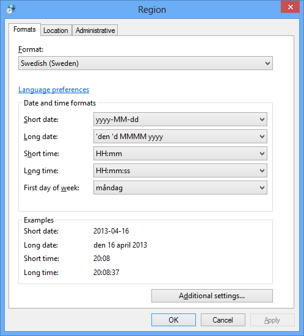
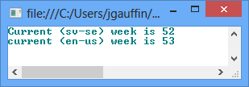
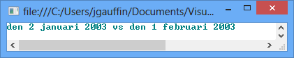
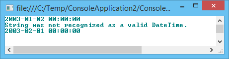
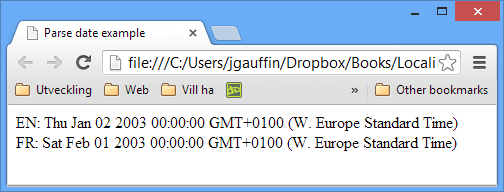

# 第二章日期和时间

日期和时间设置可能看起来微不足道，但实际上它们变化很大。如果没有合适的库解析日期，时间字符串将会很混乱。

字符串“ *1/2/2003* ”实际上可以解释为一月的第二天和二月的第一天，这取决于你住在哪个国家。在瑞典，我们根本不使用这种格式，而是使用“ *2003-02-01* ”(是的，应该包括零)。

至于时间，它通常只在应该使用 12 小时还是 24 小时格式上有所不同。

## 标准格式

有一个国际标准化组织标准规定了日期和时间的格式。这个标准叫做 [ISO8601](http://en.wikipedia.org/wiki/ISO_8601) 。共同点是顺序应该从最高有效到最低有效。

日期的格式应为:

年月日=> 2013-05-13

时间应格式化为:

HH:MM:SS => 23:00:10

最后是组合:

YYYY-MM-DDTHH:MM:SS = > 2013-05-13t 23:00:10

## 字符串表示

有时，您必须将日期表示为字符串，通常是当您通过某种应用编程接口与其他系统交换信息或使用用户界面绑定时。

仅使用“2013-01-01 01:39:20”这样的日期/时间字符串是不明确的，因为无法知道日期是在哪个时区。因此，您必须使用消除歧义的格式。

我建议您使用以下两种格式之一。

### RFC1123

第一种格式来自 [RFC1123](http://www.ietf.org/rfc/rfc1123.txt) ，被 [HTTP](http://www.w3.org/Protocols/rfc2616/rfc2616-sec3.html#sec3.3.1) 等互联网协议使用。看起来是这样的:

2013 年 5 月 13 日星期一格林尼治时间 20:46:37

HTTP 要求您始终使用 GMT 作为时区，而原始规范允许您使用 [RFC822](http://www.w3.org/Protocols/rfc822/) 中指定的任何时区。我通常遵循 HTTP，因为它使处理更容易(即，除了在用户交互中，在任何地方都使用 UTC 稍后对此进行更多描述)。

### RFC3339

[RFC3399](http://www.ietf.org/rfc/rfc3339.txt) 基于几个标准，如 [ISO8601](http://en.wikipedia.org/wiki/ISO_8601) 。其目的是使日期规则不那么模糊。它甚至包括解释 ISO8601 使用的格式的 ABNF 语法。

简单来说:在日期和时间之间使用字母“T”，并用从 UTC 开始的时区偏移量结束字符串。UTC 本身是用 Z 作为后缀来表示的。

世界协调时时间:

2013-05-13T20:46:37Z

中欧时间

2013-05-13T20:46:37+01:00

## 。网

日期/时间格式由`CultureInfo.CurrentCulture`属性控制。尽量避免使用自己的格式(即手动指定格式)，因为它很少适用于不同的区域性。相反，只需确保指定了正确的区域性，并使用下面演示的格式化方法。

```cs
   var currentTime = DateTime.Now;
   Console.WriteLine("Full formats");
   Console.WriteLine(currentTime.ToString());
   Console.WriteLine(currentTime.ToString("R"));
   Console.WriteLine();
   Console.WriteLine("Time");
   Console.WriteLine(currentTime.ToShortTimeString());
   Console.WriteLine(currentTime.ToLongTimeString());

   Console.WriteLine();
   Console.WriteLine("Date");
   Console.WriteLine(currentTime.ToShortDateString());
   Console.WriteLine(currentTime.ToLongDateString());
   Console.WriteLine();

```

结果如下图所示。



图 7:标准 ToString()格式

### RFC1123

可以使用`DateTime.ToString()`的一些格式化程序，例如“R”，它将返回一个 RFC1123 时间，如前一节所述。

```cs
   Console.WriteLine(DateTime.UtcNow.ToString("R"));

```

输出结果是:



图 8:作为 RFC1123 的 UtcNow

请注意，“R”表示无论您在哪个时区，日期都是格林尼治时间。因此，使用`UtcNow`非常重要，如上例所示。我将在下一章回到世界协调时/格林尼治时间的含义。

### RFC3339

由于 C#中的`DateTime`结构没有时区信息，不可能生成合适的 RFC3339 字符串。

下面的代码使用了本书附录中定义的扩展方法。

```cs
   var cetTime = DateTime.Now.ToRFC3339("W. Europe Standard Time");

```

该代码生成以下字符串(夏令时处于活动状态):



图 9: RFC3339

时区将在后面的章节中详细讨论。

### 按文化格式化

您也可以通过显式指定区域性来设置日期格式。

```cs
   var currentTime = DateTime.Now;

   var swedish = new CultureInfo("sv-se");
   Console.WriteLine("Swedish: {0}", currentTime.ToString(swedish));

   var us = new CultureInfo("en-us");
   Console.WriteLine("US: {0}", currentTime.ToString(us));

   var china = new CultureInfo("zh-CN");
   Console.WriteLine("China: {0}", currentTime.ToString(china));

```

结果如下:



图 10:不同文化中的时间

如果您有兴趣了解每种文化如何格式化其日期，请转到控制面板并打开**区域**小程序，如下图所示:



图 11:区域设置的控制面板

只需选择一个新的区域性来查看其格式。



图 12:日期格式

### 解析日期

解析日期可能是一个挑战，尤其是如果您事先不知道用户系统上的区域性，或者它与应用程序服务器中的区域性不同(例如在 web 应用程序中)。

下面是一个简单的例子，展示了如何不同地解释完全相同的字符串。

```cs
   class Program
   {
       static void Main(string[] args)
       {
           var date = DateTime.Parse("1/2/2003", new CultureInfo("sv"));
           var date2 = DateTime.Parse("1/2/2003", new CultureInfo("fr"));
           Console.WriteLine(date.ToLongDateString() + " vs " + date2.ToLongDateString());
       }
   }

```

示例输出为:



图 13:不同区域性的不同日期格式

解析器非常宽容，因为“1/2/2003”在瑞典不是有效的日期字符串。真正的格式是“YYYY-MM-DD”。这也说明了另一个问题:如果有人让我在精神上解析“1/2/2003”，我会说 2 月 1 日，而不是别的。

宽容的解析器可能是一种诅咒，因为它可能会错误地解释值。因此，你可能认为你有一个正确的日期，而你没有。

如果您知道格式的种类(如长格式或短格式)，您可以强制进行精确解析:

```cs
   class Program
   {
       static void Main(string[] args)
       {
           var swedishCulture = new CultureInfo("sv-se");

           // incorrect
           var date = DateTime.Parse("1/2/2003", swedishCulture);
           Console.WriteLine(date);

           // throws an exception
           try
           {
               var date2 = DateTime.ParseExact("1/2/2003",
                   swedishCulture.DateTimeFormat.ShortDatePattern,
                   swedishCulture);
           }
           catch (Exception ex)
           {
               Console.WriteLine(ex.Message);
           }

           // OK.
           var date3 = DateTime.ParseExact("2003-02-01",
               swedishCulture.DateTimeFormat.ShortDatePattern,
               swedishCulture);
           Console.WriteLine(date3);

           Console.ReadLine();
       }
   }

```



图 14:日期解析

请注意，格式是从。NET，它不是我通过字符串常量提供的。这是绕过宽容解析器以确保解析值正确的好方法。

## JavaScript

我们使用全球化插件来处理网页中的日期/时间。

```cs
   <html>
   <head>
       <title>Parse date example</title>
       <script src="http://ajax.aspnetcdn.com/ajax/jquery/jquery-1.9.0.min.js"></script>
       <script src="http://ajax.aspnetcdn.com/ajax/globalize/0.1.1/globalize.min.js"></script>
       <script src="http://ajax.aspnetcdn.com/ajax/globalize/0.1.1/cultures/globalize.cultures.js"></script>
   </head>
   <body>
       <script type="text/javascript">

           Globalize.culture("en");
           var enResult = Globalize.parseDate("1/2/2003", null, "fr");
           Globalize.culture("fr");
           var frResult = Globalize.parseDate("1/2/2003");

           document.writeln("EN: " + enResult + "<br>");
           document.writeln("FR: " + frResult + "<br>");

       </script>
   </body>
   </html>

```

结果是:



图 15:全球化的数据输出

您也可以将区域性作为参数传递:

```cs
   <script type="text/javascript">
       var enResult = Globalize.parseDate("1/2/2003", null, "en");
       var frResult = Globalize.parseDate("1/2/2003", null, "fr");

       document.writeln("EN: " + enResult + "<br>");
       document.writeln("FR: " + frResult + "<br>");
   </script>

```