# 第四章时区

全世界的时间都不一样。当我下班回家时(在瑞典)，纽约的市民正在吃午饭。

棘手的部分是在同一个应用程序中处理不同的时区。

## 世界协调时

世界协调时是地面零点。这是所有其他时区所基于的时区。它也被称为格林尼治标准时间。然而，纯粹主义者不鼓励你使用格林尼治标准时间名称，因为它不如世界协调时精确。它没有闰秒的定义来补偿地球缓慢的自转。

不同的时区如下所示:

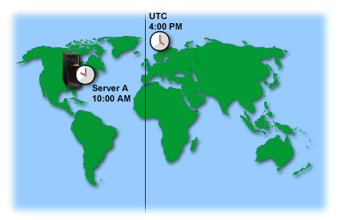

图 21:时区(图片由 [IBM](http://publib.boulder.ibm.com/infocenter/iseries/v5r3/index.jsp?topic=%2Frzati%2Frzatiutc.htm) 提供)

世界协调时不支持夏令时。事实上，大多数国家不遵守夏令时。下图说明了这一点。

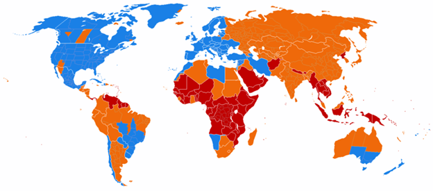

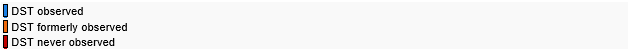

图 22: DST 用法(图片由 [*【维基百科】*](http://en.wikipedia.org/wiki/Daylight_saving_time) 提供)

## 处理不同时区

如果您想为不同时区的用户显示日期，但存储用户(或客户端应用程序)输入的日期，这可能会变得复杂。你有没有访问过一个在线论坛，在那里你想知道日期/时间真正代表了什么？参见下图。

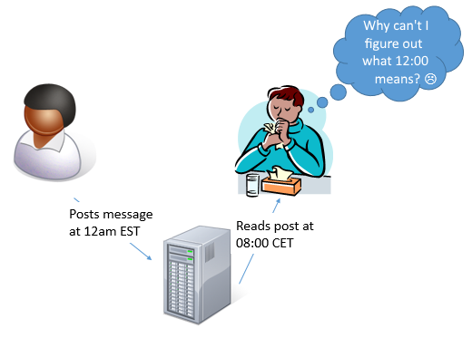

图 23:时区混乱

问题的答案是，12:00 意味着美国用户在一小时前发布了这条消息。

因此，一个好的做法是在应用程序内部始终使用世界协调时。它简化了处理，因为您永远不必考虑您当前代表的是哪个时区。除了在两个不同的用户时区之间转换之外，它还消除了任何转换的需要。

您应该只在用户交互中使用本地时间，比如在显示日期或让用户在表单中指定日期时。

下图说明了我的意思。

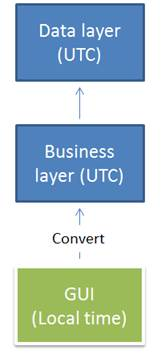

图 24:应用程序中本地时间和世界协调时时间的使用

这种方法的好处是，无论哪个用户保存了条目，用户都可以使用自己的时区查看时间和日期。

## 客户端/服务器指南

对于客户机/服务器，我指的是所有形式的通信，在这些通信中，您可以发送或接收来自另一个进程的信息，比如使用 REST(表示状态传输)API 或像 MSMQ(微软消息队列)这样的消息传递系统。

我建议您在为客户消费或提供信息时使用世界协调时。您可能知道客户端应用程序的位置，但是您知道客户端应用程序用户的位置吗？

因此，最好公开 UTC，让客户端决定是否进行时区转换。

此外，明确表示您希望在客户端发送的所有请求中获得 UTC。

## 。网

`DateTime`结构并没有具体说明是什么时区。它只包含日期/时间。这实际上是一个非常好的决定，因为任何其他事情都可能导致混乱。在不同时区的两个日期/时间之间执行加法会有什么样的结果？

|  | 提示:在开发应用程序时测试您的时区处理。右键单击系统中的时钟，选择“调整日期和时间”更改时区。 |

请注意。NET Framework 提供了日期/时间结构，支持时区(`DateTimeOffset`)。在需要它的应用程序中使用它，比如为 Windows 8、WinRT 和 Windows Phone 开发的应用程序。

在其他情况下，避免它可能是有意义的，因为大多数开发人员更习惯于**日期时间**。在这些情况下，如前所述，在内部使用世界协调时可能更简单。

### 列出时区

使用`System.TimeZoneInfo`类可以列出所有可用的时区。它将返回所有可用的时区。

```cs
   class Program
   {
       static void Main(string[] args)
       {
           foreach (var timeZone in TimeZoneInfo.GetSystemTimeZones())
           {
               Console.WriteLine(timeZone.DisplayName);
            }
        }
    }

```

结果如下:

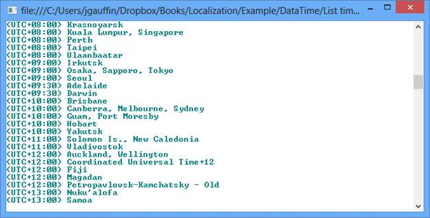

图 25:时区列表结果

`System.TimeZoneInfo`类可用于执行以下操作:

*   检索所有先前定义的时区:`TimeZoneInfo`。GetSystemTimeZones()
*   在两个时区之间转换日期/时间:`TimeZoneInfo`。ConvertTime()
*   创建一个新的时区(如果在预定义的时区中缺失)。

### 胖客户端中的转换

如果您正在 fat 客户端上运行桌面应用程序(如 WPF)，您可以获得当前时区(即操作系统中为当前用户配置的时区)，如下所示:

```cs
   class Program
   {
       static void Main(string[] args)
       {
           var zone = TimeZone.CurrentTimeZone;
           Console.WriteLine("I'm in timezone '{0}'", zone.StandardName);
           Console.WriteLine("Daylight saving time is on? {0}",
                zone.IsDaylightSavingTime(DateTime.Now));
        }
    }

```

结果如下:

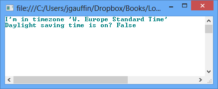

图 26:钻杆测试检查的结果

你可以这样做转换:

```cs
   class Program
   {
       static void Main(string[] args)
       {
           var currentTime = DateTime.Now;
           Console.WriteLine("Local time: '{0}'", currentTime);

           var universal = currentTime.ToUniversalTime();
           Console.WriteLine("Universal time '{0}'", universal);

           var localAgain = universal.ToLocalTime();
           Console.WriteLine("Local time '{0}'", localAgain);
        }
    }

```

结果是:

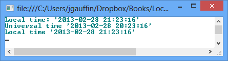

图 27:世界协调时到当地时间的转换

### 客户端/服务器中的转换

客户端并不总是一个可以向您提供世界协调时时间的. NET 应用程序。但是，客户端需要以某种方式提供时区，要么使用名称，如“西欧标准时间”，要么使用基本偏移量(无夏令时)，如“01:00”

如果您获得了这些信息，您可以做类似的事情(使用附录中的扩展方法):

```cs
   class Program
   {
       static void Main(string[] args)
       {
           // local time specified by the user
           var dt = new DateTime(2013, 5, 14, 19, 46, 00);

           // if the user is in central Europe
           var cet = dt.ToUniversalTime(TimeSpan.FromHours(1));
           var cet2 = dt.ToUniversalTime("W. Europe Standard Time");

           // if the user is in PST
           var pst = dt.ToUniversalTime(TimeSpan.FromHours(-8));
           var pst2 = dt.ToUniversalTime("Pacific Standard Time");

           // the standard .NET way
           var cet3 = new DateTimeOffset(dt, TimeSpan.FromHours(1)).ToUniversalTime();
           var pst3 = new DateTimeOffset(dt, TimeSpan.FromHours(-8)).ToUniversalTime();
       }
    }

```

## JavaScript

Web 应用程序类似于客户机/服务器应用程序，只是您无法控制客户机。我们也有同样的问题，但是我们无法控制客户端默认发送给我们的内容。

由于 web 应用程序是基于客户端/服务器的，我们依赖于以下选项之一:客户端向我们提供用户时区，或者客户端自动将日期和时间转换为世界协调时/从世界协调时转换。

问题是，HTTP 没有一个标准的报头可以为我们提供用户时区。这基本上意味着由我们来想办法处理时区。

不可能只使用 HTML 来处理时区。相反，我们必须使用 JavaScript。获取时区非常容易。我们可以为此使用 Date 对象，创建一个新的 HTML 页面并粘贴以下内容:

```cs
   <html>
   <body>
   <script type="text/javascript">

         document.write(new Date().getTimezoneOffset());

   </script>
   </body>
   </html>

```

我们得到以下结果:


图 28:时区偏移的 Javascript 输出

上面的例子将打印瑞典时区(UTC+1)的`-60`，因为我们必须减去 60 分钟才能得到 UTC 时间。有了这些知识，让我们做一个从当地时间到世界协调时的简单转换:

```cs
   <html>
   <body>
   <script type="text/javascript">

         var localTime = new Date();
         var utc = new Date(localTime.getTime() + localTime.getTimezoneOffset()*60000);
         document.writeln(localTime + "<br>");
         document.writeln(utc + "<br>");

   </script>
   </body>
   </html>

```

结果是:

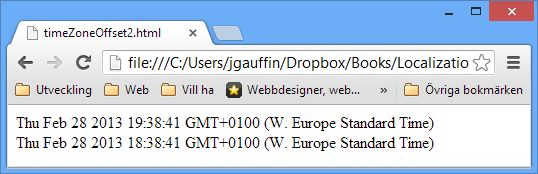

图 29:尝试更改时区

时间是对的，但是时区错了。我们没有提供时区，所以 JavaScript 只是认为我们想要显示当前时区的特定时间。

让我们通过创建一个明确指定时区的日期/时间来检查一下:

```cs
   <html>
   <body>
   <script type="text/javascript">

         var utc = new Date("Thu Feb 28 2013 19:38:41 GMT+0");
         document.writeln(utc + "<br>");

   </script>
   </body>
   </html>

```

结果如下:

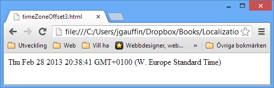

图 30:解析日期字符串

问题是，JavaScript 将始终隐式地将所有指定时间转换为用户时区。因此，如果我们不以其他方式处理世界协调时，它会很快变得令人困惑。

让我们做一个小的阐述。数字`1356350400000`表示从 1970 年 1 月 1 日到 2012 年 12 月 24 日 12:00 的秒数。这种数字叫做 UNIX 时间。如果我们用它创建一个 JavaScript `Date()`对象会发生什么？

```cs
   <html>
   <body>
   <script type="text/javascript">

         var time = new Date(1356350400000);
         document.writeln(time + "<br>");

   </script>
   </body>
   </html>

```

结果是:

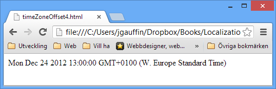

图 31:解析 UNIX 时间

这意味着任何提供的 UNIX 时间都应该是 UTC 格式。因此，我们可以使用 UNIX 时间来表示世界协调时，`Date`对象来表示本地时间。

我们现在可以使用两种不同的策略来处理时区。我们要么在客户端处理一切(在浏览器中)，要么将时区传输到服务器，让服务器处理转换。

### 向服务器发送时区

如果启用了 cookies，发送时区很容易。只需创建一个包含时区的会话 cookie(即浏览器窗口关闭时过期的 cookie)。您可以在 ASP.NET 创建一个会话 cookie，方法是使用`Response.SetCookie`创建一个没有指定过期时间的新 cookie。

嗯，可能就这么简单。但事实是不是每个人都允许吃饼干。因此，我们必须考虑可以关闭 cookies。最好的方法是有一个最小的首页，直接指向真实的页面(设置了 cookie)。

通过这样做，我们可以优雅地降级到只使用默认时区(如果没有 cookies 被发送到第二页)。

|  | 注:自。NET 在客户端/服务器应用程序的范围内没有太多用户时区的概念，所以您永远不能使用 DateTime。将用户指定的时间转换为世界协调时的时间。该方法只会将客户端时区(网络服务器的时区)转换为世界协调时。 |

入口页面将是最小的，只包含如下内容:

```cs
   <!DOCTYPE html>
   <html>
   <head>
       <title>Yoursite</title>
       <script type="text/javascript">
           var date = new Date();
           var offset = -date.getTimezoneOffset() / 60;
           var timeZone = 'UTC';
           if (offset < 0) {
               timeZone = "UTC" + offset;
           } else {
               timeZone = 'UTC+' + offset;
           }
           document.cookie = 'userTimeZone=' + timeZone;
           window.location = '/home/?userTimeZone=' + timeZone;
       </script>
   </head>
   <body>
       <a href="@Url.Action("Front")">Visit main page</a>
   </body>
   </html>

```

此页面允许我们执行以下操作:

*   检测是否支持 cookie(服务器中未设置 cookie，但存在查询字符串参数)
*   检测脚本是否受支持(查询字符串或 cookie 都不存在)
*   优雅地后退(点击链接)

换句话说，你可以用它来决定做什么，比如说“你好，石器时代的用户。获取新浏览器。”

下面的代码是针对 ASP.NET MVC 的。如果您想尝试一下，创建一个新的 ASP.NET MVC 项目，并将包含的 HomeController 更改为以下内容。因此，在服务器端，我们可以编写如下代码:

```cs
   public class HomeController : Controller
   {
       public ActionResult Index(string userTimeZone)
       {
           var cookieTimeZone = Request.Cookies["userTimeZone"];
           var cookieValue = cookieTimeZone == null ? null : cookieTimeZone.Value;
           if (cookieValue != userTimeZone && userTimeZone != null)
           {
               // Cookies are not supported.
           }

           if (userTimeZone == null)
           {
               // No support for scripts.
           }

           // now display the real page.
           return RedirectToAction("Front");
       }

       public ActionResult Front()
       {
           var cookieTimeZone = Request.Cookies["userTimeZone"];

           // default time zone
           var cookieValue = cookieTimeZone == null ? "UTC" : cookieTimeZone.Value;
           ViewBag.Message = "Hello. Your time zone is: " + cookieValue;
           return View();
       }

       public ActionResult About()
       {
           return View();
       }
    }

```

我们现在已经确保在每个 HTTP 请求中获得用户时区(多亏了 cookie)。然而，我们的 web 应用程序中没有任何东西可以加载时区设置。在任何地方使用 cookie 都不会很干燥，而且还会将我们的逻辑与 HTTP 实现结合起来。

让我们改用 ASP.NET MVC 中的一个名为动作过滤器的特性。操作过滤器允许您将逻辑应用于一组请求(从所有请求到特定的操作)。我们将使用动作过滤器将时区从 cookie 转移到我们可以在剩下的代码中使用的地方。

为了测试它，为了简单起见，将下面的代码放入根文件夹的一个新的类文件中。

```cs
   public class TimeZoneFilterAttribute : ActionFilterAttribute
   {
       public static void ReadCookie(HttpCookieCollection cookies)
       {
           var timeZoneCookie = cookies["userTimeZone"];

           if (timeZoneCookie == null
               || string.IsNullOrEmpty(timeZoneCookie.Value))
               return;

           UserTimeZone.SetTimeZone(timeZoneCookie.Value);
       }
       public override void OnActionExecuting(ActionExecutingContext filterContext)
       {
           var timeZoneCookie = filterContext.HttpContext
                                               .Request.Cookies["userTimeZone"];

           if (timeZoneCookie == null
               || string.IsNullOrEmpty(timeZoneCookie.Value))
               return;

           UserTimeZone.SetTimeZone(timeZoneCookie.Value);
       }

    }

```

要激活过滤器，我们需要将其添加到`global.asax`:

```cs
   public class MvcApplication : System.Web.HttpApplication
   {
       public static void RegisterGlobalFilters(GlobalFilterCollection filters)
       {
           filters.Add(new HandleErrorAttribute());
           filters.Add(new TimeZoneFilterAttribute());
        }
    }

```

在我们的过滤器中，我们使用了另一个名为`UserTimeZone`的类，如下所示。这是我们每次需要将世界协调时转换为用户时区时将使用的类。这个类本身看起来是这样的:

```cs
   public static class UserTimeZone
   {
       [ThreadStatic]
       private static TimeZoneInfo _current;

       static UserTimeZone()
       {
           DefaultTimeZone = TimeZoneInfo.Utc;
       }

       public static TimeZoneInfo DefaultTimeZone { get; set; }

       public static TimeZoneInfo Instance
       {
           get { return _current ?? DefaultTimeZone; }
           private set { _current = value; }
       }

       public static void SetTimeZone(string timeZone)
       {
           // it's up to you to decide how invalid cookies should be handled.
           int hours;
           if (!int.TryParse(timeZone.Substring(4), out hours))
               return;

           var myOffset = TimeSpan.FromHours(hours);
           Instance = (from x in TimeZoneInfo.GetSystemTimeZones()
                       where x.BaseUtcOffset == myOffset
                       select x).First();

       }

       public static DateTime ToUserTime(this DateTime dateTime)
       {
           return dateTime.Add(Instance.BaseUtcOffset);
       }

       public static DateTime FromUserTime(this DateTime dateTime)
       {
           return dateTime.Subtract(Instance.BaseUtcOffset);
       }
    }

```

`DefaultTimeZone`可用于配置在 cookie 中未指定的时区。`ToUserTime()`将日期/时间从世界协调时转换为用户时区，而`FromUserTime()`将用户指定的时间转换为世界协调时。

最酷的是过滤器会自动为我们配置这个类。因此，我们只需要使用这样的东西:

```cs
   public ActionResult Front()
   {
       var christmasNoonUtc = new DateTime(2012, 12, 14, 12, 00, 00);
       var msg = "Hello. When it's christmas noon at UTC, it's {0} at your place.";
       ViewBag.Message = string.Format(msg, christmasNoonUtc.ToUserTime());

       return View();
    }

```

### 时区通过登录

还有一个替代解决方案，它要简单得多:使用用户登录，让用户在设置中配置时区。ASP.NET MVC 和其他库在创建的项目模板中包含了登录解决方案。

您可以在“设置”页面中创建一个新选项，用户可以在其中选择自己的时区。

您仍然可以使用上一节中的`UserTimeZone`类和动作过滤器。

### 表格帖子中的日期/时间

用户也可以在 HTML 表单中指定日期和时间值。因此，我们需要将这些日期从用户时区转换为世界协调时。如果转换是自动完成的，那不是很好吗？

这是可能的，这要归功于 ASP.NET MVC 的另一个特性。您可以使用模型绑定器功能将 HTML 表单转换为视图模型或操作参数。

因此，我们基本上要做的是覆盖日期/时间的默认模型绑定，并自动将日期转换为世界协调时。看起来是这样的:

```cs
   public class DateTimeModelBinder : DefaultModelBinder
   {
       public override object BindModel(ControllerContext controllerContext,
                                           ModelBindingContext bindingContext)
       {
           var value = base.BindModel(controllerContext, bindingContext);
           if (value is DateTime)
           {
               return ((DateTime)value).FromUserTime();
           }

           return value;
       }
   }

```

要激活它，我们必须告诉 MVC 使用日期/时间绑定器。配置通常在`global.asax`进行。

```cs
   protected void Application_Start()
   {
       AreaRegistration.RegisterAllAreas();

       RegisterGlobalFilters(GlobalFilters.Filters);
       RegisterRoutes(RouteTable.Routes);

       ModelBinders.Binders.Add(typeof(DateTime), new DateTimeModelBinder());
    }

```

完成了。每次我们现在得到一个日期/时间，我们将得到它作为 UTC(只要动作过滤器已经完成它的工作)。

但是有一个问题:动作过滤器是在模型绑定之后执行的。因此，活页夹运行时，用户时区尚未设置。因此不会指定时区。除了调用过滤器并从绑定器中提供 cookie 之外，我没有找到更好的解决方案。

那就是使用一个定制的 HTTP 模块。自从 ASP.NET 4(和网页的引入)以来，有了一种新的方法来自动注册 HTTP 模块，使用一个特殊的属性如下所示。

```cs
   [assembly:PreApplicationStartMethod(typeof(TimeZoneCookieWithFilter.TimeZoneHttpModule), "RegisterModule")]
   namespace TimeZoneCookieWithFilter
   {
       public class TimeZoneHttpModule : IHttpModule
       {
           public void Init(HttpApplication context)
           {
               context.BeginRequest += OnRequest;
           }

           public static void RegisterModule()
           {
               DynamicModuleUtility.RegisterModule(typeof(TimeZoneHttpModule));
           }

           public static void ReadCookie(HttpCookieCollection cookies)
           {
               var timeZoneCookie = cookies["userTimeZone"];

               if (timeZoneCookie == null
                   || string.IsNullOrEmpty(timeZoneCookie.Value))
                   return;

               UserTimeZone.SetTimeZone(timeZoneCookie.Value);
           }

           private void OnRequest(object sender, EventArgs e)
           {
               var app = (HttpApplication) sender;
               var timeZoneCookie = app.Request.Cookies["userTimeZone"];

               if (timeZoneCookie == null
                   || string.IsNullOrEmpty(timeZoneCookie.Value))
                   return;

               UserTimeZone.SetTimeZone(timeZoneCookie.Value);
           }

           public void Dispose()
           {

           }
       }
    }

```

这将在模型绑定之前自动初始化用户时区。当您的操作方法被调用时，所有用户提交的日期都将使用世界协调时。

如果您使用的框架具有视图模型，请在显示之前使用它们将日期转换为用户时区。