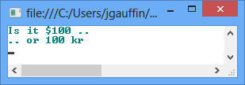
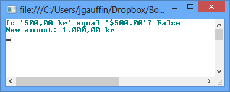
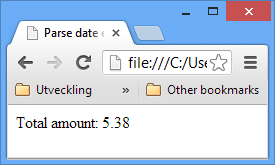
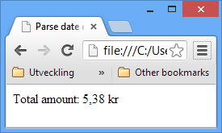

# 第六章货币

. NET 中没有内置的货币支持，建议使用`decimal`数据类型。然而，如果你必须支持多种货币，这可能是一个痛苦。

```
   static void Main(string[] args)
   {
       decimal shoppingCartTotal = 100;

       var us = new CultureInfo("en-US");
       Console.WriteLine("Is it {0} ..", shoppingCartTotal.ToString("C0", us));

       var sv = new CultureInfo("sv-SE");
       Console.WriteLine(".. or {0}", shoppingCartTotal.ToString("C0", sv));
    }

```

结果如图 37 所示:



图 37:货币格式

“C0”中的“0”代表无小数。

## 处理多种货币

如果必须管理多种货币，请始终确保在所有包含金额的类别中包含货币标识符。否则很容易使用不正确的货币(可能价值更低)。

更好的方法是创建一个可以替代使用的结构。该结构可在附录中找到。

```
   class Program
   {
       static void Main(string[] args)
       {
           var amountSek = new Money(500, "sv-se");
           var amountUsd = new Money(500, "en-us");

           Console.WriteLine("Is '{0}' equal '{1}'? {2}", amountSek, amountUsd, amountSek.Equals(amountUsd));

           amountSek += 500;
           Console.WriteLine("New amount: " + amountSek);

           Console.ReadLine();
       }
    }

```

结果如下:



图 38:使用货币结构

## JavaScript

JavaScript 本身对货币有相当好的支持，这可能会让你感到惊讶。一些初始尝试可能如下所示:

```
   <script type="text/javascript">
       var amount = 5.382;
       document.writeln("Total amount: " + amount.toFixed(2));
   </script>

```

我们得到以下结果:



图 39: JavaScript 货币

不过，还有一种优雅得多的方式:

```
   <script type="text/javascript">
       var amount = 5.382;
       document.writeln("Total amount: " + amount.toLocaleString('sv-se', { style: 'currency' }));
   </script>

```

这将产生以下输出:



图 40:格式化货币

请注意，十进制分隔符对于我的语言是正确的，并且附上了正确的货币。

还要注意的是，IE 使用的是操作系统(Windows)文化。