# 第七章正文

文字。这真的是我们要讨论的事情吗？不都是为了保存不同语言的文字吗？不幸的是，没有。

## 字符串比较

让我们从一个简单的练习开始。结果变量将包含什么——真还是假？

```cs
   class Program
   {
       static void Main(string[] args)
       {
           var result = "i".Equals("I", StringComparison.CurrentCultureIgnoreCase);
           Console.WriteLine("Result is: " + result);
       }
    }

```

如果你住在土耳其，它会返回假的。你可以这样做比较:

```cs
   class Program
   {
       static void Main(string[] args)
       {
           var result = "i".Equals("I", StringComparison.OrdinalIgnoreCase);
           Console.WriteLine("Result is: " + result);
       }
    }

```

这对所有国家来说都是事实。

了解你的目标受众或你想从字符串比较中得到什么。对你来说显而易见的信件对其他人来说可能会有不同的效果。

## 不同类型的字母和字母

美国公民没有使用拉丁字符，但大多数欧洲国家没有。为了使其更加复杂，许多欧洲国家使用了不同的拉丁字符集。

在瑞典我们用“在”,而在法国他们用“àâæçéèêëîïôœùûüÿ".”这只是欧洲的两个国家。然后是世界的其他地方，有几种不同的字母。

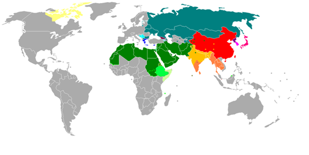

(图片来自 [*维基百科*](http://en.wikipedia.org/wiki/File:800px-Writing_systems_worldwide1.png) 。)

**字母:** `[Armenian](http://en.wikipedia.org/wiki/Armenian_alphabet "Armenian alphabet")` 、[西里尔文](http://en.wikipedia.org/wiki/Cyrillic "Cyrillic")、[格鲁吉亚文](http://en.wikipedia.org/wiki/Georgian_alphabet "Georgian alphabet")、[希腊文](http://en.wikipedia.org/wiki/Greek_alphabet "Greek alphabet")、 `[Latin](http://en.wikipedia.org/wiki/Latin_script "Latin script")` 、拉丁文(和`[Arabic](http://en.wikipedia.org/wiki/Arabic_script "Arabic script"))` )、拉丁文和西里尔文

**阿布杰德:**[`Arabic`](http://en.wikipedia.org/wiki/Arabic_script "Arabic script") `[Hebrew](http://en.wikipedia.org/wiki/Hebrew_alphabet "Hebrew alphabet")`

**阿布吉达斯:** `[North Indic](http://en.wikipedia.org/wiki/Indic_scripts "Indic scripts")` `[South Indic](http://en.wikipedia.org/wiki/Indic_scripts "Indic scripts")` `[Ge'ez](http://en.wikipedia.org/wiki/Ge%27ez_script "Ge'ez script")` [tāna](http://en.wikipedia.org/wiki/T%C4%81na "Tāna") `[Canadian Syllabic](http://en.wikipedia.org/wiki/Canadian_Aboriginal_syllabics "Canadian Aboriginal syllabics")` 和拉丁文

**标志+音节:** `Pure logographic` `Mixed logographic and syllabaries` ，特征字母音节+有限标志， `Featural-alphabetic syllabary`

## 编码

最初有 ASCII(美国国际交换标准代码)，这是一种 7 位文本编码。它不能表示像“”这样的重音字符。这里有一句瑞典语:

*-大家好，我叫罗拉！我醉了，我醉了！-再见-再见！*

为了解决重音的问题，引入了另一种称为扩展 ASCII(或 8 位 ASCII)的编码方法。后来被 iso-8559-1 (ISO 拉丁语 1)取代，该标准适用于大多数西欧国家。这些编码仍然很简单，因为每个字符只使用一个字节。

这些编码还不够，因为许多国家已经扩展了字符集。

*`你好世界`*

那篇课文用中文说“你好世界”(我希望；这些汉字是使用谷歌翻译生成的)。

如果你想知道 99.5%最常用的汉字，你必须学习 3500 个不同的汉字。正如您可能已经发现的，所有这些字符都不适合一个字节。

### 统一码

一个新的标准已经出现来解决这个问题，一个称为 UTF8 的 Unicode 版本。UTF8 被设计成与 ASCII 兼容。也就是说，最常用的 ASCII 字符以同样的方式用 UTF8 编码。最棒的是，许多文本解析器(像一个 HTML 解析器)不需要知道编码，因为那些字节看起来和 ASCII 中的一样(即`<html>`在 ASCII 和 UTF8 中看起来一样)。

UTF8 也已经成为许多编程语言(以及 HTML)的默认编码。

Unicode 有不同的风格。每个版本的名称反映了它需要多少字节。UTF8 需要一个字节(8 位= 1 字节)。UTF16 每个字符至少获得两个字节，UTF32 需要三个字节。使用哪一个取决于您想要支持的字母表。

## 。网

英寸 NET 我们有`System.Text`命名空间，所有不同的编码都位于这里。在这个命名空间中，有一个类包含了几个静态属性，让我们的生活变得更容易。

。NET 本身使用 UTF16 作为`String`类的内部编码。请注意，`System.IO.StreamWriter`和其他类默认使用 UTF8。

让我们通过打印编码生成的字节来证明我所说的编码:

```cs
   class Program
   {
       static void Main(string[] args)
       {
           var text = "Hello world";
           var utf8 = Encoding.UTF8.GetBytes(text);
           var ascii = Encoding.ASCII.GetBytes(text);
           var utf16 = Encoding.Unicode.GetBytes(text);
           var utf32 = Encoding.UTF32.GetBytes(text);

           Console.WriteLine("UTF8: " + string.Join(",", utf8));
           Console.WriteLine();
           Console.WriteLine("ASCII: " + string.Join(",", ascii));
           Console.WriteLine();
           Console.WriteLine("UTF16: " + string.Join(",", utf16));
           Console.WriteLine();
           Console.WriteLine("UTF32: " + string.Join(",", utf32));
        }
    }

```

如图 41 所示，UTF8 和 ASCII 是相同的，而 UTF16/32 占用更多空间:

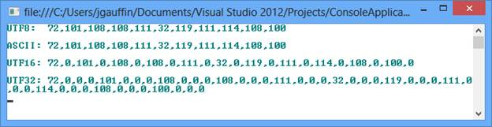

图 41:编码输出

## 资源文件

资源文件是包含不同类型资源(如图像和文本)的特殊文件。当您创建这些文件的多个副本时，它们可以用于本地化。文件的每个副本代表一个特定的区域性。

要添加资源文件，请在解决方案资源管理器中右键单击项目，单击 ***添加*** ，然后单击 ***新建项目*** 。接下来，在列表中找到**资源文件**，并给它一个如下所示的名称

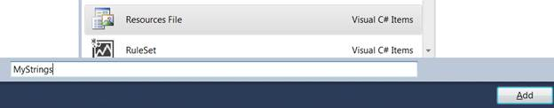

图 42:新的资源文件

文件本身包含一个叫做字符串表的东西。这是标识符和它们所代表的字符串之间的映射。对于所有不同的资源规则，标识符本身必须保持相同。下面是一个例子:

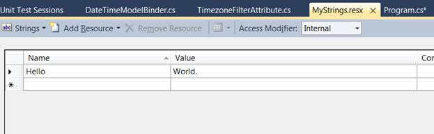

图 43:向资源文件添加一个字符串

您最终可以使用字符串:

```cs
   class Program
   {
       static void Main(string[] args)
       {
           Console.WriteLine(MyStrings.Hello);

           Console.ReadLine();
       }
   }

```

Visual Studio 自动生成`MyStrings`类，并将其命名为资源文件。类包含资源文件中的所有资源，并充当访问者。VB.NET 有一个名为`My`的自定义类，用于访问资源。更多关于该课程的信息可在 [MSDN](http://msdn.microsoft.com/en-us/library/6wkcc526.aspx) 获得。

资源本身是从一个叫做`ResourceManager`的特殊类中访问的。您可以使用`MyStrings.RecourceManager`访问该文件。我过会儿再谈这个。

上面的代码示例只针对一种语言。要添加对多种语言的支持，您只需复制语言文件，并给它一个带有语言代码后缀的新名称。没有前缀的文件被用作默认语言文件，如图 44 所示。

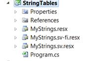

图 44:资源文件命名

请注意，我创建了一个带有“sv”后缀的文件和一个带有“sv-FI”后缀的文件。这意味着任何在芬兰说瑞典语的人都将获得他们自己的语言，而来自所有其他说瑞典语的国家的用户将获得一种中性方言(“sv”文件)。其他所有人都可以使用没有语言后缀的文件。

如何指定要使用的语言？如前所述，您可以使用`CultureInfo`类来实现。

```cs
   class Program
   {
       static void Main(string[] args)
       {
           Thread.CurrentThread.CurrentUICulture = new CultureInfo("sv-FI");
           Console.WriteLine(MyStrings.Hello);

           Thread.CurrentThread.CurrentUICulture = new CultureInfo("sv");
           Console.WriteLine(MyStrings.Hello);

           Thread.CurrentThread.CurrentUICulture = new CultureInfo("en-US");
           Console.WriteLine(MyStrings.Hello);

           Console.ReadLine();
       }
   }

```

输出结果是:

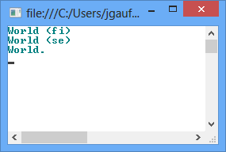

图 45:字符串处理

输出的字符串是我写在相应资源文件中的字符串。

## ASP.NET(网络表单)

在 ASP.NET，我们也使用字符串表。它们分为两个不同的部分:本地资源和全球资源。

### 全球资源

全局资源可以在页面之间共享。您可以像使用常规字符串表一样使用静态访问器(即`MyResourceFile.MyTextName`)。

然而，全球资源被放在 ASP.NET 项目内部的一个特殊文件中。要添加文件夹，在解决方案资源管理器中右键单击项目，单击**添加 ASP.NET 文件夹**，然后单击**添加**，如下图所示:

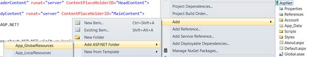

图 46:添加新资源

这将添加全局资源文件夹，您可以向其中添加全局资源文件，如图 47 所示。

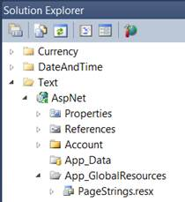

图 47:添加的文件

以下示例说明了资源字符串的用法:

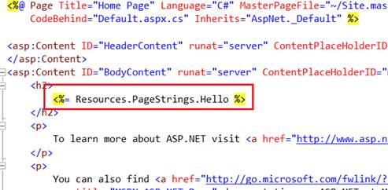

图 48:资源使用示例

### 本地资源

本地资源是特定于每个页面的资源。它们不能在几页之间共享。本地资源最酷的一点是，您可以按照惯例而不是配置方式来使用它们。

首先，创建一个简单的页面(我在 VS2012 中使用了默认的网络表单模板):

```cs
   <%@ Page Title="" Language="C#" MasterPageFile="~/Site.Master" AutoEventWireup="true" CodeBehind="DemoForm.aspx.cs" Inherits="WebApplication2.DemoForm1" %>

   <asp:Content ID="Content1" ContentPlaceHolderID="HeadContent" runat="server">
   </asp:Content>
   <asp:Content ID="Content2" ContentPlaceHolderID="FeaturedContent" runat="server">
   </asp:Content>
   <asp:Content ID="Content3" ContentPlaceHolderID="MainContent" runat="server">

       <!-- Note the meta:resourcekey -->
       <asp:Button ID="SomeButton" runat="server" Text="Not localized" meta:resourcekey="SomeButton" />

   </asp:Content>

```

元资源键是告诉我们要查找什么的字符串。ASP.NET 将在一个资源文件中寻找这个键，它的确切名称是 ASPX 文件，如图 49 所示。


图 49:页面资源

在该文件中，您应该添加要本地化的每个控件的每个属性。在下面的示例中，我刚刚添加了按钮的文本属性:

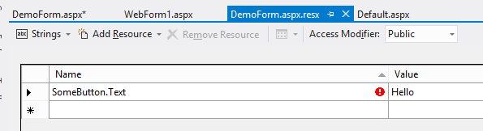

图 50:按钮文本

结果如图 51 所示:

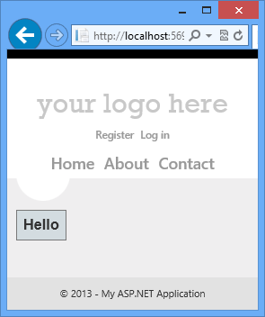

图 51:输出

更多内容请阅读 [MSDN](http://msdn.microsoft.com/en-us/library/ms227427.aspx) 或 [MSDN 杂志](http://msdn.microsoft.com/en-us/magazine/cc163566.aspx)。《MSDN 杂志》文章的目标是。NET 2.0，但仍然有效。

## 自动选择培养物

你可以让 ASP.NET 通过使用你的网络浏览器自动为你选择一种文化。

在谷歌浏览器中，我对我的语言进行了如下配置:

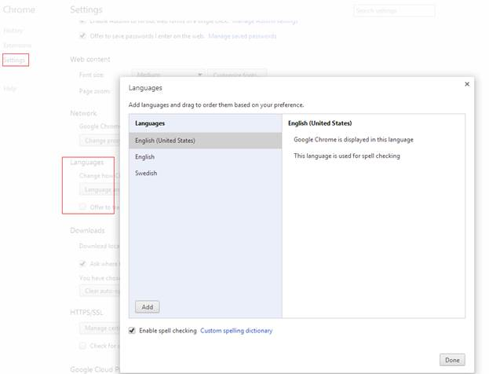

图 52: Chrome 设置

这些设置包含在 web 请求中，如下所示:

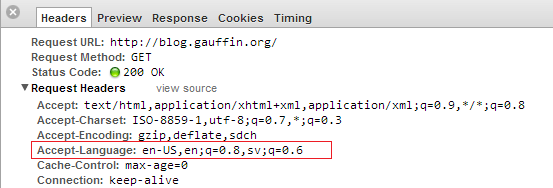

图 53:接受语言标题

为了让 ASP.NET 使用这些价值观，我们必须打开 web.config 并在 system.Web 下找到全球化

```cs
   <configuration>
     <system.web>
       <globalization culture="auto" uiCulture="auto" />

       <compilation debug="true" targetFramework="4.5" />
       <httpRuntime targetFramework="4.5" />
     </system.web>
   </configuration>

```

## ASP.NET MVC&网页 API

ASP.NET 和网络应用编程接口使用类似的本地化技术，所以我将在同一部分记录他们的方法。

有三个不同的部分可以在 MVC/Web API 中翻译。每个部分都使用自己的本地化解决方案。

### 视图

对于视图，推荐的方法是使用字符串表，就像常规的 ASP.NET 项目一样。在全局资源下创建一个文件，并使用生成的静态类访问它，如下图所示。

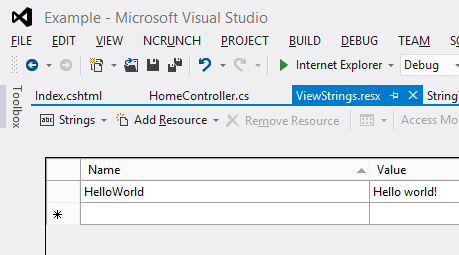

图 54:新资源

接下来，创建一个使用该资源文件的新视图:

```cs
   @using Resources
   @{
       ViewBag.Title = "Index";
   }

   <h2>Index</h2>

   <p>@ViewStrings.HelloWorld</p>

```

运行应用程序将显示以下文本:

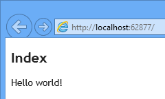

图 55:资源字符串输出

### 查看模型

ASP.NET MVC 中的视图模型也可以本地化。字符串仍然存储在资源文件中。但是由于没有办法全局地指定一个资源文件(或者甚至每个视图模型)，您必须为每个模型重复指定。

首先创建一个新的资源文件并指定字符串。

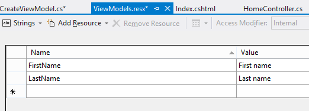

图 56:资源字符串

接下来，创建新的视图模型:

```cs
   namespace MvcModels.Models.Users
   {
       public class CreateViewModel
       {
           public string FirstName { get; set; }
           public string LastName { get; set; }
       }
    }

```

为了在视图模型和字符串表之间建立连接，我们使用了一个名为`[Display]`的属性。在其中，我们指定要使用哪个资源文件以及该字段的名称:

```cs
   namespace MvcModels.Models.Users
   {
       public class CreateViewModel
       {
           [Display(ResourceType = typeof(Resources.ViewModels), Name = "FirstName")]
           public string FirstName { get; set; }

           [Display(ResourceType = typeof(Resources.ViewModels), Name = "LastName")]
           public string LastName { get; set; }
       }
    }

```

然而，有一个问题。默认情况下，资源文件被编译为内部类。这些属性并不好用，因为它们存在于**系统中。组件模型.数据注释**组件。因此，我们需要重新配置资源文件来生成一个公共类。

在解决方案资源管理器中右键单击资源文件，并选择**属性**。更改设置，以便将**自定义工具**设置为**公共资源文件代码生成器**，将**自定义工具名称空间**设置为**资源**。最后，将**构建动作**改为**嵌入式资源**。项目现在应该可以运行了。

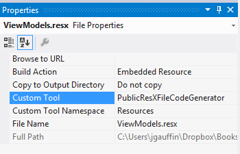

图 57:资源文件更改

### 验证消息

验证消息以类似的方式工作。我们使用字符串表和属性来指定验证消息应该使用资源文件来获取本地化的字符串。

如果我们在前一个示例的基础上进行构建，我们会得到以下视图模型:

```cs
   namespace MvcValidation.Models.Users
   {
       public class CreateViewModel
       {
           [Display(ResourceType = typeof(Resources.ViewModels), Name = "FirstName")]
           [Required(ErrorMessageResourceType = typeof(Resources.ViewModels), ErrorMessageResourceName = "Required")]
           public string FirstName { get; set; }

           [Display(ResourceType = typeof(Resources.ViewModels), Name = "LastName")]
           [Required(ErrorMessageResourceType = typeof(Resources.ViewModels), ErrorMessageResourceName = "Required")]
           [StringLength(20, ErrorMessageResourceType = typeof(Resources.ViewModels), ErrorMessageResourceName = "StringLength")]
           public string LastName { get; set; }
       }
    }

```

字符串表如下所示:

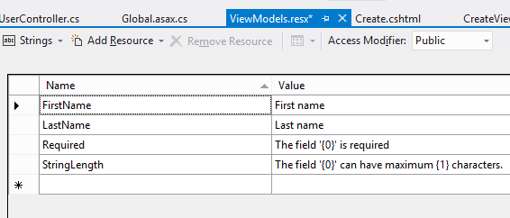

图 58:字符串表

如果仔细观察，您会发现我们现在正在使用格式化程序(“{0}”字符串)。参数的数量取决于验证属性构造函数中使用的参数数量。第一个参数始终是属性名，而其他参数取决于构造函数。

最终结果是:

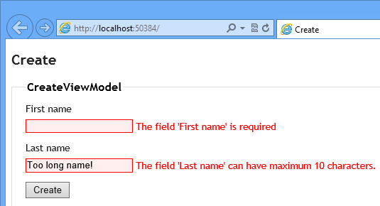

验证消息

### 字符串表的替代项

如果您想使用字符串表的替代方法，您要么需要停止使用数据注释(因为真的没有办法扩展它的本地化处理)，要么开始使用第三方库(需要使用某种黑客)。没有别的办法。

至于第一个选项，我建议你看看流畅验证库，它可以在 CodePlex 上找到:[http://fluentvalidation.codeplex.com/](http://fluentvalidation.codeplex.com/)。

对于后者，我创建了一个名为 [*格里芬的库。MvcContrib*](http://github.com/jgauffin/griffin.mvccontrib) 可以为字符串使用任何数据源。有了它，您不必指定资源文件，而是可以恢复到只使用验证属性。请注意，我在其中使用了一些黑客攻击，以允许您按照微软的意图继续使用验证属性。

你的模型看起来很干净:

```cs
   namespace GriffinMvcContrib.Models.User
   {
       public class CreateViewModel
       {
           [Required]
           public string FirstName { get; set; }

           [Required]
           [StringLength(10)]
           public string LastName { get; set; }
       }
    }

```

如果你有兴趣了解更多，你可以阅读 gihub 的图书馆。

### 切换语言

有时您不想使用浏览器指定的区域性(如“自动选择区域性”示例所示)。

您可以创建一个漂亮的小 HTTP 模块，它允许您通过使用查询字符串来切换语言。只需添加一个名为“lang”的新值，如下图所示:

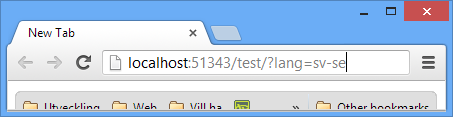

图 60:使用网址切换语言

该字符串将由模块提取并存储在 cookie 中。因此，实际的处理对您的应用程序是透明的。

HTTP 模块会自动加载到 ASP.NET，并会自动为您设置正确的区域性。

该模块:

```cs
   using System;
   using System.Globalization;
   using System.Threading;
   using System.Web;
   using Microsoft.Web.Infrastructure.DynamicModuleHelper;

   [assembly: PreApplicationStartMethod(typeof(ExampleApp.LanguageSwitcherModule), "Setup")]

   namespace ExampleApp
   {
       public class LanguageSwitcherModule : IHttpModule
       {
           private const string CookieName = "LangCookie";

           public static void Setup()
           {
               DynamicModuleUtility.RegisterModule(typeof(LanguageSwitcherModule));
           }

           public void Init(HttpApplication context)
           {
               context.BeginRequest += OnRequest;
           }

           public void Dispose()
           {
           }

           private void OnRequest(object sender, EventArgs e)
           {
               var app = (HttpApplication) sender;

               // language switched
               if (app.Request.QueryString["lang"] != null)
               {
                   var lang = app.Request.QueryString["lang"];
                   AssignLanguage(lang);
                   SetCookie(app.Response, lang);
               }

               // same language as before.
               else if (app.Request.Cookies[CookieName] != null)
               {
                   AssignLanguage(app.Request.Cookies[CookieName].Value);
               }
           }

           private static void AssignLanguage(string lang)
           {
               Thread.CurrentThread.CurrentCulture =
                   Thread.CurrentThread.CurrentUICulture =
                       new CultureInfo(lang);
           }

           private static void SetCookie(HttpResponse response, string language)
           {
               response.Cookies.Add(new HttpCookie(CookieName, language)
                   {
                       Expires = DateTime.Now.AddYears(1),
                   });
           }
       }
    }

```

## 网站

使用网站时，通常使用 HTML 元素上的`lang`属性来指定 HTML 文档使用的语言。您也可以在 javascripts 中使用该元素来指定要加载的语言。

```cs
   <html lang="x-klingon">
   <head>
       <title>tlhIngan maH!</title>
   </head>
   <body>
        <h1>nuqneH</h1>
       <p>nuqDaq 'oH puchpa''e'</p>
   </body>
   </html>

```

一个`x`实际上是一个有效的标签，意味着语言是实验性的。所以`lang`标签说的是我们正在使用一种实验性的语言，方言是“克林贡语”

否则，您可以使用在 [HTML5 规范](http://www.w3.org/TR/html5/dom.html#attr-lang)中定义的任何标签(HTML4 使用相同类型的代码)。

## JavaScript 插件

JavaScript 插件可以通过使用插件的全局扩展进行本地化。

您通常从创建插件(myplugin.js)开始:

```cs
   var MyPlugin = (function() {
         function checkName(name) {
               if (name === 'Jonas') {
                     return 'Kungen';
               } else {
                     return name;
               }
         }
         function MyPlugin()
         {
         }

         MyPlugin.prototype.print = function(name) {
               name = checkName(name);
               return  MyPlugin.Texts.Welcome.replace('{name}', name);
         }

         return MyPlugin;
   })();

   // Initialize default language.
   if (!MyPlugin.Texts) {
         MyPlugin.Texts = {};
         MyPlugin.Texts.Welcome = 'Hello, {name} is in the house.';
   }

```

然后在单独的文件中添加一种或多种语言(myplugin.sv-se.js)

```cs
   MyPlugin.Texts.Welcome = 'Hej, {name} har äntligen kommit.';

```

最后，您可以使用与之前相同的方法选择正确的语言文件:

```cs
   <html lang="sv-se">
   <head>
         <title>Javascript example</title>
         <script src="plugin.js"></script>

       <!-- use your server side language to get the correct language code -->
         <script src="plugin.sv-se.js"></script>
   </head>
   <body>
         <script type="text/javascript">
               var plugin = new MyPlugin();
               document.writeln(plugin.print('Jonas'));
         </script>
   </body>
   </html>

```

这种方法使得脚本本地化变得容易。只需将默认语言或任何其他语言复制到单独的文件中。进行本地化的人可以替换新的文本。它还允许你的用户(如果你是一个插件开发者)不费力地本地化你的插件。