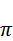
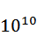
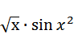

# 二、数据类型

我们将从 MATLAB 支持的不同数值类型开始我们与 MATLAB 的关系。我们还将讨论用户在处理数字数据时可以使用的一些预定义常数，然后我们将讨论在命令窗口中打印数字数据的各种格式。随后，我们将讨论字符串——它们不像数字那么重要，但它们仍然在 MATLAB 中的许多地方使用。然后，我们将研究结构，它提供了一种轻松地将相关数据分组在一起的好方法。最后，我们将讨论更模糊的单元数组概念，并以函数句柄的讨论结束这一章。

我想在这里指出的一点是，对数组和矩阵的深入讨论被推迟了，因为我要用整整一章的时间来讨论它们。但是，我将在本章中简要提及数组。

## 数值类型

MATLAB 支持各种数据类型，对我们来说最重要的显然是数字类型，即用来存储数字的数据类型。在 MATLAB 的术语中，数据类型被称为*类*，但是为了避免混淆那些已经在练习编程的读者，我会尽可能地继续使用术语*数据类型*。

有两种方法可以获取某个东西的类或数据类型。首先是使用`class`函数，该函数只产生数据类型。

```matlab
    >> x=5; class(x)

    ans =
    double

```

本例中的分号用于分隔一行中的两个语句，并抑制第一个语句(`x=5`)的输出。别担心，我们稍后再解释。

或者，您可以使用`whos`命令获得更多信息。该命令不仅列出变量的类型，还列出其名称、大小和其他属性:

```matlab
    >> whos x

      Name      Size            Bytes  Class     Attributes
      x         1x1                 8  double

```

所以首先要注意的是，MATLAB 中数值的默认数据类型是双精度。我们可以使用`class`功能来验证这一点。例如，如果我们输入`class(5)`，我们会得到一个`double`的结果。如果我们想要单精度，我们可以使用`single`功能:

```matlab
    >> y = single(5); class(y)
    ans =
    single

```

但是单精度和双精度是什么意思？嗯，本质上，这意味着这两种类型都可以存储实数，即带有整数和小数部分的数字，单双的区别在于它们占用了多少内存。

```matlab
    >> whos x, whos y

      Name      Size            Bytes  Class     Attributes
      x         1x1                 8  double             
      Name      Size            Bytes  Class     Attributes
      y         1x1                 4  single

```

如您所见，双精度数字占用的字节数是单精度数字的两倍(8 个字节，而单精度数字为 4 个字节)，因此它可以存储更大的值或更高精度的值。例如，以下是的表示如何根据数据类型而变化:

```matlab
  >> single(pi)
  ans =
          3.141593
  >> pi
  ans =
            3.14159265358979

```

如果你想知道这些值的极限，你可以使用`realmin`和`realmax`函数计算出可以存储的最小值和最大值。

```matlab
    >> realmin('single'), realmax('double')

    ans =
      1.1755e-38
    ans =
      1.7977e+308

```

MATLAB 还支持整数数据类型，即只包含整数的一部分的数据类型。例如，如果加载图像，图像的每个像素可能具有 0 到 255 范围内的红色、绿色和蓝色值。如果您需要自己定义整数，则使用`int`和`uint`函数分别对有符号和无符号整数进行转换。每个函数都通过位数进行后缀，因此，例如，要获得一个值为 5 的 64 位无符号整数，您可以编写:

```matlab
    >> z = uint64(5), whos z

    z =
                        5
      Name      Size            Bytes  Class     Attributes
      z         1x1                 8  uint64

```

有符号和无符号整数都有 8、16、32 和 64 位精度。

|  | 提示:如果不知道使用什么数据类型，最好坚持双精度。对于大多数目的来说，双精度运算通常足够快，尽管单精度运算可能更快，尤其是在执行 GPU 计算的情况下(顺便说一下，MATLAB 也支持使用可选的并行计算工具箱)。 |

## Inf、NaN 和其他常数

如果我们将 1 除以 0，得到无穷大，在 MATLAB 中用`inf`常数表示。您可以在自己的计算中使用`inf`，例如在符号计算中，当某个东西达到无穷大时，您可以计算极限。您可以使用`isinf`功能来测试某个东西是否等于无穷大。

`inf`是预先定义的 MATLAB 常数的一个例子。MATLAB 中这样的常数不多，但有几个需要我们讨论。

除了`inf`，还有`nan`，简称“不是数字。”这个常数代表一个既不真实也不复杂的值。像`inf/inf`、`0/0`或任何包含`nan`的算术表达式都会产生`nan`。您可以使用`isnan`功能对此进行测试。请注意，与`inf`不同，您不能使用比较运算符来测试`nan`:无论是`==`还是`~=`都会产生`false`。

|  | 提示:`inf`和`nan`其实是不同参数重载的数组生成函数；例如，编写`inf(2,3)`会创建一个 2×3 的`inf`值数组。检测的方法是注意，如果你写`whos inf`，你不会得到任何输出。并且调用`open inf`会打开适当的函数文件…或者至少是一些文档。 |

MATLAB 还有其他几个常量。首先，最大和最小整数以及浮点数都有极限常数。例如，为了得到最大可能的整数，我们可以使用`intmax`常数。

然后是预定义的常数，如`pi`和`i/j`。`pi` ( )有一个可预测的值，3.14…，但是作为一个常数(而不是函数)，它可以被重新定义——尽管这可能不是一个好主意。如果您查看常数`i`和`j`(这些实际上是函数，因此您可以用这些名称声明自己的变量)，您会看到它们的表示与我们之前看到的有些不同。

```matlab
    >> i

    ans =
           0        +    1i

```

事实上，对结果做一个`whos`告诉我们，虽然它有一类`double`，但它也是一个复数:

```matlab
    >> whos ans

     Name      Size            Bytes  Class     Attributes
     ans       1x1                16  double    complex

```

与双精度值不同，本例中的复数是两个双精度值(一个实数和一个虚数)的组合，因此变量需要 16 个字节，而不是通常的 8 个字节。请注意，复数也可以使用单精度值，而不是双精度值。MATLAB 对复数的使用无处不在，所以如果你取一个负数的平方根，或者试图求解一个有复数根的二次方程，MATLAB 会给你复杂的结果，而不是显示一个错误:

```matlab
    >> sqrt(-2)
    ans =
       0.0000 + 1.4142i

```

最后，MATLAB 有常数`eps`，表示相对浮点精度，即到下一个最大浮点值的距离。

## 数字输出格式

让我们做一个足够大的数字，比如说:

```matlab
    >> 10^10

    ans =
       1.0000e+10

```

正如您在输出中看到的，数字是用工程符号表示的。我们可以使用`format`命令自定义数字的输出方式。例如，为了避免这个数字的工程符号，我可以将格式指定为`longg`。这让我充分看到了数字:

```matlab
    >> format longg
    >> 10^10

    ans =
                   10000000000

```

或者，我们可以告诉 MATLAB 使用货币格式，只留下两位小数。另一方面，例如，我们可以确保所有数值都以十六进制格式输出。

```matlab
    >> format bank
    >> ans

    ans =
     10000000000.00

    >> format hex
    >> ans

    ans =
       4202a05f20000000

```

MATLAB 还支持一种格式样式，将分数保持在比率格式，因此它不会计算除法的数值，而是尝试将结果保持为分数。

```matlab
    >> format rat
    >> 2*3/7+1/12

    ans =
          79/84

```

但是请注意，这并不意味着符号计算**，将`pi`除以 2 将产生一个分数，该分数与 2 上的`pi`的真实值非常接近。**

```matlab
    >> pi/2

    ans =
         355/226

```

有关可用数字格式的完整列表，请查看`format`命令的文档部分。这包含了 MATLAB 中所有支持的格式字符串的列表。请注意，format 命令只影响数字的表示，而不影响实际存储的值。仅仅因为 MATLAB 显示一个数字到两位小数并不意味着它的其余部分突然丢失。所有的信息都还在，只是你没有看到而已。

## 阵列

我们前面有一整章关于数组的主题，因此，为了简单起见，这里有一个小介绍。

假设您需要存储几个连续测量的信息。当然，你可以给每个测量值一个自己的变量(a，b，c，等等)，但是这是不切实际的。相反，您可以做的是声明一个数组——一个专门设计用来存储多个值的结构。数组用方括号声明和初始化，例如:

```matlab
  >> values = [1 2 3]

  values =
  1 2 3

```

要访问数组的某个元素，可以将该元素的索引放在圆括号中数组名称的后面。与某些编程语言不同，数组索引以 1 开头。圆括号允许您读取数组元素并更改它们的值:

```matlab
  >> values(2)
  ans =
  2

  >> values(3) = 15
  values =
  1 2 15

```

数组构成了几乎所有在 MATLAB 中发生的事情的基础。

## 字符和字符串

说到计算，我们主要关心的是数字数据，但我们有时也需要使用文本数据。为此，我们使用字符串，它只是字符数组。

字符串通过用单引号分隔文本来定义:

```matlab
    >> s = 'hello'

    s =
    hello

```

要使单引号成为字符串的一部分，只需键入两次:

```matlab
    >> 'let''s go'

    ans =
    let's go

```

让我们使用`whos`命令来看看我们刚才做了什么。

```matlab
    >> whos ans

     Name      Size            Bytes  Class    Attributes
      ans       1x8                16  char

```

如您所见，在我们的例子中，字符串只是一个由八个字符组成的数组。MATLAB 使用固定长度的 Unicode 字符，每个字符两个字节，因此我们的八个字符串实际上占用了 16 个字节的内存。

当然，您可以访问单个字符串。比如要得到第一个字符，可以写`ans(1)`。注意结果的数据类型仍然是`char`:

```matlab
    >> ans(1); class(ans)

    ans =
    char

```

将字符串连接在一起的最简单方法是在要连接的部分周围使用方括号:

```matlab
    >> a = 'hello';
    >> b = 'world';
    >> [a ', ' b '!']

    ans =
    hello, world!

```

但是，请注意，尝试将数值包含到串联中可能会导致无法预见的后果，例如将数值转换为具有相应 ASCII 代码的字符符号。

```matlab

    >> s = 'test'

    s =
    test
>> s(1) + 'a'

    ans =
       213

```

相反的方法很有用:例如，为了快速获得两行文本之间的换行符，可以依靠 MATLAB 将数字 10 转换成换行符的字符代码。因此，在两段文本之间添加换行符很简单:

```matlab
  >> ['hello' 10 'world']
  ans =
  hello
  world

```

要获取文本形式的数字数据，只需使用`num2str`功能:

```matlab
    >> age = 30;
    >> ['I am ' num2str(age) ' years old']

    ans =
    I am 30 years old

```

使用字符串的一个地方是在命令窗口中写一些东西。为此，我们可以使用`disp`功能:

```matlab
    >> disp(ans)

    I am 30 years old

```

许多地方都使用字符串。例如，要绘制的图形(稍后我们将详细讨论图形)，您可以提供字符串形式的函数:

```matlab
    >> ezplot('sqrt(x) * sin(x^2)')

```

MATLAB 有很多字符串操作和转换的功能。例如，对于区分大小写和不区分大小写的比较，您会得到字符串比较函数`strcmp`和`strcmpi`:

```matlab
    >> strcmpi('abc', 'ABC')

    ans =
         1

```

然而在实践中，你不太可能经常需要这些功能。

## 结构

假设在我们的 MATLAB 程序中，我们需要存储一些关于一个人的数据，比如他们的名字和年龄。我们当然可以为此使用两个变量，或者作为替代，我们可以定义一个结构。这是它的样子:

```matlab
    >> person.name = 'john';
    >> person.age = 22

    person =
        name: 'john'
         age: 22

```

这怎么可能？这是什么意思？嗯，这里有点神奇。您可能已经注意到，在 MATLAB 环境中，您不需要在赋值之前声明值。例如，编写`x=2`会自动创建一个名为`x`的变量。在上面的代码清单中也有同样的原理。

这个想法是，当我们写`person.name = 'john'`的时候，我们有效地创建了一个名为`person`的结构，我们在这个结构中创建了一个名为`name`的场。结构数组可以被认为是一组使用点(**)寻址的值。**)操作员。请注意，与典型的编程语言不同，我们不必事先声明结构——我们只需开始使用它。看起来`person`只是一个实体，但实际上，它是一个只有一个元素的数组。证据如下:

```matlab
    >> person(1)

    ans =
        name: 'Sherlock'
         age: 60

```

一个结构的场实际上可以是任何东西，而且一个场本身也可以是一个结构。例如，我们的结构可以有一个地址字段，它本身就是一个带有门牌号和街道名称的结构。然后我们可以把这个地址分配给一个人的地址。

```matlab
    >> address.houseNumber = '221B';
    >> address.streetName = 'Baker st.';
    >> person.address = address

    person =
           name: 'Sherlock'
            age: 60.00
        address: [1x1 struct]

```

当然，`person.address`不仅仅是一个单一的结构；就像 MATLAB 中的所有东西一样，它是一个元素数组。我们可以动态地向此人的地址字段添加另一个地址，例如:

```matlab
    >> person.address(2).houseNumber = '8-9';
    >> person.address(2).streetName = 'Hyde Park Pl'

    person =
           name: 'Sherlock'
            age: 60
        address: [1x2 struct]

```

## 细胞阵列

在我们开始谈论细胞阵列之前，有一个关键点需要解释。在 MATLAB 中，严格来说，**一切**都是一个数组。为了验证这一点，让我们声明一个数字变量。如果我们使用`whos`命令，我们可以看到变量的大小列为`1×1`:

```matlab
    >> x=42;
    >> whos x

      Name      Size            Bytes  Class     Attributes
      x         1x1                 8  double

```

所以即使它看起来是一个标量值，实际上它是一个 1×1 的数组。而且，因为 MATLAB 可以动态调整数组的大小，我们可以取这个`x`只需要写:

```matlab
    >> x(2) = 24

    x =
          42             24

```

从输出中可以清楚地看到`x`已经变成了 1×2 阵列。

这就引出了细胞阵列的概念。本质上，如果你认为结构是实体，其字段可以通过它们的名字来寻址，那么单元数组也是同样的想法，但是元素被保存在数组中，并且可以通过位置来寻址。让我们定义我们之前遇到的相同的`person`实体，但是使用一个单元数组来代替:

```matlab
    >> address = { 123, 'London Road' };
    >> person = { 'John', 22, address }

    person =
        'John'    [22]    {1x2 cell}

```

如您所见，我们不使用命名字段，而是简单地在花括号内列出单元格数组的元素(与普通数组中使用的圆括号相反)。现在如果我们做一个`whos person`，你会看到它被定义为`cell`类，大小为 1x3。

```matlab
    >> whos person

      Name        Size            Bytes  Class    Attributes
      person      1x3               606  cell

```

那么，问题就变成了，我们如何得到这个人的名字？你可能会认为名字实际上是数组的第一个元素。事实上，如果你输入`person(1)`，你会得到一个看起来很像绳子的东西。但是，你得到的并不完全是一串，再次使用`whos`可以验证:

```matlab
    >> person(1)

    ans =
        'John'

    >> whos ans

      Name      Size            Bytes  Class    Attributes
      ans       1x1               120  cell

```

你得到的是细胞阵列中的一个细胞。如果你想得到实际值，不用圆括号，而是用花括号，所以写`person{1}`就给了我们名字，我们可以马上验证它其实是一个字符串:

```matlab
    >> person{1}

    ans =
    John

    >> whos ans

      Name      Size            Bytes  Class    Attributes
      ans       1x4                 8  char

```

单元格数组本质上是一种在数组中保存不同类型数据的技巧。如果只有单一类型的数据(比如数字数据)，最好只使用普通数组。我们将在第 4 章中更深入地研究数组。

## 功能手柄

函数句柄是一个变量，但它实际上指向不同的函数，而不是存储数值或文本值。如果你习惯了普通的编程，你可以把函数句柄想象成函数指针或者委托。例如，您可以定义一个指向`sin`函数的变量，然后使用它进行调用。

```matlab
    >> s=@sin;
    >> s(pi/2)

    ans =
           1

```

使用函数句柄可以做的一件事是快速定义函数——您只需定义一个提供其主体的句柄(也称为匿名函数)，而不是编写完整的声明(我们将在讨论脚本时讨论函数声明)。

```matlab
    >> sumOver3 = @(x,y) (x+y)/3

    sumOver3 =
        @(x,y)(x+y)/3

```

在前面的定义中， **@** 符号后面的括号包含预期的函数参数，这些参数随后用于执行计算。现在我可以用两个参数调用这个函数:

```matlab
    >> sumOver3(2,1)

    ans =
           1

```

使用函数句柄的一个原因是将函数传递给其他函数。这种方法常用于 MATLAB 的“函数函数”，如最小化或优化例程。

让我们制作另一个函数，它也接受两个参数加一个函数，每个参数加 1，然后应用这个函数。

```matlab
    >> incApply = @(x,y,f) f(x+1,y+1)

    incApply =
        @(x,y,f)f(x+1,y+1)

```

我们现在可以使用我们的`sumOver3`函数作为参数来调用这个新函数:

```matlab
    >> incApply(2,1,sumOver3)

    ans =
              1.66666666666667

```**