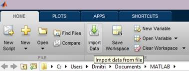
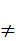

# 第三章基本语法

你在 MATLAB 中所做的所有工作都将涉及变量的使用，所以我们将从观察变量的声明和操作方式开始。

就像任何其他编程语言一样，MATLAB 有不同的运算符来做不同的事情，所以我们将看看最重要的运算符。别担心，没有那么多。接下来，我们将讨论流量控制，例如`if`和`switch`语句以及`for`和`while`循环。我们将以对异常处理的讨论来结束这一章。

## 使用变量

当在 MATLAB 中处理任何类型的计算时，我们使用变量。变量本质上是一个存储位置:它可以存储数值、字符、数组，也可以引用更高级的结构，如函数或结构。

变量通常有名字。MATLAB 中的变量名必须以字母开头，后跟零、更多字母、数字或下划线。除了已被 MATLAB 关键字取用的名称(如`if`或`for`)外，任何名称均有效。

在 MATLAB 中有一个变量是你根本无法避免遇到的:它被称为`ans`，它存储最后一次计算的结果，假设计算实际上返回了一个没有专门分配给另一个变量的值。事实上，也可以分配`ans`变量，尽管这可能不是最好的主意，因为它随时都可能被覆盖。

```
    >> 2+3

    ans =
         5

    >> ans*ans

    ans =
        25

```

除了`ans`之外，您还可以指定要赋值的变量的名称:

```
  >> z = 6 * 7

  z =
  42

```

也可以一次分配多个变量。负责此操作的函数称为`deal`，用于在一行定义多个变量的相同或不同值的赋值。变量必须在方括号中声明，用逗号分隔:

```
    >> [x,y] = deal(142)

    x =
       142
    y =
       142

    >> [a,b,c] = deal(1,2,3)

    a =
         1
    b =
         2
    c =
         3

```

## 可变数据导入和导出

工作空间中所有变量的状态都可以保存到一种特殊的文件中，该文件存储 MATLAB 格式化数据。这个文件有一个**。mat** 扩展，并且本质上包含了工作空间的快照。要使用命令窗口处理这些文件，可以使用`save`和`load`功能。这些可以在没有参数的情况下使用(在这种情况下使用的文件名是`matlab.mat`，或者您可以指定自己的文件名)。您也可以使用`save`和`load`在 MAT 数据文件中存储单个变量。

除了 MATLAB 格式化数据之外，您还可以导入已知数据格式的文件，不仅是 CSV 等，还有图像数据、电影和许多其他格式。您可以在功能区上找到“导入数据”按钮:



导入过程可以通过用户界面进行自定义(例如，您可以告诉 MATLAB 正确解释特定的日期/时间格式)，您还可以生成实际执行导入的代码，如果您想共享脚本文件和数据，这非常有用。

## 基本运算符

由于 MATLAB 是一种编程语言，基本的数学运算(加减乘除)使用可预测的`+`、`-`、`*`和`/`运算符。就像在普通数学中一样，圆括号可以用来分组运算。方括号和大括号保留用于其他用途(分别是数字和单元格数组)。

```
    >> 2*(3+4)

    ans =
        14

```

为了将`a`取为`b`的幂，MATLAB 使用了`^`(帽子或扬抑符)符号。MATLAB 还有(有点奇怪的)反除法运算符`\`(反斜杠)。这个操作符对于矩阵有特殊的含义，但是对于“标量”值，`a\b`的意思和`b/a`一样。为此目的使用此运算符可能不是一个好主意，除非您有意混淆代码。

前面提到的每一个操作符也有一个以点为前缀的*元素*等价物(例如，`.+`、`./`等等)。我们将在本书后面讨论元素操作符。

单个`=`(等于)运算符用于赋值，例如`meaningOfLife = 42`。如果要比较两个值，可以使用`==`运算符，或者，如果要检查值是否不同，可以使用`~=` `,`，这相当于符号。说到比较，MATLAB 还支持`<`和`>`运算符以及`<=`和`>=`对应的“or equal”(相当于数学符号中的和)。请注意，比较会产生一个分别表示假和真的`0`或`1`，但结果不是整数，而是单字节的`logical`值:

```
    >> 1 == 2

    ans =
         0

    >> whos ans

      Name      Size            Bytes  Class      Attributes
      ans       1x1                 1  logical

```

出于计算的目的，`logical`类型的值可以被视为数值，但是对它们的任何数值操作都将产生一个`double`值。

还需要注意的是，您可以向期望逻辑值的构造提供数值(例如，`if`语句)。在这种情况下，MATLAB 将值 0 视为表示**假**，将任何其他值视为表示**真**。但是，我不建议使用这个特性，因为它会导致难以发现的错误。

现在我们来谈谈`,`(逗号)和`;`(分号)运算符。与许多编程语言不同，MATLAB 不要求您用分号终止语句。但是，如果不这样做，计算的结果值将打印到命令窗口中。但是，如果使用分号终止语句，则命令窗口中不会打印任何内容:

```
    >> x=1

    x =
         1

    >> y=2;

```

逗号运算符用于分隔函数的参数，但它也有一个更模糊的用例——当您想要在一行中分隔几个语句，但您**想要命令窗口输出时。在这种情况下，只需用逗号分隔语句即可:**

```
    >> x=1, y=2

    x =
         1
    y =
         2

```

`%`(百分比)运算符用于创建注释，在脚本中特别有用。在特定行上跟随`%`符号的所有内容都被 MATLAB 忽略以便执行，但是当涉及到发布脚本时，运算符确实有特殊的用途(稍后讨论)。

最后是`!`(感叹号)运算符。这个操作符用于向操作系统发出命令，可以想象，它的功能取决于您运行的操作系统。例如，在 Windows 上，我们可以发出一个列出当前目录内容的命令:

```
    >> !dir

     Volume in drive C has no label.
     Volume Serial Number is 40A1-C189

     Directory of C:\Users\Dmitri\Documents\MATLAB

    23/01/2014  22:46    <DIR>          .
    23/01/2014  22:46    <DIR>          ..
    14/09/2013  15:53    <DIR>          html
    11/10/2013  11:25               199 Untitled.m
                   1 File(s)            199 bytes
                   3 Dir(s)  193,780,895,744 bytes free

```

|  | 注意:MATLAB 其实有自己的`dir`函数，你可以不用感叹号调用，得到类似(但不完全相同)的结果。 |

## 流量控制

让我们从`if`语句开始——该语句允许您检查一个条件(例如，比较的结果)，并根据结果是真还是假来执行操作(请记住，在 MATLAB 中，这些分别由 1 和 0 表示)。例如，如果我们有一个温度读数，我们需要确定外面是否热，我们可以写以下检查:

```

    t = getTemperatureValue();

    if t > 100
      disp('hot')
end

```

这段代码检查`t`的值，如果大于 100，将行‘hot’输出到命令窗口。我们可以在`if`语句中添加额外的检查，例如检查天气是否寒冷。为此，我们增加了一个`elseif`条款:

```

    if t > 100
      disp('hot')
    elseif t < 0
      disp('cold')
end

```

现在，如果第一次检查失败，将执行第二次检查。然而，如果两者都不成功(例如，`t=50`)，什么都不会发生。现在，如果我们想要执行一些其他的代码，如果我们的`if`语句中没有一个条件是真的，我们可以添加一个`else`子句:

```

    if t > 100
      disp('hot')
    elseif t < 0
      disp('cold')
    else
      disp('ok')
end

```

温度测量是一个连续的值，但是如果我们想研究一组离散的值——比如一个国家的拨号代码——我们可能想使用另一种称为`switch`语句的控制流结构。该语句试图将变量的内容与一组离散值进行匹配。例如，要从国家代码中确定国家名称，我们可以编写:

```

    switch cc
      case 44
        disp('uk')
      case 46
        disp('sweden')
      otherwise
        disp('unknown')
end

```

如果国家代码是 44，我们打印**英国**，如果是 46，我们打印**瑞典**，但是如果它等于我们未能匹配的某个其他值，我们打印**未知的**。请注意，不需要在`switch`语句中明确终止案例。

很多时候，我们希望在一组值中循环，对每个值执行一个操作。例如，让我们尝试迭代地将 1 到 500 的数字相加(这不是最好的方法，但足以进行演示)。为了循环这些值，我们使用一个`for`循环:

```

    sum = 0;

    for i = 1:500
      sum = sum + i;
    end

disp(sum)

```

在本例中，变量`i`采用 1 到 500 范围内的所有值，并且在每次迭代时，该值被添加到`sum`中。

`while`循环类似于`for`循环，区别在于它不是迭代一组值，而是检查一个条件，并在条件成立时继续执行。例如，以下代码生成并输出介于 0 和 1 之间的随机值，而这些值小于 0.7:

```

    v = rand();

    while v < 0.7
      disp(v)
      v = rand();
end

```

一旦产生大于或等于 0.7 的值，`v < 0.7`检查失败，我们退出`while`循环。

有时，您可能处于循环的中间，想要缩短执行时间。在这种情况下，您可以执行`break`语句，这将使您脱离循环，并在`end`语句之后继续执行:

```
  while 1
  x = rand();
  y = rand();
  if (x + y) > 1.0
  break
  else
  disp([num2str(x) num2str(y)])
  end
  end

```

上面的规则是通过在条件中提供一个`1` (true)故意让它永远运行的，但是一旦两个随机值之和超过`1.0`，我们就跳出一个循环。同样，如果我们想避免在这个循环中打印`x`和`y`值，我们可以用`continue`替换`break`关键字，这将简单地把我们带到循环的开始。

## 异常处理

任何时候你做了 MATLAB 不喜欢的事情，最后都是例外。异常是一种指示，表明出了问题，而 MATLAB 不知道如何处理。例如，被零除也不例外，因为 MATLAB 可以只给你`inf`常量，但是如果你试图读取一个不存在的变量，没有办法优雅地处理这个，所以 MATLAB 只是失败并显示一条错误消息。

```
     >> disp(abc); disp('done')
Undefined function or variable 'abc'.

```

生成异常后，它后面的所有其他语句都不会执行。为了避免这种情况，如果我认为可能会发生这种情况，我实际上可以尝试捕捉这种异常。方法是将代码放在 try-catch 块中可能发生异常的地方:

```

    try
      disp(abc);
    catch e
      disp (['oops! ' e.message])
    end

disp('done')

```

如果我执行这个，假设变量`abc`不存在，我得到如下输出:

```
    oops! Undefined function or variable 'abc'.
    done

```

上面发生的事情值得解释。当我们捕捉到异常时，它被存储在一个变量中(在我们的例子中，它被称为`e`)。异常本身是一个类对象(我们在第 7 章中讨论类)，其中包含关于错误的详细信息:

```
    e =
      MException with properties:

        identifier: 'MATLAB:UndefinedFunction'
           message: 'Undefined function or variable 'abc'.'
             cause: {}
             stack: [1x1 struct]

```

如您所见，异常有一个类型`MException`，它有几个字段，包括标识符、实际消息(这就是我们打印到命令窗口的内容)以及`stack`(碰巧是一个由`struct`组成的数组)，它告诉您是谁在哪里抛出了异常:

```
    >> e.stack

    ans =
        file: 'C:\Users\Dmitri\Documents\MATLAB\Untitled.m'
        name: 'Untitled'
        line: 2

```

也有可能出现`rethrow`异常，不用说，你可以使用`error`函数创建并抛出自己的异常。