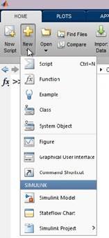
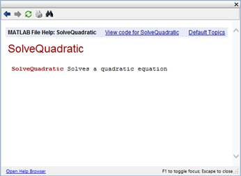
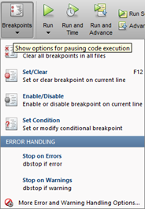
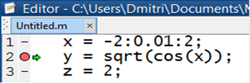
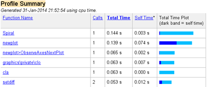
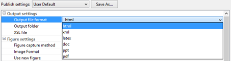
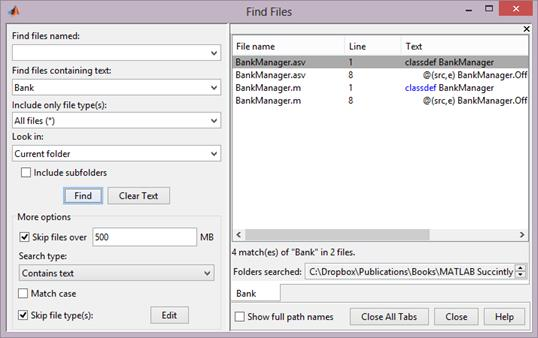
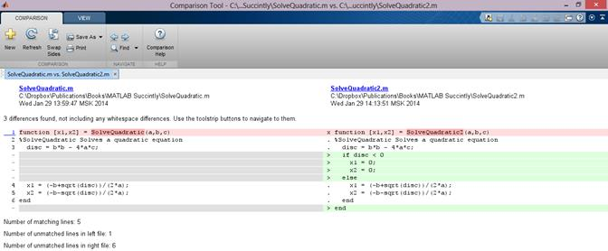

# 第 5 章使用脚本

与 MATLAB 交互有两种方式。一种是简单地在命令窗口中输入东西——这样，你可以立即看到结果，但是编写复杂的程序变得很困难(虽然不是不可能)。另一种方法是使用**脚本**——组成你的程序的独立文件。MATLAB 脚本通常具有`.m`扩展名，并且是纯文本文件，MATLAB 允许您编辑、执行和调试。

## 脚本模板

在 MATLAB 中创建脚本最简单的方法是点击**新建脚本**按钮(或 Ctrl+N 快捷键)。然而，MATLAB 也给了我们一些脚本模板——代表我们可能想要创建的某些构造的现成脚本文件:



图 11:新对象下拉列表。

这真的只是我们感兴趣的前几个选项。除了创建脚本之外，还可以创建**函数**，在这种情况下，您将简单地获得函数定义的存根；您可以制作一个**示例**，它只是一个带有格式良好的文档的脚本文件，准备发布；下一个是**类**，这是一个面向对象的构造(见第 7 章)。

这个菜单中的其他元素来自不同的工具箱，不一定是脚本文件。

因此，让我们使用函数模板创建一个可重用的函数来求解二次方程:

```
    function [x1,x2] = SolveQuadratic(a,b,c) %SolveQuadratic Solves a quadratic equation
      disc = b*b - 4*a*c;
      x1 = (-b+sqrt(disc))/(2*a);
      x2 = (-b-sqrt(disc))/(2*a);
end

```

让我们检查这个函数定义。首先，紧接在 function 关键字之后，我们在方括号内列出了函数将要返回的所有值(如果只有一个返回值，括号是不必要的)。在这种情况下，这些是 x1 和 x2 值，它们是二次方程的解。

然后，在 **=** 符号之后，我们有了函数的名称。请注意，文件名应该理想地与函数名匹配，因此`SolveQuadratic`函数应该保存在名为`SolveQuadratic.m`的脚本文件中。函数名后面是一组括号中的函数参数，用逗号分隔。当调用这个函数时，调用者必须提供与这里指定的一样多的参数(即三个)。

函数声明后面的注释行基本上为将要使用这个函数的人提供了文档。这就是 MATLAB 中的“H1 线”。当我们打开这个函数的函数浏览器时，我们将得到从这些注释中生成的文档:



图 12:我们的求解二次函数的文档。

现在，保存**后。m** 文件，我们可以开始使用该函数，假设该文件在 MATLAB 的路径上可用:

```
    >> SolveQuadratic(1,10,16)

    ans =
        -2

```

哎呀！那不太对，是吗？我们期望有两个解，但只得到一个(这发生在一些二次方程中，但我们仍然期望有两个值)。问题是我们调用了一个返回两个值的函数，但是没有为它们指定存储，所以 MATLAB 只是取了第一个值保存在`ans`中。不是很好，是吗？获取这两个值的正确方法是将它们分配给变量，如下所示:

```
    >> [x,y] = SolveQuadratic(1,10,16)

    x =
        -2

    y =
        -8

```

好多了！这段代码行有效地在一行中声明了 x 和 y，并且在函数调用之后，这两个变量都可以使用了。

## 路段

在我们开始运行脚本之前，我们需要谈谈脚本部分。这些都很重要，有两个目的:

*   部分将你的脚本分成几个可理解的部分，使它更容易阅读。在这方面，你可以考虑把脚本作为一本书的章节标题。
*   您可以分别执行每个部分。这对于测试大脚本的小部分非常有用。

一个部分的前缀通常是 **%%** (两个百分比符号)。当您为一个部分添加前缀时，您会注意到直到下一个部分的所有代码都被突出显示——这有助于您找出该部分的结束位置。

要执行一个区段，可以按下**运行区段**按钮(或 Ctrl+Enter)。被执行的部分是您的光标当前所在的部分。

## 运行和调试

运行脚本很简单——按下**运行**按钮(或 F5)，或使用运行部分选项仅运行部分脚本。当然，你也可以从命令窗口运行脚本，所以假设你的文件`SolveQuadratic.m`在 MATLAB 的路径上，你只需要输入`SolveQuadratic`，按**进入**，你的脚本就可以执行了。

虽然我们假设我们的大多数读者都是细心和熟练的 MATLAB 用户，但错误有时确实会发生，并且经常值得检查程序的执行情况。值得尝试的第一件事是调试——这是能够在中途停止程序并检查变量值的过程。

调试是使用断点完成的，断点是指示执行应该暂停的位置的标记。“编辑器”选项卡上的“断点”部分有几个与断点相关的选项:



图 13:断点选项。

最大的好处是设置/清除选项。这将在程序的当前行创建一个断点。您也可以通过按 F12 或单击编辑器左侧的边距来设置断点。



图 14:触发断点。

一旦断点触发，执行将停止，一条绿线将指示脚本暂停的行。然后，您可以逐行运行程序或继续执行。变量可以出现在工作区窗口中，或者如上所示，只需将鼠标悬停在编辑器中的符号上。

## 剖析

当我们的程序因为一些未知的原因运行缓慢时，我们都会得到这个时刻，我们想知道**为什么**。

如果您的目标是简单地获取一段代码的时间度量，可以考虑使用`tic`和`toc`函数，它们启动和停止一个简单的计时器:

```
    tic
    % your code here
    toc

```

一旦你调用`toc`，计时器停止，经过的时间被打印到命令窗口:

```
        Elapsed time is 1.127136 seconds.

```

|  | 注意:由于`tic`和`toc`只有在实际调用时才开始/停止测量时间，请确保如果您使用命令窗口，您可以在一条语句中同时调用它们(以及其间要分析的代码)。否则，你不仅要测量你自己的算法，还要测量你的打字速度！ |

如果你想要一份更完整、更全面的脚本性能报告，你需要对你的脚本进行概要分析。MATLAB 有一个内置的分析器，您可以使用它来确定脚本的哪一部分花费了最多的时间——这让您可以微调脚本中的瓶颈，从而提高它们的整体性能。您可以使用“运行和时间”按钮开始分析，当您按下该按钮并执行脚本时，MATLAB 将弹出一个额外的窗口，其中包含脚本性能的一些指标:



图 15:概要总结。

图 15 中显示的概要给出了函数被调用的次数、调用的时间以及函数本身花费的时间。可以单击每个函数来获得关于特定行的详细信息以及它们花费的时间。

当然，您也可以从命令窗口调用探查器:

```
    >> profile on
    >> myscript
    >> profile off
    >> profile viewer

```

## 出版

想象一下，你正在处理一个复杂的算法，你的经理突然想要你的工作状态更新。有了 MATLAB 的发布功能，你只需点击一个按钮，你的脚本，连同它所做的所有图表和计算，就被打包成一个准备发送的文档。

可以将 MATLAB 脚本发布到各种类型的文档中，包括 HTML、LaTeX、PDF 等。如果要将脚本发布到文档，请单击**发布**选项卡，选择**发布**、**设置**，并选择所需的格式和其他选项:



图 16:脚本文件发布格式。

| 关于 LaTeX 的一点注记要渲染好的公式，你需要使用 LaTeX，但不幸的是，MATLAB 在语法上没有给你任何帮助。您的选择如下:1.使用符号工具箱中的`latex`功能。2.在 muPad(一个单独的环境，作为 MATLAB 的配套)中创建公式，并从那里导出。3.使用适当的 LaTeX 编辑器，如 LyX。 |

现在，不管您选择什么输出格式，重要的是要意识到代码在发布时实际发生了什么。以下是发生的关键过程:

*   除了第一个之外，所有章节标题都成为顶级标题**。您创建的第一个部分成为整个文档的标题。**
*   紧接在章节标题之后的注释会变成文本段落。请注意，MATLAB 支持此类注释中的附加格式，例如使文本加粗或斜体、创建超链接甚至包括 LaTeX 公式的选项。
*   您拥有的任何可执行代码都会被放入文档中。MATLAB 应用了一些语法高亮，所以代码看起来很好。
*   你写的所有代码都会被执行。输出错误/警告消息也会出现在发布的输出中。
*   您生成的任何图像也会包含在文档中。

要生成文档，只需按**发布**—真的是这么简单。

## 比较和搜索

搜索特定文件的能力内置于所有操作系统中，但是 MATLAB 也有自己的工具来搜索特定的文件名或包含特定文本的文件。“主页”功能区选项卡有一个“查找文件”按钮，您可以通过该按钮执行以下操作:



图 17:查找文件窗口。

在该按钮的正下方是“比较”按钮，它允许您比较两个文件，以便在更新代码时查看更改:



图 18:文件比较窗口。添加的线以绿色显示，更改的线以红色显示。