# 第六章数据可视化

绘制一些数据最简单的方法是通过 UI 来完成，因此我们将从学习如何为绘制准备数据开始本章，然后使用功能区界面快速绘制数据。然后，我们将完全从控制台进行绘图，并讨论绘制数据的所有不同方法。我们还将讨论绘制符号函数的想法，尽管这是符号工具箱的一部分。

然后，我们将讨论图形窗口以及在一个图形上绘制多组数据的方法。然后，我们将研究向图中添加各种文本注释，如标签，以及在单个窗口中组合多个图的方法。然后，我将在图形窗口中展示一些用于编辑绘图的 MATLAB 功能。

为了完成这一切，我们将使用 MATLAB 讨论一个潜在的问题:它不能自动生成原点轴线。

## 通过界面绘图

在我们能够在 MATLAB 中绘制任何东西之前，我们需要定义我们将要绘制的数据。让我们做一个函数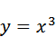的 2D 图。典型的方法是定义一个范围的值，然后计算一个范围的值，然后绘制两个:

```matlab
    >> x = linspace(-10,10,101);
    >> y = x .^ 3;

```

计算完坐标值后，我们现在可以执行以下操作:

*   在工作区窗口中选择 **x** 和 **y** 变量(要选择多个变量，在窗口中，您需要按住 **Shift** 或 **Control** )。
*   打开**绘图**功能区选项卡。
*   单击一个现成的绘图类型，在我们的示例中是名为**绘图**的类型:

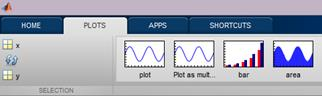

图 19:各种绘图选项。

我们得到的是:

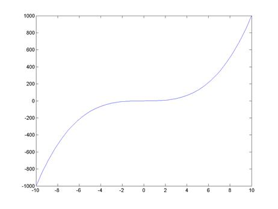

图 20:功能图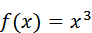。

您可以在“绘图”选项卡上按下的一组按钮对应于您选择的数据。例如，不能从两组阵列中进行三维绘图。相反，要进行三维绘图，我们需要定义一种叫做网格的东西。相应命名的`meshgrid`命令创建了两个 2D 数组，每个数组都是我们定义的范围内的值的网格。例如:

```matlab
    >> [x,y] = meshgrid(-10:0.5:10,-10:0.5:10)

```

请注意，该函数返回的不是一个值，而是两个值——前面的代码说明了两个值是如何存储在相应的变量中的。所以我们现在有变量`x`和`y`，每个都是一个 41×41 的数组。在数组`x`中，每行的值从-10 到 10(所有行都相同)，而数组`y`的所有列都从-10 到 10。

我们执行这种奇怪操作的原因是，我们想做一个表面图，即根据这些 x 和 y 值计算 z 值。我们现在可以使用 elementwise 运算计算 z 的值:

```matlab
    >> z = sin(x) .* sinh(y);

```

现在我可以简单地在工作空间中选择变量 **z** 并选择**冲浪**类型的图来得到这个:

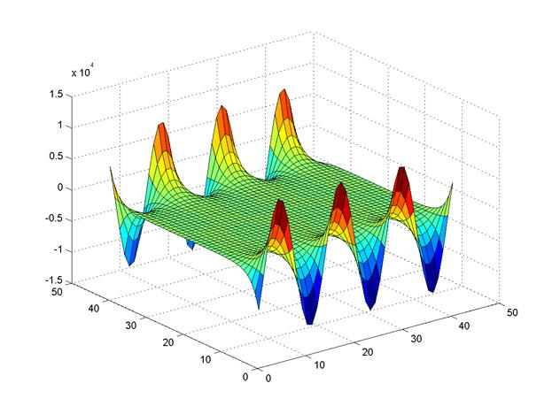

图 21:函数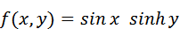的曲面图。

请再次注意，当您选择 z 值时，“绘图”功能区选项卡中可能的绘图范围也相应调整。哦，只是为了好玩，试试`surf(membrane)`……形象看起来眼熟吗？(提示:也试试`logo`。)

## 简单二维图

如果您在按下这些绘图按钮时查看命令窗口，您会看到它们所做的只是向 MATLAB 发送某些绘图命令，如`plot`或`surf`。我们现在将完全停止使用绘图选项卡，只使用命令窗口，手动输入命令。

大多数 2D 地块都是使用`plot`命令完成的。例如，假设我们想用一条红色实线绘制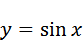。您可以简单地在命令窗口中键入以下内容:

```matlab
    >> x = linspace(-10, 10, 101);
    >> y = sin(x);
    >> plot(x, y, '-r')

```

上面的 **'-r'** 画了一条红线。我马上解释语法；现在让我们继续策划事情。

现在`plot`命令继续回收同一个窗口，所以如果我们再做一个图，会覆盖旧的。如何在同一个图形窗口上同时显示`sin`和`cos`？为此，我们需要使用`hold`命令。`hold on`使所有地块转到同一个窗口，`hold off`相应地恢复该行为。因此，让我们用蓝色绘制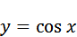来覆盖我们现有的图:

```matlab
    >> hold on
    >> y2 = cos(x);
    >> plot(x,y2,'-b')

```

最终结果如下:

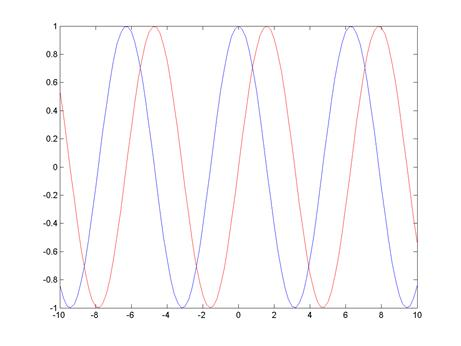

图 22:功能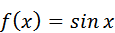和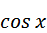分别呈现为红色和蓝色。

上面两个`plot`函数中使用的最后一个参数( **'-r'** 和 **'-b'** )是一组用于控制线条渲染方式的选项。破折号( **-** )表示我们需要一条实线(也有虚线`:`和虚线`--`样式可用，**【r】**和**【b】**分别指红色和蓝色(其他可用颜色为`g`(绿色)、`m`(代理人)、`c`(颜)、`y` (ellow)和(blac) `k`)。这也是可以控制每个数据点的标记形状的位置:有许多选项，如`'x'`(画十字)或`'o'`(画圆)–更多信息请参考文档！

就定义选项的方式而言，MATLAB 通常是非常灵活的，您应该查阅关于指定选项的无数种方式的文档，例如一个图。例如，可以使用以下内容指定绘图颜色:

```matlab
    >> plot(x,y,'color','green');

```

嗯，这就是我们的`plot`命令。plot 命令有非常广泛的文档，列出了它的许多属性和定制。

对于绘制复数不得不说:只有当`plot`取一个恰好包含复数的单个输入数组时，才能绘制实数和虚数部分。如果提供多个数组，所有输入数组的虚数都将被忽略。话说回来，有时候也不是什么坏事:

```matlab
    x = [-2:.001:2]; y = (sqrt(cos(x)).*cos(200*x)+sqrt(abs(x))-0.7).*(4-x.*x).^0.01; plot(x,y); Warning: Imaginary parts of complex X
    and/or Y arguments ignored

```

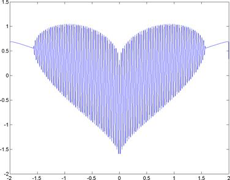

图 23: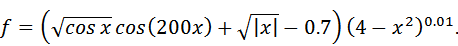
函数的一个图的虚数被完全忽略。

## 来自 2D 阵列的多个图

`plot`功能还可以让我们同时绘制几组数值。自然，函数的这种使用要求我们提供 y 值的二维数组。为这样的图准备数据有点挑战性，所以让我们一步一步地看看生成，例如，几个布朗运动路径。为此，我们将使用以下公式:

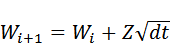哪里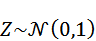和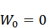

我们首先定义要生成的路径数和每个路径中的点数。我们还生成一系列时间值并计算，一个时间增量的大小:

```matlab

    pathCount = 6; % number of paths
    pointCount = 500; % points per path
t = linspace(0,1,pointCount+1); dt = t(2)-t(1);

```

目前为止，一切顺利，对吧？先别庆祝。我们现在需要计算布朗增量(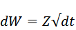)，但请记住，我们需要将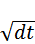乘以从正态分布中采样的 6×500 个值中的每一个。幸运的是，和大多数 MATLAB 的函数一样，生成正态分布值的函数`randn`可以取两个参数来表示维度。这让我们可以计算增量:

```matlab
    dw = randn(pointCount,pathCount) * sqrt(dt);

```

假设是单个值，则不需要元素计算；我们现在有一个 6×500 的增量数组，我们准备计算。当我们查看我们在本节开头概述的递归关系时，我们意识到我们实际上拥有的是一个累积总和:在每个处，我们计算直到该点的所有增量的总和(我们注意抢先乘以)。使用 MATLAB 的`cumsum`函数，我们计算整个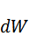值数组的累积和，注意确保条件:

```matlab
    w0 = zeros(1,pathCount);
w = cumsum([w0;dw]);

```

最后，我们可以获取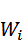值的数组，并将其馈送给绘图函数:

```matlab
  plot(w);

```

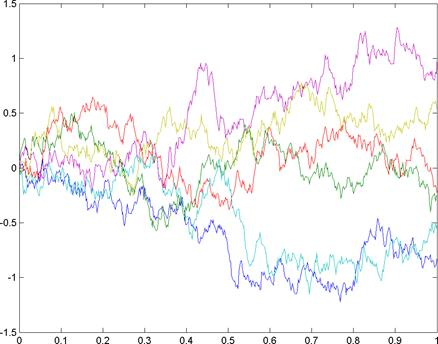

图 24:布朗运动的六种实现。

这张图片就是它的全部内容:我们生成了一个 2D 值数组，它有效地包含了布朗运动的几组实现。然后 MATLAB 帮我们把每一个都画成单独的一条线，甚至还加了一抹色彩。

## 地表图

唷，那是一个艰难的决定！无论如何，让我们回到策划事情上来。我们用于表面渲染的另一个命令叫做`surf`。下面是它从命令行调用的样子:

```matlab
    >> [x,y] = meshgrid(-10:0.5:10,-10:0.5:10);
    >> z = sin(x) ./ cosh(y);
    >> surf(z)

```

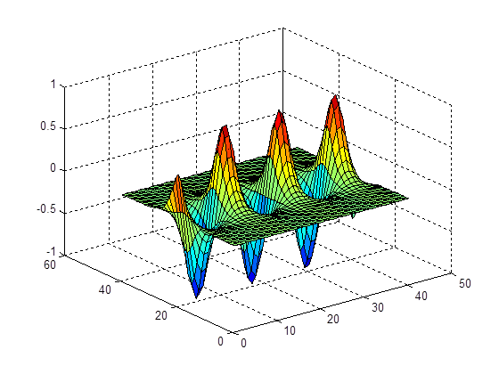 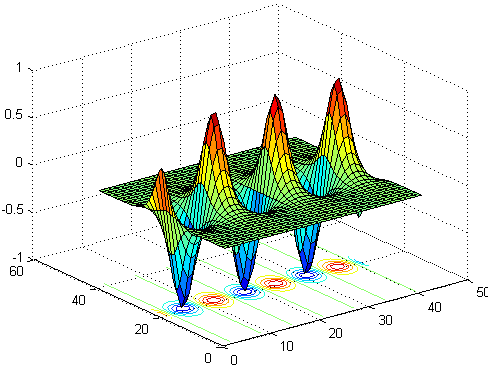

在上面的情况下，就像用单个参数调用`surf`一样简单。但是假设我们想要定制它:默认情况下，命令将最高的 z 值涂成红色，最低的涂成蓝色。如果我们想要沿 x 轴着色呢？在这种情况下，我们需要调用一个更完整的`surf`命令——我们提供 x、y 和 z 值，并明确表示我们希望使用 x 作为颜色:

```matlab
    >> surf(x,y,z,x)

```

请注意颜色分布:

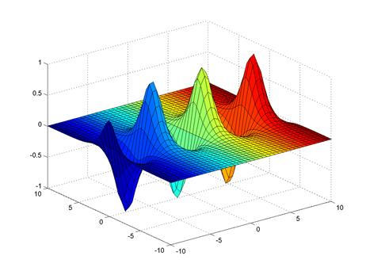

图 25:沿轴着色渲染的功能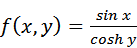。

我们实际上可以一直讨论不同的情节类型，但是由于篇幅有限，我们留给读者去研究。

表 1:常见的绘图类型。

| 绘图类型 | 它画的是什么 |
| --- | --- |
| `plot, plotyy` | 数据的二维图。“yy”变体在图的左侧和右侧呈现 y 轴。 |
| `semilogx, semilogy` | x 轴或 y 轴上的对数刻度图。 |
| `loglog` | x 轴和 y 轴上都有对数刻度的图。 |
| `bar, barh` | 垂直和水平条形图。 |
| `area` | 面积图。 |
| `pie` | 饼图。 |
| `hist` | 柱状图。 |

MATLAB 绘图库包含了特别好的不同绘图类型的选择，值得一查。

## 图形和多个图

所以你可能已经注意到，每当你制作一个新的剧情，你就失去了现有的剧情。对此我们能做些什么？嗯，首先，你需要知道`figure`命令。该命令创建一个空的图形窗口，即一个可以渲染图形的窗口。您实际上可以多次调用该命令，创建多个这样的窗口。

假设你有几个图形窗口。如果您现在调用一个命令，如`plot`，它将渲染到当前处于焦点的图形窗口。但是，如果您在同一个图形窗口中渲染两次，您将丢失旧图像——当然，除非您事先使用了`hold on`命令。

有一点我没有提到，就是剧情手柄的想法。本质上，一旦你在图形窗口中绘制了一些东西，你就可以临时改变它的属性。比如说你做了一个剧情但是忘了设置线的颜色。幸运的是，对此有一个修复，因为 MATLAB 中的所有图形对象都有句柄(这就是为什么 MATLAB 的图形被称为“句柄图形”)。所以你能做的就是保留一个图的句柄，然后使用`set`命令来调整它的属性:

```matlab
    >> p = ezplot('x^3');
    >> set(p,'color','red');

```

你可能已经猜到了，除了`set`之外，还有一个对应的`get`函数用于读取属性。

如果要将图形窗口保存为图像(如 PNG 或 PDF)，可以使用`saveas`功能。该函数使用当前窗口句柄(MATLAB 允许您通过名为`gcf`的函数进行访问)，文件格式实际上是从您指定的文件扩展名中推断出来的。例如，为了将图形窗口保存为 PNG(这正是作者在准备本书手稿时所做的)，我们编写了`saveas(gcf, 'test.png')`。

## 定制地块

让我们回到我们的`sin`和`cos`功能的剧情，并尝试为我们的剧情添加一些额外的点缀。您可能想做的第一件事是在坐标轴上添加一些标签(请注意，这些标签不会穿过原点——我们稍后会处理这个问题)。

```matlab
    >> xlabel('x');
    >> ylabel('${\sin x}, {\cos x}$','interpreter','latex')

```

第一行很简单，但第二行完全是在做别的事情。本质上，对于 y 标签，我决定使用 LaTeX 而不是纯文本。因此，我不得不使用特殊的符号，还不得不告诉 MATLAB 使用 LaTeX 解释器(再次使用符号“*键*”、“*值*来指定选项)。

接下来，我们要为不同颜色的线条添加图例文本。让我们再次使用 LaTeX，但这一次将解释器设置为临时的:

```matlab
    >> l = legend('$\sin x$', '$\cos y$');
    Warning: Unable to interpret TeX string
    "$\sin x$"
    Warning: Unable to interpret TeX string
    "$\cos y$" >> set(l,'interpreter','latex')
    >> set(l,'location','north')

```

注意 MATLAB 对不能解释字符串的抱怨——它需要一个 TeX 字符串，它的语法与 LaTeX 字符串略有不同。在我们设置了正确的选项后，一切都是固定的。此外，我们将图例框的位置设置为**北**，即图形窗口的顶部和中心。

最后，我们来设定剧情标题:

```matlab
    >> title('sin and cos functions')

```

完成所有这些定制后，我们会看到这样的图像:

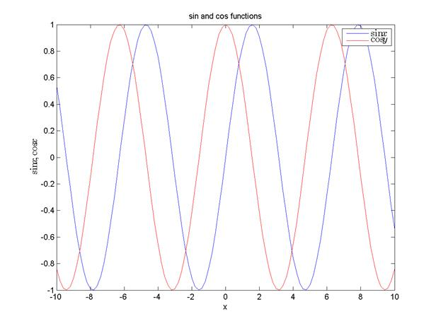

图 26:用 x 和 y 标签、图例文本和标题渲染的函数和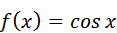。

## 支线剧情

支线剧情的想法是让几个剧情出现在一个单独的人物窗口中，但是支线剧情功能不是相互重叠，而是通过有效地将一个单独的人物窗口细分为一个 *M* -by- *N* 网格，让你将几个剧情并排放置。这可以通过一个例子得到最好的说明。首先，我创建一个新的图形窗口，使用`subplot`函数在 2×2 窗口排列的第一个象限创建一个图(这些作为函数参数提供)，然后在那个区域做一个图。

```matlab
    >> figure
    >> subplot(2,2,1)
    >> ezplot('x^2')

```

试试看。我不会在这里展示结果，因为有一个 75%空白的图像看起来有点傻。相反，让我们完成其他图(索引 2、3 和 4)，然后查看结果。

```matlab
    >> subplot(2,2,2)
    >> ezplot('gamma(x)')
    >> subplot(2,2,3)
    >> ezsurf('sin(x)*cos(y)')
    >> subplot(2,2,4)
    >> ezplot3('sin(t)','cos(t)','t',[0,6*pi])

```

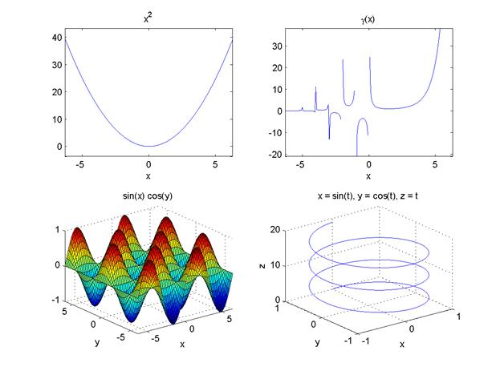

图 27:说明功能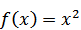、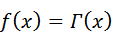和
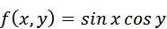的四个不同的子图，以及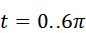的带有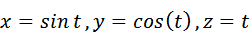的参数图。

在上面的演示中，我们使用了`ezplot`和`ezsurf`等函数，这是核心 MATLAB 安装的一部分，这让我们有点懒。这样做是为了简洁。

|  | 注意:通过指定要占用的单元位置数组，可以让子图占用图格中的多个单元。例如，`subplot(2,2,3:4)`将占据 2×2 绘图窗口的整个底部。 |

MATLAB 提供的工具允许您单独操作每个子场景(例如，旋转或平移)。在单个绘图中可以拥有的子绘图数量方面没有硬性限制，一旦超出原始绘图网格的尺寸，MATLAB 就会重新定位现有的子绘图窗口以适应新的结构。

## 图形窗口中的绘图编辑

渲染完图形后，我们可以使用命令窗口或图形窗口本身的用户界面来修改图形。我们可以旋转和平移图，添加轴标签，图例文本和其他东西。这些操作可从工具栏或图形窗口的顶层菜单中获得:

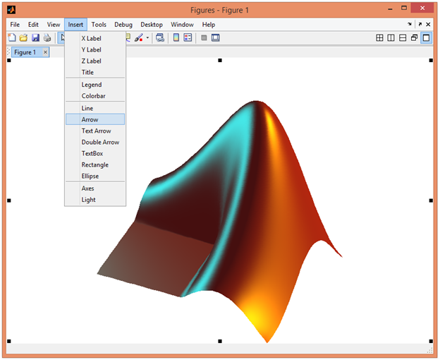

图 28:在图形窗口中编辑图形。

工具栏和**工具**菜单都允许您自定义图形的外观；您可以旋转图像、平移、放大和缩小等等。

有一个菜单项我想特别提一下:使用**文件|生成代码**，我们可以生成一个脚本文件，其中包含您使用 UI 应用的所有绘图定制。当您想要以正确的方式呈现情节时，这是演示脚本的绝佳选择。

## 绘制原点轴

每一个软件都有它的痛点，而 MATLAB 的痛点就是在绘制图形时无法自动渲染原点轴。相反，你通常在图上得到的是一组边缘标记，而不是穿过零的线。

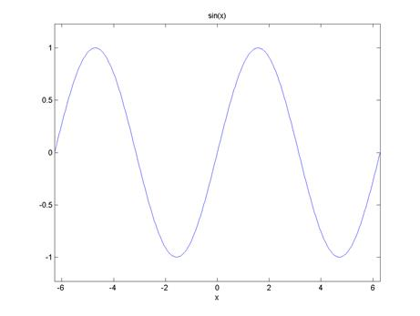

图 29:无轴线时 f(x)=sin(x)的曲线图。

人们可能认为这个问题有一些简单的解决方案，但不幸的是，没有。那么，我们能做些什么呢？最简单的解决方案是你可以打开网格:

```matlab
    >> grid on

```

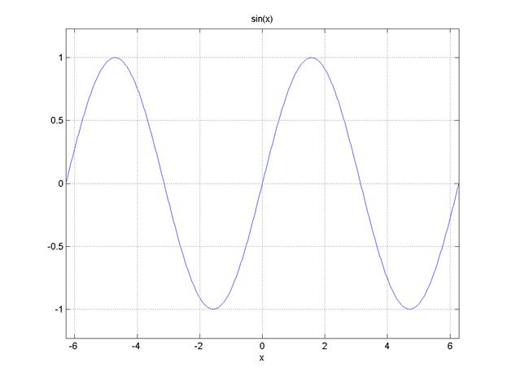

图 30:网格打开时的函数图。

虚线等间距的网格线很好地指示了图形所在的位置，但这与绘制轴线不同，因为线太多，并且它没有强调穿过零的线。

另一个选择是自己画线。您可以从`xlim`和`ylim`变量中获得图形限制，然后简单地通过原点绘制线条:

```matlab
    >> xl = xlim;
    >> yl = ylim;
    >> line([0 0], yl ,'color','black')
    >> line(xl, [0 0] ,'color','black')

```

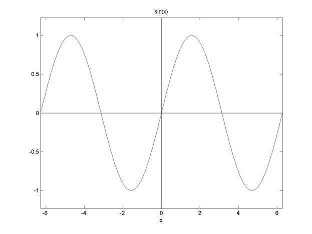

图 31:用`line`命令渲染的轴线。

这里没有刻度线或箭头；我们得到的只是台词。更不用说，如果你平移或旋转视图，你会得到一个破碎的图形。

我的建议是使用第三方组件。例如，我使用了一个名为**的组件来渲染带有箭头和刻度线的轴。如果需要的话，这个实现还会渲染 Z 轴，并且它实际上支持平移/旋转图形。渲染速度有点慢，但这是我们现有的最佳解决方案。**

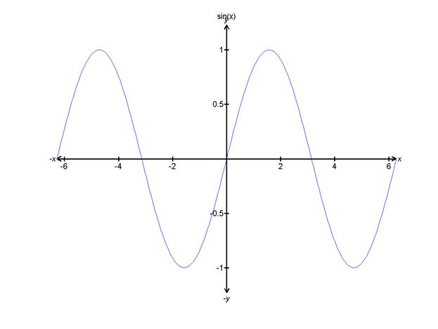

图 32:通过 oax 组件渲染的坐标轴。

要下载 oax(或其他解决方案)，前往 MATLAB 中心的文件交换(FEX)。像所有其他 FEX 提交的作品一样，oax 是开源软件。

## 图像处理

到目前为止，我们绘制的所有图表都是为了可视化数据，但 MATLAB 也支持与图像(以及延伸到电影)交互的专用功能。

为了欣赏 MATLAB 的图像处理能力，让我们尝试加载以下图像。要加载图像，我们可以使用大数据导入按钮或`imread`功能。


图 33:我们的原始图像，拍摄于瑞典最古老城市锡格图纳的一家咖啡馆。

让我们检查一下，当我们将这张图片加载到 MATLAB 中时，我们实际得到了什么:

```matlab
    >> pic = imread('33.png');
    >> whos pic
      Name         Size                  Bytes  Class    Attributes

      pic       1772x1181x3            6278196  uint8 

```

所以图像被转换成 1772 x 1181 x 3 的 uint 单位值数组。您已经可以猜到前两个维度对应于图像的宽度和高度，第三个维度用于分别包含红色、绿色和蓝色值。类`uint8`基本上是指范围为 0 的单字节(8 位)整数值..255.

要让 MATLAB 渲染这个(或任何其他)图像，我们可以简单地写`image(*pic*)`。但让我们先操纵它。例如，我们可以反转图像并使用以下命令保存它:

```matlab
    >> pic2 = 255 - pic;
    >> imwrite(pic2,'34.png')

```


图 34:倒置的图像。

当然，除了可以自己改变像素值之外，MATLAB 还提供了丰富的操作图像的功能。它具有几何变换、图像增强、分析和许多其他非专业人士无法企及的功能。