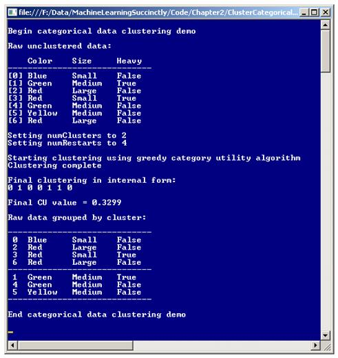
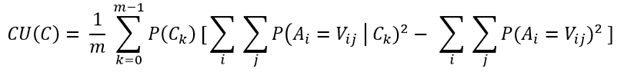
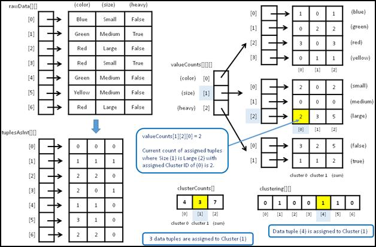

# 二、GACUC 聚类

## 简介

数据聚类是将数据项放入不同组(簇)的过程，使得特定簇中的项彼此相似，而不同簇中的项彼此不同。一旦聚集在一起，就可以检查数据以找到有用的信息，例如确定通常一起购买什么类型的商品，以便有针对性的广告可以针对客户。

最常见的聚类技术是 *k* -means 算法。但是， *k* -means 只在数据项完全为数字时才真正适用。对包含分类属性(如颜色)的数据集进行聚类是一项挑战，颜色可以采用“红色”和“蓝色”等值。聚类分类数据或包含数字和分类数据的数据集的几种方法之一是使用一个称为类别实用程序(CU)的概念。

一组聚类数据的 CU 值是一个类似于 0.3299 的数字，它衡量特定聚类的好坏。CU 的值越大越好，其中聚类的可能性比数据的随机聚类小。有几种基于 CU 的聚类算法。本章描述了一种称为贪婪凝聚类别效用聚类(GACUC)的技术。

感受 GACUC 聚类算法的一个好方法是查看**图 2-a** 所示演示程序的截图。演示程序将七个项目的数据集分成两组。每个数据项代表一颗宝石。每个项目都有三个属性:颜色(红色、蓝色、绿色或黄色)、大小(小、中或大)和重量(假或真)。

七个数据项的最终聚类是:

指数颜色大小重
-
0 蓝色小假
2 红色大假
3 红色小真
6 红色大假
-
1 绿色中真
4 绿色中假
5 黄色中假
-
CU = 0.3299

尽管很难准确描述什么是好的聚类，但大多数人可能会同意，显示的最终聚类是将七个数据项放入两个聚类的最佳方式。



图 2-a:聚类分类数据

像大多数聚类算法一样，使用 GACUC 算法进行聚类需要用户预先指定聚类的数量。但是，与大多数聚类算法不同的是，GACUC 提供了一个聚类良好度的度量标准，因此您可以尝试用不同数量的聚类进行聚类，并轻松比较结果。

## 理解类别效用

实现和定制 GACUC 聚类算法的关键是理解类别效用。数据聚类涉及解决两个主要问题。第一个问题是定义什么是好的数据聚类。第二个问题是确定一种有效的技术来搜索所有可能的聚类组合，以找到最佳聚类。

CU 解决了第一个问题。CU 是一个非常聪明的度量标准，它定义了一个聚类优度。较小的 CU 值表示聚类较差，较大的值表示聚类较好。据我所知，CU 是由 M. Gluck 和 J. Corter 在 1985 年的一篇题为“信息、不确定性和类别的效用”的研究论文中首次定义的

乍看之下，大学的数学方程式有点吓人:



这个方程比它最初出现时要简单。大写 *C* 是一个整体聚类。小写的 *m* 是簇的数量。小写的 *k* 是一个从零开始的聚类指数。大写 *P* 表示“的概率。”大写 *A* 表示属性(如颜色)。大写 *V* 表示属性值(如红色)。

右边双重求和中的项表示纯粹偶然猜测属性值的概率。左边双重求和中的术语表示猜测给定聚类的属性值的概率。因此，差异越大，聚类偶然发生的可能性就越小。

计算类别效用可能最好通过例子来理解。假设要聚类的数据集是在**图 2-a** 顶部显示的数据集，并且您想要计算这个(非最佳)聚类的 CU:

k = 0
-
红色大假
绿色中假
黄色中假
红色大假

k = 1
-
蓝色小假
绿色中真
红色小真

第一步是计算*P*(*C<sub>k</sub>T5】，这是每个聚类的概率。对于 *k* = 0，由于数据集中有 7 个元组，其中 4 个在簇 0 中，*P*(*C<sub>0</sub>*)= 4/7 = 0.5714。同理，*P*(*C*<sub xmlns:epub="http://www.idpf.org/2007/ops">1</sub>)= 3/7 = 0.4286。*

第二步是计算 CU 方程右边的二重求和，称为无条件项。计算是 *N 个*项的和，其中 *N 个*是数据集中不同属性值的总数，如下所示:

红色:(3/7) <sup>2</sup> = 0.1837
蓝色:(1/7) <sup>2</sup> = 0.0204
绿色:(2/7) <sup>2</sup> = 0.0816
黄色:(1/7) <sup>2</sup> = 0.0204
小:(2/7) <sup>2</sup> = 0.0816
中:(3/7)

无条件和= 0.1837 + 0.0204 +。。。+ 0.0816 = 1.2449(四舍五入)

第三步是计算左边的二重求和，称为条件概率项。有 *m* 个和(其中 *m* 是簇的数量)，每个都有 *N* 个项。

对于 *k* = 0，计算如下:

红色:(2/4) <sup>2</sup> = 0.2500
蓝色:(0/4) <sup>2</sup> = 0.0000
绿色:(1/4) <sup>2</sup> = 0.0625
黄色:(1/4) <sup>2</sup> = 0.0625
小:(0/4) <sup>2</sup> = 0.0000
中:(2/4)

条件 *k* = 0 求和= 0.2500 + 0.0000 +。。。+ 0.2500 = 1.8750

对于 *k* = 1，计算如下:

红色:(1/3) <sup>2</sup> = 0.1111
蓝色:(1/3) <sup>2</sup> = 0.1111
绿色:(1/3) <sup>2</sup> = 0.1111
黄色:(0/3) <sup>2</sup> = 0.0000
小:(2/3) <sup>2</sup> = 0.4444
中:(1/3)

条件 *k* = 1 和= 0.1111 + 0.1111 +。。。+ 0.4444 = 1.4444(四舍五入)

最后一步是根据 CU 方程合并计算的和:

CU = 1/2 *[0.5714 *(1.8750-1.2449)+0.4286 *(1.4444-1.2449)]

= 0.2228(四舍五入)

注意这个非最优聚类的 CU 0.2228 小于最优聚类的 CU 0.3299，如图 2-a 所示。关键是，对于包含分类数据的数据集的任何聚类，都有可能计算出一个描述聚类有多好的值。

## 了解广汽算法

在定义了一种度量聚类良好性的方法之后，聚类分类数据的第二个挑战性步骤是提出一种搜索所有可能的聚类的技术。一般来说，检查数据集的每个可能的聚类是不可行的。例如，即使是只有 100 个元组的数据集，且 *m* = 2 个聚类，也有 2 个 <sup>100</sup> / 2！= 2 <sup>99</sup> = 633，825，300，114，114，700，748，351，602，688 个可能的簇。即使你能以某种方式每秒检查一万亿个簇，也需要大约 190 亿年才能全部检查完。相比之下，宇宙的年龄估计约为 140 亿年。

GACUC 算法使用所谓的贪婪凝聚方法。这个想法是从用单个数据元组播种每个簇开始的。然后，对于每个剩余的元组，确定如果当前元组被添加到其中，哪个聚类将产生最佳的整体聚类。那么给出最佳 CU 的元组实际上被分配给该簇。

用伪代码表示:

仅将一个数据元组分配给每个簇
循环每个簇的每个剩余元组

计算 CU 是否将元组分配给簇
保存提议的 CU
结束为
确定哪个簇分配会给出最佳 CU
实际将元组分配给该簇
结束循环

该算法被称为*贪婪*，因为在任何给定状态下的最佳选择(在这种情况下是元组簇分配)总是被选择的。该算法被称为凝聚算法，因为最终的解决方案(在这种情况下是整体聚类)是一次建立一个项目。

该算法不能保证找到最优聚类。GACUC 算法产生的最终聚类取决于选择哪些 *m* 元组作为初始种子元组，以及检查剩余元组的顺序。但是因为任何聚类的结果都有一个好的度量，CU，你可以使用所谓的“重启”。在伪代码中:

循环 n 次
聚类所有数据元组，计算当前 CU
如果当前 CU >最佳 CU
保存当前聚类
最佳 CU :=当前 CU
结束如果
结束循环
返回找到的最佳聚类

事实证明，为每个簇选择一个初始数据元组并不容易。一种天真的方法是简单地选择 *m* 个随机元组作为种子。然而，如果种子元组彼此相似，那么得到的聚类可能很差。为每个聚类选择初始元组的更好方法是选择彼此尽可能不同的 *m* 元组。

有几种方法可以定义一组数据元组的差异。最简单的方法是在检查每一对可能的元组时，计算不同属性值的总数。这叫做海明距离。例如，考虑这三个元组:

[0]红色大假
[1]绿色中假
[2]黄色中假

查看颜色属性，项目 0 和 1 不同，0 和 2 不同，1 和 2 不同。查看大小属性，项目 0 和 1 不同，项目 0 和 2 不同。看一下重性属性，没有元组对不同。所以总共有 3 + 2 + 0 = 5 个差异。差异度量的值越大，意味着差异越大，这有利于选择要分配给聚类的初始元组。

现在，另一个相对次要的问题出现了。在大多数情况下，检查所有可能的初始元组集是不可行的。如果有 *T* 数据元组和 *m* 聚类，则有 Choose( *T、* *m* )方式从 *T* 元组集中选择 m 元组。比如 *T* = 500， *m* = 10，那么就有了 Choose(500，10) = 500！/ 10!* 490!=要检查的 245，810，588，801，891，098，700 个可能的初始元组集。GACUC 使用这种方法来选择几个随机的初始元组集进行检查，而不是试图检查所有可能的集。

## 演示程序总体结构

为了创建演示，我启动了 Visual Studio 并创建了一个新的 C#控制台应用，并将其命名为 ClusterCategorical。在编辑器中加载模板代码后，我删除了源代码顶部的所有`using`语句，除了对顶层系统和集合的引用。通用命名空间。

在解决方案资源管理器窗口中，我将文件 Program.cs 重命名为更具描述性的 ClusterCatProgram.cs，Visual Studio 自动将类 Program 重命名为 ClusterCatProgram。

演示程序的整体结构在**清单 2-a** 中给出，为了节省空间做了一些小的修改。注意，为了使示例代码的大小保持较小，并且主要思想尽可能清晰，省略了所有正常的错误检查。

```cs
    using System;
    using System.Collections.Generic;
    namespace ClusterCategorical
    {
      class ClusterCatProgram
      {
        static void Main(string[] args)
        {
          Console.WriteLine("Begin categorical data clustering demo");

          string[][] rawData = new string[7][];
          rawData[0] = new string[] { "Blue", "Small", "False" };
          rawData[1] = new string[] { "Green", "Medium", "True" };
          rawData[2] = new string[] { "Red", "Large", "False" };
          rawData[3] = new string[] { "Red", "Small", "True" };
          rawData[4] = new string[] { "Green", "Medium", "False" };
          rawData[5] = new string[] { "Yellow", "Medium", "False" };
          rawData[6] = new string[] { "Red", "Large", "False" };

          Console.WriteLine("Raw unclustered data: ");
          Console.WriteLine("    Color    Size     Heavy");
          Console.WriteLine("-----------------------------");
         ShowData(rawData);

          int numClusters = 2;
          Console.WriteLine("Setting numClusters to " + numClusters);
          int numRestarts = 4;
          Console.WriteLine("Setting numRestarts to " + numRestarts);

          Console.WriteLine("Starting clustering using greedy CU algorithm");
          CatClusterer cc = new CatClusterer(numClusters, rawData);
          double cu;
          int[] clustering = cc.Cluster(numRestarts, out cu);
          Console.WriteLine("Clustering complete");

          Console.WriteLine("Final clustering in internal form: ");
         ShowVector(clustering, true);

          Console.WriteLine("Final CU value = " + cu.ToString("F4"));

          Console.WriteLine("Raw data grouped by cluster: ");
         ShowClustering(numClusters, clustering, rawData);

          Console.WriteLine("End categorical data clustering demo\n");
          Console.ReadLine();
        } // Main

        static void ShowData(string[][] matrix) { . . }
        static void ShowVector(int[] vector, bool newLine) { . . }
        static void ShowClustering(int numClusters, int[] clustering,
          string[][] rawData) { . . }
      } // Program

      public class CatClusterer { . . }

    } // ns

```

清单 2-a:分类数据聚类演示程序结构

所有的簇逻辑都包含在一个名为 CatClusterer 的程序定义类中。所有的程序逻辑都包含在 Main 方法中。Main 方法首先在一个数组样式矩阵中设置七个硬编码的、颜色大小较重的数据项:

静态 void Main(字符串[]参数)

{

控制台。write line(" \ n 开始分类数据聚类演示\ n ")；

string[][] rawData =新字符串[7][]；

rawData[0] =新字符串[]{“Blue”、“Small”、“False”}；

rawData[1] =新字符串[] {“绿色”、“中”、“真”}；

rawData[2] =新字符串[] {“红色”、“大”、“假”}；

rawData[3] =新字符串[] {“红色”、“小”、“真”}；

rawData[4] =新字符串[] {“绿色”、“中”、“假”}；

rawData[5] =新字符串[] {“黄色”、“中”、“假”}；

rawData[6] =新字符串[] {“红色”、“大”、“假”}；

。。。

在非演示场景中，您可能将数据存储在文本文件中，并使用助手函数将数据加载到内存中。使用辅助方法 ShowData 显示原始字符串数据矩阵后，演示程序准备聚类参数:

int numclusters = 2：

控制台。write line(" \ n 将 numcluster 设置为"+numcluster ")；

int numrestart = 4；

控制台。WriteLine("将 numRestarts 设置为"+NumRestarts)；

变量`numRestarts`保存将调用 GACUC 算法的次数，寻找给出最大 CU 值的聚类。`numRestarts`的较大值增加了找到最佳聚类的机会，但这是以时间为代价的。在实践中通常行之有效的经验法则是将`numRestarts`设置为数据项数量的平方根。

调用界面很简单:

catcluster er cc = new catcluster er(Numclusters，raw data)；

双 Cu；

int[]聚类= cc。簇(numRestarts，out Cu)；

ShowVector(聚类，真)；

控制台。WriteLine("最终 CU 值=+CU。ToString(" F4 ")；

实例化 CatClusterer 对象，并调用其 Cluster 方法。在幕后，方法簇调用方法簇一次几次(`numRestarts`)，跟踪找到的最佳簇。返回最佳聚类及其相关联的 CU 值。

在演示程序中，最终的最佳聚类被存储到一个名为`clustering`的数组中，并被编码为{ 0，1，0，0，1，1，0 }。这意味着数据元组 0 被分配给簇 0，数据元组 1 被分配给簇 1，数据元组 2 被分配给簇 0，依此类推。找到的最佳聚类的最终 CU 值存储在外参数`cu`中，为 0.3299。

演示程序最后调用助手方法 ShowClustering 来显示原始数据，按簇排列:

。。。
控制台。write line(" \ n 按群集分组的 aw 数据:\ n ")；
显示聚类(numClusters、聚类、raw data)；
控制台。write line(" \ nAnD 分类数据聚类演示\ n ")；
控制台。ReadLine()；
} //主

## 关键数据结构

**图 2-b** 说明了广汽集团分类数据聚类程序的重要数据结构。名为`rawData`的数组样式矩阵显示了属性值(如红色)为字符串形式的数据元组。矩阵`tuplesAsInt`保存相同的数据，但是每个属性值都被转换为从零开始的索引(如 2)。在数据集非常大或机器内存有限的情况下，另一种设计是存储字符串到整数的编码，例如，通过为每个属性列使用通用字典集合。

GACUC 算法多次计算类别效用。每次都可以从头开始计算 CU，这将涉及扫描整个数据集并计算分配给每个簇的属性值的数量。但是更有效的方法是将每个属性值的当前计数存储在数据结构中，然后在每个数据元组被分配给一个簇时更新数据结构。数据结构`valueCounts`存储该信息。

`valueCounts`的第一个指标是属性，比如颜色。第二个索引是一个属性值，比如红色。第三个索引是一个簇 ID，比如 0。单元格值是计数。例如，如果单元格`valueCounts[0][2][0]`的值为 3，这意味着有三个数据元组被分配给聚类 0，其中颜色(0)的值为红色(2)。

第三个索引具有值`numClusters`的`valueCounts`中的单元格保存相关属性值的所有聚类的分配元组的总和。例如，`valueCounts[0][2][2]`保存颜色=红色时指定的元组数量。



图 2-b:广汽集团聚类算法关键数据结构

数组`clusterCounts`保存算法中任意点分配给每个聚类的数据元组的数量，以及已经分配的元组的总数。例如，如果`clusterCounts`的值为{ 2，3，5 }，则两个元组被分配给聚类 0，三个元组被分配给聚类 1，总共分配了五个元组。

## 聚类器类

一个名为 CatClusterer 的程序定义类包含了 GACUC 算法代码。类的结构在**清单 2-b** 中给出。

```cs
    public class CatClusterer
    {
      private int numClusters;
      private int[] clustering;
      private int[][] dataAsInts;
      private int[][][] valueCounts;
      private int[] clusterCounts;
      private Random rnd;

      public CatClusterer(int numClusters, string[][] rawData) { . . }
      public int[] Cluster(int numRestarts, out double catUtility) { . . }

    private int[] ClusterOnce(int seed, out double catUtility)

    private void MakeDataMatrix(string[][] rawData)
      private void Allocate() { . . }
      private void Initialize() { . . }
      private double CategoryUtility() { . . }
      private static int MaxIndex(double[] cus) { . . }
      private void Shuffle(int[] indices) { . . }
      private void Assign(int dataIndex, int clusterID) { . . }
      private void Unassign(int dataIndex, int clusterID) { . . }
      private int[] GetGoodIndices(int numTrials) { . . }
      private int[] Reservoir(int n, int range) { . . }
    }

```

清单 2-b:程序定义的分类器类

类 CatClusterer 有六个私有数据成员，如图****2-b**所示。对于包括我在内的大多数开发人员来说，在编写机器学习代码时，拥有关键数据结构的图表是必不可少的。类成员`rnd`用于生成要分配给簇的初始元组的候选集，以及以随机顺序遍历剩余元组。**

 **该类只公开了两个公共方法:构造函数和聚类方法。助手方法 ClusterOnce 执行一遍 GACUC 算法，返回找到的聚类和关联的 CU 作为输出参数。方法簇调用簇一次`numRestart`次，返回找到的最佳簇和 CU。

类构造函数调用辅助方法 MakeDataMatrix 和 Allocate。方法 MakeDataMatrix 接受要聚集的原始字符串数据的矩阵，并返回等效的从零开始的整数编码矩阵。一个重要的替代设计是预处理原始数据，并将整数表示保存为文本文件。方法分配为关键数据结构分配内存，这只是为了保持构造函数代码整洁。

做大部分工作的方法 ClusterOnce 调用助手方法 GetGoodIndices、Assign、Unassign、Shuffle 和 MaxIndex。方法 GetGoodIndices 生成彼此不同的初始数据元组。分配更新所有数据结构，以将元组分配给簇。取消分配反转“分配”操作。方法 Shuffle 用于以随机顺序呈现数据元组。方法使用 MaxIndex 来寻找最佳的建议群集分配。

私有方法水库是一个由助手方法 GetGoodIndices 调用的子助手。方法储层使用一种称为储层采样的小型算法来寻找不同的阵列指数。CatClusterer 类构造函数很短:

公共 catcluster er(int numcluster，string[][] rawData)

{

this.numClusters = numClusters

makedatamatrix(raw data)；

allocate()；

}

设计机器学习代码时，一个反复出现的主题是决定将源数据传递给构造函数还是主要的公共方法。在这里，数据被传递给构造器，以便助手 MakeDataMatrix 可以创建内部整数形式的`dataAsInts`矩阵。

## 聚类法

方法簇出现在**清单 2-c** 中。请注意，该方法不接受表示要聚集的数据的参数；假设数据作为类成员可用。

```cs
    public int[] Cluster(int numRestarts, out double catUtility)
    {
    int numRows = dataAsInts.Length;
      double currCU, bestCU = 0.0;
      int[] bestClustering = new int[numRows];
      for (int start = 0; start < numRestarts; ++start)
      {
        int seed = start; // use the start index as rnd seed
        int[] currClustering = ClusterOnce(seed, out currCU);
        if (currCU > bestCU)
        {
          bestCU = currCU;
          Array.Copy(currClustering, bestClustering, numRows);
        }
      }
      catUtility = bestCU;
      return bestClustering;
    }

```

清单 2-c:簇方法

方法簇本质上是方法簇的包装器。请注意，传递给方法簇一次的随机化种子值是当前迭代变量`start`的值。当使用重启算法时，这个技巧是一种常见的设计模式，这样工作方法就不会在每次迭代中返回相同的结果。

方法簇的定义始于:

private int[]ClusterOne(int seed，out double catUtility)

{

this.rnd = new Random(种子)；

初始化()；

。。。

助手方法 Initialize 执行三个任务。首先，`clustering`数组中的值都设置为-1。这允许算法知道数据元组是否已经被分配给簇。其次，`clusterCounts`中的值被设置为 0 以重置数组，该数组保存对簇一次的任何先前调用的计数。第三，数据结构`valueCounts`中的值设置为 0。

接下来，方法 ClusterOnce 选择第一个元组，并将它们分配给簇:

int numTrials = dataAsInts。长度；

int[]good indexes = getgood indexes(numTrials)；

for(int k = 0；k < numClusters++k)

assign(GoodIndex[k]，k)；

方法 GetGoodIndices 返回`numClusters`数据元组不同的数据索引。如前所述，通常不可能检查初始元组的所有可能的候选集合，因此检查集合的`numTrials`。在找到这些好的索引(数据元组不同)之后，它们相关的数据元组被分配给簇。

一个简短的例子将有助于澄清。对于演示数据，七个数据元组和簇数设置为三，方法 GetGoodIndices 可能返回{ 6，0，1 }。这些是由汉明距离定义的彼此非常不同的三个数据项的索引:

[6]红色大假
[0]蓝色小假
[1]绿色中真

这三个元组 6、0 和 1 分别被分配给簇 0、1 和 2。得到的`clustering`数据成员将是:

1 2 -1 -1 -1 -1 0(簇 ID)
【0】【1】【2】【3】【4】【5】【6】(元组索引)

接下来，对数据元组的顺序进行加扰，以便它们以随机顺序呈现:

int numRows =资料子系。长度；

int[]RNDsequence = new int[NumRows]；

for(int I = 0；i < numRows++i)

rnd sequence[I]= I；

shuffle(RNDsequence)；

助手方法 shuffle 使用 Fisher-Yates 算法来对数据元组索引进行 Shuffle。费希尔-耶茨混洗在机器学习代码中非常常见。

此时，聚类算法遍历每个元组。如果当前元组没有被分配给一个聚类(如果未分配，`clustering`中的值将为-1)，则检查聚类标识的每个可能值，并且给出最佳聚类的一个聚类标识(CU 的最大值)与当前元组相关联:

for(int t = 0；t < numRows++t) //遍历每个元组

{

int idx = RNDsequence[t]；//要处理的数据元组的索引

if(聚类[idx]！= -1)继续；//已经聚集

double[]candidatecou =新的 double[Numclusters]；

for(int k = 0；k < numClusters++(k)//每个可能的簇

{

赋值(idx，k)；//暂定群集分配

candidatecou[k]= CategoryUtility()；//计算并保存 CU

取消分配(idx，k)；//撤消暂定工作分配

}

int bestK = Maxindex(CandidateCu)；//贪婪。索引是一个群集标识

Assign(idx，bestK)；//现在我们知道哪个簇的 CU 最好了

} //每个元组

此时，所有数据元组都已分配给一个簇。方法簇一次计算最终的类别实用程序，并将簇作为显式返回值返回，将 CU 作为输出参数返回:

。。。

catUtility = CategoryUtility()；

int[]结果= new int[NumRows]；

数组。复制(this.clustering，result，numRows)；

返回结果；

}

## 类别效用法

广汽集团分类数据聚类算法的核心是为给定的数据聚类计算类别效用的方法。方法 CategoryUtility 相对简单，因为它使用存储在数据结构`valueCounts`和`clusterCounts`中的预计算计数。

定义开始于计算*P*(*C<sub>k</sub>T5】)项，每个聚类的概率:*

ClusterOnce 调用的私有双 CategoryUtility() //方法

{

int numtuplessassigned = cluster counts[cluster counts。length-1]；

double[]cluster probs = new double[this . Numclusters]；

for(int k = 0；k < numClusters++k)

cluster probs[k]=(cluster counts[k]* 1.0)/numtuplessassigned；

。。。

接下来，计算单个无条件项(无条件概率之和):

双无条件= 0.0；

for(int I = 0；I

{

for(int j = 0；j

{

int sum = value counts[I][j][Numclusters]；//最后一个单元格保存总和

double p =(sum * 1.0)/numtuplessassigned；

无条件+=(p * p)；

}

}

接下来，计算`numCluster`条件项(条件概率的和):

double[]条件句= new double[Numclusters]；

for(int k = 0；k < numClusters++k)

{

for(int I = 0；I

{

for(int j = 0；j

{

double p =(value counts[I][j][k]* 1.0)/cluster counts[k]；

条件句[k]+=(p * p)；

}

}

}

随着拼图块的计算，CategoryUtility 方法根据类别效用的数学定义将它们组合起来:

。。。
二重求和= 0.0；

for(int k = 0；k < numClusters++k)

summary+= cluster probs[k]*(条件句[k] -无条件)；

返回求和/numcluster；

}

Method CategoryUtility 是一种内部方法，因为它假设所有需要的计数都可用。您可能想考虑编写一个独立的公共作用域版本，创建并初始化本地版本的`valueCounts`和`clusterCounts`，扫描`clustering`数组并使用`dataAsInts`矩阵填充计数数据结构，然后使用计数计算 CU。

## 聚类初始化

聚类初始化过程是 GACUC 分类数据聚类算法的主要定制点。初始化后，GACUC 聚类是确定性的，因此聚类结果完全依赖于初始化。初始化在方法 GetGoodIndices 中实现。

该方法的定义开始于:

private int[]GetGoodIndexs(int numTrials)

{

int numRows =资料子系。长度；

int numCols = dataAsInts[0]。长度；

int[]结果= new int[Numclusters]；

。。。

目标是找到彼此不同的数据元组的索引。因为在大多数情况下不可能检查所有可能的候选数据元组集合，所以参数`numTrials`保存检查随机选择的集合的次数。

即使不是所有可能的初始元组集都可以被检查，一般来说，可以比较候选集中所有可能的元组对:

int largestiff =-1；

for(int trial = 0；试用< numTrials++试用版)

{

int[]候选者=储层(numClusters，Numrows)；

int NumDiffects = 0；//对于这些候选人

for(int I = 0；I

{

for(int j = I+1；j

{

int aRow =候选人[I]；

int bRow =候选者[j]；

for(int col = 0；col < numCols+++列)

if(数据子[aRow][col]！=资料子代[bRow][col]

+++numDifferences；

} // j

} // i

。。。

这个想法可能有点混乱。假设要群集的源数据有 500 个数据项，并且群集的数量设置为 3。初始三元组有 Choose(500，3) = 20，708，500 个可能的候选集，数量很多。假设每个数据元组有四个属性。要比较任何三元组集合的所有可能对，需要进行 Choose(3，2) * 4 = 12 次比较，这是非常可行的。

在簇的数量非常大并且属性的数量也很大的情况下，您可以修改 GetGoodIndices 来只检查候选元组的相邻对。本章末尾的程序清单为此提供了示例代码。

第二个初始化选项是使用汉明距离的替代方法来测量两个数据元组之间的差异。您可能希望探索的选项包括称为余弦相似性、古道尔相似性和斯米尔诺夫相似性的指标。

方法 GetGoodIndices 的结论是跟踪当前值差的数量是否大于迄今为止找到的最佳(最大)数量，如果是，则保存元组索引的候选集合:

。。。
if(numDifferences>large stdiff)

{

largestDiff = numDifferences

数组。复印件(考生、成绩、人数)；

}

} //试用

返回结果；

}

## 水库采样

方法 GetGoodIndices 调用一个名为水库的辅助方法。该实用方法返回从 0 到 *r* - 1 的随机的不同值 *n* ，对应于 *n* 不同的数组索引。返回随机的、不同的数组索引是一个非常常见的机器学习任务，也是一个令人惊讶的有趣任务。

对于演示程序，有七个数据元组，索引为 0 到 6(因此 *r* = 7)，聚类数设置为 3(因此 *n* = 3)，方法 GetGoodIndices 必须生成三个不同的值，从 0 到 6。有三种常见的方法来生成 *n* 随机不同的数组索引:强力、随机选择和储层采样。

在伪码中，生成 0 和 *r* - 1 之间的 *n* 随机整数的蛮力技术是:

循环 t 次
选择【0，r-1】
之间的 n 个随机整数，如果 n 个整数都不相同
返回 n 个整数
如果
结束//再试一次
结束循环
返回失败

暴力方法的问题在于，不能保证你会得到不同的值。然而，当要生成的整数数量( *n* )与范围( *r* )相比非常非常小时，蛮力非常有效。例如，如果目标是选择 *n* = 3 个 0 到 9999 之间的整数，则在三个随机值中获得重复值的机会很小。

在伪代码中，随机选择技术是:

创建一个从 0 到 r-1 的连续整数的暂存数组
对数组中的值进行混洗(使用 Fisher-Yates)
选择并返回混洗数组中的前 n 个值

随机选择方法的问题在于它为暂存阵列使用了额外的内存。但是 *n* 小时(比如小于 1000)洗牌选择简单有效。

演示程序使用了一种非常聪明的算法，叫做储层采样。在伪代码中:

为 t 创建一个从 0 到 n-1 的顺序整数的小结果数组
循环:= n 到 r-1
如果 j < n
设置结果[j] := t
结束循环
返回结果，则生成一个介于[0，t]
之间的随机整数 j

储层采样并不明显，实际代码可能比伪代码更容易理解，这是一个罕见的例子。方法储层的代码是:

私人水库(整数，整数范围)

{

//选择[0，范围]之间的 n 个随机索引

int[]结果= new int[n]；

for(int I = 0；I < n；++i)

结果[I]= I；

for(int t = n；t

{

int j = rnd .下一个(0、t+1)；

if (j < n)

结果[j]= t；

}

返回结果；

}

假设目标是生成 0 到 6(含 0 和 6)之间的 *n* = 3 个随机不同整数。`result`数组初始化为{ 0，1，2 }。第一次通过算法的循环， *t* = 3。随机的 *j* 在 0 和 3 之间产生，包括 0 和 3。假设是 *j* = 2。因为(*j*= 2)<(*n*= 3)`result`【*j*= 2】设置为 *t* = 3，所以`result`阵现在是{ 0，1，3 }。

第二次通过循环， *t* = 4。假设生成的 *j* = 0。因为(*j*= 0)<(*n*= 3)`result`【*j*= 0】设置为 *t* = 4，`result`现在是{ 4，1，3 }。

第三次通过循环， *t* = 5。假设生成的 *j* = 4。因为( *j* = 4)不小于( *n* = 3)，`result`不变，保持{ 4，1，3 }。

第四次通过循环， *t* = 6。假设生成的 *j* = 1。因为(*j*= 1)<(*n*= 3)`result`【*j*= 1】设置为 6，`result`现在是{ 4，6，3 }。 *t* 循环终止，`result`返回。

## 混合数据聚类

GACUC 聚类算法旨在用于分类数据项，但也可用于对包含数字和分类数据混合的数据进行聚类。这个想法是首先将数字数据转换成分类数据。例如，假设要聚集的数据项代表人，并且每个数据项都有属性(性别、年龄、工作)。例如，前两个数据项可能是:

男，28.0，工程师
女，52.0，会计师

如果转换原始年龄数据，使 0 至 21 岁为低年龄，22 至 45 岁为中年龄，46 至 99 岁为高年龄，则数据项变为:

男，中等，工程师
女，高，会计师

现在数据都是分类的，可以使用 GACUC 算法。将数字数据转换为分类数据称为*离散化*数据，或宁滨数据。

对于该示例数据，GACUC 算法没有考虑类别高比类别低更接近类别中的事实。一个未被探索的选择是修改 GACUC 算法以使用分类数据接近度信息。

## 第 2 章完整演示程序源代码

```cs
    using System;
    using System.Collections.Generic;
    namespace ClusterCategorical
    {
      class ClusterCatProgram
      {
        static void Main(string[] args)
        {
          Console.WriteLine("\nBegin categorical data clustering demo\n");

          string[][] rawData = new string[7][];

          rawData[0] = new string[] { "Blue", "Small", "False" };
          rawData[1] = new string[] { "Green", "Medium", "True" };
          rawData[2] = new string[] { "Red", "Large", "False" };
          rawData[3] = new string[] { "Red", "Small", "True" };
          rawData[4] = new string[] { "Green", "Medium", "False" };
          rawData[5] = new string[] { "Yellow", "Medium", "False" };
          rawData[6] = new string[] { "Red", "Large", "False" };

          Console.WriteLine("Raw unclustered data:\n");
          Console.WriteLine("    Color    Size     Heavy");
          Console.WriteLine("-----------------------------");
         ShowData(rawData);

          int numClusters = 2;
          Console.WriteLine("\nSetting numClusters to " + numClusters);
          int numRestarts = 4;
          Console.WriteLine("Setting numRestarts to " + numRestarts);

          Console.WriteLine("\nStarting clustering using greedy category utility");
          CatClusterer cc = new CatClusterer(numClusters, rawData); // restart version
          double cu;
          int[] clustering = cc.Cluster(numRestarts, out cu);
          Console.WriteLine("Clustering complete\n");

          Console.WriteLine("Final clustering in internal form:");
         ShowVector(clustering, true);

          Console.WriteLine("Final CU value = " + cu.ToString("F4"));

          Console.WriteLine("\nRaw data grouped by cluster:\n");
         ShowClustering(numClusters, clustering, rawData);

          Console.WriteLine("\nEnd categorical data clustering demo\n");
          Console.ReadLine();
        } // Main

        static void ShowData(string[][] matrix) // for tuples
        {
          for (int i = 0; i < matrix.Length; ++i)
          {
            Console.Write("[" + i + "] ");
            for (int j = 0; j < matrix[i].Length; ++j)
              Console.Write(matrix[i][j].ToString().PadRight(8) + " ");
            Console.WriteLine("");
          }
        }

        public static void ShowVector(int[] vector, bool newLine) // for clustering
        {
          for (int i = 0; i < vector.Length; ++i)
            Console.Write(vector[i] + " ");
          Console.WriteLine("");
          if (newLine == true)
            Console.WriteLine("");
        }

        static void ShowClustering(int numClusters, int[] clustering, string[][] rawData)
        {
          Console.WriteLine("-----------------------------");
          for (int k = 0; k < numClusters; ++k) // display by cluster
          {
            for (int i = 0; i < rawData.Length; ++i) // each tuple
            {
              if (clustering[i] == k) // curr tuple i belongs to curr cluster k
              {
                Console.Write(i.ToString().PadLeft(2) + " ");
                for (int j = 0; j < rawData[i].Length; ++j)
                {
                 Console.Write(rawData[i][j].ToString().PadRight(8) + " ");
                }
                Console.WriteLine("");
              }
            }
            Console.WriteLine("-----------------------------");
          }
        }

      } // Program

      public class CatClusterer
      {
        private int numClusters; // number of clusters
        private int[] clustering; // index = a tuple, value = cluster ID
        private int[][] dataAsInts; // ex: red = 0, blue = 1, green = 2
        private int[][][] valueCounts; // scratch to compute CU [att][val][count](sum)
        private int[] clusterCounts; // number tuples assigned to each cluster (sum)
        private Random rnd; // for several randomizations

        public CatClusterer(int numClusters, string[][] rawData)
        {
          this.numClusters = numClusters;
          MakeDataMatrix(rawData); // convert strings to ints into this.dataAsInts[][]
          Allocate(); // allocate all arrays & matrices (no initialize values)
        }

        public int[] Cluster(int numRestarts, out double catUtility)
        {
          // restart version
          int numRows = dataAsInts.Length;
          double currCU, bestCU = 0.0;
          int[] bestClustering = new int[numRows];
          for (int start = 0; start < numRestarts; ++start)
          {
            int seed = start; // use the start index as rnd seed
            int[] currClustering = ClusterOnce(seed, out currCU);
            if (currCU > bestCU)
            {
              bestCU = currCU;
              Array.Copy(currClustering, bestClustering, numRows);
            }
          }
          catUtility = bestCU;
          return bestClustering;
       } // Cluster

        private int[] ClusterOnce(int seed, out double catUtility)
        {
          this.rnd = new Random(seed);
          Initialize(); // clustering[] to -1, all counts[] to 0

          int numTrials = dataAsInts.Length; // for initial tuple assignments
          int[] goodIndexes = GetGoodIndices(numTrials); // tuples that are dissimilar
          for (int k = 0; k < numClusters; ++k) // assign first tuples to clusters
            Assign(goodIndexes[k], k);

          int numRows = dataAsInts.Length;
          int[] rndSequence = new int[numRows];
          for (int i = 0; i < numRows; ++i)
            rndSequence[i] = i;
         Shuffle(rndSequence); // present tuples in random sequence

          for (int t = 0; t < numRows; ++t) // main loop. walk through each tuple
          {
            int idx = rndSequence[t]; // index of data tuple to process
            if (clustering[idx] != -1) continue; // tuple clustered by initialization

            double[] candidateCU = new double[numClusters]; // candidate CU values

            for (int k = 0; k < numClusters; ++k) // examine each cluster
            {
              Assign(idx, k); // tentative cluster assignment
              candidateCU[k] = CategoryUtility(); // compute and save the CU
              Unassign(idx, k); // undo tentative assignment
            }

            int bestK = MaxIndex(candidateCU); // greedy. the index is a cluster ID
            Assign(idx, bestK); // now we know which cluster gave the best CU
          } // each tuple

          catUtility = CategoryUtility();
          int[] result = new int[numRows];
          Array.Copy(this.clustering, result, numRows);
          return result;
        } // ClusterOnce

        private void MakeDataMatrix(string[][] rawData)
        {
          int numRows = rawData.Length;
          int numCols = rawData[0].Length;

          this.dataAsInts = new int[numRows][]; // allocate all
          for (int i = 0; i < numRows; ++i)
            dataAsInts[i] = new int[numCols];

          for (int col = 0; col < numCols; ++col)
          {
            int idx = 0;
            Dictionary<string, int> dict = new Dictionary<string, int>();
            for (int row = 0; row < numRows; ++row) // build dict for curr col
            {
              string s = rawData[row][col];
              if (dict.ContainsKey(s) == false)
               dict.Add(s, idx++);
            }
            for (int row = 0; row < numRows; ++row) // use dict
            {
              string s = rawData[row][col];
              int v = dict[s];
              this.dataAsInts[row][col] = v;
            }
          }
          return; // explicit return style
        }

        private void Allocate()
        {
          // assumes dataAsInts has been created
          // allocate this.clustering[], this.clusterCounts[], this.valueCounts[][][]
          int numRows = dataAsInts.Length;
          int numCols = dataAsInts[0].Length;

          this.clustering = new int[numRows];
          this.clusterCounts = new int[numClusters + 1]; // last cell is sum

          this.valueCounts = new int[numCols][][]; // 1st dim

          for (int col = 0; col < numCols; ++col) // need # distinct values in each col
          {
            int maxVal = 0;
            for (int i = 0; i < numRows; ++i)
            {
              if (dataAsInts[i][col] > maxVal)
                maxVal = dataAsInts[i][col];
            }
            this.valueCounts[col] = new int[maxVal + 1][]; // 0-based 2nd dim
          }

          for (int i = 0; i < this.valueCounts.Length; ++i) // 3rd dim
            for (int j = 0; j < this.valueCounts[i].Length; ++j)
              this.valueCounts[i][j] = new int[numClusters + 1]; // +1 last cell is sum

          return;
        }

        private void Initialize()
        {
          for (int i = 0; i < clustering.Length; ++i)
            clustering[i] = -1;

          for (int i = 0; i < clusterCounts.Length; ++i)
            clusterCounts[i] = 0;

          for (int i = 0; i < valueCounts.Length; ++i)
            for (int j = 0; j < valueCounts[i].Length; ++j)
              for (int k = 0; k < valueCounts[i][j].Length; ++k)
               valueCounts[i][j][k] = 0;

          return;
        }

        private double CategoryUtility() // called by ClusterOnce
        {
          // because CU is called many times use precomputed counts
          int numTuplesAssigned = clusterCounts[clusterCounts.Length - 1]; // last cell

          double[] clusterProbs = new double[this.numClusters];
          for (int k = 0; k < numClusters; ++k)
            clusterProbs[k] = (clusterCounts[k] * 1.0) / numTuplesAssigned;

           // single unconditional prob term
          double unconditional = 0.0;
          for (int i = 0; i < valueCounts.Length; ++i)
          {
            for (int j = 0; j < valueCounts[i].Length; ++j)
            {
              int sum = valueCounts[i][j][numClusters]; // last cell holds sum
              double p = (sum * 1.0) / numTuplesAssigned;
              unconditional += (p * p);
            }
          }

          // conditional terms each cluster
          double[] conditionals = new double[numClusters];
          for (int k = 0; k < numClusters; ++k)
          {
            for (int i = 0; i < valueCounts.Length; ++i) // each att
            {
              for (int j = 0; j < valueCounts[i].Length; ++j) // each value
              {
                double p = (valueCounts[i][j][k] * 1.0) / clusterCounts[k];
               conditionals[k] += (p * p);
              }
            }
          }

          // we have P(Ck), EE P(Ai=Vij|Ck)^2, EE P(Ai=Vij)^2 so we can compute CU easily
          double summation = 0.0;
          for (int k = 0; k < numClusters; ++k)
            summation += clusterProbs[k] * (conditionals[k] - unconditional);
            // E P(Ck) * [ EE P(Ai=Vij|Ck)^2 - EE P(Ai=Vij)^2 ] / n

          return summation / numClusters;
        } // CategoryUtility

        private static int MaxIndex(double[] cus)
        {
          // helper for ClusterOnce. returns index of largest value in array
          double bestCU = 0.0;
          int indexOfBestCU = 0;
          for (int k = 0; k < cus.Length; ++k)
          {
            if (cus[k] > bestCU)
            {
              bestCU = cus[k];
              indexOfBestCU = k;
            }
          }
          return indexOfBestCU;
        }

        private void Shuffle(int[] indices) // instance so can use class rnd
        {
          for (int i = 0; i < indices.Length; ++i) // Fisher-Yates shuffle
          {
            int ri = rnd.Next(i, indices.Length); // random index
            int tmp = indices[i];
            indices[i] = indices[ri]; // swap
            indices[ri] = tmp;
          }
        }

        private void Assign(int dataIndex, int clusterID)
        {
          // assign tuple at dataIndex to clustering[] cluster, and
          // update valueCounts[][][], clusterCounts[]
         clustering[dataIndex] = clusterID; // assign

          for (int i = 0; i < valueCounts.Length; ++i) // update valueCounts
          {
            int v = dataAsInts[dataIndex][i]; // att value
            ++valueCounts[i][v][clusterID];   // bump count
            ++valueCounts[i][v][numClusters]; // bump sum
          }
         ++clusterCounts[clusterID]; // update clusterCounts
         ++clusterCounts[numClusters]; // last cell is sum
        }

        private void Unassign(int dataIndex, int clusterID)
        {
         clustering[dataIndex] = -1; // unassign
          for (int i = 0; i < valueCounts.Length; ++i) // update
          {
            int v = dataAsInts[dataIndex][i];
            --valueCounts[i][v][clusterID];
            --valueCounts[i][v][numClusters]; // last cell is sum
          }
         --clusterCounts[clusterID]; // update clusterCounts
         --clusterCounts[numClusters]; // last cell
        }

        private int[] GetGoodIndices(int numTrials)
        {
          // return numClusters indices of tuples that are different
          int numRows = dataAsInts.Length;
          int numCols = dataAsInts[0].Length;
          int[] result = new int[numClusters];

          int largestDiff = -1; // differences for a set of numClusters tuples
          for (int trial = 0; trial < numTrials; ++trial)
          {
            int[] candidates = Reservoir(numClusters, numRows);
            int numDifferences = 0; // for these candidates

            for (int i = 0; i < candidates.Length - 1; ++i) // all possible pairs
            {
              for (int j = i + 1; j < candidates.Length; ++j)
              {
                int aRow = candidates[i];
                int bRow = candidates[j];

                for (int col = 0; col < numCols; ++col)
                 if (dataAsInts[aRow][col] != dataAsInts[bRow][col])
                    ++numDifferences;
              }
            }

            //for (int i = 0; i < candidates.Length - 1; ++i) // only adjacent pairs
            //{
            // int aRow = candidates[i];
            // int bRow = candidates[i+1];
            // for (int col = 0; col < numCols; ++col)
            //    if (dataAsInts[aRow][col] != dataAsInts[bRow][col])
            //      ++numDifferences;
            //}

            if (numDifferences > largestDiff)
            {
              largestDiff = numDifferences;
              Array.Copy(candidates, result, numClusters);
            }
          } // trial
          return result;
        }

        private int[] Reservoir(int n, int range) // helper for GetGoodIndices
        {
          // select n random indices between [0, range)
          int[] result = new int[n];
          for (int i = 0; i < n; ++i)
            result[i] = i;

          for (int t = n; t < range; ++t)
          {
            int j = rnd.Next(0, t + 1);
            if (j < n)
              result[j] = t;
          }
          return result;
        }
      } // CatClusterer
    } // ns

```**