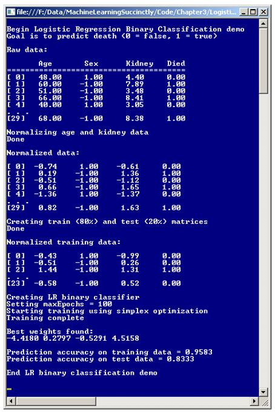
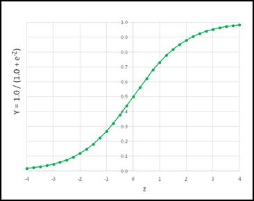
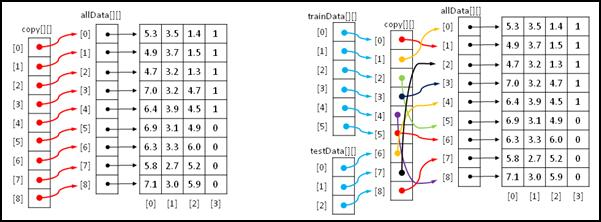
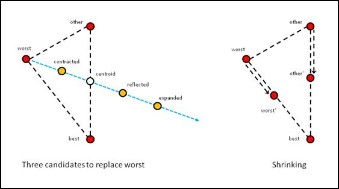

# 三、逻辑回归分类

## 简介

机器学习分类是创建软件系统的过程，该软件系统预测数据项属于哪个类别。例如，您可能希望根据身高、职业和消费行为等特征来预测一个人的性别(男性或女性)。或者，您可能希望基于预测因素(如年收入、当前债务等)来预测企业的信用价值(低、中或高)。在要预测的类只有两个可能值的情况下，例如性别，可以是男性也可以是女性，这个问题被称为二元分类。在依赖类有三个或更多可能值的情况下，这个问题被称为多类问题。

机器学习词汇可以有很大的不同，但是目标是预测某个数值的问题，而不是预测一个类的问题，通常被称为回归问题。例如，您可能希望根据预测因素(如对手、主场优势因素、前几场比赛的平均得分等)来预测一些足球队的得分。这是一个回归问题。

有许多不同的机器学习分类方法。例子包括朴素贝叶斯分类、概率单位分类、神经网络分类和决策树分类。也许最常见的分类技术叫做逻辑回归分类。尽管事实上逻辑回归分类包含“回归”这个词，但它实际上是一种分类技术，而不是回归技术。更令人困惑的是，逻辑回归分类通常被简称为“逻辑回归”，而不是更具描述性的“逻辑分类”。

了解逻辑回归分类的最好方法是查看**图 3-a** 中的截图。演示程序的目标是根据三个预测因素预测医院患者是否会死亡:年龄、性别和肾脏检查结果。因为要预测的类只有两个可能值，死或活，所以演示是一个二元分类问题。

所有分类技术都使用相同的通用方法。他们依靠一组具有已知输入和输出值的数据来创建某种数学方程，该方程基于独立变量或预测变量来预测因变量的值。然后，在模型被创建之后，它可以被用于预测具有未知输出的新数据项的结果。

演示从 30 个(人工)数据项开始。前两项是:

48.00 1 4.40 0
60.00 -1 7.89 1

要预测的因变量“死亡”位于最后一列，其编码为 0 表示假，表示该人幸存，1 表示真，表示该人死亡。对于特征变量，男性编码为-1，女性编码为+1。第一行数据意味着一名 48 岁的女性，肾脏测试得分为 4.40，存活了下来。第二项数据表明，有一名肾脏评分为 7.89 的 60 岁男性死亡。



图 3-a:逻辑回归二元分类

将数据集读入内存后，演示程序将年龄和肾脏评分的自变量(有时称为 x 数据)标准化。这意味着这些值被缩放为具有大致相同的幅度，以便具有相对较大幅度(如 55.0 和 68.0)的年龄不会压倒具有较小幅度(如 3.85 和 6.33)的肾脏评分。规范化后，前两个数据项现在是:

-0.74 1 -0.61 0
0.19 -1 1.36 1

对于标准化数据，小于零的值表示低于平均值，大于零的值表示高于平均值。所以对于第一个数据项，年龄(-0.74)低于平均值，肾脏评分(-0.61)也低于平均值。对于第二个数据项，年龄(+0.19)和肾脏评分(+1.36)都高于平均值。

对 30 项源数据集进行归一化后，演示程序将数据集分为两部分:训练集和测试集，训练集由 80%的项目(24 项)组成，测试集由剩余的 20%项目(6 项)组成。分割过程以这样一种方式完成，即数据项被随机分配给训练集或测试集。训练数据用于创建预测模型，而测试数据在模型创建后使用，以获得当呈现具有未知输出值的新数据时模型将有多精确的估计。

生成训练集和测试集后，演示使用逻辑回归分类创建预测模型。当使用逻辑回归分类(或任何其他类型的分类)时，有几种技术可以用来找到定义模型的权重值。演示程序使用一种称为单纯形优化的技术。

训练过程的结果是四个权重值为{ -4.41，0.27，-0.52 和 4.51 }。您将在后面看到，第二个体重值 0.27 与年龄预测值相关，第三个体重值-0.52 与性别预测值相关，最后一个体重值 4.51 与肾脏评分预测值相关。第一个权重值-4.41 是模型所需的常数，但与任何一个特定的预测变量都没有直接关联。

逻辑回归分类模型创建后，演示程序将模型应用于训练和测试数据，并计算模型的预测精度。该模型正确预测了 95.83%的训练数据(24 个正确中的 23 个)和 83.33%的测试数据(6 个正确中的 5 个)。83.33%可以解释为对模型在呈现新的、以前看不到的数据时的准确性的估计。

## 理解逻辑回归分类

假设一些原始的年龄、性别和肾脏数据为{ 50.0，-1，6.0 }，这表示一名 50 岁男性的肾脏评分为 6.0。在这里，数据没有标准化，以保持思路清晰。现在假设你有四个砝码:b <sub>0</sub> = -7.50，b <sub>1</sub> = 0.11，b <sub>2</sub> = -0.22，b <sub>3</sub> = 0.33。创建简单线性模型的一种可能方法是这样的:

y = b<sub>0</sub>+b<sub>1</sub>(50.0)+b<sub>2</sub>(-1)+b<sub>3</sub>(6.0)
=-7.50+(0.11)(50.0)+(-0.22)(-1)+(0.33)(6.0)
= 0.20

换句话说，将每个输入的 x 值乘以一个相关的权重值，对这些乘积求和，然后加上一个常数。逻辑回归分类通过使用更复杂的数学方程扩展了这一思想，该方程需要两次计算:

Z = b<sub>0</sub>+b<sub>1</sub>(50.0)+b<sub>2</sub>(-1)+b<sub>3</sub>(6.0)
Y = 1.0/(1.0+*e*<sup>-Z</sup>)

换句话说，对于逻辑回归分类，你形成一个权重和输入的线性组合，称之为和 Z，然后将结果输入到第二个方程中，该方程包含数学常数 *e* 。常数 *e* 只是一个数值为 2.7182818 的数字，它出现在很多数学方程中，出现在很多不同的领域。



图 3-b:逻辑 Sigmoid 函数

函数 Y = 1.0 / (1.0 + *e* <sup xmlns:epub="http://www.idpf.org/2007/ops">-Z</sup> )在机器学习中有很多重要的用途，构成了 logistic 回归分类的基础。该函数被称为逻辑 sigmoid 函数，有时也称为 log sigmoid，简称 sigmoid 函数。逻辑 sigmoid 函数可以接受从负无穷大到正无穷大的任何 Z 值，但是输出总是 0 到 1 之间的值，如图 3-b**所示。**

这可能有点有趣，但有什么意义呢？其思想是，如果您有一些输入 x 值和相关的权重(通常称为 b 值)，并且您将它们组合起来，然后将总和 Z 馈送到逻辑 sigmoid 函数，那么结果将在 0 和 1 之间。这个结果就是预测的输出值。

一个例子就能说明问题。和之前一样，假设对于一个住院患者，一些未归一化的年龄、性别和肾脏 x 值为{ 50.0，-1，6.0 }，假设 B-权重为 b <sub>0</sub> = -7.50，b <sub>1</sub> = 0.11，b <sub>2</sub> = -0.22，b <sub>3</sub> = 0.33。并假设 0 类为“死是假”，1 类为“死是真”。

逻辑回归计算是这样的:

z = b<sub>0</sub>+b<sub>1</sub>(50.0)+b<sub>2</sub>(-1)+b<sub>3</sub>(6.0)
= 0.20

y = 1.0/(1.0+e<sup>-Z</sup>)
= 1.0/(1.0+e<sup>-0.20</sup>)
= 0.5498

最终预测输出值(0 或 1)是最接近计算输出值的值。因为 0.5498 比 0 更接近 1，你会得出因变量“死亡”是真的结论。但是如果 y 值是 0.3333，例如，因为这个值更接近 0 而不是 1，你会得出结论“死亡”是假的。一个等价但稍微不太明显的解释是，计算的输出值是 1 类的概率。

现在，如果您有许多已知结果的训练数据项，您可以计算模型权重的准确性。所以现在的问题变成了，如何找到最佳的一组权重值？找到一组权重值以便计算的输出值与某组训练数据的已知输出值紧密匹配的过程称为训练模型。大致有十几种主要技术可以用来训练逻辑回归分类模型。其中包括简单梯度下降、反向传播、粒子群优化和牛顿-拉夫森等技术。演示程序使用一种称为单纯形优化的技术。

## 演示程序总体结构

为了创建演示，我启动了 Visual Studio，并选择了新的 C#控制台应用程序模板。这个演示没有什么意义。NET 版本依赖关系，因此任何版本的 Visual Studio 都应该可以工作。

模板代码加载到编辑器后，我删除了源代码顶部的所有`using`语句，除了对顶层 System 命名空间的单一引用。在解决方案资源管理器窗口中，我将文件 Program.cs 重命名为更具描述性的 LogisticProgram.cs，Visual Studio 自动将类 Program 重命名为 LogisticProgram。

演示程序的整体结构在**清单 3-a** 中给出，只做了一些小的修改以节省空间。完整的程序源代码在本章末尾。为了使示例代码的大小尽可能小，主要思想尽可能清晰，演示程序省略了生产代码中使用的正常错误检查。

```cs
    using System;
    namespace LogisticRegression
    {
      class LogisticProgram
      {
        static void Main(string[] args)
        {
          Console.WriteLine("Begin Logistic Regression Binary Classification demo");

          double[][] data = new double[30][];
          data[0] = new double[] { 48, +1, 4.40, 0 };
          data[1] = new double[] { 60, -1, 7.89, 1 };
          . . .
          data[29] = new double[] { 68, -1, 8.38, 1 };

          Console.WriteLine("Raw data: ");
          ShowData(data, 5, 2, true);

          Console.WriteLine("Normalizing age and kidney data");
          int[] columns = new int[] { 0, 2 };
          double[][] means = Normalize(data, columns);

          Console.WriteLine("Normalized data: ");
          ShowData(data, 5, 2, true);

          Console.WriteLine("Creating train (80%) and test (20%) matrices");
          double[][] trainData;
          double[][] testData;
         MakeTrainTest(data, 0, out trainData, out testData);

          Console.WriteLine("Normalized training data: ");
         ShowData(trainData, 3, 2, true);

          int numFeatures = 3;
          LogisticClassifier lc = new LogisticClassifier(numFeatures);
          int maxEpochs = 100;
          double[] bestWeights = lc.Train(trainData, maxEpochs, 33);

          Console.WriteLine("Best weights found:");
         ShowVector(bestWeights, 4, true);

          double trainAccuracy = lc.Accuracy(trainData, bestWeights);
          Console.WriteLine("Prediction accuracy on training data = " +
            trainAccuracy.ToString("F4"));

          double testAccuracy = lc.Accuracy(testData, bestWeights);
          Console.WriteLine("Prediction accuracy on test data = " +
            testAccuracy.ToString("F4"));

          Console.WriteLine("End LR binary classification demo");
          Console.ReadLine();
        } // Main

        static double[][] Normalize(double[][] rawData,
          int[] columns) { . . }
        static void Normalize(double[][] rawData, int[] columns,
          double[][] means) { . . }
        static void MakeTrainTest(double[][] allData, int seed,
          out double[][] trainData, out double[][] testData) { . . }
        static void ShowData(double[][] data, int numRows,
          int decimals, bool indices) { . . }
      } // Program

      public class LogisticClassifier { . . }
    }

```

清单 3-a:逻辑回归分类演示程序结构

演示程序类有四个静态助手方法，包括两个不同的 Normalize 方法。第一个 Normalize 方法对数据矩阵的指定列进行规范化，并返回每列的平均值和标准偏差。这将在后面解释。

第二个 Normalize 方法使用提供的平均值和标准偏差来缩放数据矩阵的指定列，这些平均值和标准偏差可能是第一个重载 Normalize 方法先前计算的。Helper 方法 MakeTrainTest 接受一个数据矩阵，并将随机的 80%的数据返回到一个训练矩阵中(作为一个输出参数)，将剩余的 20%的数据返回到一个测试矩阵中(作为第二个输出参数)。Helper 方法 ShowData 向控制台外壳显示数据矩阵中的值。

所有的分类逻辑都包含在一个名为 LogisticRegression 的程序定义类中。所有的程序逻辑都包含在 Main 方法中。主方法首先在数组样式矩阵中设置 30 个硬编码数据项(年龄、性别、肾脏评分、死亡):

静态 void Main(字符串[]参数)

{

控制台。WriteLine(" \ n 开始逻辑回归二进制分类演示")；

double[][]数据=新 double[30][]；

data[0] = new double[] { 48，+1，4.40，0 }；

data[1] = new double[] { 60，-1，7.89，1 }；

。。。

在非演示场景中，您可能将数据存储在文本文件中，并使用助手函数将数据加载到内存中。接下来，显示数据:

控制台。write line(" \ n aw 数据:\ n ")；
控制台。WriteLine(“年龄性别肾脏死亡”)；控制台。write line(" = = = = = = = = = = = = = = = = = = = = = = = = = = = = = = = = = = = = = = = = = = = = = = = = = = ")；
ShowData(数据，5，2，真)；

因为数据直接存储在数字矩阵中，所以没有列标题信息可用，因为如果数据在文本文件中，可能会有列标题信息，所以直接显示粗糙的硬编码标题。接下来，数据集被规范化并显示:

控制台。WriteLine(“年龄和肾脏数据正常化”)；

int[]列= new int[] { 0，2 }；

double[][]表示= Normalize(数据，列)；

控制台。写线(“完成”)；

控制台。write line(" \ n 规范化数据:\ n ")；

ShowData(数据，5，2，真)；

规范化方法将在下一节中详细解释。接下来，数据集被分成训练矩阵和测试矩阵:

控制台。WriteLine(“创建训练(80%)和测试(20%)矩阵”)；

double[][]train data；

double[][]testData；

MakeTrainTest(数据，0，out trainData，out testData)；

控制台。写线(“完成”)；

控制台。write line(" \ n 规范化的训练数据:\ n ")；

ShowData(trainData，3，2，true)：

请注意，80-20%的分割是硬编码的。更灵活的替代方法是参数化分割百分比。

逻辑回归分类封装在一个实例化的对象中，如下所示:

int numFeatures = 3：

控制台。WriteLine(“创建 LR 二进制分类器”)；

物流保险 lc =新物流保险(num features)；

程序定义的逻辑分类器对象只需要构造器的一个参数:特征的数量。对于演示，年龄、性别和肾脏评分为 3。接下来，训练分类器:

int maxepochs = 100

控制台。WriteLine("设置 maxEpochs =+maxEpochs)；

控制台。WriteLine(“使用单纯形优化开始训练”)；

double[]BestWaghts = LC。Train(trainData，maxEpochs，33)；

控制台。WriteLine(“培训完成”)；

控制台。write line(" \ n 找到的最大权重:")；

ShowVector(bestWeights，4，true)；

大多数分类训练都是迭代的，要知道什么时候停止训练过程是非常困难的。这里，变量`maxEpochs`设置了主处理循环的限制。100 的值被人为地缩小以给出代表性的演示。传递给 Train 方法的参数 33 是一个随机数生成器的种子，该方法使用它，您将很快看到。使用值 33 只是因为它给出了一个代表性的演示。

方法主要通过计算模型的分类精度得出结论:

。。。

双倍列车精度= lc。准确性(训练数据，最佳权重)；

控制台。WriteLine("训练数据的预测精度=+

列车精度。ToString(" F4 ")；

double testAccuracy = lc。准确性(测试数据，最佳权重)；

控制台。写线(“测试数据的预测精度=+

测试准确性。ToString(" F4 ")；

控制台。write line(" \ nAnD LR 二进制分类演示\ n ")；

控制台。ReadLine()；

}

请注意，演示没有使用最终模型进行任何预测。为了使用使用标准化数据训练的模型进行预测，必须使用标准化数据。我将在下一节中给出一个例子。此外，演示没有保存模型，因为这也需要规范化信息。

## 数据归一化

理论上，当执行逻辑回归分类时，没有必要标准化您的数据。但是在实践中，规范化通常有助于创建一个好的预测模型。有两种主要类型的标准化，称为高斯和最小最大值。演示使用高斯归一化，有时称为 Z 分数归一化(其中 Z 与上一节中的中间逻辑回归 Z 值不同)。

数据规范化的动机很简单。您希望处理某些数据项比其他数据项大得多的情况。例如，想象一下数据，其中一个特征是一个人的年收入，值为 56，000.00，另一个特征是这个人的子女数量，值为 2.0。如果没有标准化，在计算中间 Z 值时，收入值的贡献将远远大于子女值的贡献。

某一列数据中值的高斯归一化将每个原始值 *x* 替换为( *x* - *m* ) / *sd* ，其中 *m* 为列均值， *sd* 为列标准差。假设一个特征是一个人的年龄，只有四个值:{ 25，36，40，23 }。这些值的平均值为:

m =(25+36+40+23)/4
= 124/4
= 31.0

标准偏差是值和平均值之间的平方差平均值的平方根:

SD = sqrt((25-31.0)<sup>2</sup>+(36-31.0)<sup>2</sup>+(40-31.0)<sup>2</sup>+(23-31.0)<sup>2</sup>/4)
= sqrt((36.0

所以第一个年龄 25 的归一化值是:(25 - 31.0) / 7.176 = -0.84。正常化后，一般来说，所有值都在-10.0 到+10.0 之间，大多数情况下在-4.0 到+4.0 之间。任何不在这个范围内的值都是极端的，应该进行调查。

演示程序有两种归一化方法。第一种方法接受数据矩阵和要规范化的列数组。该方法对矩阵进行适当的归一化，并返回微型矩阵中每列的平均值和标准偏差。这个想法是，如果您想对新数据进行预测，以后可能需要这些信息，这样就可以使用创建预测模型时使用的相同信息对新数据进行规范化。

方法 Normalize 的代码开始于:

静态 double[][]Normalize(double[][]raw data，int[]列)

{

int numRows = rawData。长度；

int numCols = rawData[0]。长度；

double[][]结果=新 double[2][]；

for(int I = 0；I < 2；++i)

结果[i] =新的双精度[NumColls]；

。。。

局部矩阵`result`将保存标准化过程中使用的平均值和标准偏差。这个小矩阵有 2 行，第一行代表列平均值，第二行代表列标准差。例如，演示数据的返回结果是:

57.50-0.13 5.48 0.33
12.84 0.99 1.78 0.47

这表明第 0 列(年龄)的平均值为 57.50，第 1 列(性别)的平均值为-0.13，第 2 列(肾脏评分)的平均值为 5.48，第 3 列(因变量“死亡”)的平均值为 0.33。第二行值是标准差，所以第 0 列年龄的标准差是 12.84，依此类推。

请注意，计算所有列的平均值和标准偏差。另一种方法是只计算指定列的平均值和标准偏差，在非标准化列中保留 0.0 的值。

设置返回矩阵后，方法 Normalize 通过将所有列值相加并除以列中的项数来计算并保存每列的平均值:

for(int c = 0；c < numCols++(c)

{

双和= 0.0；

for(int r = 0；r < numRows++r)

sum+= RawDATa[r][c]；

双平均值=总和/数值；

结果[0][c] =平均值；//保存
。。。

计算平均值后，它们可用于计算标准偏差:

。。。

double sumSquares = 0.0

for(int r = 0；r < numRows++r)

sumSquares += (rawData[r][c] -均值)* (rawData[r][c] -均值)；

double stdDev =数学。sqrt(sumSquares/numRows)；

结果[1][c]= stdDev；

} //用于

方法标准化通过对指定的列执行高斯标准化并返回平均值和标准偏差小矩阵结果来完成:

。。。

for(int c = 0；c

{

int j = columns[c]；//要规范化的列

双平均值=结果[0][j]；

double stdDev =结果[1][j]；

for(int I = 0；i < numRows++i)

rawData[i][j] = (rawData[i][j] -均值)/stdDev；

}

返回结果；

}

注意 Normalize 方法修改了它的输入矩阵。另一种方法是在新的矩阵中返回规范化值。这种方法有两个小缺点。首先，您需要两倍的内存，因为您将存储两个数据矩阵，而不是一个。其次，您将返回两个矩阵，归一化数据和均值和标准差迷你矩阵，因此您将不得不求助于使用外部参数。

请记住，演示程序不做任何预测。假设你有一个新病人，年龄 58，性别男，肾脏评分 7.00。此数据项的预测可能如下所示:

int[]列= new int[] { 0，2 }；

double[][]表示= Normalize(数据，列)；

。。。

double[][]未知=新 double[1][]；

未知[0] =新 double[] { 58.0，-1.0，7.00 }；

规范化(未知，列，方法)；

int died = lc。ComputeDependent(未知[0]，best weights)；

控制台。WriteLine(" dead = "+dead ")；

首先，用相关的 x 数据创建一个名为"未知"的单行矩阵。请注意，“死亡”因变量没有值。x 数据不能按原样使用，因为逻辑回归模型需要标准化数据，而不是原始数据。因此，新的数据矩阵与计算的平均值和标准偏差矩阵一起被传递给重载的 Normalize 方法，以生成规范化的新数据。这些数据与训练中发现的权重一起被输入到一个独立于计算的方法中(这将在后面解释)。

调用代码有点笨拙。另一种方法是将代码包装在一个名为“Predict”的方法中，该方法可以这样调用:

double[]unknown = new double[]{ 58.0，-1.0，7.00 }；
int died = Predict(未知，列，平均值，best weights)；

在编写定制的机器学习代码时，通常需要在保持助手方法数量少(但需要一些笨拙的调用代码)和编写大量易于调用的助手(但需要更多代码)之间进行权衡。

## 创建培训和测试数据

创建逻辑回归分类模型的一种方法是使用所有可用数据简单地训练模型。然而，在大多数情况下，保留一些数据会更好，以便在呈现新的、以前看不到的数据时，可以对模型进行评估，以给出其准确性的估计。

事实证明，如果你训练足够长的时间，几乎总是有可能创建一个预测完美或接近完美的模型，但是当出现新数据时，该模型通常会惨败。这个问题叫做模型过拟合。拿出一些测试数据可以帮助避免过度拟合；即使你创建了一个对训练数据有 100%准确性的模型，如果这个模型对测试数据的准确性很差，那么它几乎肯定不是一个好的预测模型，因此你需要修改这个模型。

助手方法 MakeTrainTest 在概念上很简单，但它涉及一些相当微妙的编程技术。假设您有一些名为“allData”的数据，有 9 行 4 列，存储在数组样式的矩阵中，如图 3-c 中**的左边部分所示。第一步是制作矩阵的副本。虽然您可以创建源矩阵值的副本，但更有效的方法是通过引用进行复制。**

参考副本在图中被命名为“副本”。请注意，为了清楚起见，虽然矩阵`copy`单元格中的箭头指向矩阵`allData`中的箭头单元格，但是`copy`中的箭头实际上指向的是`allData`中的数据单元格。例如，`copy[0][]`中的箭头指向单元格`allData[0][]`，而实际上它应该指向包含 5.3 值的单元格。



图 3-c:通过引用创建培训和测试矩阵

创建参考副本后，下一步是打乱副本的顺序。这显示在右边。加扰后，最后一步是通过引用创建训练和测试矩阵。在**图 3-c** 中，第一行训练数据指向副本中的第一个单元格，该单元格又指向第二行数据。换句话说，`trainData[0][0]`是 4.9，`trainData[0][1]`是 3.7，以此类推。同样的，`testData[0][0]`是 6.4，`testData[0][1]`是 3.9 等等。

方法`MakeTrainTest`的定义始于:

静态 void make train test(double[][]allata，int seed，

out double[][] trainData，out double[][] testData)

{

Random rnd = new Random(种子)；

int totrows = alldata。长度；

int numtrain rows =(int)(torows * 0.80)；

int numtestrows = torows-numtrain rows：

。。。

本地随机对象将用于打乱行顺序。它接受一个种子参数，因此您可以通过传入不同的种子值来生成不同的结果。这里，为了简单起见，百分比分割被硬编码为 80-20。更灵活的方法是将列车百分比作为参数传递，小心处理 80%的 0.80 和 80.0 值。

参考副本如下:

double[][]copy = new double[all data。长度][]；

for(int I = 0；我

复制[I]= & lt；I & gt；

当使用引用时，即使是简单的代码也会很棘手。例如，`allData[0][0]`是像 4.5 这样的单元格值，但是`allData[0]`是对第一行数据的引用。

接下来，复制矩阵的行被加扰，也是通过引用:

for(int I = 0；我

{

int r = rnd。下一个(我，收到。长度)；

double[]tmp = copy[r]；

copy[r]= copy[I]；

copy[I]= tmp；

}

扰码使用了聪明的费希尔-耶茨迷你算法。最终结果是复制矩阵中的引用将按照**图 3-c** 中彩色箭头的建议随机重新排序。方法 MakeTrainTest 通过将复制矩阵中的前 80%的加扰行分配给训练输出矩阵并将剩余行分配给测试输出矩阵来完成:

。。。
为(int I = 0；I<numTrainRows；++i)

S7-1200 可编程控制器：

for(int I = 0；i < numTestRows++i)

测试数据[I]= copy[I+numtrainrows]；

}

## 定义物流分类器类

程序定义的物流分类器类的结构在**清单 3-b** 中给出。该类有三个数据成员。变量`numFeatures`保存问题的预测变量的数量。数组`weights`保存用于计算输出的值。

```cs
    public class LogisticClassifier
    {
      private int numFeatures;
      private double[] weights;
      private Random rnd;

      public LogisticClassifier(int numFeatures) { . . }
      public double[] Train(double[][] trainData, int maxEpochs, int seed) { . . }

      private double[] ReflectedWts(double[] centroidWts, double[] worstWts) { . . }
      private double[] ExpandedWts(double[] centroidWts, double[] worstWts) { . . }
      private double[] ContractedWts(double[] centroidWts, double[] worstWts) { . . }
      private double[] RandomSolutionWts() { . . }
      private double Error(double[][] trainData, double[] weights) { . . }

      public double ComputeOutput(double[] dataItem, double[] weights) { . . }
      public int ComputeDependent(double[] dataItem, double[] weights) { . . }
      public double Accuracy(double[][] trainData, double[] weights) { . . }

      private class Solution : IComparable<Solution> { . . }
    }

```

清单 3-b:物流分类器类

类成员`rnd`是一个随机对象，在训练过程中用来生成随机的可能解。

该类公开一个构造函数和四个公共方法。方法训练使用一种称为单纯形优化的技术来查找权重数组的值，以便计算的输出值与训练数据中的已知输出值紧密匹配。

方法 ComputeOutput 接受一些 x 数据和一组权重值，并返回一个介于 0.0 和 1.0 之间的原始值。训练方法使用该输出来计算误差。方法计算依赖类似于方法计算输出，只是它返回 0 或 1 的结果。该输出用于计算精度。公共方法准确性接受一组权重和一个训练数据或测试数据的矩阵，并返回正确预测的百分比。

有五种私有方法:错误方法、随机方法、反射方法、扩展方法和收缩方法。所有这些方法都由方法训练在搜索最佳权重值集时使用。

后勤分类器包含一个名为解决方案的嵌套私有类。该类在培训期间用于定义潜在的解决方案，即潜在的最佳权重值集。解决方案类可以在逻辑分类器类之外定义，但是您可以将解决方案定义为嵌套类，这样设计会稍微简洁一些。

后勤分类器构造函数非常简单:

公共物流服务(int numFeatures)

{

this.numFeatures = numFeatures//数字预测器

this . weights = new double[NumFeatures+1]；// [0] = b0 常数

}

如果回顾逻辑回归计算的工作原理，您会发现权重 b 值的数量必须比特征 x 值的数量多一个，因为每个 x 值都有一个关联的权重，并且 *b* <sub>0</sub> 常量还有一个附加权重。另一种设计是将 *b* <sub>0</sub> 值存储在一个单独的变量中。

方法计算输出很简单，但是有一个微妙的地方。该方法定义如下:

公共双计算输出(双[]数据项目，双[]权重)

{

double z = 0.0

z +=权重[0]；// b0 常数

for(int I = 0；I

z +=(权重[I+1]* DataItem[I])；//跳过第一个权重

返回 1.0 / (1.0 + Math。exp(-z))；

}

为了灵活起见，该方法接受名为`dataItem`的数组参数，该参数可以表示一行训练数据或测试数据，包括最后一个单元格中的 Y 值。但是，Y 值不用于计算输出。

方法计算依赖定义为:

public int computed dependent(double[]dataItem，double[]权重)

{

double sum = ComputeOutput(DataItem，权重)；

if(总和< = 0.5)

返回 0；

其他

返回 1；

}

这里，该方法不返回原始输出值，例如 0.5678，而是返回相应的 Y 值，该值可以是 0 或 1。选择`<=`代替`<`是任意的，对分级机的运行没有显著影响。另一种设计是返回第三个值，表示决策太接近，无法调用:

if(总和< = 0.45)

返回 0；

否则如果(总和> = 0.45)

返回 1；
否则
返回-1；//未定

使用这种替代方法将需要对演示程序代码逻辑进行相当多的更改。

## 误差和精度

预测模型的最终目标是准确性，即正确预测的百分比除以预测总数。但是当搜索最佳的一组权重值时，最好使用误差的度量，而不是准确性。假设某组权重为五个训练项目产生这些结果:

训练 Y 计算输出计算 Y 结果
-
0 0.4980 0 修正
1 0.5003 1 修正
0 0.9905 1 错误
1 0.5009 1 修正
0 0.4933 0 修正

该模型在五个项目中的四个项目上是正确的，准确率为 80%。但是在四个正确的预测中，输出几乎不正确，这意味着当给 Y 一个 0 时，输出几乎不到 0.5，当给 Y 一个 1 时，输出几乎不到 0.5。在第三个错误预测的训练项目中，0.9905 的计算输出根本不接近 0.00 的期望输出。现在假设第二组权重产生这些结果:

训练 Y 计算输出计算 Y 结果
-
0 0.0008 0 修正
1 0.9875 1 修正
0 0.5003 1 错误
1 0.9909 1 修正
0 0.5105 0 错误

这些权重五分之三是正确的，准确率为 60%，低于第一个权重的 80%，但三个正确的预测是“非常正确的”(计算的 Y 接近 0.00 或 1.00)，两个错误的预测几乎没有错。简而言之，在训练时，预测精度太粗糙，所以使用误差更好。

方法准确性的定义始于:

公共双精度(双[][]训练数据，双[]权重)

{

int 有效数字= 0：

int num wrong = 0；

int yIndex = trainData[0]。长度-1；

。。。

初始化正确和错误预测数的计数器，并指定依赖 y 值所在的一行训练数据中的索引。这是最后一栏。术语`trainData[0]`是数据的第一行，但是因为假设所有的数据行都是相同的，所以可以使用任何一行。演示中的每一行数据都有四项，所以`Length` - 1 的值将是 3，这是最后一列的索引。接下来，检查训练数据，并计算其精度，然后返回:

。。。

for(int I = 0；I

{

double computed = computed dependent(train data[I]，权重)；

double desired = train data[I][yIndex]；// 0.0 或 1.0

if(计算==所需)

+++NumCorrect；

其他

+++NumWrong；

}

return(number correct * 1.0)/(number wrong+number correct)；

}

请注意，局部变量`computed`被声明为类型 double，即使方法 ComputeDependent 返回一个整数 0 或 1。因此会执行从 0 或 1 到 0.0 或 1.0 的隐式转换。因此，条件`computed == desired`是比较两个类型为 double 的值以获得精确相等，这可能有风险。然而，为了“非常接近”而不是精确相等而比较两个值的开销通常不值得性能价格:

双贴近度= 0.00000001；//在 ML 中常被称为‘ε’

if(数学。Abs(计算-期望)

+++NumCorrect；

其他

+++NumWrong；

与使用其他人编写的现有系统相比，使用这样的快捷方式来提高性能的能力是编写定制机器学习代码的一个主要优势。

方法误差与方法准确度非常相似:

私有双精度错误(双[][]训练数据，双[]权重)

{

int yIndex = trainData[0]。长度-1；

double sumSquaredError = 0.0：

for(int I = 0；I

{

double computed = ComputeOutput(train data[I]，权重)；

double desired = train data[I][yIndex]；// ex: 0.0 或 1.0

sumSquaredError +=(计算-期望)*(计算-期望)；

}

返回 sumSquaredError / trainData。长度；

}

方法误差计算均方误差(有时称为均方误差)，在机器学习文献中缩写为均方误差。假设只有三个训练数据项产生这些结果:

训练 Y 计算输出
-
0 0.3000
1 0.8000
0 0.1000

误差的平方和为:

SSE =(0-0.3000)<sup>2</sup>+(1-0.8000)<sup>2</sup>+(0-0.1000)<sup>2</sup>
= 0.09+0.04+0.01
= 0.14

均方误差为:

MSE = 0.14 / 3
= 0.4667

一个次要的替代方法是使用均方根误差(RMSE)，它只是均方误差的平方根。

## 理解单纯形优化

任何分类系统最困难的技术挑战是实施培训子系统。回想一下，大致有十几种主要的方法，它们的名字像简单梯度下降法、牛顿-拉夫森法、反向传播法和 BFGS 法。所有这些算法都相当复杂。演示程序使用一种称为单纯形优化的技术。

粗略地说，单形是三角形。单纯形优化背后的思想是从三种可能的解决方案开始。一个可能的解决方案是“最好的”(意味着最小的错误)，一个是“最坏的”(最大的错误)，第三个被称为“其他”。接下来，单纯形优化创建了三种新的可能的解决方案，称为“扩展的”、“反射的”和“收缩的”。每一个都与当前最差的解决方案进行比较，如果任何新的候选方案比当前最差的更好(误差更小)，则替换最差的解决方案。

用高级伪码表示，单纯形优化是:

创建最佳、最差、其他可能的解决方案
循环直到完成
创建扩展的、反映的、收缩的候选替代方案
如果有比最差更好的，则替换最差的
否则如果没有更好的，则调整最差和其他解决方案
结束循环

单纯形优化如图 3-d**所示。在一个简单的例子中，一个解由两个值组成，比如(1.23，4.56)，你可以把一个解看作(x，y)平面上的一个点。**图 3-d** 的左侧显示了如何从当前的最佳、最差和“其他”解决方案中生成三个新的候选解决方案。**



图 3-d:单纯形优化

首先，计算质心。质心是最佳解和“其他”解的平均值。在两个维度中，这是“其他”点和最佳点之间的中点。接下来，创建一条假想线，它从最差的点开始并延伸穿过质心。现在，收缩候选位于最差点和质心点之间。反射的候选物在假想线上，经过质心。并且扩展的候选超过了反射点。

在单纯形优化的每次迭代中，如果扩展的、反射的或收缩的候选中的一个优于当前的最差解，则最差被该候选替换。如果生成的三个候选都没有优于最差解，则当前最差解和“其他”解将移向最佳解，指向其当前位置和最佳解之间的某个点，如图 3-d 右侧所示。

每次迭代后，形成一个新的虚拟的“最好-其他-最坏”三角形，越来越接近最优解。如果拍下每个三角形的快照，当按顺序观察时，移动的三角形就像一个尖点的斑点，以类似单细胞变形虫的方式在平面上移动。因此，单纯形优化有时被称为阿米巴方法优化。

单纯形优化有许多变体，这些变体在收缩的、反射的和扩展的候选解离当前质心有多远，以及检查候选解以查看每个解是否优于当前最差解的顺序方面有所不同。单纯形优化最常见的变体叫做内尔德-米德算法。演示程序使用了一个没有特定名称的更简单的变体。

在伪代码中，演示程序中使用的单纯形优化的变体是:

随机初始化最佳、最差、其他解
循环 maxEpochs 次
从最差和其他创建质心
创建扩展
如果扩展好于最差，用扩展替换最差，
继续循环
创建反射
如果反射好于最差，用反射替换最差，
继续循环
创建收缩
如果收缩好于最差，用收缩替换最差，
继续循环
创建随机解
如果随机解优于最差， 更换最差的，
继续循环
收缩最差的，其他朝向最佳
结束循环
返回找到的最佳解决方案

像所有其他机器学习优化算法一样，单纯形优化也有优点和缺点。这就是为什么有这么多不同的优化技术，每个都有几十种变化。在现实场景中，有点令人惊讶的是，没有机器学习优化技术能保证你会找到最优解，如果有的话。然而，单纯形优化实现起来相对简单，并且通常(但不总是)在实践中运行良好。

## 训练

逻辑回归分类器训练过程的目标是找到一组权重值，以便当呈现训练数据时，计算的输出值与已知的输出值紧密匹配。换句话说，训练的目标是最小化计算输出值和已知输出值之间的误差。这被称为数值优化问题，因为您希望优化权重值以最小化误差。

类方法 Train 使用名为 Solution 的局部类作为单纯形优化的一部分。一个解决方案代表了找到最小化误差的权重值问题的可能解决方案。解决方案对象是权重和与这些权重相关联的均方误差的集合。定义见**清单 3-c** 。

```cs
    private class Solution : IComparable<Solution>
    {
      public double[] weights;
      public double error;

      public Solution(int numFeatures)
      {
        this.weights = new double[numFeatures + 1];
        this.error = 0.0;
      }

      public int CompareTo(Solution other) // low-to-high error
      {
        if (this.error < other.error)
          return -1;
        else if (this.error > other.error)
          return 1;
        else
          return 0;
      }
    }

```

清单 3-c:解决方案助手类定义

单纯形优化的关键概念是有一个最佳、最差和“其他”解，因此当前的三个解必须按误差排序，从最小误差到最大误差。请注意，助手类 Solution 是从 IComparable 接口派生的。他的意思是解决方案对象的集合可以自动排序。

使用从 IComparable 接口派生的私有嵌套类是一种相当奇特的方法。在编程时，简单几乎总是比奇异和聪明更好(无论如何，在我看来)，但是在这种情况下，Train 方法中代码的简化值得一种不太简单的编程技术的开销。

方法训练的定义始于:

公共 double[]Train(double[][]Train data，int maxEpochs，int seed)

{

this.rnd = new Random(种子)；

解决方案[]解决方案=新解决方案[3]；//最佳、最差、其他

for(int I = 0；I < 3；++i)

{

解决方案[i] =新解决方案(numFeatures)；

解决方案[i]。权重= RandomSolutionWts()；

解决方案[i]。错误=错误(训练数据，解决方案[i]。重量)；

}
。。。

首先，用种子值实例化类成员随机对象`rnd`。这种实例化是在方法 Train 中执行的，而不是在构造函数中执行的，因此如果需要，可以多次重新开始训练，每次使用不同的种子值来获得不同的结果。

接下来，实例化一个解决方案对象数组。不厌其烦地创建一个解决方案对象的全部意义在于，可以对一系列解决方案进行排序，以给出最佳、最差和“其他”解决方案。`solutions`数组的每个单元格中的 Solution 对象通过调用构造函数进行实例化，然后一个名为 RandomSolutionWts 的辅助方法提供权重值，而 Error 方法提供均方误差。

接下来，创建主训练循环:

int best = 0；

int other = 1；

int 最差= 2；

int epoch = 0；

while(纪元

{

++纪元；
。。。

为了清晰起见，设置了局部变量`best`、`other`和`worst`。例如，表达式

`solutions[2].weights[0]`

是最差解决方案中的第一个权重值，因为解决方案对象是从最小误差到最大误差排序的。使用局部变量，表达式将是:

解决方案[最差]。权重[0]

这一点要清楚一点，也不容易出错。局部变量`epoch`只是一个循环计数器。在主循环中，对三个可能的解进行排序，并计算质心:

数组。排序(解决方案)；

double[] bestWts = solutions[0]。重量；//仅方便

double[]others = solutions[1]。重量；

double[]WORTWts = solutions[2]。重量；

double[]centricidwts = centricidwts(others wts，best wts)；

这就是私有解决方案类显示其价值的地方，它允许解决方案对象数组自动排序，从最小的错误到最大的错误，只需调用内置数组。排序方法。和以前一样，为了方便和清晰，三个解决方案对象的权重数组接收本地别名`bestWts`、`otherWts`和`worstWts`。辅助方法质心根据当前最佳和“其他”解决方案中的权重计算质心。

接下来，创建当前最差解决方案的扩展候选替换。如果扩展的候选比最差的解决方案更好，则替换最差的解决方案:

double[]expandedWts = expandedWts(centricidwts，worthwts)；

double expanded Error = Error(train data，expanded wts)；

if(expanded error < solutions[最差]。错误)

{

数组。拷贝(扩展的 Wts、最差的 Wts、numFeatures+1)；

解决方案[最差]。error = expandedError

继续；

}

替换当前最差的解决方案需要两个步骤。首先，权重必须从候选项复制到最差项，然后误差项必须复制进来。这是允许的，因为解决方案类成员`weights`和`error`是用公共范围声明的。

作为一个非常普遍的经验法则，在 while 循环中使用`continue`语句可能会有点棘手，因为循环中`continue`语句之后的许多语句都会被跳过。然而，在这种情况下，使用`continue`语句会导致比深度嵌套的 if-else-if 结构更清晰、更容易修改的代码。

如果扩展的候选项不比最差的解决方案好，则创建并检查反映的候选项:

double[]reflected dwts = reflected dwts(centricidwts，worthwts)；

双反射误差=误差(训练数据，反射数据)；

if(reflected error < solutions[最差])。错误)

{

数组。副本(反射数据、最差数据、最大特征+1)；

解决方案[最差]。error = reflectedError

继续；

}

如果反映的候选项不比最差的解决方案好，则创建并检查收缩的候选项:

double[]contracted wts = contracted wts(centricidwts，wostwts)；

双重合同错误=错误(培训数据，合同数据)；

if(contracted error < solutions[最差])。错误)

{

数组。副本(压缩的 Wts、最差的 Wts、num features+1)；

解决方案[最差]。错误= contractedError

继续；

}

此时，三个主要候选解决方案中没有一个比最差的解决方案更好，因此尝试随机解决方案:

double[]randomSolWts = RandomSolutionWts()；

double random error = error(train data，randomsolwts)：

if(randomSolError < solutions[最差]。错误)

{

数组。副本(随机、最少、最多功能+1)；

解决方案[最差]。错误= randomSolError

继续；

}

生成候选解并计算其相关的均方误差是相对昂贵的操作，因为必须处理每个训练数据项。因此，另一个需要考虑的方法是，偶尔尝试随机解决方案，比如说，每 100 次迭代只尝试一次:

if(纪元% 100 == 0)

{

//创建并检查随机解决方案

}

此时，没有找到最差解决方案的可行替代方案，因此单纯形通过将最差和“其他”解决方案移向最佳解决方案来收缩自身:

。。。

for(int j = 0；j < numFeatures+1；++j)

最差 Wts[j] =(最差 Wts[j] +最佳 wts[j])/2.0；

解决方案[最差]。错误=错误(训练数据，解决方案[最差]。重量)；

for(int j = 0；j < numFeatures+1；++j)

其他[j] =(其他[j] +最佳[j])/2.0；

解决方案[其他]。错误=错误(训练数据，其他数据)；

} // while

这里，当前最差的和“其他”的解决方案向最佳解决方案前进了一半，如代码中的 2.0 常量所示。方法训练的定义总结为:

。。。

数组。复制(解决方案[最佳]。权重，this.weights，this . numfeatures+1)；

返回 this.weights

}

最佳解决方案对象中的权重被复制到类成员数组`weights`中。返回对类成员`weights`的引用，以便其他方法可以使用最佳权重，特别是像 ComputeDependent 这样的方法，对新的、以前看不到的数据进行预测。通过引用返回最佳权重的另一种方法是创建一个新数组，将最佳解的值复制到该数组中，然后通过值返回。

辅助方法计算单纯形优化使用的质心。回忆质心是当前最佳和“其他”解决方案的平均值:

私有双[]中心 Wts(双[]其他 Wts，双[]最佳 Wts)

{

double[]结果=新的 double[this . NumFeatures+1]；

for(int I = 0；I

结果[I]=(others wts[I]+best wts[I])/2.0；

返回结果；

}

定义了辅助方法 ExpandedWts:

专用双[]扩展 Wts(双[]中心 Wts，双[]最差 Wts)

{

双伽玛= 2.0；

double[]结果=新的 double[this . NumFeatures+1]；

for(int I = 0；I

结果[I]= Centro idwts[I]+(gamma *(Centro idwts[I]-worthwts[I])；

返回结果；

}

这里，局部变量`gamma`控制扩展候选距离质心的距离。`gamma`的较大值往往会在处理开始时对解决方案产生较大的变化，这是以处理后期不必要的计算为代价的。`gamma`值越小，最初产生的变化越小，但之后的计算越少。

辅助方法反射的工作流和收缩的工作流使用与方法扩展的工作流完全相同的模式:

私有双[]反射双(双[]中心 Wts，双[]最差 Wts)

{

双α= 1.0；

double[]结果=新的 double[this . NumFeatures+1]；

for(int I = 0；I

结果[I]= Centro idwts[I]+(alpha *(Centro idwts[I]-worthwts[I])；

返回结果；

}

私人双[]合约 Wts(双[]中心 Wts，双[]最差 Wts)

{

双ρ=-0.5；

double[]结果=新的 double[this . NumFeatures+1]；

for(int I = 0；I

结果[I]= Centro idwts[I]+(rho *(Centro idwts[I]-WoST wts[I])；

返回结果；

}

在方法 ReflectedWts 中，`alpha`值为 1.0，乘以`alpha`显然没有影响，因此在生产场景中，您可以完全消除`alpha`。有几种方法可以提高这三种辅助方法的效率，尽管代价是不太清晰。例如，注意每种方法都计算数量`centroidWts[i] - worstWts[i]`。这个公共值可以只计算一次，然后按照以下方式传递给每个方法:

for(int I = 0；I< numFeatures + 1; ++i)
δ[I]= Centro idwts[I]-WoST wts[I]；

double[]expandedWts = expandedWts(delta)；
。。。
double[]reflected dwts = reflected dwts(delta)；
//等。

辅助方法 RandomSolutionWts 用于初始化当前的三个解决方案(最佳、最差、其他)，也可用于(可选)探测何时没有替代候选方案(扩展、反射、收缩)优于当前的最差解决方案。该方法定义如下:

私有 double[] RandomSolutionWts()

{

double[]结果=新的 double[this . NumFeatures+1]；

双 lo =-10.0；

double hi = 10.0

for(int I = 0；I

结果[i] =(高-低)* rnd。NextDouble()+lo；

返回结果；

}

该方法返回权重数组，其中每个值都是介于-10.0 和+10.0 之间的随机数，例如{ 3.33，-0.17，7.92，-5.05 }。因为假设所有输入的 x 值都已归一化，所以大部分 x 值将在-10.0 和+10.0 之间，因此该范围也用于权重值。因为这两个值是硬编码的，所以在 RandomSolutionWts 方法中，您可以用常量 20.0 替换项`(hi - lo)`，用-10.0 替换变量`lo`。如果您的 x 值没有标准化，那么当不同特征的幅度相差很大时，将权重值限制在区间[-10.0，+10.0]很可能会导致模型不佳。

Train 方法迭代由`maxEpochs`变量指定的固定次数:

int epoch = 0；

while(纪元

{

++纪元；
//搜索最佳权重

在大多数机器学习训练算法中，一个重要的、反复出现的主题是，有许多方法可以控制主训练循环何时终止。对于单纯形优化，有两个重要选项需要考虑。首先，如果当前最佳解和最差解之间的欧几里德距离(差值)达到某个非常低的值，表明单纯形已经自行收缩，则您可能需要提前退出。其次，只有当均方差下降到某个可接受的水平以下时，您才可能想要退出，这表明您的模型可能足够好。

## 其他场景

本章解释二元逻辑回归分类，因变量可以取两个可能值中的一个。有几种技术可以用于将逻辑回归扩展到因变量可以取三个或更多值中的一个的情况，例如，预测一个人的民主党、共和党或独立党的政治派别。最简单的方法叫做一比一。你可以对民主党和“其他人”进行逻辑回归，对共和党和“其他人”进行第二次回归，对独立党和“其他人”进行第三次回归。也就是说，逻辑回归分类最常用于二元问题。

逻辑回归分类可以处理预测变量是数字的问题，例如演示程序中的肾脏评分特征，或者是分类的问题，例如演示程序中的性别特征。对于具有两个可能值(如性别)的分类 x 变量，这些值被编码为-1 或+1。对于有三个或更多可能值的 x 变量，技巧是使用一种称为 1/1(T0)N-1)编码的技术。例如，如果三个预测值为“小”、“中”和“大”，则这些值将分别编码为(1，0)、(0，1)和(-1，-1)。
T3】

# 第 3 章完整演示程序源代码

```cs
    using System;
    namespace LogisticRegression
    {
      class LogisticProgram
      {
        static void Main(string[] args)
        {
          Console.WriteLine("\nBegin Logistic Regression Binary Classification demo");
          Console.WriteLine("Goal is to predict death (0 = false, 1 = true)");

          double[][] data = new double[30][];
          data[0] = new double[] { 48, +1, 4.40, 0 };
          data[1] = new double[] { 60, -1, 7.89, 1 };
          data[2] = new double[] { 51, -1, 3.48, 0 };
          data[3] = new double[] { 66, -1, 8.41, 1 };
          data[4] = new double[] { 40, +1, 3.05, 0 };
          data[5] = new double[] { 44, +1, 4.56, 0 };
          data[6] = new double[] { 80, -1, 6.91, 1 };
          data[7] = new double[] { 52, -1, 5.69, 0 };
          data[8] = new double[] { 56, -1, 4.01, 0 };
          data[9] = new double[] { 55, -1, 4.48, 0 };
          data[10] = new double[] { 72, +1, 5.97, 0 };
          data[11] = new double[] { 57, -1, 6.71, 1 };
          data[12] = new double[] { 50, -1, 6.40, 0 };
          data[13] = new double[] { 80, -1, 6.67, 1 };
          data[14] = new double[] { 69, +1, 5.79, 0 };
          data[15] = new double[] { 39, -1, 5.42, 0 };
          data[16] = new double[] { 68, -1, 7.61, 1 };
          data[17] = new double[] { 47, +1, 3.24, 0 };
          data[18] = new double[] { 45, +1, 4.29, 0 };
          data[19] = new double[] { 79, +1, 7.44, 1 };
          data[20] = new double[] { 44, -1, 2.55, 0 };
          data[21] = new double[] { 52, +1, 3.71, 0 };
          data[22] = new double[] { 80, +1, 7.56, 1 };
          data[23] = new double[] { 76, -1, 7.80, 1 };
          data[24] = new double[] { 51, -1, 5.94, 0 };
          data[25] = new double[] { 46, +1, 5.52, 0 };
          data[26] = new double[] { 48, -1, 3.25, 0 };
          data[27] = new double[] { 58, +1, 4.71, 0 };
          data[28] = new double[] { 44, +1, 2.52, 0 };
          data[29] = new double[] { 68, -1, 8.38, 1 };

          Console.WriteLine("\nRaw data: \n");
          Console.WriteLine("       Age       Sex      Kidney   Died");
          Console.WriteLine("=======================================");
          ShowData(data, 5, 2, true);

          Console.WriteLine("Normalizing age and kidney data");
          int[] columns = new int[] { 0, 2 };
          double[][] means = Normalize(data, columns); // normalize, save means and stdDevs
          Console.WriteLine("Done");

          Console.WriteLine("\nNormalized data: \n");
          ShowData(data, 5, 2, true);

          Console.WriteLine("Creating train (80%) and test (20%) matrices");
          double[][] trainData;
          double[][] testData;
         MakeTrainTest(data, 0, out trainData, out testData);
          Console.WriteLine("Done");

          Console.WriteLine("\nNormalized training data: \n");
         ShowData(trainData, 3, 2, true);

          //Console.WriteLine("\nFirst 3 rows and last row of normalized test data: \n");
          //ShowData(testData, 3, 2, true);

          int numFeatures = 3; // number of x-values (age, sex, kidney)
          Console.WriteLine("Creating LR binary classifier");
          LogisticClassifier lc = new LogisticClassifier(numFeatures);

          int maxEpochs = 100; // gives a representative demo
          Console.WriteLine("Setting maxEpochs = " + maxEpochs);
          Console.WriteLine("Starting training using simplex optimization");
          double[] bestWeights = lc.Train(trainData, maxEpochs, 33); // 33 = 'nice' demo
          Console.WriteLine("Training complete");

          Console.WriteLine("\nBest weights found:");
         ShowVector(bestWeights, 4, true);

          double trainAccuracy = lc.Accuracy(trainData, bestWeights);
          Console.WriteLine("Prediction accuracy on training data = " +
            trainAccuracy.ToString("F4"));

          double testAccuracy = lc.Accuracy(testData, bestWeights);
          Console.WriteLine("Prediction accuracy on test data = " +
            testAccuracy.ToString("F4"));

          //double[][] unknown = new double[1][];
          //unknown[0] = new double[] { 58.0, -1.0, 7.00 };
          //Normalize(unknown, columns, means);
          //int died = lc.ComputeDependent(unknown[0], bestWeights);
          //Console.WriteLine("Died = " + died);

          Console.WriteLine("\nEnd LR binary classification demo\n");
          Console.ReadLine();
        } // Main

        static double[][] Normalize(double[][] rawData, int[] columns)
        {
          // return means and sdtDevs of all columns for later use
          int numRows = rawData.Length;
          int numCols = rawData[0].Length;

          double[][] result = new double[2][]; // [0] = mean, [1] = stdDev
          for (int i = 0; i < 2; ++i)
            result[i] = new double[numCols];

          for (int c = 0; c < numCols; ++c)
          {
            // means of all cols
            double sum = 0.0;
            for (int r = 0; r < numRows; ++r)
              sum += rawData[r][c];
            double mean = sum / numRows;
            result[0][c] = mean; // save

            // stdDevs of all cols
            double sumSquares = 0.0;
            for (int r = 0; r < numRows; ++r)
              sumSquares += (rawData[r][c] - mean) * (rawData[r][c] - mean);
            double stdDev = Math.Sqrt(sumSquares / numRows);
            result[1][c] = stdDev;
          }

          // normalize
          for (int c = 0; c < columns.Length; ++c)
          {
            int j = columns[c]; // column to normalize
            double mean = result[0][j]; // mean of the col
            double stdDev = result[1][j];
            for (int i = 0; i < numRows; ++i)
              rawData[i][j] = (rawData[i][j] - mean) / stdDev;
          }
          return result;
        }

        static void Normalize(double[][] rawData, int[] columns, double[][] means)
        {
          // normalize columns using supplied means and standard devs
          int numRows = rawData.Length;
          for (int c = 0; c < columns.Length; ++c) // each specified col
          {
            int j = columns[c]; // column to normalize
            double mean = means[0][j];
            double stdDev = means[1][j];
            for (int i = 0; i < numRows; ++i) // each row
              rawData[i][j] = (rawData[i][j] - mean) / stdDev;
          }
        }

        static void MakeTrainTest(double[][] allData, int seed,
          out double[][] trainData, out double[][] testData)
        {
          Random rnd = new Random(seed);
          int totRows = allData.Length;
          int numTrainRows = (int)(totRows * 0.80); // 80% hard-coded
          int numTestRows = totRows - numTrainRows;
          trainData = new double[numTrainRows][];
          testData = new double[numTestRows][];

          double[][] copy = new double[allData.Length][]; // ref copy of all data
          for (int i = 0; i < copy.Length; ++i)
            copy[i] = allData[i];

          for (int i = 0; i < copy.Length; ++i) // scramble order
          {
            int r = rnd.Next(i, copy.Length); // use Fisher-Yates
            double[] tmp = copy[r];
            copy[r] = copy[i];
            copy[i] = tmp;
          }
          for (int i = 0; i < numTrainRows; ++i)
            trainData[i] = copy[i];

          for (int i = 0; i < numTestRows; ++i)
            testData[i] = copy[i + numTrainRows];
        } // MakeTrainTest

        static void ShowData(double[][] data, int numRows,
          int decimals, bool indices)
        {
          for (int i = 0; i < numRows; ++i)
          {
            if (indices == true)
              Console.Write("[" + i.ToString().PadLeft(2) + "] ");
            for (int j = 0; j < data[i].Length; ++j)
            {
              double v = data[i][j];
              if (v >= 0.0)
               Console.Write(" "); // '+'
              Console.Write(v.ToString("F" + decimals) + "    ");
            }
            Console.WriteLine("");
          }
          Console.WriteLine(". . .");
          int lastRow = data.Length - 1;
          if (indices == true)
            Console.Write("[" + lastRow.ToString().PadLeft(2) + "] ");
          for (int j = 0; j < data[lastRow].Length; ++j)
          {
            double v = data[lastRow][j];
            if (v >= 0.0)
              Console.Write(" "); // '+'
            Console.Write(v.ToString("F" + decimals) + "    ");
          }
          Console.WriteLine("\n");
        }

        static void ShowVector(double[] vector, int decimals, bool newLine)
        {
          for (int i = 0; i < vector.Length; ++i)
            Console.Write(vector[i].ToString("F" + decimals) + " ");
          Console.WriteLine("");
          if (newLine == true)
            Console.WriteLine("");
        }
      } // Program

      public class LogisticClassifier
      {
        private int numFeatures; // number of independent variables aka features
        private double[] weights; // b0 = constant
        private Random rnd;

        public LogisticClassifier(int numFeatures)
        {
          this.numFeatures = numFeatures; // number of features/predictors
          this.weights = new double[numFeatures + 1]; // [0] = b0 constant
        }

        public double[] Train(double[][] trainData, int maxEpochs, int seed)
        {
          // sort 3 solutions (small error to large)
          // compute centroid
          // if expanded is better than worst replace
          // else if reflected is better than worst, replace
          // else if contracted is better than worst, replace
          // else if random is better than worst, replace
          // else shrink

          this.rnd = new Random(seed); // so we can implement restart if wanted

          Solution[] solutions = new Solution[3]; // best, worst, other

          // initialize to random values
          for (int i = 0; i < 3; ++i)
          {
            solutions[i] = new Solution(numFeatures);
            solutions[i].weights = RandomSolutionWts();
            solutions[i].error = Error(trainData, solutions[i].weights);
          }

          int best = 0; // for solutions[idx].error
          int other = 1;
          int worst = 2;

          int epoch = 0;
          while (epoch < maxEpochs)
          {
            ++epoch;
            Array.Sort(solutions); // [0] = best, [1] = other, [2] = worst
            double[] bestWts = solutions[0].weights; // convenience only
            double[] otherWts = solutions[1].weights;
            double[] worstWts = solutions[2].weights;

            double[] centroidWts = CentroidWts(otherWts, bestWts); // an average

            double[] expandedWts = ExpandedWts(centroidWts, worstWts);
            double expandedError = Error(trainData, expandedWts);
            if (expandedError < solutions[worst].error) // expanded better than worst?
            {
             Array.Copy(expandedWts, worstWts, numFeatures + 1); // replace worst
              solutions[worst].error = expandedError;
              continue;
            }

            double[] reflectedWts = ReflectedWts(centroidWts, worstWts);
            double reflectedError = Error(trainData, reflectedWts);
            if (reflectedError < solutions[worst].error) // relected better than worst?
            {
              Array.Copy(reflectedWts, worstWts, numFeatures + 1);
              solutions[worst].error = reflectedError;
              continue;
            }

            double[] contractedWts = ContractedWts(centroidWts, worstWts);
            double contractedError = Error(trainData, contractedWts);
            if (contractedError < solutions[worst].error) // contracted better than worst?
            {
              Array.Copy(contractedWts, worstWts, numFeatures + 1);
              solutions[worst].error = contractedError;
              continue;
            }

            double[] randomSolWts = RandomSolutionWts();
            double randomSolError = Error(trainData, randomSolWts);
            if (randomSolError < solutions[worst].error)
            {
              Array.Copy(randomSolWts, worstWts, numFeatures + 1);
              solutions[worst].error = randomSolError;
              continue;
            }

            // couldn't find a replacement for worst so shrink
            // worst -> towards best
            for (int j = 0; j < numFeatures + 1; ++j)
              worstWts[j] = (worstWts[j] + bestWts[j]) / 2.0;
            solutions[worst].error = Error(trainData, worstWts);

            // 'other' -> towards best
            for (int j = 0; j < numFeatures + 1; ++j)
              otherWts[j] = (otherWts[j] + bestWts[j]) / 2.0;
            solutions[other].error = Error(trainData, otherWts);

          } // while

          // copy best weights found, return by reference
          Array.Copy(solutions[best].weights, this.weights, this.numFeatures + 1);
          return this.weights;
        }

        private double[] CentroidWts(double[] otherWts, double[] bestWts)
        {
          double[] result = new double[this.numFeatures + 1];
           for (int i = 0; i < result.Length; ++i)
            result[i] = (otherWts[i] + bestWts[i]) / 2.0;
          return result;
        }

        private double[] ExpandedWts(double[] centroidWts, double[] worstWts)
        {
          double gamma = 2.0; // how far from centroid
          double[] result = new double[this.numFeatures + 1];
          for (int i = 0; i < result.Length; ++i)
            result[i] = centroidWts[i] + (gamma * (centroidWts[i] - worstWts[i]));
          return result;
        }

        private double[] ReflectedWts(double[] centroidWts, double[] worstWts)
        {
          double alpha = 1.0; // how far from centroid
          double[] result = new double[this.numFeatures + 1];
          for (int i = 0; i < result.Length; ++i)
            result[i] = centroidWts[i] + (alpha * (centroidWts[i] - worstWts[i]));
          return result;
        }

        private double[] ContractedWts(double[] centroidWts, double[] worstWts)
        {
          double rho = -0.5;
          double[] result = new double[this.numFeatures + 1];
          for (int i = 0; i < result.Length; ++i)
            result[i] = centroidWts[i] + (rho * (centroidWts[i] - worstWts[i]));
          return result;
        }

        private double[] RandomSolutionWts()
        {
          double[] result = new double[this.numFeatures + 1];
          double lo = -10.0;
          double hi = 10.0;
          for (int i = 0; i < result.Length; ++i)
            result[i] = (hi - lo) * rnd.NextDouble() + lo;
          return result;
        }

        private double Error(double[][] trainData, double[] weights)
        {
          // mean squared error using supplied weights
          int yIndex = trainData[0].Length - 1; // y-value (0/1) is last column
          double sumSquaredError = 0.0;
          for (int i = 0; i < trainData.Length; ++i) // each data
          {
            double computed = ComputeOutput(trainData[i], weights);
            double desired = trainData[i][yIndex]; // ex: 0.0 or 1.0
            sumSquaredError += (computed - desired) * (computed - desired);
          }
          return sumSquaredError / trainData.Length;
        }

        public double ComputeOutput(double[] dataItem, double[] weights)
        {
          double z = 0.0;

          z += weights[0]; // the b0 constant
          for (int i = 0; i < weights.Length - 1; ++i) // data might include Y
            z += (weights[i + 1] * dataItem[i]); // skip first weight
          return 1.0 / (1.0 + Math.Exp(-z));
        }

        public int ComputeDependent(double[] dataItem, double[] weights)
        {
          double sum = ComputeOutput(dataItem, weights);

          if (sum <= 0.5)
            return 0;
          else
            return 1;
        }

        public double Accuracy(double[][] trainData, double[] weights)
        {
          int numCorrect = 0;
          int numWrong = 0;
          int yIndex = trainData[0].Length - 1;
          for (int i = 0; i < trainData.Length; ++i)
          {
            double computed = ComputeDependent(trainData[i], weights); // implicit cast
            double desired = trainData[i][yIndex]; // 0.0 or 1.0

            if (computed == desired) // risky?
              ++numCorrect;
            else
              ++numWrong;

            //double closeness = 0.00000001;
            //if (Math.Abs(computed - desired) < closeness)
            // ++numCorrect;
            //else
            // ++numWrong;
          }
          return (numCorrect * 1.0) / (numWrong + numCorrect);
        }

        private class Solution : IComparable<Solution>
        {
          public double[] weights; // a potential solution
          public double error;     // MSE of weights

          public Solution(int numFeatures)
          {
            this.weights = new double[numFeatures + 1]; // problem dim + constant
            this.error = 0.0;
          }

          public int CompareTo(Solution other) // low-to-high error
          {
            if (this.error < other.error)
              return -1;
            else if (this.error > other.error)
              return 1;
            else
              return 0;
          }
        } // Solution   

      } // LogisticClassifier
    } // ns

```