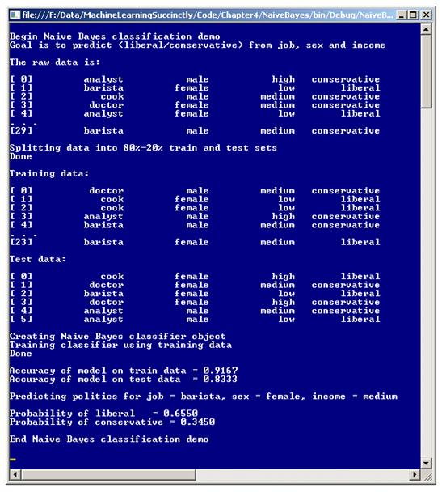
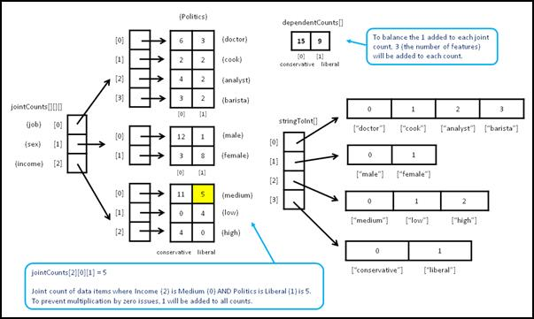
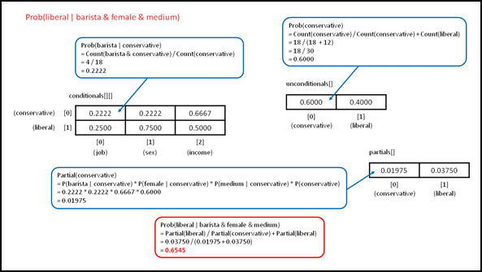

# 四、朴素贝叶斯分类

## 简介

大多数机器学习分类技术严格地处理数字数据。对于这些技术，任何非数值的预测值，如男性和女性，都必须转换为数值，如-1 和+1。朴素贝叶斯是一种例外的分类技术。它用分类数据进行分类和预测。

朴素贝叶斯中的“朴素”(在普通用法中意味着不复杂)意味着所有的预测特征都是独立的。例如，假设你想根据一个人的工作(如厨师、医生等)来预测他的政治倾向，保守还是自由。)、性别(男性或女性)和收入(低、中或高)。朴素贝叶斯假设工作、性别和收入都是独立的。很多情况下显然不是这样。在这个例子中，工作和收入几乎肯定是相关的。尽管有粗略的独立性假设，朴素贝叶斯分类在处理分类数据时通常非常有效。

“贝叶斯”指的是贝叶斯定理。贝叶斯定理是一个相当简单的方程，其特征是有一个“给定”条件来寻找值，例如“一个人是医生的概率，给定他们是政治保守派的概率。”贝叶斯定理背后的思想在概念上和哲学上都非常深刻，但幸运的是，在执行朴素贝叶斯分类时应用该定理在原理上相对简单(尽管实现细节有点棘手)。

理解朴素贝叶斯分类并了解本章走向的一个好方法是查看演示程序的截图，如图 4-a 所示。演示程序的目标是根据一个人的工作(分析师、咖啡师、厨师或医生)、性别(男性、女性)和年收入(低、中、高)来预测他或她的政治倾向(保守或自由)。请注意，每个特征都是分类的，而不是数字的。

演示程序从 30 个(人工构建的)数据项开始。前两项是:

分析师男高保守
咖啡师女低自由主义

独立的 X 预测变量，工作、性别和收入，在前三列，而预测的因变量 Y，政治，在最后一列。

该演示将 30 个项目的数据集分为 80% (24 个数据项目)的训练数据集和 20% (6 个数据项目)的测试数据集，其中数据项目被随机分配到两个数据集中的一个。训练数据集用于构建朴素贝叶斯预测模型，测试数据集用于在出现新的、以前未见过的数据时给出模型准确性的估计。

接下来，演示使用训练数据和朴素贝叶斯数学来构建预测模型。在幕后，每个专栏都被认为是独立的。

创建模型后，演示将计算模型在训练数据集和测试数据集上的准确性。该模型正确预测了 91.67%的训练项目(24 项中的 22 项)和 83.33%的测试项目(6 项中的 5 项)。



图 4-a:朴素贝叶斯分类演示程序

接下来，演示程序使用该模型来预测一个假设的人的政治倾向，这个人有一份咖啡师的工作，是一名女性，收入中等。根据该模型，假设的人有自由主义倾向的概率为 0.6550，保守主义者的概率为 0.3450；因此，这个不知名的人被预言是一个自由主义者。

接下来的部分将描述朴素贝叶斯分类是如何工作的，并详细介绍和解释演示程序的代码。虽然现有的系统和 API 集可以执行朴素贝叶斯分类，但是能够编写自己的预测系统可以让您完全控制许多可能的实现选项，避免不可预见的法律问题，并且可以让您很好地了解其他系统是如何工作的，以便您可以更有效地使用它们。

## 理解朴素贝叶斯

假设像演示程序中一样，你想预测一个工作是咖啡师、性别是女性、收入中等的人的政治倾向(保守还是自由)。你会计算这个人是保守派的概率，和这个人是自由派的概率，然后用更高的概率预测结果。

用数学方法表示，问题是要找到这两个值:

P(保守)= P(保守|咖啡师&女性&中等)

P(自由派)= P(自由派|咖啡师&女性&中等)

上面的等式有时被解读为“Y 是保守的概率，假设 X 是咖啡师，女性和中等。”同样，最下面的等式是，“Y 是自由派的概率，假设 X 是咖啡师，女性，中等。”

为了计算这些概率，需要有时被称为偏分的量。第一因变量的部分(表示为 PP)为:

PP(保守)=
P(咖啡师|保守)* P(女|保守)* P(中|保守)* P(保守)

同样，第二个因变量的偏差值为:

PP(自由派)=
P(咖啡师|自由派)* P(女|自由派)* P(中|自由派)* P(自由派)

如果这两个分支能够以某种方式计算出来，那么进行预测所需的两个概率是:

p(保守)= PP(保守)/ (PP(保守)+ PP(自由))

p(自由派)= PP(自由派)/ (PP(保守派)+ PP(自由派))

请注意，在每种情况下分母都是相同的。这个术语有时被称为*证据*。挑战在于找到这两个部分。在这个例子中，每个部分有四个项相乘。考虑 PP(保守派)中的第一个术语，它是 P(咖啡师|保守派)，读作“假定某人是保守派，咖啡师的概率。”贝叶斯定理给出:

p(咖啡师|保守)=计数(咖啡师&保守)/计数(保守)

这里，计数只是对适用数据项数量的简单计数。本质上，这个等式只看那些保守的人，发现他们中有多少百分比是咖啡师。数量计数(咖啡师&保守)称为联合计数。

接下来的两个术语为偏为保守，P(女|保守)和 PP(中|保守)，可以用同样的方法找到:

P(女性|保守)=计数(女性&保守)/计数(保守)
P(中|保守)=计数(中&保守)/计数(保守)

保守的偏导数的最后一个术语是 P(conservative)，换句话说就是“一个人是保守的概率。”这很容易发现:

p(保守)=计数(保守)/(计数(保守)+计数(自由))

换句话说，一个人保守的概率只是保守的人数除以总人数。

综上所述，如果问题是找到一个人是保守派的概率，也找到这个人是自由派的概率，如果这个人是一个中等收入的女咖啡师，你需要保守派的偏，自由派的偏。偏为保守的是:

PP(保守)=

P(咖啡师|保守)* P(女性|保守)* P(中|保守)* P(保守)=

伯爵(咖啡师&保守派)/伯爵(保守派)*
伯爵(女&保守派)/伯爵(保守派)*
伯爵(中&保守派)/伯爵(保守派)*
伯爵(保守派)/(伯爵(保守派)+伯爵(自由派))

而偏为自由派的是:

PP(自由派)=

P(咖啡师|自由派)* P(女|自由派)* P(中|自由派)* P(自由派)=

伯爵(咖啡师&自由派)/伯爵(自由派)*
伯爵(女&自由派)/伯爵(自由派)*
伯爵(中&自由派)/伯爵(自由派)*
伯爵(自由派)/(伯爵(保守派)+伯爵(自由派))

这两种可能性是:

p(保守)= PP(保守)/ (PP(保守)+ PP(自由))

p(自由派)= PP(自由派)/ (PP(保守派)+ PP(自由派))

拼图的每一块都只是简单的计数，但是有很多块。如果您仔细查看计算，您会注意到，要计算任何可能的概率，例如 P(自由派|库克&男性&低)或 P(保守派|分析师&女性&高)，您需要每个特征值与每个从属值的联合计数，如“医生&保守”、“男性&自由派”、“低&保守”等。您还需要每个相关值的计数。

为了预测中等收入女性咖啡师的政治倾向，演示程序计算 P(保守|咖啡师&女性&中等)和 P(自由|咖啡师&女性&中等)如下。

首先，程序扫描 24 项训练数据，找到所有相关的关节计数，并为每个计数加 1。结果是:

计数(咖啡师&保守派)= 3 + 1 = 4
计数(女&保守派)= 3 + 1 = 4
计数(中&保守派)= 11 + 1 = 12
计数(咖啡师&自由派)= 2 + 1 = 3
计数(女&自由派)= 8 + 1 = 9
计数(中&自由派)= 5 + 1 = 6

如果你回头看看分音是如何计算的，你会发现它们是由几个联合计数项相乘组成的。如果任何联合计数为 0，整个乘积将为 0，计算将失败。将每个关节计数加 1 可以防止这种情况，称为拉普拉斯平滑。

接下来，程序扫描 24 项训练数据，计算因变量的计数，并为每项增加 3(特征数):

计数(保守)= 15 + 3 = 18
计数(自由)= 9 + 3 = 12

将特征的数量(在本例中为 3 个)添加到每个因变量计数中，可平衡添加到三个关节计数中的 1 个。现在分音是这样计算的:

PP(保守)=

伯爵(咖啡师&保守派)/伯爵(保守派)*
伯爵(女&保守派)/伯爵(保守派)*
伯爵(中&保守派)/伯爵(保守派)*
伯爵(保守派)/(伯爵(保守派)+伯爵(自由派))=

= (4 / 18) * (4 / 18) * (12 / 18) * (18 / 30)

= 0.2222 * 0.2222 * 0.6667 * 0.6000

= 0.01975(四舍五入)。

PP(自由派)=

伯爵(咖啡师&自由派)/伯爵(自由派)*
伯爵(女&自由派)/伯爵(自由派)*
伯爵(中&自由派)/伯爵(自由派)*
伯爵(自由派)/(伯爵(保守派)+伯爵(自由派))=

= (3 / 12) * (9 / 12) * (6 / 12) * (12 / 30)

= 0.2500 * 0.7500 * 0.5000 * 0.4000

= 0.03750.

使用偏分，计算最终概率:

p(保守)= PP(保守)/ (PP(保守)+ PP(自由))
= 0.01975/(0.01975+0.03750)
= 0.3450(四舍五入)

p(自由派)= PP(自由派)/ (PP(保守派)+ PP(自由派))
= 0.03750/(0.01975+0.03750)
= 0.6550(四舍五入)

如果参考**图 4-a** 中的截图，会看到这两个概率值显示出来。因为自由派的概率大于保守派的概率，所以预测是中等收入的女性咖啡师最有可能是政治自由派。

## 演示程序结构

演示程序的整体结构在**清单 4-a** 中给出，为了节省空间做了一些小的修改。为了创建演示程序，我启动了 Visual Studio，并创建了一个新的 C#控制台应用程序项目，名为天真贝叶斯。

模板代码加载到编辑器后，我删除了源代码顶部的所有`using`语句，除了对顶层 System 命名空间的引用，以及对 Collections 的引用。通用命名空间。在解决方案资源管理器窗口中，我将文件 Program.cs 重命名为更具描述性的 BayesProgram.cs，Visual Studio 自动将类 Program 重命名为 BayesProgram。

```cs
    using System;
    using System.Collections.Generic;
    namespace NaiveBayes
    {
      class BayesProgram
      {
        static void Main(string[] args)
        {
          Console.WriteLine("Begin Naive Bayes classification demo");
          Console.WriteLine("Goal is to predict (liberal/conservative) from job, " +
           "sex and income");

          string[][] rawData = new string[30][];
          rawData[0] = new string[] { "analyst", "male", "high", "conservative" };
          // etc.
          rawData[29] = new string[] { "barista", "male", "medium", "conservative" };

          Console.WriteLine("The raw data is: ");
         ShowData(rawData, 5, true);

          Console.WriteLine("Splitting data into 80%-20% train and test sets");
          string[][] trainData;
          string[][] testData;
         MakeTrainTest(rawData, 15, out trainData, out testData); // seed = 15
          Console.WriteLine("Done");

          Console.WriteLine("Training data: ");
         ShowData(trainData, 5, true);

          Console.WriteLine("Test data: ");
         ShowData(testData, 5, true);

          Console.WriteLine("Creating Naive Bayes classifier object");
          BayesClassifier bc = new BayesClassifier();
         bc.Train(trainData);
          Console.WriteLine("Done");

          double trainAccuracy = bc.Accuracy(trainData);
          Console.WriteLine("Accuracy of model on train data = " +
            trainAccuracy.ToString("F4"));
          double testAccuracy = bc.Accuracy(testData);
          Console.WriteLine("Accuracy of model on test data = " +
            testAccuracy.ToString("F4"));

          Console.WriteLine("Predicting politics for job = barista, sex = female, " +
           "income = medium ");
          string[] features = new string[] { "barista", "female", "medium" };

          string liberal = "liberal";
          double pLiberal = bc.Probability(liberal, features);
          Console.WriteLine("Probability of liberal   = " +
            pLiberal.ToString("F4"));

          string conservative = "conservative";
          double pConservative = bc.Probability(conservative, features);
          Console.WriteLine("Probability of conservative = " +
            pConservative.ToString("F4"));

          Console.WriteLine("End Naive Bayes classification demo ");
          Console.ReadLine();
        } // Main

        static void MakeTrainTest(string[][] allData, int seed,
          out string[][] trainData, out string[][] testData) { . . }

        static void ShowData(string[][] rawData, int numRows, bool indices) { . . }
      } // Program

      public class BayesClassifier { . . }
    } // ns

```

清单 4-a:朴素贝叶斯演示程序结构

演示程序类有两个静态助手方法。方法 MakeTrainTest 将源数据随机分成 80%的训练集和 20%的测试数据。80-20 分割是硬编码的，您可能想要参数化训练数据的百分比。Helper 方法 ShowData 向 shell 显示一个数组样式的字符串值矩阵。

所有的贝叶斯分类逻辑都包含在一个名为贝叶斯分类器的程序定义类中。所有的程序逻辑都包含在 Main 方法中。主方法首先在数组样式矩阵中设置 30 个硬编码(工作、性别、收入、政治)数据项:

静态 void Main(字符串[]参数)

{

控制台。WriteLine(" \ n 开始朴素贝叶斯分类演示")；

控制台。目标是从工作中预测(自由派/保守派)，+

“性别和收入\ n”)；

string[][]raw data = new string[30][]；

rawData[0] = new string[] {“分析师”、“男性”、“高”、“保守”}；

rawData[1] = new string[] {“咖啡师”、“女”、“低”、“自由派”}；

//等等。

rawData[29] = new string[] {“咖啡师”、“男性”、“中等”、“保守”}；

。。。

在大多数实际场景中，您的源数据将存储在一个文本文件中，您将使用一个名为 LoadData 的辅助方法将其加载到内存中的矩阵中。这里，因变量 politics 被假定在数据矩阵的最后一列。

接下来，演示将显示部分源数据，然后创建训练和测试集:

控制台。WriteLine(“原始数据为:\ n”)；

显示数据(原始数据，5，真)；

控制台。WriteLine(“将数据拆分为 80%-20%的训练集和测试集”)；

字符串[]培训数据；

string[][] testData;

make trainetest(raw data，15，out trainData，out testData)；

控制台。写线(“完成\ n”)；

传递给方法 ShowData 的 5 参数是要显示的行数，不包括默认情况下始终显示的最后一行数据。传递给方法 MakeTrainTest 的 15 个参数用作随机对象的种子值，随机对象随机地将数据项分配给训练集或测试集。

接下来，演示显示了训练集和测试集的前五行，也是最后一行:

控制台。WriteLine("训练数据:\ n ")；

ShowData(trainData，5，true)；

控制台。WriteLine("测试数据:\ n ")；

显示数据(测试数据，5，真)；

传递给 ShowData 的 true 参数指示方法显示行索引。为了查看整个训练数据集，以便您可以看到上一节中如何计算贝叶斯关节计数，您可以传递 23 作为行数。

接下来，创建并训练分类器:

控制台。WriteLine(“创建朴素贝叶斯分类器对象”)；

控制台。WriteLine(“使用训练数据训练分类器”)；

baysclassiter BC = new baysclassiter()；

bc .火车(traindata)；

控制台。写线(“完成\ n”)；

大部分工作是通过 Train 方法完成的。在朴素贝叶斯的情况下，训练方法扫描训练数据，并计算特征值(如“医生”和“高”)和相关值(“保守”或“自由”)之间的所有联合计数。Train 方法还计算每个因变量值的计数。

模型完成训练过程后，模型在训练集和测试集上的精度会这样计算和显示:

双倍训练精度= bc。准确性(训练数据)；

控制台。写线(“列车数据上模型的准确性=+列车准确性。ToString(" F4 ")；

double testAccuracy = bc。准确性(测试数据)；

控制台。WriteLine(“模型对测试数据的准确性=+测试准确性。ToString(" F4 ")；

接下来，演示通过计算中等收入的女咖啡师是自由主义者的概率间接做出了预测:

控制台。write line(" \ n 预测工作的政治=咖啡师，性=女性，"

+“收入=中等\ n”)；

string[]功能= new string[] {“咖啡师”、“女”、“中”}；

string liberal = " liberal

double pLiberal = bc。概率(自由主义，特征)；

控制台。WriteLine(“自由主义的概率=+自由主义。ToString(" F4 ")；

请注意，因为这是一个二元分类问题，所以只需要一个概率就可以做出分类决策。如果自由派或保守派的概率都大于 0.5，那么因为自由派和保守派的概率之和为 1.0，另一种政治倾向的概率必然小于 0.5，反之亦然。

演示最后计算了中等收入女性咖啡师保守的概率:

。。。

string conservative = " conservative "；

double pConservative = bc。概率(保守，特征)；

控制台。WriteLine(“保守的概率=+pcconservative。ToString(" F4 ")；

控制台。WriteLine(" \ nAnD 朴素贝叶斯分类演示\ n ")；

控制台。ReadLine()；

} // Main

需要考虑的一个选项是编写一个 class 方法 Predicted，它以更高的概率返回因变量。

## 定义贝叶斯分类等级

程序定义类 BayesClassifier 的结构在**清单 4-b** 中给出。该类有三个数据成员，并公开了四个公共方法。理解实现的关键是理解这三种数据结构，以便在必要时修改它来满足您自己的需求。类数据结构如图 4-b**所示。**

```cs
    public class BayesClassifier
    {
      private Dictionary<string, int>[] stringToInt;
      private int[][][] jointCounts;
      private int[] dependentCounts;

      public BayesClassifier() { . . }
      public void Train(string[][] trainData) { . . }
      public double Probability(string yValue, string[] xValues) { . . }
      public double Accuracy(string[][] data) { . . }
    }

```

清单 4-b:贝叶斯分类器类结构

数据成员`stringToInt`是字典对象的数组。每列数据有一个 Dictionary 对象，每个 Dictionary 将一个字符串值(如“咖啡师”或“保守”)映射到一个从零开始的整数。例如，`stringToInt[0]["doctor"]`返回特征 0(作业)的整数值，值“医生”。从零开始的整数用作其他数据结构的索引。



图 4-b:朴素贝叶斯关键数据结构

字符串特征值的整数索引值是训练方法扫描训练数据时遇到特征值的顺序。例如，对于演示程序，由方法 MakeTrainTest 生成的训练数据的前五行是:

【0】医生男中等保守
【1】厨师女低自由主义
【2】厨师女低自由主义
【3】分析师男高保守
【4】咖啡师男中等保守

方法`Train`扫描训练数据第一列时，会分配“医生”= 0、“厨师”= 1、“分析师”= 2、“咖啡师”= 3。同样，扫描后，“男”= 0、“女”= 1、“中”= 0、“低”= 1、“高”= 2、“保守”= 0、“自由”= 1 的值将存储到`stringToInt`字典对象中。请注意，如果方法 MakeTrainTest 使用不同的种子值并生成不同的训练数据集，这些分配可能会改变。

类数据成员`jointCounts`保存每个可能的特征值和相关值对的联合计数。对于演示示例，共有九个特征值:分析师、咖啡师、厨师、医生、男性、女性、低、中、高。有两种从属的价值观:保守主义和自由主义。因此共有 9 * 2 = 18 个联合计数为例:(分析师&保守)，(分析师&自由)，(咖啡师&保守)。。。，(高&自由派)。

表达式`jointCounts[2][0][1]`保存训练项目的计数，其中特征 2(收入)等于值 0(中等)，从属 1(自由)。回想一下，每个关节计数加 1 是为了避免乘以零(拉普拉斯平滑)。

类成员`dependentCounts`保存每个因变量的个数。例如，表达式`dependentCounts[0]`保存依赖值为 0(保守)的训练项目数。回想一下，数组`dependentCounts`中的每个单元都添加了 3 个(问题的特征数)，以平衡添加到每个关节计数中的 1。

类构造函数简单而简短:

公共 BayesClassifier()

{

this.stringToInt = 空;

this.jointCounts = null

this.dependentCounts = null

}

在许多 OOP 实现场景中，类构造函数为关键成员数组和矩阵分配内存。然而，对于朴素贝叶斯来说，在三种数据结构中的每一种中要分配的单元数量在训练数据出现之前是未知的，因此方法 Train 将执行分配。

要考虑的一个设计替代方案是将训练数据传递给构造器。与让训练方法执行分配相比，这个设计有一些非常微妙的问题，有利也有弊。第二种设计方案是传递构造函数整数参数，这些参数保存特征的数量、每个特征中不同值的数量以及不同因变量的数量。

## 训练方法

许多机器分类算法通过创建某种数学函数来工作，该函数接受数值的特征值并返回代表预测类别的数值。基于数学方程的算法的例子包括逻辑回归分类、神经网络分类、感知器分类、支持向量机分类等。在这些算法中，训练过程通常包括找到一组数值常数的值，通常称为权重，用于预测方程。

朴素贝叶斯分类训练不搜索一组权重。相反，训练只是扫描训练数据并计算关节特征相关计数和因变量计数。给定一组特征值，朴素贝叶斯方程使用这些计数来计算相关类的概率。从这个意义上说，朴素贝叶斯训练相对简单。

方法训练的定义始于:

公共空列车(字符串[][]列车数据)

{

int numRows = trainData.Length：

int numCols = trainData[0]。长度；

this.stringToInt =新词典<string int="">【numCols】；</string>

。。。

方法训练直接使用数组样式的字符串值矩阵。另一种方法是对训练数据进行预处理，将每个分类值(如“医生”)转换为其对应的整数值(0)，并将该数据存储在整数矩阵中。

字典对象的数组被分配了列数，因此在演示中包括因变量，政治倾向。一个重要的假设是因变量位于训练矩阵的最后一列。

接下来，实例化并填充每个特性的字典:

for(int col = 0；col < numCols+++列)

{

stringpoint[col]=新词典<string int="">()；</string>

你 idx = 0;

for(int row = 0；row < numRows+++行)

{

字符串 s = train data[row][col]；

if(string point[col]。contains KeY = = false)//第一次看到

{

字符串点[列]。Add(s，idx)；// ex:医生-> 0

++ idx；//准备下一个字符串

}

} //每行

} //每个列

训练矩阵是逐列处理的。当在一列中发现每个新的特征值时，变量`idx`中的索引被保存。那个。NET 通用字典集合相当复杂。存储每个值的索引的目的是为了快速查找索引。另一种方法是将每个不同的列值存储在字符串数组中。那么单元格索引就是值的索引。但是这种方法需要在字符串数组中进行线性搜索。

接下来，`jointCounts`数据结构是这样分配的:

this . joint counts = new int[numCols-1][][][]；//数字特征

for(int c = 0；c < numCols-1；++c) //不是 y 列

{

int count = this . string point[c]。计数；

joint counts[c]= new int[count][]；

}

for(int I = 0；i < jointCounts。长度；++i)

for(int j = 0；j < jointCounts[i]。长度；++j)

joint counts[I][j]= new int[2]；//二元分类

至少对我来说，在处理`jointCounts`这样的数据结构时，绝对有必要绘制一个图，类似于**图 4-b** 中的图，避免出错。从左到右工作，`jointCounts`的第一维度分配有特征数量(演示中为三个)。然后，这些引用中的每一个都被分配了该特征的不同值的数量。例如，功能 0“作业”有四个不同的值。不同值的数量存储为要素的字符串到整数字典集合的计数属性。

`jointCounts`的最后一个维度分配了硬编码尺寸 2。这使得该类严格来说是一个二进制分类器。要将实现扩展到多类分类器，您只需将 2 替换为不同的因变量数值:

int num dependent = stringt[stringt]。长度- 1]。计数；

连接代码[I][j]= new int[number dependent]；

接下来，`jointCounts`中的每个单元格都初始化为 1，以避免任何单元格为 0，这将导致麻烦:

for(int I = 0；i < jointCounts。长度；++i)

for(int j = 0；j < jointCounts[i]。长度；++j)

for(int k = 0；k < jointCounts[i][j]。长度；++k)

joint counts[I][j][k]= 1；

使用具有三个索引维度的数据结构并不容易，而且可能需要一些时间来弄清楚。接下来，方法 Train 遍历每个训练数据项，并递增`jointCounts`数据结构中的适当单元格:

for(int I = 0；i < numRows++i)

{

string ys string = train data[I][NumColls-1]；//相关值

int DEPindex = string point[NumColls-1][ys string]；//对应索引

for(int j = 0；j < numCols-1；++j)

{

int Attindex = j；//又名特征、索引

string XString = train data[I][j]；//像“男”一样

int valIndex = string point[j][xString]；//对应索引

++ joint counts[attIndex][valIndex][de index]；

}

}

接下来，方法 Train 分配存储具有每个可能的相关值的数据项数量的数据结构，并将每个单元中的计数初始化为使用拉普拉斯平滑的特征数量:

this . dependent counts = new int[2]；//二进制

for(int I = 0；i < dependentCounts。长度；++(I)//拉普拉斯

dependent counts[I]= NumColls-1；//数字特征

硬编码的 2 使它成为严格的二进制分类器，所以您可能想要修改代码来处理多类问题。如前所述，您可以使用该列的 Dictionary 对象的 Count 属性来确定不同的因变量值的数量。这里，特征数是训练数据矩阵的列数，减去 1，以说明最后一列中的因变量。

方法训练通过遍历训练数据矩阵得出结论，并在演示中计算和存储每个因变量数值(保守和自由)的数量:

。。。

for(int I = 0；I

{

string ys string = train data[I][NumColls-1]；//“保守派”或“自由派”

int yIndex = stringToInt[numCols - 1][yString];0 金币 1

++ dependent counts[yIndex]；

}

返回；

}

在这里，我使用一个显式的`return`关键字，没有别的原因，只是为了说明这是可能的。在生产环境中，遵循一套标准的样式准则是相当重要的，这些准则大概解决了像使用带有 void 方法的显式返回这样的问题。

## 方法概率

给定一组特征值，类方法概率返回指定相关类值的贝叶斯概率。本质上，方法概率是预测方法。例如，对于演示数据，要计算一个人有自由主义政治倾向的概率，假设他们有一份医生的工作，男性的性别和高收入，你可以称之为:

string[]featureVals = new string[]{“医生”、“男性”、“高”}；

double pLib = bc。概率(“自由派”，feature vals)；//问题人物是自由主义者

对于二元分类，如果这个概率大于 0.5，你会得出这个人有自由政治倾向的结论。如果概率小于 0.5，你会得出这个人是保守的结论。



图 4-c:计算贝叶斯概率

概率方法使用一个矩阵`conditionals`和两个数组`unconditionals`和`partials`，来存储计算每个因变量值的偏分所需的值，然后使用这两个偏分来计算请求的概率。这些数据结构如图 4-c 所示。

该方法的定义开始于:

公共双概率(字符串 yValue，字符串[] xValues)

{

int numFeatures = xValues。长度；

double[][]条件句= new double[2][]；//二进制

for(int I = 0；I < 2；++i)

条件[i] =新的双精度[NumFeatureS]；

。。。

如果你参考解释朴素贝叶斯如何工作的部分，你会记得要计算一个概率，你需要两个所谓的偏方，一个对应一个因变量的值。偏概率是条件概率和一个无条件概率的乘积。例如，要计算给定咖啡师和女性、中等的自由主义概率，一个偏方是 P(咖啡师|自由主义)、P(女性|自由主义)、P(中等|自由主义)和 P(自由主义)的乘积。

在演示中，对于一个部分，您需要三个条件概率，一个用于指定特征值和相关值的每个组合。但是要计算二元分类问题的任何概率，你需要两个偏旁对应两个可能的因变量值。因此，如果有两个因变量和三个特征，则需要 2 * 3 = 6 个条件概率来计算两个偏方。

条件概率存储在局部矩阵`conditionals`中。行索引是因变量的索引，列索引是特征值的索引。例如，`conditionals[0][2]`对应因变量 0(保守)和特征 2(收入)。换句话说，对于演示来说，`conditionals`的第一行包含保守的三个条件概率，第二行包含自由的三个条件概率。

接下来，分配保存每个因变量值的无条件概率的数组`unconditionals`，将独立的 x 值和依赖的 y 值从字符串转换为整数:

double[]无条件=新 double[2]；

int y = this . stringt[num features][yvalue]；

int[] x =新的 int[number features]；

for(int I = 0；i < numFeatures++i)

{

字符串 s = XVaLues[I]；

x[I]= this . string point[I][s]；

}

因为一个代表特征数量的变量在代码中经常被使用，所以一个替代的设计是创建一个名为`numFeatures`的类成员，而不是将其重新创建为每个方法的局部变量。

接下来，使用通过 Train 方法计算的计数信息来计算和存储条件概率:

for(int k = 0；k < 2；++(k)//每个 y 值

{

for(int I = 0；i < numFeatures++i)

{

int attindex = I；

int valIndex = x[i];

int depIndex = k;

条件[k][I]=(joint counts[attIndex][valIndex][desindex]* 1.0/

dependent counts[Dependex]；

}

}

虽然这里的代码很短，但它是我在实现机器学习算法时使用过的最复杂的代码。至少对我来说，画出像图 **4-b** 和 **4-c** 中那样的图是绝对必要的，以便首先编写代码，然后纠正错误。

接下来，概率方法计算每个相关值的概率并存储这些值:

int TotalDependent = 0；// ex: count(保守)+ count(自由)

for(int k = 0；k < 2；++k)

total dependent+= this . dependent counts[k]；

for(int k = 0；k < 2；++k)

无条件[k]=(dependent counts[k]* 1.0)/total dependent；

请注意，我使用`this`关键字限定了对成员数组`dependentCounts`的第一个引用，但没有在第二个引用中使用`this`。从风格的角度来看，我有时使用这种技术只是为了提醒自己数组、变量或对象是类成员。

接下来，计算并存储分音:

double[]partials = new double[2]；

for(int k = 0；k < 2；++k)

{

partials[k]= 1.0；//因为我们在繁殖

for(int I = 0；i < numFeatures++i)

分句[k] *=条件句[k][I]；

分音[k] *=无条件[k]；

}

接下来，计算并存储两个(用于二进制分类)分音的和，并计算并返回请求的概率:

。。。

双证据= 0.0；

for(int k = 0；k < 2；++k)

证据+=分音[k]；

返回部分证据；

}

回想一下，在朴素贝叶斯术语中，偏差值的和有时被称为证据术语。让我重申一下，方法概率的代码非常棘手。理解这段代码和许多其他机器学习算法的关键是对所使用的数据结构、数组和矩阵有一个清晰的了解。

## 方法准确度

方法准确度计算训练模型对一组训练数据或测试数据的因变量的预测程度，这些数据具有已知的因变量值。模型对训练数据的准确性让你大致了解模型是否有效。在因变量值未知的情况下，模型对测试数据的准确性为您提供了一个粗略的估计，即当呈现新数据时，模型的预测效果如何。

方法准确性的定义始于:

公共双精度(字符串[][]数据)

{

int 有效数字= 0：

int num wrong = 0；

int numRows =数据。长度；

int numCols =数据[0]。长度；

。。。

接下来，该方法遍历每个数据项并提取 x 值——例如“咖啡师”、“女性”和“中等”——并提取已知的 y 值——例如“保守”。x 值和 y 值被馈送到概率方法。如果计算的概率大于 0.5，则模型进行了正确的分类:

`. . .`

for(int I = 0；i < numRows++(I)//行

{

string yValue = data[I][NumColls-1]；//假设最后一列是 y

string[] xValues =新字符串[NumColls-1]；

数组。副本(数据[i]，xValues，numCols-1)；

双 p =这个。概率(yValue，xValues)；

如果(p > 0.50)

+++NumCorrect；

其他

+++NumWrong；

}

return(number correct * 1.0)/(number correct+number wrong)；

}

一种常见的替代设计是使用不同的阈值，而不是这里使用的 0.5。例如，假设对于某些数据项，方法概率返回 0.5001。从某种意义上说，这种分类几乎不正确。因此，您可能希望将大于 0.60 的概率视为正确，小于 0.40 的概率视为错误，0.40 到 0.60 之间的概率视为不确定。

## 将数字数据转换为分类数据

朴素贝叶斯分类使用分类数据，如年收入的低、中、高，而不是数值，如$36，000.00。如果数据集包含一些数值数据，并且您想要应用朴素贝叶斯分类，一种方法是将数值转换为分类值。这个过程被称为数据离散化，或者更通俗地说，宁滨数据。

有三种主要方法来绑定数据。最简单的称为等宽，就是创建相同大小的间隔或“桶”。第二种方法以相同的频率使用，即创建存储桶，使每个存储桶中的数据值(大约)相等。第三种方法是使用聚类算法(如 *k* )来创建桶，这样数据值就可以根据彼此的相似性进行分组。

这三种技术各有利弊，因此没有一种明确的最佳方法来绑定数据。也就是说，等宽宁滨通常是默认技术。

有许多不同的方法来实现等宽宁滨。假设您想使用等宽宁滨将以下 10 个数值转换为“小”、“中”、“大”或“超大”(四个桶):

2.0, 3.0, 4.0, 5.0, 6.0, 8.0, 9.0, 10.0, 12.0, 14.0

在这里，数据被排序，但是等宽宁滨不需要这样。首先，确定最小值和最大值:

最小值= 2.0
最大值= 14.0

接下来，计算每个铲斗的宽度:

宽度=(最大-最小)/铲斗数量
= (14.0 - 2.0) / 4
= 3.0

接下来，构建定义每个桶的初步区间集:

[2.0，5.0][5.0，8.0][8.0，11.0][11.0，14.0) ->区间数据
【0】【1】【2】【3】【4】【5】【6】【7】->小区索引
{0} {1} {2} {3} - >时段

这里，符号[2.0，5.0]表示大于或等于 2.0，也小于 5.0。接下来，修改两个区间端点，以捕捉可能在以后出现的任何异常值:

[-inf，5.0) [5.0，8.0][8.0，11.0][11.0，+inf) ->区间数据
【0】【1】【2】【3】【4】【5】【6】【7】->小区索引
{0} {1} {2} {3} - >时段

这里，-inf 和+inf 代表负无穷大和正无穷大。现在，区间数据可以用来确定一个数值的分类等价物。值 8.0 属于桶 2，所以 8.0 映射为“大”。如果一些新数据稍后到达，它也可以入库。例如，如果某个新值 *x* = 12.5 出现，则它属于桶 3，并将映射到“超大”。

等宽宁滨的一种可能实现可以采用两种方法的形式:第一种是创建间隔数据，第二种是为数据项分配桶或类别。例如，创建间隔数据的方法可以从以下开始:

静态 double[] MakeIntervals(double[]数据，int numBins) // bin 数字数据

{

double max =数据[0]；//查找最小值和最大值

double min =数据[0]；

for(int I = 0；I

{

if(data[I]< min)min = data[I]；

if(data[I]> max)max = data[I]；

}

双倍宽度=(最大-最小)/numBins；

。。。

静态方法 MakeIntervals 接受要绑定的数据数组和要创建的桶数，并返回数组中的间隔数据。确定最小值和最大值，并如前所述计算铲斗宽度。

接下来，创建初步间隔:

double[]间隔=新的 double[numBins * 2]；

间隔[0] =分钟；

间隔[1] =最小+宽度；

for(int I = 2；I

{

区间[i] =区间[I-1]；

区间[i + 1] =区间[i] +宽度；

}

请注意，当使用这里描述的方案时，除了第一个和最后一个之外，所有间隔边界值都是重复的。每个边界值只存储一次是可能的。复制边界值可能效率稍低，但会导致代码更容易理解和修改。

现在，修改第一个和最后一个边界值，以便最终的间隔数据能够处理任何可能的输入值:

。。。

间隔[0] =双倍。MinValue//异常值

间隔。长度- 1] =双倍。MaxValue

返回间隔；

}

使用这种宁滨设计，可以定义合作伙伴执行宁滨的方法:

静态 int Bin(双 x，双[]间隔)

{

for(int I = 0；I

{

if (x >=间隔[i] && x

返回 I/2；

}

返回-1；//错误

}

静态方法 Bin 进行简单的线性搜索，直到找到正确的间隔。一个设计方案是做一个二分搜索法。调用宁滨方法可能类似于:

double[]数据=新 double[] { 2.0，3.0，。。, 14.0 };

double[]intervals = make intervals(数据，4)；// 4 个 Bin
int Bin = Bin(x，9.5)；//值为 9.5 的桶

## 评论

当遇到机器学习分类问题时，通常首先使用朴素贝叶斯分类来建立基线结果。这个想法是预测变量独立性的假设几乎肯定不是真的，所以其他更复杂的分类技术应该创建至少与朴素贝叶斯模型一样好的模型。

朴素贝叶斯分类器经常使用的一个重要领域是文本和文档分类。例如，假设您想要将来自客户的电子邮件分为低、中或高优先级。预测变量将是消息中每个可能的单词。朴素贝叶斯分类对这类问题的有效性令人惊讶。

## 第 4 章完整演示程序源代码

```cs
    using System;
    using System.Collections.Generic;
    namespace NaiveBayes
    {
      class BayesProgram
      {
        static void Main(string[] args)
        {
          Console.WriteLine("\nBegin Naive Bayes classification demo");
          Console.WriteLine("Goal is to predict (liberal/conservative) from job, " +
            "sex and income\n");

          string[][] rawData = new string[30][];
          rawData[0] = new string[] { "analyst", "male", "high", "conservative" };
          rawData[1] = new string[] { "barista", "female", "low", "liberal" };
          rawData[2] = new string[] { "cook", "male", "medium", "conservative" };
          rawData[3] = new string[] { "doctor", "female", "medium", "conservative" };
          rawData[4] = new string[] { "analyst", "female", "low", "liberal" };
          rawData[5] = new string[] { "doctor", "male", "medium", "conservative" };
          rawData[6] = new string[] { "analyst", "male", "medium", "conservative" };
          rawData[7] = new string[] { "cook", "female", "low", "liberal" };
          rawData[8] = new string[] { "doctor", "female", "medium", "liberal" };
          rawData[9] = new string[] { "cook", "female", "low", "liberal" };
          rawData[10] = new string[] { "doctor", "male", "medium", "conservative" };
          rawData[11] = new string[] { "cook", "female", "high", "liberal" };
          rawData[12] = new string[] { "barista", "female", "medium", "liberal" };
          rawData[13] = new string[] { "analyst", "male", "low", "liberal" };
          rawData[14] = new string[] { "doctor", "female", "high", "conservative" };

          rawData[15] = new string[] { "barista", "female", "medium", "conservative" };
          rawData[16] = new string[] { "doctor", "male", "medium", "conservative" };
          rawData[17] = new string[] { "barista", "male", "high", "conservative" };
          rawData[18] = new string[] { "doctor", "female", "medium", "liberal" };
          rawData[19] = new string[] { "analyst", "male", "low", "liberal" };
          rawData[20] = new string[] { "doctor", "male", "medium", "conservative" };
          rawData[21] = new string[] { "cook", "male", "medium", "conservative" };
          rawData[22] = new string[] { "doctor", "female", "high", "conservative" };
          rawData[23] = new string[] { "analyst", "male", "high", "conservative" };
          rawData[24] = new string[] { "barista", "female", "medium", "liberal" };
          rawData[25] = new string[] { "doctor", "male", "medium", "conservative" };
          rawData[26] = new string[] { "analyst", "female", "medium", "conservative" };
          rawData[27] = new string[] { "analyst", "male", "medium", "conservative" };
          rawData[28] = new string[] { "doctor", "female", "medium", "liberal" };
          rawData[29] = new string[] { "barista", "male", "medium", "conservative" };

          Console.WriteLine("The raw data is: \n");
         ShowData(rawData, 5, true);

          Console.WriteLine("Splitting data into 80%-20% train and test sets");
          string[][] trainData;
          string[][] testData;
         MakeTrainTest(rawData, 15, out trainData, out testData); // seed = 15 is nice
          Console.WriteLine("Done \n");

          Console.WriteLine("Training data: \n");
         ShowData(trainData, 5, true);

          Console.WriteLine("Test data: \n");
         ShowData(testData, 5, true);

          Console.WriteLine("Creating Naive Bayes classifier object");
          Console.WriteLine("Training classifier using training data");
          BayesClassifier bc = new BayesClassifier();
         bc.Train(trainData); // compute key count data structures
          Console.WriteLine("Done \n");

          double trainAccuracy = bc.Accuracy(trainData);
          Console.WriteLine("Accuracy of model on train data = " +
            trainAccuracy.ToString("F4"));
          double testAccuracy = bc.Accuracy(testData);
          Console.WriteLine("Accuracy of model on test data = " +
            testAccuracy.ToString("F4"));

          Console.WriteLine("\nPredicting politics for job = barista, sex = female, "
            + "income = medium \n");
          string[] features = new string[] { "barista", "female", "medium" };

          string liberal = "liberal";
          double pLiberal = bc.Probability(liberal, features);
          Console.WriteLine("Probability of liberal   = " +
            pLiberal.ToString("F4"));

          string conservative = "conservative";
          double pConservative = bc.Probability(conservative, features);
          Console.WriteLine("Probability of conservative = " +
            pConservative.ToString("F4"));

          Console.WriteLine("\nEnd Naive Bayes classification demo\n");
          Console.ReadLine();
        } // Main

        static void MakeTrainTest(string[][] allData, int seed,
          out string[][] trainData, out string[][] testData)
        {
          Random rnd = new Random(seed);
          int totRows = allData.Length;
          int numTrainRows = (int)(totRows * 0.80);
          int numTestRows = totRows - numTrainRows;
          trainData = new string[numTrainRows][];
          testData = new string[numTestRows][];

          string[][] copy = new string[allData.Length][]; // ref copy of all data
          for (int i = 0; i < copy.Length; ++i)
            copy[i] = allData[i];

          for (int i = 0; i < copy.Length; ++i) // scramble order
          {
            int r = rnd.Next(i, copy.Length);
            string[] tmp = copy[r];
            copy[r] = copy[i];
            copy[i] = tmp;
          }
          for (int i = 0; i < numTrainRows; ++i)
            trainData[i] = copy[i];

          for (int i = 0; i < numTestRows; ++i)
            testData[i] = copy[i + numTrainRows];
        } // MakeTrainTest

        static void ShowData(string[][] rawData, int numRows, bool indices)
        {
          for (int i = 0; i < numRows; ++i)
          {
            if (indices == true)
              Console.Write("[" + i.ToString().PadLeft(2) + "] ");
            for (int j = 0; j < rawData[i].Length; ++j)
            {
              string s = rawData[i][j];
              Console.Write(s.PadLeft(14) + " ");
            }
            Console.WriteLine("");
          }
          if (numRows != rawData.Length-1)
            Console.WriteLine(". . .");
          int lastRow = rawData.Length - 1;
          if (indices == true)
            Console.Write("[" + lastRow.ToString().PadLeft(2) + "] ");
          for (int j = 0; j < rawData[lastRow].Length; ++j)
          {
            string s = rawData[lastRow][j];
            Console.Write(s.PadLeft(14) + " ");
          }
          Console.WriteLine("\n");
        }

        static double[] MakeIntervals(double[] data, int numBins) // bin numeric data
        {
          double max = data[0]; // find min & max
          double min = data[0];
          for (int i = 0; i < data.Length; ++i)
          {
            if (data[i] < min) min = data[i];
            if (data[i] > max) max = data[i];
          }
          double width = (max - min) / numBins; // compute width

          double[] intervals = new double[numBins * 2]; // intervals
          intervals[0] = min;
          intervals[1] = min + width;
          for (int i = 2; i < intervals.Length - 1; i += 2)
          {
            intervals[i] = intervals[i - 1];
            intervals[i + 1] = intervals[i] + width;
          }
          intervals[0] = double.MinValue; // outliers
         intervals[intervals.Length - 1] = double.MaxValue;

          return intervals;
        }

        static int Bin(double x, double[] intervals)
        {
          for (int i = 0; i < intervals.Length - 1; i += 2)
          {
            if (x >= intervals[i] && x < intervals[i + 1])
              return i / 2;
          }
          return -1; // error
        }

      } // Program

      public class BayesClassifier
      {
        private Dictionary<string, int>[] stringToInt; // "male" -> 0, etc.
        private int[][][] jointCounts; // [feature][value][dependent]
        private int[] dependentCounts;

        public BayesClassifier()
        {
          this.stringToInt = null; // need training data to know size
          this.jointCounts = null; // need training data to know size
          this.dependentCounts = null; // need training data to know size
        }

        public void Train(string[][] trainData)
        {
          // 1\. scan training data and construct one dictionary per column
          int numRows = trainData.Length;
          int numCols = trainData[0].Length;
          this.stringToInt = new Dictionary<string, int>[numCols]; // allocate array

          for (int col = 0; col < numCols; ++col) // including y-values
          {
            stringToInt[col] = new Dictionary<string, int>(); // instantiate Dictionary

            int idx = 0;
            for (int row = 0; row < numRows; ++row) // each row of curr column
            {
              string s = trainData[row][col];
              if (stringToInt[col].ContainsKey(s) == false) // first time seen
              {
               stringToInt[col].Add(s, idx); // ex: analyst -> 0
                ++idx;
              }
            } // each row
          } // each col

          // 2\. scan and count using stringToInt Dictionary
          this.jointCounts = new int[numCols - 1][][]; // do not include the y-value

          // a. allocate second dim
          for (int c = 0; c < numCols - 1; ++c) // each feature column but not y-column
          {
            int count = this.stringToInt[c].Count; // number possible values for column
            jointCounts[c] = new int[count][];
          }

          // b. allocate last dimension = always 2 for binary classification
          for (int i = 0; i < jointCounts.Length; ++i)
            for (int j = 0; j < jointCounts[i].Length; ++j)
            {
              //int numDependent = stringToInt[stringToInt.Length - 1].Count;
              //jointCounts[i][j] = new int[numDependent];
              jointCounts[i][j] = new int[2]; // binary classification
            }

          // c. init joint counts with 1 for Laplacian smoothing
          for (int i = 0; i < jointCounts.Length; ++i)
            for (int j = 0; j < jointCounts[i].Length; ++j)
              for (int k = 0; k < jointCounts[i][j].Length; ++k)
               jointCounts[i][j][k] = 1;

          // d. compute joint counts
          for (int i = 0; i < numRows; ++i)
          {
            string yString = trainData[i][numCols - 1]; // dependent value
            int depIndex = stringToInt[numCols - 1][yString]; // corresponding index
            for (int j = 0; j < numCols - 1; ++j)
            {
              int attIndex = j;
              string xString = trainData[i][j]; // an attribute value like "male"
              int valIndex = stringToInt[j][xString]; // corresponding integer like 0
              ++jointCounts[attIndex][valIndex][depIndex];
            }
          }

          // 3\. scan and count number of each of the 2 dependent values
          this.dependentCounts = new int[2]; // binary

          for (int i = 0; i < dependentCounts.Length; ++i) // Laplacian init
            dependentCounts[i] = numCols - 1; // numCols - 1 = num features

          for (int i = 0; i < trainData.Length; ++i)
          {
            string yString = trainData[i][numCols - 1]; // conservative or liberal
            int yIndex = stringToInt[numCols - 1][yString]; // 0 or 1
            ++dependentCounts[yIndex];
          }

          return; // the trained 'model' is jointCounts and dependentCounts
        } // Train

        public double Probability(string yValue, string[] xValues)
        {
          int numFeatures = xValues.Length; // ex: 3 (job, sex, income)

          double[][] conditionals = new double[2][]; // binary
          for (int i = 0; i < 2; ++i)
            conditionals[i] = new double[numFeatures]; // ex: P('doctor' | conservative)

          double[] unconditionals = new double[2]; // ex: P('conservative'), P('liberal')

          // convert strings to ints
          int y = this.stringToInt[numFeatures][yValue];
          int[] x = new int[numFeatures];
          for (int i = 0; i < numFeatures; ++i)
          {
            string s = xValues[i];
            x[i] = this.stringToInt[i][s];
          }

          // compute conditionals
          for (int k = 0; k < 2; ++k) // each y-value
          {
            for (int i = 0; i < numFeatures; ++i)
            {
              int attIndex = i;
              int valIndex = x[i];
              int depIndex = k;
              conditionals[k][i] =
               (jointCounts[attIndex][valIndex][depIndex] * 1.0) /
                   dependentCounts[depIndex];
            }
          }

          // compute unconditionals
          int totalDependent = 0; // ex: count(conservative) + count(liberal)
          for (int k = 0; k < 2; ++k)
            totalDependent += this.dependentCounts[k];

          for (int k = 0; k < 2; ++k)
            unconditionals[k] = (dependentCounts[k] * 1.0) / totalDependent;

          // compute partials
          double[] partials = new double[2];
          for (int k = 0; k < 2; ++k)
          {
            partials[k] = 1.0; // because we are multiplying
            for (int i = 0; i < numFeatures; ++i)
              partials[k] *= conditionals[k][i];
            partials[k] *= unconditionals[k];
          }

          // evidence = sum of partials
          double evidence = 0.0;
          for (int k = 0; k < 2; ++k)
            evidence += partials[k];

          return partials[y] / evidence;
        } // Probability

        public double Accuracy(string[][] data)
        {
          int numCorrect = 0;
          int numWrong = 0;

          int numRows = data.Length;
          int numCols = data[0].Length;

          for (int i = 0; i < numRows; ++i) // row
          {
            string yValue = data[i][numCols - 1]; // assumes y in last column
            string[] xValues = new string[numCols - 1];
            Array.Copy(data[i], xValues, numCols - 1);
            double p = this.Probability(yValue, xValues);
            if (p > 0.50)
              ++numCorrect;
            else
              ++numWrong;
          }
          return (numCorrect * 1.0) / (numCorrect + numWrong);
        }
      } // class BayesClassifier

    } // ns

```