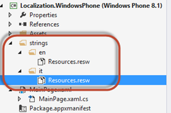
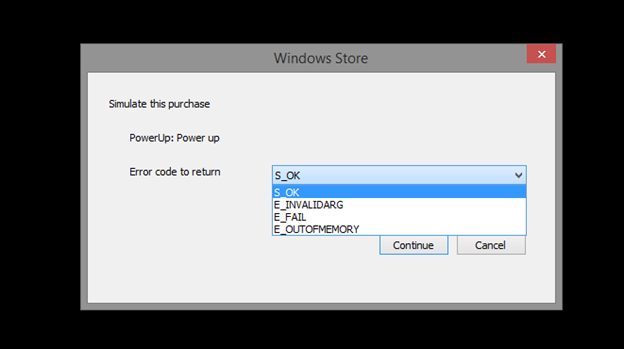
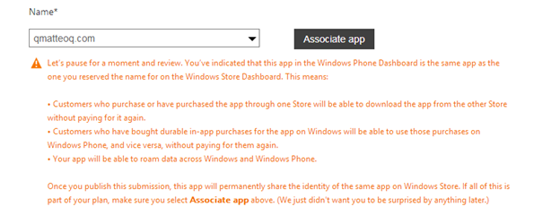
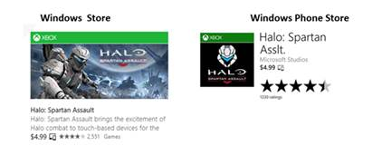
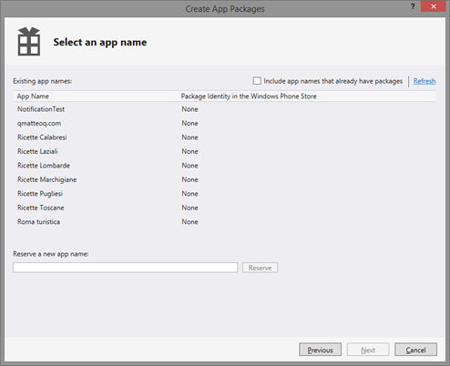
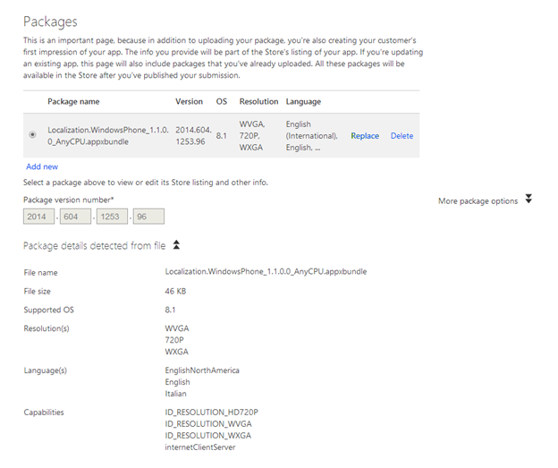
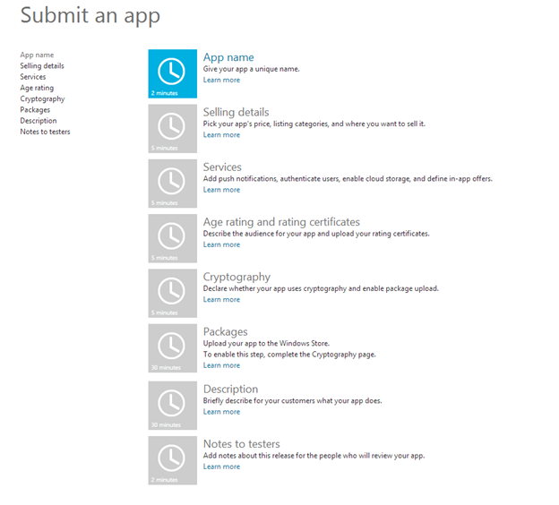
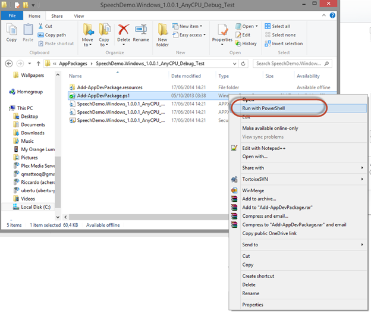
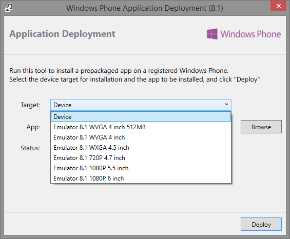

# 第 1 章在商店发布应用程序

在本章中，除了学习如何向商店提交应用程序之外，我们还将看到如何改进我们的应用程序，以便它对用户来说更加有趣和鼓舞人心。

## 本地化

让我们的应用程序更受欢迎的一个有效策略是适当地支持多种语言。Windows 和 Windows Phone 设备在世界各地被各种各样的用户使用，所以我们不能想当然地认为我们的用户能够阅读和说英语。Windows 商店应用程序为本地化提供内置支持。与传统方法的不同之处在于，我们不会用 XAML 或代码对文本进行硬编码，而是将它们保存在单独的文件中，每种支持的语言都有一个文件。每个文件(实际上是 XML 文件)都包含一个资源列表，其中有一个键(唯一标识符)和值(以特定语言本地化的真实文本)。每次我们想要向用户显示文本时，我们都要添加一个与我们想要显示的文本相匹配的键的引用。

管理本地化的第一步是为我们想要支持的每种语言添加一个文件。该场景使用基于文件夹名称的命名约定来实现。所有资源文件都需要包含在项目的一个文件夹中(如果您正在开发一个通用应用程序，它也可以包含在共享项目中)，通常称为**字符串**。在这个文件夹中，您需要创建一个子文件夹，其中包含您想要支持的每种语言的区域性代码。

您可以在 MSDN 文档中找到支持的代码列表:aspx 。重要的是要强调，你不会被迫使用完整的文化代码(比如 en-US 或 IT-IT)；如果你想用一个唯一的资源文件支持同一文化的所有变体，你也可以使用短版本(像 **en** 或 **it** )。

在每个文件夹中，您需要创建一个资源文件；你会在 Visual Studio 中找到一个特定的模板，叫做**资源文件(。resw)。**指定的默认名称是 **Resources.resw** 。



图 1:一个支持两种语言的项目:英语和意大利语

如果双击 **Resources.resw** 文件，Visual Studio 将打开可视化编辑器，它将显示一个行和三列的列表:

*   **名称**，是资源标识键。
*   **值，**为本地化文本。
*   **注释，**这是一个可选注释，可以更容易地理解资源在哪里使用。

资源与显示价值的 XAML 控制严格相连；因此，该名称遵循特定的惯例。密钥的第一部分是唯一的资源标识符；选择什么最适合你的场景取决于你。比如可以是`Title`这样的标签。键的第二部分由带句点的第一部分分隔，是我们要用此资源处理的控件属性的名称。例如，如果我们想在`TextBlock`控件的`Text`属性中显示资源的值，我们应该将其定义为`Title.Text`。

我们如何将资源连接到它的控件？通过使用一个名为`x:Uid`的特殊 XAML 属性，每个 XAML 控件都支持该属性。我们需要用资源的唯一标识符来设置它，这是密钥的第一部分(在句点之前)。例如，如果我们想要连接资源`Title.Text`以在`TextBlock`控件中显示它的值，我们需要用以下方式定义它:

```cs
    <TextBlock x:Uid="Title" />

```

另一个常见的需求是在代码中使用资源。例如，如果我们需要使用`MessageDialog`类显示弹出消息，我们需要以另一种方式访问资源，因为弹出消息不能在 XAML 定义。为了实现这个目标，我们需要使用`ResourceLoader`类，它提供了一种叫做`GetString()`的方法。作为参数，我们需要传递标识资源的全名。应用程序将根据当前语言自动检索资源。

```cs
    private async void OnShowMessageClicked(object sender, RoutedEventArgs e)
    {
    ResourceLoader loader = new ResourceLoader();
    string resource = loader.GetString("Title/Text");
    MessageDialog dialog = new MessageDialog(resource);
    await dialog.ShowAsync();
    }

```

如您所见，有一个重要的区别需要强调:当您从代码中调用资源时，您需要使用正斜杠( **/** )而不是句点作为键的第一部分和第二部分之间的分隔符。在示例中，为了检索名为`Title.Text`的资源的值，我们将值`Title/Text`作为参数传递。

### 定位图像

另一个常见的需求是根据用户的语言支持不同的图像。在这种情况下，我们可以使用类似于我们在第 4 章中看到的命名约定来管理不同的比例因子。我们可以增加一个**。图像名称的 lang-** 后缀，后跟文化代码，使其仅在设备与指定语言一起使用时可见。例如，如果我们有一个名为**logo.png**的图像，并且我们想要有两个版本，一个是英语版本，一个是意大利语版本，那么我们必须在项目中添加两个图像:一个名为**logo.lang-en.png**，另一个名为**logo.lang-it.png**。

这种命名约定对开发人员来说是完全透明的。在 XAML 或代码中，我们只需要使用基本名称(**logo.png**)引用图像，操作系统会根据语言自动选择合适的图像。这里有一个例子:

```cs
    <Image Source="/Assets/logo.png" />

```

### 管理默认语言

默认应用程序语言在清单文件中由**应用程序**部分中名为**默认语言**的字段设置。当我们没有为当前语言提供特定的资源文件时，会使用默认语言。默认情况下是 **en-US** ，保持这种设置是个好办法；由于英语是世界上最广泛使用的语言之一，即使我们不支持他们的母语，我们的用户也很可能知道它。

但是，在某些情况下，使用另一种默认语言是有意义的。例如，仅在特定国家分发的本地应用程序(如连接到本地杂志的新闻阅读器应用程序)。在这种情况下，我们可以用另一个区域性代码来更改**默认语言**的值。

与 Windows Phone 8.0 不同，不再需要在清单文件中指定应用程序支持的所有语言；可用语言列表将由**字符串**文件夹中创建的子文件夹自动检测。

### 翻译应用程序的名称

我们还可以翻译应用程序的名称，以防我们希望我们的应用程序有一个基于用户语言的本地化名称。为了实现这个目标，我们可以在每个资源文件中添加一个新的字符串。这一次，我们可以给资源起一个我们喜欢的名字，而不用遵循任何惯例。

然后，我们可以打开清单文件，在**应用程序**部分，通过将资源名称设置为前缀`ms-resource:`来更改**显示名称**字段。例如，如果我们已经创建了一个带有关键字`ApplicationName`的资源，我们应该将`ms-resource:ApplicationName`作为字段的值。

## 试用模式

另一种让我们的付费应用更吸引用户的方法是提供试用模式；这样，用户将能够在购买之前尝试它。试用模式最有趣的优点是，与其他平台不同，您不必发布两个不同的应用程序。该试用版将在整个应用程序中实现，您将能够通过代码检测到它以哪种模式运行。如果用户购买了你的 app，就不用从头再下载；商店将下载一个新的证书来解锁所有功能。

管理试用有两种方法:

*   **手动:**我们有一个返回`Boolean`的 API，它只是告诉我们应用程序是否在试用模式下运行。有了这些信息，我们就可以按照自己喜欢的方式实施审判；我们可以屏蔽一些功能，在每次应用启动时显示弹出消息，显示一些广告等。
*   **时间试用:**当你在商店提交申请后，你就可以设置一个试用的截止日期，一旦试用期结束，应用就会自动被屏蔽。此模式仅在 Windows 上可用，因为 Windows 电话开发中心不允许您在提交期间设置到期日期。

这两种方式都由一个名为`LicenseInformation`的类管理，该类是属于`Windows.ApplicationModel.Store`命名空间的`CurrentApp`类的属性。我们可以使用两个属性来管理试用版:

*   `IsTrial`是一个`Boolean`值，如果应用程序是否在试用模式下运行，该值将返回。
*   `IsActive`是一个`Boolean`值，如果应用程序过期或未过期，该值将返回。如果我们想知道截止日期，我们可以进入`ExpirationDate`房产。

以下示例代码显示了一条带有应用程序当前状态的弹出消息:

```cs
    protected override async void OnNavigatedTo(NavigationEventArgs e)
    {
    LicenseInformation license = CurrentApp.LicenseInformation;

    if (!license.IsActive)
    {
    MessageDialog dialog = new MessageDialog("The application is expired");
    await dialog.ShowAsync();
    }
    else if (license.IsTrial)
    {
    MessageDialog dialog = new MessageDialog("The application is in trial mode");
    await dialog.ShowAsync();
    }
    }

```

### 测试试用模式

`CurrentApp`类是`connected`到店铺上报的信息；因此，我们测试试用模式的唯一方法是将应用程序提交给商店。然而，Windows Runtime 提供了一个模拟器类，我们可以用它来测试试用模式:它叫做`CurrentAppSimulator`，它提供了与`CurrentApp`类相同的属性和方法。不同之处在于，它将从本地配置文件中加载信息，而不是从存储中检索信息。

由于`CurrentAppSimulator`类类似于`CurrentApp`类，使用起来非常简单。只需在代码中将`CurrentApp`引用替换为`CurrentAppSimulator`引用，如下例所示。

```cs
    protected override async void OnNavigatedTo(NavigationEventArgs e)
    {
    LicenseInformation license = CurrentAppSimulator.LicenseInformation;

    if (!license.IsActive)
    {
    MessageDialog dialog = new MessageDialog("The application is expired");
    await dialog.ShowAsync();
    }
    else if (license.IsTrial)
    {
    MessageDialog dialog = new MessageDialog("The application is in trial mode");
    await dialog.ShowAsync();
    }
    }

```

第一次使用这个类时，一个名为 **WindowStoreProxy.xml** 的新文件将在本地存储中创建，位于文件夹**微软/Windows Store/Apidate**中。您可以阅读第 5 章，了解如何在 Windows 和 Windows Phone 上访问本地存储中的该文件。

该 XML 文件包含一组配置应用程序状态的参数。下面是一个示例配置文件:

```cs
    <?xml version="1.0" encoding="utf-16" ?>
    <CurrentApp>
    <ListingInformation>
    <App>
    <AppId>00000000-0000-0000-0000-000000000000</AppId>
    <LinkUri>
    http://apps.microsoft.com/webpdp/app/00000000-0000-0000-0000-
    000000000000
    </LinkUri>
    <CurrentMarket>en-US</CurrentMarket>
    <AgeRating>3</AgeRating>
    <MarketData xml:lang="en-us">
    <Name>AppName</Name>
    <Description>AppDescription</Description>
    <Price>1.00</Price>
    <CurrencySymbol>$</CurrencySymbol>
    <CurrencyCode>USD</CurrencyCode>
    </MarketData>
    </App>
    </ListingInformation>
    <LicenseInformation>
    <App>
    <IsActive>true</IsActive>
    <IsTrial>true</IsTrial>
    <ExpirationDate>2015-01-19T05:00:00.00Z</ExpirationDate>
    </App>
    </LicenseInformation>
    </CurrentApp>

```

我们需要用来测试试用模式的部分在`LicenseInformation`块中，它包含一个`App`部分，该部分包含一组元素，这些元素与我们之前看到的由`CurrentApp`类(它们是`IsActive`、`IsTrial`和`ExpirationDate`)公开的属性相匹配。我们可以编辑并保存该文件；从现在开始，`CurrentAppSimulator`类将使用这些属性返回应用程序的状态。前面的示例定义了一个试用模式的应用程序，该应用程序将于 2015 年 1 月 19 日<sup>凌晨 5 点到期。</sup>

|  | 提示:在发布应用程序之前，记得用 CurrentApp 类替换 CurrentAppSimulator 引用；否则，您的代码将无法工作。或者，您可以使用条件编译在调试模式下使用当前的模拟器类，在发布模式下使用当前的模拟器类。 |

|  | 注意:如果您尝试使用之前在 Windows Phone 上设置 ExpirationDate 的示例代码，您会注意到该代码可以正常工作。平台确实支持 API，但是由于提交过程不支持这种情况，您将无法在发布的应用程序中使用它。 |

### 采购应用程序

该应用程序可以简单地从商店购买。当用户打开应用程序的页面，并且他们已经下载了试用版时，他们将看到一个购买按钮，该按钮将启动购买过程。您也可以从应用程序中触发购买过程；这样，用户将永远不必离开您的应用程序来购买它。这个目标是通过调用`CurrentApp`类的`RequestAppPurchaseAsync()`方法来实现的:

```cs
    private async void OnBuyAppClicked(object sender, RoutedEventArgs e)
    {
    await CurrentApp.RequestAppPurchaseAsync(true);
    }

```

如果您决定使用这种方法，跟踪试用状态何时改变是很重要的。如果我们手动管理试用模式，我们需要在购买过程完成后立即禁用它。为了支持这一要求，`LicenseInformation`类提供了一个名为`LicenseChanged`的事件，该事件在购买试用应用程序并将其转换为完整版本时触发。下面的示例代码使用此事件简单地向用户显示一条消息；在实际应用程序中，您将解锁以前解锁的功能。

```cs
    protected override async void OnNavigatedTo(NavigationEventArgs e)
    {
    LicenseInformation license = CurrentApp.LicenseInformation;
    license.LicenseChanged += license_LicenseChanged;
    }

    private async void license_LicenseChanged()
    {
    MessageDialog dialog = new MessageDialog("The application has been purchased");
    await dialog.ShowAsync();
    }

```

您可以使用`CurrentAppSimulator`类来模拟该功能。事实上，您可以自定义**窗口的`App`部分来设置商店信息，包括价格，如下例所示。**

```cs
    <App>
    <AppId>00000000-0000-0000-0000-000000000000</AppId>
    <LinkUri>
    http://apps.microsoft.com/webpdp/app/00000000-0000-0000-0000-
    000000000000
    </LinkUri>
    <CurrentMarket>it-IT</CurrentMarket>
    <AgeRating>3</AgeRating>
    <MarketData xml:lang="en-us">
    <Name>Sample app</Name>
    <Description>Description</Description>
    <Price>2.00</Price>
    <CurrencySymbol>€</CurrencySymbol>
    <CurrencyCode>EUR</CurrencyCode>
    </MarketData>
    </App>

```

前面的示例模拟了一个定价为 2 欧元的应用程序。当我们使用`CurrentAppSimulator`类的`RequestAppPurchaseAsync()`方法时，Windows 和 Windows Phone 会显示一个特殊的屏幕来模拟购买过程。我们可以选择支持的状态之一，即 **S_OK** (购买成功完成) **E_INVALID** 、 **E_FAIL** 或 **E_OUTOFMEMORY** (不同的错误情况)。

## 应用内购买

将我们的应用程序货币化的另一种方法是支持应用程序内购买:我们可以制作一个免费的应用程序(或付费的应用程序，但价格更便宜)，让用户可以选择购买应用程序本身的新功能或项目。例如，照片编辑应用程序可以访问一组基本的过滤器，然后允许用户使用应用内购买来购买更多的过滤器。

微软直接通过商店支持应用内购买功能，因此您不需要自己管理支付。用户将使用连接到其账户的同一张信用卡进行应用内购买，体验将与他们购买应用时提供的体验非常相似。对于开发者来说，收益分成机制是一样的:微软会保留 30%的价格，剩下的归开发者。但是，你并不是被迫使用微软服务来管理应用内购买:如果你已经有了自己的支付系统，你可以自由使用它，而无需与微软分享收入。

当您使用 Microsoft 服务时，您可以定义两种购买类型:

*   **耐用:**产品一旦购买，就成为用户的财产，即使他卸载应用程序或更换设备，也会得到维护。它通常在购买用于解锁应用程序功能(游戏的一组新级别、广告移除等)时使用。).
*   **消耗品:**这些产品可以多次消费和购买。它们通常用于游戏中管理虚拟货币或临时功能(如加电)。

在提交过程中，在**服务**步骤中，在 Windows 开发中心定义了可用的产品。相反，在视窗手机开发中心，有一个名为**产品**的特定部分，您可以通过点击**添加应用内产品**按钮来添加新产品。

关于应用内购买，需要强调的一个重要特征是，它们与通用应用概念有着严格的联系。如果您打算发布一个通用项目并启用身份共享(因此您将在 Windows 和 Windows Phone 商店上拥有相同的应用程序)，应用程序内购买将在两个平台之间共享。这样，如果用户在她的智能手机上购买了一个产品，她也会在她的平板电脑或电脑上找到它。但是，由于商店仍然是独立的，您必须在两个开发中心定义产品。

每个产品都由一组参数来标识:

*   名字
*   唯一标识符，应用程序中使用它来引用它
*   类型(耐用或易耗)
*   到期日期:如果我们设置了，产品在该日期后将不再可购买。
*   语言
*   价格
*   有它的国家。
*   每种支持的语言的标题和描述。

一旦您定义了产品，我们将使用之前看到的相同的`CurrentApp`类来管理试用体验。

### 检索可用产品列表

`CurrentApp`类提供了一个名为`LoadListingInformationAsync()`的方法，该方法可以访问关于应用程序的一些信息。其中之一是`ProductListing`，它是所有可用的应用内购买产品的集合。每个元素都由`ProductListing`类标识，该类包含我们在门户上定义的产品的所有信息，如价格(`FormattedPrice`)或名称(`Name`)。以下示例代码显示了如何使用`ListView`控件检索列表并显示给用户:

```cs
    private async void OnListProductsClicked(object sender, RoutedEventArgs e)
    {
    ListingInformation information = await CurrentApp.LoadListingInformationAsync();
    List<ProductListing> products = information.ProductListings.Values.ToList();
    Products.ItemsSource = products;
    }

```

相反，下一个示例显示了如何定义`ListView`控件以向用户显示每个产品的名称和价格:

```cs
    <ListView x:Name="Products" SelectionChanged="Products_OnSelectionChanged">
    <ListView.ItemTemplate>
    <DataTemplate>
    <StackPanel Orientation="Horizontal">
    <TextBlock Text="{Binding Path=Name}" Margin="12, 0, 12, 0" />
    <TextBlock Text="{Binding Path=FormattedPrice}" />
    </StackPanel>
    </DataTemplate>
    </ListView.ItemTemplate>
    </ListView>

```

### 购买产品

产品购买采用`CurrentApp`类的另一种方法`RequestProductPurchaseAsync()`。作为参数，我们需要传递我们在门户中定义的唯一产品标识符。以下示例显示了如何管理上一个`ListView`控件的`ItemClick`事件，该事件在用户点击其中一个产品时触发:

```cs
    private async void Products_OnItemClicked(object sender, SelectionChangedEventArgs e)
    {
    Guid productTransactionId;
    ProductListing selectedProduct = e.ClickedItem as ProductListing;
    PurchaseResults result = await CurrentApp.RequestProductPurchaseAsync(selectedProduct.ProductId);
    switch (result.Status)
    {
    case ProductPurchaseStatus.Succeeded:
    {
    productTransactionId = result.TransactionId;
    MessageDialog dialog = new MessageDialog("The product has been succesfully purchased");
    await dialog.ShowAsync();
    break;
    }
    case ProductPurchaseStatus.AlreadyPurchased:
    {
    MessageDialog dialog = new MessageDialog("The product has already been purchased");
    await dialog.ShowAsync();
    break;
    }
    case ProductPurchaseStatus.NotFulfilled:
    {
    MessageDialog dialog = new MessageDialog("The product hasn’t been fulfilled yet and it’s still valid");
    await dialog.ShowAsync();
    break;
    }
    }
    }

```

该方法返回一个`PurchaseResults`对象，该对象提供一个名为`Status`的属性。这是一个`ProductPurchaseStatus`枚举器，每个不同的场景都有一个值。在前面的示例中，我们管理三种情况:

*   `Succeeded`:产品购买成功。
*   `AlreadyPurchased`:用户正在尝试购买已经购买的耐用产品。
*   `NotFullfilled`:在应用程序标记为已实现之前，用户正在尝试购买可消费产品。

我们有责任以适当的方式管理这些响应；在前面的示例中，我们只是向用户显示一条消息。在实际应用中，当我们收到`Succeeded`响应时，我们会下载或解锁购买的功能。

### 管理消费品

在前面的示例代码中，我们将名为`TransactionId`的`PurchaseResults`类的属性值保存在一个变量中。这是交易的唯一标识符，管理易耗品真的很重要。产品完成后，我们需要将此操作通知商店，以便我们解锁并允许用户再次购买。该操作使用`CurrentApp`类的`ReportConsumableFullfilmentAsync()`方法来执行，除了产品标识符之外，还需要我们之前保存的`TransactionId`。

```cs
    private async void OnUseConsumableClicked(object sender, RoutedEventArgs e)
    {
    await CurrentApp.ReportConsumableFulfillmentAsync("ProductId", productTransactionId);
    }

```

使用此代码后，如果我们尝试重新购买消耗品，操作将会成功，并且我们将获得`Succeeded`状态。

### 检查产品状态

当我们使用应用内购买时，通常我们的应用有一组锁定的功能。因此，当应用程序启动时，我们需要检查产品的状态，这样我们就可以解锁用户已经购买的功能。我们可以从`ProductLicenses`集合中获得这个信息，这是`CurrentApp`类的一个属性。

该集合包括每个产品的一个项目；只需看看`IsActive`房产是否设置为`true`即可了解是否已经购买。加载页面时，以下代码将检查是否购买了名称为`MyProduct`的产品:

```cs
    protected override async void OnNavigatedTo(NavigationEventArgs e)
    {
    LicenseInformation license = CurrentApp.LicenseInformation;
    ProductLicense product = license.ProductLicenses["MyProduct"];
    if (product.IsActive)
    {
    //unlock the feature
    }
    }

```

### 测试应用内购买

为了测试应用内购买，我们可以使用我们已经看到的相同方法来测试试用模式。要购买的产品将在存储在应用程序本地存储器中的 WindowsStoreProxy.xml 文件中定义。我们需要使用`CurrentAppSimulator`类来代替`CurrentApp`类。以下配置文件显示了如何模拟两种产品:

```cs
    <?xml version="1.0" encoding="utf-16" ?>
    <CurrentApp>
    <ListingInformation>
    <App>
    <AppId>00000000-0000-0000-0000-000000000000</AppId>
    <LinkUri>
    http://apps.microsoft.com/webpdp/app/00000000-0000-0000-0000-000000000000
    </LinkUri>
    <CurrentMarket>en-US</CurrentMarket>
    <AgeRating>3</AgeRating>
    <MarketData xml:lang="en-us">
    <Name>AppName</Name>
    <Description>AppDescription</Description>
    <Price>1.00</Price>
    <CurrencySymbol>$</CurrencySymbol>
    <CurrencyCode>USD</CurrencyCode>
    </MarketData>
    </App>
    <Product ProductId="RemoveAdvertising" LicenseDuration="0" ProductType="Durable">
    <MarketData xml:lang="en-us">
    <Name>Remove advertising</Name>
    <Price>1.00</Price>
    <CurrencySymbol>€</CurrencySymbol>
    <CurrencyCode>EUR</CurrencyCode>
    </MarketData>
    </Product>
    <Product ProductId="PowerUp" LicenseDuration="0" ProductType="Consumable">
    <MarketData xml:lang="en-us">
    <Name>Power up</Name>
    <Price>1.00</Price>
    <CurrencySymbol>€</CurrencySymbol>
    <CurrencyCode>EUR</CurrencyCode>
    </MarketData>
    </Product>
    </ListingInformation>
    <LicenseInformation>
    <App>
    <IsActive>true</IsActive>
    <IsTrial>false</IsTrial>
    </App>
    </LicenseInformation>
    </CurrentApp>

```

在`App`部分之后，我们找到一系列`Product`项；它们中的每一个都标识了可以在应用程序中购买的产品。最重要的信息是用属性设置的，比如`ProductId`(产品标识)、`LicenseDuration`(没过期我们可以设置为 0)和`ProductType`，可以是`Durable`也可以是`Consumable`。

在每一个`Product`版块里面，我们都有一个名为`MarketData`的标签，里面包含了所有关于产品购买的信息，当用户尝试购买 app 的时候就会显示出来。当您使用模拟器触发购买时，体验将类似于试用版:弹出窗口将允许您模拟购买过程的支持状态之一。



图 2:在 Windows 应用程序中模拟应用内购买

您还可以通过在 XML 文件的`LicenseInformation`部分添加新的`Product`项来模拟产品是否已经购买，如下例所示:

```cs
    <LicenseInformation>
    <App>
    <IsActive>true</IsActive>
    <IsTrial>true</IsTrial>
    <ExpirationDate>2016-01-19T05:00:00.00Z</ExpirationDate>
    </App>
    <Product ProductId="RemoveAdvertising">
    <IsActive>true</IsActive>
    </Product>
    </LicenseInformation>

```

通过使用该配置，由`RemoveAdvertising` id 标识的产品将已经处于活动状态。如果我们想要测试一个消耗品，我们需要在`LicenseInformation`部分下添加一个名为`ConsumableInformation`的新部分，如下例所示:

```cs
    <ConsumableInformation>
    <Product ProductId="PowerUp" TransactionId="00000000-0000-0000-0000-000000000000" Status="Active" />
    </ConsumableInformation>

```

## 在商店发布应用程序

我们即将进入项目的最后阶段:我们准备将其发布到商店，并与所有 Windows 和 Windows Phone 用户共享。正如本书开头已经提到的，Universal Windows 应用程序不是一种应用程序，而是一种特殊的 Visual Studio 模板，它的创建是为了让开发人员能够在两个平台之间共享尽可能多的代码。然而，最终我们会得到两个不同的包，因为有两个不同的商店:一个是 Windows 的，一个是 Windows Phone 的。因此，在本书的最后一部分，我们将根据您提交的应用程序的类型，在单独的部分中看到发布过程。

### 在两个应用程序之间共享身份

即使我们需要在两个不同的商店发布两个不同的应用程序，我们仍然有机会连接它们。这个功能叫做身份共享，它有很多优点:

*   **购买分享**:如果已经在两个平台中的一个平台上购买了应用，用户在另一个平台上下载就不用再付费了。
*   **应用内购买共享**:应用内购买是共享的，这样在一个平台上购买的产品在另一个平台上可以免费获得。
*   **漫游存储同步**:在第 5 章中，我们学习了如何使用漫游存储，在漫游存储中，内容在不同设备之间自动同步。如果应用程序共享相同的身份，此功能将扩展到不同的平台。
*   **使用单一推送通知通道**:当两个应用程序共享同一个身份时，我们可以使用同一个通道向两个平台发送推送通知，通过使用我们在第 10 章中学习的机制。

所有这些功能都由微软帐户管理，该帐户应配置为与用户所有设备(无论是智能手机、平板电脑还是计算机)的主帐户相同。要启用身份共享，您必须为两个应用程序保留相同的名称。当您开始提交新的 Windows 或 Windows Phone 应用程序时，第一步将要求您为应用程序选择一个名称，该名称在商店中应该是唯一的(这一要求只是最近才针对 Windows Phone 推出，因此您可能会找到同名的应用程序)。

在第一个提交步骤中，您可以保留一个新名称，或者从下拉菜单中选择一个已经为另一个应用程序保留的名称。当您选择已经在另一个平台上发布的应用程序的名称时，门户将向您显示一条警告，提示这些应用程序将被链接并且身份将被共享。在按下**关联** **应用程序**按钮之前，确保我们正在连接正确的应用程序非常重要，因为不可能取消两个链接应用程序的链接。



图 3:当您试图链接两个应用程序时显示的警告消息

当两个应用发布为通用应用并共享一个身份时，它们将显示在商店上，价格附近有一个特殊的图标，如下图所示:



### 如何创建开发者账号

要发布应用程序，您需要创建一个开发人员帐户，该帐户在两个商店之间共享。单个帐户可用于发布应用程序，既适用于 Windows，也适用于 Windows Phone。个人开发者账户的价格为 19 美元，公司为 99 美元。这是终身订阅，只需支付一次。过去，商店要求您每年支付维护应用程序的费用，但现在这一要求已经取消。

有两个例外:

*   学生可以注册一个名为 DreamSpark([http://www.dreamspark.com](http://www.dreamspark.com))的程序，该程序可以免费访问所有微软开发工具，包括完整的 Visual Studio 版本。其中一个好处是，你可以免费获得一段代码，用来注册成为一名 Windows 开发者。
*   拥有 MSDN 订阅的专业开发人员可以获得类似的好处(取决于他们的订阅):一个可以用来免费创建开发人员帐户的令牌。

您可以在[http://s.qmatteoq.com/DevRegistration](http://s.qmatteoq.com/DevRegistration)开始创建开发人员帐户的过程。您将被要求提供一组个人信息，以及将在商店中显示的发布者姓名。您可以使用信用卡或贝宝支付订阅费，该帐户将在程序结束时立即激活。但是，如果您计划创建公司帐户，该过程需要更多时间:注册完成后，微软合作伙伴将联系您以验证您的身份。该程序将验证公司是否真实存在，以及您是否有权代表公司运营。

一旦账户准备好，如果你想发布付费应用，有两个重要的部分要完成:支出和税收。

*   “支付”部分需要设置我们希望微软如何支付。我们可以设立一个银行账户或贝宝账户。每当我们的收入达到 200 美元时，微软就会支付给我们。
*   第二部分要求正确管理税收支出，以避免被美国和你的国家同时征税。如果您对这一部分不确定，我建议您联系业务顾问寻求帮助。

### 仪表板

两个门户都提供了一个名为 Dashboard 的主要部分，让您可以快速访问所有开发中心部分。您可以开始新的提交，查看已发布应用的详细信息，并获得下载数量和已售出应用数量的统计数据。开发中心的主要入口位于[http://dev.windows.com](http://dev.windows.com)。登录后，点击仪表板链接，系统会询问您想要访问哪个开发中心。

### 认证流程

Windows 和 Windows Phone 商店是受控的生态系统；在应用程序对用户可用之前，它需要通过一个认证过程，该过程将检查它是否遵循一套指导方针和要求。使用以下参数评估应用程序:

*   **技术**:应用需要稳定快速；它需要在所有设备上正确运行，无论可用内存和 CPU 速度如何；并且它需要适当地支持不同的分辨率和外形。
*   **内容**:有一些内容是 Windows Store app 不允许的，比如色情图片、过度暴力、种族主义、宗教歧视等。
*   **指南**:在这本书里，我们了解到在开发一个应用的时候，有一些指南是我们需要遵循的。

认证时间不是固定的:在大多数情况下，只执行自动测试，这意味着应用程序将在几个小时内获得认证。然而，也有可能应用程序被挑选出来进行更深入的测试；在这种情况下，最多可能需要五个工作日。如果认证过程成功完成，应用程序将发布到商店(除非您选择手动发布，我们将在后面看到)。如果失败，您将收到一份详细的报告，其中包含已发现的所有问题，以及重现这些问题的确切步骤。

### 如何生成要发布的包

Visual Studio 提供了一种生成要发布到商店的包的方法。该选项名为**创建应用包**，在**商店**菜单中提供，当您在 Windows 或 Windows Phone 项目的解决方案资源管理器中右键单击时，或在 Visual Studio 的顶部菜单栏中显示该菜单。此选项将触发一个向导过程，该过程将询问您是否要创建要在存储上发布的包。如果选择“否”，您将创建一个只能手动部署到手机或另一台电脑或平板电脑的包。

如果选择第一个选项，下一步将要求您使用连接到开发人员帐户的微软帐户登录。之后，向导将向您显示您已经保留的所有名称的列表(或者您可以保留一个新名称)。



图 4:将包链接到开发中心的特定应用程序的选项

下一步将询问您有关该软件包的信息，例如:

*   要保存它的路径。
*   应用程序的版本号(如果我们正在创建更新，该版本号必须高于商店当前发布的版本号)。
*   如果你想生成一个应用包:当这个功能打开时，下载的包将只包含基本应用。所有其他资源(图像、本地化文件等)。)将根据设备的配置单独下载。例如，如果您在分辨率为 720p 的英文手机上安装应用程序，商店将只下载英文资源和 720p 图像。
*   支持的配置:如果是 Windows Phone 应用，你只能生成中性或 ARM 包，因为市面上没有搭载 X86 处理器的智能手机。然而，在大多数情况下，创建一个中立的包就足够了:只有在某些情况下，您才需要为每个架构创建一个特定的包(就像当您在项目中使用本机库时，就像 SQLite 一样)。

现在程序完成了。单击**创建**按钮后，向导将通过提供一个。appxupload 或。提交过程中要上传的 appxbundle 文件。生成完成后，我们有机会运行 Windows App 认证套件，该套件将启动一系列基本测试，帮助我们确保认证过程不会失败(至少从技术角度来看)。

### 发布 Windows Phone 应用

Windows Phone 应用程序的提交过程由五个步骤组成，其中两个是必需的。让我们详细看看各个步骤。

#### 第一步:应用信息

这一部分定义了应用程序的基本信息，如价格、名称和类别。首先要定义的信息是名称，正如我们在谈到发布通用 Windows 应用程序和共享身份时已经强调的那样。

其他需要的信息是:

*   应用程序的类别，以及可选的子类别。
*   价格。
*   我们的应用程序是否支持试用模式。
*   将发布应用程序的国家。默认情况下，**分发到基础价格层的所有可用市场**选项被启用，这将使应用程序在平台支持的每个市场可用。我们也可以选择自动排除中国，因为中国在内容方面有更严格的规定(例如，你不能发布使用推特或脸书的应用程序，因为它们在中国是不允许的)。

Windows Phone 应用程序的分发渠道

在第一步中，您将有机会定义使用哪个分发渠道来分发应用程序。通常，此部分是隐藏的，并且会自动选择公共分发。有三种方法可以分发 Windows Phone 应用程序:

*   **公店**:标准做法；该应用程序可在商店公开获得，任何用户都可以找到并安装。
*   **对浏览或搜索商店的用户隐藏**:应用程序仍然发布在商店上，但用户将无法搜索或不会出现在商店排名中。用户只能通过使用直接的商店链接来安装应用程序。
*   **Beta** :当我们想要为我们的应用程序获得反馈，并且我们想要将其分发给选定数量的测试人员时，就会使用这个通道。与隐藏选项一样，应用程序在商店中不可见；你只能通过直接链接找到它。此外，并不是所有的用户都能下载。我们必须通过指定在他们的设备上注册的微软帐户来提供一个允许用户的列表。该步骤为此目的提供了一个特定的区域，在这里我们可以输入用分号分隔的所有帐户。如果未经授权的用户试图安装应用程序，商店将显示一条错误消息。测试版提交的一个重要特点是不需要认证；它只需要通过技术测试。因为我们发布应用程序是为了测试，所以它还没有完全完成是有意义的，因此，它可能会有一些错误。

需要强调的是，以前的分销渠道仅在 Windows Phone 应用程序上可用。在撰写本文时，测试版还不适合 Windows 应用程序。

使用发布部分，我们可以设置的最后一个选项是何时发布应用程序。我们可以在认证过程通过后立即发布，也可以手动发布(例如，因为我们想先开始营销活动)。

#### 第二步:上传并描述你的包

本节将要求开发人员发布我们之前生成的应用程序包，并填写商店上向用户显示的所有信息，以便它能够更好地理解我们应用程序的目的。

开始时，这一步将是空的。首先，我们必须上传。appxupload 或。我们用 Visual Studio 生成的 appxbundle 包，通过点击**添加新的**按钮。上传完成后，商店将开始分析它，并立即显示从包中检索到的一组信息，如版本号、支持的语言和分辨率、声明的功能等。



图 5:商店检测到的包功能

本节的第二部分将要求描述应用程序的所有元数据，需要为每种支持的语言指定这些元数据。你会发现一个下拉菜单，你可以用它来选择你要定义的语言。

要求的信息是:

*   **描述**:向用户显示的描述我们的应用的文本。文本最大长度为 2，000 个字符。
*   **更新描述**:如果是提交更新，可以描述一下这个新版本有什么变化。同样在这种情况下，最大长度为 2，000 个字符。
*   **关键词**:我们最多可以包含五个关键词，在 Store 上使用，让 to 用户更容易搜索到你的应用。

最后一部分收集商店中显示的所有图像:

*   **App 平铺图标**是应用的标识。分辨率为 300x300。
*   **推广图片**:如果选择应用在商店进行特色展示和推广，微软将从这些图片中选择一个。它需要三个不同的图像:1000x800(当图像被放置为商店背景时使用)、358x358 和 158x173(当应用程序在商店的第一页突出显示时使用)。
*   **截图**:这些是从你的应用程序中捕获的真实图像，显示了功能和视觉布局。最多可以上传八张截图；您可以为每个支持的分辨率上传一组截图，也可以只上传 WXGA 截图(分辨率为 768x1280)，Store 会为其他分辨率调整它们的大小。

### 可选步骤

提交程序还提供了三个可选步骤:

*   **添加应用内广告:**如果您想使用微软的广告提供商 PubCenter 在您的应用中显示广告，请使用此步骤。此步骤将为您提供在页面中正确注册广告控件所需的凭据。
*   **市场选择和定制定价:**我们已经看到，在第 1 步中，我们如何选择价格以及我们将在哪些国家销售我们的应用程序。同样的价格适用于每个国家，并根据当地货币自动转换。通过这一步，我们可以选择仅在一些国家分发应用程序，或者在其中一些国家以不同于我们选择的基础价格销售应用程序。
*   **地图服务:**我们已经在第 7 章讨论过这一步。如果我们在应用程序中使用 map 控件，这是必需的，因为它提供了注册它所需的凭据。

#### 提交申请

完成所有步骤后，我们可以按下**查看** **并提交**按钮，将其重定向到摘要页面，该页面将显示我们要发布的应用程序的所有主要功能。如果没有发现任何问题，可以按**提交**按钮确认，开始认证过程。一旦认证过程完成，您将收到一封包含认证响应的电子邮件。

#### 更新应用程序

如果您想为您的应用程序发布更新，过程与我们之前描述的相同。不同的是，我们将不得不按下仪表板中的**更新**按钮，而不是开始新的提交过程。我们将被重定向到提交步骤列表，我们之前输入的所有信息都将被填充。

要提交更新，我们必须重复前面的步骤，并更改已修改的信息。例如，我们可以上传一个新的包来替换现有的包，或者我们可以更改价格或描述。然后，我们需要再次提交它来启动认证过程。如果更新不涉及新的软件包版本(例如，您刚刚更改了价格)，该过程将很快完成，修改将几乎立即可用。

### 发布 Windows 应用

从概念的角度来看，发布一个 Windows 应用程序与我们看到的发布一个 Windows Phone 应用程序的过程没有太大的不同。大多数步骤是相似的，我们将不得不上传我们的包并定义描述它的元数据。

这个过程分为八个步骤。



图 6:发布窗口应用程序的步骤

#### 第一步:应用名称

这个步骤类似于我们在 Windows Phone 上看到的步骤:我们将选择应用程序的名称，通过选择一个已经保留的名称，或者通过保留一个新的名称。如果我们选择已经在 Windows Phone 上发布的应用程序，我们将能够链接它们并启用身份共享。

#### 第二步:销售细节

在本节中，我们可以定义分发选项，它们是:

*   价格。
*   如果我们支持试用模式:如果答案是肯定的，我们可以决定设置一个截止日期。
*   如果应用程序允许应用程序内购买:如果答案是肯定的，我们可以选择是否要使用微软服务(在这种情况下，我们将被重定向到下一步来定义产品)，或者是否要依赖我们的支付服务。
*   我们将销售应用程序的市场。
*   发布日期:默认选项是**我的 app 一通过认证就发布**，但我们也可以安排具体的日期和时间。
*   类别和可选子类别。
*   硬件要求。
*   如果我们支持可访问性，这意味着该应用程序经过专门设计，便于残疾人使用。

#### 第三步:服务

我们已经在第 10 章中看到了这一步，当时我们引入了推送通知。在本节中，我们可以设置推送通知服务(通过使用云微软解决方案 Azure 提供的移动服务，或者通过检索要在后端使用的身份验证令牌)并定义应用内购买产品。

#### 第四步:年龄评级

在本节中，我们需要根据我们提供的内容，为我们的应用程序用户定义建议的最低年龄。这一步对于游戏来说尤其重要，因为我们需要上传一个由认证机构提供的证书(称为游戏定义文件)，该证书证明了我们的应用程序的合适年龄。此外，一些国家(如巴西或俄罗斯)要求一套额外的证书。您可以阅读[http://s.qmatteoq.com/GameRatings](http://s.qmatteoq.com/GameRatings)的文档，了解如何获得这些证书的更多详细信息。

#### 第五步:密码学

为了遵守美国关于加密的法律，我们需要声明我们的应用程序是否使用任何算法来加密数据，如数字签名、NTLM 或 SSL 协议、数字版权管理等。

#### 第六步:包装

这一部分非常重要，因为它允许开发人员上传。appxupload 或。Visual Studio 创建的 appxbundle 包。您可以简单地拖放页面中的文件，或者通过单击**浏览文件**按钮在您的计算机上手动查找文件。选择要上传的文件后，您需要等待操作完成后才能继续。此部分可用于上传 Windows 8 和 Windows 8.1 的软件包。由于这本书是关于通用视窗应用程序(基于视窗 8.1)，我们不会描述如何管理视窗 8 软件包。

#### 第七步:描述

这是另一个重要的步骤，因为它要求开发人员定义将在商店上向用户显示的所有信息。这一部分分为两部分:第一部分是唯一的，而第二部分根据我们上传的是 Windows 8 还是 Windows 8.1 应用程序而有所不同。正如我们已经说过的，由于这本书是关于通用视窗应用程序的，我们将只讨论描述一个视窗 8.1 应用程序的过程。

以下是请求的信息列表:

*   **描述:**描述应用程序的文本。最大长度为 10，000 个字符。
*   **应用功能:**我们可以指定多达 20 个我们希望突出显示的应用功能。
*   **截图:**我们最多可以上传 9 张显示应用外观的截图。最低要求分辨率为 1366x768。对于每个截图，我们还需要包括一个描述，最大长度为 200 个字符。
*   **注意:**这是一个文本(最大长度 1500 个字符)，描述了这个版本中添加的新功能。当您提交现有应用程序的更新时，它特别有用。
*   **推荐的硬件:**您可以列出 11 个功能，描述应用程序的最低硬件要求。
*   **关键词:**最多可以添加七个关键词，用于提高商店上的应用可发现性。
*   **版权和商标信息:**关于谁对应用程序的内容拥有合法权利的信息。
*   **促销图片:**如果您的应用程序被选择在商店中促销，则使用一组可选图片。
*   **网站:**连接到应用程序的网站。
*   **支持联系方式:**开发人员的邮件地址，遇到问题获得支持。
*   **隐私政策:**如果我们发布使用互联网连接的应用程序，我们需要在应用程序内部和网站上提供隐私政策。此字段包含隐私策略页面的网址。

#### 第八步:测试人员注意事项

最后一步只包含一个文本字段，在这里我们可以为将要测试应用程序的人指定一些注释。例如，如果应用程序连接到受保护的服务，我们需要提供访问它的凭据。

### 提交申请

按下**查看发布信息**按钮，您将看到我们为提交所包含的所有信息的摘要。一旦我们确认一切正确，我们可以按下**提交认证**按钮提交。认证过程将开始，一旦完成，您将收到电子邮件通知。

### 更新应用

更新 Windows 应用程序的过程与我们在 Windows Phone 上看到的相同:当我们按下仪表板中的**更新**按钮时，我们将被重定向到八个步骤的列表。这一次，先前插入的信息将已经被填充。

您只需更改您想要修改的信息。例如，如果您正在提交更新，您将必须访问“包”部分并用新包替换现有包。或者，如果您想更改描述，可以直接进入步骤 7。在任何情况下，新的提交将被发送到商店；如果有重要变化(如新的包)，将触发新的认证流程。

## 不使用商店部署应用程序

在某些情况下(如测试或公司内部分发)，您可能需要部署应用程序，而无需在商店中发布它。继续手动部署的第一步是创建一个特殊的包:您需要再次使用**商店**菜单中的**创建应用包**选项，当您在 Visual Studio 中右键单击 Windows 或 Windows Phone 项目时，会显示该选项。但是这次我们要回答**否**问题**要不要建包上传到 Windows / Windows Phone Store？**这样，该过程将创建一个我们无法在商店上发布的特殊包。

### 在 Windows 上部署

Visual Studio 向导将在旁边创建一个文件夹。appxupload/。appxbundle 包，其中包含一组附加文件。要手动部署应用程序，我们需要将此文件夹复制到另一个设备上，并使用文件夹中包含的 PowerShell 脚本进行安装。该脚本将检索适当的证书，激活开发人员许可证(用户将被要求使用他的微软帐户登录，就像我们在 Visual Studio 中创建第一个项目时一样)并安装应用程序。

要继续部署，您必须右键单击文件夹中包含的 **Add-AppDevPackage.ps1** 文件，并选择**用 PowerShell 运行**选项:脚本将被执行，它将为您安装应用程序。



图 7:在平板电脑或计算机上手动部署 Windows 应用程序的选项

此外，必须允许计算机或平板电脑在不使用商店的情况下安装应用程序:在安装了 Visual Studio 2013 的计算机上，将自动应用此策略。但是，您可以通过在 Windows 注册表中编辑一个项来手动应用它。打开开始屏幕，编写 **regedit** 并启动编辑器:现在寻找一个名为**HKEY _ LOCAL _ MACHINE \ Software \ Policies \ Microsoft \ Windows \**的键。它将包含一个名为**的值:将其设置为 1 并关闭编辑器。**

### 在 Windows Phone 上部署

只有解锁的设备才允许在 Windows Phone 设备上手动部署(详见第 1 章):不能在普通手机上手动部署应用。

部署使用一个工具来执行，该工具安装有 Visual Studio 2013 Update 2，名为 **Windows Phone 应用程序部署 8.1** ，您可以在计算机上已安装的应用程序列表中找到该工具。使用起来非常简单:从**目标**下拉菜单中，您可以选择部署应用程序的目标设备(它可以是连接到计算机的真实设备或可用的仿真器之一)。然后你只需要点击**浏览**按钮并寻找。appxupload 或。Visual Studio 生成的 appxbundle 包。最后，你必须点击**部署**按钮来执行操作。



图 Windows Phone 部署工具