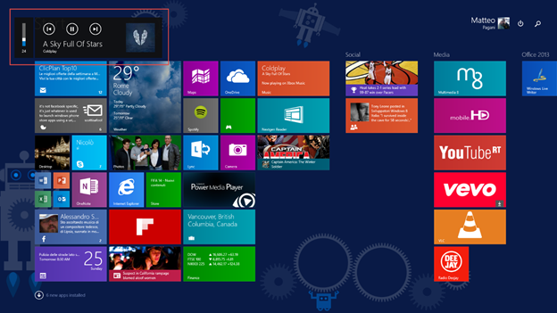

# 第五章创建多媒体应用

## 播放音视频

视窗运行时提供了一个名为`MediaElement`的控件，可以用来在应用程序中产生音频和视频轨道。然而，正如在前面关于使用语音 API 的章节中已经提到的，重要的是要强调，默认情况下，该控件会停止手机上运行的任何背景音频活动。基本用法很简单:只需将控件添加到页面中，用媒体文件的路径设置`Source`属性即可。它可以是远程网址，也可以是本地路径(如本地存储中的文件)。以下示例显示了如何使用`MediaElement`控制再现远程音频文件:

```cs
    <MediaElement Source="http://wpdevfusion.com/podcasts/05-2014.mp3" AutoPlay="True" x:Name="Media" />

```

将`AutoPlay`属性设置为`true`，我们可以在页面加载后立即播放音轨。我们也可以使用后面的代码加载一个媒体文件；当我们不能直接访问我们想要播放的文件，并且我们首先需要检索它(例如，它需要从网站下载)时，这很有用。

以下示例显示了如何从设备中挑选音频文件(使用我们在第 5 章中讨论的`FileOpenPicker`类)并播放它:

```cs
    private async void OnOpenFileClicked(object sender, RoutedEventArgs e)
    {
    FileOpenPicker picker = new FileOpenPicker();
    picker.FileTypeFilter.Add(".mp4");
    StorageFile file = await picker.PickSingleFileAsync();
    IRandomAccessStreamWithContentType stream = await file.OpenReadAsync();
    Media.SetSource(stream, stream.ContentType);
    }

```

检索到代表用户选择的音频文件的`StorageFile`对象后，我们使用`OpenReadAsync()`方法打开流。然后，我们将流传递给我们在 XAML 页面中添加的`MediaElement`控件的`SetSource()`方法，将内容类型作为参数传递(可以从`IRandomAccessStreamWithContentType`界面的`ContentType`属性中检索)。

|  | 注意:如果你读了第 5 章，你会知道前面的示例代码只在 Windows 应用程序中有效。Windows Phone 需要对 FileOpenPicker 类进行不同的管理，因为不可能同时打开两个应用程序。 |

### 控制水流

`MediaElement`控件通过提供最常见的控件，如播放、暂停、下一步等，提供了一个控制流的嵌入式界面。要启用它，我们需要将`AreTransportControlsEnabled`属性设置为`True`，如下例所示:

```cs
    <MediaElement Source="http://wpdevfusion.com/podcasts/05-2014.mp3"
    AreTransportControlsEnabled="True"
                  x:Name="Media"/>

```

但是，如果我们想要手动控制流，我们可以使用`MediaElement`控件提供的方法。以下示例显示了控制音频或视频流的非常基本的界面:

```cs
    <StackPanel>
    <MediaElement Source="http://wpdevfusion.com/podcasts/05-2014.mp3" x:Name="Media" />
    <Button Content="Play" Click="OnPlayClicked" />
    <Button Content="Pause" Click="OnPauseClicked" />
    <Button Content="Stop" Click="OnStopClicked" />
    </StackPanel>

```

以下是我们如何管理由我们在页面中添加的`Button`控件公开的`Click`事件的示例:

```cs
    private void OnPlayClicked(object sender, RoutedEventArgs e)
    {
    Media.Play();
    }
    private void OnPauseClicked(object sender, RoutedEventArgs e)
    {
    if (Media.CanPause)
    {
    Media.Pause();
    }
    }
    private void OnStopClicked(object sender, RoutedEventArgs e)
    {
    Media.Stop();
    }

```

为了使用户界面适应玩家的当前状态，我们可以使用`MediaElement`控件的`CurrentState`属性，该属性返回`MediaElementState`枚举器的一个值。本类`contains`值不同；它们中的每一个都标识了一种可能的状态，如`Playing`、`Paused`、`Stopped`等。通过订阅`CurrentStateChanged`事件，我们还可以在状态改变时获得实时通知。下面的示例代码显示了如何使用`CurrentState`属性来正确更改用户界面的行为。当播放按钮被按下并且播放器没有播放时，我们将播放媒体文件；否则我们会暂停。

```cs
    private void OnPlayClicked(object sender, RoutedEventArgs e)
    {
    if (Media.CurrentState == MediaElementState.Paused || Media.CurrentState == MediaElementState.Stopped)
    {
    Media.Play();
    }
    else if (Media.CurrentState == MediaElementState.Playing)
    {
    Media.Pause();
    }
    }

```

`MediaElement`控件提供了许多其他属性来定制流，例如:

*   `IsMuted`:设置为`true`，会立即将音量设置为零。
*   `IsFullWindow`:设置为`true`，强制玩家全屏运行。
*   `Volume`可以用来定义音量，从`0`(无音频)到`1`(最大音量)。
*   `IsLooping`:设置为`true`时，媒体文件将循环播放，直到用户停止播放。
*   `PosterSource`:在媒体文件完全加载之前将显示的图像的路径。当您直接从远程资源(如网站)加载文件时，它特别有用。
*   `DefaultPlaybackRate`:可以用来提高玩家速度的数值。默认情况下，它被设置为`1`，但可以用较小的值(如果您想更慢地再现媒体文件)或较大的值(如果您想更快地再现媒体)进行更改。
*   `Position`:玩家当前的位置(时间上)。

### 管理自动锁屏

所有智能手机和平板电脑都提供自动锁屏功能。为了保存电池，在设备不使用一段时间后(这意味着用户没有与设备交互)，它会自动锁定，并且当前运行的应用程序会暂停。然而，这个特性在多媒体应用程序中发挥不佳；例如，当用户在看电影时，她不会与设备交互，但这并不意味着她没有使用它。

因此，我们可以使用特定的应用编程接口来启用或禁用这种行为。通常，我们将在媒体文件播放时禁用它，并在媒体文件暂停或停止时再次启用它。我们可以通过使用`Windows.System.Display`命名空间中包含的`DisplayRequest`类来实现这个目标。以下示例显示了如何根据播放器的状态启用或禁用自动屏幕锁定功能来改进我们已经看到的播放方法:

```cs
    private void OnPlayClicked(object sender, RoutedEventArgs e)
    {
    DisplayRequest request = new DisplayRequest();
    if (Media.CurrentState == MediaElementState.Paused || Media.CurrentState ==
    MediaElementState.Stopped)
    {
    request.RequestActive();
    Media.Play();
    }
    else if (Media.CurrentState == MediaElementState.Playing)
    {
    request.RequestRelease();
    Media.Pause();
    }
    }

```

通过调用`DisplayRequest`类的`RequestActive()`方法禁用自动锁屏功能；当视频暂停时，我们通过调用`RequestRelease()`方法再次启用它。

### 后台播放音频

到目前为止，我们看到的与`MediaElement`控件交互的代码有一个限制:一旦应用程序暂停，播放器就会自动停止。在许多情况下，这种限制会破坏用户体验，因为用户希望在进行其他活动(如发送电子邮件或上网)时继续收听音频。由于这个原因，Windows 和 Windows Phone 包含了一种在应用程序不运行时管理播放的方法。当您按下按钮来增加或减少系统音量时，或者当您调出“魅力”栏时，将显示一个本机播放器，带有当前媒体元素的预览和一组与流媒体交互的快速按钮。这个原生播放器能够使用后台任务与流媒体交互，这将在第 11 章中详细介绍。目前，重要的是要知道它们是独立的项目，是应用程序解决方案的一部分，其中包含一些即使在应用程序没有运行时也可以执行的代码。然而，这两个平台的实现是不同的，我们将在接下来的章节中看到。

#### 在 Windows 8.1 中播放背景音频

在 Windows 中，管理音频的后台任务概念已经以特定的方式实现；该应用程序将充当后台任务，因此我们不必在单独的项目中管理流。

为了支持后台流，我们必须设置`MediaElement`控件的特定属性，称为`AudioCategory`；我们需要将其设置为`BackgroundCapableMedia`，如下例所示。

```cs
    <MediaElement Source="http://wpdevfusion.com/podcasts/05-2014.mp3" x:Name="Media" AudioCategory="BackgroundCapableMedia" />

```

现在我们可以在清单文件中启用背景音频支持。在**申报**部分，您会在**可用申报**下拉菜单中找到一个名为**后台任务**的项目。根据我们想要支持的后台任务的类型，可以用一组属性来配置这个声明。我们将在第 11 章详细讨论它们；在这种情况下，只需选择**音频**类型即可。下一步是定义**入口点**，它是管理任务的类的完全限定名(包括命名空间)。在这种情况下，正如我们之前提到的，是应用程序本身，所以我们必须添加应用程序的`App`类的完整签名。例如，如果我们创建了一个名为`MultimediaPlayer`的项目，我们需要将值`MultimediaPlayer.App`设置为入口点。



图 16:Windows 8.1 中的后台播放器

现在我们需要在管理`MediaElement`控件的方式上应用一些变化。第一步是获取对`SystemMediaTransportControls`类的引用，该类是`Windows.Media`命名空间的一部分。它的目的是管理与本机播放器的所有交互，这也可能在应用程序未运行时发生；这样，我们将能够相应地更改回放状态。因此，当加载页面时，我们需要使用`GetForCurrentView()`方法获取对这个类的引用，然后定义我们想要管理的状态和事件，如下例所示。

```cs
    public sealed partial class MainPage : Page
    {
    private SystemMediaTransportControls systemControls;

    public MainPage()
    {
    this.InitializeComponent();
    }

    protected override void OnNavigatedTo(NavigationEventArgs e)
    {
    systemControls = SystemMediaTransportControls.GetForCurrentView();
    systemControls.ButtonPressed += SystemControls_ButtonPressed;
    systemControls.IsPlayEnabled = true;
    systemControls.IsPauseEnabled = true;
    Media.CurrentStateChanged += Media_CurrentStateChanged;
    }
    }

```

在页面的`OnNavigatedTo()`方法中，我们执行一系列重要操作:

*   我们定义想要启用和管理的玩家命令。`SystemMediaTransportControls`类提供了许多`Boolean`属性，每个命令一个属性。在前面的示例中，我们已经设置了`true``IsPlayEnabled`和`IsPauseEnabled`属性。这样，我们将能够管理播放和暂停命令。其他可用属性有`IsFastForwardEnabled`、`IsRewindEnabled`、`IsPreviousEnabled`和`IsNextEnabled`。
*   我们订阅`SystemMediaTransportControls`对象的`ButtonPressed`事件。每次由于外部操作导致播放器状态改变时都会调用它(例如，用户已经使用本机窗口界面或通过按下键盘上的特殊键停止了回放)。
*   我们订阅`MediaElement`控件的`CurrentStateChanged`事件。我们之前已经见过这个事件，每次播放状态改变时都会引发。将`MediaElement`控件的状态与后台玩家的状态同步很重要。目标是避免这样的情况，例如，用户按下应用程序中的“暂停”按钮，后台播放器继续显示“暂停”按钮而不是“播放”按钮，就好像流尚未暂停一样。

以下示例显示了如何管理`CurrentStateChanged`事件:

```cs
    void Media_CurrentStateChanged(object sender, RoutedEventArgs e)
    {
    switch (Media.CurrentState)
    {
    case MediaElementState.Playing:
    systemControls.PlaybackStatus = MediaPlaybackStatus.Playing;
    break;
    case MediaElementState.Paused:
    systemControls.PlaybackStatus = MediaPlaybackStatus.Paused;
    break;
    case MediaElementState.Stopped:
    systemControls.PlaybackStatus = MediaPlaybackStatus.Stopped;
    break;
    case MediaElementState.Closed:
    systemControls.PlaybackStatus = MediaPlaybackStatus.Closed;
    break;
    default:
    break;
    }
    }

```

如您所见，我们只是根据在`MediaElement`控件的`CurrentState`属性中检测到的状态，使用`MediaPlaybackStatus`枚举器的值之一来设置`SystemMediaTransportControls`对象的`PlaybackStatus`属性。

现在我们来看看如何管理`SystemMediaTransportControls`对象暴露的`ButtonPressed`事件:

```cs
    private async void SystemControls_ButtonPressed(SystemMediaTransportControls sender,
    SystemMediaTransportControlsButtonPressedEventArgs args)
    {
    if (args.Button == SystemMediaTransportControlsButton.Play)
    {
    await Dispatcher.RunAsync(CoreDispatcherPriority.Normal, () =>
    {
    Media.Play();
    });
    }
    else if (args.Button == SystemMediaTransportControlsButton.Pause)
    {
    await Dispatcher.RunAsync(CoreDispatcherPriority.Normal, () =>
    {
    Media.Pause();
    });
    }
    }

```

每次用户与后台播放器交互时，都会触发`ButtonPressed`事件，通过使用方法参数的`Button`属性，我们能够检测到哪个按钮被按下。因此，我们需要根据调用的动作来更改播放状态。在前面的示例中，您可以看到如何管理`Play`和`Pause`命令。要执行命令，我们需要使用`Dispatcher`；这是必需的，因为后台玩家在后台线程中调用`ButtonPressed`事件，而`MediaElement`控件在用户界面中声明。

#### 在后台播放器中显示曲目信息

如果您已经使用了预装在 Windows 上的本机音乐应用程序，您可能已经注意到后台播放器能够显示一些关于您正在播放的当前音乐的信息，如标题、作者或专辑封面。我们可以通过我们的应用程序获得同样的结果，再次使用`SystemMediaTransportControls`类。这个对象提供的属性之一叫做`DisplayUpdater`，可以用来更新后台播放器显示的信息。

以下示例显示了如何执行此操作:

```cs
    private void OnUpdateInfoClicked(object sender, RoutedEventArgs e)
    {
    SystemMediaTransportControlsDisplayUpdater updater = systemControls.DisplayUpdater;
    updater.Type = MediaPlaybackType.Music;
    updater.MusicProperties.Artist = "Coldplay";
    updater.MusicProperties.AlbumArtist = "Ghost Stories";
    updater.MusicProperties.Title = "A Sky Full Of Stars";
    updater.Thumbnail =
    RandomAccessStreamReference.CreateFromUri(new Uri("ms-appx:///Music/music1_AlbumArt.jpg"));
    updater.Update();
    }

```

第一步是用`Type`属性定义我们要重现的内容类型，它可以是`MediaPlaybackType`枚举器的值之一:`Music`或`Video`。其余代码取决于我们播放的媒体文件的类型。如果是音轨，我们可以使用`MusicProperties`对象设置信息；如果是视频，我们可以使用`VideoProperties`对象。上一个示例显示了如何设置关于音乐轨道的信息；我们设置类似`Artist`、`AlbumArtist`、`Title`和`Thumbnail`的属性。设置好所有属性后，需要调用`Update()`方法更新后台播放器。

然而`SystemMediaTransportControlsDisplayUpdater`类提供了一种更简单的更新信息的方法:通常，音频或视频轨道已经包含描述文件内容的元数据，因此我们可以提取它来自动更新背景播放器。我们可以通过调用`SystemMediaTransportControlsDisplayUpdater`类的`CopyFromFileAsync()`方法来执行这个操作，这个方法需要媒体类型和一个表示媒体文件的`StorageFile`对象。

```cs
    private async void OnUpdateInfoClicked(object sender, RoutedEventArgs e)
    {
    SystemMediaTransportControlsDisplayUpdater updater = systemControls.DisplayUpdater;
    updater.Type = MediaPlaybackType.Music;
    StorageFile musicFile = await ApplicationData.Current.LocalFolder.GetFileAsync("audio.mp3");
    await updater.CopyFromFileAsync(MediaPlaybackType.Music, musicFile);
    updater.Update();
    }

```

前面的示例从名为 audio.mp3 的文件中提取音频元数据，该文件保存在本地存储中，然后使用它来更新后台播放器中显示的信息。

#### 在 Windows Phone 中播放背景音频

尽管我们将在本节中看到的许多概念与我们在 Windows 中看到的概念相似，但 Windows Phone 以不同的方式管理背景音频。在这种情况下，我们不能将应用程序本身用作后台任务；我们需要创造一个真实的。因此，第一步是在我们的解决方案中添加一个新项目。我们需要选择的模板类型叫做 **Windows Runtime 组件**(这是为基于 Windows Runtime 的应用程序创建库的标准模板)。

默认情况下，项目包含一个名为`Class1`的空类；您可以根据自己的喜好删除或重命名它。重要的是类需要实现`IBackgroundTask`接口，这就需要你实现`Run()`方法。在标准后台任务中，它是在任务被触发时执行的方法。

```cs
    namespace AudioPlayerApp.MusicTask
    {
    public sealed class AudioTask : IBackgroundTask
    {
    public void Run(IBackgroundTaskInstance taskInstance)
    {
    }
    }
    }

```

我们将很快看到我们需要在代理中包含哪些代码来管理音频回放。但是首先，让我们看看如何在主应用程序中注册任务。这种方法类似于我们在视窗系统中看到的方法，只是在这种情况下**入口点**不是应用程序本身，而是我们刚刚创建的后台任务类。因此，我们需要在清单文件的**声明**部分添加一个**后台任务**项目。检查完**音频**类型后，我们需要在**入口点**字段中包含后台任务类的完全限定名，即完整的名称空间加上类的名称。例如，如果我们参考前面的例子，条目将是`AudioPlayerApp.MusicTask.AudioTask`。

下一步是在主应用程序中添加对任务的引用，方法是在解决方案中右键单击 Windows Phone 项目时选择**添加引用**选项。现在主应用程序和任务已经连接，我们可以开始编写所需的代码来使后台音频工作。

在 Windows Phone 中，主应用只是作为一个接口来控制播放；所有的“脏活”都将由后台任务来完成，它将负责管理流。背景音频播放器由`BackgroundMediaPlayer`类标识，它在整个系统中有一个独特的实例:我们不能同时拥有两个控制背景音频播放的应用程序。当您要获取对类的当前实例的引用时，后台任务将自动执行，并调用`Run()`方法。下面是主应用程序的初始化示例:

```cs
    public sealed partial class MainPage : Page
    {
    private MediaPlayer mediaPlayer;

    public MainPage()
    {
    this.InitializeComponent();
    }

    protected override void OnNavigatedTo(NavigationEventArgs e)
    {
    mediaPlayer = BackgroundMediaPlayer.Current;
    }
    }

```

#### 管理应用程序和后台任务之间的通信

在我们定义后台任务之前，引入消息是很重要的，消息是用于从主应用程序与后台任务通信的特殊对象，反之亦然。

消息很重要，因为回放管理由后台任务控制；每次用户与界面交互时(例如通过播放 Play 按钮)，我们不会直接控制播放器，而是向后台任务发送消息，由后台任务执行所需的动作。消息由`ValueSet`类标识，该类只是由唯一键标识的对象的集合。在这个集合中，我们可以添加多个值，消息的接收者可以检索这些值。

使用`BackgroundMediaPlayer`类公开的两种方法交换消息:

*   `SendMessageToBackground()`被主应用用来向后台任务发送消息。
*   `SendMessageToForeground()`被后台任务用来向主应用发送消息。

另一方面，`BackgroundMediaPlayer`类提供了两个拦截消息的特定事件，它们是:

*   `MessageReceivedFromBackground`由主应用订阅，后台任务发送新消息时触发。通常，这些消息用于在回放发生变化时更新用户界面(例如，后台任务加载了新的曲目，我们需要在应用程序中显示新的信息)。
*   `MessageReceivedFromForeground`由后台任务订阅，当主应用发送新消息时触发。通常，它在用户与主应用程序交互时使用，我们需要请求后台任务对播放器执行一个操作(比如停止播放或播放下一首曲目)。

为了更好地理解如何使用消息，让我们看一个真实的例子。让我们假设，在主应用程序中，我们有一个按钮可以用来开始播放。下面是执行的代码:

```cs
    private void OnPlayClicked(object sender, RoutedEventArgs e)
    {
    ValueSet message = new ValueSet();
    message.Add("title", "A Sky Full Of Stars");
    BackgroundMediaPlayer.SendMessageToBackground(message);
    }

```

我们创建了一个新的消息，这就是`ValueSet`对象。然后，以我们处理常规`Dictionary`集合的相同方式，我们向消息中添加一个新项目。在这种情况下，它是要重现的音轨的标题，由一个唯一的键来标识，这就是`title`。通过调用`BackgroundMediaPlayer`类的`SendMessageToBackground()`方法将消息发送到后台任务。

当后台任务已经开始播放一个新的曲目，并且我们想要在应用程序中显示信息时，会发生什么？下面是一个示例代码:

```cs
    public sealed partial class MainPage : Page
    {
    private MediaPlayer mediaPlayer;

    public MainPage()
    {
    this.InitializeComponent();
    }

    protected override void OnNavigatedTo(NavigationEventArgs e)
    {
    mediaPlayer = BackgroundMediaPlayer.Current;
    BackgroundMediaPlayer.MessageReceivedFromBackground += BackgroundMediaPlayer_MessageReceivedFromBackground;
    }

    private void BackgroundMediaPlayer_MessageReceivedFromBackground(object sender,
    MediaPlayerDataReceivedEventArgs args)
    {
    ValueSet set = args.Data;
    if (set.ContainsKey("title"))
    {
    Dispatcher.RunAsync(CoreDispatcherPriority.Normal, () =>
    {
    Title.Text = set["title"].ToString();
    });
    }
    }
    }

```

页面加载后，在`OnNavigatedTo()`方法中，我们已经订阅了`BackgroundMediaPlayer`类公开的`MessageReceivedFromBackground`事件。当后台任务发送带有当前轨迹信息的消息时，事件处理程序被触发，由于处理程序参数的`Data`属性，我们能够检索消息的内容。在前面的示例中，我们假设消息包含一个带有歌曲标题的项目，由`title`键标识。我们只需使用放置在页面中的`TextBlock`控件来显示它。`MessageReceivedFromBackground`事件由后台线程管理，因此我们需要使用`Dispatcher`类与用户界面进行交互。

#### 使用后台任务管理回放

到目前为止，我们只看到了主应用程序执行的代码示例。现在，让我们看看如何从后台任务控制回放。让我们看一个比上一个更详细的定义:

```cs
    public sealed class AudioTask : IBackgroundTask
    {
    private BackgroundTaskDeferral _deferral;
    private SystemMediaTransportControls transportControls;

    public void Run(IBackgroundTaskInstance taskInstance)
    {
    transportControls = SystemMediaTransportControls.GetForCurrentView();
    transportControls.IsEnabled = true;
    transportControls.IsPauseEnabled = true;
    transportControls.IsPlayEnabled = true;
    transportControls.ButtonPressed += transportControls_ButtonPressed;
    BackgroundMediaPlayer.MessageReceivedFromForeground += BackgroundMediaPlayer_MessageReceivedFromForeground;
    BackgroundMediaPlayer.Current.CurrentStateChanged += Current_CurrentStateChanged;
    taskInstance.Canceled += TaskInstance_Canceled;
    taskInstance.Task.Completed += Task_Completed;
    _deferral = taskInstance.GetDeferral();
    }

    private void Task_Completed(BackgroundTaskRegistration sender, BackgroundTaskCompletedEventArgs args)
    {
    BackgroundMediaPlayer.Shutdown();
    _deferral.Complete();
    }
    }

```

`Run()`方法执行的代码与我们看到的 Windows 代码非常相似。我们使用`SystemMediaTransportControls`类(通过调用`GetForCurrentView()`方法检索该引用)来定义我们想要支持的回放控制。同样，我们也订阅了两个活动。第一个是`ButtonPressed`，由`SystemMediaTransportClass`曝光，每次用户与后台音频播放器交互时都会调用。第二个事件是`CurrentStateChanged`，由`BackgroundMediaPlayer`实例提供，每次播放状态改变时触发，我们需要将后台音频播放器与真实播放状态同步。

我们还订阅了两个与任务生命周期相关的事件，`Completed`和`Canceled`，它们在任务完成执行时被调用(成功或出错)。由于任务的异步性质，我们需要管理它们；正如我们在类似场景中看到的，我们需要使用一个延迟对象(在这种情况下，该类型是`BackgroundTaskDeferral`)来通知操作系统操作何时完成。

音频背景任务的工作方式与标准背景任务不同。正如我们将在第 11 章中看到的，一个常规的后台任务通常会执行`Run()`方法，然后被操作系统处理掉。因此，`BackgroundTaskDeferral`对象在`Run()`方法开始时创建，并在方法完成时标记为完成。然而，背景音频任务总是保持活跃，直到有一个媒体文件播放。因此，我们在`Run()`块中调用`GetDeferral()`方法，但是我们仅在后台任务被实际处理时调用`Complete()`方法，这发生在`Completed`或`Canceled`事件被触发时。

是时候回到真正的后台任务实现了。让我们详细看看如何管理`SystemMediaTransportControls`的`ButtonPressed`事件。

```cs
    void transportControls_ButtonPressed(SystemMediaTransportControls sender, SystemMediaTransportControlsButtonPressedEventArgs args)
    {
    switch (args.Button)
    {
    case SystemMediaTransportControlsButton.Play:
    BackgroundMediaPlayer.Current.Play();
    break;
    case SystemMediaTransportControlsButton.Pause:
    BackgroundMediaPlayer.Current.Pause();
    break;
    }
    }

```

代码类似于我们在 Windows 中看到的代码；通过使用方法参数的`Button`属性，我们能够理解哪个按钮被按下了。根据这个信息，我们触发`BackgroundMediaPlayer`类的适当方法。上一个示例展示了如何管理`Play`和`Pause`按钮。

我们在`Run()`方法中订阅的另一个重要事件是`MessageReceivedFromForeground`，您应该已经知道了。当主应用程序向后台任务发送消息时触发，因为用户想要更改回放状态。

```cs
    void BackgroundMediaPlayer_MessageReceivedFromForeground(object sender, MediaPlayerDataReceivedEventArgs args)
    {
    ValueSet valueSet = args.Data;
    foreach (string key in valueSet.Keys)
    {
    switch (key)
    {
    case "Play":
    Play(valueSet[key].ToString());
    break;
    case "Pause":
    BackgroundMediaPlayer.Current.Pause();
    break;
    case "Resume":
    BackgroundMediaPlayer.Current.Play();
    break;
    }
    }
    }

```

感谢`Data`属性，我们能够检索消息，类型为`ValueSet`。然后我们可以迭代`Keys`集合来了解已经收到了哪个命令。根据消息的内容，我们用`BackgroundMediaPlayer`类执行不同的操作。当我们想演奏一首曲目时会发生什么？在这种情况下，除了密钥之外，我们还需要检索消息的内容，也就是要重现的文件的 URL。以下示例显示了如何定义`Play()`方法:

```cs
    private void Play(string url)
    {
    BackgroundMediaPlayer.Current.SetUriSource(new Uri(url));
    BackgroundMediaPlayer.Current.Play();
    transportControls.DisplayUpdater.Type = MediaPlaybackType.Music;
    transportControls.DisplayUpdater.MusicProperties.Title = "WPDev Fusion 1";
    transportControls.DisplayUpdater.Update();
    ValueSet info = new ValueSet();
    info.Add("title", "WPDev Fusion 1");
    BackgroundMediaPlayer.SendMessageToForeground(info);
    }

```

通过使用`BackgroundMediaPlayer`类的`SetUriSource()`方法设置轨迹，将网址(我们收到的消息的内容)作为参数传递。那么，我们可以简单地称之为`Play()`法。在前面的示例中，您还可以看到，我们能够通过使用`SystemMediaTransportControls`类的`DisplayUpdater`属性来设置在后台音频播放器中显示什么信息，就像我们在 Windows 中所做的那样。这一次，除了更新后台播放器，我们还通过`SendMessageToForeground()`方法发送新消息，将当前曲目的标题信息发送给主应用。这样，如果应用程序在前台运行，它将能够拦截它，并向用户显示新曲目的标题。

最后一段要分析的代码是`CurrentStateChanged`事件处理程序，每次回放状态改变时都会调用。我们将像使用 Windows 一样使用它:将回放状态与背景音频播放器状态同步，以便它们始终匹配。

```cs
    private void Current_CurrentStateChanged(MediaPlayer sender, object args)
    {
    if (sender.CurrentState == MediaPlayerState.Playing)
    {
    transportControls.PlaybackStatus = MediaPlaybackStatus.Playing;
    }
    else if (sender.CurrentState == MediaPlayerState.Paused)
    {
    transportControls.PlaybackStatus = MediaPlaybackStatus.Paused;
    }
    }

```

我们简单地使用`BackgroundMediaPlayer`类的`CurrentState`属性来检测当前状态，并相应地设置`SystemMediaTransportControls`的`PlaybackStatus`属性。

## 获取照片和视频

移动设备，尤其是智能手机，是最常用于拍摄照片和视频的设备。许多因素有助于智能手机在这些场景中的采用率:

*   互联网连接:用户可以立即与社交网络上的朋友分享他们的照片等。
*   应用程序:用户可以通过添加效果、修复缺陷等方式立即编辑照片。
*   相机进化:一开始，集成相机与标准相机相比非常差，但最近几年情况发生了巨大变化。像 Lumia 1020 这样的手机可以完全取代紧凑型相机。

Windows Runtime 提供了一组 API，作为开发人员，我们可以使用这些 API 将相机体验集成到我们的应用程序中。让我们详细看看。

### 使用本机 Windows 应用程序捕捉照片和视频

捕捉照片或视频的最简单方法是依靠 Windows 中包含的本机 Camera 应用程序。当获取照片或视频不是应用程序的核心功能，而是一个补充功能时，这是最好的解决方案，就像一个推特应用程序，允许用户拍摄照片并与他们的追随者分享。事实上，通过使用该功能，您将不必处理嵌入视频流和管理该过程所需的所有复杂性。您只需将操作推迟到相机应用程序，您就可以简单地获得照片或视频作为回报。另一方面，正如我们将在本章后面看到的，这种方法不如直接在应用程序中管理捕获阶段强大。需要强调的是，以下 API 仅在 Windows 上可用，Windows Phone 不支持。

要使用这个特性，我们需要使用一个名为`CameraCaptureUI`的类，它属于`Windows.Media.Capture`命名空间。为了正确使用它，我们需要在清单文件中启用**网络摄像头**功能。此外，如果我们想要录制带音频的视频，我们需要启用**麦克风**功能。

#### 拍摄照片

在拍摄照片之前，我们需要配置一些设置来自定义操作，可以使用`CameraCaptureUI`类的`PhotoSettings`属性进行访问。最重要的是:

*   `Format`，这是我们要用来保存照片的文件类型。它可以是`Jpg`或`Png`，并使用`CameraCaptureUIPhotoFormat`枚举器的值之一进行设置。
*   `MaxResolution`，这是用来获取照片的分辨率。它是使用`CameraCaptureUIMaxPhotoResolution`枚举器设置的，该枚举器接受从`VerySmallQvga`(非常低的质量)到`HighestAvailable`(支持的最佳质量)的一系列值。

一旦定义了捕捉设置，就可以通过调用`CaptureFileAsync()`方法开始捕捉过程。它需要我们想要捕捉的媒体类型作为参数(因为我们谈论的是照片，所以我们需要将`CameraCaptureUIMode.Photo`作为值传递)。此方法将打开相机应用程序，以便用户可以拍照。拍摄的照片将作为`StorageFile`对象传回您的应用程序。以下示例显示了如何使用这些 API 来捕捉照片，并通过`image`控件将其显示给用户:

```cs
    private async void OnTakePictureClicked(object sender, RoutedEventArgs e)
    {
    CameraCaptureUI capture = new CameraCaptureUI();
    capture.PhotoSettings.Format = CameraCaptureUIPhotoFormat.Jpeg;
    capture.PhotoSettings.MaxResolution = CameraCaptureUIMaxPhotoResolution.
    HighestAvailable;
    StorageFile file = await capture.CaptureFileAsync(CameraCaptureUIMode.Photo);
    if (file != null)
    {
    var stream = await file.OpenReadAsync();
    BitmapImage image = new BitmapImage();
    await image.SetSourceAsync(stream);
    CapturedImage.Source = image;
    }
    }

```

#### 拍摄视频

捕获视频所需的代码与我们刚刚看到的非常相似。主要区别在于，如果我们想要定制捕捉设置，我们需要与`CameraCaptureUI`类提供的`VideoSettings`属性进行交互。同样在这种情况下，我们可以自定义录制格式(可以是 MP4 或 WMV，并通过使用`CameraCaptureUIVideoFormat`枚举器的值之一来设置)和分辨率。

再次，要启动 Camera 应用程序，我们需要调用`CaptureFileAsync()`方法，作为参数传递，这次是值`CameraCaptureUIMode.Video`。我们得到的回报是捕获的视频作为一个`StorageFile`对象。以下示例显示了如何录制视频并使用`MediaElement`控件向用户显示视频:

```cs
    private async void OnRecordVideoClicked(object sender, RoutedEventArgs e)
    {
    CameraCaptureUI capture = new CameraCaptureUI();
    capture.VideoSettings.Format = CameraCaptureUIVideoFormat.Mp4;
    capture.VideoSettings.MaxResolution = CameraCaptureUIMaxVideoResolution.
    HighestAvailable;
    StorageFile file = await capture.CaptureFileAsync(CameraCaptureUIMode.Video);
    if (file != null)
    {
    var stream = await file.OpenReadAsync();
    RecordedVideo.SetSource(stream, stream.ContentType);
    }
    }

```

### 获取应用内的照片和视频

对于某些应用，相机集成是一个核心特性。例如，想想 Instagram，它允许用户在共享照片之前对照片应用滤镜。对于这些场景，视窗运行时提供了一组强大的应用编程接口(不同于以前的应用编程接口，它们在视窗手机上可用)，给了开发人员最大的灵活性。照片或视频不是由另一个应用程序捕获的，而是由应用程序本身捕获的，它必须负责显示相机流和捕获图像。

实现这个场景的基类被称为`MediaCapture`，它连接到一个特殊的 XAML 控件，该控件直接在应用程序内部显示摄像机流。该控件被称为`CaptureElement`，它可以很容易地包含在 XAML 中，如下例所示:

```cs
    <CaptureElement x:Name="PreviewStream" />

```

通过组合`CaptureElement`控件和`MediaCapture`类，我们能够在应用程序中用以下代码显示摄像机预览:

```cs
    public sealed partial class MainPage : Page
    {
    private MediaCapture capture;

    public MainPage()
    {
    this.InitializeComponent();
    }

    private async void OnInitializeCameraClicked(object sender, RoutedEventArgs e)
    {
    capture = new MediaCapture();
    await capture.InitializeAsync();
    PreviewStream.Source = capture;
    await capture.StartPreviewAsync();
    }
    }

```

在我们创建了一个新的`MediaCapture`对象之后，我们通过调用`InitializeAsync()`方法来初始化它。然后，我们可以将其指定为页面中包含的`MediaCapture`元素的`Source`。现在我们可以通过调用`StartPreviewAsync()`方法来显示预览。

但是，前面的代码是不完整的；它没有考虑到应用程序可以在带有两个摄像头的手机上运行，一个在背面，一个在正面。为了支持这个场景，`InitializeAsync()`方法还支持一个参数，类型为`MediaCaptureInitializationSettings`。在我们可以自定义的设置中，我们可以定义使用哪个摄像头。下面是预览流的更完整的初始化:

```cs
    private async void OnInitializeCameraClicked(object sender, RoutedEventArgs e)
    {
    MediaCapture capture = new MediaCapture();
    DeviceInformationCollection collection = await DeviceInformation.
    FindAllAsync(DeviceClass.VideoCapture);
    MediaCaptureInitializationSettings settings = new MediaCaptureInitializationSettings();
    if (collection.Count > 1)
    {
    settings.VideoDeviceId = collection[1].Id;
    }
    else
    {
    settings.VideoDeviceId = collection[0].Id;
    }
    await capture.InitializeAsync(settings);
    PreviewStream.Source = capture;
    await capture.StartPreviewAsync();
    }

```

第一步是查询操作系统，检测有多少摄像头可用。我们通过调用`DeviceInformation`类的`FindAllAsync()`方法来实现，指定我们对`VideoCapture`设备感兴趣(这是`DeviceClass`枚举器的值之一)。该方法返回所有可用摄像机的集合，每个摄像机都有其唯一的 id，该 id 存储在`Id`属性中。这是我们需要分配给`MediaCaptureInitializationSettings`类的`VideoDeviceId`属性的标识符。前面的代码试图通过检查设备有多少摄像头来使用前置摄像头。如果不止一个，我们可以用前置摄像头；否则，我们会依赖默认的摄像头，也就是后置摄像头。在我们正确定义了`VideoDeviceId`属性之后，我们可以将我们创建的`MediaCaptureInitializationSettings`对象传递给`InitializeAsync()`方法。

到目前为止，我们看到的代码是相同的，无论我们是想拍照还是录制视频。然而，从现在开始，我们将根据我们的场景使用不同的方法。

#### 拍摄照片

照片是使用`MediaCapture`课提供的`CapturePhotoToStorageFileAsync()`方法拍摄的。作为参数，它需要我们想要使用的文件格式(感谢`ImageEncodingProperties`类)和我们想要保存捕获图像的文件(用`StorageFile`对象表示)。以下示例显示了如何拍摄照片并将其保存在本地存储中名为**image.jpg**的文件中:

```cs
    private async void OnTakePhotoClicked(object sender, RoutedEventArgs e)
    {
    StorageFile file = await ApplicationData.Current.LocalFolder.
    CreateFileAsync("image.jpg", CreationCollisionOption.ReplaceExisting);
    ImageEncodingProperties properties = ImageEncodingProperties.CreateJpeg();
    await capture.CapturePhotoToStorageFileAsync(properties, file);
    }

```

`ImageEncodingProperties`类提供了不同的方法来创建多种格式的照片。前面的示例使用`CreateJpeg()`方法创建了一个 JPEG 文件；然而，我们可以使用`CreateBmp()`创建位图文件，`CreatePng()`创建 PNG 文件，或者`CreateUncompressed()`获取原始图像。

#### 拍摄视频

拍摄视频的过程与我们看到的拍照过程非常相似。不同的是，这次我们要用`MediaCapture`类的`StartRecordToStorageFileAsync()`方法。作为参数，除了通常的`StorageFile`对象(用于标识保存内容的文件)之外，它还需要一个`MediaEncodingProfile`对象来定义要使用的格式和质量。

```cs
    private async void OnRecordVideoClicked(object sender, RoutedEventArgs e)
    {
    StorageFile file = await ApplicationData.Current.LocalFolder.CreateFileAsync("video.mp4", CreationCollisionOption.ReplaceExisting);
    MediaEncodingProfile profile = MediaEncodingProfile.CreateMp4(VideoEncodingQuality.
    HD720p);
    await capture.StartRecordToStorageFileAsync(profile, file);
    }

```

同样在这种情况下，`MediaEncodingProfile`类提供了许多方法来处理最常见的视频类型。前面的例子使用`CreateMp4()`方法创建 MP4 视频，但是我们可以使用`CreateWmv()`创建 WMV 文件，或者使用`CreateAVI()`创建 AVI 文件。所有这些方法还需要一个参数，类型为`VideoEncodingQuality`，来定义录制质量；在前面的示例中，捕获视频的分辨率将为 720p。

#### 如何自定义捕获过程

`MediaCapture`类最重要的特性之一是支持深度定制捕捉参数的能力，如对比度、亮度和曝光时间。我们通过使用`MediaCapture`类提供的`VideoDeviceController`对象来实现这个结果。我们可以自定义的一些最重要的属性包括:

*   `Brightness`
*   `Contrast`
*   `Exposure`
*   `Focus`
*   `FlashControl`，启用或禁用闪光灯

以下示例显示了如何通过修改`VideoDeviceController`对象的`FlashControl`属性来禁用闪光灯:

```cs
    private async void OnTakePhotoClicked(object sender, RoutedEventArgs e)
    {
    StorageFile file = await ApplicationData.Current.LocalFolder.CreateFileAsync("image.jpg", CreationCollisionOption.ReplaceExisting);
    ImageEncodingProperties properties = ImageEncodingProperties.CreateJpeg();
    capture.VideoDeviceController.FlashControl.Enabled = false;
    await capture.CapturePhotoToStorageFileAsync(properties, file);
    }

```

如果是视频录制，您也可以使用`AudioDeviceController`自定义音频录制参数。以下示例显示了如何通过与`VolumePercent`属性交互来更改录制音量:

```cs
    private async void OnRecordVideoClicked(object sender, RoutedEventArgs e)
    {
    StorageFile file = await ApplicationData.Current.LocalFolder.CreateFileAsync("video.mp4", CreationCollisionOption.ReplaceExisting);
    MediaEncodingProfile profile = MediaEncodingProfile.CreateMp4(VideoEncodingQuality.
    HD720p);
    capture.AudioDeviceController.VolumePercent = 30;
    await capture.StartRecordToStorageFileAsync(profile, file);
    }

```

## 访问多媒体库

每个 Windows 和 Windows Phone 设备都有一套多媒体库，用户可以在其中存储自己的媒体内容(音乐、视频、照片等)。).由于 Windows 运行时提供的 API，我们能够访问这些库和存储的文件。我们将在本节中看到的 API 和我们在第 5 章中讨论的`FileOpenPicker`类之间的主要区别是访问模式。与`FileOpenPicker`不同，我们将能够访问存储在这些库中的任何媒体文件，而不必要求用户选择她想要导入到应用程序中的文件。

媒体库由我们在第 5 章中看到的可移动设备的相同类别访问，即`KnownFolders`。此类提供以下对象:

*   `PicturesLibrary`，进入图片库。
*   `CameraRoll`，进入自动保存设备拍摄照片的相机胶卷。
*   `VideosLibrary`，进入视频库。
*   `MusicLibrary`，进入音乐库。

要访问这些库，您必须在清单文件中启用一组功能；每个受支持的库都有一个功能。

如果你读过第 5 章，使用图书馆是非常容易的；每个库都映射有一个`StorageFolder`对象，因此您将能够以与本地存储相同的方式读取、写入和复制文件。以下示例显示了如何列出用户图片库中保存的所有图像，并向用户显示它们的名称:

```cs
    private async void OnGetImagesClicked(object sender, RoutedEventArgs e)
    {
    var files = await KnownFolders.PicturesLibrary.GetFilesAsync();
    foreach (StorageFile file in files)
    {
    MessageDialog dialog = new MessageDialog(file.DisplayName);
    await dialog.ShowAsync();
    }
    }

```

相反，以下示例显示了如何使用`CopyAsync()`方法拍摄存储在本地存储器(称为**image.png**中的图片并将其保存在图片库中:

```cs
    private async void OnSaveImageClicked(object sender, RoutedEventArgs e)
    {
    var file = await ApplicationData.Current.LocalFolder.GetFileAsync("image.png");
    await file.CopyAsync(KnownFolders.PicturesLibrary);
    }

```

使用库时，有一个重要的概念需要理解:库不是指特定的文件类型，而是指特定的设备位置。当涉及到相机胶卷时，区别就很明显了。作为默认行为，设备获取的每张照片或视频都存储在“相机胶卷”文件夹中。因此，如果您尝试使用`the` `KnownFolders.VideosLibrary`类检索所有视频文件，您将不会获得使用该设备获取的所有视频，因为它们不会存储在视频文件夹中，而是存储在相机胶卷文件夹中。这意味着，例如，如果您只想检索获取的视频，您必须与类`KnownFolders.CameraRoll`交互，并使用`StorageFile`类的`FileType`属性来识别文件类型，如以下示例所示:

```cs
    private async void OnGetVideosClicked(object sender, RoutedEventArgs e)
    {
    StorageFolder library = KnownFolders.CameraRoll;
    IReadOnlyList<StorageFile> items = await library.GetFilesAsync();
    List<StorageFile> videos = items.Where(x => x.FileType == ".mp4").ToList();
    string message = string.Format("There are {0} videos in your camera roll", videos.Count);
    MessageDialog dialog = new MessageDialog(message);
    await dialog.ShowAsync();
    }

```

### 查询多媒体库

因为库指的是设备位置而不是文件类型，所以我们用来与文件交互的各种 API 遵循的是文件夹的结构，而不是逻辑结构。让我们看一个例子来更好地理解这个概念。假设在您的音乐库中，您有许多专辑，每个专辑都存储在一个子文件夹中。如果你调用`KnownLibrary.MusicLibrary`对象的`GetFilesAsync()`方法，你不会得到任何结果；由于该方法考虑了文件夹的结构，因此无法检索存储在各个子文件夹中的所有音乐文件。

在某些情况下，这种方法可能很难管理(例如，您只需要检索库的所有音乐文件，无论文件夹结构有多深)。因此，`GetFilesAsync()`方法接受一组能够改变方法行为并执行更复杂操作的参数。这些参数可以是`CommonFileQuery`枚举器的值之一，它们用于以不同的方式返回一组文件。以下示例使用`OrderByName`值返回音乐库中存储的所有音乐曲目(无论它们存储在哪个子文件夹中)，按曲目名称排序:

```cs
    private async void OnGetSongsClicked(object sender, RoutedEventArgs e)
    {
    StorageFolder library = KnownFolders.MusicLibrary;
    IReadOnlyList<StorageFile> items = await library.GetFilesAsync(CommonFileQuery.OrderByName);

    string message = string.Format("There are {0} music tracks in your library", items.Count);
    MessageDialog dialog = new MessageDialog(message);
    await dialog.ShowAsync();
    }

```

操作系统自动提供的唯一逻辑抽象是关于 SD 卡的，尤其是在 Windows Phone 上。如果您的设备上存储了一些音乐曲目，有些存储在 SD 卡中，`KnownFolders.MusicLibrary`对象的`GetFilesAsync()`方法将返回所有这些曲目，因为操作系统能够将可移动内存视为本机库的一部分。

### 如何检索元数据

多媒体文件与标准文件有一个重要的区别:它们可以有一组描述媒体内容的元数据。例如，音乐轨道可以具有描述标题、作者和专辑的元数据；图片可以有描述相机型号、分辨率等的 EXIF 数据。

Windows 运行时通过为每种媒体类型提供一组方法(由`StorageFile`对象的`Properties`类公开)，提供了一种检索这种特殊属性的方法:

*   `GetImagePropertiesAsync()`为图片
*   `GetMusicPropertiesAsync()`为音乐
*   `GetVideoPropertiesAsync()`为视频

每个方法返回不同类型的对象，具有不同的属性。以音乐为例，你会得到一个`MusicProperties`对象作为回报，它提供类似`Artist`或`Title`的属性。对于图片，你会得到一个`ImageProperties`对象，其属性类似于`Width`或`Height`。以下示例代码显示了如何检索相机胶卷中第一张图片的 EXIF 数据，以便我们可以通过弹出消息向用户显示标题和分辨率:

```cs
    private async void OnGetFilePropertiesClicked(object sender, RoutedEventArgs e)
    {
    StorageFolder library = KnownFolders.CameraRoll;
    IReadOnlyList<StorageFile> pictures = await library.GetFilesAsync();
    StorageFile picture = pictures.FirstOrDefault();
    if (picture != null)
    {
    ImageProperties imageProperties = await picture.Properties.
    GetImagePropertiesAsync();
    if (imageProperties != null)
    {
    string info = string.Format("{0} - {1} x {2}", imageProperties.Title, imageProperties.Width, imageProperties.Height);
    MessageDialog dialog = new MessageDialog(info);
    await dialog.ShowAsync();
    }
    }
    }

```

### 如何检索缩略图

通常，当您处理图像或视频时，您会使用缩略图来提高应用程序的性能。例如，如果您需要显示图片列表，使用全分辨率图像只是显示图像的小预览是没有意义的。`StorageFile`类提供了一种从图片、视频或音频文件中自动检索缩略图的方法(对于音频，它仅在窗口中可用)。该方法称为`GetThumbnailAsync()`，它需要`ThumbnailMode`枚举器的一个值作为参数，该值用于指定我们要生成的缩略图的类型。例如，如果列表需要缩略图，我们可以使用`ListView`参数，或者如果需要显示更大的预览，我们可以使用`SingleItem`参数。您也可以传递一个固定的数字作为参数，它将用作要生成的缩略图的宽度。以下示例从设备的相机胶卷中的第一张图片生成缩略图:

```cs
    private async void OnGetFilePropertiesClicked(object sender, RoutedEventArgs e)
    {
    StorageFolder library = KnownFolders.CameraRoll;
    IReadOnlyList<StorageFile> files = await library.GetFilesAsync();
    StorageFile picture = files.FirstOrDefault();
    if (picture != null)
    {
    StorageItemThumbnail thumbnail = await picture.GetThumbnailAsync(ThumbnailMode.ListView);
    BitmapImage image = new BitmapImage();
    await image.SetSourceAsync(thumbnail);
    Thumbnail.Source = image;
    }
    }

```

存储在`StorageItemThumbnail`对象中的结果缩略图通过`Image`控件显示给用户。