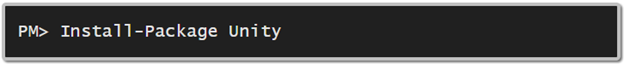
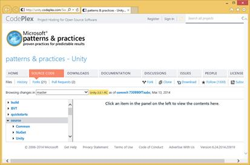

# 一、安装 Unity

## 简介

Unity 不要求在您的机器上安装任何软件；只需添加适当的程序集作为项目的引用，就完成了。这些组件可以通过以下两种方式之一获得:

*   [NuGet](http://www.nuget.org) 套装(首选)
*   安装包
*   克隆源代码库并自己构建它

在本书中，我们将使用 Unity 版本，这是本书编写时可用的最新版本。此版本需要。NET 4.5，这意味着我们将需要 Visual Studio 2012 或 2013(快速版就可以了)。

由于 Unity 是使用可移植类库(PCL)重写的，因此支持以下平台:

*   Windows 商店应用 8.0 和 8.1
*   Windows Phone Silverlight 8.0 和 8.1
*   。NET 4.5+
*   香豆素/猴子

## 无获取包

在 Visual Studio 中，在. NET 项目中，只需在**包管理器控制台**中发出以下命令:



图 1:将 Unity 作为 NuGet 包安装

Visual Studio 只会将 Unity 程序集添加到解决方案的启动项目中。如果需要，您可以通过选择**管理解决方案的 NuGet 包**将它们添加到任何其他项目中。

## 安装包

从微软[网站](http://www.microsoft.com/en-us/download/details.aspx?id=38788)获取 Unity 的安装程序，其中还包括其源代码和快速启动代码。

## 源代码

如果您更喜欢查看源代码，欢迎您克隆它的存储库。您可以使用 Git 实现这一点:

```cs
    git clone https://git01.codeplex.com/unity

```

在本地磁盘中有了源代码之后，就可以打开 Visual Studio 解决方案( **Unity.sln** )，编译所有内容，然后将生成的程序集作为引用添加到项目中。

如果愿意，可以在线浏览当前版本的源代码；只需将浏览器指向 [CodePlex](http://unity.codeplex.com/SourceControl/latest) ，微软的免费开源项目托管网站。



图 2:在线浏览 Unity 存储库