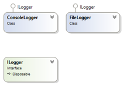
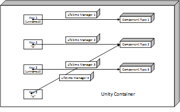
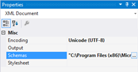
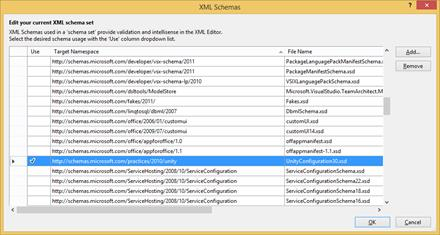
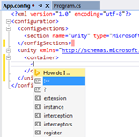
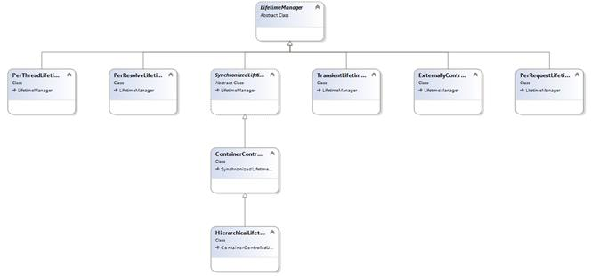

# 第二章控制权倒置

## 简介

控制反转(IoC)是一种软件设计模式，在这种模式下，开发人员没有明确指定将被实例化的具体类；相反，开发人员要求一个抽象基类或接口来定义他或她想要的功能。这通过允许在稍后阶段更改实际的具体类或基于某些标准动态选择来增加解耦。您并不依赖于某个特定的实现，而是依赖于您的系统来为您提供一个合适的实现(您拥有控制权，而不需要关心它是什么)。

所以，与其说:

```cs
    var logger = new ConsoleLogger();

```

您将拥有:

```cs
    var logger = unity.Resolve<ILogger>();

```

当然，你必须告诉 Unity 怎么做。接下来的几节将详细讨论这一点。

## 设置

首先:您需要在代码中有一个 Unity 容器的实例。将其保存在引导类的实例或静态字段中:

```cs
    internal static readonly IUnityContainer unity = new UnityContainer();

```

仅此而已。[UnityContainer](http://msdn.microsoft.com/en-us/library/microsoft.practices.unity.iunitycontainer.aspx)接口定义了 Unity 容器的契约，它本身是由 [UnityContainer](http://msdn.microsoft.com/en-us/library/microsoft.practices.unity.unitycontainer.aspx) 类实现的。请根据您的要求更改可见性，但尽量限制它。您很可能只需要 Unity 容器的一个实例。稍后，我们将看到一种以间接的、更解耦的方式访问 Unity 的模式(

|  | 提示:别忘了 Dispose 只针对部分终身经理人。 |

由于 IUnityContainer 实现了 IDisposable，因此始终在`using`块中创建子容器是一个很好的原则，这样它们就可以在不再需要时得到适当的处理。

子容器公开与父容器相同的接口，父容器有一个父属性，但不跟踪其子容器。

使用子容器的典型场景是在 web 应用程序请求中。我们将在稍后讨论 Unity 与 Introduction 的集成时看到这一点

微软堆栈中的许多技术都使用 IoC。事实上，每次推出新版本或新技术，它的数量似乎都在增长。通常可以插入选择的 IoC 容器；在我们的例子中，让我们看看如何使用 Unity。

ASP.NET 网络表单。

公共服务定位器)。

重要的是要记住，Unity 容器，根据它的配置(在生命周期管理器一节中有更多的介绍)，可能会自动处理注册的类型；要实现这一点，您必须显式处理它。在这种情况下，更合理的做法可能是:

```cs
    using (var unity = new UnityContainer())
    {
    //program goes here
    }

```

## 领域模型

在我们的对话中，我们将使用一个简单的类模型:



图 3:记录器类模型

这里我们有一个`ILogger`接口，它定义了我们的日志记录契约和两个具体的实现:`ConsoleLogger`，它记录到控制台(你知道吗？)和`FileLogger`，它记录到磁盘中的一个文件中。让我们忘记这些类的实际实现；其实并不重要。

## 通过代码注册

### 实例与类型

我们需要告诉 Unity 我们要注册哪些具体的类(**组件**)以及通过哪些接口或抽象基类可以访问它们(**键**)。请记住，IoC 的全部意义在于事先不知道要返回哪个具体类。概念是我们在一个具体的类的基本类型或实现接口下注册一个具体的类。这是一个要求；组件类必须可转换为它的键。如果你要注册一个`FileLogger`，你需要用它的一个基类(比如`Object`，其实没什么用)或者它实现的一个接口(这里是`ILogger`，这是我们想要的，但是也可以是[idispoable](http://msdn.microsoft.com/en-us/library/system.idisposable.aspx)，这是`ILogger`实现的)。

[InityContainer](http://msdn.microsoft.com/en-us/library/microsoft.practices.unity.iunitycontainer.aspx)接口公开了一些允许我们通过代码注册动态(非类型化)组件的方法，还有一些用于强类型组件的扩展方法，它们将前者包装在 [UnityContainerExtensions](http://msdn.microsoft.com/en-us/library/microsoft.practices.unity.unitycontainerextensions.aspx) 类中。泛型扩展方法允许编写编译时安全的代码，通常应该是首选的。最后，这一切归结为两种方法:

*   [RegisterInstance](http://msdn.microsoft.com/en-us/library/ee649971.aspx) :获取一个类的现有实例，并通过该类公开的基类或接口使其可用。
*   [RegisterType](http://msdn.microsoft.com/en-us/library/microsoft.practices.unity.iunitycontainer.registertype.aspx) :将某个基本类型(类或接口)与具体类型相关联。

其中一些方法有名字，但那些不只是取一个`null`名字的方法。可以多次注册一个类型，但使用不同的名称:

```cs
    unity.RegisterType<ILogger, ConsoleLogger>("Console");
    unity.RegisterType<ILogger, FileLogger>("File");
    unity.RegisterInstance<ILogger>(new ConsoleLogger());

```

我们这里有多个`ILogger`类型的强类型注册:

*   将类型`ILogger`映射为类型`ConsoleLogger`的，名称为**控制台**，
*   另一个将`ILogger`映射到`FileLogger`的，名称为**文件**(多么可预测)，
*   最后，`ILogger`到一个具体的`ConsoleLogger`实例的映射，没有名字。

我们还可以动态地做到这一点:

```cs
    unity.RegisterType(typeof(ILogger), typeof(ConsoleLogger), "Console");
    unity.RegisterType(typeof(ILogger), typeof(FileLogger), "File");
    unity.RegisterInstance(typeof(ILogger), new ConsoleLogger());

```

|  | 注意:记住注册是由一个基本类型(类或接口)和一个名称组成的。同名类型的每次后续注册(或缺少同名类型)都会覆盖上一次注册。 |
|  | 提示:默认情况下，只有带有公共、无参数构造函数的类型才能与`RegisterType`一起使用。稍后，我们将看到如何通过让 Unity 自动注入依赖项来绕过这个限制。 |

当然，也可以为不同的键多次注册相同的具体类型或实例。该类型只需要继承或实现它们:



图 4:在 Unity 中键入注册

为什么要使用[注册实例](http://msdn.microsoft.com/en-us/library/ee649971.aspx)而不是[注册类型](http://msdn.microsoft.com/en-us/library/microsoft.practices.unity.iunitycontainer.registertype.aspx)？好吧，假设你想存储一个你在别的地方获得的对象，也许对它应用了复杂的配置，或者你的类没有公开一个公共的、无参数的构造函数。在这些情况下，您将需要注册您拥有的实例，因为开箱即用，Unity 不知道如何构建它。

|  | 提示:`RegisterInstance`注册的对象为单例，`RegisterType`注册的对象每次被请求时默认创建。 |
|  | 注意:Unity 总是在`IUnityContainer`键下自动注册，没有名字。 |
|  | 注意:尽量将所有注册保存在同一个地方(bootstrap 方法)，因为这样更容易找到和更改。 |

### 通用类型

但是开放(泛型)类型呢？非常简单:

```cs
    public interface IGeneric<T>
    {
    T Member { get; set; }
    }

    public class Generic<T> : IGeneric<T>
    {
    public T Member { get; set; }
    }

    unity.RegisterType(typeof(IGeneric<>), typeof(Generic<>));

```

Unity 允许您解析开放类型，但是您必须显式指定它的泛型参数。

### 创造工厂

稍微高级一点的注册选项包括使用委托来构建类实例。我们将施工代表注册为:

```cs
    unity.RegisterType<ILogger>("Factory", new InjectionFactory(
        u => new ConsoleLogger() { File = "out.log" } //or use your factory method
    ));

```

[注入工厂](http://msdn.microsoft.com/en-us/library/microsoft.practices.unity.injectionfactory.aspx)是注入成员的一种，将在依赖注入一章中详细介绍。

### 基本类型

只是为了好玩，我们还可以注册基本类型——字符串、整数、布尔值等。—作为实例，但不作为类型:

```cs
    unity.RegisterInstance<string>("One", "1");
    unity.RegisterInstance<string>("Two", "2");
    unity.RegisterInstance<int>("One", 1);
    unity.RegisterInstance<int>("Two", 2);

```

我会让你来决定这是否有用。

## 通过 XML 配置注册

### XML 配置部分

我们刚刚看到了如何通过代码注册映射，但是根据您的应用程序类型，通过 **App.config** 或 **Web.config** 通过 XML 配置来注册映射当然是可能的，有时也是非常理想的。

|  | 注意:如果使用 Visual Studio 2012，可以从[微软企业库下载中心](http://www.microsoft.com/en-us/download/details.aspx?id=38789)下载企业库配置控制台。这有助于您通过用户界面配置应用程序配置文件中的所有企业库模块。 |

因此，让我们在配置文件中声明一个统一配置部分，并添加一个统一条目:

```cs
    <?xml version="1.0" encoding="utf-8"?>
    <configuration>
    <configSections>
       <section name="unity" type="Microsoft.Practices.Unity.Configuration.
    UnityConfigurationSection, Microsoft.Practices.Unity.Configuration"/>
    </configSections>
    <unity >
       <container>
           <register type="Succinctly.ILogger, Succinctly" mapTo="Succinctly.
    ConsoleLogger, Succinctly" name="Console"/>
           <register type="Succinctly.ILogger, Succinctly" mapTo="Succinctly.
    FileLogger, Succinctly" name="File"/>
       </container>
    </unity>
    </configuration>

```

简而言之，在 [unity](http://msdn.microsoft.com/en-us/library/ff660914.aspx#config_unity_section) 部分中，您添加了一个[容器](http://msdn.microsoft.com/en-us/library/ff660914.aspx#config_container)元素，并在其中添加了多个[注册](http://msdn.microsoft.com/en-us/library/ff660914.aspx#config_registerelement)声明。一个[注册](http://msdn.microsoft.com/en-us/library/ff660914.aspx#config_registerelement)部分需要以下属性:

*   `type`(必选):注册的键，可以是基本类型，也可以是接口。
*   `mapTo`(必选):构件(混凝土类)类型。
*   `name`(可选):给予注册的可选名称；默认为`null`。

|  | 提示:在您的 XML 配置中一定要使用完全程序集限定的类型名称，以便 Unity 可以找到这些类型。 |

这些声明与代码示例中的声明完全相同，但实例注册明显例外。没有简单的方法可以用 XML 注册一个实例，因为实例是内存中存在的东西。

### 通用类型

如果要在 XML 中注册泛型类型:

```cs
    <container>
    <register type="Succinctly.IGeneric`1, Succinctly" 
       mapTo="Succinctly.Generic`1, Succinctly" name="Console"/>
    </container>

```

这使用了与。NET 期望，所以请确保您正确使用它。

### 类型别名和程序集发现

您可以创建类型别名，这对于避免类型名称过长很有价值。事情是这样的:

```cs
    <unity>
    <alias type="Succinctly.IGeneric`1, Succinctly" alias="GenericInterface"/>
    <alias type="Succinctly.Generic`1, Succinctly" alias="GenericImplementation"/>
    </unity>

```

如果希望避免指定程序集限定的类型名称，可以将程序集名称添加到 Unity 用于类型发现的列表中:

```cs
    <unity>
    <assembly name="Succinctly"/>
    </unity>

```

名称空间也是如此:

```cs
    <unity>
    <namespace name="Succinctly"/>
    </unity>

```

使用别名简化了配置:

```cs
    <unity>
    <register type="GenericInterface" mapTo="GenericImplementation" name="Console"/>
    </unity>

```

### 智能感知

为了让您的生活更轻松，您可以将智能感知添加到 XML 配置中。在 Visual Studio 中，打开您的配置文件，然后单击属性窗口中**模式**旁边的省略号(…):



图 5: XML 模式配置

将会出现模式配置对话框提示您。点击**添加**，导航至解决方案文件夹下的**包\Unity.3.5.1404.0** 文件夹，选择 **UnityConfiguration30.xsd** :



图 6: XML 模式

该文件包含统一配置元素的 [XML 模式定义(XSD)](http://en.wikipedia.org/wiki/XML_Schema_%28W3C%29) 。完成此步骤后，您现在在配置文件的 Unity 部分中拥有了 IntelliSense:



图 7: XML 智能感知

### 加载 XML 配置

在使用 XML 配置之前，您需要从 [UnityContainerExtensions](http://msdn.microsoft.com/en-us/library/microsoft.practices.unity.configuration.unitycontainerextensions.aspx) 调用 [LoadConfiguration](http://msdn.microsoft.com/en-us/library/microsoft.practices.unity.configuration.unitycontainerextensions.loadconfiguration.aspx) 扩展方法:

```cs
    unity.LoadConfiguration();

```

|  | 提示:别忘了调用`LoadConfiguration()`否则你的 XML 注册就找不到了。 |

## 按惯例登记

虽然前面的技术给了我们很大的力量，但它们确实迫使我们手动注册所有条目，这可能是一项很大的工作。幸运的是，Unity 能够通过应用约定自动注册类型。这种能力是以类[中扩展方法的形式出现的。这里有一个调用](http://msdn.microsoft.com/en-us/library/microsoft.practices.unity.unitycontainerregistrationbyconventionextensions.aspx)[注册类型](http://msdn.microsoft.com/en-us/library/dn169675.aspx)方法的例子:

```cs
    unity.RegisterTypes
    (
    AllClasses.FromLoadedAssemblies()
        .Where(x => (x.IsPublic) && (x.GetInterfaces().Any()) && (!x.IsAbstract) 
        && (x.IsClass)),
    WithMappings.FromAllInterfacesInSameAssembly, 
    type => (unity.Registrations
        .Select(x => x.RegisteredType)
        .Any(r => type.GetInterfaces()
        .Contains(r))) ? WithName.TypeName(type) : WithName.Default(type)
    );

```

这需要解释一下:

*   [RegisterTypes](http://msdn.microsoft.com/en-us/library/dn169675.aspx) 的第一个参数是要注册的类型列表。在这种情况下，我们从当前加载的程序集中传递一个公共的、非接口的、非抽象类的列表([all class)。FromLoadedAssemblies](http://msdn.microsoft.com/en-us/library/microsoft.practices.unity.allclasses.fromloadedassemblies.aspx) )实现至少一个接口。类也可以从程序集列表中获得([all class)。来自程序集](http://msdn.microsoft.com/en-us/library/dn169647.aspx)或来自文件系统([所有类)。FromAssembliesInBasePath】)。](http://msdn.microsoft.com/en-us/library/microsoft.practices.unity.allclasses.fromassembliesinbasepath.aspx)
*   第二个参数是一个委托，它为每个注册的类型返回其映射键。在这种情况下，类公开的所有接口都在与类( [WithMappings)相同的程序集中声明。from all interface sinsame assembly](http://msdn.microsoft.com/en-us/library/microsoft.practices.unity.withmappings.fromallinterfacesinsameassembly.aspx))。另一种可能是该类型的所有接口([带映射)。from all interface](http://msdn.microsoft.com/en-us/library/microsoft.practices.unity.withmappings.fromallinterfaces.aspx))或与类型名称匹配的类型的单个接口([带映射。FromMatchingInterface](http://msdn.microsoft.com/en-us/library/microsoft.practices.unity.withmappings.frommatchinginterface.aspx) )。
*   第三个参数是如何命名注册。这里我们做了一些聪明的事情:如果已经注册了同一个密钥，那么使用完整的注册类名作为名称( [WithName)。类型名称](http://msdn.microsoft.com/en-us/library/microsoft.practices.unity.withname.typename.aspx))；否则，使用`null` ( [带名称。默认](http://msdn.microsoft.com/en-us/library/microsoft.practices.unity.withname.default.aspx))。本示例首先为找到的第一个接口和类创建一个默认的、未命名的注册，然后用它们的全名注册所有其他类。
*   可选的第四个参数(如果存在)必须包含一个委托，该委托为每个创建的实例确定生存期管理器。常用值为[带 Lifetime。ContainerControlled](http://msdn.microsoft.com/en-us/library/microsoft.practices.unity.withlifetime.containercontrolled.aspx) 适用于单身人士，[使用寿命。瞬态](http://msdn.microsoft.com/en-us/library/microsoft.practices.unity.withlifetime.transient.aspx)用于始终创建新实例，而[用于终生。用于为每个线程创建一个实例的 PerThread](http://msdn.microsoft.com/en-us/library/microsoft.practices.unity.withlifetime.perthread.aspx) 。更多关于这一点的信息，以及“终身管理器”一节中的选项的完整列表。

## 组件分辨率

### 解析实例

注册完成后，我们可以请求一个组件的实例(解析)。在 Unity 中，这是通过[解析](http://msdn.microsoft.com/en-us/library/microsoft.practices.unity.iunitycontainer.resolve.aspx)方法或 [UnityContainerExtensions](http://msdn.microsoft.com/en-us/library/microsoft.practices.enterpriselibrary.common.configuration.unity.unitycontainerextensions.aspx) 中的类似扩展方法之一来实现的。强类型(扩展)版本的一些示例如下:

```cs
    var logger1 = unity.Resolve<ILogger>(); //ConsoleLogger
    var logger2 = unity.Resolve<ILogger>("File"); //FileLogger
    var logger3 = unity.Resolve<ILogger>("Console"); //ConsoleLogger

```

以及一些动态的(非强类型的)例子:

```cs
    var logger1 = unity.Resolve(typeof(ILogger)) as ILogger; //a ConsoleLogger
    var logger2 = unity.Resolve(typeof(ILogger), "File") as ILogger;
    var logger3 = unity.Resolve(typeof(ILogger), "Console") as ILogger;

```

|  | 提示:如果您试图获取的注册不存在，Unity 将抛出一个异常。 |

### 解析多个实例

如果同一类型有多个命名注册，我们可以一次检索所有注册:

```cs
    var loggers1 = unity.ResolveAll<ILogger>(); //ConsoleLogger and FileLogger
    var loggers2 = unity.ResolveAll(typeof(ILogger)) as IEnumerable<ILogger>;

```

|  | 提示:`ResolveAll`只返回已命名的注册。 |

|  | 注意:无论注册方法如何，Unity 都会解析类型。 |

通过[注册实例](http://msdn.microsoft.com/en-us/library/ee649971.aspx)注册的同一个未命名的`ILogger`实例，将始终在调用 [Resolve](http://msdn.microsoft.com/en-us/library/microsoft.practices.unity.iunitycontainer.resolve.aspx) 时被检索到，但没有名称。这是因为我们注册了一个实例，而不是一个类型。对于使用 [RegisterType](http://msdn.microsoft.com/en-us/library/microsoft.practices.unity.iunitycontainer.registertype.aspx) 注册的条目，每次都会实例化并返回具体类的新实例。我们将在下一节“生命周期管理器”中进一步讨论这种行为。

### 通过覆盖进行解析

可能会出现这样的情况:您想要解析的组件的参数(构造函数或方法参数、属性值)与注册该组件的参数不同。我不是说你应该这样做，因为这需要知道组件是如何注册的，这在某种程度上违背了 IoC 的宗旨。但是，无论如何，统一允许你这样做。

[解析](http://msdn.microsoft.com/en-us/library/microsoft.practices.unity.iunitycontainer.resolve.aspx)方法采用一个可选的[注入成员](http://msdn.microsoft.com/en-us/library/microsoft.practices.unity.injectionmember.aspx)实例数组。其中两个([参数覆盖](http://msdn.microsoft.com/en-us/library/microsoft.practices.unity.parameteroverride.aspx)和[属性覆盖](http://msdn.microsoft.com/en-us/library/microsoft.practices.unity.propertyoverride.aspx))可用于为注册时配置的构造函数或方法参数或属性指定替代值。例如，如果您配置了一个[注入属性](http://msdn.microsoft.com/en-us/library/microsoft.practices.unity.injectionproperty.aspx)(请参见属性注入了解相关说明)来为某些属性提供一些值，现在您可以将其更改为不同的值。这需要知道组件是如何注册的，因为您只能为那些已配置的成员提供替代值。

下面是一个例子，它有一个被覆盖的属性值:

```cs
    public class FileLogger : ILogger
    {
    public string Filename { get; set; }
    }
    //registration with injected property
    unity.RegisterType<ILogger, FileLogger>(new InjectionProperty("Filename", "log.txt"));
    //resolution with overridden property
    unity.Resolve<ILogger>(new PropertyOverride("Filename", "output.log"));

```

另一个用于构造函数参数重写:

```cs
    public class FileLogger : ILogger
    {
    public FileLogger(string filename)
    {
       this.Filename = filename;
    }

    public string Filename { get; set; }
    }
    //registration with injected constructor
    unity.RegisterType<ILogger, FileLogger>(new InjectionConstructor("log.txt"));
    //resolution with overridden constructor parameter
    unity.Resolve<ILogger>(new ParameterOverride("output.log"));

```

默认情况下，覆盖的成员应用于整个解析层次结构。例如，您请求的类可能已经注入了其他类的属性，并且这些类中的一些也可能具有兼容的注入成员。但是您也可以通过 [OnType](http://msdn.microsoft.com/en-us/library/ff662169.aspx) 和 [OnType < T >](http://msdn.microsoft.com/en-us/library/ff661309.aspx) 使重写仅发生在特定类型中，而不是具有兼容成员的所有类型中:

```cs
    //resolution with overridden property but only on instances of FileLogger
    unity.Resolve<ILogger>(new PropertyOverride("Filename", "output.log") .OnType<FileLogger>()); //OnType(typeof(FileLogger))

```

要记住三件事:

*   如果使用保留现有实例的生存期管理器，构造函数重写将不起作用，因为对象已经实例化。
*   重写仅对注册时配置的成员有效。
*   尝试通过指定 [OnType](http://msdn.microsoft.com/en-us/library/ff662169.aspx) 或 [OnType < T >](http://msdn.microsoft.com/en-us/library/ff661309.aspx) 来定义成员覆盖的目标。

|  | 注意:尽量避免使用分辨率覆盖，因为这不是一个好主意。 |

### 延期决议

现在，可能会发生这样的情况，我们希望手头有一个组件的引用，但可能不需要立即使用它(如果有的话)。如果是这样的话，我们可以通过 [lazy < T >](http://msdn.microsoft.com/en-us/library/dd642331.aspx) 或 [Func < T >](http://msdn.microsoft.com/en-us/library/bb534960.aspx) 的形式获取 Lazy 加载引用。这被称为延迟解决:

```cs
    var lazyLogger = unity.Resolve<Lazy<ILogger>>();
    var loggerDelegate = unity.Resolve<Func<ILogger>>();

```

实际组件只有在我们访问其值时才会被实例化:

```cs
    var logger1 = lazyLogger.Value; //lazyLogger.IsValueCreated = true
    var logger2 = loggerDelegate();

```

|  | 提示:你不需要用`Lazy<T>`或`Func<T>`注册类型，Unity 为你做。 |

### 测试注册是否存在

如果您想测试给定的注册是否存在，您有两个选择。您可以查看[注册](http://msdn.microsoft.com/en-us/library/microsoft.practices.unity.unitycontainer.registrations.aspx)属性，或者使用 [UnityContainerExtensions](http://msdn.microsoft.com/en-us/library/microsoft.practices.unity.unitycontainerextensions.aspx) 中的[注册](http://msdn.microsoft.com/en-us/library/ff661003.aspx)扩展方法之一。这两种方法都在内部查看[注册](http://msdn.microsoft.com/en-us/library/microsoft.practices.unity.unitycontainer.registrations.aspx)集合。我们也可以显式地这样做，就像在这个例子中，我们检索所有注册的`ILogger`具体类型及其注册名称:

```cs
    var loggerTypes = unity
        .Registrations
        .Where(x => x.RegisteredType == typeof(ILogger))
        .ToDictionary(x => x.Name ?? String.Empty, x => x.MappedToType);

```

因为如果找不到注册，解析方法会引发异常，所以使用像这样的帮助器方法有时会很有用:

```cs
    public static T TryResolve<T>(this IUnityContainer unity, String name = null)
    {
    return ((T) (TryResolve(unity, typeof(T), name) ?? default(T)));
    }

    public static Object TryResolve(this IUnityContainer unity, Type type, 
    String name = null)
    {
    try
    {
       return (unity.Resolve(type, name));
    }
    catch
    {
       return (null);
    }
    }

```

## 终身经理

我们已经看到[注册实例](http://msdn.microsoft.com/en-us/library/ee649971.aspx)和[注册类型](http://msdn.microsoft.com/en-us/library/microsoft.practices.unity.iunitycontainer.registertype.aspx)的行为不同。默认情况下， [RegisterInstance](http://msdn.microsoft.com/en-us/library/ee649971.aspx) 总是导致在对 [Resolve](http://msdn.microsoft.com/en-us/library/microsoft.practices.unity.iunitycontainer.resolve.aspx) 的所有后续调用中返回相同的已注册实例，而 [RegisterType](http://msdn.microsoft.com/en-us/library/microsoft.practices.unity.iunitycontainer.registertype.aspx) 则正好相反，因为总是返回新实例。这种行为来自每个方法使用的默认生存期管理器。如果您查看每一个`Register*`方法的文档，您会看到它们采用了一个可选的 [LifetimeManager](http://msdn.microsoft.com/en-us/library/microsoft.practices.unity.lifetimemanager.aspx) 实例，这是所有生存期管理器的基类。

生存期管理器处理如何创建注册类型的实例，并且所有注册都有一个关联的生存期管理器或`null`。每次调用`Resolve`方法时，`null`生存期管理器总是会创建一个新实例。Unity 包括许多生存期管理器，如下表所述:

表 1:终身经理

| 终身经理 | 别名(可扩展标记语言/常规配置) | 目的 |
| [容器控制生命周期管理器](http://msdn.microsoft.com/en-us/library/microsoft.practices.unity.containercontrolledlifetimeManager.aspx) | `singleton` / [WithLifetime。集装箱控制](http://msdn.microsoft.com/en-us/library/microsoft.practices.unity.withlifetime.containercontrolled.aspx) | Unity 创建该类型的单个实例(单例)，并总是返回它。容器处置时，如果注册类型实现 [IDisposable](http://msdn.microsoft.com/en-us/library/system.idisposable.aspx) ，Unity 也会处置。 |
| [外部控制的时间管理器](http://msdn.microsoft.com/en-us/library/microsoft.practices.unity.ExternallyControlledLifetimeManager.aspx) | `external` / [WithLifetime。外部控制](http://msdn.microsoft.com/en-us/library/microsoft.practices.unity.withlifetime.externallycontrolled.aspx) | 注册在其他地方创建的实例(不是由 Unity 创建的)。不处置已注册的实例。[带 Lifetime。外部控制](http://msdn.microsoft.com/en-us/library/microsoft.practices.unity.withlifetime.externallycontrolled.aspx)，常规配置。 |
| [分层资产管理器](http://msdn.microsoft.com/en-us/library/microsoft.practices.unity.hierarchicallifetimemanager.aspx) | `hierarchical` / [带 Lifetime。等级制度](http://msdn.microsoft.com/en-us/library/microsoft.practices.unity.withlifetime.hierarchical.aspx) | 与[容器控件属性管理器](http://msdn.microsoft.com/en-us/library/microsoft.practices.unity.containercontrolledlifetimeManager.aspx)相同，但是在子容器中，每个容器都有自己的实例。释放容器时，释放已创建的实例。 |
| [由 RequestLifetimeManager](http://msdn.microsoft.com/en-us/library/microsoft.practices.unity.perrequestlifetimemanager.aspx) | 不适用的 | 在 web 应用程序中，Unity 会在 [HttpContext 中查找该类型的实例。项目](http://msdn.microsoft.com/en-us/library/system.web.httpcontext.items.aspx)集合，如果没有找到，创建一个新的实例并存储在那里。仅当模块[unityperequesthttpmodule](http://msdn.microsoft.com/en-us/library/microsoft.practices.unity.mvc.unityperrequesthttpmodule.aspx)已启用时，才处置创建的实例(在简介中讨论微软堆栈中的许多技术都使用 IoC。事实上，每次推出新版本或新技术，它的数量似乎都在增长。通常可以插入选择的 IoC 容器；在我们的例子中，让我们看看如何使用 Unity。ASP.NET 网络表单)。需要 NuGet 包 [Unity。Mvc](http://sharepoint2.syncfusion.com/rdu/ContentDocumentation/DepartmentResources/ContractorHub/Lists/Contractor%20Editing%20Assignments/Attachments/50/nuget.org/packages/Unity.Mvc) 。 |
| [由经销商终身经理](http://msdn.microsoft.com/en-us/library/microsoft.practices.unity.perresolvelifetimeManager.aspx) | `perresolve` / [带 Lifetime。PerResolve](http://msdn.microsoft.com/en-us/library/microsoft.practices.unity.withlifetime.perresolve.aspx) | 在解析操作期间，如果一个类型的实例需要多次，则仅创建一个实例，并在整个操作中重用它。在不同的解析中，总是创建新的实例。释放容器时，释放已创建的实例。 |
| [PerThreadLifetimeManager](http://msdn.microsoft.com/en-us/library/microsoft.practices.unity.perthreadlifetimeManager.aspx) | `perthread` / [寿终正寝。pert hread〔T2〕](http://msdn.microsoft.com/en-us/library/microsoft.practices.unity.withlifetime.perthread.aspx) | 为每个线程创建一个新实例，并始终将该实例返回给同一个线程。释放容器时，释放已创建的实例。 |
| [瞬时寿命管理器](http://msdn.microsoft.com/en-us/library/microsoft.practices.unity.transientlifetimeManager.aspx) | `transient` / [带 Lifetime。瞬态](http://msdn.microsoft.com/en-us/library/microsoft.practices.unity.withlifetime.transient.aspx) | 总是创建并返回注册类型的新实例。释放容器时，释放已创建的实例。等同于通过`null`。默认为[注册类型](http://msdn.microsoft.com/en-us/library/microsoft.practices.unity.iunitycontainer.registertype.aspx)。 |



图 8:生存期管理器类层次结构

|  | 注意:Singleton 和 transient 是类型别名。请参见类型别名。 |

所以，我们有三种终生管理者:

*   首先，一个从不创建实例的:外部控制的时间管理器和[分层时间管理器](http://msdn.microsoft.com/en-us/library/microsoft.practices.unity.hierarchicallifetimemanager.aspx)。
*   第二，可以为其上下文创建实例，也可以不创建实例(取决于是否已经存在实例):[container controlled lifetime manager](http://msdn.microsoft.com/en-us/library/microsoft.practices.unity.containercontrolledlifetimeManager.aspx)、[perrequestlifetime manager](http://msdn.microsoft.com/en-us/library/microsoft.practices.unity.perrequestlifetimemanager.aspx)、[perresolvelifetime manager](http://msdn.microsoft.com/en-us/library/microsoft.practices.unity.perresolvelifetimeManager.aspx)和 [PerThreadLifetimeManager](http://msdn.microsoft.com/en-us/library/microsoft.practices.unity.perthreadlifetimeManager.aspx) 。
*   第三，总是创建新实例的:TransientLifetimeManager 。

|  | 提示:唯一可以传递给`RegisterInstance`的有意义的终身经理是`ContainerControlledLifetimeManager`(默认)或`ExternallyControlledLifetimeManager`。两者的区别在于，后者在容器被处置时不会处置已注册的实例。 |
|  | 提示:要使用 PerRequestLifetimeManager，您需要添加对 [Unity 的引用。Mvc](http://www.nuget.org/packages/Unity.Mvc) NuGet 包。 |

还记得 **Singleton** 的设计模式吗？好吧，在 IoC 容器时代，你不妨认为这是一种反模式。每当你想要一个单独的实例时，你不再需要用一种有趣的方式来实现你的类，你也不需要注意开发人员可以用来愚弄你的代码的所有可能的替代方法。只需配置一个组件，让它有一个单独的生命周期，然后向 Unity 请求它。就这样。如果您想在以后更改这种行为，只需对其进行配置即可。

在代码配置中，为每个调用线程注册不同类型的实例的一个例子是:

```cs
    unity.RegisterType<ILogger, ConsoleLogger>(new PerThreadLifetimeManager());

```

在 XML 配置中，请注意我们如何使用生存期管理器的别名或它的完整类名:

```cs
    <?xml version="1.0" encoding="utf-8"?>
    <configuration>
    <configSections>
       <section name="unity" type="Microsoft.Practices.Unity.Configuration.
    UnityConfigurationSection, Microsoft.Practices.Unity.Configuration"/>
    </configSections>
    <unity >
       <container>
           <register type="Succinctly.ILogger, Succinctly" mapTo="Succinctly.
    ConsoleLogger, Succinctly" name="Console">
               <lifetime 
    type="Microsoft.Practices.Unity.ContainerControlledLifetimeManager, Microsoft.Practices.Unity"/>
           </register>
           <register type="Succinctly.ILogger, Succinctly" mapTo="Succinctly.
    FileLogger, Succinctly" name="File">
               <lifetime type="transient"/>
            </register>
       </container>
    </unity>
    </configuration>

```

|  | 提示:如果不使用别名，请确保使用生存期管理器类的程序集限定名。 |

最后，在常规配置中，我们还可以为每个注册指定生存期管理器。为此，我们需要将一个委托作为第四个参数传递给[注册类型](http://msdn.microsoft.com/en-us/library/dn169675.aspx)。这个委托接收一个类型作为它唯一的参数，并返回一个[生命时间管理器](http://msdn.microsoft.com/en-us/library/microsoft.practices.unity.lifetimemanager.aspx)实例。类 [WithLifetime](http://msdn.microsoft.com/en-us/library/microsoft.practices.unity.withlifetime.aspx) 为最常见的寿命管理器提供了一些预定义的方法，还有 [Custom < T >](http://msdn.microsoft.com/en-us/library/dn169703.aspx) ，可以用来返回一个自定义的方法(`PooledLifetimeManager`在扩展 Unity 一章中定义):

```cs
    unity.RegisterTypes
    (
    AllClasses.FromLoadedAssemblies()
        .Where(x => (x.IsPublic == true) && (x.GetInterfaces().Any() == true) 
        && (x.IsAbstract == false) && (x.IsClass == true)),
    WithMappings.FromAllInterfacesInSameAssembly, 
    type => (unity.Registrations.Select(x => x.RegisteredType)
        .Any(r => type.GetInterfaces().Contains(r) == true) == true) ? 
    WithName.TypeName(type) : WithName.Default(type),
    WithLifetime.Custom<PooledLifetimeManager>()
    );

```

|  | 提示:生存期管理器实例不能被不同的注册共享，如果您尝试的话，`Register*`方法会抛出一个异常。 |

## 子容器

创建子容器有助于在比 Unity 容器更大的范围内管理实例。子容器具有这三个特征:

*   父容器中的所有注册都可以在子容器中访问。
*   源自子容器的注册在其父容器中不可访问。
*   由子容器创建的一次性实例在子容器本身被处置时被处置。

我们通过调用 [CreateChildContainer](http://msdn.microsoft.com/en-us/library/microsoft.practices.unity.unitycontainer.createchildcontainer.aspx) 来创建一个子容器:

```cs
    using (var child = unity.CreateChildContainer())
    {
    child.RegisterType<ILogger, ConsoleLogger>("DisposableChild", 
       new ContainerControlledLifetimeManager());
    var logger = child.Resolve<ILogger>("DisposableChild");
    } //logger.Dispose is called

```

|  | 提示:别忘了`Dispose`只是给一些终身经理人打的电话。 |

由于 [IUnityContainer](http://msdn.microsoft.com/en-us/library/microsoft.practices.unity.iunitycontainer.aspx) 实现了 [IDisposable](http://msdn.microsoft.com/en-us/library/System.IDisposable.aspx) ，因此始终在`using`块中创建子容器是一个很好的原则，这样它们就可以在不再需要时得到适当的处理。

子容器公开了与父容器相同的接口——父容器[具有](http://msdn.microsoft.com/en-us/library/microsoft.practices.unity.iunitycontainer.aspx)[父容器](http://msdn.microsoft.com/en-us/library/microsoft.practices.unity.iunitycontainer.parent.aspx)属性，但不跟踪其子容器。

使用子容器的典型场景是在 web 应用程序请求中。我们将在稍后讨论 Unity 与 Introduction 的集成时看到这一点

微软堆栈中的许多技术都使用 IoC。事实上，每次推出新版本或新技术，它的数量似乎都在增长。通常可以插入选择的 IoC 容器；在我们的例子中，让我们看看如何使用 Unity。

ASP.NET 网络表单。

## 通用服务定位器

中存在许多 IoC 容器。NET 世界包括 [Unity](http://unity.codeplex.com/) 、 [Autofac](https://github.com/autofac/Autofac) 、[nineject](http://www.ninject.org/)、[Spring.NET](http://springframework.net/)、 [StructureMap](http://docs.structuremap.net/) 和[温莎城堡](http://docs.castleproject.org/Windsor.MainPage.ashx)。虽然每一个都有特定的功能，但是在解析注册的组件时，它们都有一个类似的接口，由两个基本操作组成:

*   “给我一个由关键 ABC 识别的 XYZ 类型的实例”。
*   “给我 XYZ 类型的所有实例”。

考虑到这一点，开发社区和微软一起定义并实现了一个所有 IoC 容器都可以遵守的公共接口，称为公共服务定位器。

公共服务定位器是由微软维护的**服务定位器**模式的一个实现，并且在 CodePlex 这里托管[。如果您将 Unity 添加为一个 NuGet 包，您可能会注意到公共服务定位器包也随之而来。](http://commonservicelocator.codeplex.com/)

它作为一个中央存储库，抽象出您想要使用的任何 IoC 容器。使用公共服务定位器，您不必将 Unity 公开为共享字段。

公共服务定位器开发人员已经为一些最流行的 IoC 容器实现了适配器，所有这些都可以在公共服务定位器站点上获得。其他供应商已经为他们自己的产品实现了适配器。在 Unity 的情况下，设置它只需要:

```cs
    ServiceLocator.SetLocatorProvider(() => new UnityServiceLocator(unity));

```

之后，您可以引用公共服务定位器，而不是直接引用 Unity。

所以，你在哪里:

```cs
    var logger = unity.Resolve<ILogger>();

```

您现在可以拥有:

```cs
    var logger = ServiceLocator.Current.GetInstance<ILogger>();

```

就这样。这样，您甚至可以用另一个 IoC 容器替换 Unity，您的代码甚至不会注意到它。

为了记录，公共服务定位器暴露的接口是 [IServiceLocator](http://msdn.microsoft.com/en-us/library/microsoft.practices.servicelocation.iservicelocator.aspx) :

```cs
    public interface IServiceLocator : IServiceProvider
    {
    IEnumerable<TService> GetAllInstances<TService>();
    IEnumerable<object> GetAllInstances(Type serviceType);
    TService GetInstance<TService>();
    TService GetInstance<TService>(string key);
    object GetInstance(Type serviceType);
    object GetInstance(Type serviceType, string key);
    }

```

如您所见，只支持组件解析方法，不支持注册。有强类型泛型方法以及返回普通对象的动态方法。对这些方法的调用将指向正确的实现；在我们的例子中，是 Unity 容器实例。所以任何适用于 Unity 的东西也适用于公共服务定位器，比如在没有找到注册的情况下抛出异常。

|  | 注意:如果你想从公共服务定位器回到统一，你只需要检索未命名的`IUnityContainer`实例。 |

最后一个注意事项: [IServiceLocator](http://msdn.microsoft.com/en-us/library/microsoft.practices.servicelocation.iservicelocator.aspx) 继承自 [IServiceProvider](http://msdn.microsoft.com/en-us/library/system.iserviceprovider.aspx) ，一个从早期就开始使用的接口。NET 提供一种穷人的 IoC。它仍然被 Visual Studio 设计器和一些 API 使用，例如[运行时缓存](http://msdn.microsoft.com/en-us/library/system.runtime.caching.objectcache.host.aspx)和 [WCF 数据服务](http://msdn.microsoft.com/en-us/data/gg191846.aspx)。

|  | 注意:有些人认为服务定位器模式实际上是一件坏事。我理解这些论点，但不太同意。关于这方面的深入报道，请阅读马克·塞曼的博文[“服务定位器是一种反模式”](http://blog.ploeh.dk/2010/02/03/ServiceLocatorisanAnti-Pattern/)。 |