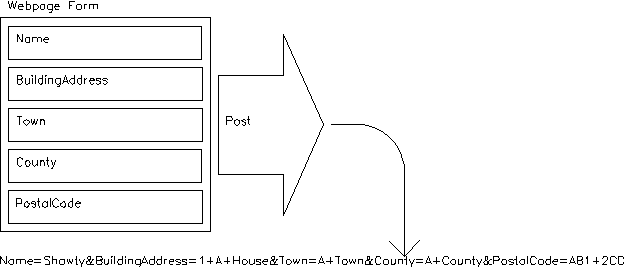
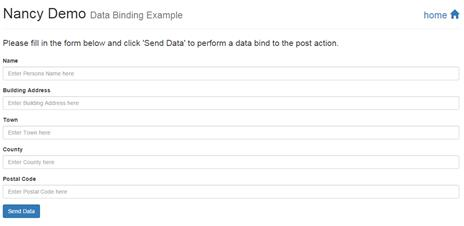
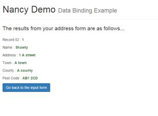
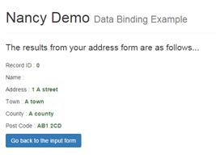
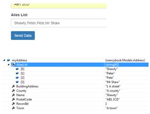
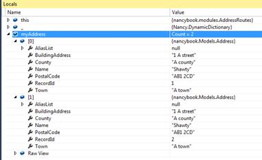
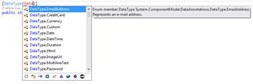
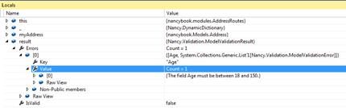

# 七、模型绑定和验证

有了任何好的框架，您都需要能够将数据传递回它。回到路由一章，我们看到了使用 Nancy 中提供的 URL 参数路由将简单的值传递到路由中是多么容易。

能够像这样传递简单的值是很好的，尤其是如果您所做的只是构建一个查找和返回数据库条目的 API。然而，在许多情况下，您会希望将复杂的数据对象提供回您的路线。

这可能是像管理面板的管理部分的一组登录凭证一样简单的事情，或者它可能是一个代表数据库表中几个条目的大型扁平记录。无论哪种方式，您都需要能够传入的不仅仅是简单的值，并且没有比普通硬盘的深度嵌套文件夹路径更长的 URL。

这就是 Nancy 的模型绑定特性发挥作用的地方。

如果你曾经使用过 ASP.NET MVC，那么你就已经知道模型绑定是关于什么的了:它是查看传入的请求和它可能有的任何负载，然后尝试将它与你正在寻找的对象变量相匹配的过程。

## 一幅画胜过千言万语

为了简单起见，假设我们有一个地址簿，作为这个地址簿的一部分，我们希望将一个条目保存到我们的地址数据库中。我们可能要做的第一件事是构建一个对象/类，表示我们希望数据库中的地址是什么样子。可能是这样的:

代码清单 28

```cs
          namespace nancybook.Models
          {
            public class Address
            {
              public int RecordId { get; set; }
              public string Name { get; set; }
              public string BuildingAddress { get; set; }
              public string Town { get; set; }
              public string County { get; set; }
              public string PostalCode { get; set; }
            }
          }

```

查看这个类，您可以立即假设在填充它时，我们将使用一个整数来标识该记录，并且每个记录将包括组成地址的五条信息。

当这些数据从网页或 AJAX 操作中的表单发布时，您可能会有一个包含这五条信息的标准表单发布，或者一个从 JavaScript 发送到 Nancy 路由的 JSON 对象:



图 13:显示发布的帖子变量的图表

从图 13 中可以看到，当您使用 web 表单发布一个复杂的对象时，输入表单中每个元素的名称都与输入到这些文本字段中的任何值连接在一起。然后，这个大字符串作为请求正文中的单个字符串发布到您的 Nancy 端点。这也适用于发送 JSON 和 XML 的请求，除了数据是一个单一的、串联的 JSON 或 XML 格式的字符串。

模型绑定器的工作是将这个字符串拆开，并将每个输入字段与对象中的属性名称进行匹配。

如果只有一些字段存在，那么只有那些字段将被匹配，而其他字段将保持其默认值。如果没有字段可以与属性匹配，那么当接收到请求时，结果就是一个在 Nancy 路由处理程序中具有所有默认值的对象。

## 一个简单的例子

在视图中创建一个名为**地址**的文件夹，并在这个新文件夹中添加一个名为**index.html**的初始 HTML 页面，包含以下 HTML 代码:

```cs
          <!DOCTYPE html>
          <html lang="en">
            <head>
              <meta charset="utf-8">
              <meta http-equiv="X-UA-Compatible" content="IE=edge">
              <meta name="viewport" content="width=device-width, initial-scale=1">
              <title>Nancy Demo | Data Binding Example</title>
              <link href="~/content/bootstrap.min.css" rel="stylesheet" type="text/css" />
            </head>

            <body>

              <div class="container">
                <div class="page-header">
                  <h1 style="display: inline-block">Nancy Demo <small>Data Binding Example</small></h1>
                  <h1 style="display: inline-block" class="pull-right"><small><a href="~/" title="Click to return to demo home page">home <span class="glyphicon glyphicon-home"></span></a></small></h1>
                </div>

                <p class="lead">Please fill in the form below and click 'Send Data' to perform a data bind to the post action.</p>

                  <input id="RecordId" name="RecordId" type="hidden" value="1"/>

                  <div class="form-group">
                    <label for="Name">Name</label>
                    <input type="text" class="form-control" id="Name" name="Name" placeholder="Enter Persons Name here"/>
                  </div>

                  <div class="form-group">
                    <label for="BuildingAddress">Building Address</label>
                    <input type="text" class="form-control" id="BuildingAddress" name="BuildingAddress" placeholder="Enter Building Address here" />
                  </div>

                  <div class="form-group">
                    <label for="Town">Town</label>
                    <input type="text" class="form-control" id="Town" name="Town" placeholder="Enter Town here" />
                  </div>

                  <div class="form-group">
                    <label for="County">County</label>
                    <input type="text" class="form-control" id="County" name="County" placeholder="Enter County here" />
                  </div>

                  <div class="form-group">
                    <label for="PostalCode">Postal Code</label>
                    <input type="text" class="form-control" id="PostalCode" name="PostalCode" placeholder="Enter Postal Code here" />
                  </div>

                  <button type="submit" class="btn btn-primary">Send Data</button>
                </form>

              </div>

              <script src="~/scripts/jquery-2.1.3.min.js"></script>
              <script src="~/scripts/bootstrap.min.js"></script>

            </body>

          </html>

```

在模块文件夹中添加一个名为`AddressRoutes.cs`的新类，其中包含以下 C#代码:

代码清单 29

```cs
          using Nancy;

          namespace nancybook.modules
          {
            public class AddressRoutes : NancyModule
            {
              public AddressRoutes() : base("/address")
              {
                Get[@"/"] = _ => View["address/index"];
              }
            }
          }

```

编译并运行您的项目，然后在浏览器中请求**/地址**。您应该会看到以下内容:



图 14:由返回我们的测试地址表单的 HTML 代码和路由生成的表单

|  | 注意:我使用的是一个 ASP.NET 的网络应用，项目中安装了 Bootstrap、jQuery 和 Font Awesome，所以如果你的表单看起来和我的不完全一样，不用担心。重要的是，这是一个表单，它被设置为发布到 Nancy 路线行动；它看起来如何与它如何工作没有关系。 |

现在我们有了一种添加数据的方法；这只是绑定到该请求的一个简单问题。在 Nancy 中，目前有三种不同的方式绑定到您的模型，您选择哪种完全取决于您。您可以直接使用类型绑定:

`Address myAddress = this.Bind();`

或者您可以使用基于`var`的绑定，将模型类型作为泛型参数传入:

`var myAddress = this.Bind<Address>();`

最后，如果您已经分配了一个现有的 TModel 实例，您可以使用`BindTo`来附加它:

`var myAddress = this.BindTo(existingModelInstance);`

最后一种形式通常只在特殊情况下使用，例如在扩展中(这是我见过的唯一使用它的情况)，前两种形式更受欢迎。

我个人倾向于使用第二种形式，基于`var`的绑定。

无论您使用哪种形式，结果都应该是相同的:一个包含从传入数据绑定的任何属性和字段的对象，或者一个包含默认值的对象，如果没有任何内容可以绑定的话。您绑定到的对象很有可能也是空的，所以尝试通过检查模型是否为空来处理这个问题通常是个好主意。

扩展您的地址路由模块，现在看起来像这样:

代码清单 30

```cs
          using nancybook.Models;
          using Nancy;
          using Nancy.ModelBinding;

          namespace nancybook.modules
          {
            public class AddressRoutes : NancyModule
            {
              public AddressRoutes() : base("/address")
              {
                Get[@"/"] = _ => View["address/index"];

                Post[@"/save"] = _ =>
                {
                  var myAddress = this.Bind<Address>();
                  if (myAddress != null)
                  {
                    return View["address/display", myAddress];
                  }

                  return View["address/error"];
                };

              }
            }
          }

```

保存此路由模块，然后在视图中向您的**地址**文件夹添加两个文件，如下所示:

**display.html**:

代码清单 31

```cs
          <!DOCTYPE html>
          <html lang="en">
            <head>
              <meta charset="utf-8">
              <meta http-equiv="X-UA-Compatible" content="IE=edge">
              <meta name="viewport" content="width=device-width, initial-scale=1">
              <title>Nancy Demo | Data Binding Example</title>
              <link href="~/content/bootstrap.min.css" rel="stylesheet" type="text/css" />
            </head>

            <body>

              <div class="container">
                <div class="page-header">
                  <h1 style="display: inline-block">Nancy Demo <small>Data Binding Example</small></h1>
                  <h1 style="display: inline-block" class="pull-right"><small><a href="~/" title="Click to return to demo home page">home <span class="glyphicon glyphicon-home"></span></a></small></h1>
                </div>

                <p class="lead">The results from your address form are as follows...</p>

                <p>Record ID : <strong class="text-success">@Model.RecordId</strong></p>
                <p>Name : <strong class="text-success">@Model.Name</strong></p>
                <p>Address : <strong class="text-success">@Model.BuildingAddress</strong></p>
                <p>Town : <strong class="text-success">@Model.Town</strong></p>
                <p>County : <strong class="text-success">@Model.County</strong></p>
                <p>Post Code : <strong class="text-success">@Model.PostalCode</strong></p>

                <a href="~/address" class="btn btn-primary">Go back to the input form</a>

              </div>

              <script src="~/scripts/jquery-2.1.3.min.js"></script>
              <script src="~/scripts/bootstrap.min.js"></script>

            </body>

          </html>

```

**error.html**:

代码清单 32

```cs
          <!DOCTYPE html>
          <html lang="en">
            <head>
              <meta charset="utf-8">
              <meta http-equiv="X-UA-Compatible" content="IE=edge">
              <meta name="viewport" content="width=device-width, initial-scale=1">
              <title>Nancy Demo | Data Binding Example</title>
              <link href="~/content/bootstrap.min.css" rel="stylesheet" type="text/css" />
            </head>

            <body>

              <div class="container">
                <div class="page-header">
                  <h1 style="display: inline-block">Nancy Demo <small>Data Binding Example</small>
                  </h1>
                  <h1 style="display: inline-block" class="pull-right"><small><a href="~/" title="Click to return to demo home page">home <span class="glyphicon glyphicon-home"></span></a></small>
                  </h1>
                </div>

                <h3 class="text-danger">Unfortunately something went wrong trying to bind to the inbound data, and Nancy was unable to bind to your object.</h3>

                <a href="~/address" class="btn btn-primary">Go back to the input form</a>

              </div>

            </body>
          </html>

```

重新编译应用，然后在浏览器中请求**/地址**。填写表格，点击**发送数据**。如果一切正常，您应该会看到如下内容:



图 15:将地址条目发布到表单活页夹的结果

在您的输入表单中，您可以将每个输入元素的所有名称属性更改为与地址模型 EG 中的属性名称不同的名称:

```cs
          <input id="RecordId" name="RecordIdDONOTUSE" type="hidden" value="1" />

          <div class="form-group">
            <label for="Name">Name</label>
            <input type="text" class="form-control" id="Name" name="NameDONOTUSE" placeholder="Enter Persons Name here" />
          </div>

```

然后，按 **F5** 重新加载您的表单，并再次尝试输入数据。您应该注意到该对象只包含默认值(在本例中，`RecordId`为`0`，而`Name`为空字符串)。



图 16:向我们的端点发送缺失数据的结果

如您所见，如果您的入站数据中缺少任何字段或属性，Nancy 不会像某些框架那样抛出异常或导致任何类型的显示停止错误。

但是，有时您可能特别需要强制忽略某个属性或字段。例如，您可能希望确保表单中有第二个密码字段(这样您就可以在客户端验证密码输入)，但您可能不希望该属性绑定到您的对象。或者，您可能希望用户和管理员输入使用相同的输入表单，但是当用户使用表单时，某些字段会被忽略，而当管理员使用表单时，这些字段不会被忽略。

不管是什么原因，通过在执行绑定时提供 lambdas 列表或简单的属性名称，很容易要求绑定系统忽略您想要的任何属性。

确保您的表单已更改回原始版本(以便所有字段都提交到发布端点)，然后更改 Nancy 模块，使其看起来如下所示:

```cs
          using nancybook.Models;
          using Nancy;
          using Nancy.ModelBinding;

          namespace nancybook.modules
          {
            public class AddressRoutes : NancyModule
            {
              public AddressRoutes() : base("/address")
              {
                Get[@"/"] = _ => View["address/index"];

                Post[@"/save"] = _ =>
                {
                  var myAddress = this.Bind<Address>("BuildingAddress");
                  if (myAddress != null)
                  {
                    return View["address/display", myAddress];
                  }

                  return View["address/error"];
                };

              }
            }
          }

```

我突出显示了用红色改变的线条；您应该能够看到我已经向它添加了一个参数，该参数与我的对象中的一个属性的名称相匹配。

如果您现在构建并运行您的应用，然后提交表单，您会发现即使提供了`BuildingAddress`属性，绑定系统也公开忽略了它。

您也可以按如下方式指定字段名称:

`var myAddress = this.Bind<Address>(f => f.BuildingAddress);`

在这两种情况下，您都可以通过用逗号分隔每个名称条目来指定多个属性列表。

## 绑定到列表和数组

此时，您可能会想，“在我的表单中添加复选框怎么样？”好消息是，您不需要做任何特别的事情，除了确保您的复选框有一个名称，就像任何其他表单参数一样(仅仅一个标识是不行的)。发布时，对象中与复选框名称匹配的任何`bool`属性将根据需要填充`true`或`false`。

绑定到数组也很简单。如果您有一个常规文本字段，其中包含列表项的文本表示(用逗号分隔)，Nancy model-binder 会自动将此输入拆分为一个数组，如果您绑定到的模型中提供了数组的话。例如，如果表单中有以下输入字段:

```cs
          <div class="form-group">
            <label for="AliasList">Alias List</label>
            <input type="text" class="form-control" id="AliasList" name="AliasList" placeholder="Enter List of aliases here" />
          </div>

```

然后，您更新了地址模型，使其看起来如下所示:

```cs
          namespace nancybook.Models
          {
            public class Address
            {
              public int RecordId { get; set; }
              public string Name { get; set; }
              public string BuildingAddress { get; set; }
              public string Town { get; set; }
              public string County { get; set; }
              public string PostalCode { get; set; }
              public string[] AliasList { get; set; }
            }
          }

```

然后您会发现，如果您在该字段中输入类似于`“` Peter、Shawty、Pete、Shaw 先生”的内容并提交，那么您的模型属性会将每个条目包含在单独的数组槽中:



图 17:在绑定器中输入逗号分隔的列表将绑定为一个数组

该列表绑定适用于任何简单的值类型，如整数、小数和布尔值。

将多个项目自动解析为一个数组也适用于多个输入。例如，假设您有一个复选框列表，格式如下:

代码清单 33

```cs
          Option 1 <input type="checkbox" name="OptionsList" value="One" /><br />
          Option 2 <input type="checkbox" name="OptionsList" value="Two" /><br />
          Option 3 <input type="checkbox" name="OptionsList" value="Three" /><br />
          Option 4 <input type="checkbox" name="OptionsList" value="Four" /><br />
          Option 5 <input type="checkbox" name="OptionsList" value="Five" /><br />

```

如果您呈现并提交包含它们的表单，模型绑定器将为每个选中的项目向数组中添加一个条目，就像它对任何用逗号分隔的项目所做的那样。

最后，如果您使用以下命令在表单中添加多项选择列表:

代码清单 34

```cs
          <select multiple="multiple" name="AliasList">
            <option>Option 1</option>
            <option>Option 2</option>
            <option>Option 3</option>
            <option>Option 4</option>
            <option>Option 5</option>
          </select>

```

这也将使用列表中选定的选项绑定和填充数组。

值得注意的是，到目前为止，我们已经在绑定示例中使用了标准`array[]`，但是任何从`IEnumerable`派生的东西都将以完全相同的方式进行绑定。例如:

代码清单 35

```cs
          namespace nancybook.Models
          {
            public class Address
            {
              public int RecordId { get; set; }
              public string Name { get; set; }
              public string BuildingAddress { get; set; }
              public string Town { get; set; }
              public string County { get; set; }
              public string PostalCode { get; set; }
              public List<string> AliasList { get; set; }
            }
          }

```

结果将与数组语法完全相同，只是现在您可以使用所有可爱的 LINQ 优点来操作您认为合适的数据。

谈到模型绑定，Nancy 拥有的最后一个技巧是绑定到整个数据列表的能力。到目前为止，我们只使用了嵌入在对象中的原始列表，以及其他单个数据项。但是如果我们想把一个地址列表传递给我们的地址模块呢？Nancy 在这方面也有一条“超级快乐之路”，这可能并不奇怪。

如果您使用隐藏索引格式化表单中的输入项，并为每个属性排列指定的字段，则可以将整个入站数据模型绑定到一个`IEnumerable`列表。如果您有一个如下所示的表单:

代码清单 36

```cs
          <form method="POST" action="~/address/save">

            <!-- Address item 0 -->
            <input id="RecordId" name="RecordId[0]" type="hidden" value="1"/>

            <div class="form-group">
              <label for="Name">Name</label>
              <input type="text" class="form-control" id="Name" name="Name[0]" placeholder="Enter Persons Name here" />
            </div>

            <div class="form-group">
              <label for="BuildingAddress">Building Address</label>
              <input type="text" class="form-control" id="BuildingAddress" name="BuildingAddress[0]" placeholder="Enter Building Address here" />
            </div>

            <div class="form-group">
              <label for="Town">Town</label>
              <input type="text" class="form-control" id="Town" name="Town[0]" placeholder="Enter Town here" />
            </div>

            <div class="form-group">
              <label for="County">County</label>
              <input type="text" class="form-control" id="County" name="County[0]" placeholder="Enter County here" />
            </div>

            <div class="form-group">
              <label for="PostalCode">Postal Code</label>
              <input type="text" class="form-control" id="PostalCode" name="PostalCode[0]" placeholder="Enter Postal Code here" />
            </div>

            <!-- Address item 1 -->
            <input id="RecordId1" name="RecordId[1]" type="hidden" value="2" />

            <div class="form-group">
              <label for="Name">Name</label>
              <input type="text" class="form-control" id="Name1" name="Name[1]" placeholder="Enter Persons Name here" />
            </div>

            <div class="form-group">
              <label for="BuildingAddress">Building Address</label>
              <input type="text" class="form-control" id="BuildingAddress1" name="BuildingAddress[1]" placeholder="Enter Building Address here" />
            </div>

            <div class="form-group">
              <label for="Town">Town</label>
              <input type="text" class="form-control" id="Town1" name="Town[1]" placeholder="Enter Town here" />
            </div>

            <div class="form-group">
              <label for="County">County</label>
              <input type="text" class="form-control" id="County1" name="County[1]" placeholder="Enter County here" />
            </div>

            <div class="form-group">
              <label for="PostalCode">Postal Code</label>
              <input type="text" class="form-control" id="PostalCode1" name="PostalCode[1]" placeholder="Enter Postal Code here" />
            </div>

            <button type="submit" class="btn btn-primary">Send Data</button>
          </form>

```

如果您更改您的`Address`模块，使其将您的地址对象绑定为一个列表，如下所示(我已经突出显示了更改的行):

代码清单 37

```cs
          using System.Collections.Generic;
          using nancybook.Models;
          using Nancy;
          using Nancy.ModelBinding;

          namespace nancybook.modules
          {
            public class AddressRoutes : NancyModule
            {
              public AddressRoutes() : base("/address")
              {
                Get[@"/"] = _ => View["address/index"];

                Post[@"/save"] = _ =>
                {
                  var myAddress = this.Bind<List<Address>>();
                  if (myAddress != null)
                  {
                    return View["address/display", myAddress];
                  }

                  return View["address/error"];
                };

              }
            }
          }

```

您会发现，当您在 Visual Studio 调试器中检查数据时，您会得到单独对象类型的完整列表:



图 18:显示列表绑定的 Visual Studio 调试器

只要表单内容的布局如图所示，并且每个输入元素名称都附加了一个数组索引，那么 Nancy 模型绑定器将允许您绑定它。

注意:你必须确保你的索引是连续的。我读到过菲尔·哈克为 ASP.NET MVC 建议的使用隐藏索引字段的方法也适用于 Nancy。然而，我并没有实际测试过这一点，当我动态生成表单以利用这一特性时，我总是试图确保索引保持同步。

## 验证

本章中我们要看的最后一件事是验证。就像 ASP.NET MVC 和其他。基于. NET 的框架，Nancy 能够在您绑定到对象时验证它们，允许您轻松拒绝任何包含不完整或不正确数据的绑定。

NuGet 上目前有两个提供验证支持的包: **Nancy。验证。流体验证**和**Nancy。验证.数据注释**。

出于本书的目的，我将只演示数据注释方法。如果您习惯于使用流畅的验证，或者已经在其他地方部署了该验证，您可能想要使用它。概念是一样的，你需要创建一个从`AbstractValidator`派生的单独的类。GitHub 源代码中的 NancyFX 演示中有一个如何做到这一点的例子。

### 使用数据注释进行验证

如果您使用过 ASP.NET MVC，您可能熟悉使用框架验证模型的方式。NancyFX 的数据注释以完全相同的方式工作。

您将属性附加到数据对象上，这些属性用于生成规则，框架的其余部分会检查这些规则。因为在 Nancy 中使用了 ASP.NET 产品中使用的相同的数据注释组件，所以在基于 NancyFX 的项目下，您可能已经开发出的在 ASP.NET MVC 下工作的任何规则也将在没有改变的情况下工作。

为了给你一个如何使用它们的例子，从前面的演示中获取你的`Address`类，并修改它，使它看起来像下面的代码:

```cs
          using System.ComponentModel.DataAnnotations;

          namespace nancybook.Models
          {
            public class Address
            {
              [Required]
              public int RecordId { get; set; }

              [Required]
              [StringLength(20)]
              public string Name { get; set; }

              [RegularExpression(@"^[0-9]{1,3}\s.*")]
              public string BuildingAddress { get; set; }

              [Range(18, 150)]
              public int Age { get; set; }

              [DataType(DataType.EmailAddress)]
              public string Email { get; set; }
            }
          }

```

您可以看到我在这里添加了一些可用的验证。`Required`确保属性有值，如果没有，将拒绝验证；`StringLength`确保字符串不超过指定的字符数(本例中为 20 个)。`RegularExpression`属性也允许您指定要匹配的自定义模式。我不打算在这里深究正则表达式的主题，但是如果你感兴趣的话，在*简洁地*系列中有一本书涵盖了这个主题。

最后两个，即`Range`和`DataType`，允许您指定数值或日期范围，以及作为内容格式的数据类型。

`DataType`上的后者可能对一些人来说有点混乱，但是`DataAnnotations`组件有许多预制的模式，可以用来检查所提供字符串的格式。在这个演示中，我选择了使用`Email`格式，它将检查电子邮件地址的数据格式是否正确。如果您在 Visual Studio 中使用智能感知，您会看到还有许多其他功能:



图 19:显示不同可用数据类型的 Visual Studio 智能感知

一旦将所需的属性添加到模型中，验证就很容易了。

```cs
          using nancybook.Models;
          using Nancy;
          using Nancy.ModelBinding;
          using Nancy.Validation;

          namespace nancybook.modules
          {
            public class AddressRoutes : NancyModule
            {
              public AddressRoutes() : base("/address")
              {
                Get[@"/"] = _ => View["address/index"];

                Post[@"/save"] = _ =>
                {
                  var myAddress = this.Bind<Address>();
                  var result = this.Validate(myAddress);

                  return result.IsValid
                    ? View["address/display", myAddress]
                    : View["address/error"];
                };

              }
            }
          }

```

你可以看到你像以前一样绑定了对象，但是现在，你立即调用`this.Validate`。

验证返回一个结果对象，其中有一个名为`IsValid`的属性。此属性是一个常规的真或假布尔值，您可以测试它以查看您的对象是否通过了验证。

如果`IsValid`设置为`false`，那么`Errors`属性将包含一个错误列表和错误消息，告诉您验证失败的确切原因。



图 20:显示验证错误的 Visual Studio 调试器

如何显示这些错误完全取决于您；Nancy 没有你必须处理它们的具体方法，让你自由地做对你的申请最有利的事情。

## 总结

在这一章中，我们仔细研究了 Nancy 的模型活页夹。我们亲眼看到了如何将我们的视图模型从我们的 HTML 页面返回到我们的 Nancy 模块中。

我们还看到了 Nancy 如何灵活地接受多个输入，或者带有分隔符的单个输入，并以标准列表和数组的形式让我们轻松访问它们。

最后，我们看了 Nancy 如何提供和其他人一样的体验。NET 框架，并允许您轻松地为视图绑定的数据对象提供验证。

在下一章中，我们将远离普通的 HTML，探索内容协商，这是 Nancy 为基于 API 的 URL 提供动力的“超级”武器。