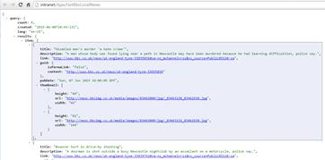
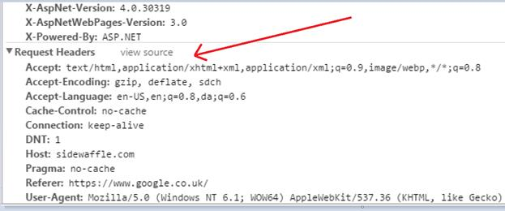
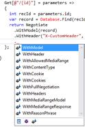

# 第八章内容谈判

在网络框架的世界里，如今一切都是基于 REST 的——从返回丰富的、格式良好的 HTML 视图的路线，到那些只返回一堆 JSON 的无聊 URL。



图 21:在浏览器中直接看到的相当简单的 JSON 提要

不管你怎么看，两者都是必须的。我们使用一组 URL 来交付我们的用户界面，然后我们使用第二组 URL 来交付动态数据到那个用户界面。有时，我们甚至可能有第三组网址，将数据传递给我们的移动应用程序。

所有这些重复看起来需要做很多工作，事实也的确如此。我去过那里，肯定不好看。为了提供这个问题的解决方案，许多框架(包括 Nancy)都添加了名为*内容协商*的东西。

## 内容什么？

当您使用浏览器(或一些知道如何与 web 服务器对话的代码)发出请求时，您会在幕后提供各种信息来描述请求。

这些信息被称为**请求头**:



图 22: Chrome 调试器显示了上图中 JSON 的请求头

您可能无法在截图中看到它，但是其中一个标题被称为 *Accept* 标题，它告诉 web 服务器浏览器或调用程序愿意接受什么样的响应，在我们的示例中，它被设置为:

`Accept: text/html,application/xhtml+xml,application/xml,image/webp,*/*`

也就是说，按照偏好的顺序，我希望你给我发送`html`、`xml`，或者一个`webp`的图像，如果你不能按照那个顺序提供其中的任何一个，那就把你有的发给我。

南希收到请求时会注意这个标题。根据它找到的内容，它可以更改给定网址的输出。

如果我们的`Accept`标题为:

`Accept: application/json`

Nancy 将立即查看是否可以使用基于 JSON 的数据发送响应，如果不能，将抛出异常并失败。如果我们不希望它失败，那么我们可以在末尾添加`*/*`，就像在以前的版本中一样，这将导致 Nancy 只发送它能够生成的默认响应。

默认情况下，Nancy 可以在 HTML、XML 和 JSON 之间做出决定，而无需您提供任何额外的配置。如果您构建一个 API，然后使用该 API 返回一个简单的模型，正如我们在前面几章中已经看到的，Nancy 将尝试返回最合适的响应。

如果您从浏览器调用您的网址，那么 Nancy 将在您的视图文件夹中查找名称与对象类型匹配的视图。

拿着我们在上一章中使用的`Address`对象，南希会寻找:

`'~/Views/Address.Html'`

然后，这个小的 HTML 片段可以使用任何可用的视图引擎来生成输出，而不必明确告诉模块返回视图。

如果从页面内部的一些 JavaScript 调用了 URL，并且调用中的`Accept`头指向相同的 URL 指定的 JSON，那么 Nancy 只会将您的对象序列化为 JSON 语法并返回它。

为了让 Nancy free 能够决定返回哪种内容类型，您只需从 Nancy 路由模块返回一个简单的对象模型。到目前为止，我们看到的返回字符串、页面和视图内容的方法在这里没有用；通过使用其中的任何一个，我们阻止 Nancy 对 accept 头进行正确的分析。相反，最快的方法如下:

代码清单 38

```cs
          Get[@"/{id}"] = parameters =>
          {
            int recId = parameters.id;
            var record = Database.Find(recId);
            return record;
          };

```

通过使用`new`返回一个模型，或者从某个后端存储中抓取一个对象，您就可以让南希对头部信息采取行动，并准确地决定如何格式化响应。

您也可以使用流畅的`Negotiate`响应 API 来执行相同的任务。这里的不同之处在于，您可以对响应进行更多的控制，例如更改 HTML 响应将查找的视图名称，或者添加额外的标题。您可以通过以下方式使用流畅的响应 API:

代码清单 39

```cs
          Get[@"/{id}"] = parameters =>
          {
            int recId = parameters.id;
            var record = Database.Find(recId);
            return Negotiate
              .WithModel(record)
              .WithHeader("X-CustomHeader", "Some custom value");
          };

```

像以前一样，这使用我们的假装`Database`找到了一个记录，但是它没有直接返回那个模型，而是在响应中添加一个自定义标题的同时返回它。有一个完整的列表可以添加到响应中；如果您在进入第一个周期后暂停，Visual Studio 的智能感知将向您展示所有这些:



图 23: Visual Studio 展示了流畅协商 API 中的其他方法

最后，您可以扩展序列化基类，并添加不同的或自定义的内容类型。如果你看一下 NancyFX 维基页面上的一些链接，你会发现有一些附加内容来返回 PD 和其他特殊类型的内容，这些内容完全基于呼叫客户端的要求。

如果你用南希查看 NuGet。序列化，你会很快发现谷歌协议 Buffers、JSON 都有内容序列化器可用。NET、ServiceStack 和一些其他的。

除非您使用自定义序列化程序或以非标准方式做事，否则利用 Nancy 的能力来提供正确的内容是自动的，只要您确保请求中有正确的标头。

## 总结

在本章中，您将简要介绍 Nancy 中的内容协商——这是一个非常简单的概念，需要近乎无的配置才能正常工作。

您看到，通过正确地使用内容协商，您可以将您的应用编程接口的表面积减少到一个单一的网址，该网址为使用它的所有请求提供服务，并且在此过程中，减少管理该应用编程接口所需的复杂性和维护时间。

在下一章中，我们将仔细研究 Nancy 的响应对象，并了解我们向 Nancy 客户端返回数据和页面的不同方式。