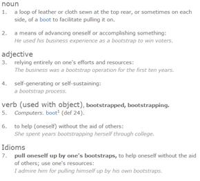
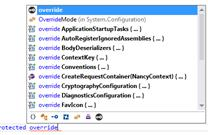

# 第十一章自举

在这一章中，我们开始进入好的方面:我们即将打开发动机罩(或引擎盖，取决于你住在哪里)，并开始调整和修补南希的内部。

什么是自举？它与每个人用来制作漂亮的基于网络的用户界面的客户端框架无关。根据字典，这是它的定义:



图 28:自举的字典定义(Dictionary 提供)

对我们来说，引导(或仅仅引导)是在软件或硬件处于最终用户可用的状态之前启动它。

就 Nancy 而言，引导进程是 Nancy 在应用首次运行时经历的一系列事件，直到它准备好开始为发送给它的请求提供服务。

因此，自定义引导程序是一个由应用开发人员定义的类，并在启动过程中的适当位置执行，允许开发人员提供自定义和额外的启动过程供 Nancy 内核本身使用。

这有点像买一辆二手车，然后调整发动机以提高性能，添加新的内饰和新的收音机，并提供其他改进的功能以在车辆上标记您自己的身份。通过编写和使用自定义引导程序，你可以让南希做各种现成的额外工作。

在许多情况下，Nancy 可用的许多额外模块的配置只能在引导程序中完成。您可能想要启用的许多更高级的功能只能通过这种方式来实现。然而，一般来说，你会发现在某些情况下，你甚至不需要知道有一个引导程序存在，就可以使用 Nancy 拥有的许多内置功能。

南希在两个方面使用自举程序。它将它作为一种方法向开发人员展示——所有的钩子、配置选项和其他用户级的东西，这些都可以被使用框架的开发人员覆盖。

其次，Nancy 使用引导程序来执行任务，例如配置内置的 IOC 容器 TinyIOC，并为您注册自己的程序集提供启动点，实际上是用特定于域的语言(用 NancyFX Wiki 的话说)包装整个 IoC(控制反转)。

## IoC 容器

在我们进一步讨论之前，我想在这里介绍一下 Nancy 的另一个隐藏特性:它是内置的 IoC 容器。

对于那些对这个概念不熟悉的人来说，IoC 是一种根据需要将依赖关系注入到运行的代码库中的方法，而不需要创建新的对象。这是一种架构模式，有助于保持应用的合成和易于管理。它还有助于为尚未添加的功能测试和创建模拟对象。

对于基于 Nancy 的应用来说，这意味着 Nancy 将尝试自动满足您的代码所需的任何依赖关系。例如，假设您有以下路由模块:

代码清单 55

```cs
          using System;
          using System.Collections.Generic;
          using System.IO;
          using Nancy;
          using Nancy.Responses;

          namespace nancybook.modules
          {
            public class BaseRoutes : NancyModule
            {
              private FakeDatabase _db;

              public BaseRoutes()
              {
                Get[@"/"] = _ =>
                {
                  var _db = new FakeDatabase();
                  var myList = db.GetHashCode();
                  return View["myview", myList];
                };
              }
            }
          }

```

这是一个简单的例子，但也是一个重要的例子。

在本模块中，您的`FakeDatabase`被称为具体依赖。也就是说，很难管理，也很难改变。假设您有 20 个路由模块，所有这些模块中定义了大约 10 个 URL，并且每个模块都使用相同的数据库库，每次使用时都必须创建一个新的实例。

现在假设您需要将数据库库从`FakeDatabase`更改为`RealDatabase`。你突然意识到这将会涉及多少工作。

IoC 容器大大提升了这一点。举下一个例子:

代码清单 56

```cs
          using System;
          using System.Collections.Generic;
          using System.IO;
          using Nancy;
          using Nancy.Responses;

          namespace nancybook.modules
          {
            public class BaseRoutes : NancyModule
            {
              private readonly FakeDatabase _db;

              public BaseRoutes(FakeDatabase db)
              {
                _db = db;

                Get[@"/"] = _ =>
                {
                  var myList = _db.GetHashCode();
                  return View["myview", myList];
                };
              }
            }
          }

```

这与前面的例子完全相同，只是现在它使用 IoC 来管理数据库库。如果我在我的模块中的 10 个地方使用它，我所要做的就是改变它的两个实例:一个用于私有变量，一个用于构造函数参数。

我的 IoC 库将处理其余的事情，包括确保当我想要使用它时，我有一个新的实例连接到`_db`上。

这也意味着，如果我愿意，在 Nancy 引导程序中，我可以覆盖这个 IoC 容器的自动设置，并告诉 Nancy，当某个东西想要使用一个`FakeDatabase`对象时，你应该给它一个`RealDatabase`对象。这将每个路由模块中的这两个变化减少为单个类中的一个全局变化。

Nancy 可以使用几个不同的 IoC 容器，并有 NuGet 包来启用它们。如果你已经使用了其中一个比较流行的，那么你可能会考虑使用它。然而，如果你以前没有使用过 IoC，但是喜欢它是如何工作的想法，内置容器就足够了。

让我们把注意力转回到使用 Bootstrapper 类。

## 默认引导程序

所有这些关于覆盖和定制类的讨论可能会让你认为实现一个 Nancy bootstrapper 是一项非常艰巨的工作，不值得付出努力。

如果每次需要使用时都必须从头开始实现整个东西，这将是非常正确的。然而，Nancy 团队已经提前想好了，并为你提供了一个名为`DefaultNancyBootStrapper`的类来进行抽象。

要获得一个定制的引导类(它实现了 Nancy 需要的一切，并允许您使用所需的位)，您所要做的就是如下:

代码清单 57

```cs
          using System.Text;
          using Nancy;
          using Nancy.Bootstrapper;

          namespace nancybook
          {
            public class CustomBootstrapper : DefaultNancyBootstrapper
            {
            }
          }

```

在这个类的主体中，您现在可以创建重写的方法来实现您自己需要的任何功能。例如，让我们假设您有某种外部数据存储库，并且这个库可能使用某种形式的泛型，允许您使用具有相同基类的不同数据对象。您可以很容易地为基类声明一个接口，用一个具体的实现来包装它，然后告诉您的 IoC 容器要寻找什么:

代码清单 58

```cs
          using System.Text;
          using demodata;
          using demodata.entities;
          using Nancy;
          using Nancy.Authentication.Forms;
          using Nancy.Bootstrapper;
          using Nancy.Conventions;
          using Nancy.Session;
          using Nancy.TinyIoc;

          namespace nancybook
          {
            public class CustomBootstrapper : DefaultNancyBootstrapper
            {
              protected override void ConfigureApplicationContainer(TinyIoCContainer container)
              {
                base.ConfigureApplicationContainer(container);

                container.Register<IDataProvider<Genre>>(new GenreDataProvider());
                container.Register<IDataProvider<Album>>(new AlbumDataProvider());
                container.Register<IDataProvider<Track>>(new TrackDataProvider());
                container.Register<IDataProvider<Artist>>(new ArtistDataProvider());
              }
            }
          }

```

您还可以使用 IoC 覆盖来创建单件和其他实例。例如，在我的演示应用中，我提供了一种小而简单的方式来提供低调形式的请求缓存，我用来管理缓存的类被设置为在服务中作为单例进行实例化。单例类有用的另一个场景是在编写 Nancy 服务时，该服务监视硬件并向硬件提供 web 接口。

所有这些以及更多内容都在`ConfigureApplicationContainer`覆盖中配置。还有很多其他的；如果您开始在类中键入“受保护的覆盖…”并暂停，IntelliSense 应该会为您列出它们，以及它们的签名:



图 29:显示可用引导程序覆盖的智能感知

实际上，您通常只会使用一些不同的覆盖。例如，在我的示例应用中，我使用`RequestStartup`设置表单身份验证，`ConfigureRequestContainer`配置我的`IUserMapper`，`ConfigureApplicationContainer`注册我的外部 IoC 依赖项，`ConfigureConventions`为我的 web 应用设置静态文件夹，以及`ApplicationStartup`添加错误处理管道。

您会发现命名也是经过深思熟虑的:对于在名称中使用“请求”的覆盖，Nancy 将基于请求调用这些钩子。这些是您寻找诸如请求验证、缓存或检查给定头是否可用之类的东西的常见地方。

任何名称中有“应用”的东西通常都是特定于整个应用的，并且会在该应用启动时被调用。在独立服务的情况下，这将是当应用使用服务控制管理器实际启动时，或者当它通过点击它从 Windows 桌面运行时。对于使用 ASP.NET 和 IIS7 托管的应用，每当服务器的应用池被回收时，就会调用这个函数。

## 一个自举者的例子

您可以重新实现的最有用的覆盖之一是`ConfigureConventions`覆盖。

你会记得在前几章中，Nancy 在一个地方查找它的所有内容:在一个名为 **Content** 的文件夹下，相对于正在运行的程序集。

如果您有默认设置，那么这意味着脚本可能会在**内容/脚本/** 中，后跟您想要使用的 JavaScript 的名称。

您可以通过覆盖`ConfigureConventions`方法并添加您的自定义路径来轻松更改这一点。对于我的演示应用，我执行了以下操作:

代码清单 59

```cs
          using System.Text;
          using demodata;
          using demodata.entities;
          using Nancy;
          using Nancy.Authentication.Forms;
          using Nancy.Bootstrapper;
          using Nancy.Conventions;
          using Nancy.Session;
          using Nancy.TinyIoc;

          namespace nancybook
          {
            public class CustomBootstrapper : DefaultNancyBootstrapper
            {
              protected override void ConfigureConventions(NancyConventions nancyConventions)
              {
                Conventions.StaticContentsConventions
                  .Add(StaticContentConventionBuilder.AddDirectory("/scripts", @"Scripts"));
                Conventions.StaticContentsConventions
                  .Add(StaticContentConventionBuilder.AddDirectory("/fonts", @"fonts"));
                Conventions.StaticContentsConventions
                  .Add(StaticContentConventionBuilder.AddDirectory("/images", @"Images"));
                Conventions.StaticContentsConventions
                  .Add(StaticContentConventionBuilder.AddDirectory("/", @"Pages"));
              }
            }
          }

```

然后我在我的解决方案资源管理器中创建了**脚本**、**字体**、**图像**和**页面**，并确保为它们将`NamespaceProvider`设置为`True`，因此一旦运行，它们将被复制到与我编译的程序集相同的位置。

这使我能够使用 CSS、JavaScript 和其他 ASP 的正常 NuGet 安装过程。NET 相关的 web 包，这意味着我包含的任何文件都将被复制到我的应用构建中。

您会注意到所有对`/`的请求都被设置为在名为**页面**的文件夹中查找；您在这里不能做的一件事是将`/`指向您的应用根；南希认识到这带来的安全风险，不会允许它发生。

这实际上意味着我可以将正常的、静态的 HTML 文件放在 pages 文件夹中，然后添加 **/blah.html** 进行请求。南希将从那个文件夹中返回一个名为**blah.html**的静态 HTML 文件。这允许您混合传统的经典 HTML、脚本和 CSS 文件，这些文件无需南希处理，同时南希强大的路由引擎和应用编程接口/网址功能。我使用的方法正是我在[丽都网站](http://www.lidnug.org/)上所做的工作，在那里我使用 JavaScript 在客户端上直接高速地交付用户界面。然后，这个用户界面中的 JavaScript 在 Nancy 的 web 框架提供的不同端点上调用，为客户端发出的 AJAX 请求提供服务。

如果你曾经使用过 NodeJS，你会马上意识到这和它在像 Express 这样的框架中的工作方式是完全一样的。

这里的巧妙之处不在于它的工作方式，而在于您可以将您的应用自由地部署到服务器上，无论是否已经有 web 服务器，这使得它非常适合创建基于轻量级微服务架构的部署。

## 总结

在本章中，您学习了 Nancy 的引导程序是如何工作的，以及其内置的 IoC 容器如何简化您设计 Nancy 应用的方式。

您还学习了如何使用引导程序来创建适用于所有平台的静态约定，从而即使不使用 web 服务器也能为您的站点提供服务。

在下一章中，我们将看看 Nancy 的请求管道，它们通常在引导程序中配置。