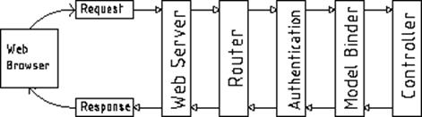

# 十二、管道拦截

所有好的网络框架都有一个请求处理管道，Nancy 是其中最好的。拥有请求管道意味着什么？也许下图会有助于理清思路:



图 30:典型的网络管道图

正如名字所描述的那样，一个典型的 web 请求在到达它的最终响应之前要经过许多模块，然后它通常会在返回浏览器的途中经过所有这些模块。

请求通过的模块的数量和类型高度依赖于所使用的框架；有的多，有的少。需要处理的东西越多，反应往往越慢。

默认情况下，Nancy 是轻量级和模块化的，它的流程中只有很少的步骤，并且它让开发人员可以很好地控制这些模块如何以及在哪里与框架整体交互。

当我们谈论管道拦截时，我们指的是 Nancy 公开的三个主要挂钩点，允许您将自己的模块或代码片段挂钩到这个处理链中。

到目前为止，您已经看到 Nancy 有大量的功能——身份验证就是一个很好的例子——您可能会认为有很多代码在支持它。

事实是，Nancy 的管道中几乎没有代码来实现身份验证和其他类似的事情。即使添加了身份验证方法，也不会向管道中添加任何代码。只有当您将`this.RequiresAuthentication();`线添加到您的路由模块中时，管道才真正被钩住和拦截。

为什么呢？

身份验证扩展实际上只是一小段内嵌代码的薄薄的包装器，它为路由模块的`Before`和`After`管道添加了一个 lambda(Java 和 JavaScript 类型的匿名函数)。

在 Nancy 的“身份验证”页面上显示的示例中，您可以看到以下示例:

代码清单 60

```cs
          using Nancy;
          using Nancy.Responses;
          using Nancy.Security;

          namespace nancybook.modules
          {
            public class AuthRoutes : NancyModule
            {
              public AuthRoutes() : base("/auth")
              {
                Before += ctx =>
                {
                  return (this.Context.CurrentUser == null)
                    ? new HtmlResponse(HttpStatusCode.Unauthorized)
                    : null;
                };

                Get[@"/"] = _ => View["auth/index"];
              }
            }
          }

```

这实际上执行了与`RequiresAuthentication`相同的功能，但方式更短、更简洁。

在认证系统使用的代码位中，您可以直接看到它有两种可能的结果。首先，您可以返回 null，在这种情况下，处理将继续运行在您的路由中定义的实际代码，并且对其他任何事情都没有影响。

第二个选项是返回一个 Nancy 响应对象(本例中为`403 Unauthorized`)。您可以从路由处理程序返回的任何内容都可以从`Before`管道返回，如果您这样做了，这些内容将直接返回给调用客户端，而无需调用您的路由处理程序模块中的代码。

您应该能够直接看到这有许多用途，不仅仅是身份验证。但是，您可以检查其他资源、服务或所有其他条件，并在采取任何其他措施之前将错误或不同的响应发送回客户端。

例如，如果您想提供某种形式的前端缓存，您可以截取`Before`管道，查看该请求是否已经被缓存，如果是，则返回缓存版本，如果不是，则仅允许请求前进到路由处理程序，或者如果数据需要更新，则返回缓存版本。

您也可以通过执行以下操作来提供`After`处理程序:

代码清单 61

```cs
          After += ctx =>
          {
            //... Code here ...
          }

```

有了`After`管道，您就已经有了一个响应对象(由处理请求的路由生成的对象)，并且从 Nancy 上下文(在示例中的`ctx`变量中可用)中，您可以随意更改它。

例如，您可以检查一些其他环境变量，并决定在返回浏览器之前将已经生成的`200 ok`响应更改为`403`响应。

然而，您更有可能使用`After`管道来获取将要发送回请求客户端的响应，并将其添加到您的缓存服务中，以便下一个传入的请求会发现它被预缓存，而不需要从数据库中重新请求它。

使用`Before`和`After`管道处理程序的可能性只受你的想象力和你做事情的速度的限制。

请记住，这些代码片段是为它们所连接的路由模块中的每个请求调用的。这意味着，如果您的代码需要很长时间来执行，那么您将会降低 Nancy 处理您的请求的速度。

## 全应用挂钩

您还可以在整个应用的管道挂钩之前和之后进行连接，而不仅仅是基于模块。使用应用范围的钩子意味着你的钩子将为应用中的每个路由和模块触发，不管它在哪里。此外，如果您有一个应用范围的钩子，然后在一个特定的模块上有一个单独的钩子，那么两个钩子都将被调用，首先调用应用钩子。

这也意味着，如果您在应用钩子中返回一个响应，那么您的模块钩子将永远不会被调用，就像如果您从模块钩子返回一个响应，您的路由将永远不会被调用一样。

您可以通过覆盖`ApplicationStartup`或`RequestStartup`在自定义引导程序中连接应用管道。这些函数的参数之一是`Pipelines`参数，包括`BeforeRequest`和`AfterRequest`属性。分配给这些属性的方式与分配给单个模块中的`Before`和`After`挂钩的方式完全相同。

您还会发现您可以访问一个`OnError`属性，它可以在您的应用中方便地实现自定义错误处理。例如，在您的数据库访问代码中，当数据库中不存在请求的实体时，您可能希望抛出一个自定义的`Database Object not found`异常。然后，您可以使用您的自定义引导程序拦截该错误并返回一个`404 File not found`错误，如下所示:

代码清单 62

```cs
          using System.Text;
          using Nancy;
          using Nancy.Authentication.Forms;
          using Nancy.Bootstrapper;
          using Nancy.Conventions;
          using Nancy.Session;
          using Nancy.TinyIoc;

          namespace nancybook
          {
            public class CustomBootstrapper : DefaultNancyBootstrapper
            {
              protected override void ApplicationStartup(
                TinyIoCContainer container,
                IPipelines pipelines)
              {
                base.ApplicationStartup(container, pipelines);

                // Add an error handler to catch our entity not found exceptions
                pipelines.OnError += (context, exception) =>
                {
                  // If we've raised an EntityNotFound exception in our data layer
                  if (exception is EntityNotFoundException)
                    return new Response()
                    {
                      StatusCode = HttpStatusCode.NotFound,
                      ContentType = "text/html",
                      Contents = (stream) =>
                      {
                        var errorMessage = Encoding.UTF8.GetBytes("Entity not found");
                        stream.Write(errorMessage, 0, errorMessage.Length);
                      }
                    };

                  // If none of the above handles our exception, then pass it on as a 500
                  throw exception;
                };
              }
            }
          }

```

在您的数据访问代码中，您可以在任何合适的点添加`throw new EntityNotFoundException();`，Nancy 会将其转换为`404`并返回给客户端。

## 输出缓存

为了给你一个如何使用各种钩子的好例子，我将用一个为你的路线提供简单但有用的滑动输出缓存的例子来结束这一章。

该示例将缓存来自某个路由的输出，如果在最后一次访问后 30 秒内再次调用该输出，它将继续缓存响应，只有在发出另一个请求之前超过 30 秒时，才会清除缓存的版本。

我们首先需要的是一个充当缓存提供者的小类。在应用中创建一个名为`CacheService.cs`的新类，并将以下代码添加到该类中:

代码清单 63

```cs
          using System;
          using System.Collections.Specialized;
          using System.Runtime.Caching;
          using Nancy;

          namespace nancybook
          {
            public class CacheService
            {
              private static readonly NameValueCollection _config = new NameValueCollection();
              private readonly MemoryCache _cache = new MemoryCache("NancyCache", _config);

              private readonly CacheItemPolicy _standardPolicy = new CacheItemPolicy
              {
                Priority = CacheItemPriority.NotRemovable,
                SlidingExpiration = TimeSpan.FromSeconds(30) // This can be changed to FromMinutes/FromHours etc it's 30 secs for testing purposes
              };

              public void AddItem(string itemKey, Response itemToAdd)
              {
                _cache.Add(new CacheItem(itemKey, itemToAdd), _standardPolicy);
              }

              public Response GetItem(string itemKey)
              {
                return (Response)_cache.Get(itemKey);
              }

            }
          }

```

这个类提供了两种公共方法，用于从缓存中获取项目并将它们添加到缓存中。您会注意到这些对象是 Nancy 响应对象。

因为我们需要将这个类注册为单例实例，所以我们需要向引导程序添加一个配置来正确配置 IoC 容器:

代码清单 64

```cs
          protected override void ConfigureApplicationContainer(TinyIoCContainer container)
          {
            base.ConfigureApplicationContainer(container);
            container.Register<CacheService>().AsSingleton();
          }

```

这将确保必须处理缓存的每个请求都与同一个实例交互，而不是每个请求中的新实例。

接下来，创建一个路由模块，该模块实现一个路由来显示视图，并实现模块级管道来根据需要检查和设置该路由的缓存:

代码清单 65

```cs
          using System;
          using System.Collections.Generic;
          using System.Runtime.InteropServices;
          using nancybook.Models;
          using Nancy;

          namespace nancybook.modules
          {
            public class CachingRoutes : NancyModule
            {
              private readonly CacheService _myCache;

              public CachingRoutes(CacheService myCache) : base("/caching")
              {
                _myCache = myCache;
                Get["/"] = x =>
                {
                  var cacheData = new CacheDemo() {WhenRequested = DateTime.Now};
                  return View["caching/index.html", cacheData];
                };
                Before += ctx =>
                {
                  string key = ctx.Request.Path;
                  var cacheObject = _myCache.GetItem(key);
                  return cacheObject;
                };
                After += ctx =>
                {
                  if(ctx.Response.StatusCode != HttpStatusCode.OK)
                  {
                    return;
                  }
                  string key = ctx.Request.Path;
                  if(_myCache.GetItem(key) == null)
                    _myCache.AddItem(key, ctx.Response);
                };
              }
            }
          }

```

最后，在你的**视图**文件夹中添加一个视图，并在项目中添加一个模型，这样你就可以证明缓存正在进行:**缓存/索引. html** 。

代码清单 66

```cs
          <!DOCTYPE html>
          <html lang="en">
          <head>
            <meta charset="utf-8">
            <meta http-equiv="X-UA-Compatible" content="IE=edge">
            <meta name="viewport" content="width=device-width, initial-scale=1">
            <title>Nancy Demo | Caching Example</title>
            <link href="~/content/bootstrap.min.css" rel="stylesheet" type="text/css"/>
          </head>

          <body>

          <div class="container">
            <div class="page-header">
              <h1 style="display: inline-block">Nancy Demo <small>Caching Example</small></h1>
              <h1 style="display: inline-block" class="pull-right"><small><a href="~/" title="Click to return to demo home page">home <span class="glyphicon glyphicon-home"></span></a></small></h1>
            </div>

            <h4>This page was requested at <strong class="text-success">@Model.WhenRequested</strong></h4>

            <br/><br/>

            <p class="lead">This example uses before and after filters attached directly to the module servicing this request.</p>
            <p>If you observe the time this page was created when refreshing it, you'll see the page is handled by an output cache; this cache has a sliding window of 30 seconds.</p>
            <p>
              As long as you’re refreshing the page, you'll reset the timer and the cache will continue to wait 30 seconds after the last request before expiring. If you request the page then
              leave it for 30 seconds before re-requesting it, you'll see you get a new copy.
            </p>

          </div>

          <script src="~/scripts/jquery-2.1.3.min.js"></script>
          <script src="~/scripts/bootstrap.min.js"></script>
          </body>

          </html>

```

快取示范

代码清单 67

```cs
          using System;

          namespace nancybook.Models
          {
            public class CacheDemo
            {
              public DateTime WhenRequested { get; set; }
            }
          }

```

## 总结

在本章中，您了解了 Nancy 的管道挂钩机制，允许您在基于 Nancy 的应用中自由地执行各种请求前和请求后操作。

您学习了如何在全局级别处理异常，以及如何实现一个非常简单的前端输出缓存。

在下一章中，我们有一些东西来取悦你们中的硬核 TDD 纯粹主义者:Nancy 的内置测试框架。