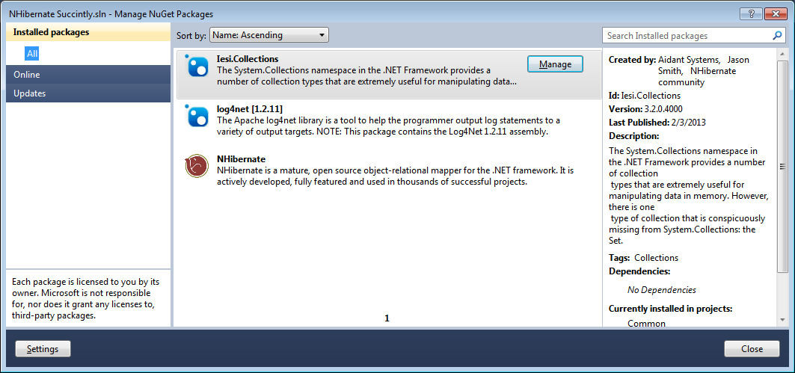
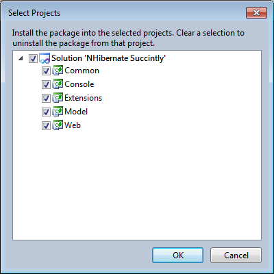
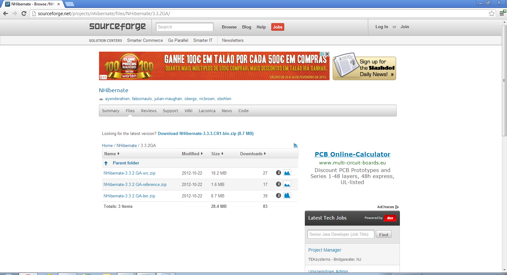
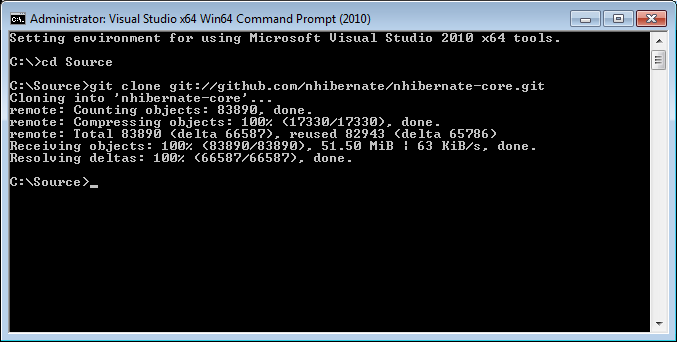
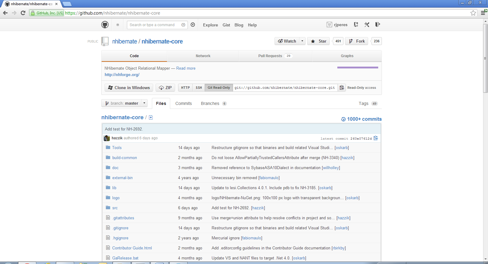
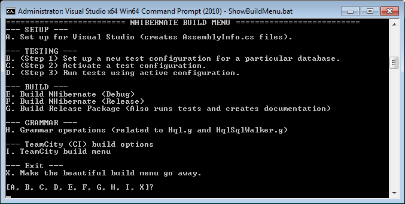
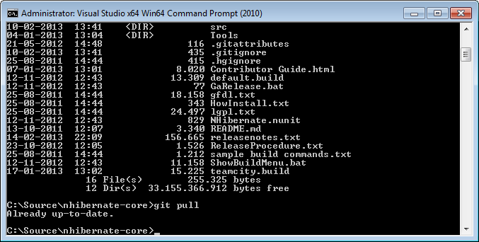

# 一、安装

## 在我们出发之前

您将需要 Visual Studio 2010/2012/2013(任何版本，包括快速版)和 SQL Server 2008 安装(任何版本)。SQL Server 实例必须使用 TCP/IP 协议，并且必须可以从运行示例的主机上访问。您需要在 SQL Server 上拥有创建数据库的权限；简洁地称之为**。**

 **## 获得伊比利亚

您可以从许多来源获得 NHibernate:

*   纽吉特！
*   作为来自 GitHub 存储库的源代码。
*   作为可下载的。SourceForge 的 zip 包。

## 纽集

在 Visual Studio 2010/2012/2013 上，以开放。NET 项目，启动**包管理器控制台**，输入以下命令:

这可能是获取 NHibernate 和连接引用的最方便的方法。它还允许您在新版本可用时自动更新。NHibernate 套餐将带来 [**log4net**](https://nuget.org/packages/log4net) 和 [**Iesi。收藏品**](https://nuget.org/packages/Iesi.Collections)；这些是必需的依赖项(稍后将详细介绍)。

图 1:管理数字获取包

默认情况下，包安装程序只会添加对当前项目中添加的包的引用，但是您可以通过单击**管理解决方案的 NuGet 包**并选择其他项目来将它们显式添加到其他项目中:

图 2:管理解决方案包

## 可下载包

在位于[http://sourceforge.net/projects/nhibernate](http://sourceforge.net/projects/nhibernate)的 SourceForge 网站上，有当前和过去版本的软件包可供下载，包括源代码和参考文档。导航至**文件**页面，选择您想要的版本:

图 SourceForge 的 NHibernate 项目

下载二进制分布(以**结尾的那个)。bin** ，将文件提取到本地文件夹中，并将 dll**【NHibernate.dll】****【Iesi.Collections.dll】**和**log4net.dll**的引用添加到您的项目中，以便您可以立即开始使用 NHibernate。

## 源代码

NHibernate 源代码库可以在 GitHub 上找到，名称为 **nhibernate-core** 。您需要安装一个 Git 客户端(可以从[http://git-scm.com](http://git-scm.com)下载)并将这个存储库克隆到您的本地驱动器中。使用命令行，它看起来像这样:

图 4:克隆 NHibernate GitHub 存储库

在[https://github.com/nhibernate/nhibernate-core](https://github.com/nhibernate/nhibernate-core)有一个这个存储库的网络界面，在这里你可以看到最新的变化，浏览文件夹，并查看单个文件，包括它们的内容和单个的变化。

图 5: NHibernate 项目的 GitHub 网络界面

本地文件保存后，进入 **nhibernate-core** 文件夹，运行 **ShowBuildMenu.bat** 脚本:

图 6:从源代码构建 NHibernate

当您第一次运行这个脚本时，您需要首先选择选项 **A** 来设置 Visual Studio 文件。这个只需要一次；之后，要获得构建包，选择选项 **E** 或 **F** 进行**调试**或**发布**构建。构建过程终止后，二进制文件将出现在**nhibernate-core \ build \*<版本>*** 文件夹中，您可以将它们添加为项目的引用。

使用源代码存储库时，您应该记住一些事情:

*   通过运行 **git pull** ，可以随时获取最新的变化。

图 7:获取最新更改

*   您正在获取的文件是最新的不稳定文件；也就是说，它们是个人贡献和实验特性一提交就产生的结果，可能没有官方包(您从 NuGet 或 SourceForge 获得的包)测试得那么彻底。
*   您可以自由地对本地源代码文件进行实验和修改。不要惊慌；如果出了问题，你随时可以恢复。或者您可以实现一些新功能或修复一些错误，在这种情况下，您可能希望使用 NHibernate 的每个人都可以使用这些修改。在最后一章“附加参考”中有更多关于这方面的内容。

## 里面有什么

NHibernate 二进制分发包括三个文件:**Nhibernate.dll**、**Iesi.Collections.dll**和**log4net.dll**。关于它们的用途，解释如下:

*   **NHibernate.dll**包含核心 NHibernate 库；这些是您需要与 NHibernate 合作的内容。这是一个. NET 3.5 程序集，您可能知道，它基本上是。NET 2.0 以及一些额外的库和对 LINQ 语法的支持。由于向后兼容，NHibernate 仍然是目标。NET 2.0(这并不意味着您不能在. NET 4.0 或. NET 2.0 中使用它。NET 4.5 项目，因为，的确，你可以)。
*   **Iesi.Collections.dll**包含一些集合定义和实现，截止到。NET 2.0/3.5，在。NET 基类库。其中最值得注意的是一个集合接口和一些实现；**NHibernate.dll**在内部使用这个组件，很可能你也会使用，所以它也必须存在。它的源代码和 NHibernate 的在一起。
*   **log4net.dll**其实是外部项目；你可以在[http://logging.apache.org/log4net](http://logging.apache.org/log4net)找到它的主页，如果你不知道，它是一个通用记录器。在内部，NHibernate 使用 log4net 进行自己的日志记录，包括运行时警告、调试消息、异常和生成的 SQL 查询。尽管严格来说不是必需的——NHibernate 会在启动时检测 log4net 是否存在，如果不存在也不会抱怨——这可能非常有用，尤其是在调试项目时。当然，log4net 是一个在几个项目中使用的非常成熟的库，您可能也有兴趣将其用于自己的日志记录目的。

## 我该选哪个？

这取决于你选择哪一个，但我会推荐 NuGet，因为它简单易用。另一方面，如果你想危险地生活，并跟上 NHibernate 内核的最新发展，无论如何，使用源代码！**