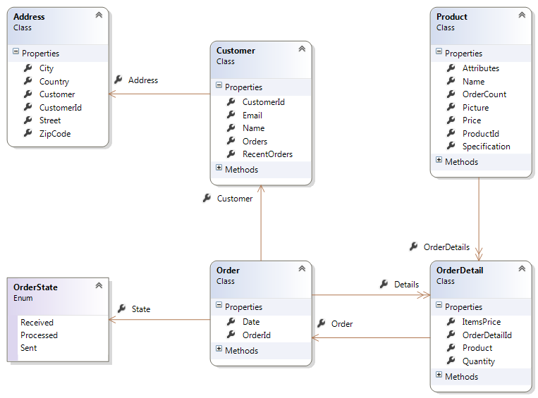

# 五、数据库查询

诚然，您对数据库所做的最典型的操作可能是查询它。NHibernate 为此提供了一套丰富的 API，涵盖了不同的用例。

要开始查询模型，您需要一个会话。会话是从会话工厂获得的，而会话工厂又是从您在“配置”一章中学习创建的配置对象构建的。您将使用类似以下的内容:

```cs
      //the one and only session factory
      using (ISessionFactory sessionFactory = cfg.BuildSessionFactory())
      {
        using (ISession session = sessionFactory.OpenSession())
        {
          //one session
        }

        using (ISession session = sessionFactory.OpenSession())
        {
          //another session
        }
      }

```

|  | 提示:为了编译这个例子，您需要引用 NHibernate 命名空间。 |

请注意，会话工厂和会话都使用块包装在**中。这是为了确保它们都在不再需要时被处理掉—在每个块的末尾。**

会话工厂可能会产生多个会话对象。这是一个沉重的野兽，通常，你的程序中只有一个。如果您希望同时定位多个数据库，则只需要一个以上。在这种情况下，将会有多个**配置**和 **ISessionFactory** 实例。从多个线程访问会话工厂是安全的。会话工厂是用来做什么的？它从配置对象中的映射建立所有元数据，并试图将它们与实际的进行匹配。NET 类和数据库表。正是会话工厂触发了数据模型的创建/验证，这在“映射”一章的开头已经讨论过。如果这样配置，它的处置将触发它的丢弃。它是只读的。

|  | 注意:创建会话工厂后，不要更改配置实例。 |

另一方面，会话是轻量级的，实际上并不代表与数据库的连接；一个是在必要时自动创建的。会话是实际发生操作的地方。负责查询的是会话。它们是轻量级的，因此您可以随时创建新的实例，通常是在方法内部。不要在会话可能不会被释放的地方保留对会话的引用。另外，不要从不同的线程访问会话；可能会出现意外行为。

|  | 提示:每当任何会话操作引发异常时，会话实例都会变得不可用，并且必须被处置。 |

也就是说，有几个 API 会接受一个查询并返回一组内存中的对象，这些对象映射到数据库中的对象。让我们一个一个来看。

在我们开始之前，这是我们将使用的领域模型:



图 23:订单类模型

## 凭身份证

如果您知道您试图获取的记录的标识符，您可以通过以下 id 直接获取:

```cs
      //get strongly typed instance by id
      var someProduct = session.Get<Product>(1);

      >//get object instance by id and type
      var someObject = session.Get(typeof(Product), 1);

```

如果没有找到记录，获取将返回**空值**。如果是，它将从数据库中加载，并将相应的类具体化。

## LINQ

从。NET 3.5 出现后，LINQ 已经成为查询的事实标准。NET 世界，这是可以理解的原因。这是执行独立于数据源的强类型、面向对象查询的统一方式。当然，NHibernate 支持 LINQ 查询。要发出 LINQ 查询，您必须使用应用于会话的**查询**扩展方法:

```cs
      //simplest LINQ query containing a filter var products = session.Query<Product>().Where(x => x.Price > 1000).ToList();

```

|  | 提示:导入 NHibernate，NHibernate。临朐，和 。 |

请记住，LINQ 查询仅在调用终端方法时执行(发送到数据库)，例如 **ToList** 、 **ToArray** 、 **Single** 、 **SingleOrDefault** 、 **First** 、 **FirstOrDefault** 、 **Any** 或 **Count** 。如果不包含这样的方法调用，您所拥有的只是一个等待执行的查询，您可以向它添加条件和排序:

```cs
      //a query over all Products
      var allProductsQuery = session.Query<Product>();

      if (someCondition == true)
      {
        //a filter
        allProductsQuery = allProductsQuery.Where(x => x.Price > 1000);
      }
      else
      {
      >  //a filter
        allProductsQuery = allProductsQuery.Where(x => x.Price <= 1000);
      }

      if (sortByName == true)
      {
        //ordering
        allProductsQuery = allProductsQuery.OrderBy(x => x.Name);
      }
      else
      {
      >  //ordering
        allProductsQuery = allProductsQuery.OrderByDescending(x => x.Price);
      }

      //run the query
      var allProducts = allProductsQuery.ToList();

```

LINQ 支持 SQL 上的大多数操作，例如:

```cs
      //checking if a record exists
      var productsWithoutOrders = session.Query<Product>().Where(x => x.OrderDetails.Any() == false).ToList();

      >//filter on collection
      var ordersOfIphones = session.Query<OrderDetail>().Where(x => x.Product.Name == "iPhone")
      .Select(x => x.Order).ToList();

      //two optional conditions
      var processedOrReceivedOrders = session.Query<Order>()
      .Where(x => x.State == OrderState.Processed || x.State == OrderState.Received).ToList();
      > 
      //grouping and counting
      var countByProduct = (from od in session.Query<OrderDetail>()
                     group od by od.Product.Name into p
                     select new { Product = p.Key, Count = p.Count() })
                      .ToList();

      >//customers with two orders
      var customersWithTwoOrders = session.Query<Customer>().Where(x => x.Orders.Count() == 2)
      .ToList();

      >//nesting queries      
      var customersWithOrders = session.Query<Customer>().Where(x => x.Orders.Any());

      var ordersFromCustomers = session.Query<Order>().Where(x => customersWithOrders
      .Contains(x.Customer))
      .ToList();

      //paging
      var productsFrom20to30 = session.Query<Product>().Skip(19).Take(10).ToList();

      //multiple conditions
      var productsWithPriceBetween10And20 = session.Query<Product>()
      .Where(x => x.Price >= 10 && x.Price < 20)
      .ToList();

      >//first record that matches a condition
      var customerWithMoreOrders = session.Query<Customer>().OrderBy(x => x.Orders.Count())
      .FirstOrDefault();

      >//projection
      var productsAndOrderCount = session.Query<Product>()
      .Select(x => new { x.Name, Count = x.OrderDetails.Count() }).ToList();
      > 
      //theta join with projection
      var productsAndCustomers = (from p in session.Query<Product>()
              join od in session.Query<OrderDetail>() on p equals od.Product
              select new { ProductName = p.Name, CustomerName = od.Order.Customer.Name })
      .ToList().Distinct();

      >//property navigation and sorting
      var firstCustomer = session.Query<OrderDetail>().OrderBy(x => x.Order.Date)
      .Select(x => x.Order.Customer.Name).FirstOrDefault();
      > 
      //set of values
      var orders = session.Query<Order>()
      .Where(x => new OrderState[] { OrderState.Processed, OrderState.Sent }.Contains(x.State))
      .ToList();

      >//parameters
      var recentOrders = session.Query<Order>()
      .Where(x => x.Date <= DateTime.Today && x.Date > DateTime.Today.AddDays(-7)).ToList();

```

NHibernate LINQ 无法处理的一个显著例外是外部连接(左、右、全)。在 NHibernate 的当前版本中，不支持不相关实体之间的 OUTER JOINs。

|  | 注意:不要因为常量的存在而惊慌；所有常量都将被转换为参数，以便重用查询的执行计划。这也阻止了 SQL 注入。 |

大多数 NHibernate 的用户将使用 LINQ 作为其主要的查询 API，但是还有其他选择，我们将在下面看到。

## HQL

Hibernate 查询语言(HQL)是一种独立于数据库、面向对象、类似 SQL 的语言，可用于实体的通用查询。它的语法非常类似于 SQL，正如您自己看到的:

|  | 提示:要尝试这些示例，请导入 NHibernate 命名空间。 |

```cs
      //checking if a record exists
      var productsWithoutOrders = session.CreateQuery(
      "from Product x where not exists elements(x.OrderDetails)").List<Product>();

      //filter on collection
      var ordersOfIphones = session.CreateQuery(
      "select o from Order o join o.Details od where od.Product.Name = :name").SetParameter("name", "iPhone")
      .List<Order>();

      //two optional conditions
      var processedOrReceivedOrders = session.CreateQuery(
      "from Order o where o.State = :processed or o.State = :received")
      .SetParameter("processed", OrderState.Processed).SetParameter("received", OrderState.Received)
      .List<Order>();
      > 
      //grouping and counting
      var countByProduct = session.CreateQuery(
      "select od.Product.Name, count(od) from OrderDetail od group by od.Product.Name").List<Object[]>();

      >//customers with two orders
      var customersWithTwoOrders = session.CreateQuery("from Customer c where c.Orders.size = 2")
      .List<Customer>();

      >//nesting queries
      var ordersFromCustomers = session.CreateQuery(
      "from Order o where o.Customer in (select c from Customer c where exists elements(c.Orders))")
      .List<Order>();

      >//paging
      var productsFrom20to30 = session.CreateQuery("from Product skip 19 take 10").List<Product>();
      >//this is identical
      var productsFrom20to30 = session.CreateQuery("from Product").SetMaxResults(10)
      .SetFirstResult(20)
      .List<Product>();

      >//theta joins with projection
      var productCustomer = session.CreateQuery(
      "select distinct p.Name, od.Order.Customer.Name from Product p, OrderDetail od where od.Product = p")
      .List<Object[]>();

      >//property navigation and sorting
      var firstCustomerWith = session.CreateQuery(
      "select x.Order.Customer.Name from OrderDetail x order by x.Order.Date take 1")
      .UniqueResult<String>();

      >//set of values
      var orders = session.CreateQuery("from Order o where o.State in (:states)")
      .SetParameterList("states", new OrderState[] { OrderState.Processed,OrderState.Sent }).List<Order>();

      >//parameters
      var recentOrders = session
      .CreateQuery("from Order o where o.Date between :today and :a_week_ago")
      .SetParameter("today", DateTime.Today).SetParameter("a_week_ago", DateTime.Today.AddDays(-7))
      .List<Order>();                         

```

但是要小心！而 HQL 本身是不区分大小写的(“`select`”等于“`SELECT`”等于“`Select`”)，类的名称和属性不是。

与 LINQ 类似，您可以在实际执行查询之前获取 **IQuery** 对象并添加分页( **SetFirstResult** 、 **SetMaxResults** )或参数( **SetParameter** 、 **SetParameterList** 、 **SetEntity** )，这只会在您调用 **List** 、**List<T>T15】、 **UniqueResult 时发生当查询返回实体时，您可能希望使用这些方法的通用版本。在这种情况下，因为 HQL 查询不是强类型的，所以您需要自己设置泛型参数类型。****

HQL 的参数总是以 **':'** 字符作为其名称的前缀来指定，而不管数据库使用什么字符( **'@'** 在 Oracle 中， **':'** 在 SQL Server 中，等等)。它的位置不重要，重要的是它的名字。如果参数是单个值，应使用**设定参数**设定其值；如果是集合(数组、**数组列表**或**列表< T >** )，则改用**设定参数列表**。如果你正在传递一个实体，使用**设置实体**。

HQL 提供的一个优势是它可以访问标准的 SQL 函数，尽管可能使用非标准的名称。以下是其中一些，适用于所有数据库引擎:

表 6

| 种类 | 功能 | 描述 |
| 聚集 | 计数(…)计数(不同的…)最大值(…)最小(…)总和(…)平均值(…) | 项目计数不同项目的计数最大值最小值所有值的总和所有值的平均值 |
| 日期和时间 | 日(…)月(…)年份(…)小时(…)分钟(…)第二(…)从…中提取当前时间戳 | 约会的一天日期的月份部分日期的年份部分日期/时间的小时部分日期/时间的分钟部分日期/时间的秒部分从日期/时间中提取一部分当前数据库日期和时间 |
| 通用 | 演职人员(…)合并(…)nullif(…)身份证明（identification）大小班级 | 将一个表达式转换成另一个表达式。NET 类型返回第一个非空值如果两个值相等，则返回 null实体标识符集合大小返回抽象实体的实际类 |
| 数学 | sqrt(……)日志(…)tan(…)罪恶(…)cos(…)mod(…)兰德()abs(…) | 平方根自然对数正切正弦余弦模数，整数除法的余数随机值绝对值 |
| 线 | concat(…)子字符串(…)定位(…)替换(…)装饰(…)上(…)下(…)长度(…)位长(…)str(…) | 将几个字符串连接在一起返回子字符串返回子字符串的索引替换字符串的第一个匹配项删除前导或尾随空白字符大写字母小写字母字符长度以位为单位的长度(长度()* 8)将表达式转换为字符串 |

有些东西与 SQL 不同:

*   不支持两个任意的、不相关的实体之间的外部联接(左、右、全)；HQL 只能在具有链接属性的实体之间执行连接。
*   没有“*”选择；默认值是选择所有映射实体的属性。
*   不需要显式连接关系被映射的两个实体，只需通过其导航属性从一个实体导航到另一个实体。
*   所有选择都必须来自某个实体，尽管它们可能不会引用它(例如，不支持**“**`SELECT GETDATE()`”**“**”，但支持**“**`select current_timestamp from Product`**”**)。
*   “选择”部分是可选的；如果不存在，则意味着“选择所有映射实体的属性”。
*   HQL 是多态的；它理解基类，这意味着查询**“**`from System.Object`**”**将从数据库返回所有记录，所以要小心！
*   不必显式转义保留名称的实体和属性(如**Order**)；NHibernate 会为你做的。
*   如果您显式地加入几个导致笛卡尔乘积的关联或集合，您可能会收到与您预期不同的响应:NHibernate 会感到困惑，您必须告诉它使用结果转换器来区分您想要的不同根实体:

```cs
      //multiple joins
        var orderDetailsWithProductsAndOrders = session
        .CreateQuery("from OrderDetail od join od.Order join od.Product join od.Order.Customer")
        .SetResultTransformer(Transformers.DistinctRootEntity).List<OrderDetail>();

```

|  | 提示:导入命名空间 NHibernate.Transform。 |

这些其他事情也适用于 HQL:

*   为了性能，您应该限制要返回的记录数量，甚至使用预测。
*   您应该使用参数而不是常量，以允许执行计划重用。
*   HQL 不区分大小写。
*   必须用**`is null`**代替**`= null`**。********

 ******## 标准

另一个查询应用编程接口是标准。这很有趣，因为它提供了一种更具概念性、更明确、更逐步的方法，这对于查询的多步动态生成很有好处。例如:

|  | 提示:导入命名空间 NHibernate 和 NHibernate.Criterion。 |

```cs
      //mixing SQL
      var productsByNameLike = session.CreateCriteria(typeof(Product))
      .Add(Expression.Sql("Name LIKE ?", "%Phone", NHibernateUtil.String)).List<Product>();
      > 
      //checking if a record exists
      var productsWithoutOrders = session.CreateCriteria("Product", "p")
      .Add(Restrictions.IsEmpty("p.OrderDetails")).List<Product>();

      >//filter on collection
      var ordersOfIphones = session.CreateCriteria(typeof(Order))
      .CreateCriteria("Details").CreateCriteria("Product")
      .Add(Restrictions.Eq(Projections.Property("Name"), "iPhone")).List<Order>();

      //two optional conditions
      var processedOrReceivedOrders = session.CreateCriteria(typeof(Order))
      .Add(Restrictions.Or(Restrictions.Eq(Projections.Property("State"), OrderState.Processed), 
      Restrictions.Eq(Projections.Property("State"), OrderState.Received))).List<Order>();

      >//grouping and counting
      var projection = Projections.ProjectionList()
      .Add(Projections.GroupProperty("p.Name")).Add(Projections.Count("Product"));

      var countByProduct = session.CreateCriteria(typeof(OrderDetail), "od")
      .CreateAlias("od.Product", "p").SetProjection(projection).List();

      //customers with two orders
      var innerQuery = DetachedCriteria.For(typeof(Customer))
      .CreateAlias("Orders", "o").SetProjection(Projections.ProjectionList()
      .Add(Projections.RowCount()));

      var customersWithTwoOrders = session.CreateCriteria(typeof(Customer), "c")
      .Add(Subqueries.Eq(2, innerQuery)).List<Customer>();

      >//nesting queries
      var innerQuery = DetachedCriteria.For(typeof(Customer), "ic")
      .Add(Restrictions.IsNotEmpty("Orders")).SetProjection(Projections.ProjectionList()
      .Add(Projections.Constant(1)));

      var ordersFromCustomers = session.CreateCriteria(typeof(Order), "o")
      .Add(Subqueries.Exists(innerQuery))
      .List<Order>();

      //paging
      var productsFrom20to30 = session.CreateCriteria(typeof(Product)).SetMaxResults(10)
      .SetFirstResult(20)
      .List<Product>();

      >//theta joins are not supported by Criteria

      //property navigation and sorting
      var firstCustomer = session.CreateCriteria(typeof(OrderDetail), "od")
      .CreateAlias("Order", "o")
      .CreateAlias("o.Customer", "c").SetProjection(Projections.Property("c.Name"))
      .AddOrder(Order.Asc("o.Date")).SetMaxResults(1).UniqueResult<String>();

      >//set of values
      var orders = session.CreateCriteria(typeof(Order))
      .Add(Restrictions.In(Projections.Property("State"), new Object[] { OrderState.Processed, 
      OrderState.Sent })).List<Order>();

      >//parameters
      var recentOrders = session.CreateCriteria(typeof(Order), "o")
      .Add(Restrictions.Between(Projections.Property("Date"), DateTime.Today.AddDays(7), 
      DateTime.Today))
      .List<Order>();

```

如您所见，使用标准进行查询可能不如使用 HQL 和 LINQ 直观。它需要仔细考虑要做什么，并且可能需要分几个步骤来做事情，也许会求助于额外的**分离标准**对象。生成的代码通常更长，更难理解。

通过**设置最大结果**和**设置第一结果**，分页的工作方式完全相同。

您可以专门使用**分离字符串**，它可以在应用的不同层之间传递，甚至序列化，因为它们不绑定到任何会话。事实上，它们是查询对象模式的一个很好的实现。一个例子是:

```cs
      //checking if a record exists
      var productsWithoutOrdersWithDetached = DetachedCriteria.For(typeof(Product), "p")
      .Add(Restrictions.IsEmpty("p.OrderDetails"));
      var productsWithoutOrders = productsWithoutOrdersWithDetached.GetExecutableCriteria(session)
      .List<Product>();

```

如果你发出几个连接，导致一个笛卡儿积，你有和 HQL 一样的问题，你必须告诉 NHibernate 来区分根实体。以下是如何使用“标准”进行操作:

```cs
      //multiple joins
      var orderDetailsWithProductsAndOrders = session.CreateCriteria(typeof(OrderDetail), "od")
      .CreateAlias("od.Order", "o").CreateAlias("od.Product", "p").CreateAlias("o.Customer", "c")
      .SetResultTransformer(Transformers.DistinctRootEntity).List<OrderDetail>();

```

标准还提供了一种有趣的查询可能性，这种可能性在以前的任何 API 中都不存在:通过示例进行查询。让我们看看这是如何工作的:

```cs
      //by example
      var productsWithSamePrice = session.CreateCriteria(typeof(Product))
      .Add(Example.Create(new Product() { Price = 1000 })).List<Product>();

```

示例查询将获取一个对象，并检查其所有具有非默认值的属性(不考虑 id 属性和集合)，以查看要查询什么。然后，它将尝试查找与给定值匹配的所有对象。

## 查询结束

下一行是查询结束。这是 LINQ 和标准的混合，意味着它有相同的优点(强类型，易于构建动态查询)和缺点(冗长，复杂的语法，需要显式执行连接)。下面是同样的查询，现在是用查询结束编写的:

|  | 提示:导入 NHibernate。标准命名空间。 |

```cs
      //checking if a record exists
      var productsWithoutOrders = session.QueryOver<Product>()
      .WithSubquery.WhereExists(QueryOver.Of<OrderDetail>().Select(x => x.Product)).List();

      //filter on collection
      OrderDetail orderDetailAlias = null;
      Product productAlias = null;

      var ordersOfIphones = session.QueryOver<Order>().JoinQueryOver(x => x.Details, 
      () => orderDetailAlias)
      .JoinQueryOver(x => x.Product, () => productAlias).Where(x => x.Name == "iPhone").List();

      //two optional conditions
      var processedOrReceivedOrders = session.QueryOver<Order>()
      .Where(x => x.State == OrderState.Processed || x.State == OrderState.Received).List();

      //grouping and counting
      Product productAlias = null;

      var projection = session.QueryOver<OrderDetail>().JoinAlias(x => x.Product, 
      () => productAlias)
      .SelectList(list => list.SelectGroup(x => productAlias.Name).SelectCount(x => x.OrderDetailId))
      .List<Object[]>();

      //customers with two orders
      var innerQuery = QueryOver.Of<Customer>().JoinQueryOver(x => x.Orders).ToRowCountQuery();

      var customersWithTwoOrders = session.QueryOver<Customer>().WithSubquery.WhereValue(2)
      .Eq(innerQuery)
      .List();

      //nesting queries
      var innerQuery = QueryOver.Of<Customer>().WhereRestrictionOn(x => x.Orders).Not.IsEmpty
      .Select(x => 1);

      var ordersFromCustomers = session.QueryOver<Order>().WithSubquery.WhereExists(innerQuery)
      .List();

      >//paging
      var productsFrom20to30 = session.QueryOver<Product>().Skip(20).Take(10).List();

      //theta joins are not supported by Criteria

      //property navigation and sorting
      Order orderAlias = null;
      Customer customerAlias = null;

      var firstCustomer = session.QueryOver<OrderDetail>().JoinAlias(x => x.Order, () => orderAlias)
      .JoinAlias(x => x.Order.Customer, () => customerAlias).OrderBy(x => orderAlias.Date).Desc
      .Select(x => customerAlias.Name).Take(1).SingleOrDefault<String>();

      >//set of values
      var orders = session.QueryOver<Order>().WhereRestrictionOn(x => x.State)
      .IsIn(new Object[] { OrderState.Processed, OrderState.Sent }).List();

      //parameters
      var recentOrders = session.QueryOver<Order>()
      .Where(Restrictions.Between(Projections.Property<Order>(x => x.Date), 
      DateTime.Today.AddDays(-7), DateTime.Today)).List();

```

如您所见，“查询结束”类似于“条件”，但具有强类型、LINQ 风格的表达式。其中一些表达也完全符合 LINQ。由于大多数都是强类型的，因此别名也是强类型的，因此需要辅助变量来表示这些别名。

标准不支持 HQL 所做的所有查询可能性，即θ连接，这是两个不相关的表之间的任意连接。

如果您需要将“条件”与“查询结束”混合使用，可以通过**根条件**属性来实现:

```cs
      //filter on association by using Criteria
      var ordersOfSomeCustomer = session.QueryOver<Order>()
      .JoinQueryOver(x => x.Details, () => orderDetailAlias).RootCriteria
      .CreateAlias("Customer", "c")
      .Add(Restrictions.Eq(Projections.Property("c.Name"), "Some Name")).List();

```

还支持示例查询:

```cs
      //by example
      var productsWithSamePrice = session.QueryOver<Product>()
      .Where(Example.Create(new Product() { Price = 1000 })).List();

```

最后，笛卡尔乘积的问题也是中肯的。以下是解决方法:

```cs
      //multiple joins
      OrderDetail orderDetailAlias = null;
      Order orderAlias = null;
      Product productAlias = null;
      Customer customerAlias = null;

      var orderDetailsWithProductsAndOrders = session.QueryOver<OrderDetail>(() => orderDetailAlias)
      .JoinAlias(x => x.Order, () => orderAlias).JoinAlias(x => x.Product, () => productAlias)
      .JoinAlias(x => x.Order.Customer, () => customerAlias)
      .TransformUsing(Transformers.DistinctRootEntity)
      .List();

```

## SQL

前面的查询 API 可能很强大，但是它们显然不是 SQL 的对手。SQL 是关系数据库的本地语言，是释放其全部力量的语言。当然，NHibernate 也支持 SQL 查询！

前面的例子应该很容易用 SQL 实现。让我们看一些例子:

```cs
      var productsNameAndPrice = session.CreateSQLQuery("SELECT p.Name, p.Price FROM Product p").List();
      var lastWeekOrderDates = session.CreateSQLQuery(
      "SELECT o.Date FROM Order o WHERE o.Date > DATEADD(DAY, -7, GETDATE())").List();

```

您可能已经注意到，在第二个查询中，我们使用了特定于 SQL Server 的 **DATEADD** 和 **GETDATE** 函数。NHibernate 让你这样做；它只是将您给它的任何查询传递给数据库。

通常，当您使用 SQL 时，您可能会带来与您的实体正在使用的列不对应的列。因此没有立即转换:您带来的是列，而不是实体。但是，这可以通过使用特殊的语法来实现:

```cs
      //mapping columns to entities
      var products = session.CreateSQLQuery("SELECT {p.*} FROM Product p").AddEntity("p", typeof(Product))
      .List<Product>();

```

您需要包装包含您希望在 **{}** 中具体化的实体列的表或别名，并且您需要声明其结果应该映射到的实体。就这么简单。

分页以完全相同的方式工作，通过**设置最大结果**和**设置第一结果**以数据库无关的方式工作:

```cs
      //paging
      var productsFrom10To20 = session.CreateSQLQuery("SELECT * FROM Product").SetFirstResult(10)
      .SetMaxResults(10).List();

```

|  | 注意:NHibernate 会对您的查询进行适当的更改，例如将其包装在另一个进行分页的查询中。 |

参数的使用方式也是一样的(一定要使用)；但是，无论您的目标数据库是什么，始终使用 **':'** 作为参数前缀:

```cs
      //parameters
      var productsWithPriceLowerThan100 = session.CreateSQLQuery(
      "SELECT {p.*} FROM Product p WHERE p.price < :price").AddEntity("p", typeof(Product))
      .SetParameter("price", 100).List<Product>();

```

## 多查询和期货

对于一些支持它的数据库，如 SQL Server 和 Oracle，NHibernate 提供了一种同时发送多个查询的方法，从而避免了多次往返。它被称为多查询，一个简化的版本被称为期货。让我们看看他们长什么样。

多查询可用于标准、查询范围和 HQL 应用编程接口。支持所有常用选项，包括分页和参数:

```cs
      //HQL
      IMultiQuery mq = session.CreateMultiQuery();
      mq = mq.Add("from Product p where p.Price < :price").SetParameter("price", 10000);
      mq = mq.Add("from Customer c");
      mq = mq.Add("select distinct o.Date from Order o");

      //queries are only sent to the database here
      IList results = mq.List();

      IEnumerable<Product> products = (results[0] as IList).OfType<Product>();
      IEnumerable<Customer> customers = (results[1] as IList).OfType<Customer>();
      IEnumerable<DateTime> dates = (results[2] as IList).OfType<DateTime>();

      //Criteria
      IMultiCriteria mc = session.CreateMultiCriteria();
      mc = mc.Add(DetachedCriteria.For(typeof(Product)).Add(Restrictions.Lt(
      Projections.Property("Price"), 10000)));
      mc = mc.Add(session.QueryOver<Customer>());
      mc = mc.Add(DetachedCriteria.For(typeof(Order)).SetProjection(Projections.Distinct(
      Projections.Property("Date"))));

      IList results = mc.List();

      IEnumerable<Product> products = (results[0] as IList).OfType<Product>();
      IEnumerable<Customer> customers = (results[1] as IList).OfType<Customer>();
      IEnumerable<DateTime> dates = (results[2] as IList).OfType<DateTime>();

```

|  | 提示:小心！如果您试图在不支持多查询的数据库服务器上创建多查询，NHibernate 将引发异常。 |

未来查询和未来值类似于多查询，但对 LINQ 查询、条件查询和覆盖查询进行操作:

```cs
      //future queries               
      var futureProductsFromLinq = session.Query<Product>().ToFuture();
      var futureFirstOrderFromHql = session.CreateQuery("from Order o order by o.Date desc take 1")
      .Future<Order>();
      var futureCustomersFromQueryOver = session.QueryOver<Customer>().Future();

      >//future single values
      var futureProductsPriceSumFromCriteria = session.CreateCriteria(typeof(Product))
      .SetProjection(Projections.Sum(Projections.Property("Price"))).FutureValue<Decimal>();

      var futurePostsCountFromQueryOver = session.QueryOver<Post>().ToRowCountQuery()
      .FutureValue<Int32>();

      //query results – future queries are only sent to the database here
      var products = futureProductsFromLinq.ToList();
      var firstOrder = futureFirstOrderFromHql.Single();
      var customers = futureCustomersFromQueryOver.ToList();

      //single value results – future values are only sent to the database here
      var postsCount = futurePostsCountFromQueryOver.Value;
      var productsPriceSum = futureProductsPriceSumFromCriteria.Value;

```

|  | 提示:如果给定的数据库引擎不支持未来，它将静默地忽略未来的调用，而是立即执行查询。这是未来查询的一大优势。 |

## 懒装

因为实体有引用和其他实体的集合，如果 NHibernate 遵循所有这些引用，它可能会将整个数据库加载到内存中！请想一想:

1.  你加载一个博客。
2.  **博客**引用了一个**用户**，并收集了**的帖子**。
3.  每个**帖子**都与一组**评论**和**附件**相关联。

可以想象，如果 NHibernate 遵循所有这些关联，它将不得不执行大量查询来从数据库中检索所有关联的记录并将其存储到内存中。根据使用情况，这可能是也可能不是您想要的。为了帮助解决这个问题，NHibernate 为属性、引用和集合提供了延迟加载。

延迟加载会推迟记录和列的加载，直到代码实际使用了表示它们的属性。例如:

*   你有一个**订单**和一个懒装**客户**；该**客户**不会在您加载**订单**时加载，而是仅在其**客户**属性被访问时加载。
*   你的**产品**有一个懒惰加载的**图片**属性来表示它，你不需要总是加载图像，因为它可能会很大。
*   你的**客户**有一大堆**订单**，你很少需要把它们都过一遍。

|  | 提示:要让惰性加载工作，它的包含实体和属性定义都必须声明为惰性——顺便说一下，这是默认的——并且必须实现为自动(意味着没有支持字段)虚拟属性。不能密封包含类。 |

还记得另一部分的映射吗？你可以看到对于**博客**类，类本身，**所有者**属性，**帖子**集合都被标记为懒惰。在 **Post** 类中，它也和它的**附件**和**注释**集合一样被标记为懒惰。

不是所有的懒惰都是一样的:

*   实体本身可以被延迟加载，这意味着它的任何列都不会从数据库中检索到。相反，NHibernate 返回一个代理对象来表示记录，当记录的任何属性被访问时，它将加载记录。
*   对于属性，你只能说他们懒不懒。
*   对于关联，如果使用默认的**代理** / **代理**设置，NHibernate 将生成一个从属性类型中声明的类继承的代理。如果此属性类型是层次结构的根类，将会出现问题，因为。NET 没有多重继承。这也是因为代理已经直接从属性的类继承；它也不能从关联所涉及的实际类继承。为避免此问题，请始终指定**无代理** / **无代理**设置；它既适用于类层次结构，也适用于单个类。在这种情况下，NHibernate 只有在知道要创建什么类后才会为属性赋值，因此继承将受到尊重。
*   至于集合，有索引和非索引两种选择。对于非索引集合，包括值、集合和包的集合，我们对它们的唯一选择是要么懒惰(意思是，仅当集合被访问时加载所有集合实体)，要么不懒惰(当其根实体被加载时加载所有集合实体)。但是，对于索引集合(列表、地图)，我们有第三种选择: **ExtraLazy** / **extra** 。这告诉 NHibernate 只在每个集合项被访问时加载，而不是同时加载。最后，数组集合不能被惰性加载。

|  | 注意:惰性属性、关联或集合只会在被访问时从数据库中提取一次。之后，它将存储在内存中。如果一个实体有几个惰性属性，而不是关联或集合，那么它们都会被同时加载。这与关联和集合不同。 |

综上所述:

表 7:懒惰选项

| 成员类型 | 成员子类型 | 懒惰选项 |
| 属性(包括组件) | 不适用的 | **真****假** |
| 参考 | 不适用的 | **代理**、**无代理**、**无代理** |
| 收集 | 索引(列表、地图) | **慵懒****诺瑞****额外** |
| 无索引(套装、包) | **懒惰****诺瑞** |
| 数组(数组，基本数组) | 不适用的 |

你什么时候会使用延迟加载？可能大部分时间都是这样——至少对于参考文献和收藏来说是这样。当你确信在你加载一个实体后，你会遍历它的一些引用和集合时，你就不需要它了。出现这种情况时，不妨指定 **Join/join** fetch 策略；这将把所有内容放在一个 SELECT 中，而不是根实体的 SELECT 和每个关联或集合的 SELECT(默认策略)。以下是它在 XML 中的声明方式:

```cs
      <?xml version="1.0" encoding="utf-8"?>
      <hibernate-mapping namespace="Succinctly.Model" assembly="Succinctly.Model" 
      >
        <class name="Post" lazy="true" table="`POST`">
          <!-- ... -->
          <many-to-one name="Blog" column="`BLOG_ID`" not-null="true" lazy="false" fetch="join" />
        </class>
      </hibernate-mapping>

```

通过代码的内部映射:

```cs
      mapper.Class<Blog>(ca =>
      {
      >  //...
        ca.ManyToOne(c => c.Owner, a =>
        {
          //...
          a.Fetch(FetchKind.Join);
          a.Lazy(LazyRelation.NoLazy);
        });
        ca.List(x => x.Posts, x =>
        {
          //...
          x.Fetch(CollectionFetchMode.Join);
          x.Lazy(CollectionLazy.NoLazy);
        }, c => c.OneToMany());
      });

```

|  | 提示:仅当不使用延迟加载时，将提取策略指定为连接才有意义。此外，禁用延迟加载和使用选择来获取也是没有意义的。 |

通过在可延迟加载的实体上调用 **Load** 方法，可以实现按 id 延迟加载:

```cs
      //get strongly typed (possibly) proxy by id
      var someBlogProxy = session.Load<Blog>(1);

      >//get object (possibly) proxy by id and type
      var someObjectProxy = session.Load(typeof(Blog), 1);

```

这意味着:

*   如果当前会话已经加载了被引用的实体，那么除了实体本身，不会返回任何代理。
*   如果当前会话不知道该实体，将返回一个代理。在代码访问这个实体的某些属性(除了 id 属性)之前，数据库不会被访问。
*   如果给定主键不存在记录，仍将返回一个代理。记住，它不访问数据库。在这种情况下，当一个属性被访问时，它会抛出一个异常，因为此时，它会尝试从数据库中获取记录，但记录并不存在。
*   如果给定标识符的记录确实存在，当触及某个属性时，将从记录的列中填充实体。

|  | 注意:如果会话的缓存中已经存在指向同一记录的实例，将返回该实例而不是代理。 |

LINQ 和 HQL 查询总是将关联和集合视为懒惰的，因此，如果希望它们与容器同时出现，就必须显式地获取它们。这甚至可以在多个级别完成:

```cs
      //fetching multiple levels in HQL
      var blogs = session.CreateQuery("from Blog b join fetch b.Posts p join fetch p.Comments")
      .List<Blog>();

      >//fetching multiple levels in LINQ
      var blogs = session.Query<Blog>().FetchMany(x => x.Posts).ThenFetch(x => x.Comments).ToList();
      > 
      //fetching a single level in Criteria
      var blogs = session.CreateCriteria(typeof(Blog)).SetFetchMode("Posts", FetchMode.Eager)
      .List<Blog>();

      >//fetching a single level in Query Over
      var blogs = session.QueryOver<Blog>().Fetch(x => x.Posts).Eager.List();

```

您可以检查属性、引用或集合是否已经加载，而无需实际加载:

```cs
      //load an entity
      Blog o = session.Get<Blog>(1);
      Boolean isCustomerInitialized = NHibernateUtil.IsPropertyInitialized(o, "Owner");

```

最后，提醒一句:延迟加载需要原始会话可用，以便 NHibernate 可以在必要时访问数据库。如果您已经处理了会话，您将得到一个运行时异常。如果您有跨多个 NHibernate 会话的实体实例，这一点尤其重要。例如，考虑存储在 ASP.NET 会话中的实体。在这种情况下，请确保在会话结束之前显式加载所需的所有内容。

|  | 注意:如果您不使用惰性加载，您不需要将属性和方法标记为虚拟的，并且您可以有密封的类。 |

## 继承

我们在实体继承一章中看到了在数据库中存储继承模型的方法。对于查询，我们也可以使用任何查询 API 显式地查找具体类型的实体或基类的所有实体，而不考虑实际的继承策略。以下是一些例子:

```cs
      //query from a base class
      var personById = session.Get<Person>(1);
      var personById = session.Get(typeof(Person), 1);
      var allPeopleFromLinq = session.Query<Person>().ToList();
      var allPeopleFromHql = session.CreateQuery("from Person").List<Person>();
      var allPeopleFromCriteria = session.CreateCriteria(typeof(Person)).List<Person>();
      var allPeopleFromQueryOver = session.QueryOver<Person>().List<Person>();

      //query a derived class
      var nationalCitizensFromLinq = session.Query<NationalCitizen>().ToList();

      var foreignCitizensFromLinq = session.Query<Person>().Where(x => x is ForeignCitizen)
      .Cast<ForeignCitizen>().ToList();

      var nationalCitizenFromCriteria = session.CreateCriteria(typeof(Person), "p")
      .Add(Property.ForName("p.class").Eq(typeof(NationalCitizen))).List<NationalCitizen>();

      var nationalCitizenFromQueryOver = session.QueryOver<Person>()
      .Where(x => x.GetType() == typeof(NationalCitizen)).List<NationalCitizen>();

      var nationalCitizensFromHql = session
      .CreateQuery("from Person p where p.class = Succinctly.Model.NationalCitizen")
      .List<NationalCitizen>();

      var foreignCitizensFromHql = session.CreateQuery("from ForeignCitizen")
      .List<ForeignCitizen>();

```

|  | 提示:类伪属性只能在查询类层次结构时使用；否则，它是无用的，并且会导致错误。 |

## 提神醒脑

加载实体后，它存储在会话的一级缓存中。这意味着，每当某个查询加载相同的记录时，NHibernate 不需要为其创建新的实例；相反，它可以返回现有的实体。这就提出了一个问题:如果记录在第一次加载后被更改了怎么办？要获取最新值，我们使用**对话**的**刷新**方法:

```cs
      Blog b = session.Get<Blog>(1);
      //…
      session.Refresh(b);

```

这将发出 SELECT 语句，实体实例将再次加载其属性。

## 我该选哪个？

你选择哪一个取决于你想做什么。一些提示:

*   LINQ 之所以伟大，是因为它类似于 SQL 的语法，也因为它现在在中无处不在。NET 作为一个通用的、独立于数据源的查询 API。
*   LINQ 和查询结束是好的，因为它们都是强类型的，因此重构友好。
*   Criteria 和 HQL 非常适合动态查询构造，因为它们甚至可以用于查询非公共属性。
*   标准、查询和 HQL 可以用来表达在 LINQ 无法表达的函数和表达式(比如 LIKE)。
*   SQL 提供了数据库的所有功能。

|  | 提示:正如您现在应该知道的，您不需要绑定到任何特定的应用编程接口，并且可以自由使用您喜欢的任何东西，只要它最适合您的需求。 |******