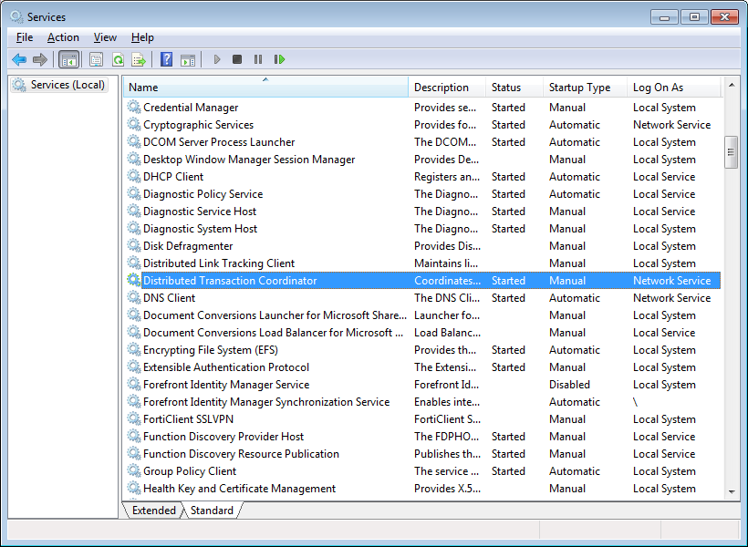

# 第六章做出改变

## 插入、更新和删除

除了查询，您还需要进行更改。因为 NHibernate 使用概念验证来表示数据库中的记录，所以当您需要插入新记录时，可以从创建映射类的新实例开始:

```cs
      Product p = new Product() { Name = "NHibernate Succinctly", Price = 0 };

```

然后，你告诉 NHibernate 坚持下去:

```cs
      session.Save(p);

```

如果您希望将关联与根聚合一起存储，则必须首先获取对它们的引用:

```cs
      Post post = new Post();
      post.Blog = session.Get<Post>(1);

```

在这种关联中，真正重要的是外键；您还不如加载一个代理，这样做的好处是不需要实际访问数据库:

```cs
      //or get a proxy, no need to go to the database if we only need the foreign key
      post.Blog = session.Load<Post>(1);

```

但是，在这种情况下，如果引用的实体不存在，当 NHibernate 尝试保存根聚合时，将引发异常。

在双向关联的情况下，如果要立即与实体合作，建议您填充关系的两端，以实现一致性:

```cs
      Post post = new Post();
      post.Blog = session.Get<Blog>(1);
      post.Blog.Posts.Add(post);

```

为了方便起见，您可以向 Blog 类添加一个简单的方法来挂接两个端点:

```cs
      public void AddPost(Post post)
      {
        post.Blog = this;
        this.Posts.Add(post);
      }

```

根据您的会话配置，这可能是也可能不是全部。(在下一节“刷新更改”中会有更多相关信息。)

NHibernate 在其**isesession**中实现了一级缓存。这意味着，它加载或标记为保存的所有实体都存储在内存缓存中。对于这些实体中的每一个，当它被加载时，NHibernate 获取其初始状态的快照并将其存储在内部。当需要持久化对数据库的更改时，NHibernate 将检查其一级缓存中的所有实体的当前属性值，并将检测那些属性已更改的实体。这被称为变更跟踪，这样的实体被称为脏的。脏会话至少包含一个脏实体。

因为变更跟踪是自动的，所以通常不需要显式更新实体。但是**iseses**有一个**更新**方法，你可以调用它来强制更新:

```cs
      session.Update(p);

```

并且，如果您需要从数据库中删除一个实体，您可以在这个实体上调用会话的 **Delete** 方法:

```cs
      session.Delete(p);

```

最后，当您有一个带有已加载集合(一对多或多对多)的实体，并且您想要移除它的所有元素时，而不是逐个迭代并调用 **Delete** ，您可以只调用集合属性上的 **Clear** :

```cs
      Blog blog = session.Get<Blog>(1);
      blog.Posts.Clear();

```

NHibernate 将为所有子记录发出一个 DELETE 语句。

注意:只能对被跟踪的实体调用**删除**；也就是说，通过调用**保存**，从数据库中加载或显式添加到数据库中的文件。执行此操作后，您不应再访问此实体实例，因为您对它所做的任何事情都不会阻止它被删除。

每当刷新会话时，NHibernate 都会通过发出适当的 SQL 命令来存储、更新或删除数据库中的每个实体。简而言之，这意味着:

*   新实体需要通过调用**保存**明确标记保存。
*   现有的被跟踪实体将自动检测对它们所做的更改。不需要显式标记它们进行更新；也就是说，不需要调用任何方法。
*   如果不确定某个实体是否已经保存，可以调用【saved 或 update。
*   您可以通过在被跟踪的实体上显式调用**删除**来删除该实体。

## 潮红变化

NHibernate 何时知道是时候将所有更改从一级缓存保存到数据库中了(换句话说，刷新)？这取决于当前**对话**的冲洗模式(冲洗模式**属性)。这是控制何时发生的**冲水模式**。可能的选项有:**

 ***   **始终** : NHibernate 将在发出任何查询之前以及在调用**保存**或**删除**方法之后立即保留脏实体。
*   **Auto** :如果正在对某个实体发出查询，并且存在相同类型的脏实体，NHibernate 将向数据库发送更改。
*   **提交**:只有当前事务提交时才会进行刷新。
*   **永不**:你需要在当前**iseses**上明确调用**同花顺**。
*   **未指定**:默认，与**自动**相同。

一些注意事项:

*   您通常应该避免**总是**，因为它可能会减慢 NHibernate 的速度，因为它需要在发出任何查询之前检查一级缓存。
*   **Never** 也是要避免的，因为有可能你会忘记调用**同花顺**，所有的改动都会丢失。
*   **提交**和**自动**都可以。**提交**更好，因为它迫使你使用事务(这是最佳实践)。

## 更新断开的实体

如果您有一个在不同会话中加载的实体，并且希望能够在另一个会话中更改或删除它，会发生什么情况？另一个会话对此实体一无所知；它不在其一级缓存中，因此，从它的角度来看，它是一个未被跟踪或断开连接的实体。

你有两个选择:

1.  用数据库中相关记录的当前值更新内存实体，然后应用更改:

    ```cs
              Product product;

              using (ISession session = sessionFactory.OpenSession())
              {
                //load some entity and store it somewhere with a greater scope than this session
                product = session.Query<Product>().First();
              }

              using (ISession session = sessionFactory.OpenSession())
              {
                //retrieve current values from the database before making changes
                product = session.Merge<Product>(product);
                product.Price = 10;
                session.Flush();
              }

    ```

2.  强制保留实体的当前值，忽略数据库中的当前值:

```cs
      using (ISession session = sessionFactory.OpenSession())
      {
        //save current entity properties to the database without an additional select
        product.Price = 10;
        session.SaveOrUpdateCopy(product);
        session.Flush();
      }

```

## 从一级缓存中移除

长期存在的 NHibernate 会话通常最终会有许多实体需要跟踪——那些从查询中加载的实体。这最终可能会导致性能问题，因为当刷新时间到来时，会话有很多实例和值要检查是否肮脏。

当不再需要跟踪实体时，可以调用**isesession。驱逐**将其从缓存中移除:

```cs
      session.Evict(product);

```

或者，您可以清除整个会话:

```cs
      session.Clear();

```

|  | 提示:这将丢失所有被跟踪的实体以及它们可能具有的任何更改，因此请谨慎使用。 |

```cs
      session.SetReadOnly(product, true);

```

|  | 注意:在以后的任何阶段，如果实体仍然被跟踪，您总是可以通过使用 false 参数再次调用 SetReadOnly 来恢复它。 |

## 可执行 HQL

NHibernate 还通过使用 HQL API 支持批量 DML 操作。这称为可执行 HQL，支持插入、更新和删除:

```cs
      //unconditional update
      Int32 updatedRecords = session.CreateQuery("update Product p set p.Price = p.Price * 2")
      .ExecuteUpdate();

      //delete with parameter
      Int32 deletedRecords = session.CreateQuery("delete from Product p where p.Price = :price")
      .SetParameter("price", 0).ExecuteUpdate();
      >//delete from query
      Int32 deletedRecords = session.Delete("from Product p where p.Price = 0");

      >//insert based on existing records
      Int32 insertedRecords = session.CreateQuery(
      "insert into Product (ProductId, Name, Price, Specification) select p.ProductId * 10, p.Name + ' copy', p.Price * 2, p.Specification from Product p").ExecuteUpdate();                     

```

NHibernate 不会对一级缓存中存在的实体进行更改；也就是说，如果您已经加载了一个实体，然后使用 HQL 修改或删除它。这个实体对此一无所知。如果您已经用 HQL 删除了它，并且稍后尝试保存它，将会出现错误，因为没有要更新的记录。

请注意:您通常不必考虑标识符生成模式。但是，如果您打算使用 HQL 插入记录，并且不使用身份生成模式，那么您需要自己生成身份。在本例中，我们从已经存在的条目中创建它们，因为您只能从从**选择**返回的记录中插入 HQL。

## 探测变化

**isesession**的**是属性**将告诉您是否有标记为保存的新实体、标记为删除的实体，或者与从数据库中加载时相比，某些属性的值发生了变化的已加载实体。

您可以使用 NHibernate 应用编程接口自己检查一级缓存中的实体:

```cs
      >//enumerate all entities in the first level cache
      public static IEnumerable<T> Local<T>(this ISession session, Status status = Status.Loaded)
      {
        var impl = session.GetSessionImplementation();
        var pc = impl.PersistenceContext;

        foreach (T key in pc.EntityEntries.Keys.OfType<T>())
        {
          var entry = pc.EntityEntries[key] as EntityEntry;

          if (entry.Status == status)
          {
            yield return (key);
          }
        }
      }

```

如果您已经加载了很多实体，并且需要找到一个特定的实体，那么这个扩展方法可能会派上用场。在转到数据库之前，您可以先在一级缓存中查找它。或者您可以找到具有特定状态的实体，例如**已删除**。

因为 NHibernate 存储实体的所有映射属性的原始值，所以您可以查看它们以查看发生了什么变化:

```cs
      //find dirty properties for a loaded entity public static Dictionary<String, Object> GetDirtyProperties<T>(this ISession session, T entity)
      {
        var sessionImpl = session.GetSessionImplementation();
        var context = sessionImpl.PersistenceContext;
        var entry = context.GetEntry(context.Unproxy(entity));

        if ((entry == null) || (entry.RequiresDirtyCheck(entity) == false) || (entry.ExistsInDatabase == false) 
         || (entry.LoadedState == null))
        {
          //entity does not exist in the first level cache
          return (null);
        }

        var persister = entry.Persister;
        var propertyNames = persister.PropertyNames;
        var currentState = persister.GetPropertyValues(entity, sessionImpl.EntityMode);
        var loadedState = entry.LoadedState;
        var dp = (persister.EntityMetamodel.Properties
      .Where((property, i) => (LazyPropertyInitializer.UnfetchedProperty.Equals(loadedState[i]) == 
      false) && (property.Type.IsDirty(loadedState[i], currentState[i], sessionImpl) == true)))
      .ToArray();

        return 
          (dp.ToDictionary(x => x.Name, x => currentState[Array.IndexOf(propertyNames, x.Name)]));
      }

```

## 层叠变化

引用其他实体的实体，无论是直接引用(另一个实体类型的属性)还是集合，都可以将对自身所做的更改传播到这些引用。最明显的情况是:

*   保存根实体时，如果还没有保存它的所有引用，请保存它们(在相应的表中插入记录)。
*   删除父实体时，删除其所有子实体(从引用父记录的子表中删除记录)。
*   当被其他实体引用的实体被删除时，从所有这些实体中删除其引用(将主记录的外键设置为**空**)。

用 NHibernate 的话来说，这叫做级联。级联支持以下选项，这些选项可以通过代码、XML 或属性在映射中指定:

*   **分离** / **驱逐**:当子实体的父实体也被驱逐时，子实体被从会话中移除(驱逐)，通常是通过调用**isesession。驱逐**。
*   **合并** / **合并**:当父实体被合并到当前会话中时，通常由**isesession 执行。合并**，子代也合并。
*   **持久化** / **保存-更新**:当一个根实体即将被保存或更新时，它的子实体也会被保存或更新。
*   **重连** / **锁定**:当父实体被锁定时，也锁定其子实体。
*   **刷新** / **刷新**:父实体刷新时，也刷新其子实体。
*   **删除** / **删除**:删除父实体时删除子实体。
*   **无** / **无**:不做，这是默认。
*   **全部** / **全部**:同**坚持**、**去除**；所有未保存的子实体都会被保存，如果父实体被删除，它们也会被删除。
*   **删除孤儿** / **删除-孤儿**:如果一对多关系的子实体不再引用原始父实体或任何其他实体，请将其从数据库中删除。
*   **All****删除孤儿**/**All-delete-孤儿**:All**、**删除孤儿**的组合行为。**

 **级联可能很棘手。一些一般准则:

*   对于依赖于另一个实体存在的实体，使用**删除孤儿**，因为如果关系断开(您将属性设置为 **null** ，该实体不能单独存在，必须被删除。
*   对于集合，您通常会使用 **All (** 可能还会一起使用**delete annotals)**。如果您希望集合中的所有实体在它们的父级被保存和删除，或者如果您不希望它们与其父级一起被删除但希望它们被自动保存，请使用**持久化**。
*   对于多对一引用，您通常不希望**删除**，因为通常被引用的实体应该比引用它的实体活得更长；用**坚持**代替。

要应用代码级联，请使用以下示例(与代码映射一节中的映射相同):

```cs
          public class BlogMapping : ClassMapping<Blog>
          {
            public BlogMapping()
            {
              //…
              this.ManyToOne(x => x.Owner, x =>
              {
                x.Cascade(Cascade.Persist);
                //…
              });
              this.List(x => x.Posts, x =>
              {
                //…
                x.Cascade(Cascade.All | Cascade.DeleteOrphans);
              }, x =>
              {
          >      //…
              });
            }
          }

          public class PostMapping : ClassMapping<Post>
          {
            //…
            this.Set(x => x.Tags, x =>
            {
              //…
              x.Cascade(Cascade.All);
            }, x =>
            {
              //…
            });
            this.Set(x => x.Attachments, x =>
            {
              //…
              x.Cascade(Cascade.All | Cascade.DeleteOrphans);
            }, x =>
            {
          xml:lang="EN-GB">    //…
            });
            this.Bag(x => x.Comments, x =>
            {
              //…
              x.Cascade(Cascade.All | Cascade.DeleteOrphans);
            }, x =>
            {
              //…
            });
          }

```

对于 XML，它看起来像这样(同样，与 XML 映射中的映射相同):

```cs
          <hibernate-mapping namespace="Succinctly.Model" assembly="Succinctly.Model" 
          >
            <class name="Blog" lazy="true" table="`BLOG`">
              <!-- … ->
              <many-to-one name="Owner" column="`USER_ID`" not-null="true" lazy="no-proxy" 
          cascade="save-update"/>
              <list cascade="all-delete-orphan" inverse="true" lazy="true" name="Posts">
                <!-- … ->
              </list>
            </class>
          </hibernate-mapping>

          <hibernate-mapping namespace="Succinctly.Model" assembly="Succinctly.Model" 
          >
            <class name="Post" lazy="true" table="`POST`">
              <!-- … ->
              <set cascade="all" lazy="false" name="Tags" table="`TAG`" order-by="`TAG`">
                <!-- … ->
              </set>
              <set cascade="all-delete-orphan" inverse="true" lazy="true" name="Attachments">
                <!-- … ->
              </set>
              <bag cascade="all-delete-orphan" inverse="true" lazy="true" name="Comments">
                <!-- … ->
              </bag>
            </class>
          </hibernate-mapping>

```

最后，对于属性(完整映射请参见属性映射):

```cs
          public class Blog
          {
          >  //…
            [ManyToOne(0, Column = "user_id", NotNull = true, Lazy = Laziness.NoProxy, Name = "Owner",
          Cascade = "save-update")]
            public virtual User Owner { get; set; }
            //…
            [List(0, Cascade = "all-delete-orphan", Lazy =  CollectionLazy.True, Inverse = true, Generic = true)]
            public virtual IList<Post> Posts { get; protected set; }
          }

          public class Post
          {
            [Set(0, Name = "Tags", Table = "tag", OrderBy = "tag", Lazy = CollectionLazy.False, Cascade = "all"
          , Generic = true)]
            public virtual Iesi.Collections.Generic.ISet<String> Tags { get; protected set; }
            [Set(0, Name = "Attachments", Inverse = true, Lazy = CollectionLazy.True,
          Cascade = "all-delete-orphan", Generic = true)]
            public virtual Iesi.Collections.Generic.ISet<Attachment> Attachments { get; protected set; }
            [Bag(0, Name = "Comments", Inverse = true, Lazy = CollectionLazy.True, Generic = true, 
          Cascade = "all-delete-orphan")]
            public virtual IList<Comment> Comments { get; protected set; }
          }

```

一个例子就够了。假设你的实体没有使用级联，你必须手工保存所有东西:

```cs
          Blog b = new Blog() { Creation = new DateTime(2008, 8, 13), Name = "Development With A Dot" };
          b.Owner = new User() { Birthday = new DateTime(1975, 8, 19), Username = "ricardoperes" };
          b.Posts.Add(new Post() { Blog = b, Content = "Some Post", Title = "Some Title", Timestamp = DateTime.Now });

          session.Save(b.Owner);
          session.Save(b);
          session.Save(b.Posts.First());
          session.Flush();

```

然而，如果您为**所有者**和**发布了**博客**类的**属性设置了级联，那么对于根**博客**实例，您只需要调用**保存**一次，因为所有其他实体都可以从其访问(和级联):

```cs
          session.Save(b);
          session.Flush();

```

如果您需要删除某个**博客**实例，其所有**帖子**、相关**评论**和**附件**将同时被删除，但其**所有者**不会被删除。

```cs
          session.Delete(b);
          session.Flush();

```

## 交易

如您所知，当同时更改多个记录时，特别是如果一个更改依赖于另一个，我们需要使用事务。所有关系数据库都支持事务，NHibernate 也是如此。

NHibernate 中的事务有两种风格:

*   特定于 NHibernate 的事务，当它们被清晰地定界时是有用的；也就是说，我们知道它们应该何时开始和终止，并且应该只影响 NHibernate 的操作。
*   。NET 环境事务，当我们必须同时协调对多个数据库的访问或者登记到甚至可能是分布式的现有事务中时。

使用 NHibernate，无论何时对数据库进行更改，都应该有一个事务。请记住，并非所有的更改都是显式的。例如，已加载实体的更改可能会导致其在数据库中更新。如果你使用交易，你不会有任何不好的体验。无论何时使用事务，请将会话的刷新模式设置为适当的值:

```cs
          session.FlushMode = FlushMode.Commit;

```

这将导致 NHibernate 仅在(并且仅在)当前事务被提交时才向数据库发送更改。

事务应用编程接口可以这样使用:

```cs
          using (ISession session = sessionFactory.OpenSession())
          using (ITransaction tx = session.BeginTransaction())
          {
            session.FlushMode = FlushMode.Commit;

            >//make changes

            if (/* if everything is OK, commit */)
            {
              tx.Commit();
            }
            else
            {
              //otherwise, rollback (which is also done automatically if Commit is not called)
              tx.Rollback();
            }
          }

```

在事务下运行的**isesession**实例上执行的所有操作都会自动登记到其中；这包括显式保存、更新和删除、由于脏属性导致的自动更新、自定义 SQL 命令和可执行的 HQL 查询。

您可以检查事务的当前状态，甚至检查事务是否已启动:

```cs
          //the Transaction property of the ISession holds the current transaction    
          Boolean transactionActive = session.Transaction.IsActive;

          Boolean committed = tx.WasCommitted;
          Boolean rolledback = session.Transaction.WasRolledBack;

```

该应用编程接口的替代方案是**系统。交易**，。NET 的标准事务应用编程接口:

```cs
          using (TransactionScope tx = new TransactionScope())
          {
            using (ISession session1 = sessionFactory1.OpenSession())
            {
              session1.FlushMode = FlushMode.Commit;

              Product p = new Product() { Name = "A Name", Price = 5, Specification = XDocument.Parse("<data/>") };

              session1.Save(p);
            }

            using (ISession session2 = sessionFactory2.OpenSession())
            {
              session2.FlushMode = FlushMode.Commit;

              Product p = session2.Query<Product>().Where(x => x.Name == "Another Name").Single();

              session2.Delete(p);
            }

          >  //there is no Rollback method, if Complete is not called, the transaction is rolled back
            tx.Complete();
          }

```

NHibernate 和 System 事务都允许指定隔离级别:

```cs
          ITransaction tx = session.BeginTransaction(System.Data.IsolationLevel.Serializable);

          new TransactionScope(TransactionScopeOption.Required, new TransactionOptions() { 
          IsolationLevel = System.Transactions.IsolationLevel.Serializable });

```

请记住这一点:

*   随时使用它们！
*   无论是使用 NHibernate 还是系统事务，始终使用块在**中创建它们，以便自动处置它们。**
*   将会话的刷新模式设置为**提交**，以避免不必要的数据库访问。
*   当您完成更改并希望使其永久化时，请确保调用**提交**(在非货币事务上)或**完成**(在系统事务上)。
*   如果您要在一个系统事务中同时访问多个数据库，您必须启动**分布式事务协调器**服务，否则当您访问第二个数据库时，您可能会得到意外的异常:



图 24:分布式事务协调器服务

## 悲观锁定

有时，可能需要锁定一个表中的一个或多个记录，以便没有其他人可以在我们背后对它们进行修改。这被称为并发控制。不同的数据库对此使用不同的机制，但是 NHibernate 提供了独立的 API。锁定包括锁定模式，其值如下:

表 8

| 方式 | 描述 |
| **力** | 类似于**升级**，但是如果实体被版本化，会导致版本增加 |
| **无** | 未使用 |
| **读作** | 当在没有指定**锁定模式**的情况下读取实体时 |
| **升级** | 从未锁定切换到锁定；如果记录已经被锁定，将等待另一个锁被释放 |
| **升级无等待** | 与**相同升级**但是，如果记录已经被锁定，将立即返回，而不是等待另一个锁被释放(但是锁定模式将保持不变) |
| **写** | 当从当前会话插入实体时 |

锁定必须始终在事务的上下文中调用。NHibernate 总是将数据库中记录的锁定模式与其内存(一级缓存)表示同步。

为了在加载时锁定单个记录，我们可以向 **Get** 方法传递一个附加参数:

```cs
          Product p = session.Get<Product>(1, LockMode.Upgrade);

```

这将在 SQL Server 中生成以下 SQL:

```cs
          SELECT
          product0_.product_id,
          product0_.name,
          product0_.specification,
          product0_.price
          FROM
          product product0_
          WITH (UPDLOCK, ROWLOCK)
          WHERE
              product0_.product_id = 1

```

但是我们也可以在加载后锁定记录:

```cs
          session.Lock(p, LockMode.Upgrade);

```

这将导致发送该 SQL(请注意，它没有带来列):

```cs
          SELECT
          product0_.product_id,
          FROM
          product product0_
          WITH (UPDLOCK, ROWLOCK)
          WHERE
              product0_.product_id = 1

```

锁定查询结果(HQL、标准和查询结束)也是可能的:

```cs
          //hql
          session.CreateQuery("from Product p").SetLockMode("p", LockMode.Upgrade);

          >//criteria
          session.CreateCriteria(typeof(Product)).SetLockMode(LockMode.Upgrade).List<Product>();
          > 
          //query over
          session.QueryOver<Product>().Lock().Upgrade.List();

```

要获取记录的锁定状态:

```cs
          LockMode mode = session.GetCurrentLockMode(p);

```

每当锁定模式为**升级**、**升级无等待**、**写入**或**强制**时，您就知道记录被当前会话锁定。

|  | 提示:一般来说，记录级别的锁定是不可伸缩的，并且在本质上是断开连接和无状态的 web 应用的上下文中不是很有用。因此，您通常应该避免使用乐观锁定(接下来)。至少，请将您锁定的记录数量限制在尽可能少的范围内。 |

## 乐观并发

乐观并发是一个不涉及锁定的处理并发的过程。使用乐观锁定，我们假设没有人锁定记录，并且我们可以将之前加载的记录的全部或部分值与数据库中当前的值进行比较，以查看是否发生了变化(当发出更新时)。如果更新不影响任何记录，我们就知道确实发生了一些变化。

NHibernate 提供了几种乐观并发的可能性:

*   无:不会处理乐观锁定，通常称为“最后一个获胜”这是默认设置。
*   脏:所有脏的(即已更改的)映射属性都与其在数据库中的当前值进行比较。
*   全部:将所有可变映射属性与当前值进行比较。
*   版本化:表中的一列用于比较。

当我们使用版本控制时，我们还有几种获取和更新版本列的策略:

*   使用特定于数据库的机制，例如 SQL Server 的**TIMESTAMP**/**row version**([http://msdn.microsoft.com/en-us/library/ms182776.aspx](http://msdn.microsoft.com/en-us/library/ms182776.aspx))或 Oracle 的**ORA _ ROWSCN**([http://docs . Oracle . com/CD/b 19306 _ 01/Server . 102/b 14200/伪卷 007 . htm](http://docs.oracle.com/cd/B19306_01/server.102/b14200/pseudocolumns007.htm))；除了加载当前值之外，这不需要 NHibernate 做任何工作。
*   使用整数表示 NHibernate 必须显式更新的版本。
*   使用可以从数据库或从获得的日期和时间。NHibernate 也负责更新。

没有策略是默认的。如果我们想拥有**脏**或**全**，我们需要逐个实体进行配置。

在 XML 中:

```cs
          <hibernate-mapping namespace="Succinctly.Model" assembly="Succinctly.Model" 
          >
            <class name="Blog" lazy="true" table="`BLOG`" optimistic-lock="dirty" dynamic-update="true">
            <!-- … -->
            </class>
          </hibernate-mapping>

```

和属性:

```cs
          [Class(Table = "blog", Lazy = true, OptimisticLock = OptimisticLockMode.Dirty, DynamicUpdate = true)]
          public class Blog
          {
          >  //…
          }

```

不幸的是，到目前为止，代码映射不允许设置乐观锁定模式。但是您仍然可以通过在**配置**实例上编码来实现:

```cs
          cfg.GetClassMapping(typeof(Blog)).OptimisticLockMode = Versioning.OptimisticLock.Dirty;
          cfg.GetClassMapping(typeof(Blog)).DynamicUpdate = true;

```

在这种情况下，对**产品**实例中属性的更改将导致发出以下 SQL(在现实生活中，用参数代替数字):

```cs
          UPDATE product
          SET price = 10
          WHERE product_id = 1
          AND price = 5

```

如您所见，**`price = 5`**条件不是严格要求，但 NHibernate 发送是因为 **Dirty** 的乐观锁定模式，以及 **Price** 属性被更改。****

 ****就像我说的，不用**脏**，可以用**全**。无论哪种情况，还必须添加**动态更新**属性；这是一项要求。它的意思是，不是为每个映射的列发出一个 SET，而是只为值已更改的列发出一个 SET。你不必担心；不需要添加数据库中的其他列或模型中的属性。

对于相同的更新后的**产品**实例，当使用 **All** 作为乐观锁定模式时，SQL 将是:

```cs
          UPDATE product
          SET price = 10
          WHERE product_id = 1
          AND price = 5
          AND specification = /* ... */
          AND picture = /* ... */

```

如您所见，在这种情况下，所有列都会被比较，这可能会稍微慢一些。

至于版本化的列，我们需要在实体中添加一个新的属性来存储原始版本。它的类型取决于我们想要使用什么机制。例如，如果我们想使用 SQL Server 的 **ROWVERSION** ，我们会有一个如下定义的属性:

```cs
            public virtual Byte[] Version { get; protected set; }

```

我们将通过代码来映射它，就像这样(在**类映射<T>T1】或**模型映射**类中):**

```cs
            this.Version(x => x.Version, x =>
            {
              x.Column(y =>
              {
                y.NotNullable(true);
                y.Name("version");
                y.SqlType("ROWVERSION");
              });
              x.Insert(false);
              x.Generated(VersionGeneration.Always);
              x.Type(NHibernateUtil.BinaryBlob as IVersionType);
            });

```

我们必须告诉 NHibernate 始终让数据库为我们生成版本，在为实体插入记录时不要插入值，在为实体创建表时使用 SQL 类型 **ROWVERSION** ，并使用 NHibernate**binary blobtype**，一种允许版本控制的类型来处理该列的数据。

对于属性，它看起来是这样的:

```cs
            [Version(0, Name = "Version", Column = "version", Generated = VersionGeneration.Always, Insert = false, 
            TypeType = typeof(BinaryBlobType))]
            [Column(1, SqlType = "ROWVERSION")]
            public virtual Byte[] Version { get; protected set; }

```

最后，在 XML 中:

```cs
            <class name="Product" lazy="true" table="`product`">
              <!-- ... --><version name="Version" column="version" generated="always" insert="false" type="BinaryBlob"/>
            >  <!-- ... -->
            </class>

```

而对于甲骨文的 **ORA_ROWSCN** ，属性声明将改为:

```cs
            public virtual Int64[] Version { get; protected set; }

```

及其流畅的映射:

```cs
            this.Version(x => x.Version, x =>
            {
              x.Column(y =>
              {
                y.NotNullable(true);
                y.Name("ora_rowscn");
              });
              x.Insert(false);
              x.Generated(VersionGeneration.Always);
            });

```

属性映射:

```cs
            [Version(Name = "Version", Column = "ora_rowscn", Generated = VersionGeneration.Always, Insert = false)]
            public virtual Int64[] Version { get; protected set; }

```

最后，XML:

```cs
            <class name="Product" lazy="true" table="`product`">
              <!-- ... -->
              <version name="Version" column="ora_rowscn" generated="always" insert="false" />
              <!-- ... -->
            </class>

```

特定于数据库的策略非常好，因为它们利用了每个数据库的优化机制，并且版本列会自动更新。但是它们会降低我们代码的可移植性，并且在每次更新后需要一个额外的 SELECT 来找出记录有什么价值。

对于独立于数据库的策略，我们可以选择数字或日期/时间作为版本列。对于数字(默认的版本控制策略)，我们在类中添加一个整数属性:

```cs
            public virtual Int32[] Version { get; protected set; }

```

我们用代码映射它:

```cs
            this.Version(x => x.Version, x =>
            {
              x.Column(y =>
              {
                y.NotNullable(true);
                y.Name("version");
              });
            });

```

通过 XML:

```cs
            <class name="Product" lazy="true" table="`product`">
              <!-- ... -->
              <version name="Version" column="version" />
              <!-- ... -->
            </class>

```

或者通过属性:

```cs
            [Version(Name = "Version", Column = "version")]
            public virtual Int32[] Version { get; protected set; }

```

如果我们想使用日期/时间，我们需要添加一个类型属性并更改属性的类型:

```cs
            public virtual DateTime[] Version { get; protected set; }

```

我们需要更新映射来使用一个 **TimestampType** :

```cs
            this.Version(x => x.Version, x =>
            {
              x.Column(y =>
              {
                y.NotNullable(true);
                y.Name("version");
              });
              x.Type(NHibernateUtil.Timestamp as IVersionType);
            });

```

通过 XML:

```cs
            <class name="Product" lazy="true" table="`product`">
              <!-- ... -->
              <version name="Version" column="version" type="timestamp"/>
            >  <!-- ... -->
            </class>

```

和属性:

```cs
            [Version(Name = "Version", Column = "version", TypeType = typeof(TimestampType))]
            public virtual DateTime[] Version { get; protected set; }

```

一旦更新了乐观锁定策略，您的 UPDATE SQL 将如下所示(当然是用参数而不是文字):

```cs
            UPDATE product
            SET price = 10, version = 2
            WHERE product_id = 1
            AND version = 1

```

一般来说，每当我们更新一个实体时，它的版本都会增加，或者在日期和时间属性的情况下，会被设置为当前时间戳。但是我们可以在逐个属性的基础上指定在增加实体版本时是否应该考虑对它们所做的更改。这是通过属性的**乐观锁**属性来实现的，如您在 XML 中所见:

```cs
            <property name="Timestamp" column="`TIMESTAMP`" not-null="true" optimistic-lock="false" />

```

代码:

```cs
            this.Property(x => x.Timestamp, x =>
            {
              x.Column("timestamp");
              x.NotNullable(true);
              x.OptimisticLock(false);
            });

```

和属性映射:

```cs
            [Property(Name = "Timestamp", Column = "timestamp", NotNull = true, OptimisticLock = false)]
            public virtual DateTime Timestamp { get; set; }

```

每当更新的记录数不符合 NHibernate 的预期时，由于乐观并发检查，NHibernate 会抛出一个**statestateexception**。出现这种情况时，您别无选择，只能刷新实体并重试。

当我们可能同时对数据库表进行多次访问，并且显式锁定不切实际时，乐观锁定非常重要。例如，对于 web 应用。使用乐观锁定映射某个实体后，它的使用是透明的。但是，如果遇到数据库中的数据与为某个实体加载的数据不一致的情况，当 NHibernate 刷新它时，NHibernate 将引发异常。

至于它的许多选择，我给你一些提示:

*   一般来说，避免特定于数据库的策略，因为它们的可移植性较低，性能较差。
*   当不需要存储实际版本的列时，使用**脏**或**全**乐观锁定模式。
*   当知道记录最后一次更新的时间对您很重要，并且您不介意向表中添加额外的列时，请使用日期/时间版本。
*   最后，选择数字版本作为最标准的情况。

使用可执行 HQL 更新记录时，无论实际策略如何，都可以使用以下语法自动更新版本列:

```cs
            Int32 updatedRecords = session
            .CreateQuery("update versioned Product p set p.Price = p.Price * 2").ExecuteUpdate();

```

```cs
                UPDATE product
                SET price = 10
                WHERE product_id = 1
                AND price = 5
                AND specification = /* ... */
                AND picture = /* ... */

```

|  | 提示:千万不要手动更新版本栏。使用受保护的设置器来确保这一点。 |

## 批量插入

NHibernate 不是 ETL 工具，这意味着它不是为批量加载数据而设计的。话虽如此，这并不意味着不可能做到。但是，性能可能无法与其他解决方案相比。尽管如此，我们还是可以做一些事情来提供帮助。

首先，在现代数据库中，不需要一次插入一条记录。通常，这些引擎允许批处理，这意味着同时插入几条记录，从而最大限度地减少往返次数。可以猜到，NHibernate 支持插入批处理；你只需要告诉它使用它。使用贫嘴配置，我们设置了**批处理器**和**批处理器**属性:

```cs
            Configuration cfg = BuildConfiguration()
            .DataBaseIntegration(db =>
            {
              //...
              db.Batcher<SqlClientBatchingBatcherFactory>();
              db.BatchSize = 100;
            })

```

|  | 提示:您需要添加对 NHibernate 的引用。SqlClientBatchingBatcherFactory 类的 AdoNet 命名空间。 |

或者，如果您喜欢使用 XML 配置，请将以下属性添加到您的**应用/网络配置**中:

```cs
            <session-factory>
              <!-- ... -->
              <property name="adonet.factory_class">
            NHibernate.AdoNet.SqlClientBatchingBatcherFactory, NHibernate</property>
              <property name="adonet.batch_size">100</property>
            </session-factory>

```

存在用于 SQL Server 和 Oracle 的批处理程序工厂；后者的一个叫做**oracledataclientbatchingsbatcherfactory**。当然也有可能在其他引擎上实现，事实上有些人已经实现了。这是一个实施**IBatcher 工厂**和 **IBatcher** 的问题。当然，这并不简单，但还是有可能的。

**批处理大小** / **批处理大小**属性的含义是，插入记录时，NHibernate 应该一次插入 100 条记录，而不是一条一条地插入。

例如，在启用和未启用批处理的情况下，尝试以下示例(将**批处理大小**设置为 **0** ，并删除配置中的**批处理程序**声明):

```cs
            Stopwatch watch = new Stopwatch();
            watch.Start();

            using (ISession session = sessionFactory.OpenSession())
            using (session.BeginTransaction())
            {
              for (Int32 i = 0; i < 1000; ++i)
              {
                session.Save(new Product() { Name = String.Format("Product {0}", i), Price = (i + 1) * 10, 
            Specification = XDocument.Parse("<data/>") });

                if ((i % 100) == 0)
                {
                  session.Flush();
                  session.Clear();
                }
              }

              session.Transaction.Commit();
            }

            Int64 time = watch.ElapsedMilliseconds;

```

NHibernate 有一个轻量级的替代常规会话，称为无状态会话。无状态会话是从会话工厂构建的，有一些缺点:

*   没有一级缓存，这意味着无状态会话不知道发生了什么变化。
*   不支持级联。
*   不支持延迟加载。
*   对插入和更新的细粒度控制。
*   不冲洗；命令会立即发送。
*   不会引发任何事件。

无状态会话的相同示例如下所示:

```cs
            using (IStatelessSession session = sessionFactory.OpenStatelessSession())
            using (session.BeginTransaction())
            {
              for (Int32 i = 0; i < 1000; ++i)
              {
                session.Insert(new Product() { Name = String.Format("Product {0}", i), Price = (i + 1) * 10, 
            Specification = XDocument.Parse("<data/>") });
              }

              session.Transaction.Commit();
            }

```********