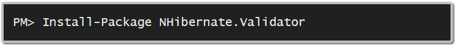

# 第九章验证

## NHibernate 验证器

适当的数据框架允许您根据业务规则和无效值来验证实体。NHibernate Validator 可以精确地用于此。它是一个通用的验证框架，与 NHibernate 紧密集成。

最好的方法是通过 NuGet as [NHibernate。验证器](https://nuget.org/packages/NHibernate.Validator):



另一种方法是从 SourceForge 下载:http://sourceforge.net/projects/nhcontrib/files/NHibernate.验证器。

也可以从 GitHub 获得源代码:[https://github.com/darioquintana/NHibernate-Validator](https://github.com/darioquintana/NHibernate-Validator)。

设置好之后，您必须决定如何应用验证。NHibernate 验证程序支持配置验证:

*   按属性。
*   通过 XML。
*   通过代码。

你看，NHibernate 世界的一些事情永远不会改变！

要使用 NHibernate Validator，我们需要设置框架与 NHibernate 一起工作。这是通过一个监听器来实现的，该监听器在实体将要被保存或更新时对其执行验证。如果发生任何验证错误，将引发**无效状态异常**。你可以打电话给它的**getinvalivalues()**来找出到底是哪里出了问题并解决它。

在构建任何会话工厂之前，我们将 NHibernate 验证器与 NHibernate **配置**实例集成在一起。下面展示了如何使用贫嘴配置来实现:

```cs
            FluentConfiguration validatorConfiguration = new FluentConfiguration();
            validatorConfiguration.SetDefaultValidatorMode(ValidatorMode.UseExternal)
            .IntegrateWithNHibernate.ApplyingDDLConstraints().RegisteringListeners();

            NHibernate.Validator.Cfg.Environment.SharedEngineProvider = new NHibernateSharedEngineProvider();

            ValidatorEngine validatorEngine = NHibernate.Validator.Cfg.Environment.SharedEngineProvider.GetEngine();
            validatorEngine.Configure(validatorConfiguration);

            cfg.Initialize(validatorEngine);

```

|  | 提示:为 NHibernate 添加使用语句。验证器。验证器和 NHibernate。验证器。引擎名称空间。 |

但是也可以用 XML 配置来做；只需确保将以下内容添加到您的**应用程序/网络配置**文件中:

```cs
            <configuration>
              <configSections>
                <!-- … -->
                <section name="nhv-configuration" type="NHibernate.Validator.Cfg.ConfigurationSectionHandler, NHibernate.Validator" />
              </configSections>
              <nhv-configuration >
                <property name="apply_to_ddl">true</property>
                <property name="autoregister_listeners">true</property>
                <property name="default_validator_mode">UseExternal</property>
                <mapping assembly="Succinctly.Model"/>
              </nhv-configuration>
              <!-- … -->
            </configuration>

```

并包含以下代码:

```cs
            XmlConfiguration xmlConfiguration = new XmlConfiguration();

            ValidatorEngine validatorEngine = NHibernate.Validator.Cfg.Environment.SharedEngineProvider.GetEngine();
            validatorEngine.Configure(validatorConfiguration);

            cfg.Initialize(validatorEngine);

```

如果您愿意，您还可以为 NHibernate 验证器 XML 提供智能感知。如果您从 NuGet 添加了 NHibernate 验证器，只需从**包中复制 **nhv-configuration.xsd** 和 **nhv-mapping.xsd** 文件\NHibernate。validator . 1 . 3 . 2 . 4000 \ lib \ Net35**文件夹到**C:\ Program Files(x86)\ Microsoft Visual Studio 10.0 \ Xml \ schemass**或**C:\ Program Files(x86)\ Microsoft Visual Studio 11.0 \ Xml \ schemass**，具体取决于您的 Visual Studio 版本。有关这方面的更多信息，请参见 XML 配置。如果您没有使用 NuGet，您将不得不从发行版中提取这些文件。zip 文件或源 GitHub 存储库。

接下来，我们需要为我们的实体配置验证。首先，使用代码:

```cs
            FluentConfiguration validatorConfiguration = new FluentConfiguration();
            validatorConfiguration.Register(new CustomerValidation()).SetDefaultValidatorMode(ValidatorMode.UseAttribute)
            .IntegrateWithNHibernate.ApplyingDDLConstraints().RegisteringListeners();

```

**客户整合**类继承自 **NHibernate。验证器。验证定义< T >** ，定义如下:

```cs
            public class CustomerValidation : ValidationDef<Customer>
            {
              public CustomerValidation()
              {
                this.ValidateInstance.By((customer, context) => customer.Address != null && >/* something else */ )
            .WithMessage("The customer address is mandatory");
                this.Define(x => x.Name).NotNullableAndNotEmpty().WithMessage("The customer name is mandatory");
                this.Define(x => x.Name).MaxLength(50).WithMessage("The customer name can only have 50 characters");
                this.Define(x => x.Email).NotNullableAndNotEmpty().WithMessage("The customer email is mandatory");
                this.Define(x => x.Email).MaxLength(50).WithMessage("The customer email can only have 50 characters");
                this.Define(x => x.Email).IsEmail().WithMessage("The customer email must be a valid email adddress");
              }
            }

```

同样的规则，除了 **ValidateInstanceBy** 自定义验证可以这样定义属性:

```cs
            public class Customer
            {
              [NotNullNotEmpty(Message = "The customer name is mandatory")]
              [Length(Max = 50, Message = "The customer name can only have 50 characters")]
              public virtual String Name { get; set; }

              [NotNullNotEmpty(Message = "The customer email is mandatory")]
              [Email(Message = "The customer email must be a valid email adddress")]
              [Length(Max = 50, Message = "The customer email can only have 50 characters")]
              public virtual String Email { get; set; }

              [NotNull(Message = "The customer address is mandatory")]
              public virtual Address Address { get; set; }
            }

```

|  | 提示:您需要引用命名空间 nhibernate . validator . constraints |

您必须更改验证器配置以使用属性:

```cs
            FluentConfiguration validatorConfiguration = new FluentConfiguration();
            validatorConfiguration.SetDefaultValidatorMode(ValidatorMode.UseAttribute)
            .IntegrateWithNHibernate.ApplyingDDLConstraints().RegisteringListeners();

```

最后，要使用 XML，您需要添加一个名为 **Customer.nhv.xml** 的文件，将其放在与 **Customer** 类相同的位置，并将其标记为嵌入式资源，就像我们在 XML Mappings 上看到的那样:

```cs
            <?xml version="1.0" encoding="utf-8" ?>
            <nhv-mapping namespace="Succinctly.Model" assembly="Succinctly.Model"
            >
              <class name="Customer">
                <property name="Name">
                  <length max="50" message="The customer name can only have 50 characters"/>
                  <notnull-notempty message="The customer name is mandatory"/>
                </property>
                <property name="Email">
                  <length max="50" message="The customer email can only have 50 characters"/>
                  <notnull-notempty message="The customer email is mandatory"/>
                  <email message="The customer email must be a valid email adddress"/>
                </property>
                <property name="Address">
                  <not-null message="The customer address is mandatory"/>
                </property>
              </class>
            </nhv-mapping>

```

您还必须告诉 NHibernate Validator 显式地查找嵌入式资源:

```cs
            FluentConfiguration validatorConfiguration = new FluentConfiguration();
            validatorConfiguration.Register(new [] { typeof(Customer) })
            .SetDefaultValidatorMode(ValidatorMode.UseExternal)
            .IntegrateWithNHibernate.ApplyingDDLConstraints().RegisteringListeners();

```

对于某些属性，我们使用内置的验证机制，如**notnullable 和 NotEmpty** 和 **IsEmail** ，而在其他情况下，我们执行自定义检查(参考**地址**)。现成的验证器包括:

表 10:包含的验证器

| 验证器 | 类型 | 描述 |
| **位数字** / **位数字** / **分米****十进制数** | 数字，字符串 | 验证最大位数/位数和小数位数 |
| **filepathexits**/**fileexits** | 用线串 | 检查文件路径是否存在 |
| **更大更低请求至** / **分钟** | 数字 | 检查数字是否大于或等于给定值 |
| **has valid elements**/**is valid** | 收集 | 检查集合的所有元素是否递归有效 |
| **包括介于** / **范围之间的** | 数字 | 检查一个数字是否包含在一个范围内 |
| **认证标准编号**؛**信用卡号** | 用线串 | 检查字符串是否与信用卡号匹配 |
| **IsEAN** / **ean** | 数字，字符串 | 检查字符串或数字是否与 EAN 匹配 |
| **IsEmail** / **email** | 用线串 | 检查字符串是否是有效的电子邮件地址 |
| **IsFalse** / **断言 false** | 布尔运算 | 检查布尔值是否为假 |
| **IsIBAN** / **本来** | 用线串 | 检查字符串是否是有效的 IBAN |
| **是未来** / **未来** | 日期和时间 | 检查日期是否在未来 |
| **过去了** / **过去了** | 日期和时间 | 检查日期是否在过去 |
| **IsIP** / **ipaddress** | 用线串 | 检查字符串是否是有效的 IP 地址 |
| **是数字/数字** | 用线串 | 检查字符串是否是有效的数字 |
| **指示** / **断言 true** | 布尔运算 | 检查布尔值是否为真 |
| **有效** / **有效** | 实体 | 递归检查实体是否有效 |
| **长度介于** / **长度之间** | 用线串 | 检查字符串的长度是否包含在给定的限制内 |
| **小于或等于** / **最大** | 数字 | 检查数字是否小于或等于给定值 |
| **搭配** / **图案** | 用线串 | 检查字符串是否与正则表达式匹配 |
| **最大长度** / **长度** | 用线串 | 检查字符串的最大长度 |
| **最大尺寸** / **尺寸** | 收集 | 检查集合的最大大小 |
| **最小长度** / **长度** | 用线串 | 检查字符串的最小长度 |
| **明尺寸** / **尺寸** | 收集 | 检查集合的最小大小 |
| **注意空** / **不空** | 字符串、集合、GUIDs | 检查字符串/集合/GUID 是否不为空 |
| **不可空** / **不可空** | 任何的 | 检查值是否不为空 |
| **注意事项** /**notnull-notempty** | 字符串，集合 | 检查字符串/集合是否不为空并包含值 |
| **满足** | 任何的 | 自定义规则，如 lambda 表达式 |
| **尺寸介于** / **尺寸之间** | 收集 | 检查集合的大小是否包含在给定的限制内 |
| **怀蒂斯** / **范围** | 数字 | 检查一个数字是否包含在一个范围内(不包括) |

其中一些验证可以在数据库上以字符串最大长度的形式和检查约束的形式实现。在这种情况下，如果使用**ApplyingDDLConstraints**/**apply _ to _ DDL**选项将 NHibernate Validator 与 NHibernate 集成在一起，当模型生成时，它将包括这些检查。

最后，您可以通过从**embeddedreargsattribute**继承并实现几个接口来实现自己的属性:

```cs
            [AttributeUsage(AttributeTargets.Property, AllowMultiple = false, Inherited = true)]
            public sealed class IsEvenAttribute : EmbeddedRuleArgsAttribute, IRuleArgs, IValidator, 
            IPropertyConstraint
            {
              public IsEvenAttribute()
              {
                this.Message = "Number is odd"; 
              }

              public String Message { get; set; }

              public Boolean IsValid(Object value, IConstraintValidatorContext constraintValidatorContext)
              {
                Int32 number = Convert.ToInt32(value);

                return ((number % 2) == 0);
              }

              public void Apply(Property property)
              {
                Column column = property.ColumnIterator.OfType<Column>().First();
                column.CheckConstraint = String.Format("({0} % 2 = 0)", column.Name);
              }
            }

```

该验证程序检查一个数字是否为偶数，甚至可以更改应用该数字的属性，以便在数据库级别添加该检查。这就是**ipropertycontrant**的作用，您不必实现它，因为有时，验证不能用数据库术语轻松表达。

要通过 XML 添加属性，请向引用您的自定义属性的 **Customer.nhv.xml** 添加一个 **<规则>** 标签:

```cs
            <property name="SomeIntegerProperty">
              <rule attribute="IsEvenAttribute">
                <param name="Message" value="Number is odd"/>
              </rule>
            </property>

```

最后，让我这样说:当 NHibernate 试图保存一个附加了验证的实体时，会发生验证，但是您也可以显式验证:

```cs
            InvalidValue[] invalidValuesObtainedExplicitly = validatorEngine.Validate(entity);

```

仅此而已。快乐验证！