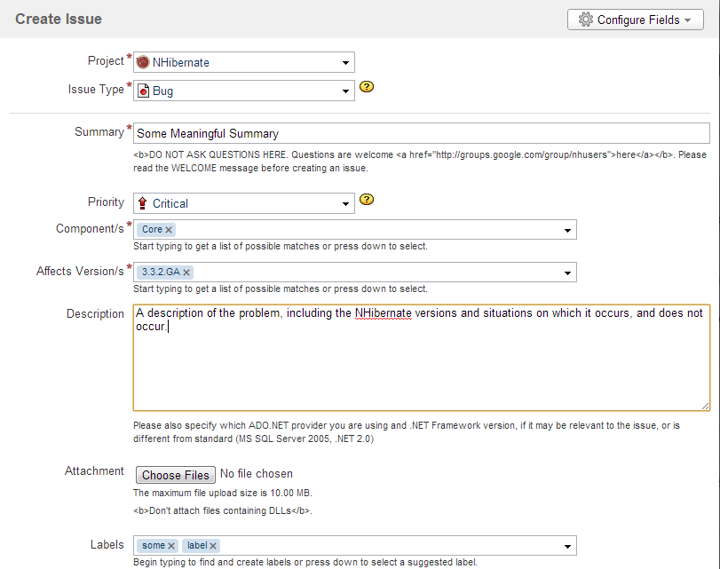
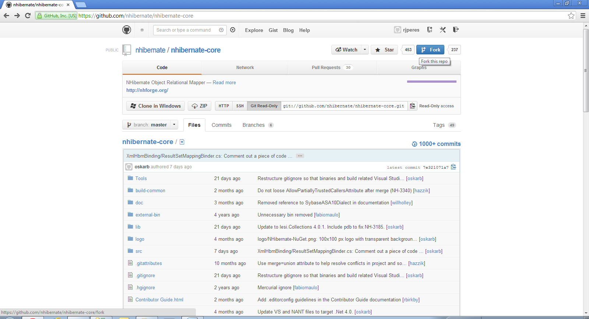
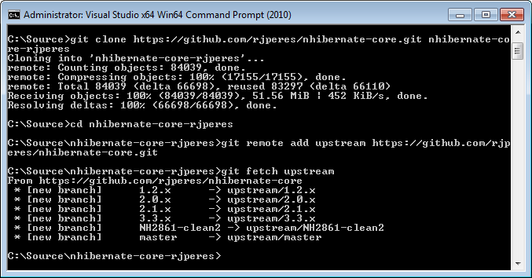
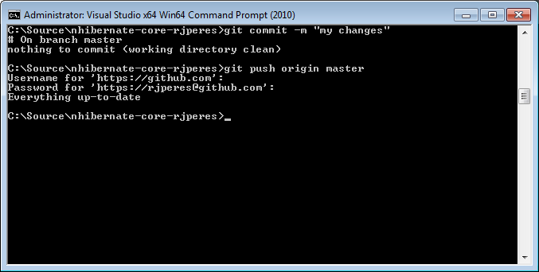

# 十五、附加参考文献

## nhibilized forge

NHibernate Forge 可以在[http://nhforge.org](http://nhforge.org)找到；它是所有与 NHibernate 相关的信息的中心点。在这里，您可以找到新版本的公告、博客和维基帖子，以及官方应用编程接口参考文档的链接。不幸的是，它并不总是最新的，但它仍然是一个有价值的信息来源。

## 伊比利亚参考

NHibernate 参考是关于 NHibernate 使用和配置的最终信息来源。你可以在[http://nhforge.org/doc/nh/en](http://nhforge.org/doc/nh/en)找到它。

## NHibernate 验证器文档

在以下网址找到 NHibernate 验证器的参考文档:http://nhforge . org/wikis/Validator/NHibernate-Validator-1-0-0-documentation . aspx。

## 非伊比利亚用户

很可能你在使用 NHibernate 时会遇到问题，或者你不知道做某事的最佳方法。在这种情况下，你可以求助于 NHibernate 用户社区，这是一个由谷歌集团托管的邮件列表(提供网络界面:[https://groups.google.com/forum/?fromgroups#!forum/nhusers](https://groups.google.com/forum/?fromgroups%23!forum/nhusers))。在这里，您会发现许多用户每天都在使用 NHibernate，他们可能会帮助您。

## 伊比利亚发展

如果你需要联系 NHibernate 的作者来讨论 NHibernate 的实现，这里有一个 NHibernate 开发社区，也在 Google group:[https://groups.google.com/forum/?托管 fromgroups#！论坛/nhibernate-development](https://groups.google.com/forum/?fromgroups%23!forum/nhibernate-development) 。您通常不会在这里找到解决当前问题的方法，相反，您可以从开发人员之间的对话中学习，或者您可以与实际构建它们的人讨论特性。

## 未开化的支尔格

https://nhibernate.jira.com 的 NHibernate JIRA 是填写 bug 报告、提出改进建议或查找现有问题的地方。如果您要提交一份错误报告，请尽可能详细地填写，并确保您在所有字段中仔细填写了适当的值。

图 26: JIRA 界面

更好的是，包含一个简单的单元测试来展示你所面临的问题。你会在这个维基贴子上找到写好单元测试的指导方针:[http://nhforge . org/blogs/nhibernate/archive/2008/10/04/解决-nhibernate-bug-submit-good-unit-test . aspx](http://nhforge.org/blogs/nhibernate/archive/2008/10/04/the-best-way-to-solve-nhibernate-bugs-submit-good-unit-test.aspx)。在[http://nhforge.org/media/p/70.aspx](http://nhforge.org/media/p/70.aspx)有一个测试项目。

## NHibernate 源代码

NHibernate 的源代码可以在 https://github.com/nhibernate/nhibernate-core 的 GitHub 上找到。

## NHibernate 验证器源代码

NHibernate Validator 源代码也可以在 GitHub 上获得，由达里奥·金塔纳([@达里奥·金塔纳](http://www.twitter.com/darioquintana))在[https://github.com/darioquintana/NHibernate-Validator](https://github.com/darioquintana/NHibernate-Validator)维护。

## 伊比利亚陷阱指数

我在我的博客上保留了我自己的常见 NHibernate 陷阱和推荐列表，位于 http://weblogs.asp.net/ricardoperes**。**看一看，分享你的想法、问题和更正。

## 为伊比利亚做出贡献

一旦你熟悉了 NHibernate，包括它的源代码，你可能会觉得你可以给 NHibernate 带来一些新的东西，要么修复现有的 bug，要么实现新的功能。这很好，因为 NHibernate 是一个有这种想法的社区的产物。你可以自由尝试并为此做出贡献。为此，您必须遵循以下步骤:

1.  如果您还没有 JIRA 国家广播电台的帐户，请创建一个。
2.  如果问题还不存在，为你正在尝试解决或改进的问题创建一个问题(包括说明情况的单元测试)。
3.  阅读[https://github . com/nhibernate/nhibernate-core/blob/master/Contributor % 20 Guide . html](https://github.com/nhibernate/nhibernate-core/blob/master/Contributor%20Guide.html)上提供的投稿指南。
4.  Fork the **nhibernate-core** repository from the GitHub web interface:

    

    图 27:创建拉取请求

5.  Clone the forked source code to your development machine from the command line:

    

    图 28:克隆存储库

6.  Run **ShowBuildMenu.bat** and select option **A** for setting up the development environment:

    

    图 29:设置初始 NHibernate 开发环境

7.  对代码进行更改，确保不要破坏任何东西。
8.  Commit your changes from the command line:

    

    图 30:提交变更

9.  Create a pull request from the web interface and fill in all required values:

    

    图 31:创建拉取请求

10.  Go to the JIRA issue and add a comment to it where you mention your proposed solution and the location of the pull request:

    

    图 32:在 JIRA 问题上提到拉取请求

11.  等待 NHibernate 团队中的某个人拿起它，测试它，并将您的更改与主干合并。