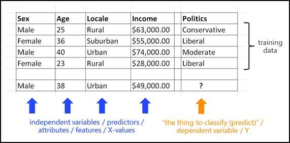
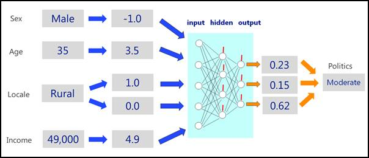
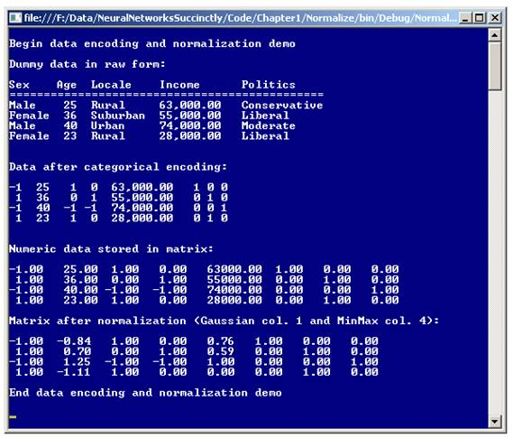

# 第一章神经网络

## 简介

人工神经网络(有时缩写为 ANN，或在上下文清楚时简称为“神经网络”)是一种软件系统，它松散地模拟生物神经元和突触。在确切解释神经网络如何工作之前，了解它们可以解决什么类型的问题是有用的。**图 1-a** 中的图像代表了一个典型的问题，可以使用神经网络来解决。



图 1-a:一个典型问题

这个问题的目标是根据一个人的性别、年龄、家庭所在地和年收入来预测他或她的政治倾向。对于那些神经网络新手来说，一个障碍是词汇差异很大。用于进行预测的变量可以称为独立变量、预测因子、属性、特征或 x 值。要预测的变量可以称为因变量、y 值或其他几个术语。

**图 1-a** 所示的问题类型称为分类问题，因为 y 值可以取三种可能的类值之一:保守、自由或适度。预测其他四个变量中的任何一个都是完全可能的。例如，这些数据可以用来根据一个人的性别、年龄、家庭所在地和政治倾向来预测他或她的收入。像这样的问题，其中 y 值是数字，通常被称为回归问题。

还有很多其他相关的问题场景，类似于**图 1-a** 所示的场景。例如，您可以有几百万个 x 值，每个 x 值代表一个人的照片中的像素值，还有一个 y 值代表图片的类别，例如“在安全观察列表中”或“不在观察列表中”。这种问题有时被称为图像识别问题。或者想象代表数字化音频信号的 x 值和代表诸如“你好”和“退出”等词汇的 y 值。这是语音识别。

神经网络不是魔术，需要已知 y 值的数据，称为训练数据。在**图 1-a** 中，只有四个训练项目。在现实场景中，你可能会有成百上千个训练项目。

**图 1-b** 中的图代表一个神经网络，预测一个 35 岁，生活在农村，年收入 49000.00 美元的男性的政治倾向。



图 1-b:神经网络

正如您将很快看到的，神经网络本质上是一个复杂的数学函数，它只理解数字。因此，使用神经网络的第一步是将非数字 x 数据(如性别和家庭位置)编码成数字数据。在**图 1-b** 中，“男性”编码为-1.0，“农村”编码为(1.0，0.0)。

除了对非数字 x 数据进行编码之外，在许多问题中，数字 x 数据被标准化，使得值的大小大致都在相同的范围内。在**图 1-b** 中，35 岁的年龄值归一化为 3.5，49000.00 美元的收入值归一化为 4.9。这个想法是，如果没有标准化，具有非常大数值的 x 变量可以支配具有小数值的 x 变量。

神经网络的心脏由中央盒表示。典型的神经网络有三级节点。输入节点保存 x 值。隐藏节点和输出节点执行处理。在**图 1-b** 中，输出值为(0.23，0.15，0.62)。这三个值大致分别代表保守、自由和温和的概率。因为与温和相关的 y 值最高，神经网络得出结论，35 岁的男性有温和的政治倾向。

**图 1-b** 中的虚拟神经网络有 5 个输入节点、4 个隐藏节点和 3 个输出节点。输入和输出节点的数量由问题数据的结构决定。但是隐藏节点的数量可能会有所不同，通常是通过反复试验找到的。请注意，神经网络有(5 * 4) + (4 * 3) = 32 条连接节点的线。每一行代表一个数值，例如-1.053 或 3.987，称为权重。此外，每个隐藏的输出节点(但不是输入节点)都有一个额外的特殊权重，如图中的红线所示。这些特殊的权重被称为偏差。

神经网络的输出值由输入值以及权重和偏差值决定。因此，当使用神经网络进行预测时，真正的问题是如何确定权重和偏差的值。这个过程叫做训练。

换句话说，训练神经网络包括找到一组权重和偏差的值，以便在提供训练数据时，计算的输出与已知的期望输出值紧密匹配。一旦网络已经被训练，具有未知 y 值的新数据可以被呈现并且可以进行预测。

这本书将向您展示如何使用 C#编程语言从头开始创建神经网络系统。你可以使用现有的神经网络应用，那么为什么还要创建自己的呢？至少有四个原因。首先，创建自己的神经网络可以让您完全控制系统，并允许您定制系统以满足特定的问题。第二，如果你学会了如何从头开始创建神经网络，你就充分了解了神经网络是如何工作的，这使你能够更有效地使用现有的神经网络应用。第三，您在创建神经网络时学习的许多编程技术可以用于其他编程场景。第四，你可能会发现创建神经网络既有趣又有趣。

## 数据编码和标准化

使用神经网络的关键之一是理解数据编码和标准化。看一下**图 1-c** 中一个演示程序的截图。演示程序首先设置四个假设的培训数据项，x 值代表人们的性别、年龄、家庭所在地和年收入，y 值代表政治倾向(保守、自由或温和)。第一行虚拟数据是:

男性 25 农村 63，000.00 保守

演示对非数字数据(性别、地区和政治)进行编码。使用了两种编码，非数值 x 值的效果编码和非数值 y 值的虚拟编码。得到的编码数据的第一行是:

-1 25 1 0 63,000.00 1 0 0

将所有数据转换为数值后，数据将存储在内存中的矩阵中并显示出来。接下来，演示对数值 x 值(年龄和收入)执行规范化。编码和标准化数据的第一行是:

-1.00 -0.84 1.00 0.00 0.76 1.00 0.00 0.00

演示使用了两种不同类型的标准化，年龄值的高斯标准化和收入值的最小-最大标准化。高斯归一化的值通常取-10.0 到+10.0 之间的值。最小-最大归一化值通常取 0.0 到 1.0 之间，或-1.0 到+1.0 之间的值。

演示程序使用了两种不同类型的规范化来说明这两种技术。在大多数实际情况下，您会对问题使用高斯或最小-最大归一化，但不会两者都使用。作为一般经验法则，最小-最大归一化比高斯归一化更常见。



图 1-c:数据编码和标准化

## 整体演示程序结构

为了创建演示程序，我打开了 Visual Studio，选择了 C#控制台应用项目模板，并将其命名为 Normalize。演示程序没有重大意义。NET 版本依赖，所以任何版本的 Visual Studio 都应该可以工作。在编辑器中加载模板代码后，在解决方案资源管理器窗口中，我将 Program.cs 文件重命名为描述性稍强的 NormalizeProgram.cs，Visual Studio 自动重命名了 Program 类。

在源代码的顶部，我删除了所有使用语句，除了引用顶层系统命名空间的语句。为了简化和易于重构，该演示是使用静态方法而不是面向对象的方法编写的。

演示程序的整体结构如**清单 1-a** 所示。方法高斯正态和最小极大正态对数值矩阵进行运算，并对矩阵的单个列进行归一化。方法 ShowMatrix 和 ShowData 只是方便助手，让 Main 方法更整洁一点。方法 EncodeFile 对文本文件进行操作，并对文件的指定列执行效果编码或虚拟编码。

方法效果编码和 DummyEncoding 是方法 EncodeFile 调用的助手。演示程序删除了所有正常的错误检查代码，以保持主要思想尽可能清晰。

```cs
    using System;
    namespace Normalize
    {
      class NormalizeProgram
      {
        static void Main(string[] args)
        {
          Console.WriteLine("\nBegin data encoding and normalization demo\n");

          // Set up raw source data.
          // Encode and display data.
          // Normalize and display data.

          Console.WriteLine("\nEnd data encoding and normalization demo\n");
          Console.ReadLine();
        }

        static void GaussNormal(double[][] data, int column) { . . }

        static void MinMaxNormal(double[][] data, int column) { . . }

        static void ShowMatrix(double[][] matrix, int decimals) { . . }

        static void ShowData(string[] rawData) { . . }

        static void EncodeFile(string originalFile, string encodedFile,
          int column, string encodingType) { . . }

        static string EffectsEncoding(int index, int N) { . . }

        static string DummyEncoding(int index, int N) { . . }

      } // Program class
    } // ns

```

清单 1-a:编码和标准化演示程序结构

所有程序控制逻辑都包含在方法 Main 中。方法定义开始于:

静态 void Main(字符串[]参数)

{

控制台。write line(" \ n 开始数据编码和规范化演示\ n ")；

字符串[] sourceData =新字符串[]{ 0

“性别年龄地区收入政治”，

"==============================================",

“男 25 农村 63000.00 保守”，

“女 36 郊区 55000.00 自由派”，

“男性 40 城市 74，000.00 中等”，

“女 23 农村 28000.00 自由党”}；

四行虚拟数据被分配给一个名为 sourceData 的字符串数组。为了可读性，每个字符串中的项目被人为地用多个空格隔开。接下来，演示通过调用助手方法 ShowData 来显示虚拟源数据:

控制台。WriteLine("原始形式的虚拟数据:\ n ")；

显示数据(源数据)；

助手显示方法定义如下:

静态 void ShowData(字符串[] rawData)

{

for(int I = 0；I

控制台。write line(RawDATa[I])；

控制台。write line(" ")；

}

接下来，演示程序手动设置并显示虚拟源数据的编码版本:

字符串[] encodedData =新字符串[]{ 0

"-1 25 1 0 63,000.00 1 0 0",

" 1 36 0 1 55,000.00 0 1 0",

"-1 40 -1 -1 74,000.00 0 0 1",

" 1 23 1 0 28,000.00 0 1 0" };

控制台。write line(" \ n 分类编码后的数据:\ n ")；

ShowData(编码数据)；

同样，这些项目被人为地用多个空格隔开。因为只有四行训练数据，所以数据是手工编码的。在大多数情况下，训练数据将在文本文件中，不会被手动编码，而是以两种方式之一编码。在文本文件中编码训练数据的第一种方法是在文本编辑器(如记事本)中使用复制和粘贴功能。这对于分类值相对较少(大约 10 行或更少)的相对较小的文件(比如少于 500 行)通常是可行的。

第二种方法是以编程方式在文本文件中编码数据。稍后将解释如何对非数字数据进行编码，以及如何以编程方式对存储在文本文件中的数据进行编码。

将所有非数字数据编码为数值后，将虚拟数据手动存储到矩阵中并显示:

控制台。write line(" \ n 矩阵中存储的数字数据:\ n ")；

double[][]numericData = new double[4][]；

numericData[0] = new double[] { -1，25.0，1，0，63000.00，1，0，0 }；

numericData[1] = new double[] { 1，36.0，0，1，55000.00，0，1，0 }；

numericData[2] = new double[] { -1，40.0，-1，-1，74000.00，0，0，1 }；

numericData[3] = new double[] { 1，23.0，1，0，28000.00，0，1，0 }；

ShowMatrix(数字数据，2)；

在大多数情况下，您的编码数据将位于文本文件中，并以编程方式加载到矩阵中，如下所示:

double[][] numericData = LoadData("..\ \ EncodedDataFile ")；

从文本文件加载矩阵的示例代码在[第 5 章](5.html#_Toc388609180)中给出并充分解释。定义了辅助方法 ShowMatrix:

静态空显示矩阵(双[][]矩阵，整数)

{

for(int I = 0；I

{

for(int j = 0；j

{

双 v =数学。Abs(矩阵[I][j])；

if(矩阵[i][j] >= 0.0)

控制台。写(" ")；

其他

控制台。写(“-”；

控制台。写(v.ToString("F" +小数)。pad right(5)+" ")；

}

控制台。write line(" ")；

}

}

神经网络系统广泛使用矩阵。即使你是一个有经验的程序员，除非你做过数值或科学编程，否则你可能不太熟悉矩阵的工作。这里，矩阵被定义为数组的数组。与许多编程语言不同，C#支持真正的多维数组风格的矩阵。例如:

double[，]矩阵=新 double[3，2]；// 3 行 2 列。

然而，对于神经网络系统，数组样式的矩阵更便于使用，因为每一行都可以作为单独的数组来引用。

Main 方法的结论是以编程方式规范化数据矩阵的年龄列和收入列(第 1 列和第 4 列):

高斯正常(数字数据，1)；

MinMaxNormal(数值数据，4)；

控制台。WriteLine(" \ n 规范化后的矩阵(高斯列 1" +)

"和 MinMax 第 4 栏):\ n ")；

ShowMatrix(数字数据，2)；

控制台。write line(" \ nAnD 数据编码和规范化演示\ n ")；

控制台。ReadLine()；

} // Main

在大多数情况下，数值 x 数据将使用高斯或最小最大值进行归一化，但不能同时使用两者。然而，在现实场景中，两种类型的规范化都用于数据集。

## 效果编码和虚拟编码

将非数字 y 数据编码为数值通常使用一种称为 1/1*N*虚拟编码的技术来完成。在演示中，要预测的 y 变量可以取三个值之一:保守、自由或适度。要对 *N* 非数值进行编码，可以使用 *N* 数值变量，如下所示:

保守派-> 1 0 0
自由派- > 0 1 0
温和派- > 0 0 1

你可以认为这三个值分别代表“保守”、“自由”和“温和”的数量。

虚拟编码关联的顺序是任意的，但是如果您想象每个项目都有一个索引(保守、自由和适度分别为 0、1 和 2)，请注意，项目 0 在位置 0 用 1 编码，在其他位置用 0 编码；项目 1 在位置 1 用 1 编码，在其他位置用 0 编码；项目 2 在位置 2 用 1 编码，在其他位置用 0 编码。因此，一般来说，I 项在 I 位置用 1 编码，在其他位置用 0 编码。

要预测的依赖 y 值只能取两个可能的分类值中的一个，如“男性”或“女性”，这种情况可以视为特例。您可以使用标准虚拟编码对这些值进行编码:

雄性-> 1 0
雌性- > 0 1

或者，您可以使用简单的 0-1 编码进行编码，如下所示:

男-> 1
女- > 0

不推荐的另一种方法是按照以下方式对非数值进行编码:

保守派-> 1
自由派- > 2
温和派- > 3

关于为什么这种编码方案通常不是一个好方法的详细解释有点微妙，超出了本章的范围。但是，简而言之，即使这样的方案有效，它通常会使神经网络更难学习好的权重和偏差值。

将非数字 x 数据编码为数值有多种方法，但是使用所谓的 1/1(T0)N-1)效果编码通常是一种很好的方法。这个想法最好用例子来解释。在演示中，x 变量家庭区域设置可以采用三个值之一:农村、郊区或城市。要对 *N* 非数值进行编码，可以使用 *N* -1 数值变量，如下所示:

农村-> 1 0
郊区- > 0 1
城市- > -1 -1

与虚拟编码一样，关联的顺序是任意的。您可能希望对 x 数据使用 1/N*N*虚拟编码。然而，对于 x 数据，使用 1-of-( *N* -1)效果编码通常要好得多。同样，潜在的数学有点微妙。

您可能还期望最后一项“urban”的编码是(0，0)或(1，1)，而不是(-1，-1)。这实际上是可能的；然而，对编码集合中最后一项的效果使用 all -1 值通常会生成更好的神经网络预测模型。

编码独立的 x 数据只能取两个可能的分类值中的一个，如“左撇子”或“右撇子”，可以认为是特效编码的一种特殊情况。在这种情况下，您应该始终将一个值编码为-1，另一个值编码为+1。使用 0-1 编码方案的普通计算机科学方法，虽然看起来更自然，但绝对是低劣的，不应该使用。

总之，要编码分类独立的 x 数据，使用 1-of-( *N* -1)效果编码，除非预测特征是二进制的，在这种情况下，使用-1 和+1 编码。要编码分类 y 数据，请使用 1-of- *N* 虚拟编码，除非要预测的特征是二进制的，在这种情况下，您可以使用常规的 1-of- *N* 虚拟编码，或者使用 0-1 编码。

编程编码分类数据通常在任何其他处理发生之前完成。以编程方式对文本文件进行编码并不完全是小事。为此，定义两个助手方法是有用的。首先，考虑清单 1-b 中的辅助方法 EffectsEncoding。

```cs
    static string EffectsEncoding(int index, int N)
    {
      if (N == 2)
      {
        if (index == 0) return "-1";
        else if (index == 1) return "1";
      }

      int[] values = new int[N-1];
      if (index == N-1) // Last item is all -1s.
      {
        for (int i = 0; i < values.Length; ++i)
          values[i] = -1;
      }
      else
      {
        values[index] = 1; // 0 values are already there.
      }

      string s = values[0].ToString();
      for (int i = 1; i < values.Length; ++i)
        s += "," + values[i];
      return s;
    }

```

清单 1-b:效果编码的辅助方法

方法效果编码接受分类值的索引值和分类值可以包含的可能项目数，并返回一个字符串。例如，在演示程序中，x-data 区域设置可以采用三个值之一(农村、郊区、城市)。如果方法 EffectsEncoding 的输入参数是 0(对应于农村)和 3(可能值的数量)，那么对 EffectsEncoding (0，3)的调用将返回字符串“1，0”。

Helper 方法 EffectsEncoding 首先检查要编码的 x 数据只能是两个可能值之一的特殊情况。否则，该方法创建一个与结果对应的整数数组，然后从该数组构造一个逗号分隔的返回字符串。

方法效果编码假设项目是以逗号分隔的。您可能希望将定界字符作为输入参数传递给方法。

现在考虑第二个辅助方法 dummymencoding，它接受因变量 y 的索引和分类值的总数，并返回对应于虚拟编码的字符串。例如，如果 y 变量是具有三个可能值(保守、自由、温和)的政治倾向，那么对 dummymencoding(2，3)的调用是对 3 的第 2 项(自由)的伪编码的请求，并且返回字符串将是“0，0，1”。

DummyEncoding 方法定义如下:

静态字符串数据编码(整数索引，整数 N)

{

int[]值=新的 int[N]；

值[索引]= 1；

字符串 s =值[0]。ToString()；

for(int I = 1；I

s += "，"+值[I]；

返回 s；

}

DummyEncoding 方法假设项目是以逗号分隔的，并跳过正常的错误检查。该方法还使用简单的字符串串联，而不是更有效的 StringBuilder 类。能够走这样的捷径，可以大大减少代码的大小和复杂性，这是从头开始编写自己的神经网络代码的优势。

方法 enco clause 接受一个文本文件的路径(假设是逗号分隔的，没有标题行)，一个要编码的从 0 开始的列，以及一个可以有值“effects”或“dummy”的字符串。方法创建编码的文本文件。请注意，演示程序使用手动编码，而不是调用方法 enco clause。

假设对应于图 1-c 中演示程序的一组原始训练数据位于名为 Politics.txt 的文本文件中，并且是:

男，25 岁，农村，63000.00，保守派
女，36 岁，郊区，55000.00，自由派
男，40 岁，城市，74000.00，温和派
女，23 岁，农村，28000.00，自由派

调用 encoarable(" politics . txt "，" politics encode . txt "，2，" effects ")将生成一个名为 politics encode . txt 的新文件，其内容如下:

男，25，1，0，63000.00，保守
女，36，0，1，55000.00，自由
男，40，-1，-1，74000.00，温和
女，23，1，0，28000.00，自由

要对多列进行编码，可以多次调用 EncodeFile 或者编写一个包装方法来实现。在演示中，EncodeFile 方法的定义开始于:

静态无效编码(字符串原始文件，字符串编码文件，

int column，字符串 encodingType)

{

// encodingType:“效果”或“虚拟”

FileStream ifs =新的 FileStream(原始文件，文件模式。开放)；

StreamReader sr =新 streamreader(ifs)；

string line =

字符串[]标记= null

您可能希望考虑使用枚举类型，而不是简单但粗糙的将编码类型作为字符串传递的方法。代码假设命名空间系统。IO 在范围内。或者，您可以完全限定您的代码。例如，System.IO.FileStream

方法 EncodeFile 对源文本文件中的目标列执行初步扫描，并为该列中的不同项目创建字典:

词典 <string int="">d =新词典<string>()；</string></string>

int item num = 0；

while ((line = sr.ReadLine())！= null)

{

代币=线。拆分('，')；//假设项目以逗号分隔。

if(d . contains KeY(token[column])= = false)

d.add(token[column]，itemnum++)；

}

关闭()；

如果。close()；

代码假设源文件中没有标题行。您可能希望传递一个名为 hasHeader 的布尔参数，如果为真，则读取并保存源文件的第一行。代码还采用了命名空间系统。集合。泛型在范围内，并且文件是逗号分隔的。在定义一个简单但不太健壮或通用的方法和使用大量额外代码(通常大约是两倍或更多)使方法更加健壮和通用之间，总是有一个平衡。

对于 Dictionary 对象，关键字是一个字符串，它是目标列中的一项，例如“urban”。该值是从 0 开始的项目编号，例如 2。方法 EncodeFile 通过设置写入结果文本文件的机制继续:

整数 N = d .计数；//不同字符串的数目。

ifs =新文件流(原始文件，文件模式。开放)；

sr =新流读取器(ifs)；

FileStream ofs =新的 FileStream(encodedFile，FileMode。创建)；

stream writer SW = new stream writer(ofs)；

字符串 s = null//结果行。

和以前一样，没有进行错误检查来保持主要思想的清晰。方法 EncodeFile 遍历源文本文件并提取当前行中的字符串:

while ((line = sr.ReadLine())！= null)

{

s =

代币=线。拆分('，')；//断开字符串。

扫描当前行的标记。如果当前令牌不在目标列中，它将按原样添加到输出行，但是如果当前令牌在目标列中，它将被适当的编码替换:

for(int I = 0；I

{

if (i == column) //对此字符串进行编码。

{

int index = d[token[I]]；// 0、1、2 或。。。

if (encodingType ==“效果”)

s += EffectsEncoding(index，N) +“，”；

else if (encodingType == "dummy ")

s+= dummymencoding(index，N) +“，”；

}

其他

s+= token[I]+“，”；

}

方法编码得出结论:

南删除(长度为 1)；//删除尾部“，”。

西南航空。写线；//将字符串写入文件。

} // while

西南航空。close()；ofs。close()；

关闭()；如果。close()；

}

当前的结果行将有一个尾随逗号(或者如果参数化该方法，您指定的任何定界字符)，所以非常方便的字符串。Remove 方法用于在写入结果行之前去除尾随字符。

## 最小-最大归一化

也许解释 min-max 规范化的最好方法是用一个具体的例子。在演示中，年龄数据值是 25、36、40 和 23。要计算一组值中一个值的最小-最大归一化值，您需要该组的最小值和最大值。这里最小值= 23，最大值= 40。第一个年龄 25 的最小-最大标准化值为(25 - 23) / (40 - 23) = 2 / 17 = 0.118。一般来说，某个值 *x* 的最小-最大归一化值为( *x* -最小)/(最大-最小)—非常简单。

方法 MinMaxNormal 的定义开始于:

静态 void MinMaxNormal(double[][]数据，int 列)

{

int j = column

double min =数据[0][j]；

double max = data[0][j]；

该方法接受一个数字矩阵和一个从 0 开始的列进行规范化。请注意，该方法返回 void 它直接对其输入参数矩阵进行操作并对其进行修改。另一种方法是定义方法，使其返回矩阵结果。

方法 MinMaxNormal 首先为名为 column 的参数创建一个名为 j 的短别名。这只是为了方便。局部变量 min 和 max 被初始化为目标列的第一个可用值(第一行中的值)。

接下来，方法 MinMaxNormal 扫描目标列，并在那里找到最小值和最大值:

for(int I = 0；I

{

if(数据[i][j]

min =数据[I][j]；

if(数据[i][j]>最大值)

max =数据[I][j]；

}

接下来，MinMaxNormal 执行错误检查:

双量程=最大-最小；

if(范围== 0.0) //难看

{

for(int I = 0；I

数据[I][j]= 0.5；

返回；

}

如果最小值和最大值具有相同的值，则目标列中的所有值必须相同。这里，对这种情况的反应是任意地将所有值归一化为 0.5。另一种方法是引发异常或显示警告消息。如果某个独立预测变量的所有值都相同，则该变量不包含对预测有用的信息。

请注意，演示代码对两个类型为 double 的值进行了显式相等比较检查。在实践中，这不是问题，但更安全的方法是检查亲密度。例如:

if(数学。Abs(范围)< 0.00000001)

方法 MinMaxNormal 通过执行规范化得出结论:

为(int I = 0；一<数据。长度；++i)

数据[i][j] =(数据[i][j] - min) /范围；

}

请注意，如果变量范围的值为 0，将会出现被零除的错误。然而，早期的错误检查消除了这种可能性。

## 高斯归一化

高斯归一化也叫标准分数归一化。高斯归一化最好用一个例子来解释。演示中的年龄值是 25 岁、36 岁、40 岁和 23 岁。第一步是计算这些值的平均值:

平均值= (25 + 36 + 40 + 23) / 4 = 124 / 4 = 31.0

下一步是计算这些值的标准偏差:

STD dev = sqrt((25-31)<sup>2</sup>+(36-31)<sup>2</sup>+(40-31)<sup>2</sup>+(23-31)<sup>2</sup>/4)

= sqrt( (36 + 25 + 81 + 64) / 4)

= sqrt( 206 / 4)

= sqrt(51.5)

= 7.176

换句话说，“取每个值，减去平均值，然后平方。将所有这些项相加，除以数值的个数，然后求平方根。”

25 的高斯归一化值为(25 - 31.0) / 7.176 = -0.84，如图**图 1-c** 。一般来说，某个值 *x* 的高斯归一化值为( *x* -平均值)/ stddev。

方法 GaussNormal 的定义开始于:

静态无效 GaussNormal(double[][]数据，int 列)

{

int j = column//方便。

双和= 0.0；

for(int I = 0；I

sum +=数据[I][j]；

双平均值=总和/数据。长度；

通过将数据矩阵参数的目标列中的每个值相加来计算平均值。请注意，没有检查来验证数据矩阵是否为空。接下来，计算目标列中值的标准偏差:

double sumSquares = 0.0

for(int I = 0；I

sumSquares +=(数据[i][j] -均值)*(数据[i][j] -均值)；

double stdDev =数学。Sqrt(sumSquares / data。长度)；

方法 GaussNormal 计算所谓的总体标准偏差，因为平方和项除以目标列中的值数(在项数据中。长度)。另一种方法是使用所谓的样本标准偏差，方法是将平方项之和除以小于值数的 1:

double stdDev =数学。Sqrt(sumSquares /(数据。长度-1))；

对用于神经网络的数据执行高斯归一化时，使用哪个版本的标准差并不重要。方法高斯常态得出结论:

为(int I = 0；一<数据。长度；++i)

数据[i][j] =(数据[i][j] -平均值)/stdDev；

}

如果变量 stdDev 中的值为 0，将引发致命异常，但除非目标列中的所有值都相等，否则不会发生这种情况。您可能需要为这种情况添加错误检查。

## 完整的演示程序源代码

```cs
    using System;
    //using System.IO; // for EncodeFile
    //using System.Collections.Generic;

    // The demo code violates many normal style conventions to keep the size small.

    namespace Normalize
    {
      class NormalizeProgram
      {
        static void Main(string[] args)
        {
          Console.WriteLine("\nBegin data encoding and normalization demo\n");

          string[] sourceData = new string[] {
            "Sex    Age  Locale    Income      Politics",
            "==============================================",
            "Male    25  Rural     63,000.00   Conservative",
            "Female  36  Suburban  55,000.00   Liberal",
            "Male    40  Urban     74,000.00   Moderate",
            "Female  23  Rural     28,000.00   Liberal" };

          Console.WriteLine("Dummy data in raw form:\n");
          ShowData(sourceData);

          string[] encodedData = new string[] {
            "-1  25   1  0  63,000.00   1 0 0",
            " 1  36   0  1  55,000.00   0 1 0",
            "-1  40  -1 -1  74,000.00   0 0 1",
            " 1  23   1  0  28,000.00   0 1 0" };

          //Encode("..\\..\\Politics.txt", "..\\..\\PoliticsEncoded.txt", 4, "dummy");

          Console.WriteLine("\nData after categorical encoding:\n");
          ShowData(encodedData);

          Console.WriteLine("\nNumeric data stored in matrix:\n");
          double[][] numericData = new double[4][];
          numericData[0] = new double[] { -1, 25.0,  1,  0, 63000.00, 1, 0, 0 };
          numericData[1] = new double[] {  1, 36.0,  0,  1, 55000.00, 0, 1, 0 };
          numericData[2] = new double[] { -1, 40.0, -1, -1, 74000.00, 0, 0, 1 };
          numericData[3] = new double[] {  1, 23.0,  1,  0, 28000.00, 0, 1, 0 };

          ShowMatrix(numericData, 2);

          GaussNormal(numericData, 1);
          MinMaxNormal(numericData, 4);

          Console.WriteLine("\nMatrix after normalization (Gaussian col. 1" +
            " and MinMax col. 4):\n");
          ShowMatrix(numericData, 2);

          Console.WriteLine("\nEnd data encoding and normalization demo\n");
          Console.ReadLine();

        } // Main

        static void GaussNormal(double[][] data, int column)
        {
          int j = column; // Convenience.
          double sum = 0.0;
          for (int i = 0; i < data.Length; ++i)
            sum += data[i][j];
          double mean = sum / data.Length;

          double sumSquares = 0.0;
          for (int i = 0; i < data.Length; ++i)
            sumSquares += (data[i][j] - mean) * (data[i][j] - mean);
          double stdDev = Math.Sqrt(sumSquares / data.Length);

          for (int i = 0; i < data.Length; ++i)
            data[i][j] = (data[i][j] - mean) / stdDev;
        }

        static void MinMaxNormal(double[][] data, int column)
        {
          int j = column;
          double min = data[0][j];
          double max = data[0][j];
          for (int i = 0; i < data.Length; ++i)
          {
            if (data[i][j] < min)
              min = data[i][j];
            if (data[i][j] > max)
              max = data[i][j];
          }

          double range = max - min;
          if (range == 0.0) // ugly
          {
            for (int i = 0; i < data.Length; ++i)
              data[i][j] = 0.5;
            return;
          }

          for (int i = 0; i < data.Length; ++i)
            data[i][j] = (data[i][j] - min) / range;
        }

        static void ShowMatrix(double[][] matrix, int decimals)
        {
          for (int i = 0; i < matrix.Length; ++i)
          {
            for (int j = 0; j < matrix[i].Length; ++j)
            {
              double v = Math.Abs(matrix[i][j]);
              if (matrix[i][j] >= 0.0)
                Console.Write(" ");
              else
                Console.Write("-");
              Console.Write(v.ToString("F" + decimals).PadRight(5) + " ");
            }
            Console.WriteLine("");
          }
        }

        static void ShowData(string[] rawData)
        {
          for (int i = 0; i < rawData.Length; ++i)
            Console.WriteLine(rawData[i]);
          Console.WriteLine("");
        }

        //static void EncodeFile(string originalFile, string encodedFile, int column,
        //  string encodingType)
        //{
        //  // encodingType: "effects" or "dummy"
        //  FileStream ifs = new FileStream(originalFile, FileMode.Open);
        //  StreamReader sr = new StreamReader(ifs);
        //  string line = "";
        //  string[] tokens = null;

        //  // count distinct items in column
        //  Dictionary<string, int> d = new Dictionary<string,int>();
        //  int itemNum = 0;
        //  while ((line = sr.ReadLine()) != null)
        //  {
        //    tokens = line.Split(','); // Assumes items are comma-delimited.
        //    if (d.ContainsKey(tokens[column]) == false)
        //      d.Add(tokens[column], itemNum++);
        //  }
        //  sr.Close();
        //  ifs.Close();

        //  // Replace items in the column.
        //  int N = d.Count; // Number of distinct strings.

        //  ifs = new FileStream(originalFile, FileMode.Open);
        //  sr = new StreamReader(ifs);

        //  FileStream ofs = new FileStream(encodedFile, FileMode.Create);
        //  StreamWriter sw = new StreamWriter(ofs);
        //  string s = null; // result string/line
        //  while ((line = sr.ReadLine()) != null)
        //  {
        //    s = "";
        //    tokens = line.Split(','); // Break apart.
        //    for (int i = 0; i < tokens.Length; ++i) // Reconstruct.
        //    {
        //      if (i == column) // Encode this string.
        //      {
        //        int index = d[tokens[i]]; // 0, 1, 2 or . .
        //        if (encodingType == "effects")
        //          s += EffectsEncoding(index, N) + ",";
        //        else if (encodingType == "dummy")
        //          s += DummyEncoding(index, N) + ",";
        //      }
        //      else
        //        s += tokens[i] +",";
        //    }
        //    s.Remove(s.Length - 1); // Remove trailing ','.
        //    sw.WriteLine(s); // Write the string to file.
        //  } // while

        //  sw.Close(); ofs.Close();
        //  sr.Close(); ifs.Close();
        //}

        static string EffectsEncoding(int index, int N)
        {
          // If N = 3 and index = 0 -> 1,0.
          // If N = 3 and index = 1 -> 0,1.
          // If N = 3 and index = 2 -> -1,-1.

          if (N == 2) // Special case.
          {
            if (index == 0) return "-1";
            else if (index == 1) return "1";
          }

          int[] values = new int[N - 1];
          if (index == N - 1) // Last item is all -1s.
          {
            for (int i = 0; i < values.Length; ++i)
              values[i] = -1;
          }
          else
          {
            values[index] = 1; // 0 values are already there.
          }

          string s = values[0].ToString();
          for (int i = 1; i < values.Length; ++i)
            s += "," + values[i];
          return s;
        }

        static string DummyEncoding(int index, int N)
        {
          int[] values = new int[N];
          values[index] = 1;

          string s = values[0].ToString();
          for (int i = 1; i < values.Length; ++i)
            s += "," + values[i];
          return s;
        }

      } // Program class
    } // ns

```