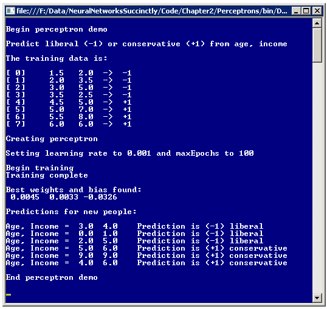
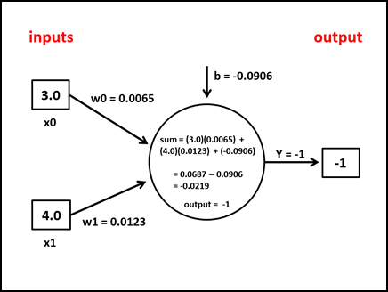
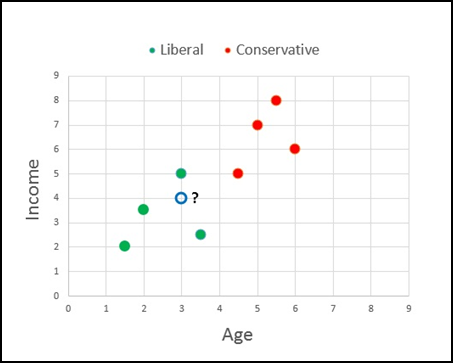

# 第二章感知器

## 简介

感知器是模拟单个生物神经元行为的软件代码。感知器是最早的机器学习形式之一，可以认为是神经网络的前身。本书中描述的神经网络类型也被称为多层感知器。对于任何从事机器学习工作的人来说，准确理解感知器是什么以及它们是如何工作的几乎是普遍的。此外，尽管使用感知器可以解决的问题类型非常有限，但是当学习神经网络时，对感知器的理解非常有帮助，神经网络本质上是感知器的集合。

了解本章走向的最好方法是看一下**图 2-a** 中显示的演示程序的截图。该图显示了一个实现感知机分类器的控制台应用程序。分类器的目标是根据一个人的年龄和收入来预测他或她的政治倾向，自由派还是保守派。演示首先设置八个虚拟训练数据项:

1.5 2.0->-1
2.0 3.5->-1
3.0 5.0->-1
3.5 2.5->-1
4.5 5.0->1
5.0 7.0->1
5.5 8.0->1
6.0 6.0->1

第一个数据项可以解释为年龄为 1.5 岁，收入为 2.0 的人被认为是自由主义者(-1)。在这里，年龄以某种方式被标准化了，例如用实际年龄除以 10，然后减去 0.5，所以 1.5 对应于 20 岁的人。类似地，第一个数据项所代表的人已经以某种方式使他或她的收入正常化。标准化每个 x 数据特征的目的是使所有特征的量值相对相同。在这种情况下，都在 1.0 到 10.0 之间。经验表明，标准化输入数据通常会提高最终感知器分类器的准确性。请注意，虚拟数据项的构造使得低年龄和低收入值的人是自由的，而高年龄和高收入的人是保守的。

第一人称的政治倾向是自由主义，已经编码为-1。保守倾向在训练数据中编码为+1。另一种方法是将自由派和保守派分别编码为 0 和 1。数据规范化和编码是机器学习中的一个重要课题，在[第 1 章](1.html#_Toc388609137)中进行了说明。因为要预测的变量，政治倾向，可以有两个可能的值，自由派或保守派，这个演示问题被称为二元分类问题。



图 2-a:感知器演示程序

在设置了八个虚拟训练数据项之后，演示创建了一个感知机，其学习速率参数值为 0.001，maxEpochs 参数值为 100。学习速率控制感知器学习的速度。maxEpochs 参数控制感知器将学习多长时间。接下来，在幕后，感知器使用训练数据来学习如何分类。完成后，结果是一对权重，值为 0.0045 和 0.0033，偏差值为-0.0326。这些权重和偏差值本质上定义了感知器模型。

在训练之后，感知器被呈现六个不知道政治倾向的新数据项。感知器将每个新人分为自由派或保守派。请注意，那些年龄和收入低的人被归类为自由派，而那些年龄和收入高的人被归类为保守派。例如，年龄= 0.0、收入= 1.0 的第二个未知数据项被分类为-1，代表自由。

## 整体演示程序结构

演示程序的整体结构如**清单 2-a** 所示。为了创建程序，我启动了 Visual Studio 并选择了控制台应用程序项目模板。这个计划没有什么重大意义。NET Framework 版本依赖项，因此任何版本的 Visual Studio 都应该可以工作。我把这个项目命名为感知机。将 Visual Studio 模板代码加载到编辑器中后，我删除了除引用顶级 System 命名空间的语句之外的所有使用语句。在解决方案资源管理器窗口中，我将 Program.cs 文件重命名为更具描述性的 PerceptronProgram.cs，Visual Studio 自动为我重命名了 Program 类。

```cs
    using System;
    namespace Perceptrons
    {
      class PerceptronProgram
      {
        static void Main(string[] args)
        {
          Console.WriteLine("\nBegin perceptron demo\n");
          Console.WriteLine("Predict liberal (-1) or conservative (+1) from age, income");
          // Create and train perceptron.
          Console.WriteLine("\nEnd perceptron demo\n");
          Console.ReadLine();
        }

        static void ShowData(double[][] trainData) { . . }
        static void ShowVector(double[] vector, int decimals, bool newLine) { . . }
      }

      public class Perceptron
      {
        // Fields and methods are defined here.
      }
    }

```

清单 2-a:整体程序结构

程序类包含 Main 方法和两个实用方法，ShowData 和 ShowVector。所有的程序逻辑都包含在程序定义的感知器类中。虽然仅使用静态方法实现感知器是可能的，但在我看来，使用面向对象的方法会产生更清晰的代码。演示程序删除了正常的错误检查代码，以保持主要思想尽可能清晰。

## 输入-过程-输出机制

感知器输入-过程-输出机制如图**图 2-b** 所示。该图对应**图 2-a** 中的第一个预测，输入为年龄= x <sub>0</sub> = 3.0，收入= x <sub>1</sub> = 4.0，训练过程确定的权重和偏差值分别为 w <sub>0</sub> = 0.0065，w <sub>1</sub> = 0.0123，b= -0.0906。计算感知器输出的第一步是对每个输入和输入相关权重的乘积求和:

总和=(3.0)(0.0065)+(4.0)(0.0123)= 0.0687

下一步是将偏差值加到总和中:

sum = 0.0687 + (-0.0906) = -0.0219

最后一步是对总和应用所谓的激活函数。激活函数有时被称为传递函数。有几种不同类型的激活函数。演示程序的感知器使用最简单的类型，即阶跃函数，如果计算的和大于或等于 0.0，则输出为+1，如果计算的和小于 0.0，则输出为-1。因为和是-0.0219，激活函数给出-1 作为感知器输出，对应于一个“自由”的类标签。



图 2-b:感知器输入输出机制

输入-过程-输出机制松散地模拟了单个生物神经元。每个输入值代表一个感觉输入或来自其他神经元的输出值。阶跃函数的激活模拟了某些生物神经元的行为，这些神经元是激活还是不激活，这取决于输入值的加权和是否超过某个阈值。

一个会给初学者造成很大困惑的因素是对偏差值的解释。感知器偏置值只是一个常数，它在应用激活函数之前被添加到处理总和中。许多参考文献没有将偏差视为单独的常数，而是将偏差视为一种特殊类型的权重，相关的伪输入值为 1.0。例如在**图 2-b** 中，假设有第三个输入节点，值为 1.0，偏置值 b 现在标记为 w <sub>2</sub> 。总和计算如下:

sum =(3.0)(0.0065)+(4.0)(0.0123)+(1.0)(-0.0906)=-0.0219

这与之前的结果完全相同。将偏差视为与 1.0 的虚拟输入值相关联的特殊权重是研究文献中常见的方法，因为该技术简化了几个数学证明。然而，将偏差作为一个特殊的权重有两个缺点。首先，这个想法在智力上有些缺乏吸引力。在我看来，恒定偏置项在概念上明显不同于与输入相关联的权重，因为偏置项模拟了真实神经元的放电阈值。其次，将偏差视为特殊权重会引入编码错误的微小可能性，因为伪输入值可以是第一个输入(演示中的 x <sub>0</sub> )或最后一个输入(x <sub>2</sub> )。

## 感知器类定义

感知器类的结构在**清单 2-b** 中给出。整数字段 numInput 保存 x 数据特征的数量。例如，在演示程序中，numInput 将设置为 2，因为有两个预测变量，年龄和收入。

名为“inputs”的双数组类型字段保存 x 数据的值。名为“权重”的双数组字段保存训练期间和训练后与每个输入值相关联的权重值。名为“偏差”的双字段是在计算感知器输出期间添加的值。名为“输出”的整数字段保存感知器的计算输出。字段“rnd”是一个. NET 随机对象，由感知器构造器在训练过程中使用。

```cs
    public class Perceptron
    {
      private int numInput;
      private double[] inputs;
      private double[] weights;
      private double bias;
      private int output;
      private Random rnd;

      public Perceptron(int numInput) { . . }
      private void InitializeWeights() { . . }
      public int ComputeOutput(double[] xValues) { . . }
      private static int Activation(double v) { . . }
      public double[] Train(double[][] trainData, double alpha, int maxEpochs) { . . }
      private void Shuffle(int[] sequence) { . . }
      private void Update(int computed, int desired, double alpha) { . .  
    }

```

清单 2-b:感知器类

感知器类公开了三种公共方法:类构造函数、方法训练和方法计算输出。该类有四个私有助手方法:方法 InitializeWeights 由类构造函数调用，方法 Activation 由 ComputeOutput 调用，方法 Shuffle 和 Update 由 Train 调用。

感知器类构造函数定义如下:

公共感知器(int numInput)
{
this . numInput = numInput；
输入=新双[输入]；
this . weights = new double[NumInput]；
this . rnd = new Random(0)；
InitializeWeights()；
}

构造函数接受 x 数据特征的数量作为输入参数 numInput。该值用于实例化类输入数组和权重数组。构造函数使用种子的硬编码值 0 实例化 rnd Random 对象。另一种方法是将种子值作为输入参数传递给构造函数。通常，实例化具有固定种子值的 Random 对象比调用不带参数的构造函数重载更可取，因为固定种子允许您重现训练运行。

构造函数代码通过调用私有助手方法 InitializeWeights 结束。方法 InitializeWeights 为每个感知器权重和偏差分配一个不同的、介于-0.01 和+0.01 之间的小随机值。该方法定义为:

private void InitializeWeights()
{
double lo =-0.01；
双嗨= 0.01；
为(int I = 0；i <砝码。长度；++i)
权重[i] =(高-低)* rnd。NextDouble()+lo；
偏差= (hi - lo) * rnd。NextDouble()+lo；
}

[-0.01，+0.01]的随机区间是硬编码的。另一种方法是将一个或两个区间端点作为参数传递给 InitializeWeights。这种方法需要您或者公开 InitializeWeights 的范围，以便可以从构造函数中单独调用该方法，或者将间隔端点作为参数添加到构造函数中，以便可以将它们传递给 InitializeWeights。

## 计算输出方法

公共方法 ComputeOutput 接受一组输入值，并使用感知器的权重和偏差值来生成感知器输出。方法计算输出在**清单 2-c** 中给出。

```cs
    public int ComputeOutput(double[] xValues)
    {
      if (xValues.Length != numInput)
        throw new Exception("Bad xValues in ComputeOutput");
      for (int i = 0; i < xValues.Length; ++i)
        this.inputs[i] = xValues[i];
      double sum = 0.0;
      for (int i = 0; i < numInput; ++i)
        sum += this.inputs[i] * this.weights[i];
      sum += this.bias;
      int result = Activation(sum);
      this.output = result;
      return result;
    }

```

清单 2-c:计算输出方法

在检查输入数组参数的大小是否正确后，该方法将数组参数中的值复制到类输入数组中。因为在训练过程中，ComputeOutput 方法通常会被调用几百次或上千次，所以另一种设计方法是消除类输入数组字段，直接从 x 值数组参数中计算输出。这种替代方法比使用显式输入数组稍微高效一些，但不那么清晰。

方法计算输出计算每个输入及其相关权重的乘积之和，加上偏差值，然后应用步长激活函数。另一种设计是删除简单的激活方法定义，并将激活码逻辑直接放入方法计算输出中。然而，单独的激活方法的优点是更模块化的设计，并强调激活功能的单独性质。

阶跃激活函数定义为:

私有静态 int 激活(双 v)
{
if (v > = 0.0)
返回+1；
else
return-1；
}

回想一下，演示问题将两个 y 值编码，预测自由派为-1，保守派为+1。如果使用 0-1 编码方案，则必须修改方法激活以返回这两个值。

## 训练感知器

训练感知器是迭代调整权重和偏差值的过程，以便给定一组训练数据 x 值的计算输出与已知输出紧密匹配。用高级伪码表示，训练过程是:

循环
对于每个训练项目
使用 x 值计算输出
将计算输出与已知输出进行比较
如果计算值太大
使权重和偏差值变小
否则如果计算值太小
使权重和偏差值变大
结束如果
结束则
结束循环

虽然训练在概念上相当简单，但是实现细节有点棘手。方法训练在**清单 2-d** 中给出。方法训练接受训练数据矩阵、学习速率α和循环限制最大值作为输入参数。经验表明，在许多情况下，每次通过主处理循环时，最好使用随机顺序迭代训练数据项，而不是使用固定顺序。为了实现这一点，方法 Train 使用了一个名为序列的数组。数组序列中的每个值代表训练数据行中的一个索引。例如，演示程序有八个培训项目。如果数组序列包含值{ 7，1，0，6，4，3，5，2 }，那么将首先处理训练数据的第 7 行，然后处理第 1 行，依此类推。

助手方法 Shuffle 定义为:

private void Shuffle(int[]序列)
{
for(int I = 0；i <序列。长度；++i)
{
int r = rnd。下一步(I，序列。长度)；
int tmp = sequence[r]；
序列[r] =序列[I]；
序列[I]= tmp；
}

方法 Shuffle 使用 Fisher-Yates 算法对其数组参数中的值进行加扰。训练算法的关键是助手方法 Update，如清单 2-e 中的**所示。方法更新接受计算的输出值、来自训练数据的期望输出值和学习速率α。回想一下，计算和期望的输出值要么是-1(对于自由派)要么是+1(对于保守派)。**

```cs
    Public double[] Train(double[][] trainData, double alpha, int maxEpochs)
    {
      int epoch = 0;
      double[] xValues = new double[numInput];
      int desired = 0;

      int[] sequence = new int[trainData.Length];
      for (int i = 0; i < sequence.Length; ++i)
        sequence[i] = i;

      while (epoch < maxEpochs)
      {
        Shuffle(sequence);
        for (int i = 0; i < trainData.Length; ++i)
        {
          int idx = sequence[i];
          Array.Copy(trainData[idx], xValues, numInput);
          desired = (int)trainData[idx][numInput]; // -1 or +1.
          int computed = ComputeOutput(xValues);
          Update(computed, desired, alpha); // Modify weights and bias values
        } // for each data.
        ++epoch;
      }

      double[] result = new double[numInput + 1];
      Array.Copy(this.weights, result, numInput);
      result[result.Length - 1] = bias; // Last cell.
      return result;
    }

```

清单 2-d:训练方法

方法更新计算计算输出和期望输出之间的差值，并将差值存储到变量增量中。如果计算输出过大，增量将为正值，如果计算输出过小，增量将为负值。对于具有-1 和+1 输出的感知器，增量将总是-2(如果计算= -1 并且期望= +1)，或者+2(如果计算= +1 并且期望= -1)，或者 0(如果计算等于期望)。

对于每个权重[i]，如果计算的输出太大，权重将减少一定量(α*δ*输入[i])。如果输入[i]为正，乘积项也将为正，因为α和δ也为正，因此乘积项从权重[i]中减去。如果输入[i]为负，产品术语将为负，因此为了减轻重量[i]，必须添加产品术语。

请注意，权重变化的大小与增量的大小和权重相关输入值的大小成正比。因此，较大的增量会产生较大的权重变化，而较大的关联输入也会产生较大的权重变化。

学习率α衡量权重变化的幅度。较大的α值会产生较大的权重变化，这将导致更快的学习，但有超过良好权重值的风险。较小的α值可以避免过冲，但会降低训练速度。

```cs
    private void Update(int computed, int desired, double alpha)
    {
      if (computed == desired) return; // We're good.
      int delta = computed - desired;  // If computed > desired, delta is +.

      for (int i = 0; i < this.weights.Length; ++i) // Each input-weight pair.
      {
        if (computed > desired && inputs[i] >= 0.0) // Need to reduce weights.
          weights[i] = weights[i] - (alpha * delta * inputs[i]); // delta is +, input is +
        else if (computed > desired && inputs[i] < 0.0) // Need to reduce weights.
          weights[i] = weights[i] + (alpha * delta * inputs[i]); // delta is +, input is -
        else if (computed < desired && inputs[i] >= 0.0) // Need to increase weights.
          weights[i] = weights[i] - (alpha * delta * inputs[i]); // delta is -, input is +
        else if (computed < desired && inputs[i] < 0.0) // Need to increase weights.
          weights[i] = weights[i] + (alpha * delta * inputs[i]); // delta is -, input is -
      } // Each weight.
      bias = bias - (alpha * delta);
    }

```

清单 2-e:更新方法

权重调整逻辑导致方法更新中的四个控制分支，这取决于增量是正还是负，以及输入[i]是正还是负。假设输入不为零，因此您可能需要检查这一点。在伪代码中:

如果计算>所需并输入> 0，则
权重=权重-(α*δ*输入)
否则如果计算>所需并输入< 0，则
权重=权重+(α*δ*输入)
否则如果计算<所需并输入> 0，则
权重=权重-(α*δ*输入)
否则如果计算<所需并输入< 0，则
权重=权重+(α*δ*输入)
结束，如果

如果仔细检查逻辑，可以看到第一个和第三个分支，以及第二个和第四个分支可以合并，因此前面的伪代码相当于:

如果输入> 0，则
重量=重量-(α*δ*输入)
否则
重量=重量+(α*δ*输入)
结束如果

此外，在输入数据已被标准化以使所有值都非负值的情况下，更新逻辑可以进一步压缩，如下所示:

重量=重量-(α*δ*输入)/*假设输入> 0 */

在我看来，四分支逻辑最清晰但效率最低，单分支逻辑最高效但最不清晰。在大多数情况下，四分支逻辑的性能影响并不显著。

更新偏置值不依赖于相关输入的值，因此逻辑是:

如果计算>所需，则
偏差=偏差-(α*δ)
否则
偏差=偏差-(α*δ)
结束，如果

因此，代码逻辑可以简化为:

偏差=偏差-(α*δ)

请注意，所有的更新逻辑都取决于计算增量的方式。该演示任意计算增量(根据需要计算)。如果您选择将增量计算为(期望计算的)，那么您必须适当地调整更新代码逻辑。

学习速率α和循环计数极限 maxEpochs 有时被称为自由参数。这些值必须由用户提供。术语自由参数也用来指感知器的权重和偏差，因为这些值在训练过程中可以自由变化。一般来说，感知器和神经网络自由参数值的最佳选择，如学习速率，必须通过反复试验来找到。这一不幸的特征是许多形式的机器学习所共有的。

## 使用感知器类

创建和训练感知器的演示程序的主要方法中的关键语句是:

int NumInput = 2；
感知器 p =新感知器(numInput)；
双α= 0.001；
int maxEpochs = 100；
双[]权重= p.Train(trainData，alpha，maxEpochs)；

界面很简单；首先创建感知器，然后对其进行训练。训练过程中找到的最终权重和偏差值由 Train 方法返回。另一种设计是实现一个属性 GetWeights，并按照以下方式调用:

双α= 0.001；
int maxEpochs = 100；
p.Train(trainData，alpha，maxEpochs)；
double[]weights = p . GetWeights()；

演示程序的 Main 方法的代码在**清单 2-f** 中给出。训练数据是硬编码的:

double[][]train data = new double[8][]；

trainData[0] = new double[] { 1.5，2.0，-1 }；
//等。

```cs
    static void Main(string[] args)
    {
      Console.WriteLine("\nBegin perceptron demo\n");
      Console.WriteLine("Predict liberal (-1) or conservative (+1) from age, income");

      double[][] trainData = new double[8][];
      trainData[0] = new double[] { 1.5, 2.0, -1 };
      trainData[1] = new double[] { 2.0, 3.5, -1 };
      trainData[2] = new double[] { 3.0, 5.0, -1 };
      trainData[3] = new double[] { 3.5, 2.5, -1 };
      trainData[4] = new double[] { 4.5, 5.0, 1 };
      trainData[5] = new double[] { 5.0, 7.0, 1 };
      trainData[6] = new double[] { 5.5, 8.0, 1 };
      trainData[7] = new double[] { 6.0, 6.0, 1 };

      Console.WriteLine("\nThe training data is:\n");
      ShowData(trainData);
      Console.WriteLine("\nCreating perceptron");
      int numInput = 2;
      Perceptron p = new Perceptron(numInput);

      double alpha = 0.001;
      int maxEpochs = 100;
      Console.Write("\nSetting learning rate to " + alpha.ToString("F3"));
      Console.WriteLine(" and maxEpochs to " + maxEpochs);

      Console.WriteLine("\nBegin training");
      double[] weights = p.Train(trainData, alpha, maxEpochs);

      Console.WriteLine("Training complete");
      Console.WriteLine("\nBest weights and bias found:");
      ShowVector(weights, 4, true);

      double[][] newData = new double[6][];
      newData[0] = new double[] { 3.0, 4.0 }; // Should be -1.
      newData[1] = new double[] { 0.0, 1.0 }; // Should be -1.
      newData[2] = new double[] { 2.0, 5.0 }; // Should be -1.
      newData[3] = new double[] { 5.0, 6.0 }; // Should be 1.
      newData[4] = new double[] { 9.0, 9.0 }; // Should be 1.
      newData[5] = new double[] { 4.0, 6.0 }; // Should be 1.

      Console.WriteLine("\nPredictions for new people:\n");
      for (int i = 0; i < newData.Length; ++i)
      {
        Console.Write("Age, Income = ");
        ShowVector(newData[i], 1, false);
        int c = p.ComputeOutput(newData[i]);
        Console.Write("   Prediction is ");
        if (c == -1)
          Console.WriteLine("(-1) liberal");
        else if (c == 1)
          Console.WriteLine("(+1) conservative");
      }

      Console.WriteLine("\nEnd perceptron demo\n");
      Console.ReadLine();
    }

```

清单 2-f:主要方法

在许多情况下，训练数据存储在外部，例如文本文件或 SQL 数据库中。在这些情况下，您必须编写一个实用方法，按照以下思路将数据加载到内存中:

string dataLocation = " C:\ Data \ \ ageincome . txt "；
double[][]train data = load data(数据位置)；

感知器演示程序有两个助手方法，ShowData 和 ShowVector，用于显示训练数据矩阵的内容和 double 类型数组的内容。这两个助手方法的代码在**清单 2-g** 中给出。

```cs
    static void ShowData(double[][] trainData)
    {
      int numRows = trainData.Length;
      int numCols = trainData[0].Length;
      for (int i = 0; i < numRows; ++i)
      {
        Console.Write("[" + i.ToString().PadLeft(2, ' ') + "]  ");
        for (int j = 0; j < numCols - 1; ++j)
          Console.Write(trainData[i][j].ToString("F1").PadLeft(6));
        Console.WriteLine("  ->  " + trainData[i][numCols - 1].ToString("+0;-0"));
      }
    }

    static void ShowVector(double[] vector, int decimals, bool newLine)
    {
      for (int i = 0; i < vector.Length; ++i)
      {
        if (vector[i] >= 0.0)
          Console.Write(" "); // For sign.
        Console.Write(vector[i].ToString("F" + decimals) + " ");
      }
      if (newLine == true)
        Console.WriteLine("");
    }

```

清单 2-g:助手方法显示数据和显示向量

## 做预测

在 Main 方法中，在感知器已经被实例化并被训练以基于一个人的年龄和收入对他或她的政治倾向进行分类之后，感知器被呈现六个政治倾向未知的新数据项:

double[][]new data = new double[6][]；

newData[0] = new double[] { 3.0，4.0 }；//输出应为-1。

newData[1] = new double[] { 0.0，1.0 }；//应该是-1。

newData[2] = new double[] { 2.0，5.0 }；//应该是-1。

newData[3] = new double[] { 5.0，6.0 }；//应该是 1。

newData[4] = new double[] { 9.0，9.0 }；//应该是 1。

newData[5] = new double[] { 4.0，6.0 }；//应该是 1。

预测新数据项[i]的政治倾向的关键代码是:

int c =计算机输出(新数据[I])；

控制台。写(“预测是”)；

if (c == -1)

控制台。WriteLine("(-1)自由派")；

否则 if (c == 1)

控制台。WriteLine("(+1)保守")；

在训练之后，感知器保存权重和偏置值，其生成与训练数据的已知 y 值输出紧密匹配的计算 y 值输出。ComputeOutput 方法使用这些权重和偏差值来生成-1 或+1 输出。



图 2-c:预测自由派还是保守派

**图 2-c** 中的图说明了感知器预测是如何工作的。绿点和红点是训练数据。带问号的开放蓝点是 newData[0]，其中年龄为 3.0，收入为 4.0(正常化)。从图表中可以明显看出，新人更可能是自由派(绿色)而不是保守派(红色)。

训练感知器本质上是找到一条直线，这样一个类中的所有训练数据项(例如，演示中的自由项)都在线的一边，而另一个类中的所有数据项(保守项)都在线的另一边。感知器的这种特性称为线性可分性。请注意，有许多可能的分隔线。

## 感知器的局限性

在 20 世纪 50 年代第一批感知器被研究后不久，人们就清楚地认识到感知器有几个弱点，这些弱点限制了它们仅在简单的分类问题上有用。

因为感知器本质上找到了训练数据 y 值类之间的分隔线，所以感知器只能在可能的情况下做出好的预测。

稍微换个说法，假设在**图 2-c** 中，训练数据的定位是这样的，自由派和保守派之间有明显的区别，但是班级之间的划分空间是一条曲线，而不是直线。一个简单的感知器将无法处理这种情况。一般来说，对于现实生活中的数据，不可能事先知道训练数据是否是线性可分的。

这里介绍的感知器实现的另一个弱点与训练过程有关。在演示中，训练循环执行由 maxEpochs 变量指定的固定次数。真正需要的是误差的度量，以便当总误差下降到某个阈值以下时，可以停止训练。事实证明，训练误差项的概念与激活函数密切相关。演示感知器使用一个简单的阶跃函数，它本身并不适合误差函数。简单感知器模型的局限性在 20 世纪 80 年代产生了神经网络。

神经网络比感知器有两个主要的改进。首先，神经网络有许多处理节点，而不是只有一个，它们被组织成两层。这就是为什么神经网络有时被称为多层感知器。其次，神经网络通常使用比感知器通常使用的阶跃函数更复杂的激活函数。这两种增强都提高了神经网络相对于感知器的处理能力。

20 世纪 80 年代末，神经网络研究证明，粗略地说，使用复杂激活函数的全连接前馈神经网络可以逼近任何连续的数学函数。这被称为普遍近似定理，有时也称为赛本科定理。这意味着，如果有可能使用任何平滑的曲线或曲面分离 y 数据，神经网络可以准确地对数据进行分类。

比如再看一下**图 2-c** 中基于年龄和收入的政治倾向图。感知器只有在可以在图上画一条直线，使所有保守数据点都在线的一边，所有自由数据点都在线的另一边时，才能正确分类。但是，当有可能画出任何平滑的曲线来区分两个类别时，神经网络可以正确分类。

## 完整的演示程序源代码

```cs
    using System;
    namespace Perceptrons
    {
      class PerceptronProgram
      {
        static void Main(string[] args)
        {
          Console.WriteLine("\nBegin perceptron demo\n");
          Console.WriteLine("Predict liberal (-1) or conservative (+1) from age, income");

          double[][] trainData = new double[8][];
          trainData[0] = new double[] { 1.5, 2.0, -1 };
          trainData[1] = new double[] { 2.0, 3.5, -1 };
          trainData[2] = new double[] { 3.0, 5.0, -1 };
          trainData[3] = new double[] { 3.5, 2.5, -1 };
          trainData[4] = new double[] { 4.5, 5.0, 1 };
          trainData[5] = new double[] { 5.0, 7.0, 1 };
          trainData[6] = new double[] { 5.5, 8.0, 1 };
          trainData[7] = new double[] { 6.0, 6.0, 1 };

          Console.WriteLine("\nThe training data is:\n");
          ShowData(trainData);

          Console.WriteLine("\nCreating perceptron");
          int numInput = 2;
          Perceptron p = new Perceptron(numInput);

          double alpha = 0.001;
          int maxEpochs = 100;

          Console.Write("\nSetting learning rate to " + alpha.ToString("F3"));
          Console.WriteLine(" and maxEpochs to " + maxEpochs);

          Console.WriteLine("\nBegin training");
          double[] weights = p.Train(trainData, alpha, maxEpochs);

          Console.WriteLine("Training complete");
          Console.WriteLine("\nBest weights and bias found:");
          ShowVector(weights, 4, true);

          double[][] newData = new double[6][];
          newData[0] = new double[] { 3.0, 4.0 }; // Should be -1.
          newData[1] = new double[] { 0.0, 1.0 }; // Should be -1.
          newData[2] = new double[] { 2.0, 5.0 }; // Should be -1.
          newData[3] = new double[] { 5.0, 6.0 }; // Should be 1.
          newData[4] = new double[] { 9.0, 9.0 }; // Should be 1.
          newData[5] = new double[] { 4.0, 6.0 }; // Should be 1.

          Console.WriteLine("\nPredictions for new people:\n");
          for (int i = 0; i < newData.Length; ++i)
          {
            Console.Write("Age, Income = ");
            ShowVector(newData[i], 1, false);
            int c = p.ComputeOutput(newData[i]);
            Console.Write("   Prediction is ");
            if (c == -1)
              Console.WriteLine("(-1) liberal");
            else if (c == 1)
              Console.WriteLine("(+1) conservative");
          }

          Console.WriteLine("\nEnd perceptron demo\n");
          Console.ReadLine();
        } // Main

        static void ShowData(double[][] trainData)
        {
          int numRows = trainData.Length;
          int numCols = trainData[0].Length;
          for (int i = 0; i < numRows; ++i)
          {
            Console.Write("[" + i.ToString().PadLeft(2, ' ') + "]  ");
            for (int j = 0; j < numCols - 1; ++j)
              Console.Write(trainData[i][j].ToString("F1").PadLeft(6));
            Console.WriteLine("  ->  " + trainData[i][numCols - 1].ToString("+0;-0"));
          }
        }

        static void ShowVector(double[] vector, int decimals, bool newLine)
        {
          for (int i = 0; i < vector.Length; ++i)
          {
            if (vector[i] >= 0.0)
              Console.Write(" "); // For sign.
            Console.Write(vector[i].ToString("F" + decimals) + " ");
          }
          if (newLine == true)
            Console.WriteLine("");
        }
      } // Program

      public class Perceptron
      {
        private int numInput;
        private double[] inputs;
        private double[] weights;
        private double bias;
        private int output;
        private Random rnd;

        public Perceptron(int numInput)
        {
          this.numInput = numInput;
          this.inputs = new double[numInput];
          this.weights = new double[numInput];
          this.rnd = new Random(0);
          InitializeWeights();
        }

        private void InitializeWeights()
        {
          double lo = -0.01;
          double hi = 0.01;
          for (int i = 0; i < weights.Length; ++i)
            weights[i] = (hi - lo) * rnd.NextDouble() + lo;
          bias = (hi - lo) * rnd.NextDouble() + lo;
        }

        public int ComputeOutput(double[] xValues)
        {
          if (xValues.Length != numInput)
            throw new Exception("Bad xValues in ComputeOutput");
          for (int i = 0; i < xValues.Length; ++i)
            this.inputs[i] = xValues[i];
          double sum = 0.0;
          for (int i = 0; i < numInput; ++i)
            sum += this.inputs[i] * this.weights[i];
          sum += this.bias;
          int result = Activation(sum);
          this.output = result;
          return result;
        }

        private static int Activation(double v)
        {
          if (v >= 0.0)
            return +1;
          else
            return -1;
        }

        public double[] Train(double[][] trainData, double alpha, int maxEpochs)
        {
          int epoch = 0;
          double[] xValues = new double[numInput];
          int desired = 0;

          int[] sequence = new int[trainData.Length];
          for (int i = 0; i < sequence.Length; ++i)
            sequence[i] = i;

          while (epoch < maxEpochs)
          {
            Shuffle(sequence);
            for (int i = 0; i < trainData.Length; ++i)
            {
              int idx = sequence[i];
              Array.Copy(trainData[idx], xValues, numInput);
              desired = (int)trainData[idx][numInput]; // -1 or +1.
              int computed = ComputeOutput(xValues);
              Update(computed, desired, alpha); // Modify weights and bias values
            } // for each data.
            ++epoch;
          }

          double[] result = new double[numInput + 1];
          Array.Copy(this.weights, result, numInput);
          result[result.Length - 1] = bias; // Last cell.
          return result;
        } // Train

        private void Shuffle(int[] sequence)
        {
          for (int i = 0; i < sequence.Length; ++i)
          {
            int r = rnd.Next(i, sequence.Length);
            int tmp = sequence[r];
            sequence[r] = sequence[i];
            sequence[i] = tmp;
          }
        }

        private void Update(int computed, int desired, double alpha)
        {
          if (computed == desired) return; // We're good.
          int delta = computed - desired;  // If computed > desired, delta is +.
          for (int i = 0; i < this.weights.Length; ++i) // Each input-weight pair.
          {
            if (computed > desired && inputs[i] >= 0.0) // Need to reduce weights.
              weights[i] = weights[i] - (alpha * delta * inputs[i]); // delta +, alpha +, input +
            else if (computed > desired && inputs[i] < 0.0) // Need to reduce weights.
              weights[i] = weights[i] + (alpha * delta * inputs[i]); // delta +, alpha +, input -
            else if (computed < desired && inputs[i] >= 0.0) // Need to increase weights.
              weights[i] = weights[i] - (alpha * delta * inputs[i]); // delta -, aplha +, input +
            else if (computed < desired && inputs[i] < 0.0) // Need to increase weights.
              weights[i] = weights[i] + (alpha * delta * inputs[i]); // delta -, alpha +, input -

            // Logically equivalent:
            //If (inputs[i] >= 0.0) // Either reduce or increase weights (depending on delta).
            //  weights[i] = weights[i] - (alpha * delta * inputs[i]);
            //else
            //  weights[i] = weights[i] + (alpha * delta * inputs[i]);

            // Also equivalent if all input > 0, but not obvious.
            //weights[i] = weights[i] - (alpha * delta * inputs[i]);

          } // Each weight.
          bias = bias - (alpha * delta);
        }
      } // Perceptron
    } // ns

```**