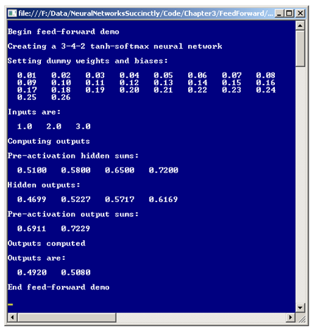
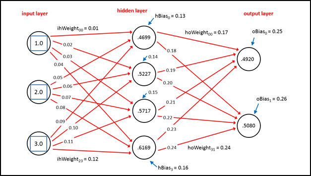
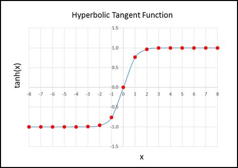

# 三、前馈

## 简介

神经网络本质上是接受一个或多个数字输入并产生一个或多个数字输出的数学函数。基本的神经网络输入-过程-输出计算称为前馈机制。理解前馈机制对于理解如何创建能够做出预测的神经网络至关重要。

了解本章发展方向的最佳方式是查看**图 3-a** 所示演示程序的截图和**图 3-b** 中的相关图表。两幅图都显示了具有三个输入和两个输出的相同虚拟神经网络。虚拟输入值为 1.0、2.0 和 3.0，生成的输出值为 0.4920 和 0.5080。演示神经网络有一个由四个隐藏节点组成的内部层。神经网络有 26 个常数，称为权重和偏差，用于计算输出值。



图 3-a:前馈机制演示

**图 3-a** 中的演示程序显示了输出计算过程中的一些中间值。这些中间值、预激活隐藏和、隐藏输出和预激活输出和通常不会显示，只是为了帮助您理解前馈机制。



图 3-b:神经网络架构

## 理解前馈

神经网络分几个步骤计算其输出，前馈机制最好用一个具体的例子来解释。在**图 3-b** 中，有三个虚拟输入，值分别为 1.0、2.0 和 3.0。在图中，对象是从零开始索引的，从上到下，因此值为 1.0 的最上面的输入是输入[0]，值为 3.0 的最下面的输入是输入[2]。

将一个节点连接到另一个节点的每条红线代表一个权重常数。值为 0.01 的最上面的权重被标记为 ihWeight[0][0]，这意味着从输入节点 0 到隐藏节点 0 的权重。类似地，**图 3-b** 右下角的权重，值为 0.24，标记为 hoWeight[3][1]，表示从隐藏节点 3 到输出节点 1 的权重。

每个隐藏和输出层节点都有一个指向它的箭头。这些被称为偏差值。数值为 0.13 的图顶部的偏置值标记为 hBias[0]，这意味着隐藏节点 0 的偏置值。

前馈机制的第一步是计算隐藏层节点中显示的值。隐藏节点 0 的值为 0.4699，计算如下。首先，将每个输入值及其相关权重的乘积相加:

hSums[0]=(1.0)(0.01)+(2.0)(0.05)+(3.0)(0.09)= 0.01+0.10+0.27 = 0.38

接下来，添加相关的偏置值:

hSums[0] = 0.38 + 0.13 = 0.51

在**图 3-a** 中，可以看到这显示为第一次预激活金额。接下来，对总和应用所谓的激活函数。激活函数将在后面详细解释，但现在只需说激活函数是双曲正切函数就足够了，通常缩写为 tanh。

hOutputs[0] = tanh(0.51) = 0.4699

在**图 3-a** 中可以看到 0.4699 显示为第一个隐藏输出，在**图 3-b** 中也可以看到 0.4699 显示为最顶端隐藏节点内的值。其他三个隐藏节点的计算方式相同。这里，这些步骤结合在一起以节省空间:

hout puts[1]= tanh((1.0)(0.02)+(2.0)(0.06)+(3.0)(0.10)+0.14)= tanh(0.58)= 0.5227
hout puts[2]= tanh((1.0)(0.03)+(2.0)(0.07)+(3.0)(0.11)+0.15)= tanh(0.65)= 0

计算完所有隐藏节点输出值后，这些值将用作输出层的输入。输出节点值的计算方式与隐藏节点略有不同。在激活之前，输出节点 0 和 1 的初步输出和的计算方式与初步隐藏节点和相同，通过对输入和权重的乘积求和，然后加上一个偏差值:

osms[0.4699](0.17)+(0.5227)(0.19)+(0.5717)(0.21)+(0.6169)(0.23)+0.25 = 0.6911
osms[1]=(0.4699)(0.18)+(0.5227)(0.20)+(0.5717)(0.22)+(0.6169)(0.24)+0.26 = 0.7229

输出层的激活函数称为 softmax 函数。这将在后面解释，但目前每个初步总和的软最大值最好用例子来解释:

输出[0]= exp(0.6911)/(exp(0.6911)+exp(0.7229))= 1.9959/(1.9959+2.0604)= 0.4920
输出[1]= exp(0.7229)/(exp(0.6911)+exp(0.7229))= 2.0604/(1.9959+2.0604)= 0

如果同时查看**图 3-a** 和**图 3-b** ，您会看到这些是演示神经网络计算的最终输出值。这里，某值 *x* 的 exp 函数是数学常数 *e* = 2.71828。。。提升至 *x* 次方。请注意，两个输出值之和为 1.0，这不是巧合，也是使用 softmax 函数的目的。

总而言之，神经网络本质上是一个数学函数，其输出由输入值、多个隐藏节点、一组权重和偏差值以及两个激活函数决定。这里介绍的架构称为全连接网络，因为给定层中的节点连接到下一层中的所有节点。设计没有完全连接的神经网络是可能的。

## 作为特殊权重的偏差值

使用神经网络时，您必须仔细注意如何处理偏差值。在前一节中，偏差值被视为不同的常数。然而，大多数神经网络研究将偏差视为与 1.0 的虚拟输入值相关的特殊权重。

例如在**图 3-b** 中，隐藏节点 0 的偏置值为 0.13。如果偏差被视为真实偏差，则隐藏节点 0 的预激活总和计算如下:

hSum[0]=(1.0)(0.01)+(2.0)(0.05)+(3.0)(0.09)+0.13 = 0.51

如果您想象一个值为 1.0 的伪输入节点紧挨着隐藏节点 0，并且将偏差视为一个特殊权重，则预激活总和将计算如下:

hSum[0]=(1.0)(0.01)+(2.0)(0.05)+(3.0)(0.09)+(1.0)(0.13)= 0.51

换句话说，结果是一样的。将偏差视为一种特殊的权重的意义在于，这样做简化了研究中的许多数学证明和推导。但从开发人员的角度来看，将偏见视为特殊的权重在概念上很尴尬，在我看来，比将所有偏见视为真正的偏见更容易出错。

## 整体演示程序结构

演示程序的整体结构如**清单 3-a** 所示。将 Visual Studio 模板代码加载到编辑器中后，我删除了除引用顶级 System 命名空间的语句之外的所有使用语句。在“解决方案资源管理器”窗口中，我将 Program.cs 文件重命名为更具描述性的 FeedForwardProgram.cs，Visual Studio 自动为我重命名了 Program 类。

```cs
    using System;
    namespace FeedForward
    {
      class FeedForwardProgram
      {
        static void Main(string[] args)
        {
          Console.WriteLine("\nBegin feed-forward demo\n");

          int numInput = 3;
          int numHidden = 4;
          int numOutput = 2;

          Console.WriteLine("Creating a 3-4-2 tanh-softmax neural network");
          NeuralNetwork nn = new NeuralNetwork(numInput, numHidden, numOutput);
          // Set weights.
          // Set inputs.
          // Compute and display outputs.

          Console.WriteLine("\nEnd feed-forward demo\n");
          Console.ReadLine();
        }

        public static void ShowVector(double[] vector, int valsPerRow,
          int decimals, bool newLine) { . . }
      } // Program

      public class NeuralNetwork { . . }

    }

```

清单 3-a:整体程序结构

程序类包含 Main 方法和一个实用方法 ShowVector。所有的程序逻辑都包含在程序定义的神经网络类中。虽然只使用数组和静态方法实现神经网络是可能的，但在我看来，使用面向对象的方法会产生更容易理解的代码。演示程序删除了大多数正常的错误检查，以保持主要思想尽可能清晰。

主要方法从实例化演示神经网络开始:

静态 void Main(字符串[]参数)

{

控制台。write line(" \ n 开始前馈演示\ n ")；
int NumInput = 3；

int numHidden = 4：

int numoutput = 2：

控制台。WriteLine(“创建 3-4-2 tanh-softmax 神经网络”)；

neural network nn = new neural network(num input、numHidden、num output)；

请注意，演示神经网络构造函数接受输入节点数、隐藏节点数和输出节点数的参数值。这意味着所使用的两个激活功能，tanh 和 softmax，是硬连线到网络中的。

演示程序继续设置 26 个虚拟权重和偏差值，然后使用方法设置权重将它们放入神经网络:

double[]权重=新 double[]{ 0

0.01, 0.02, 0.03, 0.04, 0.05, 0.06, 0.07, 0.08, 0.09, 0.10,

0.11, 0.12, 0.13, 0.14, 0.15, 0.16, 0.17, 0.18, 0.19, 0.20,

0.21, 0.22, 0.23, 0.24, 0.25, 0.26

};

控制台。write line(" \ n 设置虚拟权重和偏差:")；

ShowVector(权重，8，2，真)；

nn。SetWeights(权重)；

如果你参考**图 3-b** 中的图表，你可以看到神经网络的架构与权重和偏差值的数量之间的关系。因为从每个输入节点到每个隐藏节点都有一个权重，所以有(numInput * numHidden)个输入到隐藏的权重。每个隐藏节点都有一个偏置值，因此存在 numHidden 隐藏节点偏置。从每个隐藏节点到每个输出节点都有一个权重，构成(numHidden * numOutput)权重。每个输出节点都有一个偏置，使得 numOutput 有更多的偏置。把这些放在一起，总共有(numminput * numHidden)+numHidden+(numHidden * numumutp)+numumutp 权重和偏差值。

接下来，演示设置并显示三个任意输入值:

double[]xValues = new double[]{ 1.0，2.0，3.0 }；

控制台。write line(" \ n 输出为:")；

ShowVector(xValues，3，1，true)；

演示程序最后计算并显示了输出值:

控制台。write line(" \ n 计算输出")；

double[] yValues = nn。计算输出(xvalues)；

控制台。write line(" \ nOutputs computed ")；

控制台。WriteLine("\nOutputs 为:")；

ShowVector(yValues，2，4，true)；
控制台。write line(" \ nAnD 前馈演示\ n ")；

控制台。ReadLine()；

} // Main

实用方法 ShowVector 的代码是:

公共静态 void ShowVector(double[] vector，int valsPerRow，

整数小数， 布尔新线）

{

for(int I = 0；I

{

if(I % vallock low = = 0)

控制台。write line(" ")；

控制台。写(向量[i]。ToString("F" +小数)。PadLeft(小数+4)+" ")；

}

if (newLine == true)

控制台。write line(" ")；

}

ShowVector 方法是用公共作用域声明的，因此可以在 NeuralNetwork 类的方法内部调用。

## 设计神经网络类

有许多方法可以在代码中实现神经网络。在**清单 3-b** 中呈现的设计强调简单胜于高效。成员字段 numInput、numHidden 和 numOutput 存储输入节点、隐藏节点和输出节点的数量。名为 inputs 的数组成员保存神经网络的数字输入。有趣的是，如稍后将显示的，为了略微提高处理效率，可以省略输入数组。

矩阵成员 ihWeights 保存从输入节点到隐藏节点的权重，其中行索引对应于输入节点的索引，列索引对应于隐藏节点的索引。矩阵被实现为数组的数组。与大多数编程语言不同，C#有一个真正的多维数组，您可能希望使用这种方法来存储神经网络权重。

成员数组 hBiases 保存隐藏节点的偏差值。您会发现许多实现将省略这个数组，而是将隐藏节点偏差视为额外的输入到隐藏权重。

成员数组 hOutputs 在对权重和输入的乘积求和、加上偏置值并在输出值的计算过程中应用激活函数后，存储隐藏节点输出。另一种方法是使这个数组位于 ComputeOutputs 的本地。但是，因为在大多数情况下，ComputeOutputs 方法被调用了成千上万次，所以必须多次分配一个本地数组。命名数组 hOutputs 有点复杂，因为这些值也是输出层的输入。

成员矩阵 hoWeights 保存从隐藏节点到输出节点的权重。矩阵的行索引对应于隐藏节点的索引，列索引对应于输出节点的索引。

成员数组对象保存输出节点的偏差值。名为 outputs 的成员数组保存最终计算出的整个神经网络输出值。与输入数组一样，您将看到输出数组可能会从设计中删除。

```cs
    public class NeuralNetwork
    {
      private int numInput;
      private int numHidden;
      private int numOutput;

      private double[] inputs;

      private double[][] ihWeights;
      private double[] hBiases;
      private double[] hOutputs;

      private double[][] hoWeights;
      private double[] oBiases;

      private double[] outputs;

      public NeuralNetwork(int numInput, int numHidden, int numOutput) { . . }
      private static double[][] MakeMatrix(int rows, int cols) { . . }
      public void SetWeights(double[] weights) { . . }
      public double[] ComputeOutputs(double[] xValues) { . . }
      private static double HyperTan(double v) { . . }
      private static double[] Softmax(double[] oSums) { . . }
    }

```

清单 3-b:设计一个神经网络类

**清单 3-b** 中的神经网络类有三个公共方法:构造函数、设置权重和偏差值的方法以及计算并返回输出值的方法。在后面的章节中，随着训练特征被添加到神经网络中，额外的公共范围方法将被添加到类定义中。

私有方法 MakeMatrix 是由构造函数调用的辅助方法。方法 ComputeOutputs 调用私有助手方法 HyperTan 和 Softmax。

## 神经网络构造器

神经网络类构造函数首先将每个输入参数值复制到其关联的成员字段:

公共神经网络(int numInput、int numHidden、int numOutput)

{

this.numInput = numInput：

此. numhidden = numhidden

this.numOutput = numOutput

接下来，分配输入数组的空间:

this . inputs = new double[NumInput]；

接下来，构造函数使用辅助方法 MakeMatrix 为输入到隐藏权重矩阵分配空间:

this . ihweights = make matrix(NumInput，NumHidden)；

另一种方法是直接分配矩阵，但是在这里使用助手方法是有意义的，因为助手可以在分配隐藏到输出的权重矩阵时重用。方法 MakeMatrix 定义为:

私有静态 double[][]make matrix(int row，int cols)

{

double[][]结果=新 double[row][]；

for(int I = 0；I

结果[i] =新的 double[cols]；

返回结果；

}

根据您的背景，您可能不熟悉使用 C#数组风格的矩阵。矩阵语法不太符合大多数正常的编程习惯，可能需要一段时间才能习惯。

神经网络类构造函数通过为剩余的成员矩阵和四个数组分配空间来完成:

this . hbiases = new double[NumHidden]；

this . HoutPuts = new double[NumHidden]；

this . howelights = MakeMatrix(NumHidden，NuMoutPut)；

this . obiasses = new double[NuMoutPut]；

this . outputs = new double[NuMoutPut]；

}

## 设置神经网络权重和偏差值

演示程序使用一种方法设置权重来填充权重矩阵 ihWeights 和 hoWeights，并用值来偏置数组 hBiases 和 oBiases。方法设置权重在**清单 3-c** 中给出。方法设置权重接受一个保存所有权重和偏差值的数组参数。

该方法假设权重数组参数中的值以特定顺序存储:首先是输入到隐藏权重，然后是隐藏偏差，接着是隐藏到输出权重，最后是输出偏差。此外，假设两个权重矩阵的值以行主顺序存储。这意味着值是从左到右和从上到下排序的。

像往常一样，一个具体的例子是最好的解释方式。**图 3-b** 所示的演示神经网络是通过传递一个值为{ 0.01，0.02，0.03，。。0.26 }到 SetWeights 方法。这将使用以下值填充矩阵 ihWeights:

0.01 0.02 0.03 0.04
0.05 0.06 0.07 0.08
0.09 0.10 0.11 0.12

hBiases 数组获取:

0.13 0.14 0.15 0.16

矩阵豪威得到:

0.17 0.18
0.19 0.20
0.21 0.22
0.23 0.24

奥比阿斯阵列得到:

0.25 0.26

传递给方法 SetWeights 的数组参数中的值的特定顺序的假设有些脆弱。另一种方法是显式地将两个矩阵和两个数组传递给 SetWeights，但在我看来，额外的复杂性超过了增加的安全性，除非您正在设计自己的神经网络供他人使用。

```cs
    public void SetWeights(double[] weights)
    {
      int numWeights = (numInput * numHidden) + numHidden +
        (numHidden * numOutput) + numOutput;
      if (weights.Length != numWeights)
            throw new Exception("Bad weights array");

      int k = 0; // Pointer into weights parameter.

      for (int i = 0; i < numInput; ++i)
        for (int j = 0; j < numHidden; ++j)
          ihWeights[i][j] = weights[k++];

      for (int i = 0; i < numHidden; ++i)
        hBiases[i] = weights[k++];

      for (int i = 0; i < numHidden; ++i)
        for (int j = 0; j < numOutput; ++j)
          hoWeights[i][j] = weights[k++];

      for (int i = 0; i < numOutput; ++i)
        oBiases[i] = weights[k++];
    }

```

清单 3-c:设置权重和偏差值

## 计算输出

方法计算输出实现了前馈机制。该方法去掉了诊断写线语句，如清单 3-d 所示。方法定义从对输入值进行简单检查开始:

公共 double[]ComputeOutputs(double[]xValues)

{

if (xValues。长度！= numInput)

抛出新的异常(“错误的 xValues 数组”)；

在实际的神经网络场景中，您可能希望考虑删除此输入参数检查以提高性能。另一种方法是传入一个名为 checkInput 的布尔标志参数，以指示是否执行错误检查；然而，在这种情况下，检查布尔值会产生与执行错误检查本身一样多的开销。

```cs
    public double[] ComputeOutputs(double[] xValues)
    {
      if (xValues.Length != numInput)
        throw new Exception("Bad xValues array");

      double[] hSums = new double[numHidden];
      double[] oSums = new double[numOutput];

      for (int i = 0; i < xValues.Length; ++i)
        inputs[i] = xValues[i];

      for (int j = 0; j < numHidden; ++j)
        for (int i = 0; i < numInput; ++i)
          hSums[j] += inputs[i] * ihWeights[i][j];

      for (int i = 0; i < numHidden; ++i)
        hSums[i] += hBiases[i];

      for (int i = 0; i < numHidden; ++i)
        hOutputs[i] = HyperTan(hSums[i]);

      for (int j = 0; j < numOutput; ++j)
        for (int i = 0; i < numHidden; ++i)
          oSums[j] += hSums[i] * hoWeights[i][j];

      for (int i = 0; i < numOutput; ++i)
        oSums[i] += oBiases[i];

      double[] softOut = Softmax(oSums); // Softmax does all outputs at once.
      for (int i = 0; i < outputs.Length; ++i)
        outputs[i] = softOut[i];

      double[] result = new double[numOutput];
      for (int i = 0; i < outputs.Length; ++i)
        result[i] = outputs[i];

      return result;
    }

```

清单 3-d:计算神经网络输出值

接下来，方法 ComputeOutputs 创建并分配暂存数组，以保存输入和权重的乘积加上偏差值的预激活总和:

double[] hSums =新的 double[numHidden]；

double[] oSums =新的 double[NuMoutPut]；

回想一下，在 C#中，当创建 double 类型的数组时，单元格值会自动设置为 0.0。如前所述，在大多数情况下，当神经网络被训练时，前馈机制被调用成千上万次。因此，乍一看，将这两个数组声明为类范围字段，而不是在方法 ComputeOutputs 中重复分配这两个 scratch sum 数组的替代方法很有吸引力。然而，这也有混淆类定义的缺点。此外，因为这些暂存数组保存了总和的累积，所以在计算输出开始时必须将数组清零，这就否定了不必分配数组的大部分优势。

接下来，输入值从 xValues 数组参数复制到成员输入数组:

for(int I = 0；i < xValues。长度；++i)

输入[I]= XVaLues[I]；

一种语法替代方法是使用 C#数组。复制方法。如果您仔细查看前馈机制，您会看到名为 inputs 的成员数组中的值被使用，但没有被更改。因此，可以消除输入数组，只使用 xValues 数组中的值。因为方法计算输出可能被调用数千次甚至数百万次，这取决于使用场景，所以消除不必要的数组拷贝可以节省大量时间。

然而，消除输入成员数组至少有两个缺点。首先，从概念上来说，神经网络确实有输入，因此从某种主观角度来说，消除它们并不太合适。其次，如果您实现一个类 ToString 方法，您肯定希望能够看到输入的当前值，如果输入数组不在类定义中，这是不可能的。

另一种方法是将一个名为 copyInputs 的布尔标志参数传递给 ComputeOutputs 方法，其思路如下:

公共 double[]ComputeOutputs(double[]xValues，bool copyInputs)

{

if (copyInputs == true)

{

for(int I = 0；i < xValues。长度；++i)

输入[I]= XVaLues[I]；

}

其他

输入= xValues

使用这种方法可以提高性能，但有可能产生不必要的副作用；在 else 分支中，当参数 copyInputs 为 false 时，Inputs 数组被分配一个指向 xValues 数组的引用(本质上是一个指针)。对其中一个阵列的任何更改都会有效地更改另一个阵列。简而言之，将 xValues 数组值显式复制到 inputs 成员数组比使用引用隐式复制更安全、更清晰，但性能更慢。

将值复制到输入成员数组后，方法 ComputeOutputs 会累计输入到隐藏权重和输入的乘积之和:

for(int j = 0；j < numHidden++j)

for(int I = 0；i < numInput++i)

hSums[j] +=输入[I]* ihWeights[I][j]；

尽管代码很短，但由于数组索引的原因，代码有些棘手。在这种情况下，索引 j 指向隐藏和数组，还充当输入到隐藏权重矩阵的列索引。一般来说，根据我的经验，我的神经网络实现中的大多数错误都与数组和矩阵索引有关。开发人员有不同的编码方法，但对我来说，用纸和笔画出数组、矩阵和索引的图片，是我保持索引正确的唯一方法。

接下来，偏置值被添加到累积的隐藏节点和:

for(int I = 0；i < numHidden++i)

hSums[I]+= hBiases[I]；

控制台。write line(" \ nPre-激活隐藏和:")；

FeedForwardProgram。ShowVector(hSums，4，4，true)；

在演示程序中，隐藏的总和仅用于信息目的。在现实的非演示场景中，这些总和不会显示。一种常见的方法是传入一个布尔参数，通常命名为“verbose”，以控制是否打印诊断消息。

接下来，双曲正切激活函数应用于每个和，以给出隐藏节点的输出值:

for(int I = 0；i < numHidden++i)

hout puts[I]= HyperTan(hSums[I])；

控制台。WriteLine("\nHidden 输出:")；

FeedForwardProgram。ShowVector(hOutputs，4，4，true)；

激活函数将在本章的下一节详细讨论。现在，请注意 HyperTan 函数接受 double 类型的单个值，并返回 double 类型的单个值。因此，该函数必须单独应用于每个隐藏和。

接下来，方法计算输出层节点的预激活和:

for(int j = 0；j < numOutput++j)

for(int I = 0；i < numHidden++i)

osum[j]+= hout puts[I]* how lights[I][j]；

for(int I = 0；i < numOutput++i)

osum[I]+= oBiases[I]；

控制台。WriteLine("\nPre-activation 输出总和:")；

FeedForwardProgram。ShowVector(osum，2，4，真)；

接下来，对总和应用 softmax 激活，并将最终结果存储到输出数组中:

double[]softOut = soft max(oSums)；

for(int I = 0；I

输出[I]= SoftOut[I]；

请注意，与 HyperTan 方法不同，Softmax 方法接受一个双精度值数组并返回一个双精度值数组。

方法计算输出通过将名为 Outputs 的类成员数组中的值复制到本地方法返回结果数组，然后返回该数组来完成:

double[]结果=新 double[NuMoutPut]；

for(int I = 0；I

结果[i] =输出[I]；

返回结果；

} // ComputeOutputs

实际上，方法 ComputeOutputs 以两种方式返回神经网络的输出值:第一，存储到类成员数组输出中，第二，作为显式返回值。这个想法有点微妙，主要是为了呼吁灵活性。显式返回神经网络输出允许您通过类似以下的调用将输出提取到数组中:

double[] yValues = nn。计算输出(xvalues)；

输出值也存在于神经网络对象中，因此如果您实现一个 GetOutputs 方法，您可以按照以下方式进行调用:

nn。ComputeOutputs(xValues)；
double[] yValues = nn。GetOutputs()；

GetOutputs 方法的一种可能实现是:

公共 double[] GetOutputs()

{

double[]结果=新 double[NuMoutPut]；

for(int I = 0；i < numOutput++i)

结果[I]= this . outputs[I]；

返回结果；

}

## 激活功能

演示程序使用双曲正切函数激活隐藏层节点，使用 softmax 函数激活输出层节点。还有第三种常见的激活函数，称为逻辑 sigmoid 函数。所有这三个激活函数在数学上密切相关。从开发人员的角度来看，您需要知道两件事:何时使用每个激活功能以及如何实现每个功能。

虽然有一些例外，但一般来说，双曲正切函数是隐藏层激活的最佳选择。对于输出层激活，如果您的神经网络正在执行分类，其中要预测的因变量有三个或更多值(例如，预测一个人的政治倾向，可以是“自由”、“温和”或“保守”)，softmax 激活是最佳选择。如果您的神经网络正在执行分类，其中因变量正好有两个可能的值(例如，预测一个人的性别，可以是“男性”或“女性”)，则逻辑 sigmoid 激活函数是输出层激活的最佳选择。[第五章](5.html#_Toc388609180)说明细节。

在演示程序中，双曲正切函数定义为:

私有静态双 HyperTan(双 v)

{

if (v < -20.0)

return-1.0；

否则如果(v > 20.0)

返回 1.0；

其他

返回数学。tanh(v)；

}

这里的神经网络 HyperTan 方法本质上是内置的包装器。NET Tanh 函数。为了更好地理解 HyperTan 方法，请看一下**图 3-c** 所示的双曲正切图。Tanh 函数接受从负无穷大到正无穷大的任何数值，并返回一个介于-1.0 和+1.0 之间的值。例如，Tanh(2.0) = 0.9640，Tanh(-3.0) = -0.9951。请注意，对于小于约-8.0 且大于+8.0 的 *x* 值，Tanh 函数结果分别非常接近-1 和+1。

包括 C#在内的大多数编程语言都有内置的双曲正切函数。但是在神经网络研究的早期，一些较旧的编程语言很难计算非常小或非常大的输入参数的双曲正切函数。因此，执行 HyperTan 方法中使用的那种参数检查是很常见的。

逻辑 sigmoid 函数，也称为 log-sigmoid，类似于双曲正切函数。logistic sigmoid 函数接受从负无穷大到正无穷大的任何数值，并返回一个介于 0.0 和+1.0 之间的值。与双曲正切函数不同，大多数编程语言没有内置的逻辑 sigmoid 函数。逻辑 sigmoid 函数的数学定义是:f(*x*)= 1/(1+*e*<sup>-*x*</sup>)。

包括 C#在内的大多数编程语言都有一个内置函数，通常被命名为 Exp，它返回 *e* 的幂。因此，逻辑 sigmoid 函数的一种可能实现是:

私有静态双 LogSigmoid(double x)
{
if(x<-45.0)
返回 0.0；
else if (x > 45.0)
返回 1.0；
否则
返回 1.0 / (1.0 +数学。exp(-x))；
}

输入参数检查值-45.0 和+45.0 是传统值。在旧的计算硬件和软件上，计算数学。当 *x* 非常大或非常小时，Exp(- *x* )可能会导致算术溢出，因此标准方法是使用输入参数检查。



图 3-c:双曲正切函数

softmax 激活函数是逻辑 sigmoid 函数的一个变种。logistic sigmoid 函数接受单个值，并返回 0.0 到 1.0 之间的单个值。softmax 激活功能接受 *n* 个值，并返回一组总和为 1.0 的 *n* 个值。例如，{ 1.0，4.0，2.0 }的 softmax 返回{ 0.04，0.84，0.12 }。

softmax 函数的数学定义有点难以表达，所以举个例子可能是最好的解释方式。假设有三个值，1.0、4.0 和 2.0。

soft max(1.0)=*e*<sup xmlns:epub="http://www.idpf.org/2007/ops">1.0</sup>/(*e*<sup xmlns:epub="http://www.idpf.org/2007/ops">1.0</sup>+*e*T10】4.0+*e*<sup xmlns:epub="http://www.idpf.org/2007/ops">2.0</sup>)= 2.7183/(2.7183+54.5982+7.3891)= 0.04

soft max(4.0)=*e*<sup xmlns:epub="http://www.idpf.org/2007/ops">4.0</sup>/(*e*<sup xmlns:epub="http://www.idpf.org/2007/ops">1.0</sup>+*e*T10】4.0+*e*<sup xmlns:epub="http://www.idpf.org/2007/ops">2.0</sup>)= 54.5982/(2.7183+54.5982+7.3891)= 0.84

soft max(2.0)=*e*<sup xmlns:epub="http://www.idpf.org/2007/ops">2.0</sup>/(*e*<sup xmlns:epub="http://www.idpf.org/2007/ops">1.0</sup>+*e*T10】4.0+*e*<sup xmlns:epub="http://www.idpf.org/2007/ops">2.0</sup>)= 7.3891/(2.7183+54.5982+7.3891)= 0.12

softmax 的一个可能的简单实现是:

公共静态 double[] SoftmaxNaive(double[]值)

{

双分母= 0.0：

for(int I = 0；i < oSums。长度；++i)

它们的名称为+= Math。exp(osms[I])；

double[]结果=新的 double[oSums。长度]；

for(int I = 0；i < oSums。长度；++i)

结果[i] =数学。exp(OsUMs[I])/denom；

返回结果；

}

softmax 函数的简单实现的问题是分母项很容易变得非常大或非常小，并导致潜在的算术溢出。通过使用一些巧妙的数学方法，可以实现更复杂的 softmax 函数。同样，这个技术最好用一个例子来解释。

使用前面示例中的三个值，1.0、4.0 和 2.0，第一步是确定最大值，在本例中为 max = 4.0。下一步是计算比例因子，即每个输入值的 *e* 之和减去最大输入值:

scale = *e* <sup xmlns:epub="http://www.idpf.org/2007/ops">(1.0 -最大值)</sup> + *e* <sup xmlns:epub="http://www.idpf.org/2007/ops">(4.0 -最大值)</sup> + *e* <sup xmlns:epub="http://www.idpf.org/2007/ops">(2.0 -最大值)</sup>=*e*<sup xmlns:epub="http://www.idpf.org/2007/ops">-3.0</sup>+*e*<sup xmlns:epub="http://www.idpf.org/2007/ops">0</sup>+*e*-2.0= 0

最终软最大输出为 *e* 升至每个输入减去最大值除以比例因子:

soft max(1.0)=*e*<sup>(1.0-max)</sup>/scale =*e*<sup>-3.0</sup>/1.1851 = 0 . 0498/1.1851 = 0.04

soft max(4.0)=*e*<sup>(4.0-max)</sup>/scale =*e*<sup>0</sup>/1.1851 = 1/1.1851 = 0.84

soft max(2.0)=*e*<sup>(2.0-max)</sup>/scale =*e*<sup>-2.0</sup>/1.1851 = 0 . 1353/1.1851 = 0.12

请注意，这些结果与使用数学定义计算的结果相同。这两种计算方法给出相同结果的原因并不明显，但基于这样一个性质:*e*T2(*a*-*b*)=*e**a*/*e**<sup>b</sup>*)。使用交替计算技术的要点在于，缩放过程减小了 *e* 所提升到的每个值的幅度，这减少了算术溢出的机会。softmax 功能的演示程序实现在**清单 3-e** 中给出。

```cs
    public static double[] Softmax(double[] oSums)
    {
      double max = oSums[0];
      for (int i = 0; i < oSums.Length; ++i)
        if (oSums[i] > max)
          max = oSums[i];

      double scale = 0.0;
      for (int i = 0; i < oSums.Length; ++i)
        scale += Math.Exp(oSums[i] - max);

      double[] result = new double[oSums.Length];
      for (int i = 0; i < oSums.Length; ++i)
        result[i] = Math.Exp(oSums[i] - max) / scale;

      return result; // Cell values sum to ~1.0.
    }

```

清单 3-e:软最大激活方法

因为 softmax 函数只应用于输出层节点的和，所以该方法的输入数组参数被命名为 o sums，而不是像“值”这样更通用的东西。

演示程序有硬编码激活函数双曲正切用于隐藏层节点，softmax 用于输出层节点。另一种方法是将一些参数信息传递给神经网络构造器，指示每层使用哪个激活函数。这引入了额外的复杂性。根据经验，当我开发自己使用的代码时，比起更通用的解决方案，我更喜欢简单。另一方面，如果您正在开发供他人使用的神经网络代码，特别是如果您不打算使源代码可用和可编辑，您将不得不采取一般的方法来处理激活函数。

有许多方法可以修改这里介绍的神经网络类来处理参数化激活函数。一种方法是定义类范围枚举类型以及成员字段，大致如下:

公共类神经网络

{

公共枚举激活{ HyperTan，LogSigmoid，Softmax }；

私有激活激活；

私有激活激活；

构造函数将接受附加参数:

公共神经网络(int numInput、int numHidden、int numOutput、

激活激活，激活激活)

{

this.numInput = numInput：

此. numhidden = numhidden

this.numOutput = numOutput

this . haactivation = haactivation；

this.oActivation = oActivation

计算输出方法可以使用分支逻辑，例如:

for(int I = 0；i < numHidden++i)

{

if(this . haactivation = = Activation。HyperTan)

hout puts[I]= HyperTan(hSums[I])；

否则如果(this.hActivation = = Activation。LogSigmoid)

hout puts[I]= LogSigmoid(HSums[I])；

}

神经网络构造器可以这样调用:

neural network nn = new neural network(num input、numHidden、numOutput、

神经网络。激活。超级网络，神经网络。激活. Softmax)；

显而易见，设计一个通用的神经网络，通常供其他开发人员使用，需要大量的额外代码。正如您将在后面的章节中看到的，有几十种方法可以修改神经网络的行为。总的来说，我个人更喜欢让我的神经网络实现尽可能简单，并且愿意付出不得不经常修改源代码的代价。

## 完整的演示程序源代码

```cs
    using System;
    namespace FeedForward
    {
      class FeedForwardProgram
      {
        static void Main(string[] args)
        {
          Console.WriteLine("\nBegin feed-forward demo\n");

          int numInput = 3;
          int numHidden = 4;
          int numOutput = 2;

          Console.WriteLine("Creating a 3-4-2 tanh-softmax neural network");
          NeuralNetwork nn = new NeuralNetwork(numInput, numHidden, numOutput);

          double[] weights = new double[] { 0.01, 0.02, 0.03, 0.04,
            0.05, 0.06, 0.07, 0.08,
            0.09, 0.10, 0.11, 0.12,
            0.13, 0.14, 0.15, 0.16,
            0.17, 0.18, 0.19, 0.20,
            0.21, 0.22, 0.23, 0.24,
            0.25, 0.26 };

          Console.WriteLine("\nSetting dummy weights and biases:");
          ShowVector(weights, 8, 2, true);

          nn.SetWeights(weights);

          double[] xValues = new double[] { 1.0, 2.0, 3.0 };
          Console.WriteLine("\nInputs are:");
          ShowVector(xValues, 3, 1, true);

          Console.WriteLine("\nComputing outputs");
          double[] yValues = nn.ComputeOutputs(xValues);
          Console.WriteLine("\nOutputs computed");

          Console.WriteLine("\nOutputs are:");
          ShowVector(yValues, 2, 4, true);

          Console.WriteLine("\nEnd feed-forward demo\n");
          Console.ReadLine();
        } // Main

        public static void ShowVector(double[] vector, int valsPerRow, int decimals, bool newLine)
        {
          for (int i = 0; i < vector.Length; ++i)
          {
            if (i % valsPerRow == 0)
              Console.WriteLine("");
            Console.Write(vector[i].ToString("F" + decimals).PadLeft(decimals + 4) + " ");
          }
          if (newLine == true)
            Console.WriteLine("");
        }
      } // Program

      public class NeuralNetwork
      {
        private int numInput;
        private int numHidden;
        private int numOutput;

        private double[] inputs;

        private double[][] ihWeights;
        private double[] hBiases;
        private double[] hOutputs;

        private double[][] hoWeights;
        private double[] oBiases;
        private double[] outputs;

        public NeuralNetwork(int numInput, int numHidden, int numOutput)
        {
          this.numInput = numInput;
          this.numHidden = numHidden;
          this.numOutput = numOutput;

          this.inputs = new double[numInput];
          this.ihWeights = MakeMatrix(numInput, numHidden);
          this.hBiases = new double[numHidden];
          this.hOutputs = new double[numHidden];

          this.hoWeights = MakeMatrix(numHidden, numOutput);
          this.oBiases = new double[numOutput];
          this.outputs = new double[numOutput];
        }

        private static double[][] MakeMatrix(int rows, int cols)
        {
          double[][] result = new double[rows][];
          for (int i = 0; i < rows; ++i)
            result[i] = new double[cols];
          return result;
        }

        public void SetWeights(double[] weights)
        {
          int numWeights = (numInput * numHidden) + numHidden +
            (numHidden * numOutput) + numOutput;
          if (weights.Length != numWeights)
            throw new Exception("Bad weights array");

          int k = 0; // Pointer into weights.

          for (int i = 0; i < numInput; ++i)
            for (int j = 0; j < numHidden; ++j)
              ihWeights[i][j] = weights[k++];

          for (int i = 0; i < numHidden; ++i)
            hBiases[i] = weights[k++];

          for (int i = 0; i < numHidden; ++i)
            for (int j = 0; j < numOutput; ++j)
              hoWeights[i][j] = weights[k++];

          for (int i = 0; i < numOutput; ++i)
            oBiases[i] = weights[k++];
        }

        public double[] ComputeOutputs(double[] xValues)
        {
          if (xValues.Length != numInput)
            throw new Exception("Bad xValues array");

          double[] hSums = new double[numHidden];
          double[] oSums = new double[numOutput];

          for (int i = 0; i < xValues.Length; ++i)
            inputs[i] = xValues[i];

         // ex: hSum[0] = (in[0] * ihW[[0][0]) + (in[1] * ihW[1][0]) + (in[2] * ihW[2][0]) + . .
         //     hSum[1] = (in[0] * ihW[[0][1]) + (in[1] * ihW[1][1]) + (in[2] * ihW[2][1]) + . .
         //     . . .
          for (int j = 0; j < numHidden; ++j)
            for (int i = 0; i < numInput; ++i)
              hSums[j] += inputs[i] * ihWeights[i][j];

          for (int i = 0; i < numHidden; ++i)
            hSums[i] += hBiases[i];

          Console.WriteLine("\nPre-activation hidden sums:");
          FeedForwardProgram.ShowVector(hSums, 4, 4, true);

          for (int i = 0; i < numHidden; ++i)
            hOutputs[i] = HyperTan(hSums[i]);

          Console.WriteLine("\nHidden outputs:");
          FeedForwardProgram.ShowVector(hOutputs, 4, 4, true);

          for (int j = 0; j < numOutput; ++j)
            for (int i = 0; i < numHidden; ++i)
              oSums[j] += hOutputs[i] * hoWeights[i][j];

          for (int i = 0; i < numOutput; ++i)
            oSums[i] += oBiases[i];

          Console.WriteLine("\nPre-activation output sums:");
          FeedForwardProgram.ShowVector(oSums, 2, 4, true);

          double[] softOut = Softmax(oSums); // Softmax does all outputs at once.
          for (int i = 0; i < outputs.Length; ++i)
            outputs[i] = softOut[i];

          double[] result = new double[numOutput];
          for (int i = 0; i < outputs.Length; ++i)
            result[i] = outputs[i];

          return result;
        }

        private static double HyperTan(double v)
        {
          if (v < -20.0)
            return -1.0;
          else if (v > 20.0)
            return 1.0;
          else
            return Math.Tanh(v);
        }

        public static double[] Softmax(double[] oSums)
        {
          // Does all output nodes at once.
          // Determine max oSum.
          double max = oSums[0];
          for (int i = 0; i < oSums.Length; ++i)
            if (oSums[i] > max)
              max = oSums[i];

          // Determine scaling factor -- sum of exp(each val - max).
          double scale = 0.0;
          for (int i = 0; i < oSums.Length; ++i)
            scale += Math.Exp(oSums[i] - max);

          double[] result = new double[oSums.Length];
          for (int i = 0; i < oSums.Length; ++i)
            result[i] = Math.Exp(oSums[i] - max) / scale;

          return result; // Now scaled so that xi sums to 1.0.
        }

        public static double[] SoftmaxNaive(double[] oSums)
        {
          double denom = 0.0;
          for (int i = 0; i < oSums.Length; ++i)
            denom += Math.Exp(oSums[i]);

          double[] result = new double[oSums.Length];
          for (int i = 0; i < oSums.Length; ++i)
            result[i] = Math.Exp(oSums[i]) / denom;
          return result;
        }
      } // NeuralNetwork
    } //  ns

```