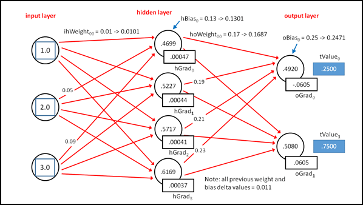

# 第四章反向传播

## 简介

反向传播是一种可以用来训练神经网络的算法。训练神经网络是找到一组权重和偏差值的过程，以便对于给定的一组输入，神经网络产生的输出非常接近一些已知的目标值。一旦你有了这些权重和偏差值，你就可以把它们应用到输出值未知的新输入值上，并进行预测。本章解释反向传播算法。


图 4-a:反向传播演示

反向传播(通常拼写为单个单词反向传播)有多种替代方法，但反向传播是迄今为止最常见的神经网络训练算法。了解反向传播到底是什么的一个好方法是查看**图 4-a** 中显示的演示程序的截图。演示程序创建了一个具有三个输入、四个隐藏节点和两个输出的虚拟神经网络。演示神经网络并不对应真正的问题，只对单个数据项起作用。

演示神经网络具有固定的、任意的输入值 1.0、2.0 和 3.0。演示程序的目标是找到一组 26 个权重和偏差值，以便计算的输出非常接近 0.2500 和 0.7500 的任意目标输出值。反向传播是一个迭代过程。经过 1000 次迭代，演示程序实际上找到了一组权重和偏差值，这些值生成的输出值非常接近两个期望的目标值。

反向传播将神经网络计算的输出(对于给定的一组输入，以及权重和偏置值)与目标值进行比较，确定实际值和目标值之间差异的大小和方向，然后调整神经网络的权重和偏置值，以便新的输出更接近目标值。重复这个过程，直到实际输出值足够接近目标值，或者达到某个最大迭代次数。

## 基本算法

反向传播算法有许多变体。用高级伪码表示，基本反向传播是:

循环直到某些退出条件
计算输出值
计算输出节点的梯度
计算隐藏层节点的梯度
更新所有权重和偏置值
结束循环

梯度是反映神经网络的计算输出值和期望目标值之间差异的值。事实证明，梯度使用相关激活函数的微积分导数。输出节点的梯度必须在隐藏层节点的梯度之前计算，或者换句话说，在前馈机制的相反方向。这就是为什么反向传播，也就是“反向传播”的简称，被如此命名的原因。与必须以特定顺序计算的梯度不同，输出节点权重和偏差以及隐藏层节点权重和偏差可以以任何顺序更新。

如果参考**图 4-a** 中的截图，可以看到反向传播使用了一个学习速率参数和一个动量参数。这两个值都会影响反向传播收敛到一组好的权重和偏置值的速度。较大的值允许反向传播学习得更快，但有超过最佳值集的风险。确定学习率和动量项的良好值主要是一个反复试验的问题。学习速率和动量项称为自由参数；你可以自由地将他们的价值观设定为你选择的任何东西。权重和偏差也称为自由参数。

许多神经网络参考文献指出反向传播是一种简单的算法。这只是部分正确。理解后，反向传播在代码中实现起来相对简单。但是，算法本身很深奥。机器学习研究人员花了很多年才推导出基本的反向传播算法。

## 计算梯度

反向传播的第一步是计算输出节点的梯度值。**图 4-b** 表示演示程序的虚拟 3-4-2 神经网络。三个固定输入值是 1.0、2.0 和 3.0。26 个权重和偏差值分别为 0.01、0.02、.。0.26.

由输入、权重和偏置值生成的当前输出值分别为 0.4920 和 0.5080。神经网络对隐藏层节点使用双曲正切函数，对输出层节点使用 softmax 激活。期望的目标值是 0.2500 和 0.7500。



图 4-b:反向传播机制

输出节点的梯度是计算的输出值和期望值之间的差值，乘以输出层使用的激活函数的微积分导数。差分项是合理的，但是为什么使用微积分导数项一点也不明显，它是深奥但美丽的数学的结果。

softmax 激活函数在某个值 *y* 下的微积分导数正好是 *y* (1 - *y* )。同样，这并不明显，是神经网络数学的一部分。输出节点梯度的值计算如下:

oGrad[0]=(1-0.4920)(0.4920)*(0.2500-0.4920)= 0.2499 *-0.2420 =-0.0605(四舍五入)
oGrad[1]=(1-0.5080)(0.5080)*(0.7500-0.5080)= 0.2499 * 0.2420 = 0.0605

计算的第一部分是导数项。第二部分是计算值和期望输出值之间的差异。计算值和期望值之间的差值的执行顺序非常重要，但在不同的实现中会有所不同。这里，差值被计算为(期望-计算)而不是(计算-期望)。

计算隐藏节点梯度的值使用输出节点梯度的值。隐藏节点的梯度是其激活函数乘以“下游”(在**图 4-b** 中向右)输出梯度和相关隐藏到输出权重的乘积之和的导数。请注意，以这里描述的方式计算梯度值会对如何计算误差做出隐含的数学假设。

这个计算最好用例子来解释。事实证明，双曲正切在某个值 *y* 处的导数为(1 - *y* )(1 + *y* )。带舍入的隐藏节点 0 的梯度计算如下:

hGrad[0]:
导数=(1-0.4699)(1+0.4699)= 0.5301 * 1.4699 = 0.7792
和=(-0.0605)(0.17)+(0.0605)(0.18)=-0.0103+0.0109 = 0.0006
hGrad[0]= 0.7792 * 0.00000

类似地，隐藏节点 1 的梯度为:

hGrad[1]:
导数=(1-0.5227)(1+0.5227)= 0.4773 * 1.5227 = 0.7268
和=(-0.0605)(0.19)+(0.0605)(0.20)=-0.0115+0.0121 = 0.0006
hGrad[3]= 0.7268 * 0.00000

以及:

hGrad[2]:
导数=(1-0.5717)(1+0.5717)= 0.4283 * 1.5717 = 0.6732
和=(-0.0605)(0.21)+(0.0605)(0.22)=-0.0127+0.0133 = 0.0006
hGrad[3]= 0.6732 * 0.00000

hGrad[3]:
导数=(1-0.6169)(1+0.6169)= 0.3831 * 1.6169 = 0.6194
和=(-0.0605)(0.23)+(0.0605)(0.24)=-0.0139+0.0145 = 0.0006
hGrad[3]= 0.6194 * 0.00000

## 计算权重和偏差增量

计算完所有隐藏节点和输出节点的梯度值后，这些值用于计算每个权重和偏差的小增量值(可以是正的或负的)。增量值被添加到旧的权重或偏差值中。理论上，新的权重和偏置值将产生更接近期望目标输出值的计算输出值。

权重或偏差的增量计算为一个称为学习速率的小常数、下游(向右)梯度和上游(向左)输入值的乘积。此外，还会计算并添加一个称为动量因子的额外值。动量因子是一个叫做动量项的小常数和前一次反向传播算法迭代的增量值的乘积。

像往常一样，计算最好用例子来解释。将权重从输入节点 0 更新到隐藏节点 0 是:

新 ihWeight[0][0]:
δ= 0.05 * 0.00047 * 1.0 = 0.000025
ihWeight[0][0]= 0.01+0.000025 = 0.010025
mFactor = 0.01 * 0.011 = 0.00011
ihWeight[0][0]= 0.010025+0.00011 = 0。

δ是 0.05(学习速率)乘以 0.00047(下游梯度)乘以 1.0(上游输入)。该增量 0.000025 被添加到旧的权重值 0.01，以给出更新的权重值。注意，因为输出节点梯度是使用(期望计算的)而不是(计算期望的)计算的，所以增量值被添加到旧的权重值。如果输出节点梯度已经被计算为(计算-期望的)，那么增量值将从旧的权重值中减去。

动量因子是 0.01(动量项)乘以 0.011(之前的增量)。在演示程序中，所有先前的增量值都被任意设置为 0.011，以初始化算法。没有必要初始化以前的增量值。如果初始的先前增量值都是 0.0，那么动量因子在反向传播算法的第一次迭代中将为零，但是从第二次迭代开始将(可能)非零。

隐藏节点 0 的新偏差值计算如下:

新 hBias[0]:
δ= 0.05 * 0.00047 = 0.000025
hBias[0]= 0.13+0.000025 = 0.130025
mFactor = 0.01 * 0.011 = 0.00011
hBias[0]= 0.130025+0.00011 = 0.1301(四舍五入)

更新权重和更新偏差之间的唯一区别是偏差值没有任何上游输入值。另一种概念化的方式是，偏置值具有虚拟的、恒定的 1.0 输入值。

在**图 4-b** 中，从隐藏节点 0 到输出节点 0 更新权重为:

新豪威特[0][0]:
δ= 0.05 *-0.0605 * 0.4699 =-0.001421
豪威特[0][0]= 0.17+-0.001421 = 0.168579
mFactor = 0.01 * 0.011 = 0.00011
豪威特[0][0] = 0.168579 + 0.00011

和以前一样，δ是学习率(0.05)乘以下游梯度(-0.0605)乘以上游输入(0.4699)。

## 实施反向传播演示

为了创建演示程序，我启动了 Visual Studio，并创建了一个名为 BackProp 的新 C#控制台应用程序。将模板代码加载到编辑器中后，我删除了除引用顶级 System 命名空间的单个语句之外的所有使用语句。演示程序没有重大意义。NET 版本依赖，所以任何版本的 Visual Studio 都应该可以工作。在解决方案资源管理器窗口中，我将文件 Program.cs 重命名为 back Program . cs，Visual Studio 自动将类 Program 重命名为 back Program。

演示程序的整体结构如**清单 4-a** 所示。程序类中的 Main 方法拥有所有的程序逻辑。程序类包含两个实用方法，ShowVector 和 ShowMatrix，它们对于研究输入、偏差和输出数组中的值以及输入到隐藏和隐藏到输出的权重矩阵非常有用。

这两个显示实用程序是用公共范围声明的，因此可以从 NeuralNetwork 类的方法中放置和调用它们。方法 ShowVector 的定义如下:

公共静态 void ShowVector(double[] vector，int valsPerRow，int decimals，

bool NewLine)
{
for(int I = 0；i <矢量。长度；++I)
{
if(I>0&&I % valperrow = = 0)
Console。write line(" ")；
控制台。写(向量[i]。ToString("F" +小数)。PadLeft(小数+4)+" ")；
}
if(NewLine = = true)Console。write line(" ")；
}

```
    using System;
    namespace BackProp
    {
      class BackPropProgram
      {
        static void Main(string[] args)
        {
          Console.WriteLine("\nBegin back-propagation demo\n");

          // All program control logic goes here.

          Console.WriteLine("\nEnd back-propagation demo\n");
          Console.ReadLine();
        }

        public static void ShowVector(double[] vector, int valsPerRow,
          int decimals,  bool newLine) { . . }
        public static void ShowMatrix(double[][] matrix, int decimals) { . . }
      } // Program

      public class NeuralNetwork
      {
        // Class fields go here.

        public NeuralNetwork(int numInput, int numHidden, int numOutput) { . . }
        public void SetWeights(double[] weights) { . . }
        public double[] GetWeights() { . . }
        public void FindWeights(double[] tValues, double[] xValues,
          double learnRate, double momentum, int maxEpochs) { . . }

        private static double[][] MakeMatrix(int rows, int cols) { . . }
        private static void InitMatrix(double[][] matrix, double value) { . . }
        private static void InitVector(double[] vector, double value) { . . }
        private double[] ComputeOutputs(double[] xValues) { . . }
        private static double HyperTan(double v) { . . }
        private static double[] Softmax(double[] oSums) { . . }
        private void UpdateWeights(double[] tValues, double learnRate, double momentum) { . . }
      }
    } // ns

```

清单 4-a:后台演示程序结构

实用方法 ShowMatrix 利用了这样一个事实，即演示使用了数组样式的矩阵，并在其矩阵参数的每行数组上调用方法 ShowVector:

public static void show matrix(double[][]matrix，int decimals)
{
int cols = matrix[0]。长度；
为(int I = 0；i <矩阵。长度；++(I)//每行。
ShowVector(矩阵[i]，cols，decimals，true)；

主要方法从实例化一个虚拟的 3-4-2 神经网络开始:

静态 void Main(string[]args)
{
Console。write line(" \ n 开始反向传播演示\ n ")；
控制台。WriteLine(“创建 3-4-2 神经网络\ n”)；
int NumInput = 3；
int numHidden = 4；
int NuMoutPut = 2；
NeuralNetwork nn =新的 NeuralNetwork(numInput，numHidden，numumutput)；

因为输入、隐藏和输出节点的数量不会改变，所以您可能需要考虑将这些值设为常量而不是变量。请注意，构造函数调用中没有任何内容表明神经网络使用反向传播。您可能希望将主逻辑代码包装在 try-catch 块中以处理异常。

接下来，演示程序初始化神经网络的权重和偏差值:

double[]权重=新 double[26] {
0.01、0.02、0.03、0.04、0.05、0.06、0.07、0.08、
0.09、0.10、0.11、0.12、0.13、0.14、0.15、0.16、
0.17、0.18、0.19、0.20、0.21、0
控制台。WriteLine("将虚拟初始权重设置为:")；
ShowVector(权重，8，2，真)；
nn。SetWeights(权重)；

初始权重和偏差值是从 0.01 到 0.26 的连续值，只是为了使反向传播算法的解释更容易可视化。在非演示场景中，神经网络权重和偏差值通常设置为小的随机值。

接下来，演示设置固定的输入值和所需的目标输出值:

double[] xValues =新 double[3] { 1.0，2.0，3.0 }；//输入。
double[]tValues = new double[2]{ 0.2500，0.7500 }；//目标产出。
控制台。write line(" \ n 设置固定输入= ")；
ShowVector(xValues，3，1，true)；
控制台。WriteLine("设置固定目标输出= ")；
ShowVector(tValues，2，4，true)；

在演示中，只有一个输入和相应的目标项目。在实际的神经网络训练场景中，会有许多输入项，每个输入项都有自己的目标值。

接下来，演示程序准备通过设置参数值来使用反向传播算法:

double learnRate = 0.05
双动量= 0.01；
int maxEpochs = 1000；
控制台。write line(" \ n 设置学习率=+learn rate。ToString(" F2 ")；
控制台。WriteLine("设置动量= " +动量。ToString(" F2 ")；
控制台。WriteLine("设置最大时期=+最大时期+" \ n ")；

如果您回顾本章前面几节中的反向传播算法解释，您会发现学习速率会影响要添加到权重或偏差中的增量值的大小。较大的学习速率值会产生较大的增量值，这反过来会更快地调整权重和偏差。那么为什么不使用非常大的学习率呢，例如值为 1.0？在反向传播算法的每次迭代中，大的学习速率值会带来过多调整权重和偏差值的风险。这可能导致权重和偏置值连续超过最优值，然后又低于最优值的情况。

另一方面，非常小的学习速率值通常会导致神经网络的权重和偏差值缓慢但稳定地提高。然而，如果学习速度太小，那么训练时间可能会长得不可接受。实践表明，作为一般的经验法则，使用较小的值作为学习速率更好——较大的值往往会导致较差的结果。

反向传播的早期实现没有使用动量项。动量是每个权重和偏差值的附加因子(如果因子为负，则基本上减去)。动量的使用主要是为了在学习率较低时加快训练速度，通常情况下是这样的。请注意，通过将动量项的值设置为 0.0，您将基本上忽略动量因子。

为学习率和动量项找到好的值主要是一个反复试验的问题。反向传播算法往往对选定的值非常敏感，这意味着即使学习速率或动量的微小变化也会导致算法行为的巨大变化，无论是好的还是坏的。

maxEpochs 值 1，000 是循环计数限制。对于演示程序，该值是通过反复试验确定的，这是可能的，因为当计算的输出值非常接近所需的输出值时，很容易看到。在非演示场景中，当计算输出和期望输出之间的误差低于某个阈值时，反向传播环路通常会终止。

演示程序最后调用使用反向传播算法的公共方法:

nn。查找权重(tValues、xValues、learnRate、动量、最大值)；
double[] bestWeights = nn。GetWeights()；
控制台。write line(" \ n 找到的最大权重:")；
ShowVector(bestWeights，8，4，true)；
控制台。write line(" \ nAnD 反向传播演示\ n ")；
控制台。ReadLine()；
} //主

调用方法被命名为 FindWeights，而不是像 Train 这样的东西，以强调这样一个事实，即该方法旨在说明反向传播算法，而不是实际训练需要不止一组输入和目标值的神经网络。

## 神经网络类定义

除了计算输出值的前馈机制所需的字段之外，支持反向传播的神经网络类的设计还需要几个额外的字段。演示神经网络的结构在**列表 4-b** 中给出。

```
    public class NeuralNetwork
    {
      private int numInput;
      private int numHidden;
      private int numOutput;

      private double[] inputs;

      private double[][] ihWeights;
      private double[] hBiases;
      private double[] hOutputs;

      private double[][] hoWeights;
      private double[] oBiases;
      private double[] outputs;

      private double[] oGrads; // Output gradients for back-propagation.
      private double[] hGrads; // Hidden gradients for back-propagation.

      private double[][] ihPrevWeightsDelta;  // For momentum with back-propagation.
      private double[] hPrevBiasesDelta;
      private double[][] hoPrevWeightsDelta;
      private double[] oPrevBiasesDelta;

      // Constructor and methods go here.
    }

```

清单 4-b:演示神经网络成员字段

演示神经网络有六个阵列，用于反向传播算法。回想一下，反向传播为每个输出和隐藏节点计算一个梯度。数组 oGrads 和 hGrads 分别保存输出节点梯度和隐藏节点梯度的值。此外，请记住，对于每个权重和偏差，动量因子是动量项(演示中为 0.01)与权重或偏差的上一次迭代的上一个增量值的乘积。矩阵 ihPrevWeightsDelta 保存输入到隐藏权重的先前差值。类似地，矩阵 hoPrevWeightsDelta 保存隐藏到输出权重的先前增量值。数组 hPrevBiasesDelta 和 oPrevBiasesDelta 分别保存隐藏节点偏差和输出节点偏差的先前增量值。

乍一看，将与反向传播相关的六个数组和矩阵放在执行反向传播的方法中似乎是一种更简洁的设计。然而，因为在几乎所有的实现中，这些数组和矩阵都是由一个以上的类方法所需要的，所以将数组和矩阵放在清单 4-b 中更有效。

## 神经网络构造器

神经网络构造器的代码在**清单 4-c** 中给出。构造函数接受输入、隐藏和输出节点数的参数。激活函数被硬连线到神经网络的定义中。另一种方法是向构造函数传递两个额外的参数值，以指示使用哪些激活函数。

```
    public NeuralNetwork(int numInput, int numHidden, int numOutput)
    {
      this.numInput = numInput;
      this.numHidden = numHidden;
      this.numOutput = numOutput;

      this.inputs = new double[numInput];
      this.ihWeights = MakeMatrix(numInput, numHidden);
      this.hBiases = new double[numHidden];
      this.hOutputs = new double[numHidden];

      this.hoWeights = MakeMatrix(numHidden, numOutput);
      this.oBiases = new double[numOutput];
      this.outputs = new double[numOutput];

      oGrads = new double[numOutput];
      hGrads = new double[numHidden];

      ihPrevWeightsDelta = MakeMatrix(numInput, numHidden);
      hPrevBiasesDelta = new double[numHidden];
      hoPrevWeightsDelta = MakeMatrix(numHidden, numOutput);
      oPrevBiasesDelta = new double[numOutput];

      InitMatrix(ihPrevWeightsDelta, 0.011);
      InitVector(hPrevBiasesDelta, 0.011);
      InitMatrix(hoPrevWeightsDelta, 0.011);
      InitVector(oPrevBiasesDelta, 0.011);
    }

```

清单 4-c:构造函数

构造函数的前几行与前一章中演示前馈神经网络所用的行完全相同。输入到隐藏的权重矩阵和隐藏到输出的权重矩阵是使用私有助手方法 MakeMatrix 分配的:

私有静态 double[][]make matrix(int row，int cols)
{
double[][]结果=新 double[row][]；
为(int I = 0；一<排；+++I)
结果[i] =新双[cols]；
返回结果；
}

每个输入到隐藏和隐藏到输出节点都需要一个先前的增量，MakeMatrix 方法也用于为这两个矩阵分配空间。输出节点和隐藏节点梯度的数组，以及隐藏节点偏差和输出节点偏差的先前增量的数组，都是使用“new”关键字直接分配的。

构造函数调用两个私有静态实用程序方法 InitMatrix 和 InitVector，将所有以前的增量值初始化为 0.011。如前所述，这不是必需的，这样做是为了使前面章节中的反向传播解释更容易理解。

方法 InitVector 定义为:

私有静态 void InitVector(double[] vector，double value)
{
for(int I = 0；我<矢。长度；++i)
向量[i] =值；
}

方法 InitMatrix 定义为:

私有静态 void InitMatrix(double[][]matrix，double value)
{
int rows = matrix。长度；
int cols = matrix[0]。长度；
为(int I = 0；i <排；++i)
为(int j = 0；j<cols；++j)
矩阵[i][j] =值；
}

请注意，构造函数使用静态方法 InitVector 和 InitMatrix 来初始化所有以前的权重和偏差值。另一种方法是编写一个接受 double 类型值的非静态类方法 InitializeAllPrev，然后遍历前面的四个增量数组和矩阵，将它们初始化为参数值。

## 获取和设置权重和偏差

演示程序使用类方法设置权重和获取权重来分配和检索神经网络的权重和偏差值。设置权重和获取权重的代码显示在**列表 4-d** 和**列表 4-e** 中。

```
    public void SetWeights(double[] weights)
    {
      int k = 0; // Pointer into weights parameter.

      for (int i = 0; i < numInput; ++i)
        for (int j = 0; j < numHidden; ++j)
          ihWeights[i][j] = weights[k++];

      for (int i = 0; i < numHidden; ++i)
        hBiases[i] = weights[k++];

      for (int i = 0; i < numHidden; ++i)
        for (int j = 0; j < numOutput; ++j)
          hoWeights[i][j] = weights[k++];

      for (int i = 0; i < numOutput; ++i)
        oBiases[i] = weights[k++];
    }

```

清单 4-d:设置权重和偏差值

方法 SetWeights 接受一个保存所有权重和偏差值的数组参数。值的存储顺序假定为(1)输入到隐藏权重，(2)隐藏节点偏差，(3)隐藏到输出权重，以及(4)输出偏差。假设权重值以主要行的形式存储；换句话说，这些值从左到右和从上到下从数组转移到两个权重矩阵中。

您可能需要考虑在设置权重中进行输入参数错误检查:

int numwrites =(numminput * numHidden)+numHidden+
(numHidden * nummoutput)+nummoutput；
if(重量。长度！= numwrites)
抛出新的异常(“设置权重中的错误权重数组长度”)；

方法设置权重的另一种方法是重构或重载方法，以接受四个参数，大致如下:

公共 void SetWeights(double[][]ihWeights，double[]]hBiases，

double[][]howelights，double[] oBiases)

方法获取权重与设置权重是对称的。返回值是一个数组，其中的值是输入到隐藏权重(以主要行的形式)，后面是隐藏偏差，后面是隐藏到输出权重，最后是输出偏差。

```
    public double[] GetWeights()
    {
      int numWeights = (numInput * numHidden) + numHidden + (numHidden * numOutput) + numOutput;

      double[] result = new double[numWeights];
      int k = 0;  // Pointer into results array.

      for (int i = 0; i < numInput; ++i)
        for (int j = 0; j < numHidden; ++j)
          result[k++] = ihWeights[i][j];

      for (int i = 0; i < numHidden; ++i)
        result[k++] = hBiases[i];

      for (int i = 0; i < numHidden; ++i)
        for (int j = 0; j < numOutput; ++j)
          result[k++] = hoWeights[i][j];

      for (int i = 0; i < numOutput; ++i)
        result[k++] = oBiases[i];

      return result;
    }

```

清单 4-e:获取权重和偏差值

与方法 SetWeights 不同，它可以很容易地重构为接受单独的权重和偏置数组，重构方法 GetWeights 以返回单独的数组会有点尴尬。一种方法是使用外部参数。另一种方法是定义权重和偏差值容器类或结构。

## 计算输出值

反向传播将计算的输出值与期望的输出值进行比较，以计算梯度，梯度又用于计算增量，增量又用于修改权重和偏差值。类方法计算输出在**清单 4-f** 中给出。

```
    private double[] ComputeOutputs(double[] xValues)
    {
      double[] hSums = new double[numHidden];
      double[] oSums = new double[numOutput];

      for (int i = 0; i < xValues.Length; ++i)
        inputs[i] = xValues[i];

      for (int j = 0; j < numHidden; ++j)
        for (int i = 0; i < numInput; ++i)
          hSums[j] += inputs[i] * ihWeights[i][j];

      for (int i = 0; i < numHidden; ++i)
        hSums[i] += hBiases[i];

      for (int i = 0; i < numHidden; ++i)
        hOutputs[i] = HyperTan(hSums[i]);

      for (int j = 0; j < numOutput; ++j)
        for (int i = 0; i < numHidden; ++i)
          oSums[j] += hOutputs[i] * hoWeights[i][j];

      for (int i = 0; i < numOutput; ++i)
        oSums[i] += oBiases[i];

      double[] softOut = Softmax(oSums); // Softmax does all outputs at once.
      for (int i = 0; i < outputs.Length; ++i)
        outputs[i] = softOut[i];

      double[] result = new double[numOutput];
      for (int i = 0; i < outputs.Length; ++i)
        result[i] = outputs[i];

      return result;
    }

```

清单 4-f:计算输出值

方法计算输出为全连接神经网络实现正常的前馈机制。使用神经网络时，通常会在错误检查和性能之间进行权衡。例如，在方法计算输出中，您可以考虑添加一个输入参数检查，如:

if (xValues。长度！= this.numInput)
抛出新异常(“ComputeOutputs 中错误的 xValues 数组长度”)；

然而，在非演示场景中，方法 ComputeOutputs 在训练期间通常会被调用成千上万次，这样的错误检查会对性能产生很大的负面影响。一个可能的策略是最初在开发过程中包含错误检查，然后随着时间的推移，随着您对代码的正确性越来越有信心，慢慢地移除这些检查。

硬连线隐藏层双曲正切激活函数定义为:

私有静态双 HyperTan(双 v)

{

if (v < -20.0)

return-1.0；

否则如果(v > 20.0)

返回 1.0；

其他

返回数学。tanh(v)；

}

硬连线输出层 softmax 激活功能在**列表 4-g** 中显示。回想一下激活函数和反向传播之间的重要关系。在计算输出节点和隐藏节点梯度值时，需要使用输出层和隐藏层激活函数的微积分导数。

```
    private static double[] Softmax(double[] oSums)
    {
      double max = oSums[0];
      for (int i = 0; i < oSums.Length; ++i)
        if (oSums[i] > max)
          max = oSums[i];

      double scale = 0.0;
      for (int i = 0; i < oSums.Length; ++i)
        scale += Math.Exp(oSums[i] - max);

      double[] result = new double[oSums.Length];
      for (int i = 0; i < oSums.Length; ++i)
        result[i] = Math.Exp(oSums[i] - max) / scale;

      return result; // xi sum to 1.0.
    }

```

清单 4-g:软最大激活

实际上，除了在极少数情况下，神经网络中通常只使用三种激活函数:双曲正切函数、逻辑 sigmoid 函数和 softmax 函数。这三个函数在某个值 *y* 下的微积分导数为:

双曲正切:(1-*y*)(1+*y*)
logistic sigmoid:*y*(1-*y*)
soft max:*y*(1-*y*)

请注意，逻辑 sigmoid 和 softmax 激活函数的导数是相同的。为什么需要激活函数的微积分导数来计算梯度的数学解释很吸引人(如果你喜欢数学的话)，但这不在本书的范围之内。

## 实现查找权重方法

演示程序在公共类方法 FindWeights 中实现反向传播。FindWeights 的代码在**清单 4-h** 中给出。

如果您检查方法查找权重，您将很快看到该方法实际上是一个包装器，它迭代地调用私有方法计算输出和更新权重。在某些实现中，方法计算输出被称为前馈，方法更新权重被称为反向传播。使用这个术语，伪代码类似于:

循环直到满足某些退出条件
前馈
反向传播
结束循环

但是，这个术语可能有些模糊，因为反向传播指的是更新权重的整个过程，以及实现中的特定反向传播方法。

```
    public void FindWeights(double[] tValues, double[] xValues, double learnRate,
      double momentum, int maxEpochs)
    {
      int epoch = 0;
      while (epoch <= maxEpochs)
      {
        double[] yValues = ComputeOutputs(xValues);
        UpdateWeights(tValues, learnRate, momentum);

        if (epoch % 100 == 0)
        {
          Console.Write("epoch = " + epoch.ToString().PadLeft(5) + "   curr outputs = ");
          BackPropProgram.ShowVector(yValues, 2, 4, true);
        }

        ++epoch;
      } // Find loop.
    }

```

清单 4-h:查找权重和偏差值，以便计算的输出与目标输出相匹配

方法 FindWeights 接受五个输入参数值。数组参数值保存所需的目标值。tValues 上的错误检查可以验证数组的长度是否与类成员变量 numOutput 中的值相同。数组参数 xValues 保存要输入神经网络的输入值。对 xValues 的错误检查可以验证 xValues 的长度是否与类成员变量 numInput 相同。

参数 learnRate 保存学习速率值。尽管学习速率的概念在神经网络研究和实践中是标准的，但是在学习速率值的确切使用方式上，不同的实现方式之间存在差异。因此，在特定的神经网络实现中对特定问题有效的学习速率值可能对相同的问题完全无效，而是使用不同的神经网络实现。

参数动量保持动量项值。严格来说，动量项的使用独立于反向传播算法，但实际上动量的使用更频繁。与学习速率一样，动量可以用不同的方式实现，因此对于给定的问题，一个系统上的好动量值可能在另一个系统上不是好动量值。

参数 maxEpochs 设置计算输出和更新权重循环迭代的次数。因为变量纪元被初始化为 0，并且循环条件小于或等于而不是小于，所以循环实际上迭代 maxEpochs + 1 次。使用固定迭代次数的一个常见替代方法是迭代，直到权重和偏差值没有变化或变化很小。请注意，当使用动量时，这些信息在前面的增量阵列和矩阵中是可用的。

方法 FindWeights 每 100 次迭代显示当前神经网络输出值。请注意，静态助手方法 ShowVector 对主 BackPropProgram 类是公共的，因此当该方法由类名限定时，它对类 NeuralNetwork 是可见的。与使用无法访问源代码的封闭系统相比，能够在任何地方插入诊断输出是编写定制神经网络代码的一大优势。

## 实现反向传播算法

反向传播算法的核心在 UpdateWeights 方法中实现。方法更新权重的定义如下:

私空更新权重(双[] tValues，双 learnRate，双动量)
{
if (tValues。长度！= numutput)
抛出新异常(“目标数组与 UpdateWeights 中的输出长度不同”)；

该方法是用私有范围声明的，因为它在向调用程序公开的方法 FindWeights 中使用。在开发过程中，您可能会发现将 UpdateWeights 声明为公共的很有用，这样就可以直接从测试工具中进行测试。方法 UpdateWeights 接受三个参数。请注意，由于 UpdateWeights 是一个类成员，它可以直接访问类输出数组，因此当前输出值不必作为数组参数传递给方法。方法 UpdateWeights 对目标值数组的长度执行初步错误检查。在非演示场景中，为了提高性能，您通常会忽略此检查。

该方法继续计算每个输出层节点的梯度:

for(int I = 0；i < oGrads.Length; ++i)
{
双导数= (1 -输出[i]) *输出[I]；
oGrads[i] =导数* (tValues[i] -输出[I])；
}

回想一下，因为演示神经网络使用 softmax 激活，所以值 *y* 处的微积分导数是 *y* (1 - *y* )。还要注意，演示实现使用(目标计算的)而不是(计算的目标)。在比较不同的神经网络实现时，必须非常仔细地观察目标输出值和计算输出值的相减顺序。

因为 UpdateWeights 访问类数组输出，所以可能存在所谓的同步依赖关系。换句话说，方法 UpdateWeights 假设调用了方法 ComputeOutputs，因此输出数组保存当前计算的输出值。

接下来，方法 UpdateWeights 计算每个隐藏层节点的梯度:

for(int I = 0；i < hGrads.Length; ++i)
{
双导数=(1-hout puts[I])*(1+hout puts[I])；
双和= 0.0；
为(int j = 0；j<numOutput；++j)
sum+= oGrads[j]* howelights[I][j]；
hGrads[i] =导数*和；
}

如前所述，演示使用双曲正切函数激活隐藏层，双曲正切在值 *y* 处的导数为(1 - *y* )(1 + *y* )。虽然很短，但这几行代码相当棘手。局部变量“和”累加每个下游梯度(输出节点梯度)与其相关的隐藏到输出权重的乘积。

接下来，更新权重调整输入到隐藏权重:

for(int I = 0；i < ihWeights.Length; ++i)
{
为(int j = 0；j<I 重量[i]。长度；++j)
{
双增量= learnRate * hGrads[j] *输入[I]；
ihWeights[I][j]+= delta；
ihWeights[i][j] +=动量* ihprevweights sdelta[I][j]；
ihPrevWeightsDelta[I][j]= delta；//保存增量。
}

同样，代码很短，但逻辑相当微妙。还涉及到一些迷人的低级编码细节。嵌套 for 循环使用标准方法迭代输入到隐藏权重矩阵。有几种选择。一种替代方法是利用矩阵的所有列都具有相同长度的事实，只使用第一行的长度，如下所示:

for(int I = 0；i < ihWeights.Length; ++i)
{
为(int j = 0；j < ihWeights[0]。长度；++j)

另一种选择是回忆输入到隐藏权重矩阵的行数等于神经网络的输入值数。矩阵的列数等于隐藏节点的数量。因此，您可以将其编码为:

for(int I = 0；i < this.numInput; ++i)
{
为(int j = 0；<j .本名。++j)

对每种方法生成的中间语言的检查表明，使用 numInput 和 numHidden 比使用五个中间语言指令要短。这是以稍微失去清晰度为代价的。

方法更新权重继续更新隐藏的节点偏差:

for(int I = 0；i < hBiases。长度；++i)

{

double delta = learn rate * hGrads[I]；

hBiases[I]+= delta；

hBiases[i] += momentum * hPrevBiasesDelta[i];

hprevbiasedelta[I]= delta；//保存 delta。

}

因为偏差可以被认为是具有虚拟常数 1.0 值输入的特殊权重，所以反向传播计算增量的一些实现如下:

double delta = learn rate * hGrads[I]* 1.0；

这包括不需要的乘法运算，但是使得偏置值的增量计算与正常权重值的增量计算对称。

接下来，该方法更新隐藏到输出的权重:

for(int I = 0；我

{

for(int j = 0；j

{

double delta = learn rate * oGrads[j]* hout puts[I]；

豪威[i][j] +=德尔塔；

howelights[I][j]+=动量* hoPrevWeightsDelta[I][j]；

hoPrevWeightsDelta[I][j]= delta；//保存增量。

}

}

方法更新权重通过更新输出节点偏差来完成:

for(int I = 0；i < oBiases。长度；++i)

{

double delta = learn rate * oGrads[I]* 1.0；

oBiases[I]+= delta；

嗜酸性粒细胞[i] +=动量* opverbiasedelta[I]；

偏置差值[i] =差值；//保存 delta。

}

} //更新权重

更新权重和偏差的最后四个代码块——输入到隐藏权重、隐藏节点偏差、隐藏到输出权重和输出节点偏差——可以以任何顺序执行。

## 完整的演示程序源代码

```
    using System;
    namespace BackProp
    {
      class BackPropProgram
      {
        static void Main(string[] args)
        {
          Console.WriteLine("\nBegin back-propagation demo\n");

          Console.WriteLine("Creating a 3-4-2 neural network\n");
          int numInput = 3;
          int numHidden = 4;
          int numOutput = 2;
          NeuralNetwork nn = new NeuralNetwork(numInput, numHidden, numOutput);

          double[] weights = new double[26] {
              0.01, 0.02, 0.03, 0.04, 0.05, 0.06, 0.07, 0.08,
              0.09, 0.10, 0.11, 0.12, 0.13, 0.14, 0.15, 0.16,
              0.17, 0.18, 0.19, 0.20, 0.21, 0.22, 0.23, 0.24,
              0.25, 0.26 };

          Console.WriteLine("Setting dummy initial weights to:");
          ShowVector(weights, 8, 2, true);
          nn.SetWeights(weights);

          double[] xValues = new double[3] { 1.0, 2.0, 3.0 }; // Inputs.
          double[] tValues = new double[2] { 0.2500, 0.7500 }; // Target outputs.

          Console.WriteLine("\nSetting fixed inputs = ");
          ShowVector(xValues, 3, 1, true);
          Console.WriteLine("Setting fixed target outputs = ");
          ShowVector(tValues, 2, 4, true);

          double learnRate = 0.05;
          double momentum = 0.01;
          int maxEpochs = 1000;
          Console.WriteLine("\nSetting learning rate = " + learnRate.ToString("F2"));
          Console.WriteLine("Setting momentum = " + momentum.ToString("F2"));
          Console.WriteLine("Setting max epochs = " + maxEpochs + "\n");

          nn.FindWeights(tValues, xValues, learnRate, momentum, maxEpochs);

          double[] bestWeights = nn.GetWeights();
          Console.WriteLine("\nBest weights found:");
          ShowVector(bestWeights, 8, 4, true);

          Console.WriteLine("\nEnd back-propagation demo\n");
          Console.ReadLine();
        } // Main

        public static void ShowVector(double[] vector, int valsPerRow, int decimals, bool newLine)
        {
          for (int i = 0; i < vector.Length; ++i)
          {
            if (i > 0 && i % valsPerRow == 0)
              Console.WriteLine("");
            Console.Write(vector[i].ToString("F" + decimals).PadLeft(decimals + 4) + " ");
          }

          if (newLine == true) Console.WriteLine("");
        }

        public static void ShowMatrix(double[][] matrix, int decimals)
        {
          int cols = matrix[0].Length;
          for (int i  = 0; i < matrix.Length; ++i) // Each row.
            ShowVector(matrix[i], cols, decimals, true);
        }
      } // Program class

      public class NeuralNetwork
      {
        private int numInput;
        private int numHidden;
        private int numOutput;

        private double[] inputs;

        private double[][] ihWeights;
        private double[] hBiases;
        private double[] hOutputs;

        private double[][] hoWeights;
        private double[] oBiases;
        private double[] outputs;

        private double[] oGrads; // Output gradients for back-propagation.
        private double[] hGrads; // Hidden gradients for back-propagation.

        private double[][] ihPrevWeightsDelta;  // For momentum.
        private double[] hPrevBiasesDelta;
        private double[][] hoPrevWeightsDelta;
        private double[] oPrevBiasesDelta;

        public NeuralNetwork(int numInput, int numHidden, int numOutput)
        {
          this.numInput = numInput;
          this.numHidden = numHidden;
          this.numOutput = numOutput;

          this.inputs = new double[numInput];
          this.ihWeights = MakeMatrix(numInput, numHidden);
          this.hBiases = new double[numHidden];
          this.hOutputs = new double[numHidden];

          this.hoWeights = MakeMatrix(numHidden, numOutput);
          this.oBiases = new double[numOutput];
          this.outputs = new double[numOutput];

          oGrads = new double[numOutput];
          hGrads = new double[numHidden];

          ihPrevWeightsDelta = MakeMatrix(numInput, numHidden);
          hPrevBiasesDelta = new double[numHidden];
          hoPrevWeightsDelta = MakeMatrix(numHidden, numOutput);
          oPrevBiasesDelta = new double[numOutput];

          InitMatrix(ihPrevWeightsDelta, 0.011);
          InitVector(hPrevBiasesDelta, 0.011);
          InitMatrix(hoPrevWeightsDelta, 0.011);
          InitVector(oPrevBiasesDelta, 0.011);
        }

        private static double[][] MakeMatrix(int rows, int cols)
        {
          double[][] result = new double[rows][];
          for (int i = 0; i < rows; ++i)
            result[i] = new double[cols];
          return result;
        }

        private static void InitMatrix(double[][] matrix, double value)
        {
          int rows = matrix.Length;
          int cols = matrix[0].Length;
          for (int i = 0; i < rows; ++i)
            for (int j = 0; j < cols; ++j)
              matrix[i][j] = value;
        }

        private static void InitVector(double[] vector, double value)
        {
          for (int i = 0; i < vector.Length; ++i)
            vector[i] = value;
        }

        public void SetWeights(double[] weights)
        {
          //int numWeights = (numInput * numHidden) + numHidden +
          //  (numHidden * numOutput) + numOutput;
          //if (weights.Length != numWeights)
          //  throw new Exception("Bad weights array");

          int k = 0; // Pointer into weights.

          for (int i = 0; i < numInput; ++i)
            for (int j = 0; j < numHidden; ++j)
              ihWeights[i][j] = weights[k++];

          for (int i = 0; i < numHidden; ++i)
            hBiases[i] = weights[k++];

          for (int i = 0; i < numHidden; ++i)
            for (int j = 0; j < numOutput; ++j)
              hoWeights[i][j] = weights[k++];

          for (int i = 0; i < numOutput; ++i)
            oBiases[i] = weights[k++];
        }

        public double[] GetWeights()
        {
          int numWeights = (numInput * numHidden) + numHidden +
            (numHidden * numOutput) + numOutput;
          double[] result = new double[numWeights];

          int k = 0;
          for (int i = 0; i < numInput; ++i)
            for (int j = 0; j < numHidden; ++j)
              result[k++] = ihWeights[i][j];

          for (int i = 0; i < numHidden; ++i)
            result[k++] = hBiases[i];

          for (int i = 0; i < numHidden; ++i)
            for (int j = 0; j < numOutput; ++j)
              result[k++] = hoWeights[i][j];

          for (int i = 0; i < numOutput; ++i)
            result[k++] = oBiases[i];

          return result;
        }

        private double[] ComputeOutputs(double[] xValues)
        {
          if (xValues.Length != numInput)
            throw new Exception("Bad xValues array");

          double[] hSums = new double[numHidden];
          double[] oSums = new double[numOutput];

          for (int i = 0; i < xValues.Length; ++i)
            inputs[i] = xValues[i];

          for (int j = 0; j < numHidden; ++j)
            for (int i = 0; i < numInput; ++i)
              hSums[j] += inputs[i] * ihWeights[i][j];

          for (int i = 0; i < numHidden; ++i)
            hSums[i] += hBiases[i];

          for (int i = 0; i < numHidden; ++i)
            hOutputs[i] = HyperTan(hSums[i]);

          for (int j = 0; j < numOutput; ++j)
            for (int i = 0; i < numHidden; ++i)
              oSums[j] += hOutputs[i] * hoWeights[i][j];

          for (int i = 0; i < numOutput; ++i)
            oSums[i] += oBiases[i];

          double[] softOut = Softmax(oSums); // All outputs at once.
          for (int i = 0; i < outputs.Length; ++i)
            outputs[i] = softOut[i];

          double[] result = new double[numOutput];
          for (int i = 0; i < outputs.Length; ++i)
            result[i] = outputs[i];

          return result;
        }

        private static double HyperTan(double v)
        {
          if (v < -20.0)
            return -1.0;
          else if (v > 20.0)
            return 1.0;
          else  return Math.Tanh(v);
        }

        private static double[] Softmax(double[] oSums)
        {
          double max = oSums[0];
          for (int i = 0; i < oSums.Length; ++i)
            if (oSums[i] > max)
              max = oSums[i];

          double scale = 0.0;
          for (int i = 0; i < oSums.Length; ++i)
            scale += Math.Exp(oSums[i] - max);

          double[] result = new double[oSums.Length];
          for (int i = 0; i < oSums.Length; ++i)
            result[i] = Math.Exp(oSums[i] - max) / scale;

          return result; // xi sum to 1.0.
        }

        public void FindWeights(double[] tValues, double[] xValues, double learnRate,
          double momentum, int maxEpochs)
        {
          // Call UpdateWeights maxEpoch times.
          int epoch = 0;
          while (epoch <= maxEpochs)
          {
            double[] yValues = ComputeOutputs(xValues);
            UpdateWeights(tValues, learnRate, momentum);

            if (epoch % 100 == 0)
            {
              Console.Write("epoch = " + epoch.ToString().PadLeft(5) + "   curr outputs = ");
              BackPropProgram.ShowVector(yValues, 2, 4, true);
            }

            ++epoch;
          } // Find loop.
        }

        private void UpdateWeights(double[] tValues, double learnRate, double momentum)
        {
          // Assumes that SetWeights and ComputeOutputs have been called.
          if (tValues.Length != numOutput)
            throw new Exception("target values not same Length as output in UpdateWeights");

          // 1\. Compute output gradients. Assumes softmax.
          for (int i = 0; i < oGrads.Length; ++i)
          {
            double derivative = (1 - outputs[i]) * outputs[i]; // Derivative of softmax is y(1-y).
            oGrads[i] = derivative * (tValues[i] - outputs[i]); // oGrad = (1 - O)(O) * (T-O)
          }

          // 2\. Compute hidden gradients. Assumes tanh!
          for (int i = 0; i < hGrads.Length; ++i)
          {
            double derivative = (1 - hOutputs[i]) * (1 + hOutputs[i]); // f' of tanh is (1-y)(1+y).
            double sum = 0.0;
            for (int j = 0; j < numOutput; ++j) // Each hidden delta is the sum of numOutput terms.
              sum += oGrads[j] * hoWeights[i][j]; // Each downstream gradient * outgoing weight.
            hGrads[i] = derivative * sum; // hGrad = (1-O)(1+O) * Sum(oGrads*oWts)
          }

          // 3\. Update input to hidden weights.
          for (int i = 0; i < ihWeights.Length; ++i)
          {
            for (int j = 0; j < ihWeights[i].Length; ++j)
            {
              double delta = learnRate * hGrads[j] * inputs[i];
              ihWeights[i][j] += delta; // Update.
              ihWeights[i][j] += momentum * ihPrevWeightsDelta[i][j]; // Add momentum factor.
              ihPrevWeightsDelta[i][j] = delta; // Save the delta for next time.
            }
          }

          // 4\. Update hidden biases.
          for (int i = 0; i < hBiases.Length; ++i)
          {
            double delta = learnRate * hGrads[i] * 1.0; // The 1.0 is a dummy value; it could be left out.
            hBiases[i] += delta;
            hBiases[i] += momentum * hPrevBiasesDelta[i];
            hPrevBiasesDelta[i] = delta; // Save delta.
          }

          // 5\. Update hidden to output weights.
          for (int i = 0; i < hoWeights.Length; ++i)
          {
            for (int j = 0; j < hoWeights[i].Length; ++j)
            {
              double delta = learnRate * oGrads[j] * hOutputs[i];
              hoWeights[i][j] += delta;
              hoWeights[i][j] += momentum * hoPrevWeightsDelta[i][j];
              hoPrevWeightsDelta[i][j] = delta; // Save delta.
            }
          }

          // 6\. Update output biases.
          for (int i = 0; i < oBiases.Length; ++i)
          {
            double delta = learnRate * oGrads[i] * 1.0;
            oBiases[i] += delta;
            oBiases[i] += momentum * oPrevBiasesDelta[i];
            oPrevBiasesDelta[i] = delta; // Save delta.
          }
        } // UpdateWeights
      } // NN class
    } // ns

```