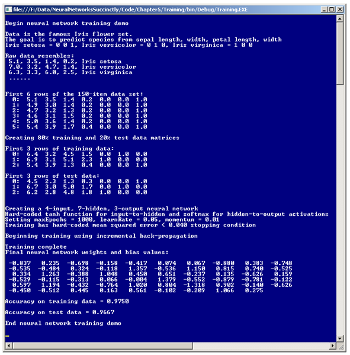
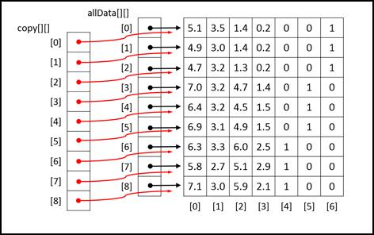
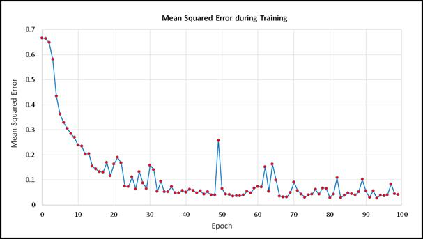

# 五、训练

## 简介

神经网络的最终目标是做出预测。为了进行预测，必须首先训练神经网络。训练神经网络是找到一组良好的权重和偏差值的过程，以便一些训练数据的已知输出与使用权重和偏差值计算的输出相匹配。特定问题的最终权重和偏差值通常统称为模型。然后，该模型可用于预测以前未见过的、不具有已知输出值的输入的输出。



图 5-a:训练演示

为了更好地理解什么是神经网络训练，请看一下**图 5-a** 中演示程序的截图。演示程序解决了神经网络领域一个简单但可能是最著名的问题。目标是根据花的四个数字属性预测鸢尾花的种类:花瓣长度、花瓣宽度、萼片长度和萼片宽度。花瓣是大多数人认为鸢尾真正的花部分。萼片是一种绿色结构，你可以把它想象成一片特化的叶子。有三种可能的种类:*濑户鸢尾*、*云芝*和*海滨鸢尾*。该数据集最早由数学家罗纳德·费雪在 1936 年发表，因此通常被称为费希尔虹膜数据。

数据集由总共 150 个项目组成，三种鸢尾各有 50 个数据。因为神经网络只理解数字数据，所以演示必须使用三个可能的 y 值被编码为数字的数据。这里种*鸢尾*编码为(0，0，1)*彩叶鸢尾*编码为(0，1，0)，种*弗吉尼亚鸢尾*编码为(1，0，0)。

演示将 150 个项目的数据集随机分成 120 个项目的子集(80%)用于训练，30 个项目的子集(20%)用于测试，也就是说，用于估计对以前没有见过的数据进行正确分类的概率。演示使用反向传播算法和一种称为增量训练的技术来训练一个 4-7-2 全连接神经网络。

训练完成后，在训练集和测试集上计算所得模型的精度。该模型正确预测了 97.50%的训练项目(120 个中的 117 个)和 96.67%的测试项目(30 个中的 29 个)。因此，如果为新的鸢尾花提供不属于训练或测试数据的数据，您可以估计该模型将以大约 0.9667 的概率正确分类该花。

## 增量训练

训练神经网络有两种主要方法。像往常一样，这两种方法有几个不同的名称，但两个最常见的术语是增量和批处理。在高级伪码中，批量训练是:

循环直到完成
对于每个训练项目
计算误差并累计总误差
结束对于
使用总误差更新权重和偏差值
结束循环

批量训练的本质是计算整个训练集的误差度量，然后使用单个误差值来更新所有神经网络的权重和偏差。

在伪代码中，增量训练是:

循环直到完成每个训练项目
的
计算当前项目的误差
使用项目的误差更新权重和偏差值
结束
结束循环

在增量训练中，每个训练项目的权重和偏差都会更新。根据我的对话，对大多数人来说，批量训练似乎更符合逻辑。然而，一些研究证据表明，增量训练(也称为在线训练)通常比批量训练给出更好的结果(这意味着它产生了更好的预测模型)。

还有第三种神经网络训练方法，它是批处理和增量训练的结合。这种技术通常被称为小批量训练。在伪代码中:

循环直到完成
循环 n 次
计算当前项目的误差项
累积误差
结束循环
使用当前累积误差更新权重和偏置值
将微小累积误差重置为 0
结束循环

演示程序使用增量训练。请注意，在所有三种训练方法中，都有两个重要问题:“您如何确定训练何时结束？”和“如何测量误差？”简单回答一下，在展示演示代码之前，没有一个最好的方法来确定何时完成训练。有两种计算误差的好方法。

## 实施训练演示计划

为了创建演示程序，我启动了 Visual Studio，并创建了一个名为 Training 的新 C#控制台应用。将模板代码加载到编辑器中后，我删除了除引用顶级 System 命名空间的单个语句之外的所有使用语句。演示程序没有重大意义。NET 版本依赖，所以任何版本的 Visual Studio 都应该可以工作。在解决方案资源管理器窗口中，我将文件 Program.cs 重命名为 TrainingProgram.cs，Visual Studio 自动将 Program 类重命名为 TrainingProgram。

演示程序的整体结构如**清单 5-a** 所示。程序类中的 Main 方法拥有所有的程序逻辑。程序类包含三种实用方法:MakeTrainTest、ShowVector 和 ShowMatrix。方法演示程序使用 ShowMatrix 来显示源数据集(内存中的矩阵)以及训练和测试矩阵。助手被定义为:

静态 void ShowMatrix(double[][]矩阵，int numRows，int decimals，bool newLine)

{

for(int I = 0；i < numRows++i)

{

控制台。Write(i.ToString()。PadLeft(3)+“:”)；

for(int j = 0；j

{

if(矩阵[i][j] >= 0.0) Console。写(" ")；否则控制台。写(“-”；

控制台。写(数学。Abs(矩阵[i][j])。ToString("F" +小数)+" ")；

}

控制台。write line(" ")；

}

if (newLine == true)

控制台。write line(" ")；

}

```cs
    using System;
    namespace Training
    {
      class TrainingProgram
      {
        static void Main(string[] args)
        {
          Console.WriteLine("\nBegin neural network training demo");

          double[][] allData = new double[150][];
          allData[0] = new double[] { 5.1, 3.5, 1.4, 0.2, 0, 0, 1 };
          // Define remaining data here.
          // Create train and test data.

          int numInput = 4;
          int numHidden = 7;
          int numOutput = 3;
          NeuralNetwork nn = new NeuralNetwork(numInput, numHidden, numOutput);

          int maxEpochs = 1000;
          double learnRate = 0.05;
          double momentum = 0.01;
          nn.Train(trainData, maxEpochs, learnRate, momentum);
          Console.WriteLine("Training complete");

          // Display weight and bias values, compute and display model accuracy.
          Console.WriteLine("\nEnd neural network training demo\n");
          Console.ReadLine();
        }

        static void MakeTrainTest(double[][] allData, int seed, out double[][] trainData,
          out double[][] testData) { . . }

        static void ShowVector(double[] vector, int valsPerRow, int decimals,
          bool newLine) { . . }

        static void ShowMatrix(double[][] matrix, int numRows, int decimals,
          bool newLine) { . . }
      }
      public class NeuralNetwork
      {
        private static Random rnd;
        private int numInput;
        private int numHidden;
        private int numOutput;
        // Other fields here.

        public NeuralNetwork(int numInput, int numHidden, int numOutput) { . . }
        public void SetWeights(double[] weights) { . . }
        public double[] GetWeights() { . . }
        public void Train(double[][] trainData, int maxEprochs, double learnRate,
          double momentum) { . . }
        public double Accuracy(double[][] testData) { . . }

        // class private methods go here.
      }
    }

```

清单 5-a:整体演示程序结构

ShowMatrix 的 numRows 参数控制矩阵参数要显示的行数，而不是矩阵中的总行数。方法显示行号，行号的硬编码列宽为 3。您可能希望参数化是否显示行号，并使用矩阵的实际行数来参数化行号的宽度。

该方法使用 if-check 来确定当前单元格的值是正数还是零，如果是，则为隐式“+”符号打印一个空格，以便正值与带有显式“-”符号的负值对齐。另一种方法是将条件格式字符串参数传递给 ToString 方法。

演示使用辅助方法 ShowVector 来显示训练完成后的神经网络权重和偏差值。定义如下:

静态 void ShowVector(double[] vector，int valsPerRow，int decimals，bool newLine)

{

for(int I = 0；I

{

if(I % valperrow = = 0)控制台。write line(" ")；

控制台。写(向量[i]。ToString("F" +小数)。PadLeft(小数+4)+" ")；

}

if (newLine == true)

控制台。write line(" ")；

}

## 创建训练和测试数据

神经网络训练中使用的策略之一被称为保持验证。这意味着获取可用的训练数据，而不是使用所有数据训练神经网络，移除一部分数据，通常在 10-30%之间，用于估计训练模型的有效性。可用数据的剩余部分用于训练。

方法 MakeTrainTest 接受一个数据矩阵并返回两个矩阵。第一个返回矩阵包含随机的 80%的数据项，另一个矩阵包含另外 20%的数据项

在高级伪代码中，方法 MakeTrainTest 是:

计算训练矩阵的行数:= n1
计算测试矩阵的行数:= n2
复制源矩阵
打乱副本行的顺序
将前 n1 行打乱顺序的源副本复制到训练中
将剩余 n2 行打乱顺序的源副本复制到测试中
返回训练和测试矩阵

方法 MakeTrainTest 的实现开始于:

静态 void make train test(double[][]allata，int seed，

out double[][] trainData，out double[][] testData)

{

Random rnd = new Random(种子)；

该方法接受要拆分的数据矩阵和初始化随机化过程的种子值。该方法返回结果训练和测试矩阵作为输出参数。虽然通过输出参数返回多个结果在某些圈子里是不受欢迎的，但在我看来，使用这种方法比使用容器类等替代设计更简单。

因为在演示程序中方法 MakeTrainTest 只被调用一次，所以使用具有局部作用域的 Random 对象是可以接受的。如果多次调用该方法，结果将是相同的，除非您在每次调用时传递不同的种子参数值。

接下来，该方法为两个返回矩阵分配空间，如下所示:

int totrows = alldata。长度；

int numCols = allData[0]。长度；

int trainRows =(int)(TotRows * 0.80)；//硬编码 80-20 拆分。

int testrows = torows-train rows；

train data = new double[train rows][]；

testData =新的 double[testRows][]；

请注意，该方法是为 80-20 列车测试分割硬编码的。您可能需要考虑将训练大小作为参数传递。这可能很棘手，因为百分比可能是十进制形式，如 0.80，也可能是百分比形式，如 80.0。请注意，由于可能的舍入，使用如下代码计算结果行数是有风险的:

int trainRows =(int)(TotRows * 0.80)；//有风险

int testRows = (int)(托拉斯* 0.20)：

接下来，方法 MakeTrainTest 制作源矩阵的引用副本:

double[][]copy = new double[all data。长度][]；

for(int I = 0；我

复制[I]= & lt；I & gt；

这段代码有点微妙。不复制源矩阵，直接在矩阵上操作是完全可能的。然而，这会产生打乱源矩阵行的顺序的副作用。源矩阵的副本是参考副本。**图 5-b** 中的图表显示了一个有九行数据的源矩阵在内存中的样子。有可能完整复制源矩阵的值，但这将是低效的，如果源矩阵非常大，甚至可能不可行。

接下来，参考拷贝被随机化:

for(int I = 0；我

{

int r = rnd。下一个(我，收到。长度)；

double[]tmp = copy[r]；

copy[r]= copy[I]；

copy[I]= tmp；

}

拷贝矩阵的行使用费希尔-耶茨洗牌算法进行加扰，该算法随机地对数组中的值进行重新排序。在这种情况下，这些值是对复制矩阵行的引用。费希尔-耶茨洗牌也相当微妙，但在代码执行后，复制矩阵将与源矩阵具有相同的值，但行将以随机顺序排列。

方法通过将加扰复制矩阵的行复制到训练数据结果矩阵中来继续进行训练测试:

for(int I = 0；i < trainRows++i)

{

trainData[i] =新的 double[NumCols]；

for(int j = 0；j < numCols++j)

{

train data[I][j]= copy[I][j]；

}

}

请注意，复制循环为结果矩阵行分配空间。另一种方法是在单独的循环中执行分配。



图 5-b:通过引用复制矩阵

方法 MakeTrainTest 通过将加扰的复制矩阵的行复制到 testData 结果矩阵中来结束:

for(int I = 0；I

{

testData[i] =新的 double[NumCols]；

for(int j = 0；j < numCols++j)

{

test data[I][j]= copy[I+TrainRows][j]；//小心

}

}

}//maketrantest

在这段代码中，变量 trainRows 将是 120，testRows 将是 30。行索引 I 指向 testData 结果矩阵，从 0 到 29。在复制赋值中，值 i + trainRows 指向源复制矩阵，并将从 0 + 120 = 120 到 29 + 120 = 149。

## 主程序逻辑

在一些初步的 WriteLine 语句之后，Main 方法设置 iris 数据:

静态 void Main(字符串[]参数)

{

//初步消息。

双[] allData =新的双[150][…]：

S7-1200 可编程控制器：
。。。

[149]= { 5.9，3.0，5.1，1.8，1.0，0 }新的双精度[……]；

为简单起见，数据被直接放入数组样式的矩阵中。请注意，要分类的 y 数据已被预编码为(0，0，1)，(0，1，0)和(1，0，0)，并且有一个隐含的假设，即 y 数据占据矩阵的最右边的列。此外，因为 x 数据值都具有大致相同的大小，所以不需要数据标准化。

在大多数情况下，您的数据会存储在外部存储器中，例如文本文件。例如，假设演示数据存储在名为 IrisData.txt 的文本文件中，格式如下:

5.1，3.5，1.4，0.2，0，0，1
4.9，3.0，1.4，0.2，0，0，1
。。。
5.9，3.0，5.1，1.8，1，0，0

名为 LoadData 的方法将数据加载到矩阵中的一个可能的实现如清单 5-b 中的**所示。该方法可以按照以下方式调用:**

 **字符串 DATaF = "..\\..\ \ IRISDATA . txt "；

allData = LoadData(资料档 150.7)：

在源数据太大而无法放入内存矩阵的情况下，最简单的方法是流过外部数据源。一个复杂的替代方法是通过矩阵缓冲流数据。

将数据加载到内存后，Main 方法显示数据矩阵的前六行，如下所示:

控制台。write line(" \ n 150 项数据集的前 6 行:")；

ShowMatrix(allData，6，1，true)；

接下来，演示将创建训练和测试矩阵:

控制台。WriteLine(“创建 80%的训练和 20%的测试数据矩阵”)；

double[][] trainData = null：

double[][]testData = null；

MakeTrainTest(allData，72，out traindata，out testData)，输出测试数据；

看起来相当神秘的 72 参数是传递给 MakeTrainTest 方法使用的随机对象的种子值。使用这个值只是因为它给出了一个有代表性的、漂亮的演示输出。在大多数情况下，您只需使用 0 作为种子值。

```cs
    static double[][] LoadData(string dataFile, int numRows, int numCols)
    {
      double[][] result = new double[numRows][];

      FileStream ifs = new FileStream(dataFile, FileMode.Open);
      StreamReader sr = new StreamReader(ifs);
      string line = "";
      string[] tokens = null;
      int i = 0;
      while ((line = sr.ReadLine()) != null)
      {
        tokens = line.Split(',');
        result[i] = new double[numCols];
        for (int j = 0; j < numCols; ++j)
        {
          result[i][j] = double.Parse(tokens[j]);
        }
        ++i;
      }
      sr.Close();
      ifs.Close();
      return result;
    }

```

清单 5-b:从文件中加载数据

主程序逻辑继续显示部分新创建的训练和测试数据矩阵:

控制台。write line(" \ n 前 3 行训练数据:")；

ShowMatrix(trainData，3，1，true)；

控制台。WriteLine("前 3 行测试数据:")；

ShowMatrix(测试数据，3，1，true)；

当然，当使用神经网络时，这种显示完全是可选的，但在开发过程中，为了尽早发现错误，这种显示通常非常有用。对系统的完全控制，包括在系统的任何地方插入诊断显示消息的能力，是编写定制神经网络代码相对于使用打包系统或其他人编写的应用编程接口库的一大优势。

创建训练和测试矩阵后，Main 方法实例化一个神经网络:

控制台。WriteLine(" \ n 创建一个 4 输入、7 隐藏、3 输出的神经网络")；

控制台。写(“输入到隐藏的硬编码 tanh 函数和的软最大值”)；

控制台。WriteLine("隐藏到输出激活")；

int numInput = 4：

int numHidden = 7：

int numoutput = 3：

neural network nn = new neural network(num input、numHidden、num output)；

输入节点的数量和输出节点的数量由源数据的结构决定:四个数值 x 值和一个带有三个分类值的 y 值。当使用神经网络时，为隐藏节点的数量指定一个好的值是主要的挑战之一。尽管在这方面已经做了很多研究，但是为隐藏节点的数量选择一个好的值主要是一个反复试验的问题。

准备好数据并实例化神经网络后，Main 方法执行如下训练:

int maxepochs = 1000

double learnRate = 0.05

双动量= 0.01；

控制台。WriteLine(“设置最大时期=+最大时期+”，learn rate =+

learnRate +”，动量=“+动量”)；

控制台。WriteLine("训练有硬编码的均方"+

“错误< 0.040 停止条件”)；

控制台。write line(" \ n 使用增量反向传播开始训练\ n ")；

nn。训练(训练数据、最大时代、学习日期、势头)；

控制台。WriteLine(“训练完成”)；

maxEpochs 变量对将在训练代码中执行的迭代次数设置了硬性限制。正如您将很快看到的，确定何时停止主训练循环并不容易。学习速率和动量值控制反向传播收敛到最终一组权重和偏差值的速度。事实证明，反向传播对用于学习速率和动量的值极其敏感。即使这些值的微小变化也会产生非常大的影响，这意味着预测良好的神经网络和预测不良的神经网络之间的区别。

为简单起见，演示神经网络有第四个参数，即提前退出误差阈值 0.040，硬编码到方法 Train 中。在许多情况下，您可能希望按照以下方式参数化该值:

int maxepochs = 1000

double learnRate = 0.05

双动量= 0.01；
双 exitError = 0.040
nn。训练(训练数据、最大时代、学习日期、势头、现有恐怖)；

训练完成后，演示将检索并显示由训练过程确定的内部权重和偏差值:

double[]权重= nn。GetWeights()；

控制台。WriteLine("最终神经网络权重和偏差值:")；

ShowVector(权重，10，3，真)；

主要方法通过计算和显示生成模型的准确性得出结论:

双重训练 Acc = nn。准确性(训练数据)；

控制台。write line(" \ n 对训练数据的控制=+train ACC。ToString(" F4 ")；

double testAcc = nn。准确性(测试数据)；

控制台。write line(" \ n 对测试数据的控制=+TestAcc。ToString(" F4 ")；

控制台。write line(" \ nAnD 神经网络训练演示\ n ")；

控制台。ReadLine()

} // Main

请注意，神经网络对训练数据的准确性并未用作停止训练的条件，而是仅在训练完成后才进行计算。模型对测试数据的准确性是两个准确性指标中更重要的。模型在测试数据上的准确性为您提供了模型在未知 y 值的新数据上的准确性的粗略估计。训练数据的高精度不一定表示已经生成了好的模型，但是测试数据的低精度几乎总是表示差的模型。

## 训练和错误

方法训练在**清单 5-c** 中给出。虽然该方法相对较短，但它包含了几个重要的想法，您必须理解这些想法，以便能够修改代码来满足特定的问题场景。

```cs
    public void Train(double[][] trainData, int maxEpochs, double learnRate, double momentum)
    {
      int epoch = 0;
      double[] xValues = new double[numInput]; // Inputs.
      double[] tValues = new double[numOutput]; // Target values.

      int[] sequence = new int[trainData.Length];
      for (int i = 0; i < sequence.Length; ++i)
        sequence[i] = i;

      while (epoch < maxEpochs)
      {
        double mse = MeanSquaredError(trainData);
        if (mse < 0.040) break; // Consider passing value in as parameter.

        Shuffle(sequence); // Visit each training data in random order.
        for (int i = 0; i < trainData.Length; ++i)
        {
          int idx = sequence[i];
          Array.Copy(trainData[idx], xValues, numInput);
          Array.Copy(trainData[idx], numInput, tValues, 0, numOutput);
          ComputeOutputs(xValues); // Copy xValues in, compute outputs (store them internally).
          UpdateWeights(tValues, learnRate, momentum); // Find better weights and biases.
        } // Each training tuple.
        ++epoch;
      }
    }

```

清单 5-c:训练神经网络

方法训练的核心是一个 while 循环，它有两个退出条件。第一个是基于 maxEpochs 值的硬限制。第二个退出条件是基于整个训练集中当前模型的均方误差的小误差阈值。主外部 while 循环内部是一个 for 循环，它迭代训练数据中的每一项。名为 sequence 和 helper 方法 Shuffle 的局部数组用于使内部循环以不同的随机顺序访问每个训练项，每次都通过外部循环。

随机访问训练项目非常重要。未能随机访问训练项目是一个常见的错误，通常会导致训练过程快速收敛到一组糟糕的权重和偏差值。以随机顺序访问数据项的关键是助手方法 Shuffle:

私有静态 void Shuffle(int[]序列)

{

for(int I = 0；I

{

int r = rnd。下一步(I，序列。长度)；

int tmp = sequence[r]；

序列[r] =序列[I]；

序列[I]= tmp；

}

}

方法 Shuffle 接受数组索引的数组，并使用 Fisher-Yates 算法打乱索引的顺序。例如，如果一个微小的训练矩阵只有四行数据，而名为 sequence 的输入参数数组保存了值{ 0，1，2，3 }，那么在调用 Shuffle 之后，这些值可能是{ 3，0，1，2 }或排序的其他 23 种可能排列中的任何一种。

在方法 Train 的内部 for-loop 中，索引变量 I 指向名为序列的数组，索引变量 idx 指向训练数据矩阵的行。例如，对于四项训练集，如果数组序列保存值{ 3，0，1，2 }，则索引变量 I 取值 0，1，2，3；索引变量 idx 取值 3、0、1、2，这是访问训练数据项的顺序。请注意，名为序列的数组只需要初始化一次，在方法训练的外部 while 循环之外。

这里介绍的混洗技术的一种替代方法是，不生成行索引数组，而是混洗该数组中值的顺序，实际上是混洗训练数据矩阵的行的顺序。这将使用稍微少一点的内存(不需要序列数组)和稍微好一点的性能(不需要分配给变量 idx)，代价是有副作用(改变训练数据矩阵的行的顺序)。

当出现以下两种情况之一时，方法 Train 中的主要训练循环将退出:达到变量 maxEpochs 中存储的最大迭代次数，或者均方误差降至硬编码值 0.040 以下。理解和修改训练循环出口是使用神经网络最重要的特征之一。

起初，一个合理的策略似乎是简单地为尽可能多的迭代训练一个神经网络。这种方法通常会导致过度拟合，即结果模型的权重和偏差值与训练数据非常吻合(通常近乎完美)，但当出现新数据时，模型预测非常差。

演示中使用的技术是使用一个适中的数字作为硬停止循环出口，并结合均方误差(MSE)。MSE 也许最好用例子来解释。假设鸢尾花数据的小型训练集仅由两个训练项目组成:

5.0、3.0、1.5、0.5、0、0、1
6.0、3.5、1.7、0.4、0、1、0

现在假设对于给定的一组权重和偏差值，两个数据项的计算输出分别为(0.2，0.1，0.7)和(0.3，0.6，0.1)。第一个训练数据项的平方误差为(0-0.2)<sup>2</sup>+(0-0.1)<sup>2</sup>+(1-0.7)<sup>2</sup>= 0.04+0.01+0.09 = 0.14。第二个训练数据项的平方误差为(0-0.3)<sup>2</sup>+(1-0.6)<sup>2</sup>+(0-0.1)<sup>2</sup>= 0.09+0.16+0.01 = 0.26。迷你训练数据集的总平方误差为 0.14 + 0.26 = 0.40。所以，这两个项目的均方误差，MSE，是 0.40 / 2 = 0.20。



图 5-c:均方误差

终止训练的一种常见方法是在均方误差低于某个阈值时退出。这是演示程序使用的技术。虽然合理，但这种方法确实有一个弱点。通常，在神经网络训练期间，均方误差不会以完全平滑、单调的方式降低。相反，最小均方误差会有一点跳跃。例如，**图 5-c** 中的图表显示了演示程序的均方误差如何随时间变化。数据是通过在方法训练的外部 while 循环中插入以下语句而简单生成的:

控制台。WriteLine(epoch + " " + mse。ToString(" F4 ")；

假设提前退出的均方误差阈值设置为 0.15(人为的大值)。如果你仔细观察 10 号和 30 号时期之间的图表，你会发现 15 号时期的均方误差低于 0.15。然而，在第 20 个时期，均方误差跳跃到 0.15 以上。关键是，使用单个 MSE 退出阈值很简单，通常也很有效，但存在过早停止训练的风险。

解决循环退出问题的一个有趣的方法是将所有可用的数据分成三个集合，而不仅仅是训练和测试集合。第三组称为验证组。例如，对 150 个项目的费希尔虹膜数据使用 60-20-20 分割，90 个项目(150 个中的 60%)将在训练集中，30 个项目(150 个中的 20%)将在测试集中，其余 30 个项目将在验证集中。

您将使用训练数据训练神经网络，但是在主训练循环中，您将计算验证集的均方误差。随着时间的推移，验证集的均方误差会下降，但在某个时候，当过度拟合开始出现时，验证集的均方误差会开始增加。您将确定验证集上的均方误差在哪个时期开始稳定增加(通过编程或通过绘制均方误差图直观地增加)，然后将该时期的权重和偏差值用于最终的神经网络模型。然后，您将在未使用的测试数据集上计算模型的准确性，以获得新数据的模型准确性的估计。

帮助器方法意味着错误出现在**清单 5-d** 中。请注意，在方法 Train 和方法 MeanSquaredError 中，数组 xValues 和 tValues 用于存储当前输入值和目标值的值，并且这些值是通过值而不是引用从训练数据矩阵中复制进来的。这很简单有效，但效率有些低。另一种方法是通过引用进行复制。

还要注意，在演示程序的所有方法中，都有一个隐含的假设，即编码的 y 值占据了训练矩阵的最后几列。当使用神经网络时，没有标准的方法在内部存储数据。编码的 y 值可以存储在训练矩阵的最后一列，如演示程序中的第一列，或者 x 值和 y 值可以存储在单独的矩阵中。如何存储训练数据是一个重要的设计决策，并且会影响训练期间使用的许多方法中的代码。

```cs
    private double MeanSquaredError(double[][] trainData)
    {
      // Average squared error per training item.
      double sumSquaredError = 0.0;
      double[] xValues = new double[numInput]; // First numInput values in trainData.
      double[] tValues = new double[numOutput]; // Last numOutput values.

      // Walk through each training case. Looks like (6.9 3.2 5.7 2.3) (0 0 1).
      for (int i = 0; i < trainData.Length; ++i)
      {
        Array.Copy(trainData[i], xValues, numInput); // Get input x-values.
        Array.Copy(trainData[i], numInput, tValues, 0, numOutput); // Get target values.
        double[] yValues = this.ComputeOutputs(xValues); // Compute output using current weights.
        for (int j = 0; j < numOutput; ++j)
        {
          double err = tValues[j] - yValues[j];
          sumSquaredError += err * err;
        }
      }

      return sumSquaredError / trainData.Length;
    }

```

清单 5-d:计算均方误差

均方误差值是每个训练项目的平均误差，因此误差退出阈值不取决于训练项目的数量。然而，如果你回头看看如何计算均方误差，你可以看到均方误差在某种程度上确实取决于 y 数据中可能的类的数量。因此，使用固定的均方误差阈值的替代方法是使用基于输出值数量的值，例如 0.005 * numOutput。

方法训练通过训练循环计算和检查每次迭代的均方误差值。计算均方误差是一项相对昂贵的操作，因此另一种方法是仅每 10 次、100 次或 1000 次迭代计算均方误差，大致如下:

if(纪元% 100 == 0)

{

double MSE = means squared error(trained data)；

if (mse < 0.040)中断；

}

## 计算精度

公共类方法准确性的代码在**清单 5-e** 中给出。通过一个具体的例子可以最好地解释方法准确性是如何工作的。假设三个训练项目的计算输出值和期望目标值为:

0.2 0.1 0.7 0 0 1
0.1 0.6 0.3 0 1 0
0.4 0.5 0.1 1 0 0

对于第一个数据项，三个计算的输出值 0.2、0.1 和 0.7 可以被松散地解释为三个可能的分类 y 值的概率。演示程序使用了一种叫做赢家通吃的技术。想法是找到最高概率，在这种情况下是 0.7，然后检查相关的期望目标值，看看它是 1(正确的预测)还是 0(不正确的预测)。因为第三个目标输出是 1，所以第一个数据项被正确预测。

```cs
    public double Accuracy(double[][] testData)
    {
      // Percentage correct using winner-takes all.
      int numCorrect = 0;
      int numWrong = 0;
      double[] xValues = new double[numInput]; // Inputs.
      double[] tValues = new double[numOutput]; // Targets.
      double[] yValues; // Computed Y.

      for (int i = 0; i < testData.Length; ++i)
      {
        Array.Copy(testData[i], xValues, numInput); // Get x-values and t-values.
        Array.Copy(testData[i], numInput, tValues, 0, numOutput);
        yValues = this.ComputeOutputs(xValues);
        int maxIndex = MaxIndex(yValues); // Which cell in yValues has the largest value?

        if (tValues[maxIndex] == 1.0)
          ++numCorrect;
        else
          ++numWrong;
      }
      return (numCorrect * 1.0) / (numCorrect + numWrong);
    }

```

清单 5-e:计算模型准确性

对于第二数据项，最大的计算输出是 0.6，其位于第二位置，对应于目标值 1，因此第二数据项也是正确的预测。

对于第三个数据项，最大计算输出为 0.5。关联的目标值为 0，因此第三个数据项是不正确的预测。

方法精度使用辅助方法 MaxIndex 来查找最大计算 y 值的位置。助手被定义为:

私有静态 int MaxIndex(双[]向量)

{

int bigIndex = 0：

double biggestVal =向量[0]；

for(int I = 0；I

{

if(向量[i]>最大值)

{

biggestVal = vector[I]；

big index = I；

}

}

返回 bigindex

}

请注意，MaxIndex 方法没有考虑到可能存在两个或多个计算出的 y 值具有相同大小的可能性。实际上，这通常不是问题，但是对于作为某个关键系统一部分的神经网络来说，您可能希望以稍微慢一点的性能为代价来处理这种可能性。

方法准确性还有两种实现选择，您可能希望根据特定的问题场景进行修改。首先，该方法检查值 tValues[maxIndex]和常数值 1.0 之间是否完全相等。因为许多类型的双精度值只是非常接近它们的真实值，所以一个更稳健的方法是检查 tVlaues[maxIndex]是否在 1.0 的某个非常小的值(通常称为ε)内。例如:

if(数学。ABS(tValues[maxIndex]-1.0)< 0.00000001)

+++NumCorrect；

实际上，检查数组值和常数 1.0 是否完全相等通常不是问题。方法准确性的第二个实现问题是返回值的计算不执行除零检查。只有当数量 numCorrect + numWrong 等于 0 时，才会发生这种情况。能够故意采取这样的智能快捷方式来提高性能和降低代码复杂性是编写自定义神经网络代码供自己使用的一大优势。

乍一想，似乎不是使用诸如均方误差之类的误差度量来确定何时停止训练，而是使用神经网络的当前权重和偏置值对训练数据使用神经网络的准确性。毕竟，归根结底，预测的准确性，而不是误差，是神经网络最重要的特征。然而，使用准确性来确定何时停止训练不如使用错误有效。例如，假设一个神经网络，模型 A，有计算和目标输出值:

0.1 0.2 0.7 0 0 1
0.1 0.8 0.1 0 1 0
0.3 0.3 0.4 1 0 0

模型 A 正确预测了前两个数据项，但遗漏了第三个数据项，因此分类精度为 2/3 = 0.6667。模型 A 的均方误差为(0.14 + 0.06 + 0.74) / 3 = 0.3133。

现在考虑一个模型 B，其计算和目标输出值为:

0.3 0.3 0.4 0 0 1
0.3 0.4 0.3 0 1 0
0.1 0.1 0.8 1 0 0 0

模型 B 也正确预测了前两个数据项，因此分类准确率为 0.6667。但是 B 型明显比 a 型差，B 型只是前两项勉强正确，第三项严重失误。模型 B 的均方误差为(0.54 + 0.54 + 1.46) / 3 = 0.8467，是模型 a 的均方误差的两倍多。简而言之，分类精度是一个过于粗糙的指标，无法在训练过程中使用。

## 交叉熵误差

平均平方误差有一个重要的替代方法，叫做平均交叉熵误差。有一些强有力的，但不是完全决定性的研究证据表明，对于许多分类问题，使用平均交叉熵误差比使用均方误差产生更好的模型。交叉熵误差到底是什么，最好用例子来解释。假设对于某些神经网络，只有两个训练项目，具有三个计算的输出值和三个相关的期望目标输出值:

0.1 0.2 0.7 0 0 1
0.3 0.6 0.1 0 1 0

第一数据项的交叉熵误差计算如下:

- （ （ln（0.1） * 0） + （ln（0.2） * 0） + （ln（0.7） * 1） = - （ 0 + 0 + （-0.36） ） = 0.36

第二个数据项的交叉熵误差为:

- （ （ln（0.3） * 0） + （ln（0.6） * 1） + （ln（0.1） * 0） ） = - （ 0 + （-0.51） + 0 ） = 0.51

这里 ln 是自然对数函数。平均交叉熵误差为(0.36 + 0.51) / 2 = 0.435。注意看起来奇怪的乘以 0。这是交叉熵误差的数学定义的结果，并且对于神经分类问题，除了一个之外，所有目标值都将具有值 0。平均交叉熵误差函数的一种可能实现在**清单 5-f** 中给出。

使用平均交叉熵误差在数学上非常深刻，但在实践中很简单。首先，平均交叉熵误差可以作为训练循环退出条件，其方式与均方误差完全相同。使用平均交叉熵误差的第二种方法是在训练期间的反向传播过程中。在演示程序中，方法 Train 调用方法 ComputeOutputs 来执行训练的前馈部分，并调用方法 UpdateWeights 来使用反向传播算法修改所有神经网络权重和偏差值。

```cs
    private double MeanCrossEntropyError(double[][] trainData)
    {
      double sumError = 0.0;
      double[] xValues = new double[numInput]; // First numInput values in trainData.
      double[] tValues = new double[numOutput]; // Last numOutput values.

      for (int i = 0; i < trainData.Length; ++i) // Training data: (6.9 3.2 5.7 2.3) (0 0 1).
      {
        Array.Copy(trainData[i], xValues, numInput); // Get xValues.
        Array.Copy(trainData[i], numInput, tValues, 0, numOutput); // Get target values.
        double[] yValues = this.ComputeOutputs(xValues); // Compute output using current weights.
        for (int j = 0; j < numOutput; ++j)
        {
          sumError += Math.Log(yValues[j]) * tValues[j]; // CE error for one training data.
        }
      }
      return -1.0 * sumError / trainData.Length;
    }

```

清单 5-f:平均交叉熵误差

事实证明，反向传播算法对幕后使用的误差度量做出了隐含的假设。这个假设是计算微积分导数所需要的，而微积分导数又是用代码实现的。换句话说，如果您在方法 UpdateWeights 中检查反向传播算法的代码，您将不会看到一个显式的错误项被计算。使用的误差项实际上是均方误差，但它是隐式计算的，并且在计算隐藏层和输出层节点的梯度值时会产生影响。

因此，如果要使用平均交叉熵误差进行神经网络训练，需要知道 UpdateWeights 方法中反向传播的隐含影响是什么。在 UpdateWeights 方法内部，隐式均方误差代码出现在两个地方。首先是输出节点梯度值的计算。假设标准均方误差，输出梯度的计算为:

for(int I = 0；i < numOutput++i)

{

双导数= (1 -输出[i]) *输出[I]；// Softmax 激活。

oGrads[i] =导数* (tValues[i] -输出[I])；

}

假设交叉熵误差的输出梯度的计算相当惊人:

for(int I = 0；i < numOutput++i)

{

oGrads[i] = tValues[i] -输出[I]；//假设 softmax。

}

本质上，导数项完全消失了。实际上，当使用交叉熵误差时，导数仍然被计算，但是几个项相互抵消，留下非常简单的结果，即输出梯度只是目标值减去计算的输出值。

这个结果是神经网络中最令人惊讶的结果之一。由于使用交叉熵误差时梯度项的简单性，有时会说交叉熵是用于神经网络分类问题的自然误差项。

隐含误差项出现的第二个地方是计算隐藏节点梯度值。假设最小均方误差的隐藏节点梯度码为:

for(int I = 0；i < numHidden++i)

{

双导数=(1-hout puts[I])*(1+hout puts[I])；// tanh

双和= 0.0；

for(int j = 0；j < numOutput++j)

{

double x = oGrads[j]* howelights[I][j]；

sum+= x；

}

hGrads[i] =导数*和；

}

为了修改这段代码，使它隐含地使用平均交叉熵误差，你可能会猜测导数项在这里也消失了。然而，有点令人惊讶的是，这一次代码根本没有改变。你可以在互联网上的许多地方找到计算均方误差和交叉熵误差的反向传播梯度值的优雅但复杂的数学推导。

## 二元分类问题

虹膜数据分类问题有三种可能的分类 y 值。只有两个可能的分类 y 值的问题非常常见。你可以根据身高、职业、左手或右手优势等 x 数据来预测一个人的性别(男性或女性)。或者考虑根据信用评分、当前债务、年收入等预测一个人的信用价值(批准贷款、拒绝贷款)。

要预测的 y 值可以是两个值之一的分类问题称为二元分类问题。有三个或三个以上分类 y 值要预测的问题有时被称为多项式分类问题，以区别于二元分类问题。

处理二元分类问题原则上可以使用与多项式分类问题完全相同的技术来完成。例如，假设虹膜数据文件仅包含两个物种的数据，即*濑户鸢尾*和*云芝*，大致如下:

5.1、3.5、1.4、0.2、iris-setsa
4.9、3.0、1.4、0.2、iris-setsa
。。。
5.7、2.8、4.1、1.3、虹膜颜色

你可以这样编码数据:

5.1、3.5、1.4、0.2、0、1
4.9、3.0、1.4、0.2、0、1
。。。
5.7、2.8、4.1、1.3、1、0

这里，*濑户鸢尾*编码为(0，1)*彩叶鸢尾*编码为(1，0)。你的神经网络将有四个输入节点和两个输出节点。网络将在输出节点上使用 softmax 激活，并生成两个总和为 1.0 的计算输出。例如，对于目标值为(0，1)的前一示例中的第一个数据项，计算出的输出值可能为(0.2，0.8)。简而言之，当有三个或更多可能的 y 值时，您将对二进制问题使用完全相同的技术。

然而，二进制分类问题可以使用单个值而不是两个值来编码。这是这样一个事实的结果，如果你有两个值的总和必须是 1.0，而你只知道这两个值中的一个，你就自动知道另一个值必须是什么。

因此，先前的数据可以编码为:

5.1、3.5、1.4、0.2、0
4.9、3.0、1.4、0.2、0
。。。
5.7、2.8、4.1、1.3、1

其中*鸢尾花*编码为 0，*鸢尾花*编码为 1。如果您使用这种 0-1 方式编码，您必须对演示程序用于多项式分类的方法进行两次更改。

首先，当计算神经网络输出值时，对输出层节点使用 softmax 激活将不起作用，因为 softmax 假设有两个或更多节点，并强制它们求和为 1.0。如果您使用 0-1 方法对二进制分类问题进行编码，那么您应该使用逻辑 sigmoid 函数来激活输出层。例如，假设您将逻辑 sigmoid 定义为:

公共双 LogSigmoid(双 x)

{

if (x < -45.0)

返回 0.0；

否则如果(x > 45.0)

返回 1.0；

其他

返回 1.0 / (1.0 + Math。exp(-x))；

}

然后在方法计算输出中，下面几行代码:

double[]softOut = soft max(oSums)；//一次全部输出。

数组。复制(软输出，输出，软输出。长度)；

将被替换为:

for(int I = 0；i < numOutput++(I)//单输出节点。

输出[I]= LogSigmoid(OsUMs[I])；

因为逻辑 sigmoid 函数和 softmax 函数都具有相同的微积分导数，所以不需要对反向传播算法进行任何更改。对于 0-1 编码的二进制分类问题，双曲正切函数仍然是隐藏层激活的好选择。

当对二进制分类问题使用 0-1 编码时，第二个变化发生在计算分类精度上。您只需检查单个计算值并检查它是否小于或等于 0.5(对应于目标 y 值为 0)或大于 0.5(对应于目标 y 值为 1)，而不是查找最大计算输出值的索引并检查相关的目标值是否为 1.0。

例如，在类方法“精度”中，softmax 输出的代码是:

int Maxindex = Maxindex(yValues)；yValues 中哪个单元格的值最大？

if (tValues[maxIndex] == 1.0)

+++NumCorrect；

其他

+++NumWrong；

这两项声明将替换为:

if(y value[0]< = 0.5 & & tvalues[0]= = 0.0)

+++NumCorrect；

else if(y value[0]> 0.5 & tvalues[0]= = 1.0)

+++NumCorrect；

其他

+++NumWrong；

请注意，使用 0-1 编码时，目标值输出数组和计算值输出数组的长度都只有一个单元格，因此由目标值[0]和计算值[0]引用。您可以将所有出现的 tValues 和 yValues 数组重构为 double 类型的简单变量，但是这需要大量的工作，并且没有显著的收益。

概括地说，在处理二进制分类问题时，您可以将第一个 y 值编码为(0，1)，将第二个 y 值编码为(1，0)，并使用与处理多项式分类的演示中完全相同的代码。或者，您可以将第一个 y 值编码为 0，第二个 y 值编码为 1，并对演示神经网络进行两次更改(在方法 ComputeOutputs 和方法 Accuracy 中)。

在我的同事中，绝大多数人更喜欢对二进制分类问题使用 0-1 编码。他们的论点是，使用(0，1)和(1，0)编码的替代方案会产生额外的权重和偏差，这必须在训练过程中找到。对于二进制分类问题，我更喜欢使用(0，1)和(1，0)编码。我的论点是，对于二进制和多项式问题，我只需要一个单一的代码库。

## 完整的演示程序源代码

```cs
    using System;
    namespace Training
    {
      class TrainingProgram
      {
        static void Main(string[] args)
        {
          Console.WriteLine("\nBegin neural network training demo");
          Console.WriteLine("\nData is the famous Iris flower set.");
          Console.WriteLine("Predict species from sepal length, width, petal length, width");
          Console.WriteLine("Iris setosa = 0 0 1, versicolor = 0 1 0, virginica = 1 0 0 \n");

          Console.WriteLine("Raw data resembles:");
          Console.WriteLine(" 5.1, 3.5, 1.4, 0.2, Iris setosa");
          Console.WriteLine(" 7.0, 3.2, 4.7, 1.4, Iris versicolor");
          Console.WriteLine(" 6.3, 3.3, 6.0, 2.5, Iris virginica");
          Console.WriteLine(" ......\n");

          double[][] allData = new double[150][];
          allData[0] = new double[] { 5.1, 3.5, 1.4, 0.2, 0, 0, 1 };
          allData[1] = new double[] { 4.9, 3.0, 1.4, 0.2, 0, 0, 1 }; // Iris setosa = 0 0 1
          allData[2] = new double[] { 4.7, 3.2, 1.3, 0.2, 0, 0, 1 }; // Iris versicolor = 0 1 0
          allData[3] = new double[] { 4.6, 3.1, 1.5, 0.2, 0, 0, 1 }; // Iris virginica = 1 0 0
          allData[4] = new double[] { 5.0, 3.6, 1.4, 0.2, 0, 0, 1 };
          allData[5] = new double[] { 5.4, 3.9, 1.7, 0.4, 0, 0, 1 };
          allData[6] = new double[] { 4.6, 3.4, 1.4, 0.3, 0, 0, 1 };
          allData[7] = new double[] { 5.0, 3.4, 1.5, 0.2, 0, 0, 1 };
          allData[8] = new double[] { 4.4, 2.9, 1.4, 0.2, 0, 0, 1 };
          allData[9] = new double[] { 4.9, 3.1, 1.5, 0.1, 0, 0, 1 };

          allData[10] = new double[] { 5.4, 3.7, 1.5, 0.2, 0, 0, 1 };
          allData[11] = new double[] { 4.8, 3.4, 1.6, 0.2, 0, 0, 1 };
          allData[12] = new double[] { 4.8, 3.0, 1.4, 0.1, 0, 0, 1 };
          allData[13] = new double[] { 4.3, 3.0, 1.1, 0.1, 0, 0, 1 };
          allData[14] = new double[] { 5.8, 4.0, 1.2, 0.2, 0, 0, 1 };
          allData[15] = new double[] { 5.7, 4.4, 1.5, 0.4, 0, 0, 1 };
          allData[16] = new double[] { 5.4, 3.9, 1.3, 0.4, 0, 0, 1 };
          allData[17] = new double[] { 5.1, 3.5, 1.4, 0.3, 0, 0, 1 };
          allData[18] = new double[] { 5.7, 3.8, 1.7, 0.3, 0, 0, 1 };
          allData[19] = new double[] { 5.1, 3.8, 1.5, 0.3, 0, 0, 1 };

          allData[20] = new double[] { 5.4, 3.4, 1.7, 0.2, 0, 0, 1 };
          allData[21] = new double[] { 5.1, 3.7, 1.5, 0.4, 0, 0, 1 };
          allData[22] = new double[] { 4.6, 3.6, 1.0, 0.2, 0, 0, 1 };
          allData[23] = new double[] { 5.1, 3.3, 1.7, 0.5, 0, 0, 1 };
          allData[24] = new double[] { 4.8, 3.4, 1.9, 0.2, 0, 0, 1 };
          allData[25] = new double[] { 5.0, 3.0, 1.6, 0.2, 0, 0, 1 };
          allData[26] = new double[] { 5.0, 3.4, 1.6, 0.4, 0, 0, 1 };
          allData[27] = new double[] { 5.2, 3.5, 1.5, 0.2, 0, 0, 1 };
          allData[28] = new double[] { 5.2, 3.4, 1.4, 0.2, 0, 0, 1 };
          allData[29] = new double[] { 4.7, 3.2, 1.6, 0.2, 0, 0, 1 };

          allData[30] = new double[] { 4.8, 3.1, 1.6, 0.2, 0, 0, 1 };
          allData[31] = new double[] { 5.4, 3.4, 1.5, 0.4, 0, 0, 1 };
          allData[32] = new double[] { 5.2, 4.1, 1.5, 0.1, 0, 0, 1 };
          allData[33] = new double[] { 5.5, 4.2, 1.4, 0.2, 0, 0, 1 };
          allData[34] = new double[] { 4.9, 3.1, 1.5, 0.1, 0, 0, 1 };
          allData[35] = new double[] { 5.0, 3.2, 1.2, 0.2, 0, 0, 1 };
          allData[36] = new double[] { 5.5, 3.5, 1.3, 0.2, 0, 0, 1 };
          allData[37] = new double[] { 4.9, 3.1, 1.5, 0.1, 0, 0, 1 };
          allData[38] = new double[] { 4.4, 3.0, 1.3, 0.2, 0, 0, 1 };
          allData[39] = new double[] { 5.1, 3.4, 1.5, 0.2, 0, 0, 1 };

          allData[40] = new double[] { 5.0, 3.5, 1.3, 0.3, 0, 0, 1 };
          allData[41] = new double[] { 4.5, 2.3, 1.3, 0.3, 0, 0, 1 };
          allData[42] = new double[] { 4.4, 3.2, 1.3, 0.2, 0, 0, 1 };
          allData[43] = new double[] { 5.0, 3.5, 1.6, 0.6, 0, 0, 1 };
          allData[44] = new double[] { 5.1, 3.8, 1.9, 0.4, 0, 0, 1 };
          allData[45] = new double[] { 4.8, 3.0, 1.4, 0.3, 0, 0, 1 };
          allData[46] = new double[] { 5.1, 3.8, 1.6, 0.2, 0, 0, 1 };
          allData[47] = new double[] { 4.6, 3.2, 1.4, 0.2, 0, 0, 1 };
          allData[48] = new double[] { 5.3, 3.7, 1.5, 0.2, 0, 0, 1 };
          allData[49] = new double[] { 5.0, 3.3, 1.4, 0.2, 0, 0, 1 };

          allData[50] = new double[] { 7.0, 3.2, 4.7, 1.4, 0, 1, 0 };
          allData[51] = new double[] { 6.4, 3.2, 4.5, 1.5, 0, 1, 0 };
          allData[52] = new double[] { 6.9, 3.1, 4.9, 1.5, 0, 1, 0 };
          allData[53] = new double[] { 5.5, 2.3, 4.0, 1.3, 0, 1, 0 };
          allData[54] = new double[] { 6.5, 2.8, 4.6, 1.5, 0, 1, 0 };
          allData[55] = new double[] { 5.7, 2.8, 4.5, 1.3, 0, 1, 0 };
          allData[56] = new double[] { 6.3, 3.3, 4.7, 1.6, 0, 1, 0 };
          allData[57] = new double[] { 4.9, 2.4, 3.3, 1.0, 0, 1, 0 };
          allData[58] = new double[] { 6.6, 2.9, 4.6, 1.3, 0, 1, 0 };
          allData[59] = new double[] { 5.2, 2.7, 3.9, 1.4, 0, 1, 0 };

          allData[60] = new double[] { 5.0, 2.0, 3.5, 1.0, 0, 1, 0 };
          allData[61] = new double[] { 5.9, 3.0, 4.2, 1.5, 0, 1, 0 };
          allData[62] = new double[] { 6.0, 2.2, 4.0, 1.0, 0, 1, 0 };
          allData[63] = new double[] { 6.1, 2.9, 4.7, 1.4, 0, 1, 0 };
          allData[64] = new double[] { 5.6, 2.9, 3.6, 1.3, 0, 1, 0 };
          allData[65] = new double[] { 6.7, 3.1, 4.4, 1.4, 0, 1, 0 };
          allData[66] = new double[] { 5.6, 3.0, 4.5, 1.5, 0, 1, 0 };
          allData[67] = new double[] { 5.8, 2.7, 4.1, 1.0, 0, 1, 0 };
          allData[68] = new double[] { 6.2, 2.2, 4.5, 1.5, 0, 1, 0 };
          allData[69] = new double[] { 5.6, 2.5, 3.9, 1.1, 0, 1, 0 };

          allData[70] = new double[] { 5.9, 3.2, 4.8, 1.8, 0, 1, 0 };
          allData[71] = new double[] { 6.1, 2.8, 4.0, 1.3, 0, 1, 0 };
          allData[72] = new double[] { 6.3, 2.5, 4.9, 1.5, 0, 1, 0 };
          allData[73] = new double[] { 6.1, 2.8, 4.7, 1.2, 0, 1, 0 };
          allData[74] = new double[] { 6.4, 2.9, 4.3, 1.3, 0, 1, 0 };
          allData[75] = new double[] { 6.6, 3.0, 4.4, 1.4, 0, 1, 0 };
          allData[76] = new double[] { 6.8, 2.8, 4.8, 1.4, 0, 1, 0 };
          allData[77] = new double[] { 6.7, 3.0, 5.0, 1.7, 0, 1, 0 };
          allData[78] = new double[] { 6.0, 2.9, 4.5, 1.5, 0, 1, 0 };
          allData[79] = new double[] { 5.7, 2.6, 3.5, 1.0, 0, 1, 0 };

          allData[80] = new double[] { 5.5, 2.4, 3.8, 1.1, 0, 1, 0 };
          allData[81] = new double[] { 5.5, 2.4, 3.7, 1.0, 0, 1, 0 };
          allData[82] = new double[] { 5.8, 2.7, 3.9, 1.2, 0, 1, 0 };
          allData[83] = new double[] { 6.0, 2.7, 5.1, 1.6, 0, 1, 0 };
          allData[84] = new double[] { 5.4, 3.0, 4.5, 1.5, 0, 1, 0 };
          allData[85] = new double[] { 6.0, 3.4, 4.5, 1.6, 0, 1, 0 };
          allData[86] = new double[] { 6.7, 3.1, 4.7, 1.5, 0, 1, 0 };
          allData[87] = new double[] { 6.3, 2.3, 4.4, 1.3, 0, 1, 0 };
          allData[88] = new double[] { 5.6, 3.0, 4.1, 1.3, 0, 1, 0 };
          allData[89] = new double[] { 5.5, 2.5, 4.0, 1.3, 0, 1, 0 };

          allData[90] = new double[] { 5.5, 2.6, 4.4, 1.2, 0, 1, 0 };
          allData[91] = new double[] { 6.1, 3.0, 4.6, 1.4, 0, 1, 0 };
          allData[92] = new double[] { 5.8, 2.6, 4.0, 1.2, 0, 1, 0 };
          allData[93] = new double[] { 5.0, 2.3, 3.3, 1.0, 0, 1, 0 };
          allData[94] = new double[] { 5.6, 2.7, 4.2, 1.3, 0, 1, 0 };
          allData[95] = new double[] { 5.7, 3.0, 4.2, 1.2, 0, 1, 0 };
          allData[96] = new double[] { 5.7, 2.9, 4.2, 1.3, 0, 1, 0 };
          allData[97] = new double[] { 6.2, 2.9, 4.3, 1.3, 0, 1, 0 };
          allData[98] = new double[] { 5.1, 2.5, 3.0, 1.1, 0, 1, 0 };
          allData[99] = new double[] { 5.7, 2.8, 4.1, 1.3, 0, 1, 0 };

          allData[100] = new double[] { 6.3, 3.3, 6.0, 2.5, 1, 0, 0 };
          allData[101] = new double[] { 5.8, 2.7, 5.1, 1.9, 1, 0, 0 };
          allData[102] = new double[] { 7.1, 3.0, 5.9, 2.1, 1, 0, 0 };
          allData[103] = new double[] { 6.3, 2.9, 5.6, 1.8, 1, 0, 0 };
          allData[104] = new double[] { 6.5, 3.0, 5.8, 2.2, 1, 0, 0 };
          allData[105] = new double[] { 7.6, 3.0, 6.6, 2.1, 1, 0, 0 };
          allData[106] = new double[] { 4.9, 2.5, 4.5, 1.7, 1, 0, 0 };
          allData[107] = new double[] { 7.3, 2.9, 6.3, 1.8, 1, 0, 0 };
          allData[108] = new double[] { 6.7, 2.5, 5.8, 1.8, 1, 0, 0 };
          allData[109] = new double[] { 7.2, 3.6, 6.1, 2.5, 1, 0, 0 };

          allData[110] = new double[] { 6.5, 3.2, 5.1, 2.0, 1, 0, 0 };
          allData[111] = new double[] { 6.4, 2.7, 5.3, 1.9, 1, 0, 0 };
          allData[112] = new double[] { 6.8, 3.0, 5.5, 2.1, 1, 0, 0 };
          allData[113] = new double[] { 5.7, 2.5, 5.0, 2.0, 1, 0, 0 };
          allData[114] = new double[] { 5.8, 2.8, 5.1, 2.4, 1, 0, 0 };
          allData[115] = new double[] { 6.4, 3.2, 5.3, 2.3, 1, 0, 0 };
          allData[116] = new double[] { 6.5, 3.0, 5.5, 1.8, 1, 0, 0 };
          allData[117] = new double[] { 7.7, 3.8, 6.7, 2.2, 1, 0, 0 };
          allData[118] = new double[] { 7.7, 2.6, 6.9, 2.3, 1, 0, 0 };
          allData[119] = new double[] { 6.0, 2.2, 5.0, 1.5, 1, 0, 0 };

          allData[120] = new double[] { 6.9, 3.2, 5.7, 2.3, 1, 0, 0 };
          allData[121] = new double[] { 5.6, 2.8, 4.9, 2.0, 1, 0, 0 };
          allData[122] = new double[] { 7.7, 2.8, 6.7, 2.0, 1, 0, 0 };
          allData[123] = new double[] { 6.3, 2.7, 4.9, 1.8, 1, 0, 0 };
          allData[124] = new double[] { 6.7, 3.3, 5.7, 2.1, 1, 0, 0 };
          allData[125] = new double[] { 7.2, 3.2, 6.0, 1.8, 1, 0, 0 };
          allData[126] = new double[] { 6.2, 2.8, 4.8, 1.8, 1, 0, 0 };
          allData[127] = new double[] { 6.1, 3.0, 4.9, 1.8, 1, 0, 0 };
          allData[128] = new double[] { 6.4, 2.8, 5.6, 2.1, 1, 0, 0 };
          allData[129] = new double[] { 7.2, 3.0, 5.8, 1.6, 1, 0, 0 };

          allData[130] = new double[] { 7.4, 2.8, 6.1, 1.9, 1, 0, 0 };
          allData[131] = new double[] { 7.9, 3.8, 6.4, 2.0, 1, 0, 0 };
          allData[132] = new double[] { 6.4, 2.8, 5.6, 2.2, 1, 0, 0 };
          allData[133] = new double[] { 6.3, 2.8, 5.1, 1.5, 1, 0, 0 };
          allData[134] = new double[] { 6.1, 2.6, 5.6, 1.4, 1, 0, 0 };
          allData[135] = new double[] { 7.7, 3.0, 6.1, 2.3, 1, 0, 0 };
          allData[136] = new double[] { 6.3, 3.4, 5.6, 2.4, 1, 0, 0 };
          allData[137] = new double[] { 6.4, 3.1, 5.5, 1.8, 1, 0, 0 };
          allData[138] = new double[] { 6.0, 3.0, 4.8, 1.8, 1, 0, 0 };
          allData[139] = new double[] { 6.9, 3.1, 5.4, 2.1, 1, 0, 0 };

          allData[140] = new double[] { 6.7, 3.1, 5.6, 2.4, 1, 0, 0 };
          allData[141] = new double[] { 6.9, 3.1, 5.1, 2.3, 1, 0, 0 };
          allData[142] = new double[] { 5.8, 2.7, 5.1, 1.9, 1, 0, 0 };
          allData[143] = new double[] { 6.8, 3.2, 5.9, 2.3, 1, 0, 0 };
          allData[144] = new double[] { 6.7, 3.3, 5.7, 2.5, 1, 0, 0 };
          allData[145] = new double[] { 6.7, 3.0, 5.2, 2.3, 1, 0, 0 };
          allData[146] = new double[] { 6.3, 2.5, 5.0, 1.9, 1, 0, 0 };
          allData[147] = new double[] { 6.5, 3.0, 5.2, 2.0, 1, 0, 0 };
          allData[148] = new double[] { 6.2, 3.4, 5.4, 2.3, 1, 0, 0 };
          allData[149] = new double[] { 5.9, 3.0, 5.1, 1.8, 1, 0, 0 };

          //string dataFile = "..\\..\\IrisData.txt";
          //allData = LoadData(dataFile, 150, 7);

          Console.WriteLine("\nFirst 6 rows of the 150-item data set:");
          ShowMatrix(allData, 6, 1, true);

          Console.WriteLine("Creating 80% training and 20% test data matrices");
          double[][] trainData = null;
          double[][] testData = null;
          MakeTrainTest(allData, 72, out trainData, out testData); // seed = 72 gives a pretty demo.

          Console.WriteLine("\nFirst 3 rows of training data:");
          ShowMatrix(trainData, 3, 1, true);
          Console.WriteLine("First 3 rows of test data:");
          ShowMatrix(testData, 3, 1, true);

          Console.WriteLine("\nCreating a 4-input, 7-hidden, 3-output neural network");
          Console.Write("Hard-coded tanh function for input-to-hidden and softmax for ");
          Console.WriteLine("hidden-to-output activations");
          int numInput = 4;
          int numHidden = 7;
          int numOutput = 3;
          NeuralNetwork nn = new NeuralNetwork(numInput, numHidden, numOutput);

          int maxEpochs = 1000;
          double learnRate = 0.05;
          double momentum = 0.01;

          Console.WriteLine("Setting maxEpochs = " + maxEpochs + ", learnRate = " +
            learnRate + ", momentum = " + momentum);
          Console.WriteLine("Training has hard-coded mean squared " +
            "error < 0.040 stopping condition");

          Console.WriteLine("\nBeginning training using incremental back-propagation\n");
          nn.Train(trainData, maxEpochs, learnRate, momentum);
          Console.WriteLine("Training complete");

          double[] weights = nn.GetWeights();
          Console.WriteLine("Final neural network weights and bias values:");
          ShowVector(weights, 10, 3, true);

          double trainAcc = nn.Accuracy(trainData);
          Console.WriteLine("\nAccuracy on training data = " + trainAcc.ToString("F4"));

          double testAcc = nn.Accuracy(testData);
          Console.WriteLine("\nAccuracy on test data = " + testAcc.ToString("F4"));

          Console.WriteLine("\nEnd neural network training demo\n");
          Console.ReadLine();

        } // Main

        static void MakeTrainTest(double[][] allData, int seed, out double[][] trainData,
          out double[][] testData)
        {
          // Split allData into 80% trainData and 20% testData.
          Random rnd = new Random(seed);
          int totRows = allData.Length;
          int numCols = allData[0].Length;

          int trainRows = (int)(totRows * 0.80); // Hard-coded 80-20 split.
          int testRows = totRows - trainRows;

          trainData = new double[trainRows][];
          testData = new double[testRows][];

          double[][] copy = new double[allData.Length][]; // Make a reference copy.
          for (int i = 0; i < copy.Length; ++i)
            copy[i] = allData[i];

          // Scramble row order of copy.
          for (int i = 0; i < copy.Length; ++i)
          {
            int r = rnd.Next(i, copy.Length);
            double[] tmp = copy[r];
            copy[r] = copy[i];
            copy[i] = tmp;
          }

          // Copy first trainRows from copy[][] to trainData[][].
          for (int i = 0; i < trainRows; ++i)
          {
            trainData[i] = new double[numCols];
            for (int j = 0; j < numCols; ++j)
            {
              trainData[i][j] = copy[i][j];
            }
          }

          // Copy testRows rows of allData[] into testData[][].
          for (int i = 0; i < testRows; ++i) // i points into testData[][].
          {
            testData[i] = new double[numCols];
            for (int j = 0; j < numCols; ++j)
            {
              testData[i][j] = copy[i + trainRows][j];
            }
          }
        } // MakeTrainTest

        static void ShowVector(double[] vector, int valsPerRow, int decimals, bool newLine)
        {
          for (int i = 0; i < vector.Length; ++i)
          {
            if (i % valsPerRow == 0) Console.WriteLine("");
            Console.Write(vector[i].ToString("F" + decimals).PadLeft(decimals + 4) + " ");
          }
          if (newLine == true) Console.WriteLine("");
        }

        static void ShowMatrix(double[][] matrix, int numRows, int decimals, bool newLine)
        {
          for (int i = 0; i < numRows; ++i)
          {
            Console.Write(i.ToString().PadLeft(3) + ": ");
            for (int j = 0; j < matrix[i].Length; ++j)
            {
              if (matrix[i][j] >= 0.0) Console.Write(" "); else Console.Write("-");
              Console.Write(Math.Abs(matrix[i][j]).ToString("F" + decimals) + " ");
            }
            Console.WriteLine("");
          }
          if (newLine == true)
            Console.WriteLine("");
        }

        //static double[][] LoadData(string dataFile, int numRows, int numCols)
        //{
        //  double[][] result = new double[numRows][];

        //  FileStream ifs = new FileStream(dataFile, FileMode.Open);
        //  StreamReader sr = new StreamReader(ifs);
        //  string line = "";
        //  string[] tokens = null;
        //  int i = 0;
        //  while ((line = sr.ReadLine()) != null)
        //  {
        //    tokens = line.Split(',');
        //    result[i] = new double[numCols];
        //    for (int j = 0; j < numCols; ++j)
        //    {
        //      result[i][j] = double.Parse(tokens[j]);
        //    }
        //    ++i;
        //  }
        //  sr.Close();
        //  ifs.Close();
        //  return result;
        //}

      } // class Program

      public class NeuralNetwork
      {
        private static Random rnd;

        private int numInput;
        private int numHidden;
        private int numOutput;

        private double[] inputs;

        private double[][] ihWeights; // input-hidden
        private double[] hBiases;
        private double[] hOutputs;

        private double[][] hoWeights; // hidden-output
        private double[] oBiases;

        private double[] outputs;

        // Back-propagation specific arrays.
        private double[] oGrads; // Output gradients.
        private double[] hGrads;

        // Back-propagation momentum-specific arrays.
        private double[][] ihPrevWeightsDelta;
        private double[] hPrevBiasesDelta;
        private double[][] hoPrevWeightsDelta;
        private double[] oPrevBiasesDelta;

        public NeuralNetwork(int numInput, int numHidden, int numOutput)
        {
          rnd = new Random(0); // For InitializeWeights() and Shuffle().

          this.numInput = numInput;
          this.numHidden = numHidden;
          this.numOutput = numOutput;

          this.inputs = new double[numInput];

          this.ihWeights = MakeMatrix(numInput, numHidden);
          this.hBiases = new double[numHidden];
          this.hOutputs = new double[numHidden];

          this.hoWeights = MakeMatrix(numHidden, numOutput);
          this.oBiases = new double[numOutput];

          this.outputs = new double[numOutput];

          this.InitializeWeights();

          // Back-propagation related arrays below.
          this.hGrads = new double[numHidden];
          this.oGrads = new double[numOutput];

          this.ihPrevWeightsDelta = MakeMatrix(numInput, numHidden);
          this.hPrevBiasesDelta = new double[numHidden];
          this.hoPrevWeightsDelta = MakeMatrix(numHidden, numOutput);
          this.oPrevBiasesDelta = new double[numOutput];
        } // ctor

        private static double[][] MakeMatrix(int rows, int cols) // Helper for ctor.
        {
          double[][] result = new double[rows][];
          for (int r = 0; r < result.Length; ++r)
            result[r] = new double[cols];
          return result;
        }

        // ----------------------------------------------------------------------------------------

        public void SetWeights(double[] weights)
        {
          // Copy weights and biases in weights[] array to i-h weights, i-h biases,
          // h-o weights, h-o biases.
          int numWeights = (numInput * numHidden) + (numHidden * numOutput) +
            numHidden + numOutput;
          if (weights.Length != numWeights)
            throw new Exception("Bad weights array length: ");

          int k = 0; // Points into weights param.

          for (int i = 0; i < numInput; ++i)
            for (int j = 0; j < numHidden; ++j)
              ihWeights[i][j] = weights[k++];
          for (int i = 0; i < numHidden; ++i)
            hBiases[i] = weights[k++];
          for (int i = 0; i < numHidden; ++i)
            for (int j = 0; j < numOutput; ++j)
              hoWeights[i][j] = weights[k++];
          for (int i = 0; i < numOutput; ++i)
            oBiases[i] = weights[k++];
        }

        private void InitializeWeights()
        {
          // Initialize weights and biases to small random values.
          int numWeights = (numInput * numHidden) + (numHidden * numOutput) +
            numHidden + numOutput;
          double[] initialWeights = new double[numWeights];
          double lo = -0.01;
          double hi = 0.01;
          for (int i = 0; i < initialWeights.Length; ++i)
            initialWeights[i] = (hi - lo) * rnd.NextDouble() + lo;
          this.SetWeights(initialWeights);
        }

        public double[] GetWeights()
        {
          // Returns the current set of weights, presumably after training.
          int numWeights = (numInput * numHidden) + (numHidden * numOutput) +
            numHidden + numOutput;
          double[] result = new double[numWeights];
          int k = 0;
          for (int i = 0; i < ihWeights.Length; ++i)
            for (int j = 0; j < ihWeights[0].Length; ++j)
              result[k++] = ihWeights[i][j];
          for (int i = 0; i < hBiases.Length; ++i)
            result[k++] = hBiases[i];
          for (int i = 0; i < hoWeights.Length; ++i)
            for (int j = 0; j < hoWeights[0].Length; ++j)
              result[k++] = hoWeights[i][j];
          for (int i = 0; i < oBiases.Length; ++i)
            result[k++] = oBiases[i];
          return result;
        }

        // -------------------------------------------------------------------------------------

        private double[] ComputeOutputs(double[] xValues)
        {
          if (xValues.Length != numInput)
            throw new Exception("Bad xValues array length");

          double[] hSums = new double[numHidden]; // Hidden nodes sums scratch array.
          double[] oSums = new double[numOutput]; // Output nodes sums.

          for (int i = 0; i < xValues.Length; ++i) // Copy x-values to inputs.
            this.inputs[i] = xValues[i];

          for (int j = 0; j < numHidden; ++j)  // Compute i-h sum of weights * inputs.
            for (int i = 0; i < numInput; ++i)
              hSums[j] += this.inputs[i] * this.ihWeights[i][j]; // note +=

          for (int i = 0; i < numHidden; ++i)  // Add biases to input-to-hidden sums.
            hSums[i] += this.hBiases[i];

          for (int i = 0; i < numHidden; ++i)   // Apply activation.
            this.hOutputs[i] = HyperTan(hSums[i]); // Hard-coded.

          for (int j = 0; j < numOutput; ++j)   // Compute h-o sum of weights * hOutputs.
            for (int i = 0; i < numHidden; ++i)
              oSums[j] += hOutputs[i] * hoWeights[i][j];

          for (int i = 0; i < numOutput; ++i)  // Add biases to input-to-hidden sums.
            oSums[i] += oBiases[i];

          double[] softOut = Softmax(oSums); // All outputs at once for efficiency.
          Array.Copy(softOut, outputs, softOut.Length);

          double[] retResult = new double[numOutput];
          Array.Copy(this.outputs, retResult, retResult.Length);
          return retResult;
        } // ComputeOutputs

        private static double HyperTan(double x)
        {
          if (x < -20.0)
            return -1.0; // Approximation is correct to 30 decimals.
          else if (x > 20.0)
            return 1.0;
          else return
            Math.Tanh(x);
        }

        private static double[] Softmax(double[] oSums)
        {
          // Does all output nodes at once so scale doesn't have to be re-computed each time.
          double max = oSums[0];      // Determine max output sum.
          for (int i = 0; i < oSums.Length; ++i)
            if (oSums[i] > max) max = oSums[i];

          // Determine scaling factor -- sum of exp(each val - max).
          double scale = 0.0;
          for (int i = 0; i < oSums.Length; ++i)
            scale += Math.Exp(oSums[i] - max);

          double[] result = new double[oSums.Length];
          for (int i = 0; i < oSums.Length; ++i)
            result[i] = Math.Exp(oSums[i] - max) / scale;

          return result; // Now scaled so that xi sum to 1.0.
        }

        // --------------------------------------------------------------------------------------

        private void UpdateWeights(double[] tValues, double learnRate, double momentum)
        {
          // Update the weights and biases using back-propagation.
          // Assumes that SetWeights and ComputeOutputs have been called
          // and matrices have values (other than 0.0).
          if (tValues.Length != numOutput)
            throw new Exception("target values not same Length as output in UpdateWeights");

          // 1\. Compute output gradients.
          for (int i = 0; i < numOutput; ++i)
          {
            // Derivative for softmax = (1 - y) * y (same as log-sigmoid).
            double derivative = (1 - outputs[i]) * outputs[i];
            // 'Mean squared error version' includes (1-y)(y) derivative.
            oGrads[i] = derivative * (tValues[i] - outputs[i]);
          }

          // 2\. Compute hidden gradients.
          for (int i = 0; i < numHidden; ++i)
          {
            // Derivative of tanh = (1 - y) * (1 + y).
            double derivative = (1 - hOutputs[i]) * (1 + hOutputs[i]);
            double sum = 0.0;
            for (int j = 0; j < numOutput; ++j) // Each hidden delta is the sum of numOutput terms.
            {
              double x = oGrads[j] * hoWeights[i][j];
              sum += x;
            }
            hGrads[i] = derivative * sum;
          }

          // 3a. Update hidden weights (gradients must be computed right-to-left but weights
          // can be updated in any order).
          for (int i = 0; i < numInput; ++i) // 0..2 (3)
          {
            for (int j = 0; j < numHidden; ++j) // 0..3 (4)
            {
              double delta = learnRate * hGrads[j] * inputs[i]; // Compute the new delta.
              ihWeights[i][j] += delta; // Update -- note '+' instead of '-'.
              // Now add momentum using previous delta.
              ihWeights[i][j] += momentum * ihPrevWeightsDelta[i][j];
              ihPrevWeightsDelta[i][j] = delta; // Don't forget to save the delta for momentum .
            }
          }

          // 3b. Update hidden biases.
          for (int i = 0; i < numHidden; ++i)
          {
            double delta = learnRate * hGrads[i]; // 1.0 is constant input for bias.
            hBiases[i] += delta;
            hBiases[i] += momentum * hPrevBiasesDelta[i]; // Momentum.
            hPrevBiasesDelta[i] = delta; // Don't forget to save the delta.
          }

          // 4\. Update hidden-output weights.
          for (int i = 0; i < numHidden; ++i)
          {
            for (int j = 0; j < numOutput; ++j)
            {
              double delta = learnRate * oGrads[j] * hOutputs[i];
              hoWeights[i][j] += delta;
              hoWeights[i][j] += momentum * hoPrevWeightsDelta[i][j]; // Momentum.
              hoPrevWeightsDelta[i][j] = delta; // Save.
            }
          }

          // 4b. Update output biases.
          for (int i = 0; i < numOutput; ++i)
          {
            double delta = learnRate * oGrads[i] * 1.0;
            oBiases[i] += delta;
            oBiases[i] += momentum * oPrevBiasesDelta[i]; // Momentum.
            oPrevBiasesDelta[i] = delta; // save
          }
        } // UpdateWeights

        // -------------------------------------------------------------------------------------

        public void Train(double[][] trainData, int maxEpochs, double learnRate, double momentum)
        {
          // Train a back-propagation style NN classifier using learning rate and momentum.
          int epoch = 0;
          double[] xValues = new double[numInput]; // Inputs.
          double[] tValues = new double[numOutput]; // Target values.

          int[] sequence = new int[trainData.Length];
          for (int i = 0; i < sequence.Length; ++i)
            sequence[i] = i;

          while (epoch < maxEpochs)
          {
            double mse = MeanSquaredError(trainData);
            if (mse < 0.040) break; // Consider passing value in as parameter.

            Shuffle(sequence); // Visit each training data in random order.
            for (int i = 0; i < trainData.Length; ++i)
            {
              int idx = sequence[i];
              Array.Copy(trainData[idx], xValues, numInput);
              Array.Copy(trainData[idx], numInput, tValues, 0, numOutput);
              ComputeOutputs(xValues); // Copy xValues in, compute outputs (store them internally).
              UpdateWeights(tValues, learnRate, momentum); // Find better weights.
            } // Each training item.
            ++epoch;
          }
        } // Train

        private static void Shuffle(int[] sequence)
        {
          for (int i = 0; i < sequence.Length; ++i)
          {
            int r = rnd.Next(i, sequence.Length);
            int tmp = sequence[r];
            sequence[r] = sequence[i];
            sequence[i] = tmp;
          }
        }

        private double MeanSquaredError(double[][] trainData) // Training stopping condition.
        {
          // Average squared error per training item.
          double sumSquaredError = 0.0;
          double[] xValues = new double[numInput]; // First numInput values in trainData.
          double[] tValues = new double[numOutput]; // Last numOutput values.

          // Walk through each training case. Looks like (6.9 3.2 5.7 2.3) (0 0 1).
          for (int i = 0; i < trainData.Length; ++i)
          {
            Array.Copy(trainData[i], xValues, numInput);
            Array.Copy(trainData[i], numInput, tValues, 0, numOutput); // Get target values.
            double[] yValues = this.ComputeOutputs(xValues); // Outputs using current weights.
            for (int j = 0; j < numOutput; ++j)
            {
              double err = tValues[j] - yValues[j];
              sumSquaredError += err * err;
            }
          }

          return sumSquaredError / trainData.Length;
        }

        // -------------------------------------------------------------------------------------

        public double Accuracy(double[][] testData)
        {
          // Percentage correct using winner-takes all.
          int numCorrect = 0;
          int numWrong = 0;
          double[] xValues = new double[numInput]; // Inputs.
          double[] tValues = new double[numOutput]; // Targets.
          double[] yValues; // Computed Y.

          for (int i = 0; i < testData.Length; ++i)
          {
            Array.Copy(testData[i], xValues, numInput); // Get x-values.
            Array.Copy(testData[i], numInput, tValues, 0, numOutput); // Get t-values.
            yValues = this.ComputeOutputs(xValues);
            int maxIndex = MaxIndex(yValues); // Which cell in yValues has the largest value?

            if (tValues[maxIndex] == 1.0) // ugly
              ++numCorrect;
            else
              ++numWrong;
          }
          return (numCorrect * 1.0) / (numCorrect + numWrong); // No check for divide by zero.
        }

        private static int MaxIndex(double[] vector) // Helper for Accuracy().
        {
          // Index of largest value.
          int bigIndex = 0;
          double biggestVal = vector[0];
          for (int i = 0; i < vector.Length; ++i)
          {
            if (vector[i] > biggestVal)
            {
              biggestVal = vector[i];
              bigIndex = i;
            }
          }
          return bigIndex;
        }
      } // class NeuralNetwork
    } // ns

```**