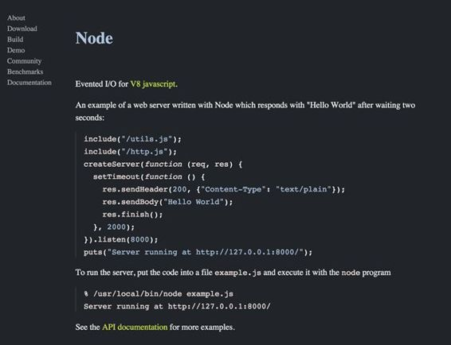
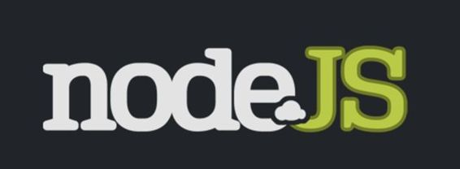
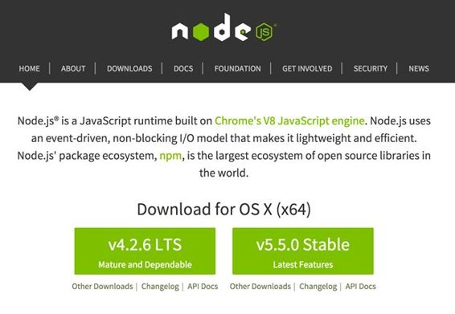
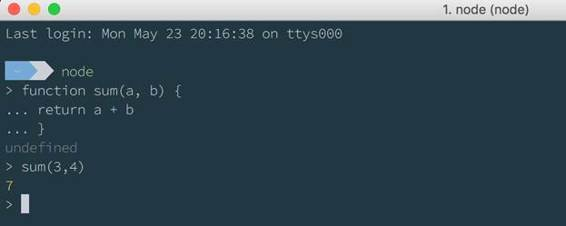

# 一、Node介绍

Node.js 是一个在很短的时间内就在全球范围内取得巨大成功的平台，如今它已经成为编写 web 应用和其他应用的最有趣的平台之一。

Node.js 诞生于 2009 年，源于 Ryan Dahl 的一个想法，他正在寻找一种方法来跟踪从浏览器上传文件所需的时间，而无需不断询问服务器“上传了多少文件？”他的想法是探索如果请求是非阻塞的会发生什么，JavaScript 看起来是完美的语言，主要有两个原因:当时，它没有 I/O 库，异步模式对于编写非阻塞应用非常有用，已经存在于该语言中。

图 1:2009 年的 Node.js 网站

所以他采用了谷歌 Chrome V8 引擎，并将其作为编写基本事件循环和低级 I/O API 的基础。他在 2008 年 11 月 8 日的欧洲 JsConf 上展示了将成为 Node.js 的雏形，这个项目突然引起了社区的极大兴趣。

2011 年，npm 包管理器的第一个版本发布，开发人员开始向 npm 注册表发布他们自己的库。npm 无疑是 Node.js 成功的关键之一，npm 让每个人都可以非常容易地使用和发布库和工具。

图 2:第一个徽标

Node 的最初版本并不容易使用。从一个版本到另一个版本的重大变化经常发生，至少在 2012 年 0.8 版本之前是这样。

这个社区有趣的一点是，从第一个 0 . 0 . 0 版本开始，他们就开始开发用于编写复杂应用的框架和工具。Express 的第一个版本是从 2010 年开始的，Socket。IO 2010，Hapi.js 2012。这意味着社区从一开始就给予了很多信任，直到 2012 年，领英和优步开始在生产中使用它。

从 2011 年到 2014 年，Node.js 获得了很多共识，即使 Ryan Dahl 在 2012 年离开了这个项目，也有越来越多的开发人员加入了这个平台，留下 Ruby、Java、Python 和 C#支持 Node。

2014 年底，一些提交人对项目的治理不满意，在此之前，该项目一直由 Joyent 领导，瑞安·达尔在创建时曾为该公司工作。他们决定分叉主存储库，并创建了 IO.js，目的是提供更快的发布周期，并与 V8 的 API 和性能改进保持同步。

那几个月有些奇怪，因为许多开发人员不知道未来会发生什么，因为两个代码库可能会有分歧，很难选择使用哪一个。

几个月后，Joyent 与其他公司(IBM、微软、PayPal、Fidelity、SAP 和 The Linux Foundation)一起，决定像 IO.js 的开发者所希望的那样，以开放的治理来支持 Node.js 社区。这一举动使得 Node.js 的两个分叉在 Node.js 基金会的治理下合并成为可能。

Node.js 基金会的使命是通过鼓励参与、技术贡献的开放治理模式，以及投资于 Node.js 成功的生态系统的长期管理框架，支持 Node.js 和其他相关模块的采用和开发。

随着 Node.js 基金会的出现，第一个真正稳定的 Node 版本发布了:Node.js 的新版本“1.0”，4.0.0。

几个月后，在 2015 年末，长期支持(LTS)计划发布了 4.2.0 版本。这个 4.x 版本将支持 30 个月。与此同时，其他版本将在没有 LTS 的情况下发布(在撰写本文时，版本 5.10.0 已经发布)。LTS 暗示大公司更倾向于采用 Node.js 作为开发平台。

所以今天，Node.js 将继续存在，它和其他网络平台一样。有了基金会，它的未来肯定是光明的，新的改善将继续到来。

像积极参与在 Windows 上移植 Node.js 的微软、IBM、PayPal、红帽、英特尔等大公司，以及它的发明者 Joyent，都在 Node 上下了赌注，投入了大量资金。

该社区过去是，现在仍然是 Node.js 的制胜点之一。Node 社区非常包容和活跃，在几年内，他们已经产生了 200，000 多个库和工具用于 Node.js。

获得帮助和参与社区相当容易。起点是 [GitHub 网站](https://github.com/Nodejs/node/)，在这里可以找到源代码，阅读关于它的问题。委托人习惯于与社区讨论问题。在 irc.freeNode.net 也有一个 IRC 频道#Node.js。如果你喜欢 Slack，在[Nodejs.slack.com](http://nodejs.slack.com/)有一个频道。还有[谷歌群](https://groups.google.com/d/forum/nodejs)和时事通讯[标签](http://stackoverflow.com/questions/tagged/node.js)等等。你一定能找到你需要的东西。

|  | 注意:我们不能在 Chrome V8 上不花点心思就引入 Node.js。到目前为止，V8 是执行 Node.js 应用的引擎。它最初是由谷歌作为运行 Chrome 浏览器的 JavaScript 引擎开发的。由于所有代码都是开源发布的，并且由于 V8 内部的思想非常创新，Node.js 开发人员发现使用 V8 作为在服务器上运行 JavaScript 代码的引擎是很自然的。 |

Node.js 可在其网站[nodejs.org](https://nodejs.org/)上获得。我不会花时间解释如何在各种平台上安装它，因为在官方网站的下载部分，有每个平台的安装程序，以及如何安装的说明。安装完成后，您的计算机上就有了 Node 可执行文件(Windows 用户注意:是的，您必须使用命令行！)和我们稍后将看到的 npm(Node包管理器)。

图 3:当前的 Nodejs.org 主页

要测试一切是否安装正确，可以在命令行中输入**Node**进入 REPL 界面。一旦进入，您可以尝试执行一些 JavaScript 代码。

|  | 注:REPL 代表读取评估打印循环。它是 Ruby 和 Node 环境中非常常见的工具，经常被用来学习一个库或者只是尝试一些代码。它由一个命令行可执行文件(本例中为Node)组成。您可以通过在终端中键入 node 来运行它，这将使您能够访问 REPL。在这里，您键入任何有效的 JavaScript 语句，REPL 会立即为您评估它。 |

图 4:使用 REPL

Node REPL 是测试一些代码或使用一些库的有用工具。Windows 用户不习惯这样的工具，但我邀请他们玩一玩，发现它有多有用。

要编写一个真实世界的应用，你可以使用你喜欢的文本编辑器，比如 [Vim](http://www.vim.org/) 、[升华文本](http://www.sublimetext.com/)或者 [Atom](https://atom.io/) 。如果你想要更多的东西， [Visual Studio Code](https://code.visualstudio.com/) 是 Node.js 最好的轻量级 IDEs 之一，即使它与 Atom 非常相似(两者都建立在 electronic 之上)，VS Code 也添加了一个集成的调试器，这对于在运行阶段检查应用状态非常有用。

如果 VS 代码太轻量级，可以使用安装了 Node.js 工具的 [Visual Studio](https://www.visualstudio.com/vs/) 或者 [WebStorm](https://www.jetbrains.com/webstorm/) ，一个适合 web 应用的完整 IDE。