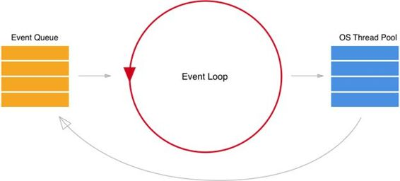
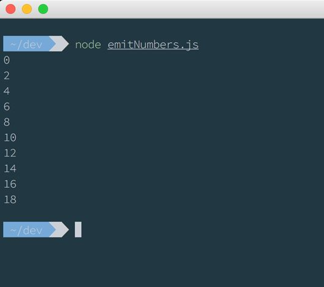
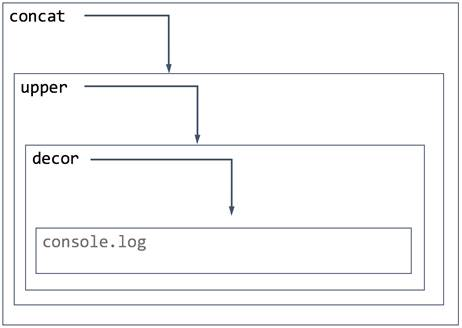

# 第二章你好

现在我们已经安装了开始使用 Node.js 所需的所有东西，是时候编写一个小程序来研究什么是 Node，它相对于其他平台的特性和优势是什么，以及如何最好地使用它来开发应用程序了。

Node.js 中基本的 hello world 应用程序是这样的:

代码清单 1

```
  console.log('Hello
  world');

```

不多。这只是一个 JavaScript 指令。但是如果我们将这一行写在一个名为 index.js 的文件中，我们可以从命令行运行它。我们可以创建一个名为 index.js 的新文件，并在其中编写前面的语句。我们保存它，并在同一个文件夹中键入:

代码清单 2

```
  > node
  index.js

```

而你获得的是终端中的“Hello world”字符串。没那么有趣。让我们尝试一些更有用的东西。

在几行代码中，我们可以创建 hello world 的 HTTP 版本:

代码清单 3

```
  const http
  = require('http')
  const
  server = http.createServer((request, response) => {

  response.writeHead(200, {'Content-Type': 'text/plain'})

  response.end("Hello World")
  })
  server.listen(8000)

```

这是一个基本的网络服务器，可以响应任何传入的请求。它所做的是从外部库要求`http`模块(我们将在下一章中讨论模块)，使用`createServer`功能创建一个服务器，并在端口 8000 上启动服务器。

传入的请求由`createServer`函数的回调管理。回调接收`request`和`response`对象，并在`response`对象上写入标题(状态代码和内容类型)和字符串`Hello World`以将其发送给客户端。

我们可以从命令行运行这个迷你 HTTP 服务器。只需将前面的代码保存在一个名为 server.js 的文件中，并从命令行执行它，就像我们在前面的示例中所做的那样:

代码清单 4

```
  > node
  server.js

```

服务器启动。我们可以通过打开浏览器，转到 [http://localhost:8000](http://localhost:8000) 获取一个上面有 Hello World 的白页来证明。


图 5:浏览器中的 Hello World

除了简单之外，之前代码中有趣的部分是异步性。第一次执行代码时，回调只是注册而不是执行。程序从上到下运行，等待传入的请求。每次客户端发出请求时都会执行回调。

这就是 Node.js 的本质，Node.js 是一个事件驱动、单线程、非阻塞的 I/O 平台，用于编写应用程序。

这是什么意思？

在前面的示例中，回调函数是在从服务器接收到事件(客户端请求资源)时执行的。这意味着应用程序流由外部操作决定，它等待传入的请求。在一般事件中，当某件事发生时，它会执行负责管理该事件的代码，在此期间，它只是等待，让 CPU 空闲下来执行其他任务。

Node.js 是单线程；您所有的应用程序都在一个线程上运行，它永远不会在其他线程上产生。从开发人员的角度来看，这是一个极大的简化。开发人员不需要处理并发性、跨线程操作、变量锁定等等。开发人员确信一段代码最多由一个线程执行。

但要问的一个显而易见的问题是:如果 Node 运行在一个线程上，它如何成为一个高度可扩展的平台？

答案在非阻塞输入/输出中

让 Node.js 应用程序大规模扩展的想法是，每个输入/输出请求都不会阻止应用程序的执行。换句话说，应用程序每次访问外部资源(例如读取文件)时，都不会等待文件被完全读取。它注册了一个回调函数，当文件被读取时，回调函数将被执行，同时将执行线程留给其他任务。

这就是为什么单个线程足以扩展的原因:应用程序流永远不会被输入/输出操作阻塞。每次发生输入/输出时，都会在队列中注册一个回调，并在输入/输出完成时执行。

## 循环

无阻塞输入/输出思想的核心是事件循环。考虑前面一个简单的 web 服务器的例子。当一个请求在前一个请求送达之前到达时会发生什么？请记住，Node.js 是单线程的，因此它不能打开一个新线程并开始并行执行两个请求的代码。它必须等待，或者更好的是，它将事件请求放入队列中，一旦前一个请求完成，它就将下一个请求出列(不管它是什么)。

实际上，Node 引擎的任务是从队列中获取一个事件，尽快执行它，然后获取另一个任务。每个需要外部资源的任务都是异步的，这意味着 Node 将回调函数放在事件队列中。

考虑另一个例子，为静态文件(index.html)提供服务的基本 web 服务器的变体:

代码清单 5

```
  var http =
  require('http')
  var fs =
  require('fs')
  var server
  = http.createServer((request, response) => {

  response.writeHead(200, {'Content-Type': 'text/html'});

  fs.readFile('./index.html', (err, file) => {

  response.end(file);  
    })
  })
  server.listen(8000)

```

在这种情况下，当请求到达服务器时，必须从文件系统中读取一个文件。`readFile`函数(像所有异步函数一样)接收带有两个参数的回调，当实际读取文件时将调用这两个参数。

这意味着当执行继续时，事件“文件准备好被服务”保持在队列中。因此，即使文件很大，需要时间来读取，也可以满足其他请求，因为输入/输出是非阻塞的(我们将看到这种读取文件的方法不是最好的方法)。

当文件准备好时，回调将从队列中提取，代码(在这种情况下是函数`response.end(file)`)将被执行。



图 6:node . js 事件循环

事件循环是继续评估队列以寻找要执行的新事件的东西。

因此，Node 是单线程的这一事实简化了许多开发，并且非阻塞 I/O 解决了性能问题。

事件循环对我们如何编写代码有各种影响。首先也是最重要的一点是，我们的代码需要尽可能快地释放引擎，以便能够快速地为其他事件提供服务。

再考虑一个例子。你应该已经熟悉了 JavaScript 函数`setInterval`。它每隔指定的毫秒数执行一次回调函数。

代码清单 6

```
  setInterval(()
  => console.log('function 1'), 1000)
  setInterval(()
  => console.log('function 2'), 1000)

  console.log('starting')

```

当我们运行这段代码时，输出如下所示:

代码清单 7

```
  starting
  function 1
  function 2
  function 1
  function 2

```

里面发生了什么？

第一行在队列中添加回调，一秒钟后将“函数 1”写入控制台。第二行做同样的事情，并写下“函数 2”

然后它将“开始”写入控制台。

大约一秒钟后，“功能 1”将被打印到控制台，紧接着“功能 2”将出现。我们可以确定，函数 1 将在函数 2 之前打印，因为它是先声明的，所以它会首先出现在队列中。

所以这个程序继续把这两个功能打印到控制台上。

现在我们可以尝试修改代码:

代码清单 8

```
  setInterval(()
  => console.log('function 1'), 1000)
  setInterval(()
  => {

  console.log('function 2')
    while
  (true) { }
  }, 1000)
  console.log('starting')

```

我们正在模拟一段特别慢的代码……无限慢！

当我们运行这个脚本时会发生什么？轮到它的时候，函数 2 将被执行，它永远不会释放线程，所以程序将永远在 while 循环中被阻塞。

这是因为 Node 是单线程的，如果该线程正忙着做某件事(在这种情况下是不劳而获的循环)，它永远不会返回到队列中提取下一个事件。

这就是为什么我们的代码快速非常重要，因为一旦当前块完成运行，它就可以从队列中提取另一个任务。异步编程很好地解决了这个问题。

假设在某个时刻，我们需要读取一个大文件:

代码清单 9

```
  var
  fs = require('fs')
  var
  data = fs.readFileSync('path/to/a/big/file')

```

如果文件很大，需要时间读取，由于这段代码是同步的，线程在等待时会被阻塞。队列中的所有数据和所有其他事件都必须等待此任务完成。

幸运的是，在 Node.js 中，所有的输入/输出都是异步的，我们可以使用带有回调的异步版本`readFile`，而不是使用`readFileSync`:

代码清单 10

```
  var
  fs = require('fs')
  fs.readFile('path/to/a/big/file',
  (err, data) => {

  // do something with data
  })

```

使用 async 函数可以保证执行持续到最后，当文件最终被读取并且数据准备好时，回调将被调用，传递读取的数据。这不会阻止执行，并且事件循环可以在读取文件时从队列中提取其他事件。

|  | 注意:回调函数的第一个参数是可能的错误，这是一个公认的模式。 |

当我们使用`node index.js`运行脚本时，Node 加载 index.js 代码，编译后，Node 从上到下执行，根据需要注册回调。

该脚本可以访问各种对编写应用程序有用的全局对象。其中一些是:

表 1:全局对象和函数

| `__dirname` | 当前执行脚本所在的文件夹的名称。 |
| `__filename` | 脚本的文件名。 |
| `console` | 用于打印到标准输出。 |
| `module` | 对当前模块的引用(稍后将详细介绍)。 |
| `require()` | 用于导入模块的函数。 |

如前所述，Node 附带了一个 REPL，可以通过命令行运行 Node 来访问。

在 REPL 内部，我们可以执行 JavaScript 代码并评估结果。也可以通过调用所需的函数来加载外部模块。这对测试和使用新模块非常有用，可以了解它们是如何工作的，以及如何使用它们。

Node.js REPL 支持一组命令行参数来定制体验:

~/$ node -帮助

用法:节点[选项][-e script | script . js][参数]

节点调试脚本. js[参数]

选项:

-v，-版本打印 Node.js 版本

-e，-评估脚本评估脚本

-p，- print 评估脚本并打印结果

-c，-检查语法检查脚本而不执行

-我，-互动总是进入 REPL，即使性病

似乎不是终端

-r，-要求模块预加载(选项可以重复)

-不反对-沉默反对警告

-throw-defense 每当使用一个不推荐使用的函数时，抛出一个异常

-trace-折旧显示折旧的堆栈跟踪

-跟踪-同步-使用同步输入输出时显示堆栈跟踪

在第一次滴答后被检测到

- track-heap-objects 跟踪堆快照的堆对象分配

-v8-选项打印 V8 命令行选项

-tls-密码列表=val 使用替代的默认 TLS 密码列表

-icu-数据-dir=dir 将 ICU 数据加载路径设置为 dir

(覆盖节点 _ 重症监护室 _ 数据)

环境变量:

NODE _ PATH ':'-分隔的目录列表

模块搜索路径的前缀。

将节点禁用颜色设置为 1，禁用 REPL 中的颜色

重症监护室(Intl 对象)数据的数据路径

持久 REPL 历史文件的路径

文件可以在 https://nodejs.org/.找到

为了编写异步应用程序，我们需要支持回调模式的工具的支持。在节点标准库中，有`EventEmitter`模块，它公开了实现观察者的功能。

让我们尝试第一个例子:

代码清单 11

```
  const
  EventEmitter = require('events').EventEmitter
  let
  emitter = new EventEmitter()
  emitter.on('newNumber',
  n => console.log(n * 2))
  for
  (let i = 0; i < 10; i++) {

  emitter.emit('newNumber', i)
  }

```

这个小程序通过`EventEmitter`实现了一个使用观察者模式将数字从 0 到 10 翻倍的功能。即使程序不是很有用，也解释了`EventEmitter`的用法。

第一行加载`events`模块，并获得用于创建新发射器的`EventEmitter`函数。

偶发射器对象有两种主要方法:`emit`和`on`。

`on`用于订阅特定事件。它接收一个任意的事件名称(在这种情况下为`newNumber`)和一个回调函数，当事件发生时将执行该函数。

如果我们执行代码，我们会在终端上获得一个数字列表。但是程序的流程是怎样的呢？`EventEmitter`是同步的，这意味着在`for`循环的每个周期都会调用回调。如果我们添加一些控制台消息来记录执行，我们会看到在发出`newNumber`后，回调会立即执行。



图 7:事件发射器

我们如何将这段代码转换为异步代码？

我们可以使用`setImmediate`函数，即使它被称为立即，也会将事件放入队列并继续执行。

|  | 注意:setImmediate 和 process.nextTick 函数有些混乱。它们看起来相似(而且确实如此)，但它们有一个微小的细微差别。setImmediate 将函数放在队列中，因此如果队列中有其他函数，setImmediate 函数将在这些其他函数之后执行。process.nextTick 将该函数放在队列的最前面，这样它将恰好在下一个 Tick 执行，绕过队列中的其他函数。 |

代码被转换为:

代码清单 12

```
  const
  EventEmitter = require('events').EventEmitter
  let
  emitter = new EventEmitter()
  emitter.on('newNumber',
  n => setImmediate(() => console.log(n * 2)))
  for
  (let i = 0; i < 10; i++) {

  emitter.emit('newNumber', i)
  }

```

每次发射器发出一个事件，监听器调用带有回调的`setImmediate`函数来执行。该回调在当前代码段完成后排队并执行(在`for`循环结束时)。

这是异步流的天真实现，但重要的是理解并对这些模式充满信心，因为作为节点开发人员，我们必须非常了解事件循环是如何工作的，以及我们如何管理异步调用。

## 地狱

事件循环是一个很好的方法，可以让我们的程序在操作系统完成我们需要的操作时自由地继续运行，但同时，使用这种模式序列化不同的任务变得繁琐且难以维护。

假设我们有三个不同的异步任务必须在一个系列中完成。第一个任务连接两个字符串，第二个任务连接一个字符串，第三个任务用星星装饰字符串。我们假设这三个任务是异步的:

代码清单 13

```
  function
  concat(a, b, callback){

  setTimeout(function(){

  var r = a + b

  callback(r)

  }, 0)
  }

  function
  upper(a, callback){

  setTimeout(function(){

  var r = a.toUpperCase()

  callback (r)

  }, 0)
  }

  function
  decor(a, callback){

  setTimeout(function(){

  var r = '*' + a + '*'

  callback (r)

  }, 0)
  }

```

因为它们是异步的，所以函数的签名会收到一个回调，必须在最后调用。为了模拟异步性，我们使用了`setTimeout`函数。

为了序列化对这三个函数的调用，我们可以这样做:

代码清单 14

```
  concat('hello',
  'world', r1 => { 

  upper(r1, r2 => {

  decor(r2, r3 => {

  console.log(result, r3)  // *HELLOWORLD*    

  })
    })
  })

```

当代码呈现圣诞树的形状时，我们就处于“回调地狱”的情况中在本例中，我们有三个级别，但有时级别是四个、五个或更多。

为了更好地理解回调是如何调用的，请看下图:



图 8:回调

每个函数的调用都有两个参数:一个输入变量和一个回调函数，即下一个要调用的函数。所以每个函数都做一些事情并调用下一个。

为了解决这个问题，ECMAScript 6 引入了承诺的概念。承诺是一种会成功或失败的功能。我用*会*是因为执行的时候没有决定成败，因为我们的代码是异步的。

让我们看看如何使用 promises 重写最后一段代码。首先，我们需要将这三个功能转化为承诺:

代码清单 15

```
  function
  concatP(a, b) {

  return new Promise(resolve => {

  concat(a,b, resolve)

  })
  }

  function
  upperP(a) {

  return new Promise(resolve => {

  upper(a, resolve)

  })
  }

  function
  decorP(a) {

  return new Promise(resolve => {

  decor(a, resolve)

  })
  }

```

现在我们有三个返回承诺的函数。如前所述，承诺将在未来某个时候兑现。当函数`resolve`被调用时将被解析。

重构之后，我们可以使用这种模式依次调用三个函数:

代码清单 16

```
  concatP('hello',
  'world')

  .then(upperP.bind(this))

  .then(decorP.bind(this))

  .then(console.log) // *HELLOWORLD*

```

这段代码不像代码清单 14 那样嵌套，可读性更强。

在这一章中，我们开始接触 Node.js 世界的基础知识。我们学习了 Node.js 程序的原则、单线程的简单性、事件循环和异步 I/O 的特性。现在我们知道如何运行一个简单的脚本或玩 REPL。在接下来的章节中，我们将深入学习，并开始学习如何使用模块和其他有用的工具编写更大的程序。