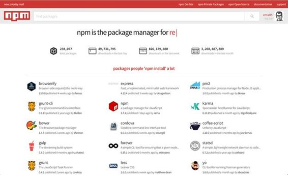

# 三、NodeJS 生态系统

Node.js 相当年轻，尤其是与其他平台如 PHP、。NET，或者 Ruby，但是由于它的使用在如此短的时间内变得如此广泛，并且许多开发人员从其他平台转移到 Node，社区已经创建了大量的库、工具和框架。就像来自其他环境的经验丰富的开发人员给 Node 带来了来自其他世界的最好的东西。

在[第 2 章](02.html#_Chapter_2_)中，我们编写了一些非常基本的程序，并使用了几个外部模块来访问文件系统并使用`EventEmitter`。

我们使用`require`函数来“导入”我们程序中模块`fs`中定义的功能。Node模块系统基于[通用](http://www.commonjs.org/)规范。`require`函数评估指定模块中定义的代码，并返回`module.exports`对象。这个对象可以，并且通常是，用来向调用者返回一些东西。

为了理解它是如何工作的，让我们从一个基本模块开始。

代码清单 17

```js
  //
  file: greeter.js
  module.exports
  = (who) => {

  console.log(`Hello ${who}`)
  }

```

我们可以使用这个模块:

代码清单 18

```js
  //
  file: index.js
  var
  greet = require('./greeter')
  greet('ema')

```

在`greeter.js`中，我们给对象`module.exports`分配一个带有一个参数的函数。该函数只是打印到控制台。

`module.exports`是一个全局对象，使用`require`函数导出到调用者。`require`函数返回一个引用该文件`module.exports`的对象。

模块内部定义的所有内容都是私有的，除了分配给`module.exports`的内容之外，不会污染全局范围，当模块需要时，会缓存起来以获得更好的性能。这意味着对同一个模块的后续要求接收同一个实例(模块内部的代码只执行一次)。

在第一个例子中，我们导出了一个函数。我们可以出口的东西没有限制。我们可以导出对象、类或函数。

代码清单 19

```js
  //
  file: export_object.js
  module.exports
  = {

  name: 'emanuele',

  surname: 'delbono',

  getFullName: function(){ return `${this.name} ${this.surname}` }
  }

```

在这种情况下，我们正在导出一个具有两个属性(姓名)和一个函数`getFullName`的文字对象。

要使用此模块:

代码清单 20

```js
  //
  file: index.js
  var
  user = require('./export_object')
  console.log(user.name);
  // emanuele
  console.log(user.getFullName());
  //emanuele delbono

```

要需要一个模块，我们只需要调用`require`函数。如果我们需要一个由我们编写的模块，并且不在`node_module`文件夹中，我们必须使用相对路径(在这种情况下，模块和主程序在同一个文件夹中)。如果我们需要一个系统模块或使用`npm`下载的模块，我们只需指定模块名称(在第 2 章中，我们通过指定其名称来要求`fs`)。

如前所述，所需的模块被缓存以备将来使用。这主要是出于性能原因，通常是一件好事。有时我们需要每次请求时执行的模块内容。

一个技巧是导出一个函数并调用该函数。函数实现是缓存的，但是每次我们执行它时，我们都可以获得一些新的东西。

例如:

代码清单 21

```js
  //
  file: export_object.js
  module.exports
  = function(){

  return { executionTime: new Date() }
  }

```

该模块导出一个返回对象的函数。每次我们执行函数，我们都会获得一个新的对象，最终具有不同的属性。

我们如何开始使用外部模块？

我们已经在[第 1 章](01.html#_Chapter_1_)中谈到了 npm。npm 是 Node.js 应用的包管理器，我们使用它来安装我们可以用来开发应用的包。

npm 也是存储和索引组件的注册表。在[http://www.npmjs.com/](http://www.npmjs.com/)上，我们可以搜索包裹并找到它们的使用信息。



图 9:npmjs.com 主页

要安装软件包，我们必须运行以下命令:

> npm 安装<package name=""></package>

该命令将软件包安装在当前目录的`node_modules`文件夹中，并且它将可用于主目录或当前目录的某个子文件夹中的其他模块。

例如，我们可以尝试安装 Express.js，一个用于编写 web 应用的框架:

> npm 快速安装

该命令将下载`node_modules`文件夹中的快速包及其所有依赖项，以便它们可用于当前文件夹或任何嵌套文件夹中的脚本。

npm 对于创建新项目也很有用。跑吧:

> npm init

该命令将通过一个简单的向导运行，并使用收集的信息创建一个名为 package.json 的文件。类似于:

{

“名称”:“sampleApp”，

“版本”:“1.0.0”，

描述:

“main”:“index . js”，

"脚本":{ 0

测试:“回应”错误:未指定测试&&退出 1

},

作者:伊曼纽尔·德尔博诺，

“许可证”:“ISC”

}

这个文件充当一种带有一些元数据信息的项目文件。大多数元素都是不言自明的；其他的将在后面讨论。

该文件主要用于存储依赖关系信息。例如，如果我们在带有`--save`标志的同一个文件夹中运行`npm install express`，依赖关系信息将存储在 package.json 文件中:

> npm 快速安装-保存

此命令完成后，package.json 文件将使用以下新信息进行更新:

"依赖项":{ 0

《快报》:“^4.13.4”

}

这告诉我们 express 4.13.4(使用语义版本控制)是我们项目的一个依赖项。这很有用，因为通常`node_modules`文件夹不会被添加到源代码控制中，所以使用 package.json，我们只需键入`npm install`，就可以下载所有需要的正确版本的依赖项。

|  | 提示:一般来说，最好坚持特定的版本。有时即使是微小的版本差异也会打破某些东西。我通常会删除 package.json 依赖部分中的^。 |

package.json 文件中的依赖项通常分为两组:`dependencies`和`devDependencies`。将运行时依赖项放在`dependencies`组中，并为仅在开发期间使用的所有包保留`devDependencies`部分(例如，用于测试、林挺代码、播种数据库等)是一个很好的做法。).这有助于部署，因为在生产环境中，将只下载依赖项，从而使服务器没有不需要的包。

除了依赖关系管理之外，package.json 文件对其他事情也很有用。使用 package.json 文件来使用脚本部分自动化一些项目任务变得非常普遍。

默认情况下，脚本部分有一个专用于测试的条目，默认实现只是向终端回显一个字符串，表示没有配置测试。

添加运行脚本来启动应用可能会很有用。例如，如果入口点在 index.js 文件中，我们可以这样定义一个启动脚本:

"脚本":{ 0

“start”:“node。/index.js "

},

当我们执行命令时:

> npm 运行开始

Node.js 将启动 index.js 文件，就像我们直接从终端运行一样。一些托管服务使用该脚本在应用部署期间执行自定义命令。例如，Heroku 在安装了所有依赖项后运行安装后脚本。例如，预编译静态资产是很有用的。

在我们开发将在 npm 上发布的库的情况下，`main`属性非常重要。它告诉 Node.js 在需要库时要包含哪个文件。

npm 和 package.json 是任何 Node.js 应用的两大支柱，正确使用它们非常重要，尤其是当我们在团队内部工作时，这样每个人都能够以最佳状态工作。