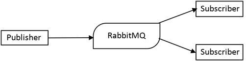

到目前为止，我们已经看到了单片应用程序，但有时，正如我们将在下一章中看到的，将我们的应用程序分成多个部分可能是使它们更易于维护的好方法。但是，一旦我们有两个不同的应用程序分担一些责任，它们就需要进行通信。

[rabbtmq](https://www.rabbitmq.com/)是实现[高级消息队列协议](https://www.amqp.org/) (AMQP)的消息代理。实际上，RabbitMQ 是一个管理消息排队和传递的队列系统。

RabbitMQ 的基本概念是生产者、消费者、交换者和队列。

*   生产者创建新的消息，并将它们发送到 RabbitMQ 服务器。
*   消费者等待消息，当一个消息准备好了，他们就会收到。
*   交换从生产者那里接收消息，并将它们推送到一个或多个队列。
*   队列是在消费者消费消息之前存储消息的地方。它是一种邮箱，包含从交易所传递的信息。

由于交换和队列之间的绑定，交换知道消息必须发送到哪个队列。

因此，使用 RabbitMQ，我们的一个应用程序可以在队列中发布消息，而另一个应用程序可以监听消息并将它们从队列中取出。

至于数据库，有几个包可以与 RabbitMQ 交互。在这种情况下使用最多的是 amqpjs，所以要开始使用 RabbitMQ，我们必须安装这个包。

|  | 注意:RabbitMQ 必须安装在您的计算机上。说明可以在[官方网站](https://www.rabbitmq.com/download.html)上找到，根据您的操作系统而有所不同。 |

RabbitMQ 又大又复杂。它支持许多模式和消息传递架构。在本章中，我们将看到经典的发布-订阅模式。

amqpjs 库是非常低级的，但是它的优点是它允许我们极大地定制我们的应用程序和 RabbitMQ 之间的交互。

经典的出版商是这样的:

代码清单 71

```js
  const amqp = require('amqplib/callback_api')

  amqp.connect('amqp://localhost', (err, conn) => {
    conn.createChannel((err, ch)
  => {
      ch.assertExchange('myExchange',
  'fanout', {durable: true})
      ch.publish('myExchange', '',
  new Buffer('A message'))
    })
  })

```

这个片段创建了一个到 RabbitMQ 服务器实例的新连接，并在这个连接上创建了一个通信通道。有了渠道，我们断言交易所商人存在，如果不存在，我们就创建它。之后，我们只需向交易所发布消息`myExchange`。消息必须作为`Buffer`传递，因此在本例中，我们使用本机节点`Buffer`对象将字符串`A message`转换为缓冲区。这都是为了出版。

接收消息遵循相同的模式:

代码清单 72

```js
  const amqp
  = require('amqplib/callback_api')

  amqp.connect('amqp://localhost', (err, conn) => {

  conn.createChannel((err, ch) => {

  ch.assertExchange('myExchange', 'fanout', {durable: true})

  ch.assertQueue('myQueue, {durable: true}, (err, q) => {

  ch.bindQueue(q.queue, ex, '')

  ch.consume(q.queue, function(msg) {

  console.log(msg.content.toString())
        })
      })
    })
  })

```

这段代码稍微复杂一点。创建连接和通道后，我们断言交换的存在。这对出版商和消费者都是必要的，因为我们不知道哪一个先到达。无论如何，我们保证交易所的存在。创建交换后，我们必须使用方法`assertQueue`创建队列。`assertQueue`接收队列的名称和一些选项(在这种情况下，我们只使队列持久化，这样如果服务器重新启动，队列仍然存在)。以队列为例，我们将其连接到交换机，在`myQueue`和`myExchange`之间创建绑定。最后，我们把消费函数和`consume`函数联系起来。这个函数接收一个回调，一旦消息到达队列，就会调用这个回调，它将简单地把消息内容打印到控制台。

RabbitMQ 很有用，因为它允许我们创建一个可以跨多台机器的可扩展应用程序。例如，考虑一个有一些操作要做的消费者，要完成这些操作，大约需要一秒钟。如果发布速率超过每秒一条消息，唯一的消费者将无法跟上发布者。

但是由于该架构，我们可以运行消费者的第二个实例，以使处理速度翻倍。



图 12:发布者-订阅者模式

通过这种体系结构模式，我们以初始的设置成本打开了未来可伸缩性的大门，并配置了基于消息传递的应用程序。

发布者-订阅者模式只是我们可以用 RabbitMQ 创建的各种拓扑之一。RabbitMQ 有一个交换的概念，它是架构的一部分，充当发布者和目标队列之间的粘合剂。使用交换，发布者不知道消息必须发送到哪个队列；它负责做这件事的是交易所。

在发布者-订阅者模式中，交换属于扇出类型:一条消息被传递到不同的队列。其他交换类型使用路由密钥将消息传递到匹配的队列。路由关键字是标识或表征消息的字符串。

表 3 列出了可能的交换类型。

表 3:rabbitq 交换类型

| 交换型 | 描述 |
| --- | --- |
| 直接的 | 一条消息恰好传递到一个队列。 |
| 扇出 | 一条消息传递到不同的队列(发布-订阅模式)。 |
| 主题 | 消息根据路由关键字(消息的一种标签)的内容传递到队列。 |
| 页眉 | 像主题交换，但基于标题内容。 |

领域驱动设计、事件源和 CQRS 是 C#和 Java 中经常使用的架构，但在 Node.js 世界中并不为人所知。但是这些工具很容易获得，也是时候开始在 Node.js 中有所作为了。