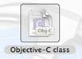
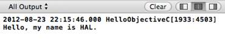

# 一、你好，Objective-C

本章旨在帮助您适应 Objective-C 编程风格。到本章结束时，您将能够实例化对象、创建和调用方法以及声明属性。请记住，目标是对 Objective-C 的主要面向对象方面提供一个非常简短的调查，而不是对每个组件的详细描述。后面的章节填充了本章省略的许多概念细节。

## 创建类

**包含的代码示例:类为**的 HelloObjectiveC

让我们开始创建一个新的 Objective-C 文件。在 Xcode IDE 中，导航至**文件** > **新建** > **文件...**或使用 **Cmd+N** 快捷方式将文件添加到项目中。下一个对话框允许您选择要创建的文件类型。在**可可触摸**类别下，选择**客观-C 类**。



图 10:目标类图标

你有机会为你的新班级指定一个名字。我们叫我们班`Person`吧。对于父类，使用`NSObject`，这是所有 Objective-C 类继承的顶级对象。


图 11:定义一个新的人员类

点击**下一步**将打开一个文件浏览器，要求你为你的班级输入一个**组**，以及一个**目标**。使用默认的**组**，应该是 **HelloObjectiveC** 。组是一种特定于 Xcode 的机制，用于对相似的文件进行分组，但是它们*不是在文件级别实现的*。我们的新类将与项目文件的其他部分出现在同一个文件夹中，不管它在哪个组中。对于**目标**，确保选择**helloobjectvec**。这确保了每当我们构建 HelloObjectiveC 目标时都会编译新类。


图 12:为新类选择构建目标

最后，点击**创建**创建班级。在 Xcode 文件导航器中，您现在应该会发现两个新的类: **Person.h** 和 **Person.m** 。就像 C 编程语言一样，Objective-C 使用**。h** 作为头文件的扩展名，头文件包含特定函数或类的接口——这不要与 C#接口混淆，C #接口在 Objective-C 中被称为**协议**。m 文件是`Person`类的对应实现。

将类的接口与其实现分离开来，就有可能对第三方对象隐藏实现细节。需要与类交互的其他文件导入*头*文件—从不导入*实现*文件。这提供了调用方法和访问属性所需的抽象定义，同时完全独立于类的实现。

## 一个类的成分

在项目导航器中，选择 **Person.h** 在编辑器面板中打开。您应该会看到以下目标代码:

```objc
    #import <Foundation/Foundation.h>

    @interface Person : NSObject

    @end

```

`#import`指令包括当前上下文中的另一个文件。包含头文件使我们可以访问它定义的所有类和函数。在这种情况下，我们包括了基础框架。基础框架定义了 Objective-C 语言的基本结构——比如字符串、数组、字典等等。—因此，它几乎是每一个 Objective-C 计划的必要组成部分。

`@interface`指令开始一个类的接口。接下来是类名，`Person`，后面是冒号和父类，`NSObject`。如前所述，`NSObject`是 Objective-C 中的顶级对象。它包含创建和销毁实例的必要方法，以及其他一些由所有对象共享的有用功能。

任何方法或属性都会在`@end`指令之前声明，但是现在， **Person.h** 是一个空接口。我们将在一分钟内进行更改，但首先让我们快速浏览一下实现文件 **Person.m** :

```objc
    #import "Person.h"

    @implementation Person

    @end

```

这看起来很像头文件，但它包括`Person.h`头。实现文件*必须*包含它们相关联的头，否则它们将无法找到它们试图实现的类。

还要注意的是，这个`#import`指令使用了引号而不是尖括号。引号用于导入*本地*表头，括号表示*全局*表头。全局头位于项目外部，并在构建过程中链接到编译器。苹果的标准框架总是包含在尖括号中，而您的项目文件应该用引号导入。

当然还有**。m** 文件使用`@implementation`指令代替`@interface`。请注意，您*不必在这里指定父类，因为这些信息已经包含在标题中。*

## 定义方法

接下来，我们将向`Person`类添加一个方法声明。请记住，这是一个两步的过程:首先我们必须将其添加到接口，然后是实现。因此，将 **Person.h** 改为以下内容:

```objc
    #import <Foundation/Foundation.h>

    @interface Person : NSObject

    - (void )sayHello;

    @end

```

如您所见，实例方法是用连字符声明的，括号(`void`)中的返回类型，后跟方法名和分号。现在界面中已经有了，切换到 **Person.m** 来定义实现。注意 Xcode 在`@implementation`线旁边加了一个小黄色三角形。如果你点击它，你会发现一条警告信息，上面写着*未完成实施*。这是 Xcode 众多调试功能之一。让我们通过将`Person.m`更改为以下内容来解决这个问题:

```objc
    #import "Person.h"

    @implementation Person

    - (void )sayHello {
        NSLog (@"Hello, my name is HAL." );
    }

    @end

```

像接口声明一样，实例方法的实现以连字符、返回类型和函数名开始。实现本身是在方法名后面的花括号中定义的，就像 C#方法一样。对于`sayHello`，我们只是使用`NSLog()`向控制台输出一条消息。

当您键入时，Xcode 提供了一些自动完成选项，它也应该已经为您关闭了大括号。这些行为可以通过导航至 **Xcode** > **偏好设置进行更改...在菜单栏中选择**，点击**文本编辑**图标。

## 实例化对象

让我们尝试实例化我们的`Person`类，并调用我们新的`sayHello`方法。请记住，像任何 C 程序一样，`main()`是进入我们的 *HelloObjectiveC* 应用程序的入口点。因此，回到 **main.m** ，将`NSLog(@"Hello, World!");`更改为以下内容:

```objc
    #import <Foundation/Foundation.h>
    #import "Person.h"

    int main(int argc, const char * argv[]) {
        @autoreleasepool {

            Person *somePerson = [[Person alloc ] init ];

        }
        return 0;
    }

```

`Person *somePerson`表达式声明了一个名为`somePerson`的变量，并告诉编译器它将保存一个`Person`类的实例。变量名旁边的星号表示它是一个**指针**，这是在 Objective-C 中引用对象的最常见方式。我们将在后面更详细地讨论指针。

接下来，`[[Person alloc] init]`代码创建一个新的`Person`类实例。方括号符号可能需要一些时间来适应，但在概念上，它与 C#和其他 Simula 风格语言中用于方法调用的括号相同。前面的代码示例相当于 C#中的以下代码:

```objc
    Person somePerson = new Person();
    somePerson.init();

```

`[Person alloc]`调用分配新实例所需的内存，`init`调用用于执行任何类型的自定义初始化代码。请注意，Objective-C 中没有像 C#或 C++中那样的“构造函数方法”——您必须手动调用`init`方法(或其变体)来设置您的对象。因此，Objective-C 中几乎所有的对象创建都是一个两步的过程:分配，然后初始化。你会在 Objective-C 程序中经常看到这种模式。

## 调用方法

现在我们有了一个可以工作的对象，我们可以调用我们的`sayHello`方法。请注意，Objective-C 中正确的术语是“发送消息”，而不是“调用方法”，但是出于我们的目的，我们可以将它们视为同义词。在 **main.m** 中添加以下行:

```objc
    [somePerson sayHello];

```

就像前面例子中的`alloc` / `init`方法一样，自定义方法调用使用了方括号。同样，这与在 C#中执行`somePerson.sayHello()`相同。运行您的程序应在 Xcode 输出面板中显示`Hello, my name is HAL.`:



图 13:从 sayHello 方法生成的输出

## 添加方法参数

除了方括号之外，Objective-C 的方法命名约定是对来自 C#、C++、Java、Python 或几乎任何其他非 Smalltalk 语言的开发人员的最大调整之一。Objective-C 方法名称被设计成尽可能具有描述性。这个想法是这样定义一个方法，大声朗读它可以告诉你它是做什么的。

举个例子，让我们给我们的`sayHello`方法添加一个`name`参数。首先，我们需要更新头中的方法声明(`Person.h`):

```objc
    - (void)sayHelloToName:(NSString *)aName;

```

添加一个参数实际上*改变了函数*的名称——该参数并不像在 C#中那样是一个孤立的实体(例如`sayHello(name)`)。`(NSString *)`部分定义了参数的数据类型，`aName`是可以在实现代码中访问的实际变量，我们现在将定义它。将`Person.m`中的`sayHello`更改为后面的代码示例。Xcode 应该在您开始键入新方法名称时自动完成它。

```objc
    - (void)sayHelloToName:(NSString *)aName {
        NSLog (@"Hello %@, my name is HAL.", aName);
    }

```

这个新的`NSLog()`配置使用格式字符串将`aName`参数添加到输出中。我们将在下一章更详细地介绍`NSLog()`，但是现在你所需要知道的是，它将格式字符串中的`%@`替换为`aName`。这大致相当于 C#中的`String.Format()`。

调用参数`aName`对于`sayHelloToName`来说似乎是多余的，但是当您读取方法时，它会被调用，这更有意义。在`main.m`中，将`sayHello`呼叫改为:

```objc
    [somePerson sayHelloToName:@"Bill"];

```

现在，您应该可以运行您的程序，并在输出面板中看到`Hello Bill, my name is HAL.`。正如您所看到的，Objective-C 方法名称冗长，但是信息量很大。与 C#风格的`sayHello(name)`调用不同，Objective-C 很难不小心将错误的值传递给方法。当然，代价是方法名很长，但这就是为什么 Xcode 提供了如此方便的自动完成功能。在这本书里，我们会看到很多更详细(也更实用)的 Objective-C 方法名称的例子。

## 定义属性

**包含代码示例:带属性**

与任何面向对象的语言一样，Objective-C 方法是一种操作对象内部状态的方法。这种状态通常表示为附加到对象的一组属性。例如，我们可以向我们的`Person`接口添加一个`name`属性来动态存储每个实例的名称:

```objc
    @property (copy ) NSString *name;

```

`@property`声明开始一个新的属性，`(copy)`元组指定了属性的行为，`NSString *name`定义了一个名为`name`的属性，它保存一个字符串值。通常，属性声明被放在方法声明之前，但是只要它在`@interface`和`Person.h`中的`@end`之间，你就可以了。

使用`@property`而不是私有属性可以访问实现文件中的`@synthesize`指令。它允许您为关联的属性自动创建访问器方法。例如，在`Person.m`中，添加以下内容(同样，属性实现通常在方法实现之前):

```objc
    @synthesize name = _name;

```

`@synthesize`是一个便利指令，告诉编译器为属性生成 getter 和 setter 方法。`=`符号后的部分用作属性的实例变量(即私有成员)，这意味着我们可以使用`_name`访问`Person.m`内部的 name 属性。例如，尝试将`sayHelloToName`方法更改为:

```objc
    - (void)sayHelloToName:(NSString *)aName {
        NSLog (@"Hello %@, my name is %@.", aName, _name );
    }

```

默认情况下，getter 方法名与属性名相同，setter 在大写的属性名前面加上`set`。因此，我们可以通过将`main.m`更改为以下内容来动态设置`Person`对象的名称:

```objc
    Person *somePerson = [[Person alloc] init];
    [somePerson setName:@"HAL 9000" ];
    [somePerson sayHelloToName:@"Bill"];

```

运行你的程序现在应该会产生`Hello Bill, my name is HAL 9000`。

## 总结

本章介绍了目标 C 类的基本组成部分。我们学习了如何将类分成接口(`.h`)和实现文件(`.m`)，实例化对象，定义和调用方法，以及声明属性。希望您对 Objective-C 的方括号符号和其他语法怪癖感觉更舒服一点。

请记住，本章旨在快速介绍 Objective-C 的 OOP 结构，而不是深入讨论每个组件。在接下来的章节中，我们将更详细地研究数据类型、属性声明、方法定义，以及 Objective-C 程序的常见设计模式。