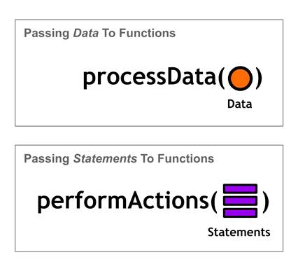
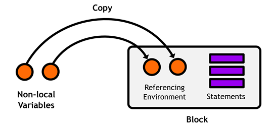

# 九、块

**Blocks** 实际上是 C 编程语言的扩展，但是它们被苹果的 Objective-C 框架大量使用。它们类似于 C#的 lambdas，因为它们允许您内联定义一个语句块，并将其传递给其他函数，就像它是一个对象一样。



图 36:用函数处理数据与用块执行任意操作

块对于定义回调方法来说非常方便，因为它们允许您在调用点定义所需的功能，而不是在程序中的其他地方。此外，块被实现为**闭包**(就像 C#中的 lambdas 一样)，这使得无需任何额外的工作就可以捕获块周围的局部状态。

## 创建块

与我们在本书中一直使用的 Objective-C 语法相比，块语法可能有点令人不安，所以如果需要一段时间才能适应它们，请不要担心。我们将从一个简单的例子开始:

```objc
    ^(int x) {
        return x * 2;
    };

```

这定义了一个取整数参数`x`的块，并返回该值乘以 2。除了插入符号(`^`)之外，这类似于一个普通的函数:它在括号中有一个参数列表，一个用花括号括起来的指令块，以及一个(可选的)返回值。在 C#中，这被写成:

```objc
    x => x * 2;

```

但是，块不限于简单的表达式——它们可以包含任意数量的语句，就像函数一样。例如，您可以在返回值之前添加一个`NSLog()`调用:

```objc
    ^(int x) {
        NSLog (@"About to multiply %i by 2.", x);
        return x * 2;
    };

```

### 无参数块

如果您的块不接受任何参数，您可以完全省略参数列表:

```objc
    ^ {
        NSLog (@"This is a pretty contrived block." );
        NSLog (@"It just outputs these two messages." );
    };

```

## 使用块作为回调

就其本身而言，一个区块并不那么有用。通常，您会将它们作为回调函数传递给另一个方法。这是一个非常强大的语言特性，因为它让你把*功能*当作一个参数，而不是局限于*数据*。您可以像传递任何其他文字值一样将块传递给方法:

```objc
    [anObject doSomethingWithBlock:^(int x) {
        NSLog(@"Multiplying %i by two" );
        return x * 2;
    }];

```

`doSomethingWithBlock:`实现可以像运行函数一样运行块，这为许多新的组织范例打开了大门。

作为一个更实际的例子，我们来看看`NSMutableArray`定义的`sortUsingComparator:`方法。这提供了与我们在[数据类型](02.html#_Chapter_2_)一章中使用的`sortedArrayUsingFunction:`方法完全相同的功能，除了您在块中定义排序算法，而不是完整的函数:

**包含代码示例:排序使用块**

```objc
    #import <Foundation/Foundation.h>

    int main(int argc, const char * argv[]) {
        @autoreleasepool {

            NSMutableArray *numbers = [NSMutableArray arrayWithObjects:
                                       [NSNumber numberWithFloat:3.0f ],
                                       [NSNumber numberWithFloat:5.5f ],
                                       [NSNumber numberWithFloat:1.0f ],
                                       [NSNumber numberWithFloat:12.2f ], nil ];

            [numbers
             sortUsingComparator:^NSComparisonResult (id obj1, id obj2) {
                float number1 = [obj1 floatValue ];
                float number2 = [obj2 floatValue ];
                if (number1 < number2) {
                    return NSOrderedAscending;
                } else if (number1 > number2) {
                    return NSOrderedDescending;
                } else {
                    return NSOrderedSame;
                }
            }];    

            for (int i=0; i<[numbers count ]; i++) {
                NSLog (@"%i: %0.1f", i, [[numbers objectAtIndex:i] floatValue ]);
            }

        }
        return 0;
    }

```

同样，这是一个简单的升序排序，但是能够在函数调用的同一个地方定义排序算法比在程序的其他地方定义一个独立的函数更直观。还要注意，您可以像在函数中一样在块中声明局部变量。

标准的 Objective-C 框架将这种设计模式用于从排序、枚举到动画的所有事情。事实上，您甚至可以用`NSArray`的`enumerateObjectsUsingBlock:`方法替换上一个示例中的 for-loop，如下所示:

```objc
    [sortedNumbers
     enumerateObjectsUsingBlock:^(id obj, NSUInteger idx, BOOL *stop) {
        NSLog (@"%lu: %0.1f", idx, [obj floatValue ]);
        if (idx == 2 ) {
            // Stop enumerating at the end of this iteration.
            *stop = YES;
        }
    }];

```

`obj`参数是当前对象，`idx`是当前索引，`*stop`是提前退出枚举的一种方式。将`*stop`指针设置为`YES`告诉方法在当前迭代后停止枚举。所有这些行为都由`enumerateObjectsUsingBlock:`方法指定。

虽然动画对于这本书来说有点跑题，但为了帮助理解块的效用，还是值得做一个简短的解释。`UIView`是 iOS 编程中使用最多的类之一。这是一个通用的图形容器，允许你通过`animateWithDuration:animations:`方法激活它的内容。第二个参数是定义动画最终状态的块，该方法会自动计算出如何使用第一个参数制作属性的动画。这是一种优雅的、用户友好的方式来定义过渡和其他基于计时器的行为。我们将在即将出版的 *iOS 简洁版*书中更详细地讨论动画。

## 存储和执行块

除了将它们传递给方法，块还可以存储在变量中供以后使用。这个用例本质上是一种定义函数的替代方法:

```objc
    #import <Foundation/Foundation.h>

    int main(int argc, const char * argv[]) {
        @autoreleasepool {

            int (^addIntegers)(int, int );

            addIntegers = ^(int x, int y) {
                return x + y;
            };

            int result = addIntegers(24, 18 );
            NSLog (@"%i", result);

        }
        return 0;
    }

```

首先，让我们检查一下声明块变量的语法:`int (^addIntegers)(int, int)`。这个变量的名字只是`addIntegers`(没有插入符号)。如果您使用区块的时间不长，这可能会令人困惑。将插入符号视为块版本的取消引用运算符(`*`)会有所帮助。例如，名为`addIntegers`的*指针*将被声明为`*addIntegers`—同样，同名的*块*将被声明为`^addIntegers`。然而，请记住，这只是表面上的相似。

除了变量名，您还需要声明与块相关联的所有元数据:参数的数量、类型和返回类型。这使编译器能够用块变量强制执行类型安全。请注意，插入符号是变量名的*而不是*部分——它仅在声明中是必需的。

接下来，我们使用标准赋值运算符(`=`)在变量中存储一个块。当然，块的参数(`(int x, int y)`)必须与变量(`(int, int)`)声明的参数类型相匹配。块定义后也需要分号，就像普通的变量赋值一样。一旦用值填充了变量，就可以像函数一样调用它:`addIntegers(24, 18)`。

### 无参数块变量

如果您的块没有任何参数，您必须通过在参数列表中放置`void`在变量中明确声明这一点:

```objc
    void (^contrived)(void) = ^ {
        NSLog (@"This is a pretty contrived block." );
        NSLog (@"It just outputs these two messages." );
    };

    contrived();

```

## 使用变量

块内部的变量的行为与它们在正常函数中的行为非常相似。您可以在块内创建局部变量，访问传递给块的参数，并使用全局变量和函数(例如，`NSLog()`)。但是，块也可以访问**非局部变量***，它们是封闭词法范围内的变量。*

```objc
    int initialValue = 32;
    int (^addToInitialValue)(int ) = ^(int x) {
        return initialValue + x;
    };

    NSLog(@"%i", addToInitialValue(10)); // 42

```

在这种情况下，`initialValue`被认为是块内的非局部变量，因为它是在块外定义的(*不是相对于块的局部*)。当然，非局部变量是只读的这一事实意味着您不能给它们赋值:

```objc
    int initialValue = 32;
    int (^addToInitialValue)(int ) = ^(int x) {
        initialValue = 5; // This will throw a compiler error.
        return initialValue + x;
    };

```

当使用内联块作为方法参数时，访问周围(非局部)变量是一件大事。它提供了一种方便的方式来表示块中所需的任何状态。

例如，如果您正在制作用户界面组件的颜色动画，并且目标颜色是在块定义之前计算并存储在局部变量中的，那么您可以简单地在块中使用局部变量——不需要额外的工作。如果您没有访问非局部变量的权限，您会将颜色值作为附加块参数传递。当回调功能依赖于周围状态的很大一部分时，这可能会非常麻烦。

### 块是闭包

然而，块不仅仅可以*访问*非局部变量——它们还确保这些变量将*永远不会*改变，无论块何时何地被执行。在大多数编程语言中，这被称为**闭包**。

闭包的工作原理是为任何非局部变量创建一个常量的只读副本，并将它们存储在一个**引用表**中，其中的语句构成了块本身。每次执行块时都会使用这些只读值，这意味着即使原始非局部变量发生变化，块使用的值也保证与定义块时相同。



图 37:在引用表中存储非局部变量

我们可以从前面的例子中通过给`initialValue`变量赋值来看到这一点:

```objc
    int initialValue = 32;
    int (^addToInitialValue)(int ) = ^(int x) {
        return initialValue + x;
    };

    NSLog (@"%i", addToInitialValue(10 )); // 42

    initialValue = 100;
    NSLog(@"%i", addToInitialValue(10)); // Still 42.

```

无论你在哪里称呼`addToInitialValue()`，块使用的`initialValue`将会*永远*是`32`，因为它被创造的时候就是这样。实际上，这就好像`initialValue`变量被转换成了块内的文字值。

所以，积木的效用是双重的:

1.  它们允许您将功能表示为一个对象。
2.  它们允许您在功能的同时表示状态信息。

将功能封装在一个块中的整个想法是为了能够在程序中稍后使用它。只要通过冻结周围的状态来执行一个块，闭包就可以确保可预测的行为*。这使得它们成为块编程不可或缺的一部分。*

### 可变块变量

在大多数情况下，用闭包捕捉状态直观上就是您对一个块的期望。然而，有时需要相反的行为。**可变块变量**是非局部变量，被指定为读写，而不是默认的只读。要使非局部变量可变，您必须用`__block`修饰符声明它，这将在块外部使用的变量和块内部使用的变量之间创建直接链接。这为使用块作为迭代器、生成器和任何其他类型的处理状态的对象打开了大门。


图 38:用可变块变量创建直接链接

下面的示例向您展示了如何使非局部变量可变:

```objc
    #import <Foundation/Foundation.h>
    #import "Person.h"

    int main(int argc, const char * argv[]) {
        @autoreleasepool {

            __block NSString *name = @"Dave";

            void (^generateRandomName)(void ) = ^ {
                NSLog (@"Changing %@ to Frank", name);
                name = @"Frank";
            };

            NSLog (@"%@", name);        // Dave

            // Change it from inside the block.
            generateRandomName();      // Changing Dave to Frank.
            NSLog (@"%@", name);        // Frank

            // Change it from outside the block.
            name = @"Heywood";
            generateRandomName();      // Changing Heywood to Frank.

        }
        return 0;
    }

```

这看起来几乎与前面的示例完全相同，但有两个非常显著的区别。首先，非本地`name`变量*可以从块内分配。第二，更改块外的变量*是否会更新块内使用的值。甚至可以创建多个块来操作同一个非局部变量。**

 **使用`__block`修饰符的唯一警告是它*不能在可变长度数组上使用*。

### 定义接受块的方法

可以说，创建接受块的方法比将它们存储在局部变量中更有用。它为您提供了向自定义类添加自己的`enumerateObjectsUsingBlock:`风格方法的机会。

考虑`Person`类的以下界面:

```objc
    // Person.h
    @interface Person : NSObject

    @property int age;

    - (void )celebrateBirthdayWithBlock:(void (^)(int ))activity;

    @end

```

`void (^)(int)`代码是您想要接受的块的数据类型。在这种情况下，我们将接受一个没有返回值和单个整数参数的块。请注意，与块变量不同，这不需要块的名称——只需要一个未经修饰的`^`字符。

现在，您已经具备了创建接受块作为参数的方法所需的所有技能。上例中所示的`Person`界面的简单实现可能类似于:

```objc
    // Person.m
    #import "Person.h"

    @implementation Person

    @synthesize age = _age;

    - (void )celebrateBirthdayWithBlock:(void (^)(int ))activity {
        NSLog (@"It's a party!!!" );
        activity(self.age );
    }

    @end

```

然后，您可以通过一个可定制的活动来执行`Person`的生日，如下所示:

```objc
    // main.m
    int main(int argc, const char * argv[]) {
        @autoreleasepool {

            Person *dave = [[Person alloc ] init ];
            dave.age = 37;

            [dave celebrateBirthdayWithBlock:^(int age) {
                NSLog (@"Woot! I'm turning %i", age + 1 );
            }];

        }
        return 0;
    }

```

很明显，使用块作为参数比我们在本章之前一直使用的标准数据类型要灵活得多。你可以告诉一个实例去做一些事情，而不仅仅是处理数据。

## 总结

块允许您将语句表示为 Objective-C 对象，这使您能够将任意的*动作*传递给函数，而不是局限于*数据*。这对于从迭代对象序列到动画化用户界面组件的任何事情都很有用。块是 C 编程语言的一个通用扩展，如果你打算用标准的 iOS 框架做很多工作，它们是一个必要的工具。在本章中，我们学习了如何创建、存储和执行块，并了解了闭包和`__block`存储修饰符的复杂性。我们还讨论了一些常见的块使用范例。***