# 一、PowerPivot 模型基础

为了帮助理解如何使用 PowerPivot 的功能，我们将使用微软的 AdventureWorks 示例数据仓库为 SQL Server 构建一个模型作为数据来源[【2】](6.html#_ftn2)。如果您手头没有 SQL Server，请不要担心—支持本书的示例工作簿包含了这些示例所需的所有数据。该工作簿提供了两个版本:一个版本将数据导入为表，但没有构建任何功能，另一个版本包含完整的模型。

## 开始

### 启用电源

首先要做的是打开它。根据您的 Microsoft Office 版本，它要么是内置的，要么您需要下载外接程序。Office 2010 用户需要下载插件[【3】](6.html#_ftn3)。然后只需运行安装程序，下次打开 Excel 时，PowerPivot 就会出现在您的功能区中。

如果您使用的是 Office 2013 专业版 Plus、Office 365 专业版 Plus 或独立 Excel，请遵循以下快速步骤:

*   转到**文件** > **选项** > **加载项**
*   在**管理**框中，点击 **COM 加载项** > **转到**
*   在微软 Excel 2013 框中勾选**微软 Office Power Pivot，然后点击**确定****

该功能区现在将具有一个 PowerPivot 选项卡。

如果您没有提到的任何版本，您需要首先更改您的 Office 或 Excel 版本。

### 打开 PowerPivot 数据模型

您可以使用功能区上的 PowerPivot 选项卡访问数据模型。在功能区的数据模型部分选择**管理**选项:

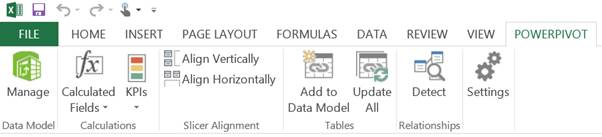

图 Excel 中的功能区菜单

单击管理按钮，您将进入一个带有新功能区的新窗口:

图 PowerPivot 数据模型功能区

数据模型的主要部分首先是一个空白。当我们进一步探索时，我们会用数据和关系来填充它。

## 表格

PowerPivot 模型的基本要素是保存数据的表。这些数据可以来自同一个工作簿，也可以来自您可以连接的各种系统。

在下面的例子中，我们将从三个地方把数据引入我们的模型:

*   我们自己的练习册
*   企业资源
*   蔚蓝数据市场

### 使用同一工作簿中的数据

要使用工作簿中的数据，首先需要将其格式化为表格。在本练习中，我们将在 AdventureWorks 数据库中创建产品子类别的替代版本。首先我们将从数据库中抓取相关的现有数据，粘贴进去，并添加一个名为**alternate succategory**的列:

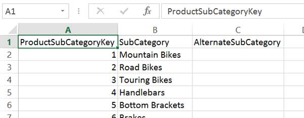

图 4:我们工作簿中的示例数据

然后，从功能区的“主页”选项卡的“样式”部分中，选择**格式为表格**:

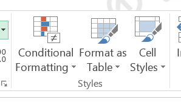

图 5:格式化为表格

您选择的配色方案不会影响表格的功能。应用样式后，Excel 将自动切换到表格工具功能区的“设计”选项卡。在此，在功能区的“属性”部分命名您的表非常有用:

表格设计工具

这种重命名是可选的，但是在您的数据模型中比一系列对表 1、表 2 等的引用看起来更好。，这是自动为表创建的名称。

现在，前往功能区的 PowerPivot 选项卡，突出显示表格中的一个单元格，单击**表格**部分中的**添加到数据模型**:

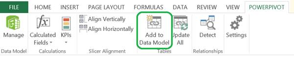

向 PowerPivot 数据模型添加表

PowerPivot 接管并将表添加到数据模型中，无需用户进一步干预。数据模型管理器启动，您可以立即查看您的数据。

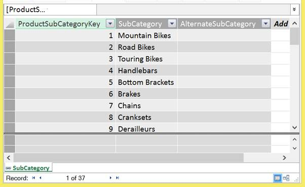

图 PowerPivot 数据模型中的 Excel 数据

最初，我们在 Excel 的源代码的 AlternateSubCategory 列中没有放任何值。如何在 PowerPivot 中更新值取决于您的更新设置。

功能区的“链接表”部分决定了这种行为:

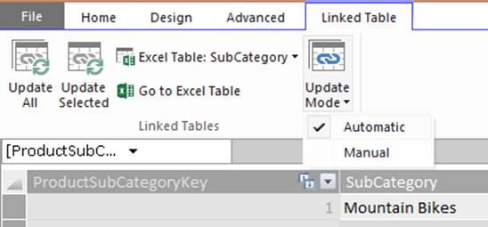

图 7:链接表管理器

默认情况下，“更新模式”设置为“自动”，这意味着当您在工作簿中输入数据时，PowerPivot 会自动更新。在该示例中，工作表被更新，更改被自动反映。

需要注意的是，您不能在“数据模型”视图中更新数据，因为您看到的是数据的副本，它反映了源中已更新的内容。虽然数据网格看起来很像 Excel，但请记住，它显示的是源数据的只读副本。您可以稍后[添加计算](#_Calculated_Columns)，但这是在您的源之上的一个层，并且不改变它。

如果更新开始减慢速度(这在计算量很大的工作簿中经常发生)，您可以将“更新模式”设置更改为“手动”。然后，当您想要使用工作表更新来更新 PowerPivot 模型时，您可以选择**更新所有**或**更新选定的**来进行更新。

### 使用来自企业源的外部数据

我们现在已经为仓库中的一些数据创建了一些备用分类。下一步是提取仓库数据。

在 PowerPivot 数据模型管理器的主页选项卡中，我们有**获取外部数据**部分来帮助我们实现这一点。我们将从数据库中的**选项开始。**

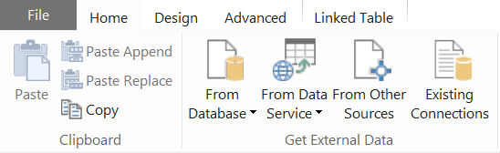

图 8:导入外部数据

有三种选择:

*   SQL 服务器
*   接近
*   分析服务或电源

如果最后一个选项看起来令人困惑，那是因为 PowerPivot 技术也用于企业 BI 解决方案中——尽管通常被称为表格模型——这些也可以是数据源。这将在稍后的中详细介绍。

在这个场景中，我们将使用 SQL Server。我不会在这里详述向导，但步骤如下:

*   提供连接细节
*   选择如何导入数据—整个表/视图或自定义查询
*   选择要导入的表，在这种情况下 **FactProductInventory**
*   选择选择相关表格
*   点击**完成**

我将从上面的步骤中指出一些事情。首先，在导入数据时，您可以指定拉入整个表或视图，或者，如果您对 SQL 感到满意，编写一个查询来选择指定数量的数据。如果选择拉入整个表或视图，可以使用导入向导来限制要拉入的列，并对这些列应用筛选器来限制要拉入的行数。如下图表格导入向导截图所示，可以选择表格，右下角有一个**预览&过滤器**按钮:

图 9:表导入向导

单击此按钮启动表格导入预览窗口:

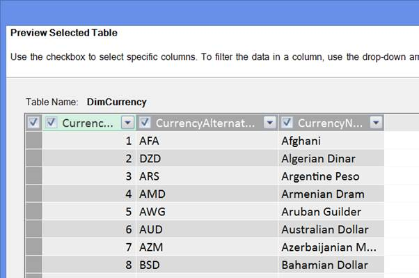

图 10:表格导入预览窗口

该屏幕为您提供了一个数据示例，但您也可以通过使用列名旁边的复选框来选择或取消选择导入的列。此外，您可以通过单击列名右侧的下拉箭头来应用筛选器。这是数据类型敏感的，就像 Excel 表格的筛选器一样，因此数字筛选器可以是范围，而文本筛选器可以是“以…开头”或“包含…”。

下图说明了应用过滤器后的显示方式:

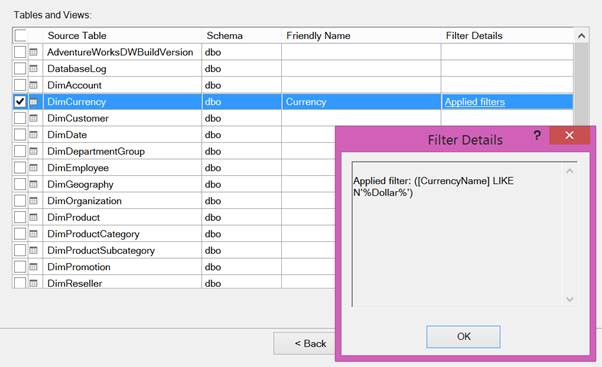

图 11:带有友好名称列和过滤器详细信息弹出窗口的表导入窗口

在“过滤器详细信息”列中，会出现一个链接。单击链接会弹出一个窗口，显示应用的过滤器。

您还可以看到，在“友好名称”列下，默认名称已被覆盖，因此对象在数据模型中将有一个更具业务友好性的名称。如果您在导入过程中忘记进行重命名，可以在数据模型设计器中稍后进行，但为了避免以后的痛苦(因为名称更改不会自动传播到您的公式)，最好现在进行。

限制您引入的数据量对于更大的数据源来说非常重要，因为即使 PowerPivot 确实提供了令人印象深刻的压缩，但您的工作簿的有限大小也限制了您可以引入的数据量。在本书的后面部分，我们将讨论[压缩是如何工作的](5.html#_Understanding_Compression)这一部分将使您能够计算出可以删除哪些列，以帮助最小化工作簿的大小。根据您所查看的数据的上下文，行筛选器会更有意义，例如，如果您只查看上一季度的业绩，加载 15 年的销售数据是没有意义的。

要浏览的另一个项目是“选择相关表”按钮。您可能认为 PowerPivot 可以神奇地检测到与您选择的表相关联的数据，但不幸的是它不能。它对关系数据库的作用是:如果外键已经在数据库中编码，使得对象之间有严格的关系(例如事实表和日期维度)，它可以检测这些编码的关系。如果像许多数据仓库系统一样，这些还没有到位(因为它们通常很难维护)，您将不得不自己找出哪些表是相关的。

### 使用来自 Windows Azure 市场的外部数据

外部数据的另一个选择是微软的数据集市场——Windows Azure 市场。在 PowerPivot 数据模型设计器的功能区主页选项卡的获取外部数据部分(见图 9)，有一个来自数据服务的选项。从下拉菜单中选择**启动市场浏览器。**

图 Windows Azure 市场浏览器

该浏览器包含一系列有趣的(通常是免费的)数据集，可用于增强您的分析。您确实需要有一个 Windows Live 帐户才能访问该服务。

在本例中，我们将引入伯颜·佩涅夫的[【4】](6.html#_ftn4)非常有用的日期流数据集，该数据集呈现了用于分割数据的日期数据的各种排列。我们搜索“日期流”并得到以下结果:

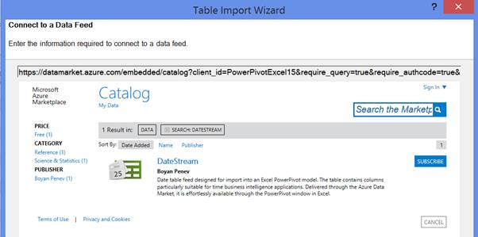

图 13:表导入向导-订阅数据集

单击**订阅**打开另一个窗口，我们可以在其中选择字段并应用非常有限的过滤:

图 14:表导入向导-选择数据集的元素

我们只需取消选择一些非英语日历，然后点击**选择查询**。在下一个屏幕中，我们只需命名连接:

图 15:表导入向导-命名连接

点击**下一步**进入下一屏，我们可以选择要导入的表格:

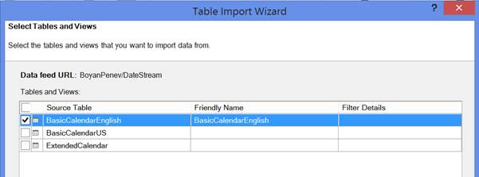

图 16:表导入向导-选择表

选择**基本连读英语**，点击**下一步**，导入开始:

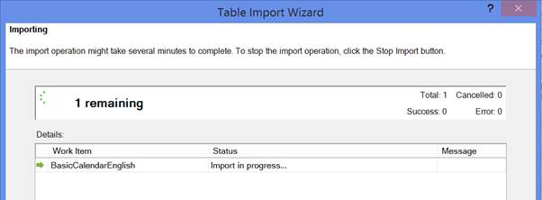

图 17:表导入向导-导入进度

完成后，我们会在数据模型中获得一个新的选项卡，其中包含来自 Azure Marketplace 的数据，可用于集成到我们的模型中。

### 其他支持的数据源

还有许多其他受支持的数据源，可通过“从其他来源”选项在功能区的“获取外部数据”部分获得。

支持的格式有:

*   Windows SQL Azure
*   微软 SQL Server 并行数据仓库
*   神谕
*   Teradata
*   Sybase
*   Informix
*   IBM/DB2
*   OLEDB/ODBC
*   微软 SQL 服务器报告服务
*   基于网址的数据馈送
*   文本源

虽然我们在这里不会详细讨论如何连接到其中的每一个，但是很明显，有各种各样的数据源可以引入我们的数据模型来支持我们的分析——所有这些都不需要深厚的技术知识和/或复杂的 ETL 过程。

### 数据类型

PowerPivot 通过有限范围的支持数据类型[【5】](6.html#_ftn5)使事情变得简单。这些是:

*   整数
*   小数
*   真/假(又称布尔型)
*   文本
*   日期
*   货币

将数据导入 PowerPivot 时，它会自动将源数据类型映射到目标类型。这种简化消除了使用数据类型不兼容的不同系统时的一些常见问题。它还使预期的计算结果更简单，格式也更容易处理。

需要注意的一点是，不同类型的数据以不同的速率压缩。本书末尾的 [xVelocity Deep Dive](5.html#_Deep_Dive_The_1) 部分将帮助您理解原因，但下表指出了哪一个会比其他的压缩得更好，因此您可以猜测占用空间的罪魁祸首。

| **数据类型** | **压缩率** | **评论** |
| --- | --- | --- |
| 整数 | 好的 | 数字类型的最佳压缩 |
| 小数 | 贫穷的；贫困的 | 十进制数字压缩不好 |
| 真/假 | 优秀的 | 占用很小的空间 |
| 文本 | 好的 | 文本的大小并不重要 |
| 日期 | 好的 | 如果包含时间成分，则变得很差 |
| 货币 | 贫穷的；贫困的 | 略好于十进制 |

表 1:数据类型压缩粗略指南

## 等级

既然我们的模型中有了日期数据，我们就可以创建一个层次结构来组织我们如何探索数据。层次结构是一种从更高层次深入细节的逻辑方式。分析数据时，日期层次结构非常常见。从年开始，我们可以深入到季度、月、周和日，甚至可能更深入，尽管出于实际原因，时间通常是单独建模的，因为如果您也包括时间，日期维度会变得太大而无法使用。

为了创建层次结构，我们首先需要以稍微不同的方式来看待数据模型。到目前为止，我们只在网格视图中查看数据模型，这是一种类似于 Excel 的方式来探索表格和数据行。

在模型右侧的底部是一对小图标:

图 18:在网格和图表视图之间切换

这些图标允许您在网格视图和图表视图之间切换。点击**图表视图**打开模型视图，如下图:

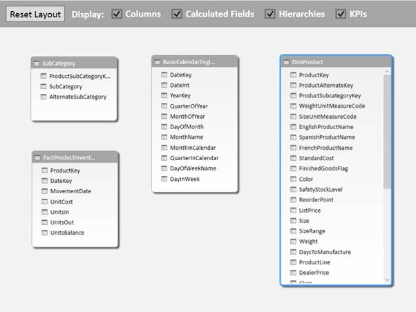

图 19:图表视图

图表视图显示了表及其相互之间的关系(稍后将在中详细介绍)。在图表视图中，我们还可以添加层次结构。

要在日期维度中创建层次结构，请右键单击层次结构的最高目标级别，在本例中为 **YearKey** ，然后选择**创建层次结构**。

图 20:创建层次结构

使用默认名称创建新的层次结构:

图 21:默认层次名称

我们可以把这个改成更有意义的，比如**日历**。我们还可以重命名级别—双击名称以覆盖字段名称。源名称显示在字段名后面的括号中。

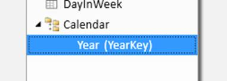

图 22:重命名层次和级别

单层层次结构没有多大用处，所以我们需要在其中添加层次。我们只需将字段拖动到我们创建的顶层之下，并在移动时重命名它们。

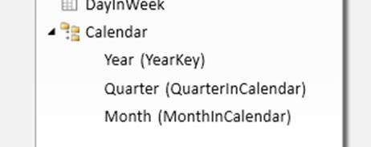

图 23:向层次结构添加级别

如果我们在 Excel 中看到这种情况，就会更容易理解其实际影响。

在 PowerPivot 数据模型功能区的主页选项卡中，单击**数据透视表**选项，并选择在新工作表中创建数据透视表。

在屏幕的右侧，将出现数据透视表字段列表，就像普通的透视表一样。但是，您看到的不是源表中的所有列，而是 PowerPivot 数据模型中的表:

图 24:在数据透视表中浏览模型

要浏览我们新创建的层次结构，请展开**基本日历英语**并单击**日历**复选框。如果您展开“日历”节点，您将看到在我们刚刚创建的层次结构中的级别下面。

图 25:探索数据透视表中的层次结构

这将自动将层次结构放入工作簿。我们可以展开树中的几个节点来查看我们的层次结构:

图 26:在 Excel 中查看层次结构

有一个层次结构本身是很好的，但是只有当我们使用它来滑动和切割我们的数据时，它才变得真正有用。但是，如果我们要从 FactProductInventory 中拖动一个值进行分析，例如 UnitsBalance，我们会在数据透视表中看到:

图 27:没有关系的分析

此警告将出现在“透视表字段”窗口中:

图 28:“可能需要关系”警告

事实上，虽然 FactProductInventory 有一个日期元素，但 PowerPivot 并没有被告知 BasicCalendarEnglish 表通过日期键与 FactProductInventory 相关。因为它不知道如何将这些数据联系在一起，所以它只是将层次结构中您所看到的每个级别的整个表的 UnitsBalance 的所有值相加。有趣的是，您可能会注意到层次结构的级别没有合计(即年不是季度的总和)；这是因为在您查看的层次结构的每个级别，它都试图计算正确的值。但是因为没有关系，层次结构的每一层最终都返回相同的值。

建立我们的模型的下一个合乎逻辑的步骤是创建一个关系，这样我们的分析就变得更有意义。

## 关系

PowerPivot 最强大的功能之一是它能够通过简单的拖放操作将不同表之间的数据正式关联起来，然后在另一个表的上下文中从一个表中获取数据。一个简单的例子是使用日期表中的日期层次结构来过滤其表中的产品库存数据。

要在基本的 Excel 中做到这一点，需要对数据进行排序，并通过 VLOOKUP 公式来获取相关数据。工作簿中太多的 VLOOKUPs 会很快减慢速度，因此您不会想要太多，当然也不会对数百万行数据不利。

对于 PowerPivot 来说，这是面包和黄油，您将能够在数据之间创建关系，从而实现强大的切片和切片，而不需要复杂的公式——通常根本不需要任何公式[【6】](6.html#_ftn6)。

### 手动创建关系

如上所述，创建关系是一个简单的拖放操作。创建关系时，您只需要记住几个限制:

*   您只能建立一个从一列到另一列的关系(也就是说，除非您首先将两个列组合在一起形成一个列，否则无法创建两个相关列之间的关系)。
*   您相关的列必须是兼容的[数据类型](#_Data_Types)。出于性能原因，整数比整数更可取。
*   关系**一侧的列中的值必须是唯一的**。

o 用数据建模术语来说，这是一对多的关系

o 对此存在高级变通办法。如果你遇到这些需求，推荐马可·鲁索和阿尔贝托·法拉利的白皮书《多对多革命 2.0》阅读[**【7】**](6.html#_ftn7)。

考虑到这些因素，我们可以在日期表和产品库存事实之间创建一个简单的关系。

在图表视图中，单击**基本日历英语**中的**日期**列将其高亮显示，并将光标拖动到 **FactProductInventory** 中的**日期键**列。

图 29:手动创建关系

当您释放鼠标按钮时，关系已经形成:

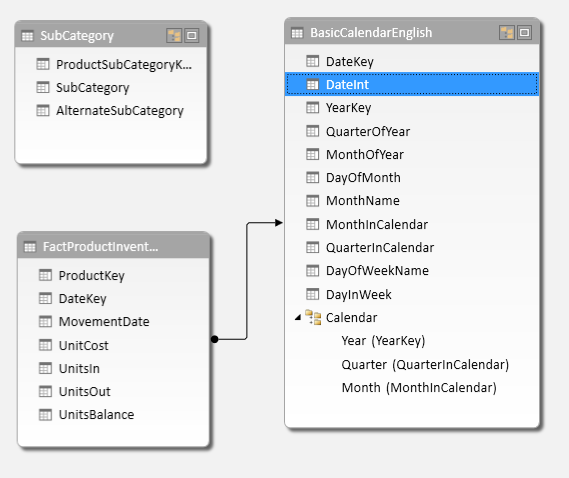

图 30:关系

请注意，箭头从关系的多面(FactProductInventory)指向关系的唯一面(BasicCalendarEnglish)。

这就是你建立关系所需要的。要查看它的运行情况，我们可以返回到我们之前创建的数据透视表，它会自动更新。请注意单击“刷新”，因为这不会刷新数据透视表，而是实际上返回来刷新源中的所有数据。

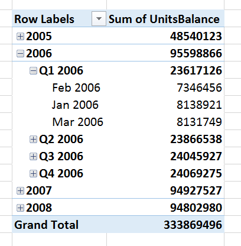

图 31:探索有关系的数据

我们可以看到，现在 PowerPivot 理解了这种关系，情况发生了很大变化。有两大变化。首先，现在根据实际存在数据的年份过滤年份，而不是日历层次结构中的每一年。第二，层次结构的每一层都有不同的“单位之和”数字，现在月份加起来就是季度总数，季度就是一年。

为了完成本例的关系，我们将使用**产品密钥**连接 **DimProduct** 和 **FactProductInventory** ，并使用**产品子类别密钥**连接 **DimProduct** 和我们的 Excel 表格**子类别**。稍微重组一下，我们的模型现在应该是这样的:

图 32:包含所有关系的数据模型

## 计算列

现在我们已经有了一些关联的数据，我们可以开始用一些计算列扩展我们的模型。计算列的工作方式与 Excel 表格中的计算方式非常相似，您只需输入一次公式，它就会应用于表格中的每一行。关键的区别在于，您不能在某些行中有不同于其他行的值；您只能设置一个公式，它将毫无例外地应用于每一行—某些行没有手动覆盖。

构建一个计算列是一个简单的练习，但是首先我们必须熟悉一种叫做 DAX 的新公式语言。

### DAX

DAX 代表数据分析表达式。这是一种刻意类似 Excel 的语言，使高级 Excel 用户可以轻松地开始在 PowerPivot 模型中创建强大的计算。正如本书开头提到的，入门非常容易，但一些高级功能可以很好地扩展大脑。

### 创建简单列

我们将通过在 DimProduct 表中创建一组非常简单的列来开始 DAX。在网格视图中，如果我们滚动到模型的最右侧，我们可以选择**添加列**。

图 33:网格视图:添加列

在我们的数据中，我们有单位成本和重量栏，因此我们可以从计算每公斤产品的成本开始。要创建列，用新列改写网格中的**添加列**标题:

图 34:添加了列的网格视图

点击**进入**后，该列被添加。您将看到行的阴影变成灰色，表示该列现在在模型中，并且“添加列”重新出现，以便您可以添加更多列。

我们的下一步是创建一个公式。在屏幕的左侧，我们可以看到公式栏:

图 35:数据模型中的公式栏

要开始创建公式，请在公式栏中输入并添加等号。接下来，输入一个开始的方括号 **[** ，出现一个字段列表。当您开始输入**标准成本**时，列表将开始被过滤。如果有多个选项，可以用箭头键选择一个值，点击**选项卡**选择。

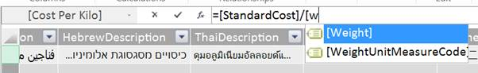

图 36:公式栏中的字段提示

然后我们可以跟进一个除法符号，然后选择**权重**字段。点击**进入**，公式已经创建。

不幸的是，当我们点击**进入**时，这将填充该列:

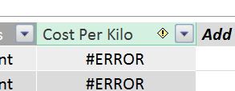

图 37:计算字段误差

与 Excel 中逐行标记错误不同，在 PowerPivot 中，如果在列中抛出一个错误，则整个列都无法计算。如果我们突出显示该字段，单元格右侧会出现一个下拉菜单:

图 38:列错误下拉列表

我们的错误是:

图 39:计算错误消息

这应该是一个足够简单可以解决的问题。我们可以使用网格上的过滤器快速查看权重列中的数据。这可以通过字段名右侧的下拉按钮来访问，就像在 Excel 表格中一样:

图 40:过滤网格中的数据

向下滚动到列表的底部，我们会看到一个(空白)条目，因此很快就会发现它并不是为每一行填充的。我们可以像在 Excel 中一样，使用 IF 和 ISERROR 语句进行一些简单的处理:

= IF(ISERROR([标准成本]/[重量])，0，[标准成本]/[重量])

现在，我们的列可以无误地计算是否填充了权重:

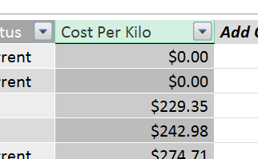

图 41:成功计算

### 从另一个不相关的表中查找数据

进一步探索我们的数据，实际上有一个名为重量测量代码的列，它有空白、磅或克的值。所以我们的每公斤成本计算并不那么准确，因为没有一个重量是以公斤为单位的。我们可以将转换嵌入到嵌套的 IF 语句中，但是有一个更加灵活和强大的选项，它展示了 PowerPivot 的真正价值。

首先，我们将在 Excel 中添加一个名为权重转换的新表:

图 42:重量转换表

然后我们将它添加到我们的数据模型中。

然后在 DimProduct 中，添加一个名为**重量换算**的新列。为了简单起见，首先我们将展示如何使用 lookup value[【8】](6.html#_ftn8)公式查找转换因子，如下所示:

=LOOKUPVALUE(权重转换[转换因子]，权重转换[权重单位度量代码]，权重单位度量代码])

这相当于 Excel 中的 VLOOKUP，但速度要快得多，而且不受固定数据范围的限制。如果在任何时候有新的权重度量出现，你可以简单地在 Excel 的表格中添加一行并更新模型，公式就会把它捡起来。

LOOKUPVALUE 需要三个参数:

*   要返回的列—权重转换[转换系数]
*   您正在查找的列—权重转换[权重单位度量代码]
*   您正在提供要查找的值的列—[权重单位度量代码]

这里有几点需要注意。首先是在我们的列语法中添加一个表名。在我们的第一个公式中，一切都在语法[字段名称]中。现在我们正在引用另一个表的内容，所以我们需要将它称为表名[字段名]。

其次，LOOKUPVALUE 公式期望每个查找值只能返回一个值，它允许查找中的多行具有相同的值，但不能有不同的值。

现在我们有了一个权重转换的查找表，它给出了以下结果:

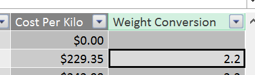

图 43:重量转换查找值结果

然后，我们可以通过将此重量转换纳入我们的公式来修正我们的每公斤成本计算:

= IF(ISBLANK([权重单位度量代码])，0，[标准成本]/([权重]*[权重转换])

还要注意删除“ISERROR”catch all，并用“ISBLANK”[[9]](6.html#_ftn9)替换它，以评估我们是否在加权单位测量代码中有值。

在列中复制重量转换值有点低效，尽管更容易理解，所以让我们将该公式转换为我们的每公斤成本公式:

= IF(ISBLANK([权重单位度量代码])，0，[标准成本]/([权重]*(LOOKUPVALUE(权重转换[转换因子]，权重转换[权重单位度量代码]，[权重单位度量代码]))

最后，我们使用另一个相关表中的一些数据，在每公斤成本计算中获得了准确的值:

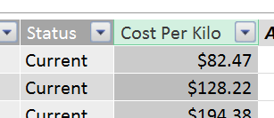

图 44:修正的每公斤成本结果

### 从另一个相关表中查找数据

我们可以通过在两个表之间建立关系来简化这个过程。在图表模式下，使用加权单位度量代码在新表和尺寸产品表之间创建关系。

现在，不用 LOOKUPVALUE，我们可以使用 RELATED[【10】](6.html#_ftn10)函数，该函数利用数据模型中的关系来获取相关信息。

LOOKUPVALUE 公式的等效公式如下:

=相关(权重转换[转换系数])

这要简单得多——我们只需要知道要检索哪一列。PowerPivot 知道这些关系，然后可以根据它对数据结构的了解，思考如何将它们联系起来。

现在，每公斤成本函数可以简化为:

= IF(ISBLANK([权重单位度量代码])，0，[标准成本]/([权重]*相关(权重转换[转换系数])

这两个函数之所以存在，是因为您想要从中获取信息的表和您想要在其中引用查找值的表之间可能不总是存在可导航的关系。通常最好使用 RELATED 函数，因为它更容易编码，并且通常计算成本更低。

### 对另一个表中数据的计算

我们刚刚探索了从另一个表中获取单个值的能力，但是 PowerPivot 可以做得更多。通过关系的力量，您可以完全访问相关表中的数据。

如下图所示，左侧表中键“B”的单行与右侧表中的多行相关:

图 45:相关表格中的数据

眼前的挑战是，如果要计算结果，只能返回一个值。这意味着在使用相关数据时，一个关键的考虑因素是，如果您想从一对多关系的多端检索数据，需要做一些事情来确保只返回一个值。

通常，这是通过使用聚合函数来完成的，例如 SUM 或 AVERAGE。我们可以通过从 FactProductInventory 中获取一些值并在 DimProduct 中捕获它们来在我们的模型中探索这一点。

让我们从一个简单的 SUM[【11】](6.html#_ftn11)操作开始。在 DimProduct 中，我们可以添加另一列，这次叫做**总单位在**中。然后我们可以输入公式:

= SUM(FactProductInventory[UnitsIn])

然而，我们得到这样的结果:

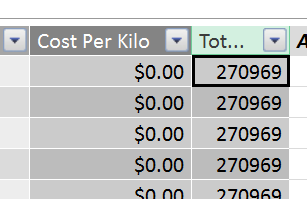

图 46:无上下文的 SUM

这是由于一个叫做[上下文](#_Context)的问题。我们将在后面更多地探讨这个主题，但是关键问题是 SUM 表达式没有应用任何过滤器，所以它只是添加 FactProductInventory 表中的每一行。

如果我们将这个计算列转换为数据网格底部的[计算](#_Calculations)，这个问题将随着关系再次开始产生影响而消失——但是我们将在后面看到这一点，因为这样做将教会我们一些关于上下文的课程。

如果我们想在行级别修复它，我们需要给 SUM 表达式一个如何在 FactProductInventory 中过滤行的想法。我们可以使用 SUM 表达式的变体 SUMX[【12】](6.html#_ftn12)。这允许您对表达式求和。

这是我们走向深渊的时刻之一。得到我们需要的结果的公式是:

= SUMX(FILTER(FactProductInventory，FactProductInventory[ProductKey]= EARTHER([ProductKey])，FactProductInventory[UnitsIn])

所以除了介绍 SUMX 之外，我们还引入了一个非常重要的功能，FILTER[【13】](6.html#_ftn13)，以及更早的[【14】](6.html#_ftn14)功能，这种功能并不常用。让我们逐步建立这个。

SUMX 有两个参数:一个数据表和一个求和表达式。因此，在第一遍中，我们可以尝试仅使用 FactProductInventory 作为表，使用 UnitsIn 作为表达式:

= sum(fact product inventory，fact product inventory[unit])

然而，这只是给了我们与 SUM 相同的结果:

图 47:没有上下文的 SUMX

这是因为我们真正做的是用 SUMX 代替 SUM。我们通过改为 SUMX 所做的就是在 SUM 从关系中计算出来的时候，显式地指定表 UnitsIn 在什么表中。

我们需要做的是对 FactProductInventory 应用一个过滤器。这里我们看一下 FILTER 函数。FILTER 函数对试图从中检索结果的数据表应用筛选器。因此，在我们的示例中，我们希望通过 DimProduct 中 ProductKey 的当前值来过滤 FactProductInventory。然而，如果我们尝试这个公式:

= sumx(fact product inventory、DimProduct[ProductKey]、fact product inventory[unit])

我们仍然得到同样的结果。原因是过滤器正在使用 DimProduct 中 ProductKey 的每个值将过滤器应用于 FactProductInventory。这是我们必须开始用不同于 Excel 的方式思考的地方之一。在大多数 Excel 公式中，您提供的任何参数都位于单个单元格级别。在 PowerPivot 中，输入值表要常见得多。这是一个很好的例子——指定 DimProduct[ProductKey]不是请求该字段的当前行值——而是指定整个列的内容。

在我们现有的数据中，这种影响并不明显，因为 FactProductInventory 中 ProductKey 的每个值也在 DimProduct 中。如果 FactProductInventory 中的 ProductKey 值比 DimProduct 中的值多，我们仍然会在每行中看到相同的数字。但是，该数字可能与我们在 SUM 函数中看到的不同，因为结果将只针对 FactProductInventory 中也在 DimProduct 中的那些 ProductKey 值进行筛选。

因此，抛开困难的概念，我们如何让过滤器考虑当前行的 ProductKey 值？这里，我们使用了 reach 函数(我们也可以使用 reach[【15】](6.html#_ftn15)函数，但是在这种情况下，EARTH 工作得很好)。这样做的目的是从计算引擎的早期版本[【16】](6.html#_ftn16)中获取行上下文，对于我们的示例，这意味着正在执行计算的行在 DimProduct 中的 ProductKey 值。

如果我们重新审视我们的目标公式:

= SUMX(FILTER(FactProductInventory，FactProductInventory[ProductKey]= EARTHER(Product[ProductKey])，FactProductInventory[UnitsIn])

突出显示的部分使用 EARLIER 函数将筛选器设置为 FactProductInventory[ProductKey]等于正在计算公式的 DimProduct 行的 ProductKey。我们现在得到这样一个结果:

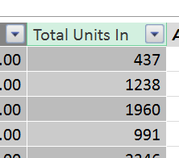

图 48:提供上下文的 SUMX

如果您仍然觉得自己处于深度开发阶段，请不要担心——早期是较难理解的功能之一，这里提到更多是为了开始提高您对 PowerPivot 中上下文的认识。

## 计算

行级计算很有用，但是 PowerPivot 真正的亮点是在表级应用计算。您可能想知道为什么在网格视图的下部有几行灰色单元格。这是添加计算的工作区。

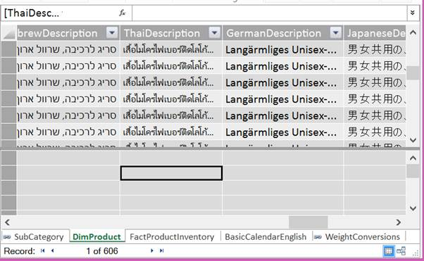

图 49:计算工作区中的选定单元格

在此图中，我们选择了一个单元格。为了创建一个计算，我们转到公式栏，给我们的计算一个名称，并输入表达式。为了重温我们之前的计算，让我们对字段中的单位求和。假设总和应用于 FactProductInventory，为了便于定位，我们将把它放在该表的网格中。我们需要的语法是:

v2 中的单位总数:=总和(FactProductInventory[单位]

请注意，我们不得不称之为“v2”或某种变体，因为 PowerPivot 不允许使用与已经存在的计算同名的计算。我们看到的是这样的:

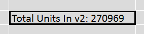

图 50:计算结果

如果我们现在去 Excel，我们可以看到一些有趣的东西。从数据模型中，在新工作表中创建一个透视表。在字段中，将 **DimProduct ProductKey** 拖动到行中，并从 **FactProductInventory** 中选择中的**单位和我们的度量，**v2 中的总单位**:**

图 51:透视表设置

我们在数据透视表中看到的是这样一组结果:

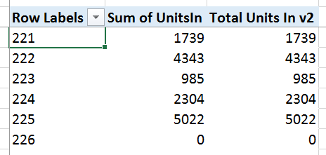

图 52:数据透视表结果

这里有几件事要说。首先，我们创建度量的努力似乎有点浪费，因为 PowerPivot 似乎在没有创建度量的情况下就按照我们想要的方式增加了单位。第二，也是更重要的一点，我们不需要做任何巧妙的计算就能逐行得出正确的结果。我们接下来会看这些。

### 默认聚合

默认情况下，PowerPivot 会对它找到的任何数值列创建默认聚合计算。如果您不小心单击了“产品密钥”旁边的复选框，而不是将其拖到“行”区域，您可能在构建数据透视表时发现了这一点，因为它会自动将其添加到“值”部分。

这种行为是可以改变的。在数据模型功能区的“高级”选项卡上，有一个未标记的部分，其中包含“汇总依据”选项:

图 53:数据模型选项卡上的汇总依据选项

当您点击**按**汇总时，下拉菜单为您提供以下选项:

*   默认值，始终为总和
*   总和
*   数数
*   福建话
*   最大
*   平均的
*   DistinctCount，唯一值的计数
*   不要总结

在我们的例子中，ProductKey 实际上不是一个有意义的数字，我们可以用它来求和、求平均值或进行其他计算，所以最好将其设置为**不要总结**。

对于数值列，Sum 是一种在创建计算时节省时间的简便方法。

#### 自动驾驶仪

有时对一列执行多个操作很有用。假设我们观察不同时间段的温度——知道最小值、最大值和平均值都是有用的——尽管总和本身是无用的。

在这种情况下，将默认聚合设置为“平均”是有意义的。然后，我们可以使用提供的自动求和选项快速添加最小值和最大值。在“数据模型”功能区的“主页”选项卡上，最右侧是一个名为“计算”的部分，其中包括一个“自动汇总:

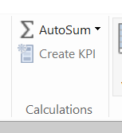

图 54:数据模型功能区的主页选项卡的计算部分

当您在要自动求和的列中选择一个单元格时，从该下拉列表中选择一个值将自动添加计算。如果我们在尺寸产品表中选择**产品密钥**，然后选择**平均值**，我们将看到创建了以下度量:

图 55:自动求和生成的计算

这不会为您节省大量的编码时间，但是对于那些非技术人员来说，这是创建计算的简单方法。

### 计算中的上下文

创建我们的计算的另一个重要收获是，我们不必做任何事情来获得正确的上下文——单位之和在没有我们做任何特别聪明的事情的情况下就有了每个产品密钥的正确值。

我们将在稍后重新讨论这一点，但需要注意的重要一点是，对于计算，与计算列相反，PowerPivot 会对数据行应用正确的筛选器，因此您只能获得您期望的值。它会根据您创建的关系了解您在什么上下文中查看数据。

### 时间智能

DAX 中有很多执行强大计算的功能，但其中最重要的是微软称之为时间智能[【17】](6.html#_ftn17)的功能。

为了让您体验一下这一点，我们将查看这一类别中的几个 DAX 函数，PREVIOUSDAY 和 TOTALMTD。首先，我们需要告诉 PowerPivot 哪个表应该用作日期表，它将根据该表进行时间智能计算。

#### 创建日期表

我们已经在日期表中加载了[，但是我们没有告诉 PowerPivot 该表的内容。如果我们在网格视图中选择我们的**基本日历**表，并前往设计选项卡，我们可以从下拉菜单中选择**标记为日期表**。](#_Using_external_data)

图 56:设计选项卡上的标记为日期表选项

这将弹出一个对话框，您需要在其中选择日期列。这必须是日期数据类型，并且不包含重复数据。我们将选择**日期键**列:

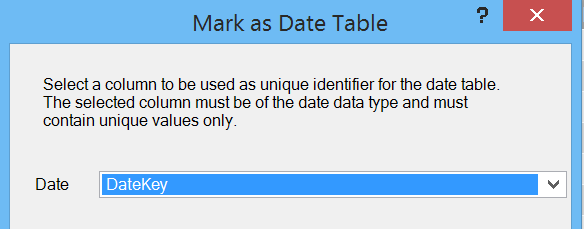

图 57:为日期表选择日期列

PowerPivot 现在知道，在构建时间智能计算时，可以将此表用作参考。我们跳过的一个限制是日期范围也必须是连续的——日期表中最低日期和最高日期之间必须有一个条目。因为我们使用了可靠的外部来源，这对我们来说不是问题。如果您自己构建，请确保它包含该范围内的连续日期，否则您的计算可能会返回不正确的结果。

现在让我们看几个函数来理解时间智能是如何工作的。

#### 以前

PREVIOUSDAY[【18】](6.html#_ftn18)功能不出意外地将日期维度中的前一天返回到当前选择的日期维度。这对于计算数据的每日移动非常有用。

在我们的例子中，我们将创建一个计算，计算出前一天的单位是多少。首先，我们将计算前一天的情况:

previousday:= previousday(' date[date key])

在计算区域，这将显示结果:

图 58:前一天的计算结果

然而，这并不是一个问题，这又是一个背景问题。在这个级别上，日期表不是应用于数据的过滤器的一部分，因此在这个上下文中，函数无法计算出前一天的日期。

如果我们创建一个简单的数据透视表，使用日期表和行上的日期，并以我们的度量值作为值，我们会看到以下结果:

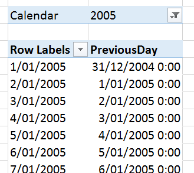

图 59:透视表中查看的前一天计算

正如我们所料，前一天计算的值是前一个日历日。

现在，为了利用这一点来创建前一天数据值的移动，我们需要检索前一天单位的值。我们需要的公式是:

PREVIOUSDAY units:= CALCULATE(SUM([UnitsIn])，PREVIOUSDAY('Date'[DateKey])

这就引入了一个新的函数，CALCULATE[【19】](6.html#_ftn19)，以及一个新概念，filters。CALCULATE 函数的功能在于能够修改公式的上下文。如果我们想要单位的和，我们可以在那个列上创建一个和。如果我们想要得到前一天的 SUM，我们需要用一个新的上下文覆盖 Date 表提供的上下文——在本例中是前一天的上下文，由 previous day 函数计算。

同样，在计算区域，我们没有得到有意义的结果，因为没有提供日期上下文:

图 60:没有上下文的前一天

但是，如果我们将新的度量添加到数据透视表中，再加上用于比较的单位，我们会看到:

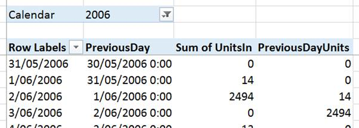

图 61:计算功能中的前一天影响

这里我们可以看到前一天单位的结果现在与单位的结果相差一天。

然后创建一个运动，我们只需要从今天的数字中减去前一天的数字:

DailyUnitsMovement:= SUM([unit sin])-CALCULATE(SUM([unit sin])，PREVIOUSDAY('Date'[DateKey])

这会产生以下结果:

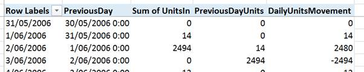

图 62:使用 PREVIOUSDAY 和 CALCULATE 函数创建每日移动

显然，这些数字有点荒谬，但如果您需要监控基于时间的数字变化，如账户余额、平均温度等，则创建这种计算的能力非常有用。

#### TOTALMTD

TOTALMTD[【20】](6.html#_ftn20)函数计算一个月到目前为止的总计。您只需要提供您想要合计的值和要使用的日期。因此，如果我们想创建一个月至今的单位总和，我们只需添加一个计算公式:

UnitsMTD:= TOTALMTD(SUM([UnitsIn])，“Date”[Date key])

这会在数据透视表中产生以下结果:

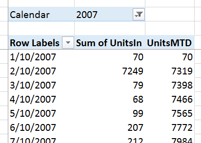

图 63:行动中的 TOTALMTD

在这里，我们可以看到单位时间计算值随着每天增加的单位而缓慢增加。

这不是一个非常复杂的公式，但它需要在 Excel 中进行一些复杂的操作。时间智能功能的伟大之处在于，它们使得以非常低的工作量进行基于时间的分析变得非常容易。

## 语境

在这最后几节中，我们一直在回避语境的主题。现在是深入挖掘的时候了。上下文定义了计算时可用的数据，因此它是过滤器、关系和公式位置影响的混合。

有三种不同类型的上下文:

*   行上下文
*   查询上下文
*   筛选上下文

我们将逐一探讨这些。

### 行上下文

我们在创建[计算列](#_Calculated_Columns)时体验了行上下文。在行上下文中，您可以访问该行中的所有值，以及与该行处于一对多关系“一”端的任何表中的任何相关数据。

这有助于解释我们在构建这些公式时遇到的一些问题。我们构建的公式的初始部分——每公斤成本——只需要我们正在操作的行中的值，因此它运行良好:

= IF(ISERROR([标准成本]/[重量])，0，[标准成本]/[重量])

我们想要使用的所有突出显示的值都可以在行上下文中使用。

当我们对此进行扩展时，我们使用相关函数从权重转换表中提取了一对多关系中“一”方的相关数据:

= IF(ISBLANK([权重单位度量代码])，0，[标准成本]/([权重]*相关(权重转换[转换系数])

然而，一旦我们试图从一对多关系的“多”方面获取数据，情况就不再那么好了，我们得出了这个公式:

= SUMX(FILTER(FactProductInventory，FactProductInventory[ProductKey]= EARTHER([ProductKey])，FactProductInventory[UnitsIn])

在这种情况下，我们实际上是在该单元格中创建我们自己的上下文，并在很大程度上忽略行上下文，除了我们使用 LEADER 从当前行中获取一个值作为过滤器。

作为快速总结，当我们位于计算列中时，该行上下文中有以下数据:

*   该行中各列的值
*   一对多关系中“一”端的相关表中的值

### 查询上下文

当我们创建[计算](#_Calculations)并在透视表中使用它们时，我们开始使用查询上下文。每当我们创建一个度量值(如一列的总和)时，您会注意到在计算中出现在公式中的值总是该列中所有内容的总和。这是因为当时该度量的查询上下文是整个表。

当我们将该计算移动到透视表中时，我们对数据进行切片和切割的方式会改变我们计算的每个单元格的上下文。让我们使用一个示例透视表来探讨这一点:

图 64:查询上下文示例数据透视表设置

这里我们应用了一个过滤器，对行和列进行切片，并对单位进行求和。在数据透视表中查看:

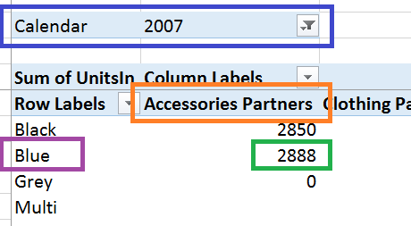

图 65:查询上下文示例数据透视表

为了获得单位总和的值 2888(绿色突出显示)，我们从日历中获取上下文作为到 2007 年的数据透视表过滤器(蓝色突出显示)。上下文还来自蓝色(紫色)和子类别(橙色)。

这个上下文的应用是 PowerPivot 自动完成的。每当您在像 Excel 这样的客户端工具中查看计算时，当它返回一个单独的单元格(例如上面用绿色突出显示的单元格)时，它会查看所有应用的筛选器来计算上下文，并将其应用到度量中以给出正确的结果。

总而言之，当我们查看计算时，上下文来自应用于您正在查看的数据单元的切片器和过滤器。

### 过滤上下文

最后是过滤器上下文，我们在使用 CALCULATE 函数计算前一天的值时已经探索过了。筛选器上下文应用于查询或行上下文之上(或者在某些情况下可以有意覆盖它)。

CALCULATE 函数是观察这种效果的间接方法，因此我们将使用直接应用程序来观察它。以下公式对单位的 SUMX 应用了一个筛选函数:

FIlteredsumofinn:= SUMX(FIlter(FactProductInventory，RELATED(dim product[Color])=“Blue”)，FactProductInventory[UnitsIn])

它使用相关功能来识别产品是否为蓝色，并过滤产品库存表中符合该标准的产品。如果我们在数据透视表中检查这一点，其中我们有一个日历过滤器，并在行上使用产品线:

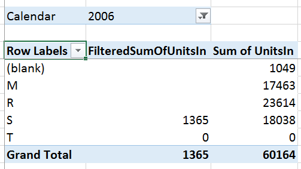

图 66:筛选上下文数据透视表

我们可以在这里看到，UnitsIn 的 FilteredSum 考虑了查询上下文(即日历年和产品系列)应用的过滤器，并且覆盖了必须为蓝色的产品的过滤器上下文。

过滤上下文是对查询上下文的修改。然而，如上所述，它也可以覆盖它。

使用所有[【22】](6.html#_ftn22)功能，您可以覆盖每个过滤器的*。例如，在这个公式中:*

unfiltered sumofinitin:= SUMX(ALL(FactProductInventory)，FactProductInventory[UnitsIn])

这里我们要求表达式在应用 SUMX 时忽略 FactProductInventory 上的所有过滤器。如果我们将此添加到数据透视表中:

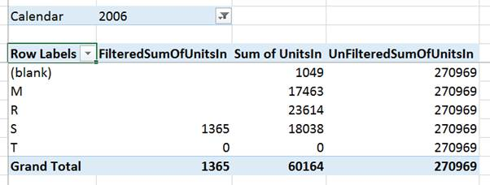

图 67:所有函数覆盖查询上下文

我们看到的是所有的过滤器——包括查询上下文中的过滤器——都被移除了，我们只看到了整个表中的单位总数。单独使用此函数是有限的，但它通常是在更高级的计算中清除过滤器的有用方法，例如计算总数的百分比。