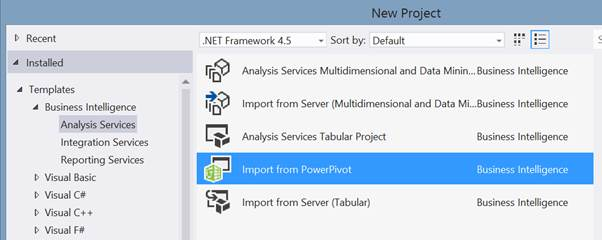

# 三、分享你的 PowerPivot 模型

通常，一旦创建了有用的 PowerPivot 模型，它就需要离开桌面，转移到其他人可以访问的地方。接下来我们将探索这样做的方法。

## 独立工作簿

PowerPivot 工作簿是一个独立、完整的数据模型。所有来源的数据都已存储在工作簿中。你可以简单地把它放在一个文件共享或电子邮件，或任何你有传递文件的选择。

唯一的限制是，如果需要刷新数据，并且收件人没有数据源的有效凭据，则可能无法这样做。

## SharePoint 工作簿

如果已经启用了 SharePoint 功能的 PowerPivot[【26】](6.html#_ftn26)，将 power pivot 模型上传到 SharePoint 可以打开一些有趣的共享选项。

这些功能包括:

*   工作簿数据模型成为可访问的数据源
*   用于在 SharePoint 页面中提供可视化的 Excel 服务集成
*   自动数据刷新
*   访问控制
*   工作簿监控

让我们深入了解一下这些特性。

首先，将工作簿上载到一个合适的、已启用的 SharePoint 环境允许 Analysis Services 进行一些幕后操作。工作簿数据模型本身可以作为数据源访问。这是通过将工作簿中的数据模型推回到一组专门配置的分析服务服务器来实现的(在非常简化的级别上)，这些服务器是 SharePoint 场的一部分。这使得它能够作为一个独立的数据模型运行，服务器支持数据请求，还支持可伸缩性。随后，PowerView、报告服务和 Excel 服务可以基于上传的数据模型构建报告。

其次，正如刚才提到的，Excel Services 集成允许将图表和数据透视表等 Excel 内容嵌入到 SharePoint 网页中，并且 Excel Services 将能够使用 PowerPivot 数据模型作为源。这意味着，如果您在构建 PowerPivot 工作簿的过程中创建了一组有用的仪表板和报告，那么您现在可以将它们作为 SharePoint 网站的一部分进行广泛共享。

由于如果必须手动刷新数据，这些数据模型的用处有限，SharePoint 启用了模型中数据的计划刷新[【27】](6.html#_ftn27)。这仅限于每天刷新一次(从 SharePoint 2013 开始)。

接下来，将工作簿放入 SharePoint 中，可以实现在该环境中管理的任何文档的常规访问控制级别。我们将在[安全注意事项](#_Security_considerations)一节中进一步讨论这一点。

最后，对于信息技术管理员来说，可以监控[【28】](6.html#_ftn28)正在访问哪些工作簿，数据刷新是否失败，以及服务器资源的利用情况。这对于确定可以转变为完全受支持的商业智能解决方案的候选模型(以及任何消耗资源并可能被移除的不受欢迎的模型)非常有用。

总之，如果您处于大量利用数据的企业环境中，这些功能将极大地实现自助商业智能的理想。也就是说，用户可以创建自己的报告和内容，可以灵活地选择他们包含的数据源，但仍然可以使用完整的商业智能解决方案提供的强大功能。信息技术管理员有一个窗口来监视管理自助服务功能的事情，而不会使用户受到正常部署和发布的限制。这并没有排除自助服务模式的其他一些风险，如数据质量差或公式不正确，但它至少让大量使用的解决方案受到关注。

## 表格模型

您的模型可能需要进一步的功能，例如:

更频繁或有管理的刷新

更精细的安全性

处理大量数据的能力

非常广泛的分布

集权管理

在这些情况下，考虑将模型从工作簿升级为完整的商业智能解决方案作为 SQL Server Analysis Services 的一部分可能是有益的。

迁移路径非常简单。在 SQL Server 数据工具[【29】](6.html#_ftn29)(Visual Studio 的一部分)中，从**文件**菜单中选择**新项目**，在分析服务模板中是**从 PowerPivot 导入**模板:

图 98:将 PowerPivot 工作簿导入 Visual Studio

选择此模板将创建一个新的分析服务表格项目。作为创建过程的一部分，它将要求导入一个 PowerPivot 工作簿。选择它后，项目将从工作簿中创建一个完整的表格模型。它将包含工作簿中的所有表、关系、计算和其他设置。设计图面非常相似，有网格视图和图表视图可供选择，仍然使用相同的公式语言 DAX。当模型被部署到服务器上时，可能需要做一些工作来确保所有的数据连接都可以工作，但是模型在其他方面是可以运行的。这增加了以下功能:

*   通过 SQL 代理和/或 SSIS 进行计划刷新
*   来自 SSIS 的预定数据馈送
*   安全角色限制行级别的访问，允许不同的用户查看数据模型的不同方面
*   天空实际上是极限 2GB 的极限已经没有了。我在生产中听说过的最大型号是 2TB 大小！
*   作为企业服务器基础架构的一部分，提供了工作簿无法提供的性能和可扩展性
*   同样，作为企业基础架构的一部分，可以获得熟练的信息技术资源来保持模型的正常运行。

对我来说，轻松地从工作簿过渡到功能齐全的商业智能解决方案是最大的特点之一。它使商业智能专业人员能够在进行飞跃和工业化之前，在 Excel 中非常快速地粗略地给出概念证明，并且用户可以获得他们在概念验证中看到的东西，只是更加健壮。

## 安全考虑

在 Excel 中创建的 PowerPivot 模型有一个非常基本的安全模型，如果您共享工作簿，这一点值得记住，因为以这种方式共享敏感数据非常容易。

Excel 工作簿中的独立 PowerPivot 模型对于您将文件交给的任何人都是完全可读的。这意味着，如果您构建了一个客户分析模型，并在整个组织中共享它，如果您在该模型中嵌入了客户个人数据，那么任何拥有工作簿的人都可以看到它。一旦使用您的凭据将数据从源系统导入到 PowerPivot 中，就不再通过任何形式的身份验证来保护数据。唯一的限制是(除非您将凭据嵌入到工作簿中)，否则收件人将无法刷新数据。

上传到 SharePoint 的 PowerPivot 模型同样不安全。访问 SharePoint 需要授权才能访问文件，但是一旦文件在那里，如果有访问权限的人下载并共享工作簿，数据就会再次暴露。就作为数据源访问而言，SharePoint 身份验证确实提供了一些保护。

一般来说，如果您担心工作簿中数据的敏感性，那么请专注于共享您的分析结果，而不是您的分析本身。

但是，如果您的数据非常敏感，并且您确实需要适当的访问控制，那么将您的模型移动到 SQL Server 表格模型中是最安全的方法。SQL Server 安全性将控制数据模型访问，还可以将安全性扩展到数据行。例如，如果给定一个合适的过滤器，您可以将整个部门的数据只保护给他们的员工。