# 一、基础

## PowerShell 版本

PowerShell 现在是 4.0 版本，这本书是 3.0 版本写的。这意味着如果您使用的是 3.0 以下的版本，某些功能将不可用。要检查您的 PowerShell 版本，请运行命令 **Get-Host** ，然后查找版本属性。如果您有 3.0 以下的版本，请在此链接下载，该链接将安装包含 PowerShell 的 Windows 管理框架 3.0([点击此处](http://www.microsoft.com/en-us/download/details.aspx?id=34595))。请小心，因为它仅适用于 Windows 7 或更高版本以及 Windows Server 2008 或更高版本。

## PowerShell 交互外壳

### 外壳和现有工具

要开始使用 PowerShell 的交互式 shell，您只需要运行 PowerShell.exe，而不是更常用的 shell cmd.exe。如果您有一个 64 位系统，您将有两个版本的 PowerShell 可供选择，一个 32 位版本和一个 64 位版本。

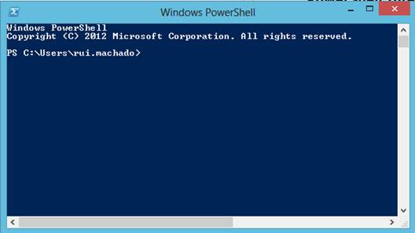

图 1:交互式外壳

打开这个交互式 shell 后，就可以开始键入 PowerShell 命令(*cmdlet*)并获取结果。这个 PowerShell 命令提示符的一个很好的特性是它与以前的 DOS 命令和 UNIX 命令兼容。如果您习惯于使用这种语法在目录和文件之间导航，这可能会很有用。


图 2:使用 UNIX 和 DOS 语法执行脚本

运行简单命令只需要这个交互式外壳；但是，当涉及到自动化任务和管理脚本时，这个 shell 可能会变得不够，开始使用脚本编辑器是很有用的。如果您愿意，可以使用记事本，但是有几个工具提供语法突出显示和智能编辑功能，以及脚本调试和用于编译的集成外壳。除了您的交互式外壳，您还有一个来自微软的现成的脚本编辑器，PowerShell ISE，它提供了更好的脚本管理和可用 PowerShell 命令的完整列表。该工具与 Windows 集成，适用于 PowerShell、3.0 和 4.0 版本。

要打开 PowerShell ISE 工具，点击**启动**，选择**运行**，然后执行以下命令:“powershell_ise.exe”。这将打开一个新的 PowerShell ISE 实例，如下图所示:

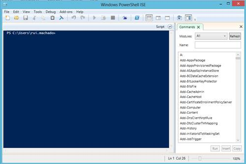

图 3: PowerShell ISE

尽管简单的交互式外壳更好，但 PowerShell ISE 可能对您来说还不够，因为它仍然使用命令提示符来编写脚本。它对方法、属性和命令也没有不同的颜色，我称之为*颜色感知*，或者更多时候被许多 ide 描述为语法高亮。为了使用 PowerShell 更好地优化您的工作效率，您可以考虑使用 PowerGui，一个经常用于开发的免费脚本编辑器。


图 4: PowerGui 脚本编辑器

这个脚本编辑器为您提供了一个正在使用的变量列表及其最后一个调试值，一个供您检查命令结果的 PowerShell 控制台，以及许多您可以稍后尝试的功能。如果你是 PowerShell 的日常开发者，我建议你使用这样的脚本编辑器。可以在这里下载 PowerGui [。](http://powergui.org/downloads.jspa)

### 执行策略

PowerShell 有一个非常独特的安全协议，称为执行策略，它允许您定义可以在您的机器或工作组上运行的脚本类型。正如我前面提到的，从五个可用的执行策略中选择一个将决定是否允许执行所有脚本，是否只允许执行交互式 shell 中键入的脚本，或者执行脚本的权限是否基于规则。如果您想在外部脚本编辑器(如 PowerGui)中运行脚本，您必须更改您的执行策略，否则您将收到如图 5 所示的错误。

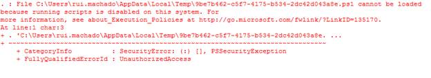

图 5:未经许可运行脚本时出错

默认情况下，PowerShell 将只允许您通过其交互式外壳执行脚本，这将阻止外部脚本执行。但是，通过设置最大安全级别，您可以轻松设置其他安全级别。下表显示了执行策略的完整列表。

表 1:执行策略

| 执行策略 | 安全级别 |
| 受限制的 | 将只允许交互式外壳执行。 |
| 全部签名 | 仅运行带有数字签名的脚本。首次执行脚本将提示信任发布者消息。 |
| 远程签名 | 所有来自互联网的脚本都必须签名。 |
| 无限制的 | 允许执行任何脚本。来自互联网的脚本必须是可信的。 |
| 旁路，旁道 | 用户必须验证每个脚本的执行。 |

要更改您的执行策略，您必须使用交互式 shell。打开交互外壳，点击**开始**，选择**配件**。运行 **Windows PowerShell** 并确保以提升的权限启动(**以管理员身份运行**)。键入命令将其更改为所需的命令。为此，右键单击附件选项卡中的 Windows PowerShell 图标，然后单击**以管理员身份运行**。

```powershell
          Set-ExecutionPolicy -ExecutionPolicy RemoteSigned

```

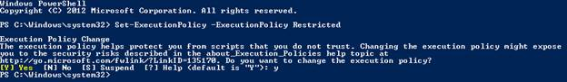

图 6:变更执行策略

要查看系统中当前激活的执行策略，可以使用 **Get-ExecutionPolicy** 命令。您现在应该将**远程签名**视为您当前的执行策略。

### 如何运行程序

PowerShell 允许您从自己的 Shell 启动一个程序，这样您就不会像 Perl 脚本或简单的批处理文件那样浪费所有现有的可执行文件。要启动您想要的程序，请在 PowerShell 中键入它的名称，后跟您可能需要或想要的任何参数。如果程序名有空格，请在键入&符号后用引号将它的名称括起来，然后是它的参数。下面的代码示例显示了这方面的一个示例。

```powershell
          $args = ".\My File.txt"

          & 'C:\Windows\System32\notepad.exe' $args

```

在我的计算机上执行此命令将打开我已经创建的文本文件，如下图所示。

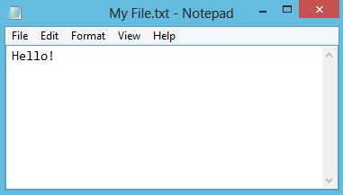

图 7:运行程序

### 如何运行脚本

如果您设置的执行策略允许您执行外部脚本，请在命令提示符下键入脚本的名称，就像任何 *cmdlet* 一样。

```powershell
          .\RUN_PROGRAM.ps1

```

如果您的脚本有参数，您也可以直接从命令提示符传递它们。

```powershell
          .\RUN_PROGRAM.ps1 -argmts "c:\temp\File.txt"

```

### 如何运行命令

运行命令就像在交互式 shell 命令提示符或任何其他脚本编辑器中键入命令一样简单，结果将显示给用户。这种情况的一个例子是调用命令来检索所有脚本执行历史。

```powershell
          Get-History

```

* * *

| 清洗外壳无论是在交互式 shell 中还是在带有执行选项的脚本编辑器中编程，使用 **`Clear`** 或 **`CLS`** 命令来清理结果。 |

* * *


图 8:运行命令(Cmdlet)

### 获取现有命令的帮助

要获取特定命令的信息，可以使用 **`Get-Help`** 命令，后跟命令名称。

```powershell
          Get-Help -Name Get-History

```

当您第一次运行该命令时，PowerShell 可能会要求您下载最新的帮助库，如图 9 所示，以便为您提供关于其命令的最新信息。


图 9:更新帮助

### 从交互外壳读写

要将值写入外壳，可以使用**写主机**命令。这不仅将一个值写入控制台，还允许您自定义其输出，例如使用 ForegroundColor 参数的文本颜色，或使用 background color 参数的背景颜色。

```powershell
          Write-Host -ForegroundColor White "SyncFusion" -BackgroundColor Black

```

调用前面的命令将导致交互式外壳中出现以下显示。

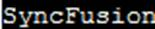

图 10:写输出定制

|  | 提示:当 PowerShell 找到一个没有被上下文捕获的字符串时，它会打印它的值。如果你想写一个变量，只需在控制台中写下它的名字。 |

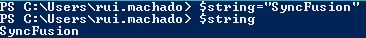

图 11:上下文打印

要从交互外壳中读取一个值，可以使用 **Read-Host** ，它从控制台读取一行输入。

```powershell
          $value = Read-Host

```

### PowerShell 管理单元

PowerShell 管理单元是一种扩展 Shell 中可用命令的方式，您可以使用自己的命令或从互联网上下载的命令。这些管理单元起源于 C#代码块，更准确地说是 PSSnapin 类的实现，编译并导入到带有动态链接库的脚本中。如果在已经完成的帮助器类中有一组方法，您希望重用这些方法以节省再次开发这些方法的时间，这可能会很有用。您不能直接使用这个 DLL，因为您需要向您的方法添加一些元数据，以便 PowerShell 可以识别一个 *cmdlet* ，但是这对开发人员来说是一个巨大的优势。

### 向脚本添加管理单元

要将管理单元添加到脚本中，可以调用以下代码:

```powershell
          Add-PSSnapin -Name "MySnap-in"

```

您只需要将管理单元添加到您的脚本之一中，就可以在会话中使用它；当您的 PowerShell 脚本运行时，该管理单元是可用的。

|  | 注意:您只能向您的会话添加注册的管理单元。要检查已注册管理单元的完整列表，请运行“Get-PSSnapin-registered”。如果您已经下载或创建了一个新的管理单元，您可以使用微软附带的 InstallUtil 工具进行注册。NET 框架。 |

要注册管理单元，请以提升的权限启动 PowerShell 交互式外壳，并执行以下操作:

1.  将目录更改为 C:\Windows\Microsoft。. NET\Framework\v4.0.30319
2.  运行 InstallUtil.exe“我的世界”。

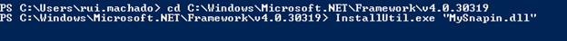

图 12:注册新的管理单元

### 向另一个脚本添加脚本引用

引用脚本是重用现有代码块(如您自己的函数)的一项有用任务，这将允许您节省多次编写相同脚本的时间。这样你只会开发一次，可以用几次。要将脚本引用添加到另一个脚本中，您只需要使用命令**导入-模块**。

```powershell
          Import-Module "MyOtherScript.ps1"

```

|  | 注意:所有这些命令都有可选参数来满足特殊需求。这样，您就可以随时使用命令获取帮助“命令名称”来查看完整的参数列表。 |

### 使用。NET 类

要在 PowerShell 中使用. NET 类，您只需要在括号之间标识命名空间，然后使用双冒号来调用您想要的方法。参数在. NET 中的传递方式是一样的，比如通过调用[DateTime]::Now 可以看到今天的日期和时间是什么。

## 管道

管道是 PowerShell 中一个重要且大量使用的特性。管道是从 UNIX 借用来的一个概念，它允许您使用一个命令执行的结果作为另一个命令的输入。这样，您不需要将结果保存在变量中，而只需在逻辑代码块中创建数据流。在 PowerShell 中，管道字符是“|”，您可以将它用于任何命令。

* * *

| 地点和选择 Where-Object 也可以与别名“Where”或符号“？”一起使用选择-对象也可以与别名“选择”一起使用 |

* * *

关于 PowerShell 管道的一个关键特性是，它们不会将命令的结果作为文本传递，而是作为对象传递，允许您在特定的结果集上调用其他补充命令。通过使用像 **Where-Object** 这样的命令来过滤集合或者 **Select-Object** 这样的命令来选择对象的特定属性，管道可以是查询命令结果集的一个非常高级的概念。

在前面的代码块中，有一个简单的例子。我使用命令**获取-进程**来检索所有活动进程，然后过滤结果列表，只获取名称为**的进程，其中**。然后我用命令**选择**从对象中只选择了属性标识。

```powershell
          Get-Process | where{$_.Name -like "PowerShell"} | Select Id

```

围绕管道的另一个重要概念是当前管道元素，可通过命令$_ 访问。这个特殊变量用于引用管道中的当前值。在这种情况下，$_ 是由 Get-Process 命令生成的行的集合，其中每一行都包含一个 Name 属性。其中命令通过将名称属性与“PowerShell”进行比较来过滤行，并将结果行发送到管道的下一阶段。

在使用管道时，您可能需要换行以形成可读性更强的流。为此，您需要使用 PowerShell 换行特殊字符(行延续字符)，它是用于断开字符串的后引号“` ”,或者是管道元素后要断开的管道“|”字符。

```powershell
          Get-Process | `
                where{$_.Name -like "powershell"} | `
                         Select Id

```

|  | 注意:使用几个管道时要小心，开发人员和系统管理员可能很难理解结果流。 |

## 变量

每种编程语言都使用变量来存储您希望在以后的程序或脚本结构中操作的信息。PowerShell 中也是如此；变量用于存储关于命令结果的信息，以便以后使用或将其传递到不同的管道级别。

在 PowerShell 中，变量以字符$(美元符号)开头，后面跟几乎任何字符。唯一的限制是 PowerShell 特殊字符。PowerShell 仅在用户会话结束时才释放变量的内容，这意味着如果您不再需要使用某个变量，请通过将$null 变量分配给它来清理它。

```powershell
          $var1=$null

```

变量对象类型是动态解析的，这意味着如果您分配一个字符串类型对象，变量对象类型将是字符串，如果它是 XML，那么它将是 XML。但是，您可以使用变量名前方括号([])之间的类型将变量转换为不同的类型。当您不想创建. NET 对象的新实例时，这很有用；相反，您可以将它强制转换为预期的类型，然后 PowerShell 会解析它。

```powershell
          $var1 = "PowerShell"

          $var2 = $var1

          #Casting to DateTime
          [System.DateTime]$var3="2013-06-13"

          #Casting to Xml
          $var4 = [System.Xml.XmlDocument]"<xml><node>HERE</node></xml>"

```

PowerShell 中的变量可以用不同的作用域来定义，因此您可以将变量设置为只能从特定脚本访问，只能在会话中访问，或者使整个 Shell 都可以访问。下表显示了变量全范围列表的可能性。

变量的默认范围因定义该变量的位置而异。如果在交互外壳中定义，它是全局的，如果在任何函数或脚本块之外，它是脚本，否则它是本地的。

表 2:变量范围

| 范围名称 | 范围 |
| 脚本 | 仅在该脚本中可用。 |
| 当地的 | 仅在特定的作用域或子作用域上可用，如循环和其中的任何循环。 |
| 私人的 | 仅在特定范围内可用，如内部循环。 |
| 全球的 | 整个外壳都有。 |

### 从物品中获取属性

列出项目的属性是系统管理员的主要活动之一，这样他们就可以根据特定的对象属性值做出决策。PowerShell 为您提供了一个命令来列出特定对象的详细信息。要显示该列表，请在任何对象上使用命令**格式-列表**。

```powershell
          Get-Process | `
                where{$_.Name -like "powershell"} | `
                         Format-List

```

该属性列表也可以存储在变量中，以备将来使用。

```powershell
          $var1 = Get-Process | `
                where{$_.Name -like "powershell"} | `
                         Format-List

```

PowerShell 不仅允许您保存该命令的结果，还允许您通过将命令包含在曲线括号“{}”中来存储命令本身。

```powershell
          $var1 = {Get-Process | `
                where{$_.Name -like "powershell"} | `
                         Format-List}

```

下图显示了这两个调用之间的区别。


图 13:在命令中使用曲线括号

### 格式化变量输出

有三个命令可以格式化变量的输出。您可以使用**格式-列表**将输出格式化为垂直列表，**格式-表格**将结果输出为表格，**格式-范围**检索单个数据项并将其显示为多列。

```powershell
          Get-Process | Format-List
          Get-Process | Format-Table
          Get-Process | Format-Wide

          #Choose how many columns you want
          Get-Process | Format-Wide -Column 3

```

| 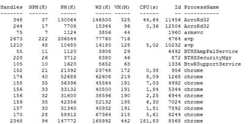 |  |
| 图 14:格式-表格 | 图 15:格式-列表 |


图 16:两列格式

## 字符串

字符串是编程语言中最常用的变量类型之一，PowerShell 也不例外。字符串用于比较用户名、评估操作系统版本，甚至比较 XML 节点。默认情况下，PowerShell 中的字符串为。NET 系统。字符串对象，这意味着当您用字符串初始化一个变量时，PowerShell 将实例化一个系统。字符串对象及其所有属性和方法。

```powershell
          $myVar = "PowerShell"
          ($myVar -is [System.String])

```

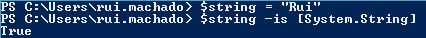

图 17:评估系统。字符串类型

虽然在 PowerShell 中使用字符串很简单，但它引入了一个通常会让开发人员感到困惑的新概念，那就是字面意思和扩展字符串。在文字字符串中，单引号(')之间的空格和逗号之间的所有文本都是字符串的一部分。当您用双引号(")括起文本时，PowerShell 会将所有变量名和特殊字符替换为它们的值。

```powershell
          $a="SyncFusion"

          #Literal strings
          $literal = '$a`n and PowerShell'

          #Expanding strings
          $expanding = "$a`n and PowerShell"

```

上一个代码块的结果如图 18 所示。

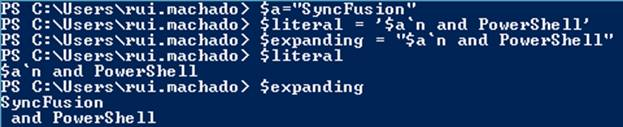

图 18:文字字符串与扩展字符串

### PowerShell 这里字符串

PowerShell 引入了一个很好的功能，简化了您管理大文本字符串的方式。这允许您定义多行字符串，而不必连接几个字符串部分。要使用此处的字符串，首先键入特殊字符“@”，然后键入新的一行，最后用新的“@”字符结束字符串。

```powershell
          #simple string
          $simpleString="Example String"

          #Empty here string
          @"

          "@

          #PowerShell here string
          $largeString= @"
                Hello, this
                is a PowerShell here string. You can define
                multiple string lines into one single text block.
                You can even use special characters like `n or expand it with another string
                $simpleString
          "@

```

如果您在交互式 shell 中运行这个脚本，您会看到 PowerShell 将这个字符串解释为一个扩展的多行字符串。这不仅可以简化多行字符串的初始化方式，还可以简化扩展字符串的构建方式，这里的字符串可以是扩展字符串，也可以是文字字符串。


图 19:这里是 PowerShell 字符串

### 正则表达式

正则表达式是搜索字符串中字符模式的一种简单且非常有效的方法。在开发 PowerShell 脚本时，您需要在几个上下文中使用正则表达式，这可能包括替换字符串中的文本、检索包含特定文本的 XML 文档中的所有元素或根据特定模式对文本块进行分组。要在 PowerShell 中使用正则表达式，如果只想计算字符串中的模式，可以使用–match 运算符；如果想根据给定的模式替换字符串中的字符，可以使用–replace 运算符。下面的代码块向您展示了如何使用–match 运算符。

```powershell
          #Text to evaluate.
          $text = @"
                This is a PowerShell string!
                We will use it to test regular expressions
          "@

          #Evaluate a pattern. Returns:True
          $text -match "\w"

          #Evaluate a pattern. Returns:False
          $text -match "!\w+"

```

虽然在 PowerShell 中评估字符串中的模式是一项常见的任务，但是替换文本对于基于模式的出现进行替换也很重要。下面的代码块向您展示了如何使用–replace 运算符。如果你不懂正则表达式，也不懂“\w”或“\w+！”的意思，您可以在 MSDN 网页[正则表达式语言-快速参考](http://msdn.microsoft.com/en-us/library/az24scfc(v=vs.110).aspx)中了解更多信息。您将找到一个完整的列表，其中列出了可以在正则表达式中使用的字符及其用途。

```powershell
          #Text to evaluate.
          $text = @"
                This is a PowerShell string!
                We will use it to test regular expressions
          "@

          #Replace every character with the A character.
          $text -replace "\w","A"

          #Replace every string followed by ! with the B character.
          $text -replace "\w+!","B"

```

调用前一个代码块将产生以下字符串。


图 20:使用替换操作符

## 项目清单

### 阵列

要在 PowerShell 中创建数组，可以使用两个选项之一:通过将所有值包含在@()中并用逗号分隔来显式声明数组，或者通过仅用逗号分隔来隐式声明数组，如下面的代码块所示:

```powershell
          #Explicitly
          $array1 = @(1,2,3,4,5,6,7,8,9,10)
          #Implicitly
          $array2 = 1,2,3,4,5,6,7,8,9,10
          #Accessing with a literal index
          $array1[2]
          #Accessing with a variable index
          $index=4
          $array2[$index]

```

要访问数组的值，只需调用方括号中的变量和索引，即$array1[$index]。

### 。网络列表

既然可以用。NET 类和对象，您可以使用集合中的任何类型的列表。通用集合。下面的代码块显示了一个使用字符串列表的示例。

```powershell
          $myList = New-Object Collections.Generic.List[string]

          $myList.Add("Rui")

          $myList.Item(0)

```

### 哈希表

PowerShell 中的散列表是用@字符和花括号中的 Key=Value 项来声明的，用分号分隔。

```powershell
          $values= @{
              "KEY1" = "VAL1"
            ; "KEY2" = "VAL2"
            ; "KEY3" = “VAL3"
          }

```

要访问哈希表的值，只需用方括号中条目的键调用变量，即`$values` [ `"KEY1"` ]。

|  | 提示:在每个条目的开头用分号分隔您的值；通过在声明开始时对其进行注释，可以更容易地将其排除在外。 |

## 流量控制

### 逻辑和比较运算符

为了沿着您的 PowerShell 脚本做出决定，您需要像在任何其他编程语言中一样使用条件语句。这些条件语句允许您与脚本中流动的数据进行交互，以通过其值定义行为。

所有 PowerShell 操作符都以连字符(“-”)开头，后跟所需的操作符名称。

|  | 注意:PowerShell 默认运算符不区分大小写；要使用区分大小写的运算符，需要在运算符前加上“-c”参数。 |

在下表中，您可以检查所有可用的 PowerShell 操作符。

表 3:比较运算符

| 操作员 | 定义 |
| -情商 | 等于。允许您比较两个值，如果匹配则返回 true，如果不匹配则返回 false。使用列表时，PowerShell 将返回左值中与右值匹配的所有元素。 |
| -是吗 | 不等于。允许您比较两个值，如果不匹配则返回 true，如果匹配则返回 false。使用列表时，PowerShell 将返回左值中与右值不匹配的所有元素。 |
| 通用电气 | 大于或等于。允许您比较两个值，如果左边的值大于或等于右边的值，则返回 true。使用列表时，PowerShell 将返回左值大于或等于右值的所有元素。 |
| -gt | 大于。允许您比较两个值，如果左边的值大于右边的值，则返回 true。使用列表时，PowerShell 将返回左值大于右值的所有元素。 |
| -中尉 | 小于。允许您比较两个值，如果左边的值小于右边的值，则返回 true。使用列表时，PowerShell 将返回左值小于右值的所有元素。 |
| 表示器具名称:bridle ｜ thimble | 小于或等于。允许您比较两个值，如果左边的值小于或等于右边的值，则返回 true。使用列表时，PowerShell 将返回左值中小于或等于右值的所有元素。 |
| 表示“像…的” | 比如。根据正确的值计算模式，如果匹配，则返回 true 如果不匹配，则返回 false。此运算符支持通配符，例如:

*   ？任何单个未指定的字符。
*   *零个或更多未指定的字符。
*   [a-b]范围内的任何字符。
*   字符 a 或 b。

 |
| -不喜欢 | 不喜欢。根据正确的值计算模式，如果不匹配，则返回 true 如果匹配，则返回 false。该运算符还支持通配符，与 Like 运算符相同。 |
| 匹配 | 匹配。根据正确的值计算正则表达式，如果匹配，则返回 true 如果不匹配，则返回 false。 |
| -不匹配 | 不匹配。根据正确的值计算正则表达式，如果不匹配，则返回 true 如果匹配，则返回 false。 |
| -包含 | 包含。如果指定列表具有特定值，则返回 true。 |
| -不包含 | 包含。如果指定列表没有特定值，则返回 true。 |
| 是吗 | 就是。将值与. NET 类型进行比较，如果匹配，则返回 true 如果不匹配，则返回 false |
| -不是吗 | 不是。将值与. NET 类型进行比较，如果不匹配，则返回 true 如果匹配，则返回 false。 |

```powershell
          #Strings to evaluate
          $a="Hello"
          $b="Hi"

          #EQUALS Returns False
          ($a -eq $b)

          #NOT EQUALS Returns True
          ($a -ne $b)

          #GREATER THAN OR EQUAL Returns True
          (10 -ge 10)

          #GREATER THAN Returns False
          (10 -gt 10)

          #LESS THAN Returns True
          (3 -lt 7)

          #GREATER THAN Returns True
          (3 -le 7)

          #LIKE Returns true
          ($a -like "H*")

          #LIKE Returns false
          ($a -like "H?")

          #MATCH Returns true
          ($a -match "(.*)")

          #CONTAINS Returns true
          (1,2,3,4,5 -contains 5)

          #CONTAINS Returns False
          (1,2,3,4,5 -contains 15)

          #IS Returns true
          ($a -is [System.String])

```

表 4:逻辑运算符

| 操作员 | 定义 |
| 表示“对象”:　analysand | 如果条件语句中的所有计算都为真，则返回 true。否则返回 false。 |
| 表示“…人” | 如果条件语句中的所有计算都为 false，则返回 false。否则返回真。 |
| 异或 | 如果条件语句中的任一计算为真，则返回 false，如果两者都为真，则返回 false。否则返回 false。 |
| -没有 | 反转条件语句中的逻辑计算。 |

```powershell
          #AND Return False
          ($a -ne $b) -and (1 -eq 1) -and ($a -eq "PowerShell")
          #OR Return True
          ($a -ne $b) -or (1 -eq 1) -or ($a -eq "PowerShell")
          #XOR Returns True
          ($a -eq $b) -xor ($a -like "H*")
          #NOT Returns False
          -not ($a -ne $b)
          #Combining multiple operators - Returns False
          (($a -eq $b) -xor ($a -like "H*") -and (1,2,3,4 -contains 1)) -xor ("A" -ne "B")

```

### 条件语句

条件语句类似于任何其他语言；你有传统的 if，else 和 switch 语句。

```powershell
          #Example
          $myVar=1
          if($myVar –lt 2){
              “small”
          }else{
              “large”
          }

```

虽然传统的声明是可用的，但是这种声明还有另一种形式，它使用哈希表来创建可以在一行中声明的内容，并且与传统声明完全相同。我喜欢在简单的条件下使用这个，比如变量值。哈希表键需要为$true 和$false，因为它们提供了布尔求值的两种可能性。

```powershell
          #@{$true=TRUE VALUE;$false=FALSE VALUE}[CONDITION]

          #Example
          $var1=2
          $var2=2
          $value = @{$true=12345;$false=67890}[$var1 –eq $var2]
          #The result should be 12345

```

转换

与 if-then-else 相比，switch 语句是测试多个输入案例的一种更简单的方法。

```powershell
          $int = 15

          switch($int)
          {
                0 {“You need to sum 15”; break}
                1 {“You need to sum 14”; break}
                2 {“You need to sum 13”; break}
                3 {“You need to sum 12”; break}
                4 {“You need to sum 11”; break}
                5 {“You need to sum 10”; break}
                6 {“You need to sum 9”; break}
                7 {“You need to sum 8”; break}
                15 {“GOOD!!”; break}
                default {“You are close”;break}
          }

```

### 循环

在 PowerShell 中，有几种方法可以循环(迭代)一个对象。然而，您拥有的可能性取决于您的逻辑、代码组织目标和您的对象类型。其中最简单的是 while 循环。在 PowerShell 中使用 while 与在任何其他基于 C 的语言中一样。

```powershell
          #EXAMPLE

          $array = 1,2,3,4,5,6

          $var=0

          while($var -lt 6){
                write $array[$var]
                $var++
          }

```

您可以使用的另一个循环结构是“for 循环”，它也类似于任何基于 C 的语言。

```powershell
          #EXAMPLE

          $array = 1,2,3,4,5,6

          for($i=0;$i -lt $array.Count;$i++){
                write $array[$i]
          }

```

最后一种是在 PowerShell 中使用最多的一种，用于每个循环结构，因为它适用于管道对象。然而，每种结构都有两种不同的，一种是在实现 IEnumerable 的对象集合中迭代，另一种是输入对象集合，通常用于迭代管道对象。

正如您将在下面的代码块中看到的，通过使用 PowerShell foreach 输入对象，代码变得更加简单和清晰。结果完全一样。

```powershell
          #BASE
          $array = 1,2,3,4,5,6

          #Traditional way - classic foreach
          foreach($var in $array){
                write $var
          }

          <# Using the most common way to
                iterate objects in PowerShell
                - input object foreach
          #>
          $array | %{
                write $_
          }

```

|  | 提示:foreach 对象有常用的别名，字符(%)和 foreach。大多数脚本编辑器中的第一个假定为绿色，第二个假定为蓝色。 |

### 管理进程

PowerShell 允许您管理 scipts 中的延迟、暂停和中断。为此，您有一组命令可以帮助您。**读取主机**命令暂停您的 scipt，直到用户按下回车键。**开始-睡眠**命令暂停你的睡眠一段给定的时间。

```powershell
          #Sleeps for 15 seconds.
          Start-Sleep -Seconds 5

          #Pause until user presses the Enter key.
          Read-Host

```

## 计划脚本执行

调度脚本执行是在 PowerShell 中自动执行特定任务的基本操作。它可以存储日志，用于集成任务，甚至为 SQL 数据库表创建备份。在很多情况下，您可能会考虑让 PowerShell 为您实现自动化。

虽然您可能正在考虑编写一个 Windows 通信基金会(WCF)或其他东西，但是有一个简单的策略可以使用 Windows 任务计划程序来计划脚本的执行。这允许您将脚本开发与其执行管理分开。要使用它，首先在窗口中打开它(**开始** > **【所有程序】** > **【附件】** > **【系统工具】**并选择**任务调度器**)。打开后，选择**创建基本任务**。


图 21:打开任务计划程序

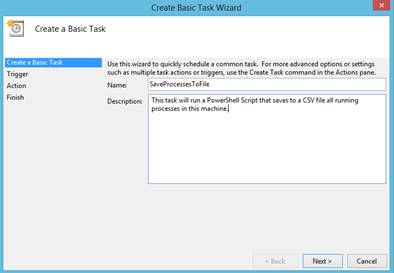

图 22:创建基本任务

现在选择您想要运行此任务的时间。这只是第一个计划配置，因为您需要在稍后指定关于此执行的更多细节。例如，如果选择“每日”，则可以定义该脚本运行的时间。

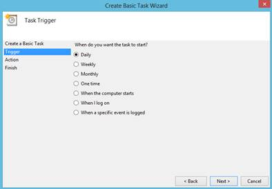

图 23:调度选择


图 24:二级调度

在您定义了执行时间表之后，您选择了操作，在这种情况下，您必须选择**启动程序**。在程序/脚本选择中，在程序文本框中键入**PowerShell.exe**，并在要运行的脚本路径后键入**–文件**作为参数。之后你就完了。该脚本将在选定的时间执行，并带有一个加号，您可以随时更改该脚本，更改将自动可用。


图 25:完成计划任务

## 可扩展性和代码重用

### 创建对象实例

得益于新的**新对象**小命令，在 PowerShell 中创建对象实例变得很容易。您可以调用**新对象**来指示您想要实例化哪个对象，无论它是. NET 还是 COM 对象。

```powershell
          #example using New-Object and ArgumentList to pass parameter to the object constructor
          $eventLog = New-Object System.Diagnostics.EventLog -ArgumentList "Application"

          #Object is available.
          $eventLog.Entries | Out-GridView

```

### 功能和参数

让我们先来看看函数。函数被命名为代码块，最好是简单和单一的任务，用于在脚本中重用代码。另一方面，参数是向函数发送外部值的简单通信机制。在下面的代码示例中，您可以找到函数和参数的几种应用场景。

```powershell
          #Using a simple Function
          function GetAllProcess{
                Get-Process
          }

          #Using a simple Function two parameters.
          function MyFunction($param1,$param2){
                Write "This is param 1 : $param1"
                write "This is param 2 : $param2"
          }

          #You can also use the param block to define your parameters.
          function MyFunction{
                param(
                      $param1
                      ,$param2
                )
                #Even declare where you process your logic.
                process{
                      Write "This is param 1 : $param1"
                      write "This is param 2 : $param2"
                }
          }

          #Calling GetAllProcess
          GetAllProcess

          #Calling MyFunction
          MyFunction -param1 65 -param2 3

```

|  | 提示:正如您在前面的代码块中看到的，您可以在 param 块中声明参数，也可以在进程块中声明逻辑。这将使您的代码更易读、更有条理。 |

调用函数时，有两种方法可以将参数传递到函数中，要么将参数包含在函数签名中，要么在函数调用前显示参数值。

```powershell
          #Included in method signature.
          [string]::Equals("Rui","Machado")

          #Using PowerShell front function parameters.
          MyFunction -param1 65 -param2 3

```

|  | 提示:传递这个参数时应该小心。在函数调用或 cmdlets 中使用括号被解释为 PowerShell 的子表达式，而不是参数。在这种情况下，必须通过指定有问题的参数来传递参数。我们只能在方法签名内(括号内)使用参数传入方法。在下面的代码示例中，您可以看到这些情况之间的差异。 |

```powershell
          function SumTwoValues($a,$b)
          {
            return $a + $b
          }

          <#CASE 1
          Calling a function with its parameters inside its signature
          doesn´t give you the expected result (evaluating the parameters as
          a sub expression), which in this case is an array. In PowerShell you can
          declare an array as 1,2,3,4,5,...,n, so it prints the values of the array
          #>

          "CASE 1"
          SumTwoValues(1,4)

          <#CASE 2
          Correct calling: Using this method you will get the expected result
          #>

          "CASE 2"
          SumTwoValues -a 1 -b 5

```

图 26 显示了使用这两个语法选项调用 SumTwoValues 方法时产生的结果。案例 1 显示数组(1，4)，案例 2 显示 1 和 5 的和。

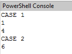

图 26:在函数中传递参数

参数不仅可以用在函数中，也可以用在脚本中。PowerShell 允许您使用脚本参数，只需将其作为函数调用，就可以使整个脚本可重用，这在您想要基于脚本而不是函数创建数据流时非常有用。要将参数添加到脚本中，您需要在脚本的开头使用 block param，只有当它是脚本中的第一行代码时，它才会起作用。

```powershell
          Param(
               $param1,
               $param2
          )
          #Start your script definition.

```

正如您所看到的，参数是在 param 块中定义的，但是关于这些参数及其特殊属性还有很多要讲的。在这个参数块中，如同在任何函数中一样，您可以添加以下属性。

表 4:参数属性

| 属性 | 定义 |
| 强制(布尔型) | 指定参数是否是必需的；真代表是，假代表不是 |
| 参数集名（字符串） | 指定命令参数所属的参数集。 |
| 位置(整数) | 指定参数在命令签名中的位置。 |
| ValueFromPipeline(布尔型) | 指定参数是否来自管道对象。默认值为假。 |
| ValueFromPipelineByPropertyName(布尔值) | 指定参数是否来自管道对象的属性。默认值为假。 |
| value fromremaining rules _ boolean) | 指定参数接受其余命令参数中的任何值。 |
| 帮助消息 | 设置参数的描述。 |
| HelpMessageBaseName | 为帮助消息描述指定外部引用。 |
| HelpMessageResourceId | 指定帮助消息的资源标识符。 |

要使用这些参数中的任何一个，您需要在参数声明之前或之上的方括号中声明它们。下面的代码块显示了这种属性用法的一个示例。

```powershell
          function TestParameters{
                param(
                      #You need to write the attributes inside Parameter()

                      #That parameter is Mandatory
                      [Parameter(Mandatory=$true)] $name,

                      #That parameter is Mandatory and Add a Help Message
                      [Parameter(Mandatory=$true,HelpMessage="You must enter an Age!")]
                      $age,

                      #This parameter comes from a pipeline object.
                      [Parameter(ValueFromPipeline =$true)] $address
                )
          }

```

如图 27 所示，通过使用帮助消息，用户可以在试图调用函数时看到关于特定参数的更多信息。


图 27:帮助消息

如果您没有提供强制参数的值，PowerShell 将会弹出一个输入框，告诉您缺少强制参数，并要求您提供它们。


图 28:缺少参数

关于参数的另一个很好的特性是，您可以添加验证器来评估您的参数是否匹配您设置的验证规则。

|  | **注意:PowerShell 有几个验证器，了解它们很重要，因为它们可以节省您验证特定参数值的时间。下表定义了所有可能的验证器。** |

| 验证器 | 定义 | 定义 |
| 有效计数 | 验证命令允许的最小和最大参数。 | [验证计数（$min，$max）] |
| validatalength | 验证参数的最小和最大字符数 | [有效长度($最小值，$最大值)] |
| validatapattern | 用正则表达式验证字符串参数。 | [验证模式($regexString)] |
| validareset | 根据一组可能的值验证参数。 | [验证集($ ArrayValidations)] |
| validatarange | 根据一系列可能的值验证参数。 | [验证者($min、$max)] |

以下示例使用`ValidateSet`属性对$type 参数实施约束，将可传递给该参数的值限制为三个不同的值。`ChangeUserType`功能随后使用该参数更改用户类型。

```powershell
          function ChangeUserType{
                param(
                      $userID,         
                      [ValidateSet("Admin","User","SuperAdmin")]
                      $type
                )
                ChangeType -User $userID -Type $type
          }

```

如果您尝试使用未在验证集中指定的类型调用该函数，您将获得一个错误，指示没有为该参数定义特定的值。

```powershell
          ChangeUserType -userID 1 -type "Regular"

```


图 29:验证集之外的属性出错

### 创建窗口表单

在 PowerShell 中创建 Windows 窗体就像在 C#中一样简单。有能力与。NET 类，我们只需要引用定义我们的 Windows Form Item 的类，然后使用上一个主题[创建对象实例](#_Create_instances_of)中显示的方法实例化它。为了向您展示它有多简单，我将构建一个示例，其中我创建了一个带有标题标签和数据网格的表单，以列出来自我们的 **Get-Process** 命令的项目。接下来，我将添加一个调用保存文件对话框的按钮，这样我们就可以将数据网格数据源导出为 CSV 文件。预期结果如图 30 所示。

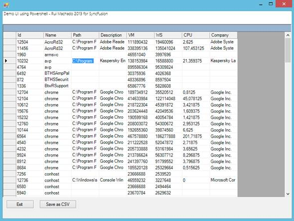

图 30:窗口表单获取过程

```powershell
          #Create a new .NET array list.
          $processList = New-Object System.Collections.ArrayList

          #Get all processes.
          $allProcesses = Get-Process | Select Id,Name,Path,Description,VM,WS,CPU,Company | sort -Property Name

          #Add all processes to an array list which is easier to manipulate.
          $processList.AddRange($allProcesses)

          #Instantiate a new Windows Form
          $form = New-Object Windows.Forms.Form

          #Sets the Windows Form size and start position.
          $form.Size=New-Object Drawing.Size @(800,600)
          $form.StartPosition = [System.Windows.Forms.FormStartPosition]::CenterScreen

           #This will create panels to display our items.
          $panelLabel = New-Object Windows.Forms.Panel
          $panelMain = New-Object Windows.Forms.Panel
          $panelButton = New-Object Windows.Forms.Panel

          #Creates the save file dialog so that we can export it as CSV.
          $saveDialog = new-object System.Windows.Forms.SaveFileDialog
          $saveDialog.DefaultExt = ".csv"
          $saveDialog.AddExtension = $true

          #Create the save to CSV button.
          $buttonSave = New-Object Windows.Forms.Button
          $buttonSave.Text = "Save as CSV"
          $buttonSave.Left = 100
          $buttonSave.Width =100

          #Add the OnClick save button event.
          $buttonSave.add_Click(
          {
                $resultSave=$saveDialog.ShowDialog()
                #If the user clicks ok to save.
                if($resultSave -eq "OK"){
                      #Save as CSV
                      $allProcesses | Export-Csv -Path $saveDialog.FileName
                      MessageBox("Guardado com sucesso")
                }
          })

          #Create the exit application button.
          $button = New-Object Windows.Forms.Button
          $button.Text = "Exit"
          $button.Left = 10

          #Add the OnClick exit button event.
          $button.add_Click(
          {
                $form.Close()
          })

          #Create datagrid
          $dataGrid=New-Object Windows.Forms.DataGrid
          $dataGrid.Dock = "Fill"
          $dataGrid.DataSource = $processList

          #Create a new label to show on the header.
          $label = New-Object System.Windows.Forms.Label
          $label.Text= "Demo UI using Powershell - Rui Machado 2013 for SyncFusion"
          $label.Font = "Segoe UI Light"
          $label.Width= 300

          #Add the header label to its panel.
          $panelLabel.Controls.Add($label)
          $panelLabel.Height =35
          $panelLabel.Dock = "Top"
          $panelLabel.BackColor = "White"

          #Add datagrid to its panel.
          $panelMain.Controls.Add($dataGrid)
          $panelMain.Height =470
          $panelMain.Dock = "Top"

          #Adds buttons to its panel.
          $panelButton.Controls.Add($button)
          $panelButton.Controls.Add($buttonSave)
          $panelButton.Height=50
          $panelButton.Dock = "Bottom"

          #Add all panels to the form.
          $form.Controls.Add($panelMain)
          $form.Controls.Add($panelButton)
          $form.Controls.Add($panelLabel)

          $form.Refresh()

          #Show the form.
          $result = $form.ShowDialog() | Out-Null

          if($result -eq "Cancel")
          {
                MessageBox("Program is closing...")
                $form.Close()    
          }

          #OPTIONAL: Function to create new MessageBoxes
          function MessageBox([string]$msgToShow)
          {
                [System.Windows.Forms.MessageBox]::Show($msgToShow)
          }

```

点击**保存 CSV** 按钮，将文件保存到文件系统中的目标位置。