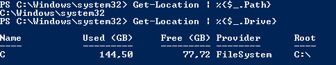
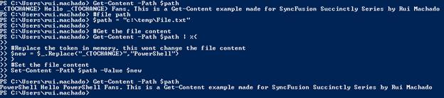
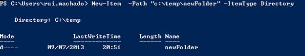

# 二、文件系统

本章专门针对那些在日常工作中花费数小时处理文件和目录的系统管理员。PowerShell 不会让你从这样做中解脱出来，但是它可能会通过编写可重用的函数来帮助你自动完成手动任务。

## 当前位置

处理文件和目录时，一个重要的主题是设置路径。当前位置是您在文件甚至脚本之间创建相对路径的重要路径之一。要获取当前位置，可以使用 **Get-Location** 命令，该命令检索一个表示当前目录的对象，很像 pwd(打印工作目录)命令。在这个对象中，您有当前的路径和驱动器。

```powershell
          #Returns full path for the current location.
          Get-Location | %{$_.Path}

          #Return drive info.
          Get-Location | %{$_.Drive}

```



图 31:获取位置执行

## 从目录中获取文件

要检索目录中所有文件的信息，您可以使用**获取子项目**命令，或者如果您只想列出单个项目的信息，请使用**获取项目**命令。该命令有几个重要参数；其中三个在表 5 中突出显示。

表 5:获取项目参数

| 参数 | 定义 |
| -名字 | 仅获取位置中的项的名称。 |
| -递归 | 获取指定位置和这些位置的所有子项中的项。 |
| 表示“使用…疗法的医生”:homeopath | 指定一个或多个位置的路径。 |

```powershell
          #Simple Get-ChildItem
          Get-ChildItem -Path (Get-Location).Path

          #Get-ChildItem using -Recurse parameter.
          Get-ChildItem -Path (Get-Location).Path -Recurse

          #Get-ChildItem using -Recurse parameter and a filter for file name (-Name)
          Get-ChildItem -Path (Get-Location).Path -Name "*Rui*"

          #Get-ChildItem filter by extension.
          Get-ChildItem -Path (Get-Location).Path | ?{$_.Extension -like "*txt"}

```

## 获取文件内容

```powershell
          #Get the content of a single file without restrictions.
          Get-Content -Path "c:\temp\File.txt"

```

由于有了 **Get-Content** 命令，获取文件的内容是一项简单的任务，该命令将一次读取一行内容，并返回一组对象，每个对象代表一行内容。您可以单独调用此命令，也可以将其与 **Get-ChildItem** 命令结合使用，根据其属性(如上次更改日期)动态读取多个文件的内容。

前面的代码块向您展示了一个如何检索单个文件内容的简单示例。这将产生一个所有线条都是红色的对象数组，您可以将其保存到一个变量中，并在以后进行操作。图 32 再现了这个调用的结果。为了测试这个代码块，在 **C:\temp** 中创建一个名为 **File.txt** 的文件。


图 32:调用获取内容

你的要求可能包括更复杂的呼叫。在下面的代码块中，有几个关于如何使用该命令的示例。

```powershell
          #Get the first three lines of your file using the -TotalCount parameter.
          Get-Content -Path "c:\temp\File.txt" -TotalCount 3

          #Get the last line of your file using the -Tail parameter (Available since Powershell v3.0)
          Get-Content -Path "c:\temp\File.txt" -Tail 1

          <#
                In this example combining this command with Get-ChildItem
                will allow you to retrieve the content of all files in c:\temp directory
          #>
          #Get the files
          Get-ChildItem -Path "c:\temp" -Filter "*.txt" | %{
                #Get Content
                Get-Content -Path $_.FullName
          }

```

## 操作文件的内容

一旦你有了一个文件的内容，很可能你会想要改变它的内容，要么清理它，替换字符串，甚至给它添加文本。 **Set-Content** 命令通过允许您写入或替换指定项目(如文件)的内容来提供这种能力。如果您单独使用此命令，并且只使用路径和值来调用它，那么它将用 value 参数中指定的新内容替换整个内容。要替换文件中的文本，您需要将其与获取内容命令相结合。

在下面的例子中，我们将获取一个文件的内容，并用字符串“PowerShell”替换字符串“_(TOCHANGE)”的每个实例。文件中的原始文本如下:

“_(TOCHANGE)哈啰 _(TOCHANGE)粉丝。这是鲁伊·马查多为 Syncfusion 系列简洁地制作的获取内容示例”

现在，我们将运行以下脚本，将文件内容更改为正确的句子。请注意，将改变文件内容的是读取文件内容后进行的字符串替换。Set-Content 命令将通过管道获取文件的路径及其内容的新值。

```powershell
          #File path.
          $path = "c:\temp\File.txt"

          #Get the file content.
          Get-Content -Path $path | %{

                #Replace the token in memory, this won’t change the file content.
                $new = $_.Replace("_(TOCHANGE)","PowerShell")
          }
          #Set the file content.
          Set-Content -Path $path -Value $new

```

这将导致我们的文件内容重置，如下图所示。



图 33:重置文件内容

## 创建临时文件

使用临时文件是跨多个脚本调用操作文件的有用策略。例如，您可以创建一个临时的 XML 文件，并使用几个函数和方法调用来操作它，然后只在脚本执行结束时保存它。

若要创建临时文件，可以使用。处理路径的. NET 命名空间，[系统。其中包括一个名为 GetTempFileName()的方法，用于创建临时文件。

```powershell
          #This gives you a temp url file to work with.
          $url = [System.IO.Path]::GetTempFileName()

          #After getting the temp url, you can work with the file.
          "Rui" | Out-File $url

          #You can retrieve the content of the temp file.
          Get-Content $url

```

## 管理目录

### 创建新目录

管理目录包括创建新目录、删除目录、更改权限和重命名目录等任务。PowerShell 允许您使用常见的 MS-DOS 命令来管理目录，但它添加了新的命令，因此管理目录变得更容易、更快、更高效。

要在旧的 Windows shell 中创建一个新目录，可以使用 mkdir。PowerShell 通过为您提供**新项**命令来重新定义 mkdir 命令。**新建项目**命令不仅用于创建目录，还可以用于创建文件、注册表项和条目。**新项目**采用–类型参数，确定要创建的项目类型。

要创建一个新目录，您只需要调用命令 **New-Item** ，提供其目标路径和类型目录参数作为参数。

```powershell
          New-Item  -Path "c:\temp\newFolder" -ItemType Directory

```



图 34:创建一个新目录

### 更改目录权限

虽然目录已经创建，但您可能希望更改其权限。为此，您必须了解访问控制列表(ACL)概念，这是一个访问控制条目列表(ACE)，用于标识受信者，并指定该受信者允许、拒绝或审核的访问权限。换句话说，它指定了用户和用户组访问特定资源的权限。

PowerShell 允许您获取和设置文件或目录的 ACL，为此，您可以使用**获取-Acl** 命令来检索表示文件或资源的安全描述符的对象，并使用**设置-Acl** 命令来更改指定项目的安全描述符。下面的代码块显示了如何更改以前创建的“新文件夹”来拒绝用户组的访问。

```powershell
          $pathToFolder = "c:\temp\newFolder"

          #Get the ACL of the folder.
          $acl = Get-Acl -Path $pathToFolder

          #set the new permission settings.
          $perSettings = "BUILTIN\Users","FullControl","Deny"

          #create the access rule.
          $newRule = New-Object System.Security.AccessControl.FileSystemAccessRule $perSettings

          #change the acl access rule.
          $acl.SetAccessRule($newRule)
          #Set the new rules in the folder ACL.
          $acl | Set-Acl $pathToFolder

```

这将在该文件夹的权限中添加一个新条目，如图 35 所示。


图 35:更改目录权限

要获得上图中显示的输出，请运行以下代码:

```powershell
          $acl = Get-Acl -Path $pathToFolder
          $acl.Access | Out-GridView

```

### 删除目录

要删除目录，可以使用命令**删除-项**，该命令在行为和调用结构上类似于**新建-项**命令。在这种情况下，您只需要提供项目路径，而不需要提供项目类型。

```powershell
          Remove-Item  -Path "c:\temp\newFolder"

```

将 **Get-ChildItem** 与 **Remove-Item** 命令相结合，将允许您根据过滤器或文件属性创建批量删除目录内文件的机制。

我想谈的最后一个操作任务是重命名您的文件和目录。PowerShell 还为您提供了一个重命名文件的命令，如果您正在按顺序处理文件集，该命令可以与 **Get-ChildItem** 命令结合使用，以便根据给定的过滤器或文件属性一次重命名几个文件。

### 重命名目录

**重命名-项目**命令更改指定项目的名称。此命令不影响正在重命名的项目的内容。要使用它，您只需要提供目标目录或文件的路径和要设置的新名称作为参数。

```powershell
          #directory path
          $path = "c:\temp\"

          #This example will invoke the rename command to a set of files.
          Get-ChildItem -Path $path -Name "File.txt" | %{

                #Rename the file.
                Rename-Item -Path  "$path\$_" -NewName "FileRenamed.txt"
          }

          #Simple use of rename item command.
          Rename-Item -Path "$path\FileRenamed.txt" -NewName "File.txt"

```

### 移动文件或目录

要移动文件或目录，您可以使用**移动-项目**命令，该命令将项目(包括其属性、内容和子项目)从一个位置移动到另一个位置。需要保留的一个重要注意事项是，当您移动项目时，它会被添加到新位置，并从其原始位置删除。

```powershell
          #original file location. Where we want to move from.
          $original = "c:\temp\File.txt"

          #file target location. Where we want to move to.
          $destination = "c:\temp\newFolder\File.txt"

          #Invoke the move item command.
          Move-Item -Path $original -Destination $destination

          <#Path and destination are positional parameters 1 and 2 so you can ignore parameter referencing.
               Move-Item $original $destination
          #>

          #Move the entire directory.
          Move-Item "c:\temp\newFolder" "c:\"

```

## 管理路径

### 将零件连接成单一路径

PowerShell 开箱即用，有很好的机制来管理脚本中的路径，使用类似于通过连接其相对部分来创建完整路径、测试路径是否存在、完成相对路径，甚至将路径拆分为多个部分等操作。

对于连接多个路径部分的任务，可以使用**连接路径**命令，该命令将一个路径和子路径组合成一个路径。提供程序提供路径分隔符。

```powershell
          #This will return c:\temp\File.txt
          Join-Path -Path "c:\temp" -ChildPath "File.txt"

          #Because path and childpath are positional parameters (Path is 1 and ChildPath is 2) ignore the parameter reference.
          Join-Path "c:\temp" "File.txt"

          #Join multiple parts.
          Join-Path (Join-Path "c:" "temp") "File.txt"

```

### 将路径分成多个部分

但是相反的任务呢，将一条路径分成多个部分？为此，您需要使用**分割路径**命令。这将返回您在命令调用中定义的路径的指定部分，叶(该部分的最后一部分)或头(默认行为)。

```powershell
          $path = "c:\temp\File.txt"

          #Return the head of the path: c:\
          Split-Path -Path $path

          #Return the leaf of the path: File.txt
          Split-Path -Path $path -leaf

          #Split multiple times: temp
          Split-Path (Split-Path -Path $path) -leaf

```

为了丰富您的分割路径命令，您可以使用一些。NET 方法来获取文件名或扩展名，这是 Split-Path 不支持的行为。

```powershell
          $path = "c:\temp\File.txt"

          #Return the file name: File.txt
          [System.IO.Path]::GetFileName($path)

          #Return the file extension: .txt
          [System.IO.Path]::GetExtension($path)

          #Return the file name without extension: File
          [System.IO.Path]::GetFileNameWithoutExtension($path)

          #Return the full file name: c:\temp\File.txt
          [System.IO.Path]::GetFullPath($path)

          #Return the directory name: c:\temp
          [System.IO.Path]::GetDirectoryName($path)

```

### 测试路径是否存在

访问特定文件时，您可能想要更改或获取其内容。最好检查一下文件或目录是否存在。为了实现这一点，PowerShell 有**测试路径**命令，该命令确定路径的所有元素是否存在。如果所有元素都存在，则返回 true ($true)，如果缺少任何元素，则返回 false ($false)。它还可以判断路径语法是否有效，以及路径是通向容器还是终端(叶)元素。

该命令通常与其他命令结合使用，如下面的代码块所示。

```powershell
          $path = "c:\temp\File.txt"

          #Simple path test, returns: True
          Test-Path -Path $path

          #You can evaluate the path forcing it to check if it is a file: True
          Test-Path -Path $path -PathType Leaf

          #You can evaluate the path forcing it to check if it is a directory: False
          Test-Path -Path $path -PathType Container

          #combine it with the Get-Content commands.
          $found=(Test-Path -Path $path -PathType Leaf)
          #if it is found, retrieve the content of the file.
          if($found){
                Get-Content $path
          }

```

### 解析路径

在这个管理路径部分，我想提到的最后一个任务是在 PowerShell 中动态解析路径的能力。解析路径意味着解释路径中的通配符并显示路径内容。为此，您需要使用 **Resolve-Path** 命令，该命令解释给定的通配符，并在路径指定的位置显示项目和容器，如文件和文件夹或注册表项和子项。

```powershell
          #Target Directory
          $path = "c:\temp\*"

          #Get all files inside that directory.
          Resolve-Path -Path $path

          #Once again path is a positional parameter in position 1, so ignore parameter reference.
          Resolve-Path $path     

```

通过调用前面的脚本，PowerShell 将根据所定义的通配符列出给定路径中的所有文件。


图 36:解析路径调用的结果