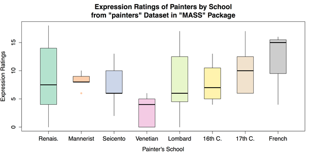
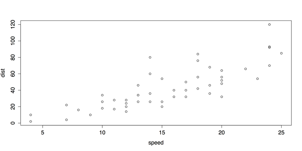
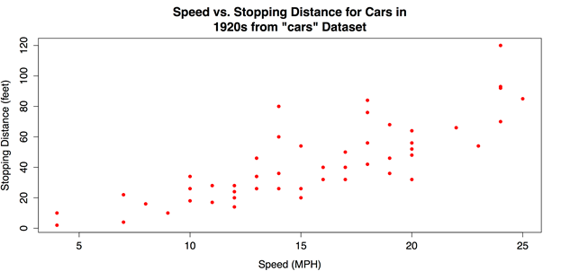
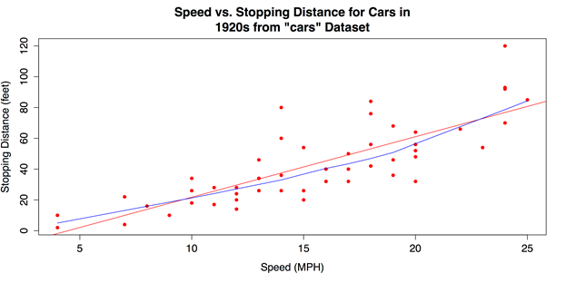
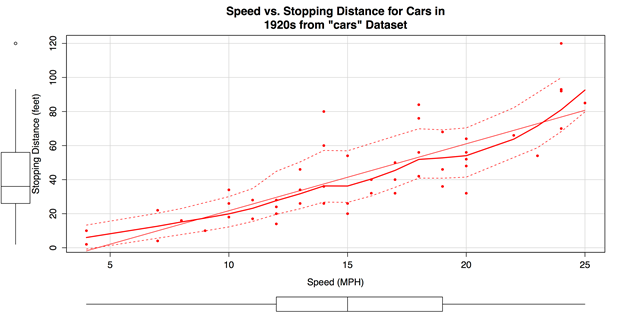

# 六、联合图表

我在这本书的序言中提到，我认为图形应该永远排在统计分析之前。图形可以为分析提供重要的背景和洞察力，如果首先进行统计程序，这些分析很容易丢失。因此，在单变量分析的章节中，我们首先讨论了一个变量的图表(见第 2 章)，然后讨论了一个变量的统计数据(见第 3 章)。我们继续二元关联的模式，第 6 章用图表表示关联，第 7 章用统计表示关联。

## 频率的分组条形图

当数据集由基于两个变量的联合分类组成时，联合频率的分组条形图通常是信息最丰富的图表。在本节中，我们首先将一个 2×3 的小数据表直接输入到 r 中。这是通过在`as.matrix()`函数中嵌套`read.table()`函数来完成的。我们必须将数据转换成矩阵，因为我们将使用的绘图函数期望数据是向量或矩阵。此外，还指定了两个属性:`header = TRUE`，表示第一行数据包含第一个分类变量上的级别名称；以及`row.names = 1`，表示第一列包含第二个分类变量上的级别名称。数据本身由每个级别组合的频率组成。

**样本:样本 _6_1。R**

```r
          # ENTER DATA
          data1 <- as.matrix(read.table(   # Save as matrix
                   header = TRUE,  # First row is the header.
                   row.names = 1,  # First column is row names.
                   # No comments within the data.
                   text = '
                   X  A  B  C
                   L  5  3  1
                   R  2  4  6
                   '))
          data1  # Check the data.

```

下一步是使用 R 的`barplot()`函数创建条形图。该命令最重要的部分是属性`beside = TRUE`，它将条并排放置而不是堆叠。

```r
          # CREATE BARPLOT
          barplot(data1,  # Use a new summary table.
                  beside = TRUE,  # Bars side-by-side vs. stacked.
                  col = c("steelblue3", "thistle3"),  # Colors
                  main = "Side by Side Barplots",
                  xlab = "Groups",
                  ylab = "frequency")

```

可以在`barplot()`命令中添加图例作为属性。然而，一个有趣的替代方法是交互式添加图例。通过首先使用前面的代码绘制图形，然后执行下面的代码，光标将变为十字光标，并允许您在图形中手动定位图例:

```r
          # ADD LEGEND INTERACTIVELY
          legend(locator(1),  # Use mouse to locate the legend.
                 rownames(data1),  # Use matrix row names (A & B).
                 fill = c("steelblue3", "thistle3"))  # Colors

```

得到的分组条形图如图 24 所示。


图 24:频率的分组条形图

像往常一样，一旦保存了您的工作，您应该通过移除您用`rm(list = ls())`创建的任何变量或对象来清理工作空间。

## 组均值的条形图

当数据由单个分类变量上几个组的定量数据组成时，组均值的条形图可能会有所帮助。为了在 R 中创建这个图表，有必要将原始数据重新组织成一个平均值表，然后可以使用我们在上一节中使用的相同的`barplot()`函数来绘制图表。在这个例子中，我们将使用来自 R 的`datasets`包的`InsectSprays`数据。

**样品:样品 _6_2。R**

```r
          # LOAD DATA
          require("datasets")  # Load the datasets package.
          spray <- InsectSprays  # Load data with shorter name.

```

为了制作一个手段条形图，我们首先需要将手段保存到自己的对象中。我们可以通过`aggregate()`函数来实现，其中结果变量`spray$count`是`spray$spray`的函数，`FUN = mean`请求平均值。

```r
          # GET GROUP MEANS
          means <- aggregate(spray$count ~ spray$spray, FUN = mean)
          means  # Check the data.

```

产生的数据帧`means`由一列索引值和一列平均值组成。我们需要删除名称列，并调换其含义。我们可以通过转置函数`t()`和参数`[-1]`来实现，这不包括第一列。然后我们用`colnames()`函数将组名放回列名中，并指定`mean[, 1]`，这将调用第一列的所有行。转置的数据和列名保存到一个新对象`mean.data`中。

```r
          # REORGANIZE DATA FOR BARPLOT
          mean.data <- t(means[-1])  # Removes the first column, transposes the second.
          colnames(mean.data) <- means[, 1]  # Add group names as column names.
          mean.data

```

一旦数据以这种方式重新排列，剩下的就是调用`barplot()`函数。

```r
          # BARPLOT WITH DEFAULTS
          barplot(mean.data)

```

不过，给`barplot()`增加一些选项还是有用的，尤其是增加标题和标签。

```r
          # BARPLOT WITH OPTIONS
          barplot(mean.data,
                  col  = "red",
                  main = "Effectiveness of Insect Sprays",
                  xlab = "Spray Used",
                  ylab = "Insect Count")

```

这将产生如图 25 所示的图表。


图 25:组均值条形图

最后，清理工作区并删除您创建的任何变量或对象。

```r
          # CLEAN UP
          detach("package:datasets", unload = TRUE)  # Unloads the datasets package.
          rm(list = ls())  # Remove all objects from workspace.

```

## 分组方框图

在最后一节中，我们看了组平均值的条形图。虽然这样的图表很有用，但它只显示了每组的一条数据，即平均值。查看每组分数的整体分布可能也很重要。这将允许您按组检查异常值，并直观地感受您的数据在多大程度上符合统计假设，如方差的同质性。

对于本例，我们将使用来自`MASS`包的`painters`数据集。[【17】](11.html#_ftn17)这套资料包含了 18 世纪艺术评论家罗杰·德·皮斯(Roger de Piles)对 54 位古典画家在构图、绘画、色彩和表情四个特征上的判断。[【18】](11.html#_ftn18)画家按“流派”分类这由因子等级代码表示如下:“A”:文艺复兴；“乙”:矫揉造作者；“C”:Seicento；“D”:威尼斯人；“E”:伦巴第；“F”:十六世纪；“G”:十七世纪；“H”:法语。这些分类构成了我们分析的基础。

**样品:样品 _6_3。R**

```r
          # LOAD DATA
          # Use data set "painters" from the package "MASS"
          require("MASS")
          data(painters)
          painters[1:3, ]
                     Composition Drawing Colour Expression School
          Da Udine            10       8     16          3      A
          Da Vinci            15      16      4         14      A
          Del Piombo           8      13     16          7      A

```

数据集格式良好，可用于 R 的`boxplot()`功能。所有需要做的就是指定结果变量和分类变量。在这种情况下，它们分别是`painters$Expression`和`painters$School`。

```r
          # GROUPED BOXPLOTS WITH DEFAULTS
          # Draw boxplots of outcome (Expression) by group (School)
          boxplot(painters$Expression ~ painters$School)

```

该代码生成的默认箱线图如图 26 所示。


图 26:分组箱线图(默认图表)

作为一个图表，图 26 有一个明显的遗漏:组没有有意义的标签。相反，它们被分类为 A、B、C 等等。这违背了图表的目的。因此，使用`names()`属性添加这些标签非常重要。添加标题、轴标签和其他更改也是一个好主意，可以使图表更具信息性和吸引力。这一变化的一部分将涉及使用`RColorBrewer`包来设置箱线图的颜色。

```r
          # GROUPED BOXPLOTS WITH OPTIONS
          require("RColorBrewer")
          boxplot(painters$Expression ~ painters$School,
                  col = brewer.pal(8, "Pastel2"),
                  names  = c("Renais.",
                             "Mannerist",
                             "Seicento",
                             "Venetian",
                             "Lombard",
                             "16th C.",
                             "17th C.",
                             "French"),
                  boxwex = 0.5,  # Width of box as proportion of original.
                  whisklty = 1,  # Whisker line type; 1 = solid line
                  staplelty = 0,  # Staple (line at end) type; 0 = none.
                  outpch = 16,  # Symbols for outliers; 16 = filled circle.
                  outcol = brewer.pal(8, "Pastel2"),  # Color for outliers.
                  main = "Expression Ratings of Painters by School
                         from \"painters\" Data set in \"MASS\" Package",
                  xlab = "Painter's School",
                  ylab = "Expression Ratings")

```

注意标题在`main`中没有`+`或其他换行；r 将代码中的中断视为印刷指令。改进后的箱线图如图 27 所示。



图 27:带标签和选项的分组箱线图

一旦保存了您的工作，您应该通过删除您创建的任何变量或对象来清理工作空间。

```r
          # CLEAN UP
          detach("package:MASS", unload = TRUE)  # Unloads MASS package
          detach("package:RColorBrewer", unload = TRUE)  # Unloads RColorBrewer package.
          rm(list = ls())  # Remove all objects from workspace.

```

## 散点图

也许最常见和最有用的图表可视化两个变量之间的关联是散点图。当两个变量是定量的，即测量的间隔或比率水平时，最好使用散点图，尽管它们可以适用于许多其他情况。在 R 的基础安装中，通用`plot()`功能通常用于散点图。它的默认配置和众多选项都很好用。此外，可以叠加各种回归线和平滑器。

对于这个例子，我们将使用来自 R 的`datasets`包的`cars`数据。

**样品:样品 _6_4。R**

```r
          # LOAD DATA
          require(“datasets”)  # Load datasets package.
          data(cars)

```

因为汽车数据集只包含两个变量——`speed`和`dist`(即从相应速度到停止的距离)——并且两者都是定量的，所以可能只有数据集的名称作为`plot()`函数的参数。

```r
          # SCATTER PLOT WITH DEFAULTS
          plot(cars)

```

这产生了如图 28 所示的散点图。



图 28:带有`plot()`的默认散点图

虽然图 28 中的图表已经足够，但是 plot()还提供了几种标签和设计选项。

```r
          # SCATTER PLOT WITH OPTIONS
          plot(cars,
               pch = 16,
               col = "red",
               main = "Speed vs. Stopping Distance for Cars in
                       1920s from \"cars\" Data set",
               xlab = "Speed (MPH)",
               ylab = "Stopping Distance (feet)")

```

修改后的散点图如图 29 所示。



图 29:带`plot()`的修正散点图

图 29 中表明两个变量之间正相关的向上模式很容易看到。但是，如果添加拟合线，这种关系会更加清晰。在下面的代码中，一条线性回归线将被`abline()`函数覆盖，该函数以来自`lm()`函数的线性回归模型为参数。此外，可以使用`lines()`函数添加一条较低的线——局部加权散点图平滑，该函数以`lowess()`函数为参数。有关这些功能的更多信息，请参见`?abline`、`?lines`和`?lowess`。

```r
          # ADD REGRESSION & LOWESS
          # Linear regression line.
          abline(lm(cars$dist ~ cars$speed), col = "red") 
          # "locally weighted scatterplot smoothing"
          lines(lowess(cars$speed, cars$dist), col = "blue")

```

添加拟合线后的散点图如图 30 所示。



图 30:带有线性回归和低拟合线的散点图

对于二元散点图的最终变化，我们可以使用巧合命名的`car`包中的`scatterplot()`或`sp()`函数(在本例中，它代表“应用回归的伴随”)。这个包在散点图上有很多变化。我们将使用的是边际箱线图、平滑器和分位数回归区间。详见`help(package = "car")`。

首先我们必须安装并加载`car`包。

```r
          # INSTALL & LOAD "CAR" PACKAGE
          install.packages("car")  # Download the package.
          require("car")  # Load the package.

```

接下来，我们可以调用散点图函数——可以用`scatterplot()`或`sp()`来调用——用一些属性参数来改变点并提供标题和标签。否则，代码接近默认设置。

```r
          # "CAR" SCATTERPLOT
          sp(cars$dist ~ cars$speed,  # Distance as a function of speed.
             pch = 16,  # Points: solid circles.
             col = "red",  # Red for graphic elements.
             main = "Speed vs. Stopping Distance for Cars in
                     1920s from \"cars\" Data set",
             xlab = "Speed (MPH)",
             ylab = "Stopping Distance (feet)")

```

图 31 显示了结果图表。默认情况下，边际箱线图、平滑器和分位数回归区间都包括在内，这使得它成为一个信息非常密集的图形。



图 31:用`car`包创建的散点图

保存工作后，通过移除创建的任何变量或对象来清理工作空间。

```r
          # CLEAN UP
          detach("package:datasets", unload = TRUE)  # Unloads datasets package.
          detach("package:car", unload = TRUE)  # Unloads car package.
          rm(list = ls())  # Remove all objects from workspace.

```