# 八、单元测试工具

如果你是一个 TDD 从业者，那么毫无疑问你会知道有绝对数量的不同工具存在，唯一的目的是使测试更容易。

有太多的框架是你无法撼动的，还有持续集成和构建工具，它们将运行这些测试并为你执行自动化构建。

问题是，大多数开发人员实际上没有时间研究所有这些框架——他们只想开始编写测试，然后能够运行它们并找出结果。

不幸的是，通常情况下，他们会花更多的时间学习每个框架的细微差别。然后他们花时间来确保他们可以测试他们想要测试的所有东西，然后他们花更多的时间来弄清楚如何将测试框架集成到他们的构建环境中。

考虑到所有这些因素，在 Visual Studio 中实现 TDD 涅槃的最佳方式是只编写一个测试，而不担心如何让它工作。

R#以其单元测试工具的形式将这个选项带到了表格中，并且开箱即用，它支持 NUnit 和 MsTest，以及以 QUnit 和 Jasmine 形式的 JavaScript 单元测试支持。

除此之外，您可以选择使用默认浏览器或 PhantomJS 来运行您的 JS 测试场景，并为您的。NET 代码。

如果您从 ReSharper **选项**对话框中查看**工具** > **单元测试选项**，您可以非常精细地控制测试框架在您需要时如何运行，但是 R#是默认设置的最佳实践默认值，使您能够立即开始编写测试。

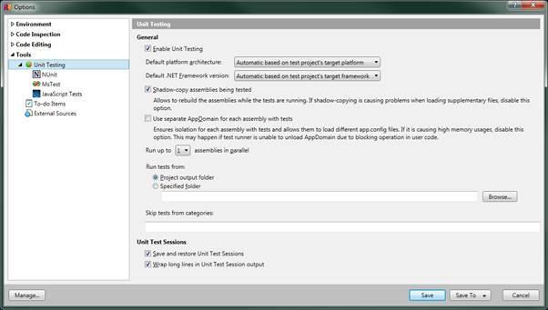

图 147: R#通用单元测试选项

您拥有的一些选项包括能够强制测试在特定的。NET 版本或特定的应用程序域。您甚至可以重新定位您的测试，使它们从一个完全不同的位置运行到您项目的位置，并且这些设置中的每一个都可以在项目级别保存，因此这些设置会遍历整个团队。

菜单本身是我们到目前为止看到的其他菜单的典型，选项是上下文相关的。


图 148:R #单元测试菜单

我个人一般只使用最下面的两个选项，**单元测试**和**单元测试会话**，第一个会打开如下窗口:


图 149: R#单元测试浏览器

单元测试资源管理器允许您从一个中心位置浏览和管理所有可用的测试。当您的解决方案中有可用的测试时，它们会显示在这里，并根据您在窗口顶部的**分组依据**下拉菜单中设置的选项进行分组。

第二个窗口**单元测试会话**，允许您作为单独的实体管理您的测试运行。这很有用，因为它允许您并排比较当前和以前的运行来观察差异。

选中后，单元测试会话选项将打开以下窗口:


图 150:单元测试会话窗口

### 一个样本项目

为了展示可用的函数，我创建了一个非常简单的控制台模式项目，我们将在其中添加几个虚拟算术类。然后，我们将使用各种 R#选项来管理这些类的测试。

首先，我们只有一个简单的空项目:

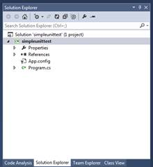

图 151:准备好添加测试和类的示例项目

我们的规范告诉我们，我们的算术引擎需要提供加减固定值和百分比的功能，并保持一个连续的总数。我们还应该能够在创建类的副本时设置初始级别。

首先，我们将创建以下类:

```cs
          namespace simpleunittest
          {
            public class Arithmetic
            {
              private decimal _runningTotal;

              public decimal RunningTotal
              {
                get { return _runningTotal; }
              }

              public Arithmetic(decimal runningTotal)
              {
                _runningTotal = runningTotal;
              }

              public decimal AddValue()
              {
                return 0;
              }

              public decimal SubtractValue()
              {
                return 0;
              }

              public decimal AddPercentage()
              {
                return 0;
              }

              public decimal SubtractPercentage()
              {
                return 0;
              }

            }
          }

```

除了所需的函数之外，每个函数还应该返回新的运行总数。我们还应该有一个构造函数，它创建一个在运行总数中默认值为 200 的类的副本，以及一个公共访问器，它允许我们随时读取运行总数，但不能修改它。

首先，我们将向我们的解决方案添加一个常规的单元测试项目——在解决方案资源管理器中右键单击您的解决方案条目，然后添加一个新项目。项目类型选择**单元测试项目**。

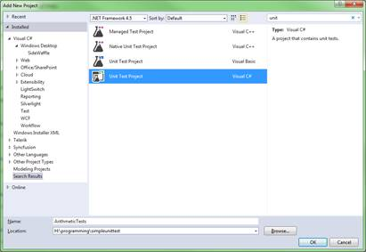

图 152:创建单元测试项目

通常情况下，Visual Studio 会创建一个默认测试功能。但是，如果您仔细查看 VS IDE 中的新文件，您会发现它看起来与平时有些不同:

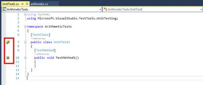

图 153:由 Visual Studio 创建的初始测试夹具

你会注意到 R#一直在发挥它的魔力，在左边界添加了自己的小图标；这些标记是你测试的控制图标。

通过点击一个单独的图标(比如图 153 中用红色突出显示的下方图标)，您可以直接从您的测试项目中运行一个测试。上方的图标(看起来像多个图标)允许您运行一个类中的所有测试。

该图标还用作 Alt+Enter 快速菜单图标，如果您在光标位于方法签名上时按下默认的 R#组合键，您应该会获得以下上下文菜单:

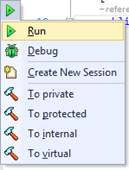

图 154:测试夹具的 R # Alt+回车菜单

R#给单元测试表带来了一些其他框架所做的事情，但是它以一种更方便的形式提供了它，那就是在测试中设置断点，然后像使用 Visual Studio 调试生产代码一样调试它们的能力。

稍后我们将回到调试方面，但是现在让我们创建一个新的测试，并确保我们的默认构造函数能够工作。

我已经在我们的`Arithmetic`类上为构造函数创建了以下两个测试，但是正如您所看到的，类条目用红色突出显示，表明单元测试项目找不到它们。

使用前几章中看到的一些工具让 R#为我们的测试类添加适当的引用，这是一个很好的点。


图 155:我们在 VS 编辑器中的第一个单元测试

如果我将光标放在测试夹具的第 12 行，然后按下默认的 R#组合键，我们会得到以下弹出菜单:

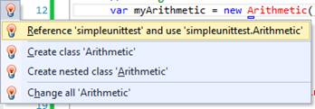

图 156:测试夹具代码中的 R#弹出菜单

如前所示，如果您选择第一个选项，R#将添加对项目的引用、`using`语句以及确保解决错误所需的任何其他内容。

一旦我们解决了这些链接，我们可以看到我们的测试代码现在应该可以运行了。

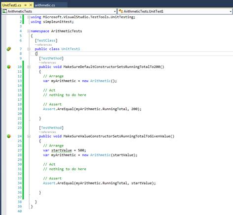

图 157:我们的测试夹具现在准备好了

如果我们点击测试顶部的双图标，我们就可以运行它们。让我们继续这样做:


图 158:点击双图标给出这个菜单

选择**全部运行**，然后过一会儿(取决于您机器的速度)，您应该会得到如下内容:

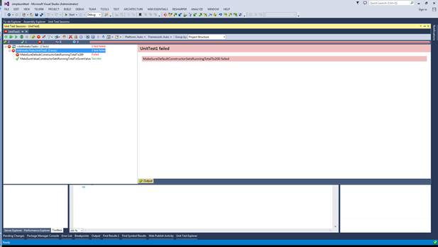

图 159:使用 R#测试运行程序运行新的测试会话

从图 159 中可以看出，我们的一个测试失败了。我们去看看为什么。如果你点击失败测试的名字，测试者会告诉你事情失败的确切原因。


图 160:我们失败测试的结果

从图 160 的报告中可以看出，结果是`0`，而它应该是`200`。如果我们看一下类中的默认构造函数，我们会很快发现原因。


图 161:我们的默认构造函数是空的

我们不在默认构造函数中初始化我们的运行总数；如果我们纠正这一点并将其添加到构造函数中:

```cs
    _runningTotal = 200;

```

然后重新运行我们的测试:

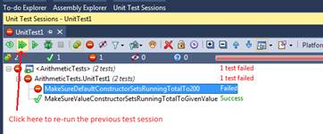

图 162:重新运行之前的测试会话

我们应该看到现在一切都过去了。


图 163:我们的测试现在成功了。

我们现在可以回到我们的测试项目，添加一个新的测试夹具。这次我们将测试在我们的运行总数中增加一个固定值`200`。我们将使用默认构造函数创建算术对象，因此开始时的运行总数应该是`200`。

在我们开始运行任何东西之前，我们可以看到有一个问题。

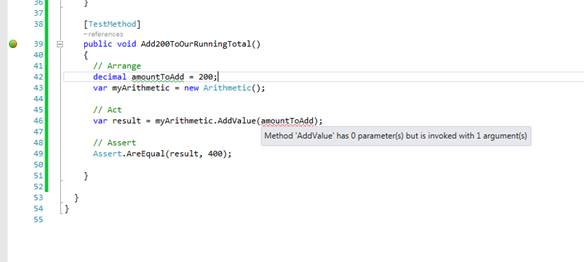

图 164:在我们尝试运行任何东西之前，我们可以看到一个问题

让我们先解决这个问题——如果我们不能编译东西，我们将无法运行我们的测试。

更改算术类中的`AddValue`方法，使其看起来如下所示:

```cs
          public decimal AddValue(decimal amountToAdd)
          {
            return 0;
          }

```

我们的测试设备现在应该没有错误，并且能够运行。如果您返回到您的测试会话窗口，您应该会看到 R#已经自动将新的测试夹具添加到 runner 窗口中。

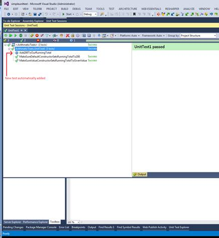

图 165:自动添加新测试的单元测试会话

和以前一样，如果您单击双箭头，测试应该全部运行，前面的两个测试仍然通过，新的测试失败。

同样，您将在测试运行程序会话窗口中看到测试失败报告。但是，如果您回顾一下您的测试夹具代码，您会发现左边距图标也发生了变化:

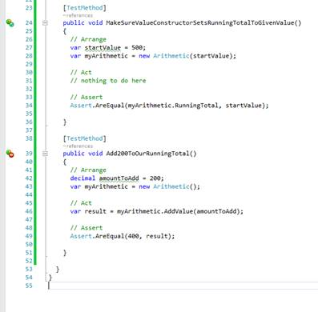

图 166:运行测试后的测试夹具代码

成功的测试旁边有一个绿色的小勾号，而失败的测试旁边有一个红色的小“禁止进入”标志，表示它们当前没有通过。

对集成开发环境的这一小小的改变意味着你可以让你的测试在后台运行，直接回去工作，知道当测试完成时，结果就在你面前，而不需要中断你正在做的事情，上下文切换到另一个任务。

这种即时的反馈意味着您可以继续完成您的测试覆盖，没有中断和停机时间。将它与以下默认键盘快捷键相结合:

*   Ctrl+U，L—运行解决方案中的所有测试。
*   Ctrl+U，Y—运行当前打开的测试会话。
*   Ctrl+U，U—重复上一次测试运行。

就像 R#中的其他地方一样，您可以用手操作键盘来节省时间并保持更高的工作效率。

当我们这样做的时候，单元测试资源管理器一直在悄悄地跟踪我们的测试覆盖率。

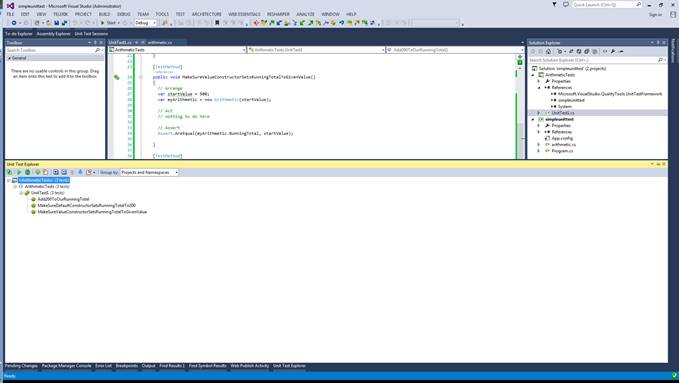

图 167: R#单元测试浏览器

您可以从这里运行您的测试，这将打开您当前的会话并触发一切。您可以导出测试列表，或者通过双击它们来导航到解决方案中的测试。可以把单元测试资源管理器想象成单元测试的文件管理器，允许你组织它们，并且一目了然地看到你所拥有的。

您可以通过单击单元文本浏览器工具栏上的**导出**图标，以文本、HTML 和 XML 格式导出您的测试。

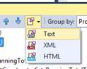

图 168:单元测试浏览器，导出图标

当您选择导出时，您会得到一个数据预览，允许您复制和粘贴数据，或者选择一个文件来保存它。

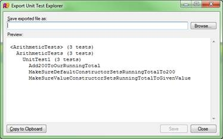

图 169:单元测试列表的文本导出

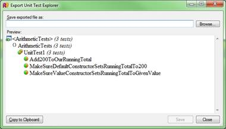

图 170:单元测试列表的 HTML 导出


图 171:单元测试列表的 XML 导出

您也可以在测试运行程序会话中执行相同的操作，以便将当前的测试覆盖率导出到另一个应用程序中。


图 172:当前单元测试运行

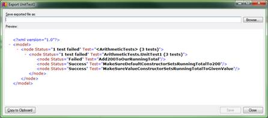

图 173:由图 172 中的运行产生的 XML 导出

获取项目单元测试的当前状态，并且能够将该数据合并到您自己的覆盖和管理系统中，这意味着您可以轻松地为项目经理和业务单元绘制测试覆盖和进度图，从而允许即时仪表板和其他工具对项目进行近乎实时的更新。

以 R#为伴的单元测试现在比以前更容易和更快了。这很好，因为它让你把注意力重新放在代码上，而不是管理方面。别被骗了——我在这里只介绍了用 C#创建测试。R#也对用 JavaScript 编写的测试给予了同等程度的细节和关注。

解决方案中的所有测试，无论使用何种语言，都出现在相同的窗口中，并且具有相同的左边距控件，用于即时运行和反馈。