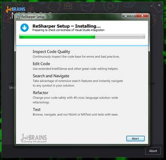
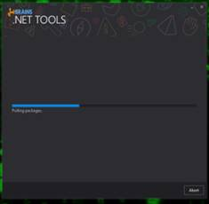
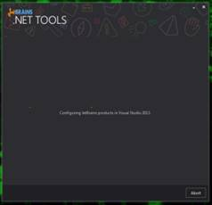
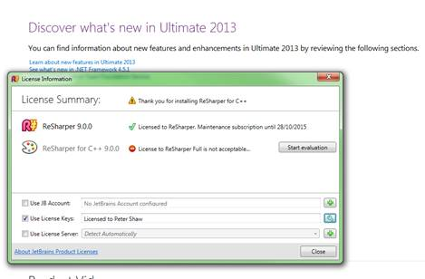
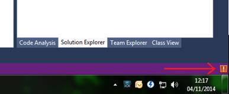
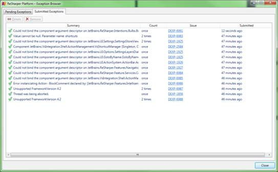
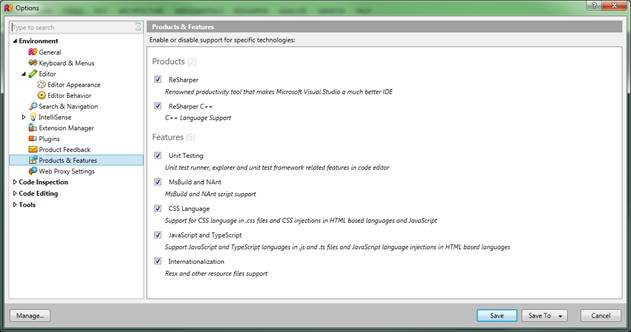
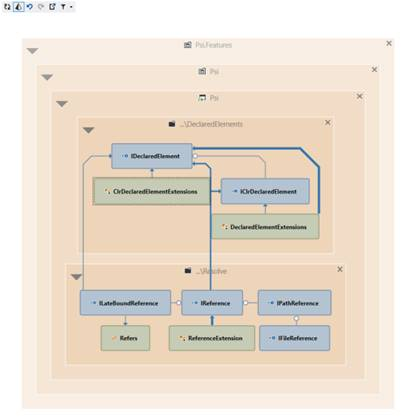
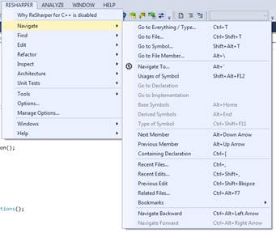
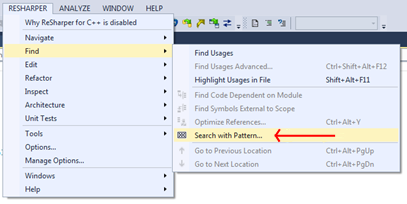

# 十一、ReSharper V9

任何开发软件的人都知道，事物不会为任何人静止不动，ReSharper 也不例外。

在写这本书的时候，我会定期咨询生产这款产品的公司 JetBrains，并根据他们的反馈采取行动，以确保我在这本书里包含的任何内容在技术上都是准确的，并以最好的方式反映出 ReSharper。

在这段时间里，我已经意识到版本 9 即将问世，当这本书真正到达你手中时，V9 很有可能成为稳定发布的版本。因此，我决定在书中增加一章，介绍 ReSharper 9 中将要发生的一些更重要的变化。

总的来说，我已经在书中记录的许多内容将继续按原样工作，或者以与当前版本非常相似的方式工作。本章中记录的更改是基于我对 JetBrains 早期访问计划的访问，虽然我最初打算重写书中的适当部分来覆盖新版本，但我觉得尝试并保持两个版本的良好覆盖，并帮助读者从 V8 过渡到 V9 是一个更好的策略。

### 新安装程序

最大的惊喜之一是新的安装过程。在新版本中，安装程序不仅仅安装 R#，它现在作为一个中心平台来安装 JetBrains 的许多产品。它还允许您在第一个屏幕上一眼就看到您有哪些开发产品，以及它们将安装在哪里。

图 181:新的 R# V9 安装程序

单击安装按钮和图标做出适当选择后，您就可以单击主安装按钮了。请注意，R# V9 现在包括对 C++的一级支持，作为一个独立的产品，而不是作为整个系统的集成。

图 182: R# V9 安装程序准备就绪

如果您安装的是旧版本的产品，将会自动为您卸载所有内容。

图 183:卸载旧产品的新安装程序

然后，新的安装程序将按照您的安装选择运行。

 

图 184:新的安装程序

新安装程序的一个好处是，它将在安装时检查您的 Visual Studio 环境，并在发现任何一般错误时通知您。

图 185:安装程序完成，它发现了一些你可能感兴趣的问题

首次安装并重新运行 Visual Studio 后，您可能会发现需要重新许可您的产品。您还会发现，除了需要新的许可证才能从 v8 迁移到 v9 之外，您还必须单独许可单个的 JetBrains 产品。

图 186:新的许可选项

在我的例子中，我有一个独立的许可证，只覆盖 R#，而不是 C++的 R#。

如果 R#在运行中有任何问题，那么任何问题、异常或其他问题都会记录在异常管理器中。

图 187: R# V9 异常管理器

如果您隐藏了图 187 中的对话框，您还会在 Visual Studio 状态栏中看到一条通知，指出有问题:

图 188:显示 R#有一些问题的状态警告

您可以在图 187 中的对话框中选择条目，然后直接将它们(有或没有帐户信息)提交给 JetBrains 开发团队，然后他们会对它们做出响应，使产品变得更好。

如果您正在运行 EAP 版本，像这样提交错误是非常重要的，因为它有助于在一般发布之前改进产品。

一旦您的例外提交审查，您应该会看到如下对话框，以确认提交状态:

图 189: R#异常，提交状态

### 对 R#选项的更改

R#选项对话框增加了很多新功能，包括现在可以在选项中搜索，而不必知道某个东西在哪里。

图 190:R # v9 选项对话框

如图 190 所示，现在在左侧的选项树上方有一个实时搜索框。出于演示目的，我输入了“在此搜索”，您可以看到 R#向我展示了它认为我正在寻找的最有可能的选项。

还对全局选项进行了新的更改，允许您启用和禁用单个特定功能组。

图 191:启用、禁用特定功能组的选项

在以前的 R#版本中，例如，如果您对 Razor 模板有问题，您必须在处理 Razor 代码时完全禁用 R#，然后在完成后再次启用它。借助新的模块化选项，您可以禁用特定模块，从而更好地微调您的 R#体验。

除了这里提到的选项，还有数量惊人的新代码格式选项、代码样式检查和其他新检查。

### 新键盘快捷键

主 Alt+Enter 键现在也可以用于搜索并直接转到 R#可用的操作。如果您在当前没有检测违规的线路上激活主密钥，您将看到操作搜索弹出窗口:

图 192: R# v9 操作搜索弹出窗口

该弹出窗口可用于在 R#的顶级菜单和工具上提供提示和搜索，R#实际上将建议您可能希望在当前行上运行的工具，这些工具可以帮助您执行您从未想过的任务。

这有点像在一段已经很棒的代码上运行工具，发现 R#已经查看了您的工作方式，并发现您可能希望执行与其他地方已经执行的操作类似的操作。

在可能的情况下，您还可以直接从 Alt+Enter 键盘组合快速访问顶级菜单，如果选择该菜单是光标所在的当前行上的适用选项的话。

### 其他改进

该团队目前正在开发的一个新特性叫做导航到公开 API。这个新的导航工具将搜索您的项目可以访问的任何应用编程接口(本地或远程)。这种搜索可以针对特定类型的对象执行，允许您将对象置于接口控制之下，并找到可用于消费和生成这些特定对象类型的方法。

如果您需要返回特定类型的对象，那么这个新的导航功能可以为您节省在第三方库中分析的时间，这些第三方库试图找到您需要完成一个月工作的难以捉摸的方法。

架构工具也得到了大规模扩展。新的依赖关系图格式将向您展示内部对象对外部对象的依赖程度:

图 193: R# v9 的新依赖层架构图

导航菜单现在有了一些强大的功能，允许你用最少的努力从代码中的一个地方到达任何其他地方。

图 194: R# v9 导航菜单

“查找”和“替换”选项现在支持对整个解决方案进行基于正则表达式的搜索:

图 195: R# v9 现在支持基于正则表达式模式的搜索

其中一些功能仍在开发中，因此无法在这一章中充分展示，但很明显，JetBrains 正在 ReSharper 产品线上继续创新和改进。