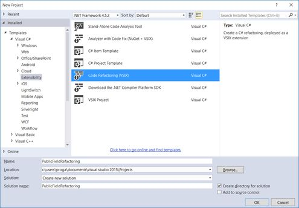
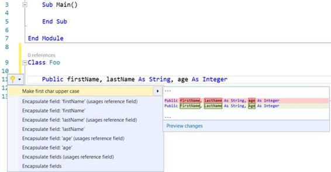

# 五、代码重构

重构代码意味着以更好的方式重组部分代码，而不改变原始行为。Visual Studio 2015 极大地增强了重构体验，改进了 C#中的工具，并首次引入了对 Visual Basic (VB)重构的支持。代码重构工具建立在。NET 编译器平台，就像代码分析器一样，您可以编写自己的特定于领域的重构，集成到灯泡中。在本章中，您将学习如何创建自定义重构，并重温您在[第 4 章](4.html#_Chapter_4_)中学习的许多技术。记住:语法可视化工具窗口永远是你最好的朋友。

当开发人员在一段代码上手动启用灯泡时，代码重构是可用的，例如，右键单击代码编辑器并选择快速操作。可用的重构取决于所选语法节点的类型。这与代码分析器不同，后者通过在代码编辑器中放置曲线并在“错误列表”窗口中提供信息来报告警告或错误消息。

您可以使用**代码重构(VSIX)** 项目模板创建代码重构，该模板在“新建项目”对话框中您选择的编程语言下的“扩展性”节点中可用(参见图 34)。这实际上是代码分析器的项目模板的相同位置。



图 34:创建代码重构项目

在许多情况下，代码重构非常适合。例如，您可以重写一段代码来提高可维护性和可读性，或者您可以在类定义中自动实现接口。

在本章中，您将学习如何创建针对公共字段的自定义重构，并检查标识符声明中的第一个字母是否大写。如果不是，重构提供了一种快速重写字段声明的方法，其中标识符的第一个字符是大写的。这对于解决[中的要求很有用。NET 框架设计指南](https://msdn.microsoft.com/en-us/library/ms229002(v=vs.110).aspx)，声明公共成员的标识符应该使用 Pascal 大小写符号来命名，其中第一个字符是大写的。

首先，使用**代码重构(VSIX)** 模板创建一个新项目，并将其命名为**公共领域重构**(见图 34)。

|  | 注意:与代码分析器项目不同，代码重构项目模板不会生成 NuGet 包。因此，发布代码重构的唯一默认方式是使用 VSIX 包。在[第 6 章“将分析器部署到 NuGet”](6.html#_Chapter_6_Deploying)中，您将了解到一些在 NuGet 包中包含代码重构的技巧。 |

创建代码重构项目时，Visual Studio 会生成两个项目:

*   实际的代码重构项目，这是一个可移植的类库。编译后的库将向开发工具(如 Visual Studio)公开自定义代码重构。与分析器一样，这种项目可以包含多个代码重构。
*   生成用于部署代码重构库的 VSIX 包的可扩展性项目。生成的 VSIX 包也部署到 Visual Studio 的实验实例中，用于调试目的。[第 7 章](7.html#_Chapter_7_Deploying)描述了如何通过将 VSIX 包发布到 Visual Studio Gallery 来与其他开发人员共享代码重构。

该项目包含一个针对类型名的重构示例，并提供了反转类型名中字符的功能。尽管它在现实场景中不是很有用，但对于教学目的来说，这肯定是有用的，所以值得看看代码。默认情况下，代码重构在 CodeRefactoringProvider.cs(或)中实现。vb)代码文件。这是一个常规的文件名，可以用更有意义的名称重命名；当您向单个项目添加多个代码重构时，通常会提供有意义的文件名。

|  | 提示:代码重构项目可以公开任意数量的自定义代码重构。如果要向当前项目添加其他代码重构，请在解决方案资源管理器中右键单击其名称，选择“添加”>“新项”，然后在“添加新项”对话框中，选择“扩展性”节点中可用的重构项模板。 |

代码重构是从`Microsoft.CodeAnalysis.CodeRefactorings.CodeRefactoringProvider`继承而来的一个类，它提供了通用的重构基础设施。这样的类必须用`ExportCodeRefactoringProvider`属性来修饰，这需要两个参数:代码重构所针对的语言和它的名称。代码重构的主要入口点是一个叫做`ComputeRefactoringsAsync`的异步方法，这是你实现重构逻辑的地方。您可以通过打开自动生成的 CodeRefactoringProvider.cs(或。vb)文件，并查看示例重构的实现，包括注释。在本章中，您将从头开始重写代码重构，忽略 Visual Studio 提供的示例。

在编写允许将公共字段中标识符的第一个字母替换为大写字母的代码重构之前，您需要了解需要使用哪个语法元素，这也是您使用语法可视化工具要做的事情。Visual Basic 和 C#使用不同的语法来表示字段声明，这一点很重要，因为两种语言的示例代码略有不同。

图 35 显示了 C#字段声明上的语法可视化工具，而图 36 显示了 Visual Basic 字段声明上的语法可视化工具。


图 35:c#中字段声明的语法表示


图 36:Visual Basic 中字段声明的语法表示

这些是目前最重要的考虑因素:

*   字段声明是字段声明语法节点，由两种语言中的`FieldDeclarationSyntax`类映射。
*   在 C#中，`FieldDeclarationSyntax`公开了类型为`VariableDeclarationSyntax`的名为`Declaration`的属性，该属性公开了名为`Variables`的属性，这是一个由`VariableDeclaratorSyntax`对象组成的集合，每个对象都表示字段中的标识符声明。
*   在 Visual Basic 中，`FieldDeclarationSyntax`公开了一个名为`Declarators`的属性，这是一个由`VariableDeclaratorSyntax`对象组成的集合，每个对象都表示字段中的标识符声明。

在 Visual Basic 中，需要迭代`FieldDeclarationSyntax.Declarators`属性，搜索任何以小写字母开头的标识符；在 C#中，需要以相同的目标迭代`FieldDeclarationSyntax.Declaration.Variables`属性。对于这两种语言来说，您需要一种方法来以适当的方式转换标识符名称，并且您需要创建和注册一个操作，类似于您在上一章中对代码修复所做的。

要创建一个动作，您需要调用`Microsoft.CodeAnalysis.CodeActions.CodeAction.Create`静态方法(与代码修复相同)并注册该动作，调用重构上下文实例公开的`RegisterRefactoring`方法。

代码清单 16 展示了如何实现`ComputeRefactoringAsync`方法。请注意，从现在开始，由于代码重用了[第 4 章](4.html#_Chapter_4_Writing)中描述的许多概念，因此我不会在文本中解释这些概念，但代码中添加了详细的注释来帮助您理解。

代码清单 16 (C#)

```cs
            public sealed override async Task
                ComputeRefactoringsAsync(
                CodeRefactoringContext context)
            {
                // Get the root syntax node
                var root = await context.Document.
                    GetSyntaxRootAsync(context.CancellationToken).
                    ConfigureAwait(false);

                // Find the node at the selection
                var node = root.FindNode(context.Span);

                // Convert the node into a field declaration
                var fieldDecl = node as FieldDeclarationSyntax;
                // If it's not public, return
                if (fieldDecl == null ||
                    fieldDecl.Modifiers.ToFullString().
                    Contains("public") == false) { return; }

                // Used to determine if an action must
                // be registered
                bool mustRegisterAction = false;

                // If at least one starting character is
                // lowercase, must register an action
                if (fieldDecl.Declaration.
                    Variables.Any(i =>
                    char.IsLower(i.Identifier.
                    ValueText.ToCharArray().First())))
                {
                    mustRegisterAction = true;
                }
                else
                {
                    mustRegisterAction = false;
                }

                if (mustRegisterAction==false)
                {
                    return;
                }

                // Create an action invoking a delegate passing
                // the document instance, the syntax node, and
                // a cancellation token
                var action =
                    CodeAction.Create("Make first char upper case",
                               c => RenameFieldAsync(context.
                               Document, fieldDecl, c));

                // Register this code action
                context.RegisterRefactoring(action);
            }

```

代码清单 16

```cs
    Public NotOverridable Overrides Async _
            Function ComputeRefactoringsAsync(
                     context As CodeRefactoringContext) As Task

            'Get the root syntax node
            Dim root = Await context.Document.
                GetSyntaxRootAsync(context.
                CancellationToken).ConfigureAwait(False)

            'Find the node at the selection
            Dim node = root.FindNode(context.Span)

            'Convert the node to a field declaration
            Dim fieldDecl = TryCast(node,
                FieldDeclarationSyntax)

            'If it's not public, return
            If fieldDecl Is Nothing Or fieldDecl.Modifiers.
                ToFullString.Contains("Public") = False Then
                Return
            End If

            'Used to determine if an action
            'must be registered
            Dim mustRegisterAction As Boolean

            'Iterate the variable declarators
            For Each declarator
                In fieldDecl.Declarators

                'If at least one starting character
                'is lowercase, must register an action
                If declarator.Names.Any(Function(d) _
                              Char.IsLower(d.Identifier.
                              Value.ToString(0))) Then
                    mustRegisterAction = True
                Else
                    mustRegisterAction = False
                End If
            Next

            If mustRegisterAction = False Then
                Return
            Else
                'Create an action invoking a delegate passing
                'the document instance, the syntax node, and
                'a cancellation token
                Dim action =
                    CodeAction.Create("Make first char upper case",
                               Function(c) RenameFieldAsync(context.
                               Document, fieldDecl, c))

                ' Register this code action
                context.RegisterRefactoring(action)
            End If
        End Function

```

下一步是为选定的字段声明生成一个新的语法节点，用第一个字母(现在是大写)提供更新的变量标识符。代码清单 17 演示了这一点。

代码清单 17 (C#)

```cs
            private async Task<Document>
                RenameFieldAsync(Document document,
                FieldDeclarationSyntax fieldDeclaration,
                CancellationToken cancellationToken)
            {
                // Get the semantic model for the code file
                var semanticModel =
                    await document.
                          GetSemanticModelAsync(cancellationToken).
                          ConfigureAwait(false);

                // Get the root syntax node
                var root = await document.GetSyntaxRootAsync();

                // Get a list of old variable declarations
                var oldDeclarators =
                    fieldDeclaration.Declaration.
                    Variables;

                // Store the collection of variables
                var listOfNewModifiedDeclarators =
                    new SeparatedSyntaxList<
                        VariableDeclaratorSyntax>();

                // Iterate the declarators collection
                foreach (var declarator in oldDeclarators) {
                    // Get a new name
                    var tempString =
                        ConvertName(declarator.Identifier.
                        ToFullString());

                    // Generate a new modified declarator
                    // based on the previous one but with
                    // a new identifier
                    listOfNewModifiedDeclarators =
                        listOfNewModifiedDeclarators.
                        Add(declarator.WithIdentifier(
                            SyntaxFactory.ParseToken(tempString)));
                }

                // Generate a new field declaration
                // with updated variable names
                var newDeclaration =
                    fieldDeclaration.Declaration.
                    WithVariables(listOfNewModifiedDeclarators);

                // Generate a new FieldDeclarationSyntax
                var newField = fieldDeclaration.
                    WithDeclaration(newDeclaration);

                // Replace the old syntax node with the new one
                SyntaxNode newRoot = root.
                           ReplaceNode(fieldDeclaration,
                           newField);

                // Generate a new document
                var newDocument =
                    document.WithSyntaxRoot(newRoot);

                // Return the document
                return newDocument;
           }

            // Return a new identifier with an
            // uppercase letter
            private string ConvertName(string oldName)
            {
                return char.
                       ToUpperInvariant(oldName[0]) +
                       oldName.Substring(1);
            }

```

代码清单 17

```cs
        Private Async Function _
            RenameFieldAsync(document As Document,
                             fieldDeclaration As FieldDeclarationSyntax,
                             cancellationToken As CancellationToken) _
                             As Task(Of Document)

            'Get the semantic model for the code file
            Dim semanticModel = Await document.
                GetSemanticModelAsync(cancellationToken).
                ConfigureAwait(False)

            'Get the root syntax node
            Dim root = Await document.GetSyntaxRootAsync

            'Get a list of old declarators
            Dim oldDeclarators =
                fieldDeclaration.Declarators

            'Store the collection of identifiers
            Dim listOfNewModifiedIdentifiers As _
                New SeparatedSyntaxList(
                Of ModifiedIdentifierSyntax)
            'Store the collection of declarators
            Dim listOfNewModifiedDeclarators As _
                New SeparatedSyntaxList(
                Of VariableDeclaratorSyntax)

            'Iterate the declarators collection
            For Each declarator In oldDeclarators
                'For each variable name in the declarator...
                For Each modifiedIdentifier In declarator.Names
                    'Get a new name
                    Dim tempString =
                        ConvertName(modifiedIdentifier.
                        ToFullString())

                    'Generate a new ModifiedIdentifierSyntax based on
                    'the previous one's properties but with a new Identifier
                    Dim newModifiedIdentifier As _
                        ModifiedIdentifierSyntax =
                        modifiedIdentifier.
                        WithIdentifier(SyntaxFactory.
                        ParseToken(tempString)).
                        WithTrailingTrivia(modifiedIdentifier.
                        GetTrailingTrivia)

                    'Add the new element to the collection
                    listOfNewModifiedIdentifiers =
                        listOfNewModifiedIdentifiers.
                        Add(newModifiedIdentifier)
                Next
                'Store a new variable declarator with new
                'variable names
                listOfNewModifiedDeclarators =
                    listOfNewModifiedDeclarators.Add(declarator.
                    WithNames(listOfNewModifiedIdentifiers))

                'Clear the list before next iteration
                listOfNewModifiedIdentifiers = Nothing
                listOfNewModifiedIdentifiers = New _
                    SeparatedSyntaxList(Of ModifiedIdentifierSyntax)
            Next

            'Generate a new FieldDeclarationSyntax
            Dim newField = fieldDeclaration.
                WithDeclarators(listOfNewModifiedDeclarators)

            'Replace the old declaration with the new one
            Dim newRoot As SyntaxNode =
                root.ReplaceNode(fieldDeclaration,
                                 newField)

            'Generate a new document
            Dim newDocument =
                document.WithSyntaxRoot(newRoot)

            'Return the new document
            Return newDocument
        End Function

        'Return a new identifier with an
        'uppercase letter
        Private Function _
            ConvertName(oldName As String) As String
            Return Char.
                ToUpperInvariant(oldName(0)) &
                oldName.Substring(1)
        End Function

```

如您所见，您已经重新使用了在[第 4 章](4.html#_Chapter_4_Writing)中获得的技能来创建新的语法元素来更新字段声明语法节点。您看到的一个新内容是如何在不使用`SyntaxFactory`类的情况下创建特定于 Roslyn(如`SeparatedSyntaxList`)的集合实例。

测试和调试代码重构就像测试和调试代码分析器一样，所以您只需要确保。选择 vsix 项目作为启动项目，然后按 F5。代码重构库将被部署到 Visual Studio 的实验实例中，并为您的测试做好准备。当然，您绝对可以使用您已经知道的调试工具。图 37 展示了定制重构如何在 Visual Basic 中的字段声明上工作(您在 C#中得到相同的结果)。



图 37:测试代码重构

定制代码重构肯定会改善编码体验，不仅因为它们允许以更好的方式重组部分代码，还因为它们可以简化编程模式的实现。作为一个例子，假设您想要提供一个重构，在模型-视图-视图模型模式的实现中自动生成`RelayCommand`和`ViewModelBase`类。您可以创建代码重构，通过添加模式实现所需的语法节点来重写类的语法树。

|  | 提示:你可以看看我在 GitHub 上创建并发布的一个开源项目，名为[dotnetanalyzer](https://github.com/alessandrodelsole/dotnetanalyzers)。其中，这个项目在 VB 和 C#中都有代码重构，可以自动生成实现 MVVM 模式的类。 |

## 章节总结

重构代码意味着在不改变原始行为的情况下，以更好的方式重组部分代码。在本章中，您看到了如何创建与 Visual Studio 的快速操作相集成的自定义代码重构，看到了如何使用语法可视化工具来确定需要编辑的语法节点，了解了代码重构的架构，并尝试了实现重构逻辑的基础。最后，您看到了如何在本地测试和调试代码重构。到目前为止，您已经学习了许多关于。NET 编译器平台，现在您拥有了自己创建代码分析器和重构所需的技能。但是，您只在本地使用了自己的工作成果。Roslyn 的最大好处是代码分析器和重构可以与其他开发人员共享。这将在接下来的两章中讨论。