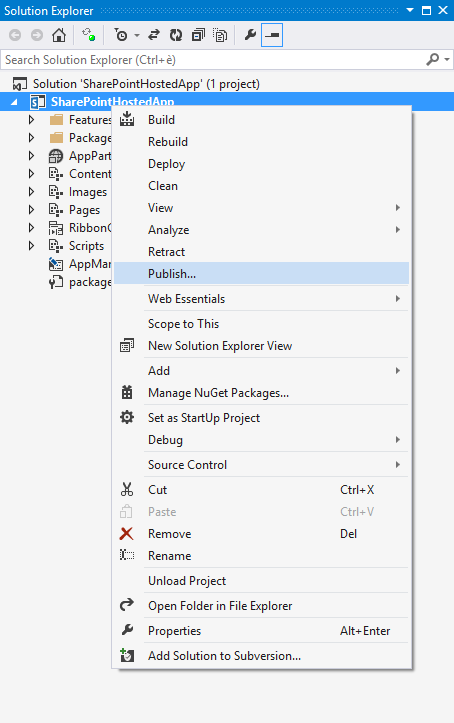
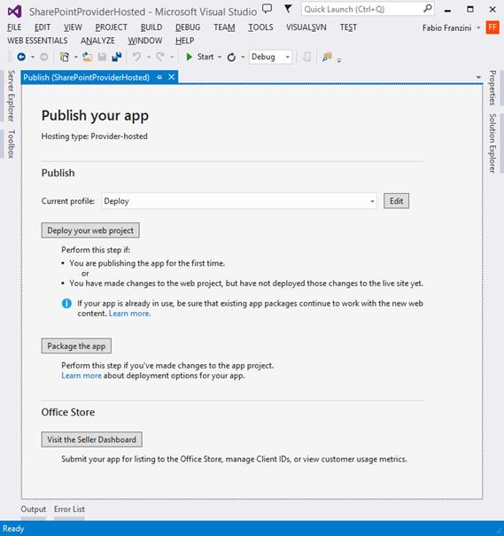
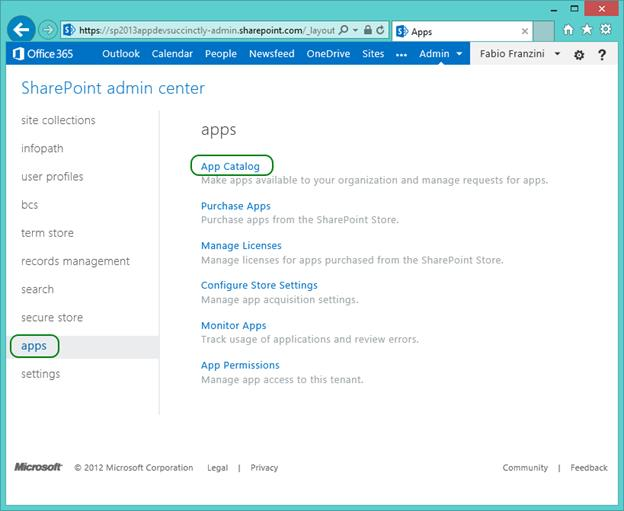
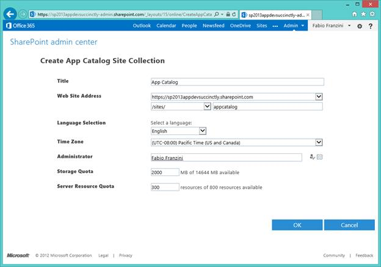
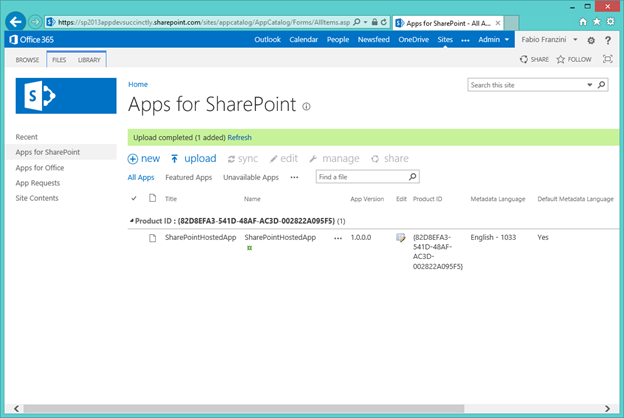

# 十一、应用部署

## 简介

一旦我们创建了我们的 SharePoint 应用程序，我们需要决定如何发布它们，以使它们可用于安装。

我们有两个选择，这取决于我们是否想要公开我们的应用程序。我们可以使用名为“应用程序目录”的私人商店，或者使用由微软创建的名为“办公商店”的商店，所有 SharePoint 用户都可以通过互联网访问该商店。

无论是哪种情况，我们都需要生成文件。通过 Visual Studio 提供的发布过程。

## 出版

首先要做的是通过 Visual Studio 在项目中提供的发布过程生成应用程序，如图 43 所示。

图 43:应用发布

根据我们创建的应用程序的类型，将会请求不同的信息。

### SharePoint 托管

在这种情况下，发布过程要求我们只构建应用程序包。

图 44:发布 SharePoint 托管的应用程序

### 提供者托管

在这种情况下，该流程包括创建一个新的发布配置文件部分，我们将被要求提供有关客户端标识和客户端机密的信息，这些信息将用作 SharePoint 中的应用程序标识符:

图 45:发布 SharePoint 托管的 1

一旦我们创建了概要文件，我们就可以发布到 web 并生成应用程序:

图 46:发布 SharePoint 托管的 2

## 应用目录

如前所述，应用程序目录是 SharePoint 中的一个私有应用程序存储。
从技术上讲，它是一个包含两个主要库的网站集:

*   SharePoint 应用程序:SharePoint 应用程序
*   办公应用:2013 年的办公应用

每个库包含许多列，其目的是描述应用程序本身，以便应用程序的基础设施可以允许安装相同的内容。它显示用户的信息，如标题、描述等。

要创建应用程序目录，我们可以在内部环境中或 Office365 上的 SharePoint 管理门户中访问管理中心，如图 47 所示。

图 47:应用程序设置

在这种情况下，我们创建一个新的应用程序目录，并设置设置以创建与之匹配的网站集:

图 48:创建新的应用程序目录设置

一旦我们完成了这项工作，我们还有一个新的站点，可以在其中管理我们在 SharePoint 中提供的所有应用程序的目录:

图 49: SharePoint 应用程序目录

通过单击“为 SharePoint 分发应用程序”，我们可以访问包含应用程序的库:

图 SharePoint 库的应用程序

完成后，部署的应用程序将可供用户安装。

## 写字楼

通过在 Office Store 中发布应用程序，我们让我们的应用程序面向全世界。

发布应用的第一件事是在卖家仪表板中创建一个账户。只需到微软[卖家仪表盘](https://sellerdashboard.microsoft.com/registration)输入所有需要的信息。

您可以创建两种类型的帐户:

1.  私人:用于创建与公司无关的账户。
2.  公司:创建链接到公司的帐户。

创建帐户后，您将能够发布应用程序。

在向公众开放之前，该应用程序将接受一个审批流程，该流程将验证一组必须遵守的规则，这些规则在门户网站中进行了标识。

如果验证成功，该应用将被发布。如果没有，该地址将被发送到您的帐户，并附带一份详细说明验证失败的报告。

## 总结

在这一章中，我们学习了如何为 SharePoint 发布应用程序，以及创建一个私有商店，当我们想要在公司内部发布应用程序或在微软的公共商店上发布应用程序时，该商店非常有用。