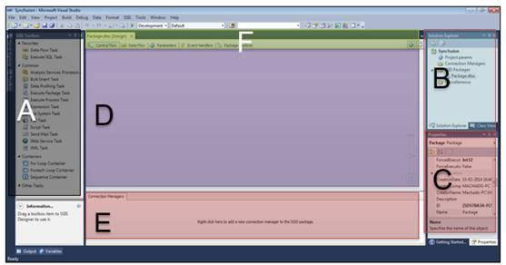

# 一、集成服务架构

## 简介

微软的商业智能套件是一个由相互连接的工具和平台组成的非常复杂的系统，负责管理数据、转换数据、将其交付给数据仓库，并从许多不同的角度对其进行可视化，以便决策者能够获得他或她需要的信息。每个平台都很复杂，需要深入了解它们是如何工作的。

本章将带您了解集成服务体系结构及其所有组件的概述，以便您了解它们之间的交互方式，以及作为开发人员，您对这些组件的期望。让我们看一下集成服务体系结构的主要组件。下图显示了微软用来描述集成服务体系结构的图表。

图 1:集成服务架构

## 解释组件

现在，让我们仔细研究一下体系结构的每一个组件，以便为您提供一个概述，在接下来的章节中将对其进行深入的解释。

运行时引擎负责根据我们的需要执行处理数据的包。从上图中可以看出，它是 SSIS 的心脏，因为它不仅执行包，还保存它们的布局，并为日志记录、断点、配置、连接和事务提供支持。每当我们调用包执行时，这个引擎就会被激活，这可以从命令行、PowerShell 脚本、SSIS 设计器、SQL 代理工具甚至自定义应用程序中完成。

集成服务服务是一种用于管理集成服务包的 Windows 服务，仅在 SQL Server 管理工作室中可用。它使开发人员能够导入和导出包、查看正在运行的包以及查看存储的包。它还允许您使用 SQL Server Management Studio 来监视正在运行的集成服务包并管理包的存储。

SSIS 设计师是您开发软件包时花费大部分时间的地方。SSIS 设计器是一个图形工具，您可以使用它来创建和维护集成服务包。作为集成服务项目的一部分，SQL Server 数据工具(SSDT)中提供了 SSIS 设计器。您可以使用它来执行以下任务:

*   开发包中的控制流。
*   在包中开发数据流。
*   向包和包对象添加事件处理程序。
*   查看包内容。
*   在运行时，查看包的执行进度。

### 日志提供程序

由 SSIS 引擎管理，日志提供者的职责是创建监控包执行所需的所有日志。每次运行包时，日志提供程序都会写入包含包执行信息的日志，包括持续时间、错误、警告和其他相关信息。

### 连接管理器

由 SSIS 引擎管理，连接管理器的职责是管理在项目级或包级定义的连接。这是 SSIS 设计器中的一个工具，因此您可以创建提取和加载数据所需的连接。它可以管理到 FTP 服务器、数据库、文件和网络服务的连接。SSIS 连接管理器允许您轻松连接到几种类型的系统，包括微软和非微软平台。

### SSIS 巫师

SSIS 向导是创建将数据从源复制到目标的集成服务包的最简单方法。使用此向导时，您只能使用一种类型的任务。

### 包装

包装是发动机的心脏；换句话说，它们是 SSIS 引擎的主要组件，也是子系统，因为它们由其他几个工件组成。因此，这些包将使用连接管理器连接到源和目标。它们包含我们需要运行的任务，以便完成整个 ETL 步骤序列。正如您在架构图(图 1)中所看到的，这些包任务可以单独执行、按顺序执行、分组在容器中执行或者并行执行。包是我们的集成服务项目的输出，并且具有。dtsx 扩展。

### 任务

任务是定义在包控制流中执行的工作单元的控制流元素。SSIS 包由一个或多个任务组成。如果包包含多个任务，则它们通过优先约束在控制流中进行连接和排序。SSIS 提供了一些与大多数问题相对应的现成任务；但是，它也允许您开发和使用自己的自定义任务。

### 事件处理程序

由 SSIS 运行时引擎管理，事件处理程序的职责是仅在触发特定事件时执行任务，例如，当发生错误时引发 OnError 事件。您可以为这些事件创建自定义事件处理程序，以扩展包功能，并使包在运行时更容易管理。

### 容器

容器是 SSIS 的对象，为包提供结构，为任务提供服务。它们支持在包中重复控制流，并将任务和容器分组到有意义的工作单元中。除了任务之外，容器还可以包含其他容器。有四种类型的容器:

*   任务主机容器(封装单个任务)
*   对于循环容器
*   Foreach 循环容器
*   序列容器

### 控制流程

所描述的最后四个任务定义了 SSIS 运行时引擎中的可执行文件。包、容器、任务和事件处理程序是它将在运行时执行的内容。如果只看最后三个(容器、任务和事件处理程序)，它们也被称为控制流任务，因为它们定义了包的控制流。这样，包将只有一个控制流和许多数据流，我们将在后面看到。

控制流是一个包的大脑；它为所有组件编排执行顺序。组件在其中由优先约束控制。

### 数据流引擎

虽然我们已经讨论了运行时引擎、包以及如何开发控制流，但是我们还没有讨论如何定义数据移动和转换。这是因为这不是 SSIS 运行时引擎的责任。相反，这是数据流引擎的责任，也称为管道引擎。

该引擎封装在数据流任务中，数据流任务是 SSIS 运行时引擎及其任务组件的一部分。数据流引擎提供将数据从源移动到目标的内存缓冲区。它调用从文件和关系数据库中提取数据的源。数据流引擎还管理修改数据的转换，以及加载数据或使数据对其他进程可用的目的地。集成服务的数据流组件是集成服务中包含的源、转换和目标。您还可以在数据流中包含自定义组件。

正如我之前所说的，一个包只能有一个控制流，在这个控制流中，您可以添加任意多的数据流任务。

### 项目和包部署模型

你应该知道 SSIS 的一个重要细节。SSIS 2012 为您提供了两种类型的软件包部署。第一种类型是遗留部署模型，其中每个包都被视为单个部署单元。第二种类型是项目部署模型，它创建一个部署包，在一个文件中包含部署所需的所有内容(包和参数)。参数的使用仅限于项目部署模型。因此，如果您想要使用参数，您应该知道您将需要使用项目部署模型。这两种模型将在与包部署相关的章节中讨论和演示。

## 开发者环境

### 简介

集成服务开发人员环境是在 Visual Studio 之上创建的。在 SQL Server 2012 中，该环境被命名为“SQL Server 数据工具-面向 Visual Studio 2012 的商业智能”。开发包会让你觉得很熟悉。在日常工作中使用 Visual Studio 的 NET 开发人员；然而，集成服务包的外观和感觉将会有很大的不同，因为它是一个更加可视化的开发环境。

要创建集成服务项目，请打开 SQL Server 数据工具。打开后，选择**文件** > **新建** > **项目**，当新项目窗口出现时，选择**商业智能**，在其下选择**集成服务**。当您选择它时，将显示以下屏幕。

图 2:新的集成服务项目

如您所见，有两种不同的项目类型:

*   集成服务项目
*   集成服务导入项目向导

正如它们的名字所暗示的，它们之间的区别在于第一个将创建一个空项目，在其中您可以开始构建您的 SSIS 包。第二个将允许您导入现有的 SSIS 项目并继续您的开发。对于我们的示例，我们将始终使用第一个项目类型，集成服务项目。

现在，选择**集成服务项目**，并设置其名称、位置和解决方案名称。正如我已经提到的，这与任何其他基于 Visual Studio 的项目非常相似。一旦你点击**确定**，SSIS 设计师将会打开，这是你所有开发的地方。欢迎来到集成服务世界。

### SSIS 设计师

在 SSIS 设计器中，您可以创建包含控制流和数据流的所有包。您可以使用 SSIS 设计器拖放您想要使用的组件，然后配置它们。在创建我们的第一个包之前，让我们看一下设计器。

图 3: SSIS 设计师

正如你在上图中看到的，我把 SSIS 设计师分成了六个不同的区域。这六个区域代表了您在开发包时将要使用的工具和选项。以下列表描述了六个领域:

1.  **SSIS 工具箱**—这是你可以找到可用工具的地方。显示的工具将取决于您是在控制流选项卡还是数据流选项卡中。当您在“控制流”选项卡中时，您将有任务。当您在“数据流”选项卡中时，您将有转换选项。
2.  **解决方案资源管理器**—这里可以找到所有的项目工件，包括项目连接管理器、包和项目参数。
3.  **属性窗口**—同样，与任何其他基于 Visual Studio 的项目一样，该窗口显示当前选定对象的所有可用属性。
4.  **设计窗口**—这是你开发流程的地方。首先从 SSIS 工具箱中拖动一个对象，然后将它放到这个设计窗口中。将该项添加到此设计器后，您可以对其进行配置，并将其连接到您添加的下一个组件。此窗口显示所有包控制流及其所有数据流。
5.  **包连接管理器**—这是您创建和查看仅限于该包的连接管理器的地方，该包不能被任何其他包使用。
6.  **包选项卡式工具栏**—这允许您在控制流、当前选定的数据流(即使如此，您也可以在数据流设计窗口内更改当前选定的数据流)、包参数、包事件处理程序、包资源管理器和进度选项卡之间导航，以查看包执行日志信息。

正如微软建议的那样，重要的是要记住，SSIS 设计者不依赖于集成服务，即管理和监控包的服务。另外，在 SSIS 设计器中创建或修改包不需要运行服务。但是，如果您在 SSIS 设计器打开时停止服务，您将无法再打开 SSIS 设计器提供的对话框，并且您可能会收到错误消息“RPC 服务器不可用”。

要重置 SSIS 设计器并继续使用包，您必须关闭设计器，退出 SQL Server 数据工具，然后重新打开 SQL Server 数据工具、集成服务项目和包。