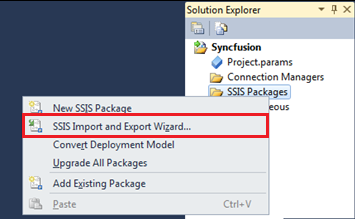
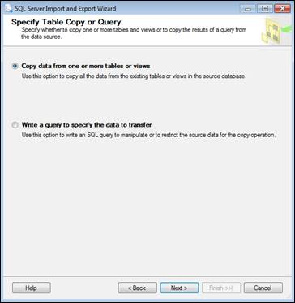
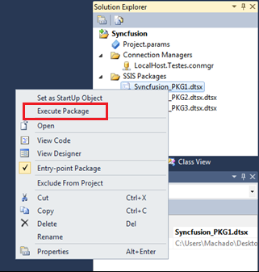
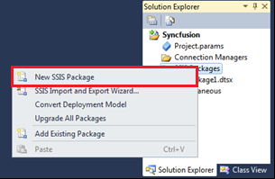
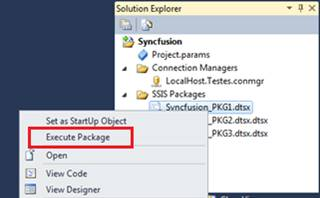
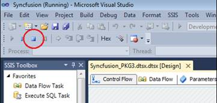
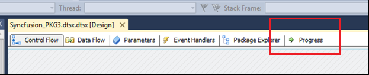
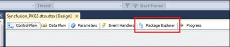
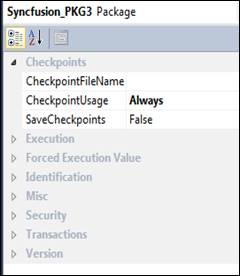

# 二、包

## 简介

包是集成服务项目的输出；它们是为了处理 ETL 任务而要运行的可执行文件。包的最佳定义是将它定义为连接、控制流元素、数据流元素、事件处理程序、变量、参数和设置的集合，您可以使用 SQL Server Integration Services 提供的图形设计工具或通过编程方式进行构建。

这些任务将使用 SSIS 设计器整合在一起；使用箭头连接它们是一个非常简单的过程。但是，在内部，集成服务引擎将使用优先约束来不仅将任务连接在一起，而且管理它们的执行顺序。引擎根据每个任务中发生的事情或者根据包开发人员定义的规则来完成这项工作。

这是包的基本定义。重要的是要理解包开发不仅仅是添加任务。完成包后，您可以添加高级功能，如日志记录和变量，以扩展包功能。当您完成包开发时，需要通过设置实现安全性的包级属性、启用从检查点重新启动包或在包工作流中合并事务来配置它们。

包输出文件将具有。dtsx 文件扩展名，其中包含一个 XML 结构，包含为满足开发人员的需求而需要执行的所有操作。与其他类似。NET 项目中，基于文件的代码是使用开发环境标记的。然后可以将其保存并部署到 SQL Server，以便您可以安排其执行。然而，这不是执行这些包的唯一方法。例如，您可以使用 PowerShell 脚本来获得相同的结果，甚至可以使用 SSIS 数据库存储过程。

## Hello World 包—导入和导出向导

尽管我们将使用 SSIS 设计器创建包含所有控制流任务和数据流转换的自定义包，但 SSIS 附带了一个导入和导出向导，可帮助创建简单的“从源到目标”包。该向导允许您配置源、目标以及其他几个复制数据的选项。关于此向导的一个重要注意事项是，运行此包时将创建目标表；但是，正如您将在以下步骤中看到的，您还将能够配置“删除”和“创建”(重新创建)操作。

|  | 注意:您可以使用“运行”窗口并键入“DtsWizard”来打开导入和导出向导。 |

虽然向导可以从 SSIS 设计器外部打开，但我们将在 SSIS 设计器内部使用它来创建第一个“Hello world”包。为此，右键单击解决方案资源管理器中的 **SSIS 包**，并选择选项 **SSIS 导入和导出向导**，如下图所示。

图 4:打开导入和导出向导

单击后，SSIS 将显示导入和导出向导的第一个屏幕。这只是一个简单的信息屏幕；你要点击**下一步**开始这个包的配置。

在下面的屏幕中，您需要配置要从中检索数据的源数据库。您只需要设置包的数据源(在我的示例中，它将是 SQL Server)、服务器名称(在我的示例中，它将是“localhost ”,但您可以使用“”或“(本地)”来标识本地主机)、身份验证类型(在我的示例中，将是 Windows 身份验证)和源数据库。下图显示了我的示例的配置。

图 5:配置源

单击**下一步**后，将出现一个类似的屏幕，提示您配置目标数据库。您应该为源代码进行相同的配置，然后单击**下一步**。

图 6:选择如何从源中检索数据

现在最重要的一步来了。这一步是当您决定如何从源中检索数据时，可以直接从表或视图中检索，也可以编写自己的查询。两者之间的选择不是线性的。但是，根据我的经验，我可以建议您将检索逻辑保存在存储在数据库和包中的视图中，以便从包中检索数据。

图 7:检索数据的查询

这样，如果目标数据库发生变化，您可以动态地更改视图，例如，更改列的格式。您甚至可以对它们应用转换(使用 SQL 函数)，而不必更改、保存和重新部署您的包。

在我们的示例中，我们将选择第二个选项:编写一个简单的查询，只从源表中检索两列。同样，这不是最佳实践，因为如果某些目标列发生了变化，我需要打开包，更改查询，保存并重新部署它。不过，对于这个简单的《Hello World》来说，不会是什么问题。

完成此步骤后，点击**下一步**，将显示一个新屏幕。此屏幕允许您选择要复制到目标数据库的表和视图。因为我们已经创建了一个自定义的 SQL 查询，所以您只有一个选项(如下图所示，它是一个“query”对象)。

图 8:选择要复制的表和视图

选择完要复制的表格和视图后，点击**下一步**。然而，在此之前，探索一下这个屏幕中的一些有趣选项是值得的。如上图所示，有两个重要的按钮:预览，允许您查看正在复制的数据，以及编辑映射，我们将在后面进一步详细讨论。如果您点击**编辑映射**按钮，您将看到以下屏幕。

图 9:列映射

如果您像我一样选择使用 SQL 查询检索数据，向导将只允许您在目标数据库中创建一个新表，因为它假设查询列中没有任何数据。但是，您有两个可用的复选框。第一个复选框是“删除并重新创建目标表”，如果目标表已经存在，它将重新创建目标表。这是一个危险的选择，因为无论你是否知道它的存在，它都将丢弃该表。第二个复选框是“启用身份插入”，允许在身份字段中插入值。这样，准确的标识值就会从源数据库移动到目标表。

您还可以通过编辑映射网格来编辑目标表的列名和类型(在此屏幕中也可用)。设置好所有设置后，点击**确定**。在“选择源表和视图”窗口中，单击**下一步**。

此页面是导入和导出向导的最后一步。您将能够查看所有配置。如果一切正常，点击**下一步**生成包。

图 10:生成包

现在，该包将在解决方案资源管理器中可用。您可以通过右键单击包并选择**执行包**来尝试运行它。就这样！您刚刚创建了第一个包。接下来，我们将学习如何创建具有更多逻辑和转换的定制包。

图 11:执行包

## 定制包装

### 简介

虽然导入和导出向导对于简单的 ETL 作业来说是一个非常强大的工具，但是在大多数情况下，当使用集成服务时，您将需要更复杂的结构，其执行逻辑不仅仅涉及单个数据流。您可能需要执行 SQL 查询来创建支持表，在过程中出现问题时发送电子邮件，进行几次数据转换，甚至处理多个数据源来创建单个插入。通过使用导入和导出向导，您只使用了集成服务功能的一小部分。

下面几章将向您展示 SSIS 如何使用一些现成的、可重用的组件轻松地成为您在提取、转换和加载操作方面的好朋友。这些组件将为您节省大量时间，并允许您维护和发展您的项目。重要的是要理解，SSIS 提供的大多数开发逻辑都可以使用 SQL 查询和编程语言(如 C#或 PowerShell)来实现(需要付出相当大的努力)。然而，SSIS 的美妙之处在于，无需开发一行代码，您就可以创建出色的面向数据的解决方案，而不会浪费时间思考如何实现算法。您只需要关注最重要的事情:使用非常友好的设计环境，创建易于维护和理解的稳定解决方案。

### 向项目添加新包

要向我们的集成服务项目添加新包，请右键单击解决方案资源管理器中的 **SSIS 包**文件夹，然后选择**新建** > **SSIS 包**。这将创建一个空白包，供您开发。

图 12:新 SSIS 套餐

这将自动向项目中添加一个新包，该包在解决方案资源管理器中可见并具有默认名称。要在包添加到项目后更改包名，右键单击包并选择**重命名**。

图 13:重命名包

向项目中添加新包后，您需要配置控制流。虽然开始定义包的所有控制流任务并不是强制性的，但是您只能在向包中添加数据流任务后开始开发转换逻辑。这样，在向项目添加新包后，控制流是您将看到的第一个组件。要打开新添加的包，只需在解决方案资源管理器中双击它们。

### 执行包

在集成服务中执行包非常容易。你有几种选择。第一个也是更容易看到的选项是点击工具栏上的**播放**按钮图标，如下图所示。

图 14:执行项目

第二个选项是使用解决方案资源管理器。可以右键点击要执行的包，然后选择**执行包**，如下图所示。这是最常用的技术，因为当您单击**播放**时，SQL Server 数据工具将创建整个项目的新版本，并在调试模式下运行其中的每个项目。执行后，它会让执行窗口保持打开，以便您可以评估执行步骤。通过选择**执行包**，您将只运行您想要的包。

图 15:执行包

一旦执行结束，您需要停止调试模式以返回开发环境。通过点击工具栏中的**停止调试**来完成。

图 16:停止调试

包执行选项的最后一个组件是一个名为“执行进度”的窗口，它允许您查看包执行的日志结果，包括出错时的错误，或者如果一切执行正确，则只显示执行时间和步骤。您可以通过单击运行软件包后显示的**进度**选项卡来访问此窗口。下图显示了“进度”选项卡的位置。

图 17:查看执行结果的进度选项卡

该窗口将向您显示一个分层结构，显示包中的所有对象及其所有执行结果。您可以看到开始日期、结束日期、错误消息和其他日志消息，这些消息可用于评估是否一切正常。下图显示了一个执行结果示例，其中使用了一个执行 SQL 任务来创建一个表，但显示了一个错误，指出该特定表已经存在于目标数据库中。

图 18:执行进度

当你试图阅读完整的信息时，你可能会遇到一些困难。如果您这样做了，您可以将消息复制并粘贴到外部文本编辑器中，并在那里对消息进行详细评估。

## 包浏览器

包资源管理器是一个非常有用的工具，可以获得包中所有对象的概述。通过其分层视图，您可以在所有设计窗格及其所有任务、连接、容器、事件处理程序、变量和转换之间导航。它基本上总结了您的开发，并允许您轻松地在所有对象的属性之间导航和更改它们。

要访问包资源管理器，请打开一个包，单击**包资源管理器**选项卡，并展开要编辑的对象。或者只是按照单一视图的结构。

图 19:包浏览器选项卡

打开包资源管理器后，您将看到分层视图，其中显示了您添加到控制流和数据流中的各种对象。

图 20:包浏览器

## 包属性

像在基于 Visual Studio 的解决方案中单击的任何其他对象一样，当您在集成服务设计环境中打开包时，由于该对象获得了集成开发环境的焦点，因此“属性”窗口将反映该特定对象的属性。在这种情况下，这些是包。这些属性允许您更改包名称和版本等基本属性，但也允许您添加密码等重要属性来执行包。

在本节中，我将指导您分析集成服务中包的每个属性，以便您能够理解它的重要特性。首先要澄清在哪里可以找到这些属性。因此，首先打开一个包，然后查看“属性”窗口。下图显示了包属性。

图 21:包属性

从上图中可以看出，包属性分为八组:

*   检查站
*   执行
*   强制执行值
*   识别
*   混杂的
*   安全
*   处理
*   版本

在解释每组属性之前，有一个我无法避免讨论的重要话题，那就是检查点。激活后，检查点会强制 SSIS 维护已成功运行的控制流可执行文件的记录。此外，SSIS 记录了用户定义变量的当前值。当前上下文将存储在一个 XML 文件中，该文件在包属性窗口中定义。之后，如果包在执行过程中失败，当您尝试重新运行包时，SSIS 将引用检查点文件。它将首先通过检索包失败前存在的当前变量值来实现这一点，并基于最后一个成功运行的可执行文件，从它停止的地方开始运行包。也就是说，假设我们已经首先解决了导致失败的问题，那么它将从失败点开始继续执行。

我在这一部分的目标不仅仅是教你如何应用这些属性，以及如何在你的场景中使用它们——我的目标是教你它们的存在。这样，当一个特定的问题出现时，你就会知道它的来源。以下各节将帮助您了解哪些属性存在以及存在的原因。

### 检查站

*   检查点文件名—检查点上下文值的文件名。该文件在包成功运行后被删除。
*   检查点使用—告知何时应该使用检查点文件(始终、从不或文件是否存在)。
*   保存检查点—允许您启用和禁用检查点。

### 执行

*   延迟验证—指示包验证是否延迟。
*   禁用—指示包是否已禁用。
*   DisableEventHandlers—指定包事件处理程序是否运行。
*   失败包失败—指定如果包任务中出现错误，包是否失败。
*   失败父容器错误-指定如果子容器中出现错误，父容器是否失败。
*   MaxConcurrentExecutables—包可以并发运行的可执行文件的数量(-1 表示没有限制)。
*   最大错误数—包停止运行前可能发生的最大错误数。
*   PackagePriorityClass—包线程的 Win32 线程优先级类。

### 强制执行值

*   ForcedExecutionValue—如果 ForceExecutionValue 设置为 True，则该值指定包返回的可选执行值。
*   ForcedExecutionValueType—ForcedExecutionValue 的数据类型。
*   ForceExecutionValue—一个布尔值，它指定是否应该强制容器的可选执行值包含特定值。

### 识别

*   creation date—包的创建日期。
*   CreatorComputerName—开发软件包的计算机。
*   创建者名称—包开发人员的名称。
*   描述—包功能的描述。
*   标识—创建包时分配的包 GUID。此属性是只读的。
*   名称—包名称。
*   包类型—包类型。

### 杂项

*   配置—包配置(仅适用于包部署方法)。
*   表达式—为包创建表达式。允许您基于属性或参数设置属性。
*   强制执行结果—包的执行结果。这些值是“无”、“成功”、“失败”和“完成”。
*   locale Eid—Microsoft win32 语言环境。
*   日志记录模式—指定包的日志记录行为的值。这些值是禁用、启用和使用父设置。
*   离线模式—指示包是否处于离线模式。
*   抑制配置警告—指示配置生成的警告是否被抑制。
*   更新对象—指示包是否更新为使用其包含的对象的更新版本(如果有更新版本)。

### 安全

*   package password—需要密码的包保护级别(加密敏感密码和加密所有密码)的密码。
*   保护级别—包的保护级别。此属性用于指定敏感信息如何保存在包中，以及是否加密包或包的敏感部分。

### 交易

包使用事务将任务执行的数据库操作绑定到原子单元中。通过这样做，他们保持了数据的完整性。换句话说，它们允许开发人员将任务组合在一起，作为单个事务来执行。

*   隔离级别—设置事务之间的锁定方式。
*   事务选项—包的事务参与。这些值不是支持、支持和必需的。

### 版本

*   版本构建—包构建的版本号。
*   版本组件—关于包版本的注释。
*   版本号—包版本的 GUID。此属性是只读的。
*   版本主机—软件包的最新主要版本。
*   版本信息—软件包的最新次要版本。

就这样。虽然有些属性似乎只有在阅读它们的定义时才有用，但其他属性只会在您的需求需要时才显示其适用性。集成服务是许多组件和工具的集合；有些项目可能需要您使用所有这些，而其他项目只需要一小部分。

现在是时候开始挖掘这个平台的主要组件并开始开发我们的包了。我们首先需要了解的是控制流。我们将学习所有的控制流任务，如何连接它们，甚至这些任务