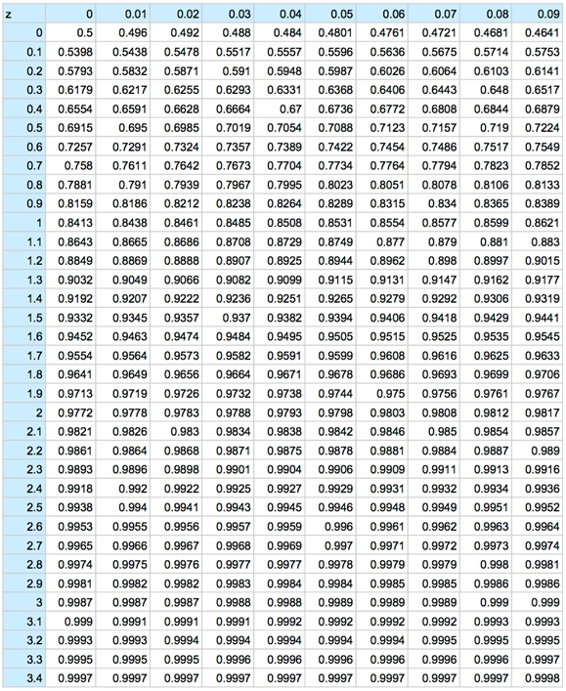
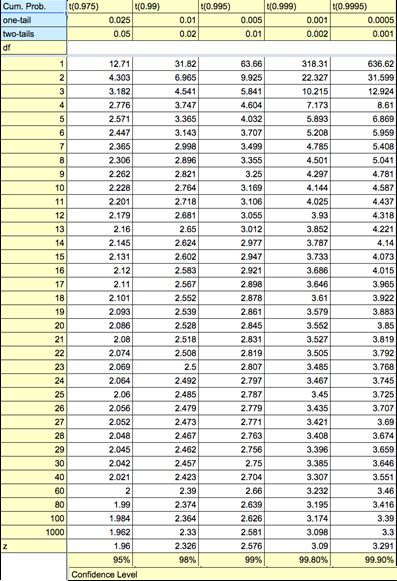
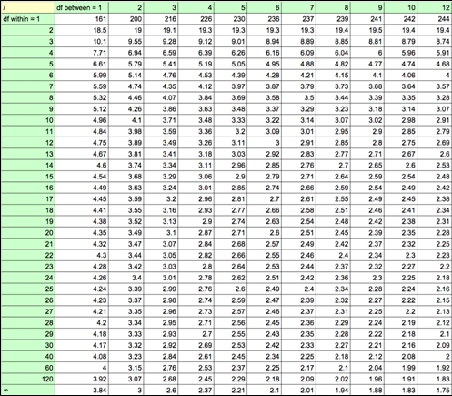
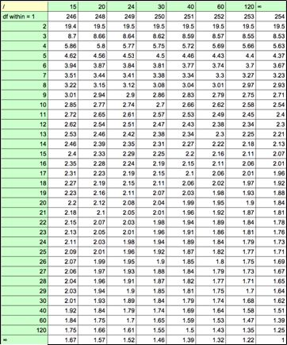
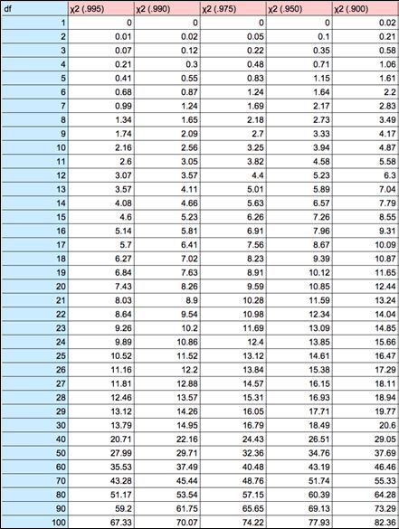

# 十二、附录

2002 年 NCES 教育纵向研究的变量

| 可变的 | 描述 | 价值观念 |
| 性别 | 学生性别。 | 0 =男性 1 =女性 |
| 人种 | 学生的比赛。 | 0 =白人，非西班牙裔 1 = Amer。印第安人/阿拉斯加土著人，非西班牙裔 2 =亚洲人，夏威夷/Pac。岛民，非西班牙裔 3 =黑人或非裔美国人，非西班牙裔 4 =西班牙裔，未指定种族 5 =西班牙裔，指定种族 6 =不止一个种族，非西班牙裔 |
| 社会经济地位（socioeconomic status 的缩写） | 基于五个同等权重变量的社会经济地位测量:父亲/监护人的教育、母亲/监护人的教育、家庭收入、父亲/监护人职业的声望和母亲/监护人职业的声望。这五个复合变量中的每一个都是在缺失时输入的。 | 最小值:-1.97 最高:1.82 平均值:0.12 标准偏差:0.73 |
| 试验 | 数学和阅读的平均标准化考试成绩。 | 最低:20.91 最高:81.04 平均值:52.68 中位数:53.21 标准偏差:9.53 |
| 家庭作业 | 每周花在校内和校外作业上的小时数。 | 最小值:0 最大:45 平均值:9.85 中位数:8 标准偏差:7.46 |
| 电视 _ 游戏 | 每个工作日花在看电视/视频或玩视频/电脑游戏上的平均小时数。 | 最小值:0 最大:8 平均值:3.44 中位数:3 标准偏差:2.39 |
| 工作 | 学生在学年中为工资而工作。 | 0 =否 1 =是 |
| 等级 | 学生因成绩好而被认可。 | 0 =否 1 =是 |
| 服务 | 学生获得社区服务奖或参加服务俱乐部。 | 0 =否 1 =是 |
| 运动 | 学生们参加了少年校队或大学校队级别的校际运动。 | 0 =否 1 =是 |
| 音乐 | 学生参加学校乐队、合唱团和/或学校戏剧或音乐剧。 | 0 =否 1 =是 |
| 学生 _ 政府 | 学生参与学生管理。 | 0 =否 1 =是 |
| 荣耀 | 学生参加了学术荣誉学会。 | 0 =否 1 =是 |
| 新闻工作 | 学生参与学校年鉴或报纸。 | 0 =否 1 =是 |
| 职业 | 学生参加职业教育俱乐部或学生组织。 | 0 =否 1 =是 |
| 收入 2011 | 2011 年就业收入。 | 最小值:0 最高:25 万+平均值:27，302 中位数:24，000 标准偏差:24，532.78 |

***关于该数据的信息:*** *数据下载自*[*【http://nces.ed.gov】*](http://nces.ed.gov)*。数据缺失的学生被从样本中移除。n = 8247。要访问电子表格，请访问*[*http://turnhower . org/free-教科书/street-smart-stats/after/*](http://turnthewheel.org/free-textbooks/street-smart-stats/afterward/)*并单击“资源”下的第一个链接*

## z 表

##  1

## t-表 2

## f-表 2

## T1】c2表 1

## c 2 表 2

* * *

[【1】](03.html#_ftnref1)[祖埃塞，e(2015)。*美国财富集中度:最富有的十分之一(10%)的美国人拥有美国 75%的土地。*全球化研究中心。](http://www.globalresearch.ca/u-s-wealth-concentration-wealthiest-tenth-10-of-americans-own-75-of-america/5461246)

[【2】](07.html#_ftnref2)关于“用户友好科学”包中包含的功能的信息可在[http://cran . r-project . org/web/packages/user friendly science/user friendly science . pdf](http://cran.r-project.org/web/packages/userfriendlyscience/userfriendlyscience.pdf)上找到。