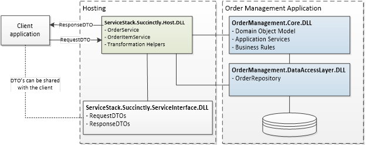

# 三、订单管理系统

在前一章中，我们介绍了 ServiceStack 的基础知识——它是什么以及它支持哪些功能。

在本章中，我们将花一些时间仔细构建我们的领域模型，并解释我们希望通过我们构建的服务实现什么。理解本章中的各个部分非常重要，因为接下来在[第 5 章](05.html#_Chapter_5_)中的实现会更加清晰。

## 订单管理系统

为了用一个具体的例子来演示 ServiceStack 的用法，我们将创建一个简单的订单管理系统，该系统远非完整，但足以开始使用。

订单管理系统将由三个 RESTful 网络服务实现，使其客户能够:

*   **订单服务**:创建、检索、更新和删除订单。
*   **订单项目服务**:管理各自的订单项目(检索、添加和删除)。
*   **产品服务**:创建、检索、更新和删除`Products`。

订单管理服务将被扩展，更多的特性和功能将被添加，例如身份验证、验证和依赖注入等。

### 应用领域模型

对象模型尽量简单。它的核心只有几类:`Order`、`OrderItem`、`Product`和`Status`。

#### 订单(订单类别)

一个`Order`包含一个`OrderItems`列表。订单的`Id`由系统自动生成。**版本**字段是一个特殊的字段，可以用来管理*乐观并发*在将数据保存到存储库中时——这个主题不在本书的讨论范围之内。`An` `Order` `can be *Active* or *Inactive*, and this is reflected through its` `Status` `.`

#### 订单项目(订单项目类别)

项目代表订单的一部分；它可以是任何食物或饮料(例如，比萨饼、啤酒或咖啡)。项目包含对`Product`的引用，并具有`Quantity`属性。

#### 产品

A `Product`代表`Order`的一部分，是一个参考类。 A `Product`可以是*活动*或*不活动*，这通过其`Status`体现出来。

#### 状态

`Status`类是引用数据类。在我们的应用程序中，它只有两种可能的状态:*活动的*和*不活动的*。

```cs
    public class Order
    {
        public int             Id           { get; set; }
        public bool            IsTakeAway  { get; set; }
        public DateTime        CreationDate { get; set; }
        public List<OrderItem> Items        { get; set; }
        public Status          Status       { get; set; }
        public int             Version      { get; set; }
    }

    public class OrderItem
    {
        public int     Id       { get; set; }
        public Product Product  { get; set; }
        public int     Quantity { get; set; }
        public int     Version  { get; set; }
    }

    public class Product
    {
        public int    Id      { get; set; }
        public string Name    { get; set; }
        public int    Version { get; set; }
        public Status Status { get; set; }
    }
    public class Status
    {
        public int    Id   { get; set; }
        public string Name { get; set; }
    }

```

## 模拟 URIs 和 HTTP 动词

公开的服务必须定义一个非常清晰的统一资源标识符(URI)结构和各自的 HTTP 动词。请记住，不是所有的动词都需要实现，但是我们选择合适的。

表 5 列出了`OrderService`暴露的操作。

表 5:公开的订单服务操作

| 上呼吸道感染 | HTTP 动词 | 描述 |
| --- | --- | --- |
| `/orders` | `GET` | 获取所有订单和相应项目的完整列表。 |
| `/orders` | `POST` | 创建新订单。 |
| `/orders/1234` | `GET` | 获取单个订单的详细信息。 |
| `/orders/1234` | `PUT` | 更新现有订单。 |
| `/orders/1234` | `DELETE` | 删除现有订单。 |

web 服务`OrderItemService`公开了与`Order`的`Items`集合相关的操作，如表 6 所示。

表 6:公开的 OrderItemService 操作

| 上呼吸道感染 | HTTP 动词 | 描述 |
| --- | --- | --- |
| `/orders/1234/items` | `GET` | 获取分配给订单的项目的完整列表。 |
| `/orders/1234/items/1` | `GET` | 获取分配给特定订单的项目。 |

`ProductService`显示与`Product`对象相关的操作，如表 7 所示。

表 7:公开的产品服务操作

| 上呼吸道感染 | HTTP 动词 | 描述 |
| --- | --- | --- |
| `/products` | `GET` | 获取所有可用产品的完整列表。 |
| `/products` | `POST` | 创建新产品。 |
| `/products/1234` | `GET` | 获取单个产品的详细信息。 |
| `/products/1234` | `PUT` | 更新现有产品。 |
| `/products/1234` | `DELETE` | 删除现有产品。 |

### 存储库:数据访问

为了使示例非常简短，我们将不在本书中讨论任何数据访问代码。所有伪数据库通信将通过特定的存储库[<sup>【20】</sup>](SS_0016.xhtml#_ftn20)(`OrderRepository`、`ProductRepository`)。因此，我们将在记忆中处理我们的订单。

通过使用 ServiceStack 的默认 Funq IoC 容器，存储库的实例将在运行时被直接注入到特定的 web 服务中。

### Visual Studio 项目结构

有许多方法可以将程序集分开，这通常取决于项目的需要。使用服务时，我通常会应用以下三条规则:

*   门面层应该是一个没有任何业务逻辑的薄层。
*   保持**应用程序**实现与**托管**应用程序分离。这在我们想要重用应用程序逻辑并以不同的方式公开它(例如，作为桌面应用程序、web 服务或 web 应用程序)的情况下非常有用。
*   将请求和响应 dto 保存在单独的程序集中，因为这可以与客户端共享(对于。NET 客户端)。



图 6:项目组织

#### ServiceStack。简洁地说。主持人

`ServiceStack.Succinctly.Host`是应用程序的入口点，也是唯一与客户端通信的组件。它包含公开的服务和所有必要的管道、布线、仪器等。这正是我们要使用服务栈框架功能的地方。

#### ServiceStack。简洁地说。服务接口

`ServiceStack.Succinctly.ServiceInterface`包含请求和响应 dto。该库可以直接与客户端应用程序共享，以简化数据的通信和转换。这个库不应该包含任何应用程序逻辑。

#### 订单管理。核心

`OrderManagement.Core`包含应用的领域模型和所需的业务逻辑、应用逻辑等。

#### 订单管理。DataAccessLayer

`OrderManagement.DataAccessLayer`包含访问数据库和相关存储库的逻辑。