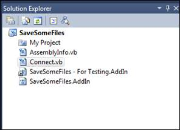

# 十四、工具窗口

Visual Studio 集成开发环境由许多不同的工具窗口组成，用于管理解决方案。您可以通过您的 **_applicationObject** 变量的**工具窗口**属性访问这些窗口。一些常用的窗口有专门为这些窗口编写的类，但是每个窗口都是可访问的，或者通过一个常用的类，或者通过 **GetToolWindow()** 方法。

## 错误列表

“错误列表”窗口包含最近编译或生成步骤遇到的所有错误、警告和消息。


图 13:错误列表

您可以使用“错误列表”窗口以编程方式访问错误消息。

```cs
    EnvDTE80.ErrorList errList = _applicationObject.ToolWindows.ErrorList;

```

错误列表对象包含三个布尔属性，指示哪些消息包含在错误列表中:

*   showeverrors
*   显示消息
*   显示警告

您可以切换这些属性来控制错误项目列表的内容。

## 任务列表

Visual Studio 提供了一个任务列表管理器，允许开发人员通过输入任务或在源代码中添加待办事项注释来构建任务列表。


图 14:任务列表管理器

您可以使用以下代码以编程方式访问**任务列表**窗口和您的附加程序的所有任务:

```cs
    EnvDTE.TaskList  TaskList  = _applicationObject.ToolWindows.TaskList;

```

任务列表对象允许您通过**默认注释记号**字符串属性读取或设置**默认注释记号**(通常为“待办事项”)。

与任务列表的主要接口是**任务项**对象。您可以使用整数**计数**属性找到列表中的项目数。您也可以通过使用**项目()**索引属性获得任何单个任务的详细信息。这将返回具有以下属性的单个任务项条目:

| 财产 | 数据类型 | 描述 |
| 种类 | 线 | 注释或用户任务 |
| 检查 | 布尔代数学体系的 | 任务项是否被选中？ |
| 描述 | 线 | 任务的描述性文本 |
| 显示的 | 布尔代数学体系的 | 任务项当前是否显示？ |
| 文件名 | 线 | 如果文件与任务相关联，则提供其完全限定的路径名 |
| 线条 | 整数 | 文件中找到待办事项注释的行号 |
| 优先 | 列举型别 | vstaskprioritylow、prioritymedium、PriorityHigh |

## 解决方案浏览器

**解决方案资源管理器**窗口显示一个树形视图 UI 元素，显示当前打开的解决方案，如下图所示:



图 15:解决方案浏览器

您可以使用以下代码访问**解决方案资源管理器**:

```cs
    EnvDTE.UIHierarchy SolExplore = _applicationObject.ToolWindows.SolutionExplorer

```

您可以使用 **UIHierarchyItems** 属性遍历**解决方案资源管理器**的树，以访问树显示的每个级别。每个项目代表视图中的一个元素。在我们前面的例子中，第一个层次项目是**保存一些文件**级别。该项目还有一个 **UIHierarchyItems** 集合，其中包含 **My Project** 项目、 **AssemblyInfo.vb** 项目、 **Connect.vb** 等。

## 输出窗口

**输出窗口**是一个文本窗口，显示各种 IDE 工具的输出，如构建过程、调试过程等。您可以使用**工具窗口**对象访问**输出窗口**，如下例所示:

```cs
    OutputWindow outWnd = _applicationObject.ToolWindows.OutputWindow;

```

每个工具都有自己的窗格，由用户通过下拉菜单选择。如果您想要一个地方来收集和显示来自您自己的工具的消息，您可以添加您自己的窗格。例如，以下代码添加了一个窗格来跟踪工具可能发现的用户界面问题:

```cs
    OutputWindowPane OutputPane = outWnd.OutputWindowPanes.Add("UI issue ");

```

## 搜索不良词汇

我们可以编写的另一个有用的插件模块是搜索解决方案的源项目，寻找一个“禁止的单词”列表。一个著名的 CAD 设计软件应用曾经包含一条消息(可能是程序员留下的)说:“这是一条消息，你这个白痴。”虽然程序员可能认为这很幽默，但不得不写道歉信并发送软件补丁版本的公司可能没有看到这种幽默。为了防止类似事件的发生，我们可以编写一个附加程序来搜索项目中的所有文件，并将任何出现的禁用词添加到错误列表中。我将把它定义为一个正则表达式常量，这样您就可以创建自己的单词列表。

对于这个附加程序，我们将向标准工具栏添加一个按钮。如果一个解决方案打开了，我们将扫描所有的项目，并在输出窗口中把不好的单词和位置添加到我们自己的窗格中。我们还将在任务列表中添加一个具有高优先级的条目来清理单词。

## 不良词汇扫描

我们仍将使用向导创建我们的基本附加程序，然后将我们的模块附加到 IDE 的标准工具栏上。让我们从以下内容开始启动向导:

*   Visual C#(或您喜欢的语言)。
*   应用宿主:仅限 Visual Studio。
*   名称/描述:*脏话**扫描文件中的脏话*。
*   创建用户界面菜单，不要在启动时加载。

向导生成类源文件后，将下列变量添加到类定义中。您可以通过将单词添加到单词列表字符串来自定义单词列表。

```cs
    const int RED_STAR_ICON = 6743;
    const string BAD_WORD_LIST = "(stupid|idiot|fool)";
    bool AddedToTaskList = false;

```

### 使用工具按钮

对于这个例子，我们将从工具栏而不是菜单项调用我们的附加程序模块。如果没有在 Visual Studio 中打开解决方案，我们也将禁用该项目，因为此附加程序会搜索具有解决方案的所有项目项，以便标记出现的不良单词列表。更改您的 **OnConnection** 方法代码，改为在标准工具栏上添加一个图标，如以下代码示例所示:

```cs
    // Add the command.
    Command cmd = (Command)_applicationObject.Commands.AddNamedCommand(_addInInstance,
                          "BadWords", "BadWords",
                          "Search for bad words", true, RED_STAR_ICON, null,
                          (int)vsCommandStatus.vsCommandStatusSupported +
                          (int)vsCommandStatus.vsCommandStatusEnabled);
    CommandBar stdCmdBar = null;
    // Reference the Visual Studio standard toolbar.
    CommandBars commandBars = (CommandBars)_applicationObject.CommandBars;
    foreach (CommandBar cb in commandBars)
         {
             if(cb.Name=="Standard")
             { stdCmdBar = cb;
               break;  }
          }
    // Add a button to the standard toolbar.
    CommandBarControl stdCmdBarCtl = (CommandBarControl)cmd.AddControl(stdCmdBar,
                                     stdCmdBar.Controls.Count + 1);
    // Set a caption for the toolbar button.
    stdCmdBarCtl.Caption = "Search for bad words";
    // Set the toolbar's button style to an icon button.
    CommandBarButton cmdBarBtn = (CommandBarButton)stdCmdBarCtl;
    cmdBarBtn.Style = MsoButtonStyle.msoButtonIcon;

```

### 仅当解决方案打开时

因为我们只想在解决方案打开时显示图标，所以我们需要在 **QueryStatus** 方法调用期间添加代码来检查该条件。

```cs
    if(commandName == "BadWords.Connect.BadWords")
    {
       if (_applicationObject.Solution.Count > 0)
          {
             status = (vsCommandStatus)vsCommandStatus.vsCommandStatusSupported |
                                       vsCommandStatus.vsCommandStatusEnabled;
           }
           return;
    }

```

### 获取工具窗口

在我们的 **Exec()** 方法中，我们希望确保一个解决方案是打开的，如果是，获取对**输出**窗口和任务列表的引用。我们还希望添加名为“不良词汇”的自定义窗格，并激活**输出**窗口，如以下代码示例所示:

```cs
    handled = true;
    if (_applicationObject.Solution.Count <1)
       {  MessageBox.Show("Please open a solution to scan...");
          return;  }
    // Need to get all project items and search for "bad words".
    OutputWindow outWnd = _applicationObject.ToolWindows.OutputWindow;
    TaskList theTasks = _applicationObject.ToolWindows.TaskList;
    OutputWindowPane OutputPane = outWnd.OutputWindowPanes.Add("Bad words");
    OutputPane.Clear();
    bool FoundBadWords = false;
    // Activate the output window.
    Window win = _applicationObject.Windows.Item(EnvDTE.Constants.vsWindowKindOutput);
    win.Activate();

```

### 循环浏览项目

我们现在已经准备好遍历解决方案和其中的所有项目。在每个项目中，我们搜索项目项。如果项目项附加了一个文档对象，并且文档项包含一个文本文档对象，那么我们找到了一个带有文本的文件(源文件、XML 配置文件等)。)我们应该扫描条目。有些文件(如程序集文件)没有文本文档对象，因此我们将跳过扫描这些文件。

```cs
    foreach (Project CurProject in _applicationObject.Solution)
    {
        foreach (ProjectItem CurItem in CurProject.ProjectItems)
           {
              Document theDoc = null;
              Try
              { theDoc = CurItem.Document;  }
              catch
              {  }
              if (theDoc != null)
                 {  TextDocument theText = (TextDocument)theDoc.Object("TextDocument");
                    if (theText != null)
                    {

```

### 标注脏话

使用文本文档对象的**标记文本**方法，我们应用正则表达式搜索来查看文件是否包含列表中的任何单词。行被书签标记，文件名被添加到我们的**输出**窗口。以下代码执行搜索任务:

```cs
    if (theText.MarkText(BAD_WORD_LIST,(int)vsFindOptions.vsFindOptionsRegularExpression))
       {
          OutputPane.OutputString(CurItem.Name + " contains bad words"+Environment.NewLine);
          FoundBadWords = true;
       }

```

### 添加清理任务

我们在这个过程中的最后一步是在任务列表中添加一个条目，提醒程序员清理包含不良单词的代码。我们只有在附加程序发现了不良单词并且我们还没有添加任务的情况下才会这样做。任务优先级和任务图标控制任务在任务中的外观，红色为高优先级项目。

```cs
    if (FoundBadWords && AddedToTaskList==false)
       {
         TaskItems2 TLItems = (TaskItems2)theTasks.TaskItems;
         TLItems.Add("Bad Words", "Bad Words", "Remove bad words " + BAD_WORD_LIST +
                                 " from source files",
         vsTaskPriority.vsTaskPriorityHigh, vsTaskIcon.vsTaskIconNone,
           true, null, 10, true, true);
           AddedToTaskList = true;
        }

```

当附加程序完成时，它会用您的不良单词列表中的单词标记所有行，并将文件列表添加到带有不良单词下拉窗格的输出窗口中。

## 总结

虽然**工具**窗口的焦点比一般的源编辑窗口更窄，但可用的对象类型为您的附加程序提供了与工具栏轻松集成的能力，因此您可以添加自定义输出、保存待办事项等。