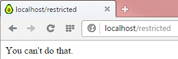

# 五、路由

本节介绍的源代码位于[比特桶存储库](https://bitbucket.org/syncfusiontech/web-servers-succinctly)的文件夹**示例\第 5 章**中。Visual Studio 解决方案文件位于**第 5 章\克利夫顿。WebServer** 文件夹。

现在是时候谈谈路由了。前面的例子仍然是针对静态 web 服务器的——我们没有办法挂钩到页面请求中，同样重要的是，根据请求中使用的动词做不同的事情，这对支持 AJAX 和 REST APIs 至关重要。

路由还与会话状态有些纠缠:

*   用户是否被授权查看页面？
*   会话是否已过期？
*   用户的角色是否赋予用户访问页面的权限？

例如，在 Ruby on Rails 中，授权通常是在控制器的超类中完成的，控制器的方法是通过路由表调用的。在 ASP.NET MVC 中，用户是否必须被授权是由装饰控制器方法的`authorize`属性决定的。同样，控制器方法是通过路由表调用的。角色以及其他因素也可以发挥作用，例如会话是否已过期。

使用了前面两种方法，并实现了专门的基类控制器，如`ExpirableController`和`AuthorizedRoleExpirableController`，我更喜欢的方法将路由从会话和授权/角色状态中分离出来，并采用更“功能性编程”的方法，而不是面向对象或属性修饰的方法。

这种方法与前面介绍的工作流范例配合得很好，因此具有良好的一致性。但是不讨论每种方法的优缺点，您应该会有一种感觉，web 服务器的设计中有真正由设计者决定的地方，并且作为 web 服务器架构的“用户”，您在这些设计决策中几乎没有发言权。

令人高兴的是，工作流范例确实给了您相当多的发言权，因为您实际上可以实现自己的路由和会话状态管理。这里提供的是一个例子，但是如果您想使用更面向对象的方法或反射来检查控制器上的授权要求，您当然可以实现它。

然而，路由与授权和会话管理纠缠在一起的原因是，嗯，这是有意义的。有些页面可以公开访问，或者可以通过适当的角色私下访问。大多数(如果不是全部的话)私人页面可能会过期。

因此，从声明的角度来看，定义页面(或 REST API 端点)的约束及其路由是有意义的。我在这里提议的实现是声明性地描述路由及其约束，并分别实现约束检查和路由的*过程*，而不是纠缠的实现。

## 路由条目

出于上述原因，路由条目将由三个“提供商”组成:

*   `SessionExpirationProvider`
*   `AuthorizationProvider`
*   `RoutingProvider`

这些提供程序与您想要的任何页面或 REST API 路径相关联。例如:

```cs
    public class RouteEntry
    {
      public Func<WorkflowContinuation<HttpListenerContext>,
                HttpListenerContext, Session, WorkflowState> SessionExpirationProvider;
      public Func<WorkflowContinuation<HttpListenerContext>,
                HttpListenerContext, Session, WorkflowState> AuthorizationProvider;
      public Func<WorkflowContinuation<HttpListenerContext>,
                HttpListenerContext, Session, WorkflowState> RoutingProvider;
    }

```

代码清单 42

请注意，提供者函数具有工作流流程的签名。

我们将在下一章讨论`Session`。

## 一个路由键

我们还需要一个路由“键”，它是路由字典的查找键——动词和路径:

```cs
    /// <summary>
    /// A structure consisting of the verb and path, suitable as a key for the route table entry.
    /// Key verbs are always converted to uppercase, paths are always converted to lowercase.
    /// </summary>
    public struct RouteKey
    {
      private string verb;
      private string path;

      public string Verb
      {
        get { return verb; }
        set { verb = value.ToUpper(); }
      }

      public string Path
      {
        get { return path; }
        set { path = value.ToLower(); }
      }

      public override string ToString()
      {
        return Verb + " : " + Path;
      }
    }

```

代码清单 43

## 路由表

路由表将路由关键字(动词和路径)与路由条目进行映射。为了确保线程安全，我们使用。NET 的`ConcurrentDictionary`，即使技术上，路由表初始化后也不应该修改。然而，我们不想将 web 服务器应用限制在这一点上——谁知道呢，您可能有一个非常好的理由通过路由处理器来修改路由表！

```cs
    public class RouteTable
    {
      protected ConcurrentDictionary<RouteKey, RouteEntry> routes;

      public RouteTable()
      {
        routes = new ConcurrentDictionary<RouteKey, RouteEntry>();
      }

      /// <summary>
      /// True if the routing table contains the verb-path key.
      /// </summary>
      public bool ContainsKey(RouteKey key)
      {
        return routes.ContainsKey(key);
      }

      /// <summary>
      /// True if the routing table contains the verb-path key.
      /// </summary>
      public bool Contains(string verb, string path)
      {
        return ContainsKey(NewKey(verb, path));
      }

      /// <summary>
      /// Add a unique route.
      /// </summary>
      public void AddRoute(RouteKey key, RouteEntry route)
      {
        routes.ThrowIfKeyExists(key, "The route key " + key.ToString() +
             " already   exists.")[key] = route;
        }

      /// <summary>
      /// Adds a unique route.
      /// </summary>
      public void AddRoute(string verb, string path, RouteEntry route)
      {
        AddRoute(NewKey(verb, path), route);
      }

      /// <summary>
      /// Get the route entry for the verb and path.
      /// </summary>
      public RouteEntry GetRouteEntry(RouteKey key)
      {
        return routes.ThrowIfKeyDoesNotExist(key, "The route key " + key.ToString() +
              " does not exist.")[key];
      }

      /// <summary>
      /// Get the route entry for the verb and path.
      /// </summary>
      public RouteEntry GetRouteEntry(string verb, string path)
      {
        return GetRouteEntry(NewKey(verb, path));
      }

      /// <summary>
      /// Returns true and populates the out entry parameter if the key exists.
      /// </summary>
      public bool TryGetRouteEntry(RouteKey key, out RouteEntry entry)
      {
        return routes.TryGetValue(key, out entry);
      }

      /// <summary>
      /// Returns true and populates the out entry parameter if the key exists.
      /// </summary>
      public bool TryGetRouteEntry(string verb, string path, out RouteEntry entry)
      {
        return routes.TryGetValue(NewKey(verb, path), out entry);
      }

      /// <summary>
      /// Create a RouteKey given the verb and path.
      /// </summary>
      public RouteKey NewKey(string verb, string path)
      {
        return new RouteKey() { Verb = verb, Path = path };
      }
    }

```

代码清单 44

## 路由处理器

路由处理程序将请求传递给提供的处理程序(如果有):

```cs
    /// <summary>
    /// Route requests to an application-defined handler.
    /// </summary>
    public class RouteHandler
    {
      protected RouteTable routeTable;   protected SessionManager sessionManager;

      public RouteHandler(RouteTable routeTable, SessionManager sessionManager)
      {
        this.routeTable = routeTable;     this.sessionManager = sessionManager;
      }

      /// <summary>
      /// Route the request. If no route exists, the workflow continues, otherwise,
      /// we return the route handler's continuation state.
      /// </summary>
      public WorkflowState Route(WorkflowContinuation<HttpListenerContext>
                 workflowContinuation, HttpListenerContext context)
      {
        WorkflowState ret = WorkflowState.Continue;
        RouteEntry entry = null;     Session session = sessionManager != null ? sessionManager[context] : null;

        if (routeTable.TryGetRouteEntry(context.Verb(), context.Path(), out entry))
        {
          if (entry.RoutingProvider != null)
          {
            ret = entry.RoutingProvider(workflowContinuation, context, session);
          }
        }

        return ret;
      }
    }

```

代码清单 45

请记住，我们将在下一章中研究会话和会话管理，因此现在我们可以忽略会话管理属性。

## 试试看

我们可以非常简单地测试这一点，为我们想要出错的页面编写一个处理程序:

```cs
    public static void InitializeRouteHandler()
    {
      routeTable = new RouteTable();
      routeTable.AddRoute("get", "restricted", new RouteEntry()
         {
           RoutingProvider = (continuation, context) =>
           {
             throw new ApplicationException("You can't do that.");
           }
         });
      routeHandler = new RouteHandler(routeTable);
    }

```

代码清单 46

这里我们利用之前实现的异常处理程序在浏览器窗口中显示消息。当我们请求这个页面(通过`get`)时，我们会得到消息“你不能这么做。”

我们将路由处理程序添加到工作流中:

```cs
    public static void InitializeWorkflow(string websitePath)
    {
      StaticContentLoader sph = new StaticContentLoader(websitePath);
      workflow = new Workflow<HttpListenerContext>(AbortHandler, OnException);
      workflow.AddItem(new WorkflowItem<HttpListenerContext>(LogIPAddress));
      workflow.AddItem(new WorkflowItem<HttpListenerContext>(WhiteList));
      workflow.AddItem(new WorkflowItem<HttpListenerContext>(requestHandler.Process));
     workflow.AddItem(new WorkflowItem<HttpListenerContext>(routeHandler.Route));
      workflow.AddItem(new WorkflowItem<HttpListenerContext>(sph.GetContent));
    }

```

代码清单 47

瞧啊。



图 8:路由示例

## 按内容类型划分的合格路由

通过内容类型来限定路由处理程序可能也很有用。假设您有一条路由，您需要处理`application/json`(比如说，来自 AJAX 调用)和`application/x-www-form-urlencoded`(比如说，来自表单发布)。除了动词和路径之外，还可以通过内容类型来限定路由。事实证明，一些网络服务器实际上并不支持这种能力，但是正如我们在第 10 章“T2”表单参数和 AJAX“T3”中看到的，“内容类型可能是一个有用的限定符。

**重要提示:**因为不是所有的 web 服务器都支持按内容类型的合格路由，你可能会发现你的 web 应用突然中断了！小心使用此功能。马克·拉弗勒写了一篇关于向 ASP.NET 网络应用编程接口添加内容类型路由的优秀文章。

## 结论

路由是编写处理程序的不同方法的一个很好的例子——你可以使用匿名方法，就像我以前做的那样，一个实例方法，或者一个静态方法。您可以添加扩展方法，或者只定义促进会话和身份验证检查重用的方法，我们将在下一章的会话中对此进行解释。此外，您应该对工作流模式的可重复性有所了解。在下一章中，我们将利用相同的会话和授权模式。